# Multivariate Visualization   


```r
library(tidyverse)
library(ggformula)
library(statthink)

# Add plot theme
theme_set(theme_statthinking())

# Import data
head(us_weather)
```

```
## # A tibble: 6 x 35
##   station date                dewpoint_avg drybulbtemp_avg relativehumidit…
##     <dbl> <dttm>                     <dbl>           <dbl>            <dbl>
## 1 7.25e10 2018-10-01 23:59:00           51              52               95
## 2 7.25e10 2018-10-02 23:59:00           59              60               96
## 3 7.25e10 2018-10-03 23:59:00           55              62               86
## 4 7.25e10 2018-10-04 23:59:00           56              60               77
## 5 7.25e10 2018-10-05 23:59:00           43              51               75
## 6 7.25e10 2018-10-06 23:59:00           62              63               90
## # … with 30 more variables: sealevelpressure_avg <dbl>,
## #   stationpressure_avg <dbl>, wetbulbtemp_avg <dbl>, windspeed_avg <dbl>,
## #   cooling_degree_days <dbl>, departure_from_normal_temperature <dbl>,
## #   heating_degree_days <dbl>, drybulbtemp_max <dbl>, drybulbtemp_min <dbl>,
## #   peak_wind_direction <dbl>, peak_wind_speed <dbl>, precipitation <dbl>,
## #   snow_depth <dbl>, snowfall <dbl>, wind_direction <dbl>, wind_speed <dbl>,
## #   weather_occurances <chr>, sunrise <dbl>, sunset <dbl>, month <ord>,
## #   month_numeric <dbl>, year <dbl>, day <int>, winter_group <chr>,
## #   location <chr>, fog <chr>, mist <chr>, drizzle <chr>, rain <chr>,
## #   snow <chr>
```

Real world data are never as simple as exploring a distribution of a single variable, particularly when trying to understand individual variation. In most cases things interact, move in tandem, and many phenomena help to explain the variable of interest. For example, when thinking about admission rates, what may be some important factors that would explain some of the reasons why higher education institutions differ in their admission rates? Take a few minutes to brainstorm some ideas.


```r
gf_histogram(~ drybulbtemp_avg, data = us_weather, bins = 30) %>% 
  gf_labs(x = "Average daily temperature, in Fahrenheit", 
          title = "Univariate distribution of average daily temperature")
```

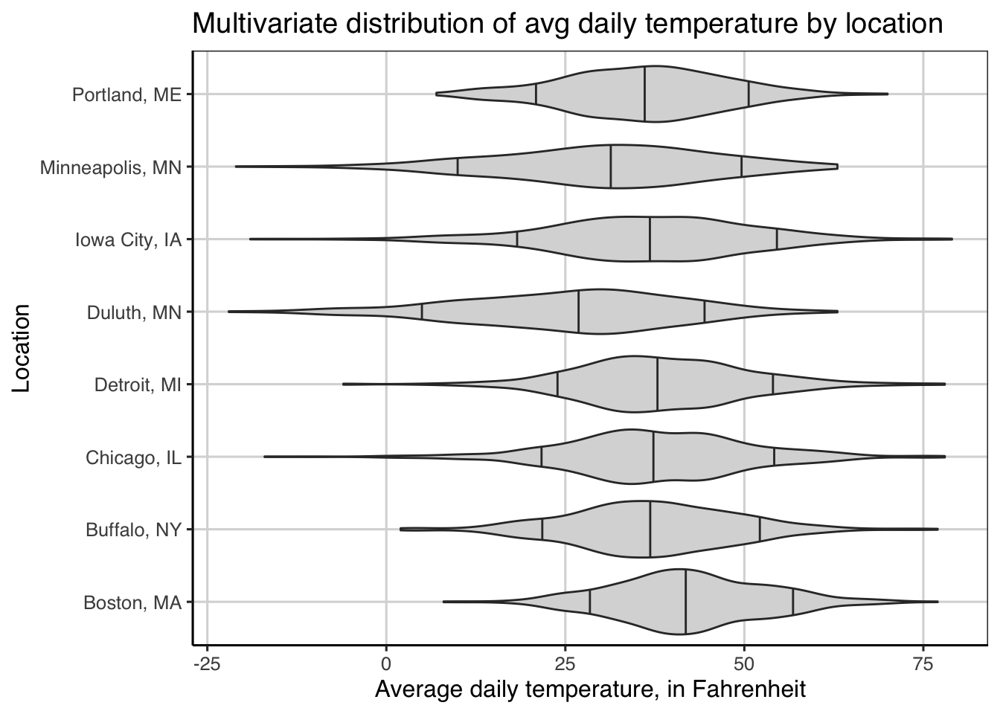

 


```r
gf_histogram(~ drybulbtemp_avg, data = us_weather, bins = 30, 
             fill = ~ factor(snow)) %>%
  gf_labs(x = "Average daily temperature, in Fahrenheit", 
          title = "Multivariate distribution of average daily temperature by whether it snowed that day",
          fill = "")
```

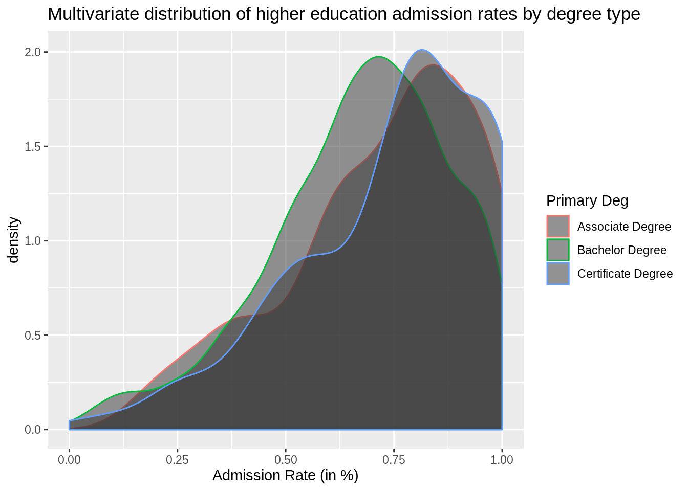

Often density plots are easier to visualize when there are more than one group. To plot more than one density curve, we need to specify the color argument instead of fill.


```r
gf_density(~ drybulbtemp_avg, data = us_weather, size = 1,
             color = ~ factor(snow)) %>%
  gf_labs(x = "Average daily temperature, in Fahrenheit", 
          title = "Multivariate distribution of average daily temperature by whether it snowed that day",
          color = "")
```


```r
gf_density(~ drybulbtemp_avg, data = us_weather, size = 1,
             fill = ~ factor(snow)) %>%
  gf_labs(x = "Average daily temperature, in Fahrenheit", 
          title = "Multivariate distribution of average daily temperature by whether it snowed that day",
          fill = "")
```


```r
gf_density(~ drybulbtemp_avg, data = us_weather, color = ~ factor(snow), 
           fill = ~ factor(snow), size = 1) %>%
  gf_labs(x = "Average daily temperature, in Fahrenheit", 
          title = "Multivariate distribution of average daily temperature by whether it snowed that day",
          fill = "",
          color = "")
```

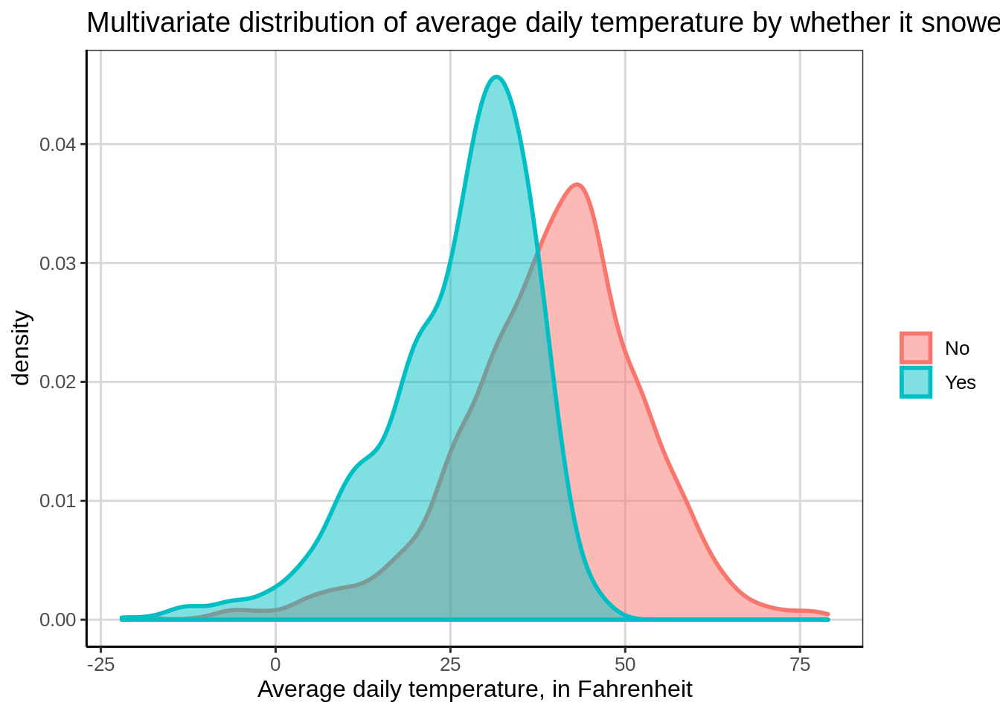


```r
gf_density(~ drybulbtemp_avg, data = us_weather, color = ~ factor(snow), 
           fill = 'gray75', size = 1) %>%
  gf_labs(x = "Average daily temperature, in Fahrenheit", 
          title = "Multivariate distribution of average daily temperature by whether it snowed that day",
          color = "")
```

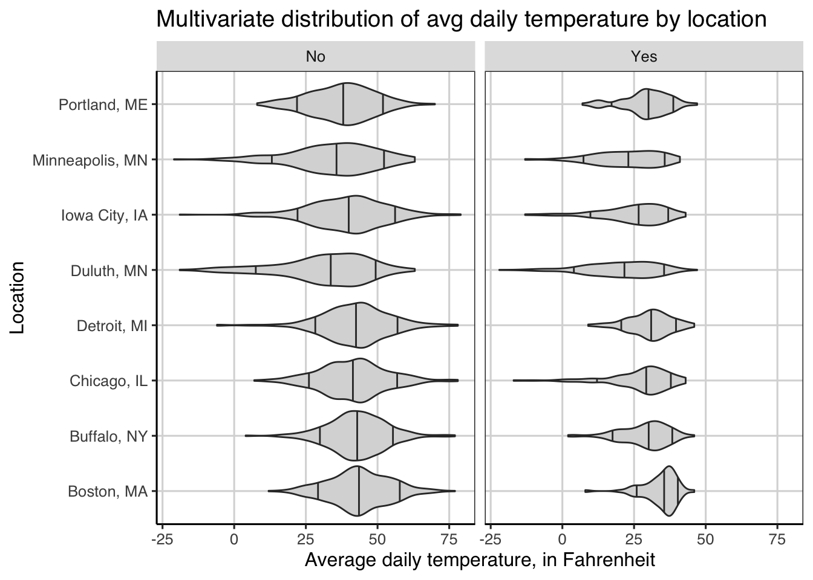
## Violin Plots
 
Violin plots are another way to make comparisons of distributions across groups. Violin plots are also easier to show more groups on a single graph. Violin plots are density plots that are mirrored to be fully enclosed. Best to explore with an example.


```r
gf_violin(drybulbtemp_avg ~ snow, data = us_weather) %>%
  gf_labs(y = "Average daily temperature, in Fahrenheit",
          title = 'Multivariate distribution of average daily temperature by whether it snowed that day',
          x = "Snow?")
```

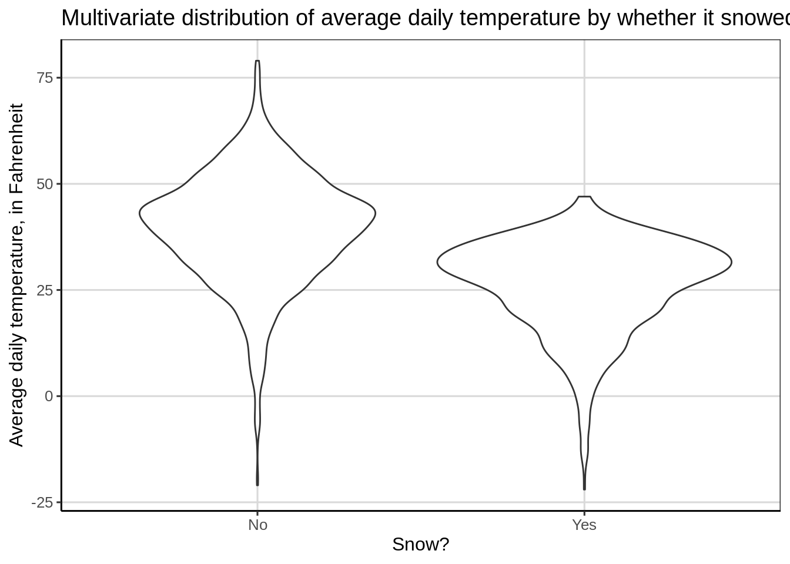


```r
gf_violin(drybulbtemp_avg ~ snow, data = us_weather) %>%
  gf_labs(y = "Average daily temperature, in Fahrenheit",
          title = 'Multivariate distribution of average daily temperature by whether it snowed that day',
          x = "Snow?") %>%
  gf_refine(coord_flip())
```

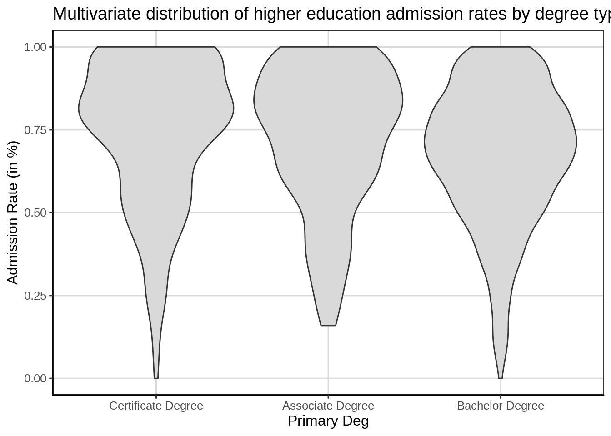

Aesthetically, these figures are a bit more pleasing to look at if they include a light fill color. This is done similar to the density plots shown above with the `fill = ` argument.


```r
gf_violin(drybulbtemp_avg ~ snow, data = us_weather, fill = 'gray85') %>%
  gf_labs(y = "Average daily temperature, in Fahrenheit",
          title = 'Multivariate distribution of average daily temperature by whether it snowed that day', 
          x = "Snow?") %>%
  gf_refine(coord_flip())
```

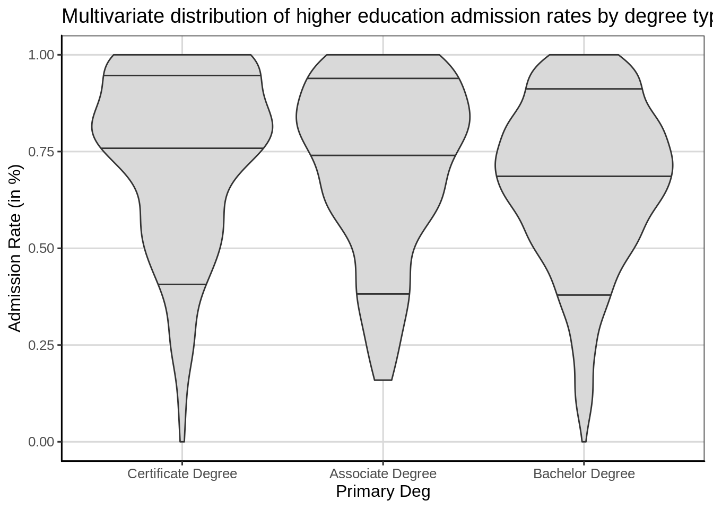

Adding quantiles are useful to aid in the comparison with the violin plots. These can be added with the `draw_quantiles` argument.


```r
gf_violin(drybulbtemp_avg ~ snow, data = us_weather, fill = 'gray85', 
          draw_quantiles = c(0.1, 0.5, 0.9)) %>%
  gf_labs(y = "Average daily temperature, in Fahrenheit",
          title = 'Multivariate distribution of average daily temperature by whether it snowed that day',
          x = "Snow?") %>%
  gf_refine(coord_flip())
```

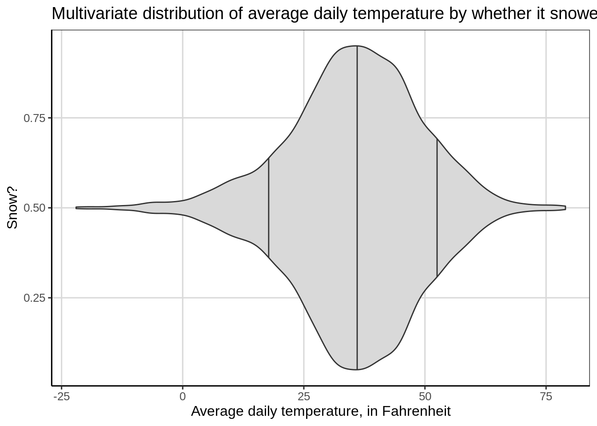
### Violin Plots with many groups
 
Many groups are more easily shown in the violin plot framework.

With many groups, it is often of interest to put the long x-axis labels representing each group on the y-axis so that it reads the correct direction and the labels do not run into each other. This can be done with the `gf_refine()` function with `coord_flip()`.


```r
gf_violin(drybulbtemp_avg ~ location, data = us_weather, fill = 'gray85', 
          draw_quantiles = c(.1, .5, .9)) %>%
  gf_labs(y = "Average daily temperature, in Fahrenheit",
          title = 'Multivariate distribution of average daily temperature by location',
          x = "Location") %>%
  gf_refine(coord_flip())
```

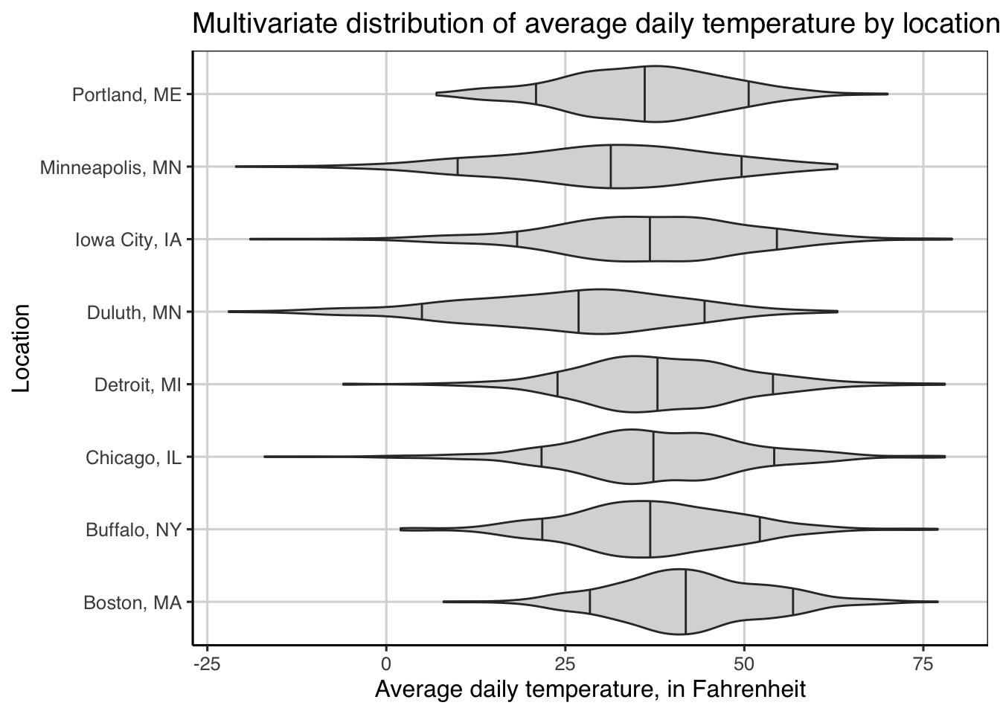

## Facetting
 
Facetting is another way to explore distributions of two or more variables.


```r
gf_violin(drybulbtemp_avg ~ location, data = us_weather, fill = 'gray85', 
          draw_quantiles = c(.1, .5, .9)) %>%
  gf_labs(y = "Average daily temperature, in Fahrenheit",
          title = 'Multivariate distribution of average daily temperature by location',
          x = "Location") %>%
  gf_refine(coord_flip()) %>%
  gf_facet_wrap(~ snow)
```

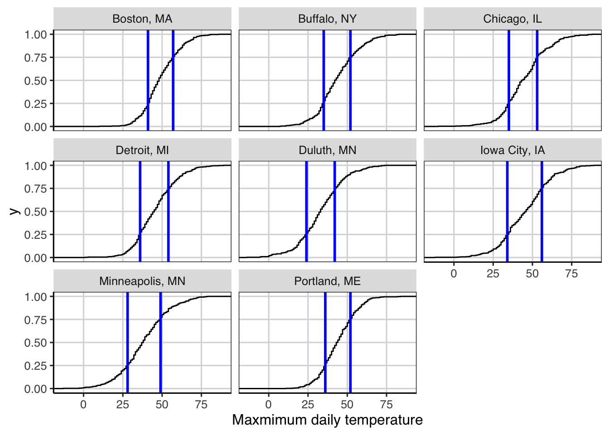


## Considering Groups
We've spent a lot of time trying to reason about other variables that may be important in explaining variation in our variable of interest. So far we have only explored the variable without considering other variables, in practice that is not that useful.

Instead, it is common to compute conditional statistics based on other characteristics in the data. An example may help to show the idea more clearly. 


```r
us_weather %>% 
  df_stats(drybulbtemp_max ~ location, median) 
```

```
##          location median_drybulbtemp_max
## 1      Boston, MA                     48
## 2     Buffalo, NY                     42
## 3     Chicago, IL                     43
## 4     Detroit, MI                     45
## 5      Duluth, MN                     33
## 6   Iowa City, IA                     46
## 7 Minneapolis, MN                     38
## 8    Portland, ME                     43
```

Presented above are the conditional medians for the higher education institutions in different areas of the country. More specifically, the data are essentially split into subgroups and the median is computed for each of those subgroups instead of pooling all institutions into a single data frame. The formula syntax is now `outcome ~ grouping` where the variable of interest (i.e. commonly a numeric variable) and the variable to the right of the `~` is the grouping variable. This syntax is similar to the violin plots that were created earlier. 

Can you see differences in the admission rates across the regions? 

One thing that is useful to add in when computing conditional statisics, is how many data points are in each group. This is particularly useful when the groups are different sizes, which is common. To do this, we can add another function to the `df_stats()` function. 


```r
us_weather %>% 
 df_stats(drybulbtemp_max ~ location, median, length) 
```

```
##          location median_drybulbtemp_max length_drybulbtemp_max
## 1      Boston, MA                     48                    425
## 2     Buffalo, NY                     42                    425
## 3     Chicago, IL                     43                    425
## 4     Detroit, MI                     45                    425
## 5      Duluth, MN                     33                    425
## 6   Iowa City, IA                     46                    425
## 7 Minneapolis, MN                     38                    425
## 8    Portland, ME                     43                    425
```

This adds another columns which represents the number of observations that went into the median calculation for each group. The syntax above also shows that you can add additional functions separated by a comma in the `df_stats()` function and are not limited to a single function. We will take advantage of this feature later on. 

### Adding additional groups 
What if we thought more than one variable was important in explaining variation in the outcome variable? These can also be added to the `df_stats()` function for additional conditional statistics. The key is to add another variable to the right-hand side of the formula argument. More than one variable are separated with a `+` symbol. 


```r
us_weather %>% 
   df_stats(drybulbtemp_max ~ location + month, median, length) 
```

```
##           location month median_drybulbtemp_max length_drybulbtemp_max
## 1       Boston, MA   Jan                   42.0                     62
## 2      Buffalo, NY   Jan                   35.0                     62
## 3      Chicago, IL   Jan                   33.5                     62
## 4      Detroit, MI   Jan                   35.0                     62
## 5       Duluth, MN   Jan                   21.0                     62
## 6    Iowa City, IA   Jan                   32.0                     62
## 7  Minneapolis, MN   Jan                   25.5                     62
## 8     Portland, ME   Jan                   35.5                     62
## 9       Boston, MA   Feb                   42.0                     57
## 10     Buffalo, NY   Feb                   35.0                     57
## 11     Chicago, IL   Feb                   35.0                     57
## 12     Detroit, MI   Feb                   35.0                     57
## 13      Duluth, MN   Feb                   23.0                     57
## 14   Iowa City, IA   Feb                   34.0                     57
## 15 Minneapolis, MN   Feb                   26.0                     57
## 16    Portland, ME   Feb                   37.0                     57
## 17      Boston, MA   Mar                   46.0                     62
## 18     Buffalo, NY   Mar                   43.5                     62
## 19     Chicago, IL   Mar                   47.0                     62
## 20     Detroit, MI   Mar                   46.0                     62
## 21      Duluth, MN   Mar                   37.0                     62
## 22   Iowa City, IA   Mar                   50.0                     62
## 23 Minneapolis, MN   Mar                   43.0                     62
## 24    Portland, ME   Mar                   44.0                     62
## 25      Boston, MA   Apr                   54.0                     60
## 26     Buffalo, NY   Apr                   50.0                     60
## 27     Chicago, IL   Apr                   57.5                     60
## 28     Detroit, MI   Apr                   58.0                     60
## 29      Duluth, MN   Apr                   46.0                     60
## 30   Iowa City, IA   Apr                   61.0                     60
## 31 Minneapolis, MN   Apr                   54.5                     60
## 32    Portland, ME   Apr                   52.5                     60
## 33      Boston, MA   Oct                   62.5                     62
## 34     Buffalo, NY   Oct                   58.0                     62
## 35     Chicago, IL   Oct                   58.0                     62
## 36     Detroit, MI   Oct                   60.5                     62
## 37      Duluth, MN   Oct                   47.5                     62
## 38   Iowa City, IA   Oct                   60.0                     62
## 39 Minneapolis, MN   Oct                   52.0                     62
## 40    Portland, ME   Oct                   58.5                     62
## 41      Boston, MA   Nov                   49.0                     60
## 42     Buffalo, NY   Nov                   41.5                     60
## 43     Chicago, IL   Nov                   40.0                     60
## 44     Detroit, MI   Nov                   41.0                     60
## 45      Duluth, MN   Nov                   30.0                     60
## 46   Iowa City, IA   Nov                   42.5                     60
## 47 Minneapolis, MN   Nov                   33.5                     60
## 48    Portland, ME   Nov                   42.5                     60
## 49      Boston, MA   Dec                   42.0                     62
## 50     Buffalo, NY   Dec                   37.5                     62
## 51     Chicago, IL   Dec                   41.0                     62
## 52     Detroit, MI   Dec                   41.0                     62
## 53      Duluth, MN   Dec                   28.0                     62
## 54   Iowa City, IA   Dec                   41.0                     62
## 55 Minneapolis, MN   Dec                   32.0                     62
## 56    Portland, ME   Dec                   36.0                     62
```

## Other statistics of center 
So far we have been discussing the median. The median attempts to provide a single number summary for the center of the distribution. It is a robust statistic, but likely isn't the most popular statistic to provide a location for the center of a distribution. The mean is often more commonly used as a measure of the center of a distribution. Part of this is due to the usage of the mean in common statistical methods and the mean also uses the values of all the data in the calculation. The median only considers the values of the middle score or scores, therefore this statistic is less sensitive to extreme values than the mean. I like to look at both statistics and this can provide some insight into the distribution of interest. We can add the mean using the `df_stats()` function by adding the function `mean`. 


```r
stats_compute <- us_weather %>% 
 df_stats(drybulbtemp_max ~ location, median, mean, length) 
stats_compute 
```

```
##          location median_drybulbtemp_max mean_drybulbtemp_max
## 1      Boston, MA                     48             49.11294
## 2     Buffalo, NY                     42             43.77176
## 3     Chicago, IL                     43             44.84706
## 4     Detroit, MI                     45             45.63529
## 5      Duluth, MN                     33             33.23765
## 6   Iowa City, IA                     46             45.40471
## 7 Minneapolis, MN                     38             38.08471
## 8    Portland, ME                     43             43.96000
##   length_drybulbtemp_max
## 1                    425
## 2                    425
## 3                    425
## 4                    425
## 5                    425
## 6                    425
## 7                    425
## 8                    425
```

Do you notice any trends in the direction the mean and median typically follow? More specifically, is the mean typically larger than the median or vice versa? 

Let's visualize them. 


```r
gf_histogram(~ drybulbtemp_max, data = us_weather, bins = 30) %>% 
  gf_facet_wrap(~ location) %>% 
  gf_vline(color = 'blue', xintercept = ~ median_drybulbtemp_max, 
           data = stats_compute, size = 1) %>% 
  gf_vline(color = 'lightblue', xintercept = ~ mean_drybulbtemp_max, 
           data = stats_compute, size = 1) %>%
  gf_labs(x = 'Maxmimum daily temperature')
```

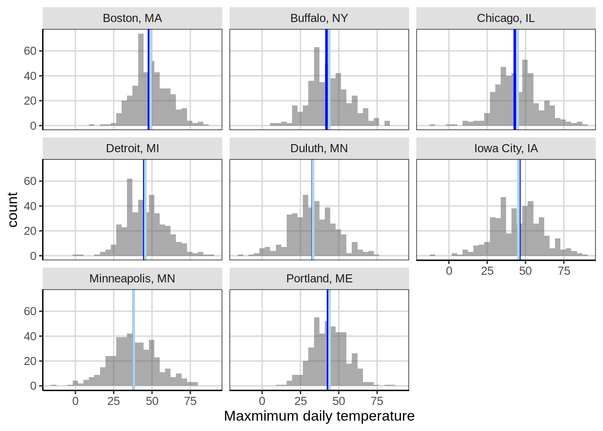

What is different about the distributions that have larger differences in the mean and median? 

## Measures of Variation 

So far we have focused primarily on applying functions to columns of data to provide a single numeric summary for where the center of the distribution may lie. The center of the distribution is important, however the primary goal in research and with statistics is to try to understand the variation in the distribution. 

One crude measure of variation that is intuitive is the range of a variable. The range is the difference between the smallest and the largest number in the data. We can compute this with the `df_stats()` function. 


```r
 us_weather %>% 
   df_stats(~ drybulbtemp_max, range) 
```

```
##   range_drybulbtemp_max_1 range_drybulbtemp_max_2
## 1                     -14                      89
```

The details of the `df_stats()` function are in the previous course notes. The output for this computation returns two values, the minimum and maximum value in the data and unsurprisingly, is 0 and 1 respectively.  

### Robust measure of variation 
The idea behind the IQR representing differences in percentiles allows us to extend this to different percentiles that may be more directly interpretable for a given situation. For example, suppose we wanted to know how spread out the middle 80% of the distribution is. We can do this directly by computing the 90th and 10th percentiles and finding the difference between the two. 


```r
 mid_80 <- us_weather %>% 
   df_stats(~ drybulbtemp_max, quantile(c(0.1, 0.9)), nice_names = TRUE) 
 mid_80 
```

```
##   X10. X90.
## 1   25   62
```

As you can see, once you extend the amount of the distribution contained, the distance increases, now to 0.555 or 55.5% the the range of the middle 80% of the admission rate distribution. We can also visualize what this looks like. 


```r
 gf_histogram(~ drybulbtemp_max, data = us_weather, 
              bins = 30, color = 'black') %>% 
   gf_vline(color = 'blue', xintercept = ~ value, 
            data = gather(mid_80), size = 1) %>%
  gf_labs(x = 'Maxmimum daily temperature')
```

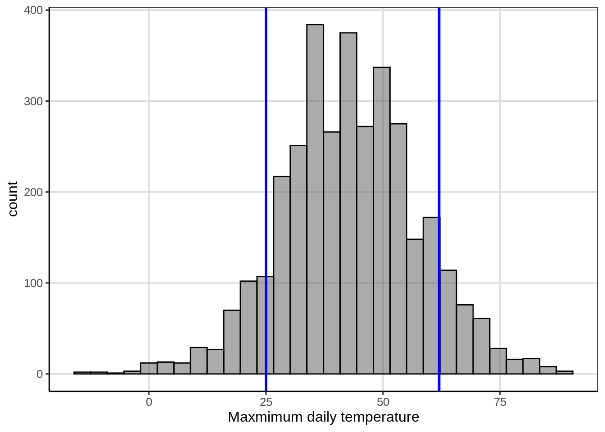

We can also view the exact percentages using the empirical cumulative density function. 


```r
 gf_ecdf(~ drybulbtemp_max, data = us_weather) %>% 
   gf_vline(color = 'blue', xintercept = ~ value, data = gather(mid_80), size = 1) %>%
  gf_labs(x = 'Maxmimum daily temperature')
```

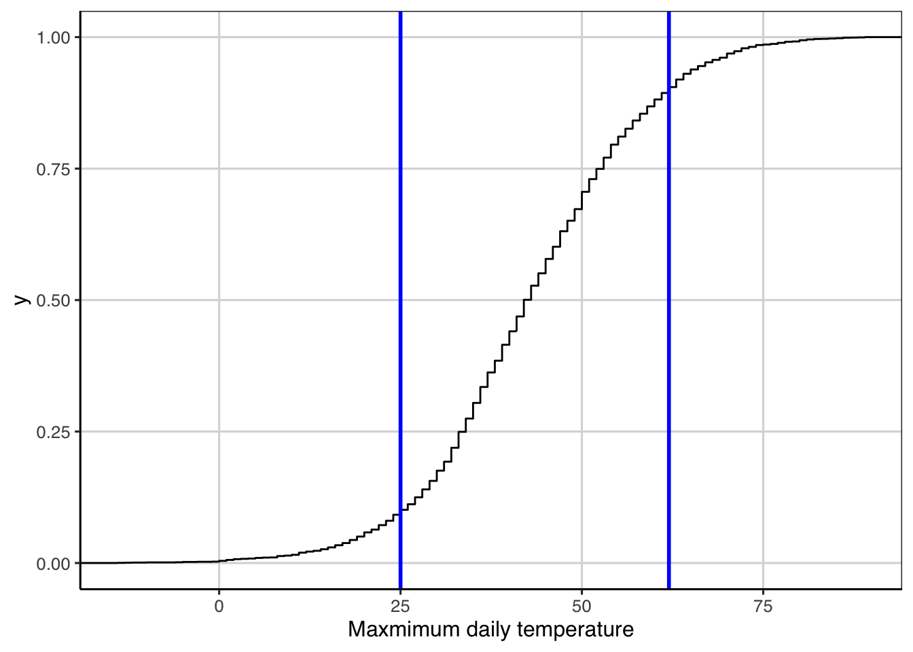

### Variation by Group 
These statistics can also be calculated by different grouping variables similar to what was done with statisitcs of center. Now the variable of interest is on the left-hand side of the equation and the grouping variable is on the right hand side. 


```r
 iqr_groups <- us_weather %>% 
   df_stats(drybulbtemp_max ~ location, IQR, quantile(c(0.25, 0.75)), 
            nice_names = TRUE) 
 iqr_groups 
```

```
##          location IQR_drybulbtemp_max X25. X75.
## 1      Boston, MA                  16   41   57
## 2     Buffalo, NY                  17   35   52
## 3     Chicago, IL                  18   35   53
## 4     Detroit, MI                  18   36   54
## 5      Duluth, MN                  18   24   42
## 6   Iowa City, IA                  22   34   56
## 7 Minneapolis, MN                  21   28   49
## 8    Portland, ME                  16   36   52
```

This can also be visualized to see how these statistics vary across the groups. 


```r
 gf_histogram(~ drybulbtemp_max, data = us_weather, bins = 30, color = 'black') %>% 
   gf_vline(color = 'blue', xintercept = ~ value,  
      data = filter(pivot_longer(iqr_groups, IQR_drybulbtemp_max:'X75.'), 
                    name %in% c('X25.', 'X75.')), size = 1) %>% 
   gf_facet_wrap(~ location) %>%
  gf_labs(x = 'Maxmimum daily temperature')
```

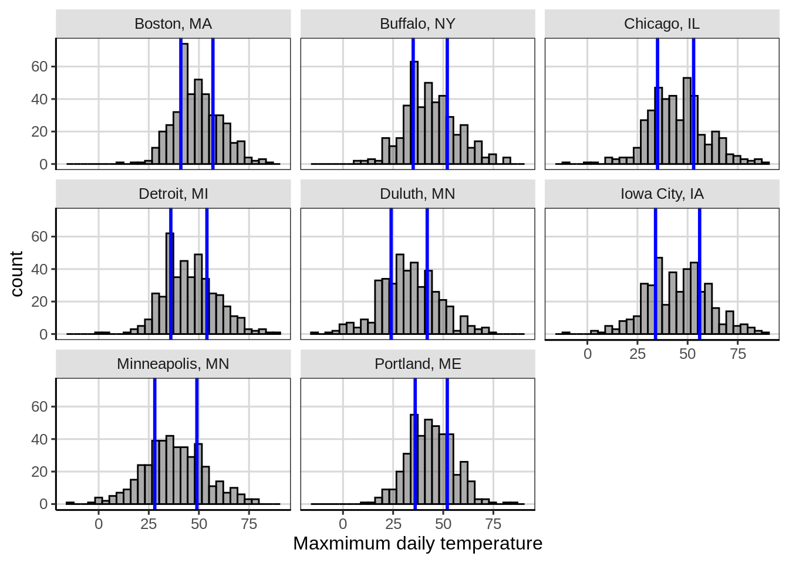


```r
 gf_ecdf(~ drybulbtemp_max, data = us_weather) %>% 
   gf_vline(color = 'blue', xintercept = ~ value,  
      data = filter(pivot_longer(iqr_groups, IQR_drybulbtemp_max:'X75.'), 
                    name %in% c('X25.', 'X75.')), size = 1) %>% 
   gf_facet_wrap(~ location) %>%
  gf_labs(x = 'Maxmimum daily temperature')
```

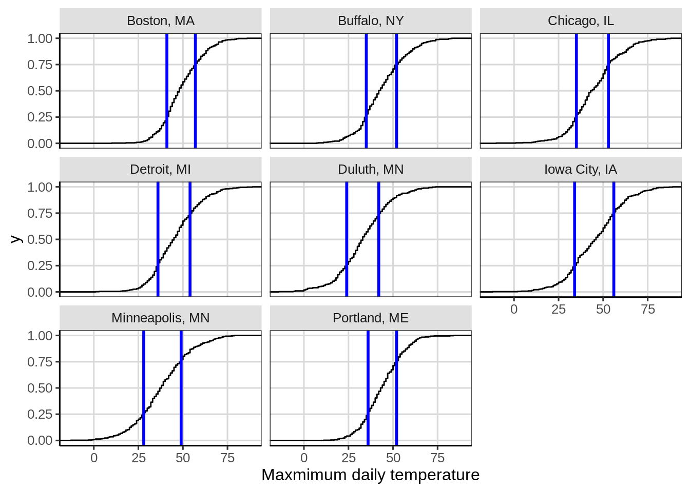
