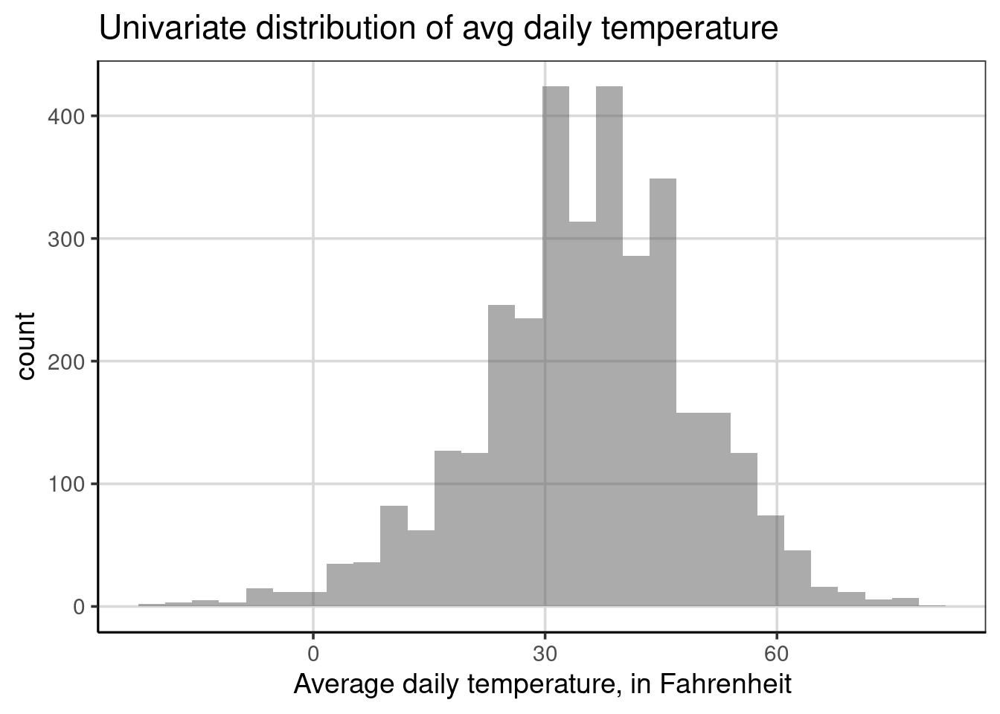
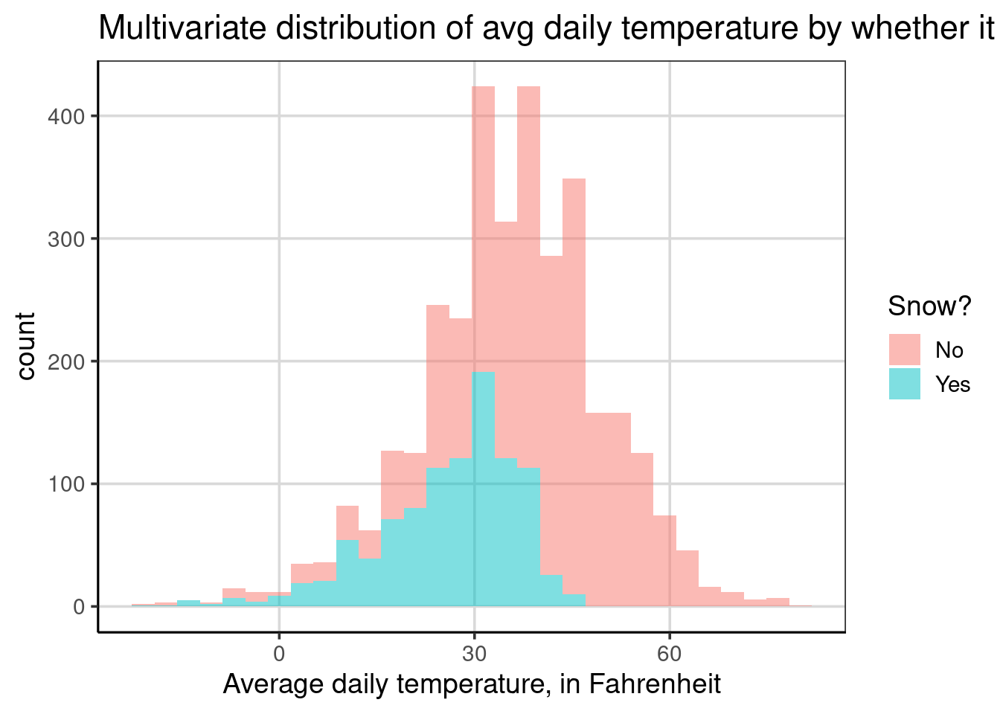
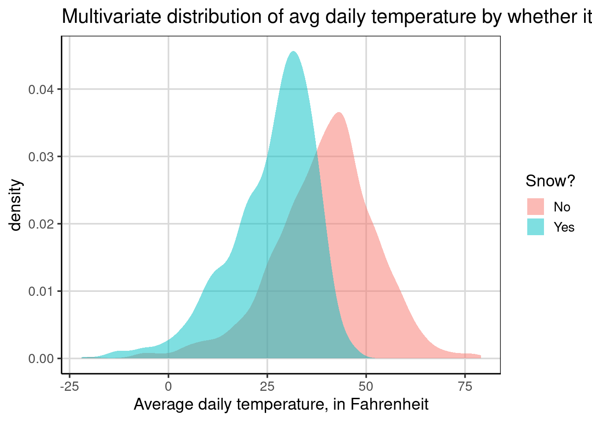
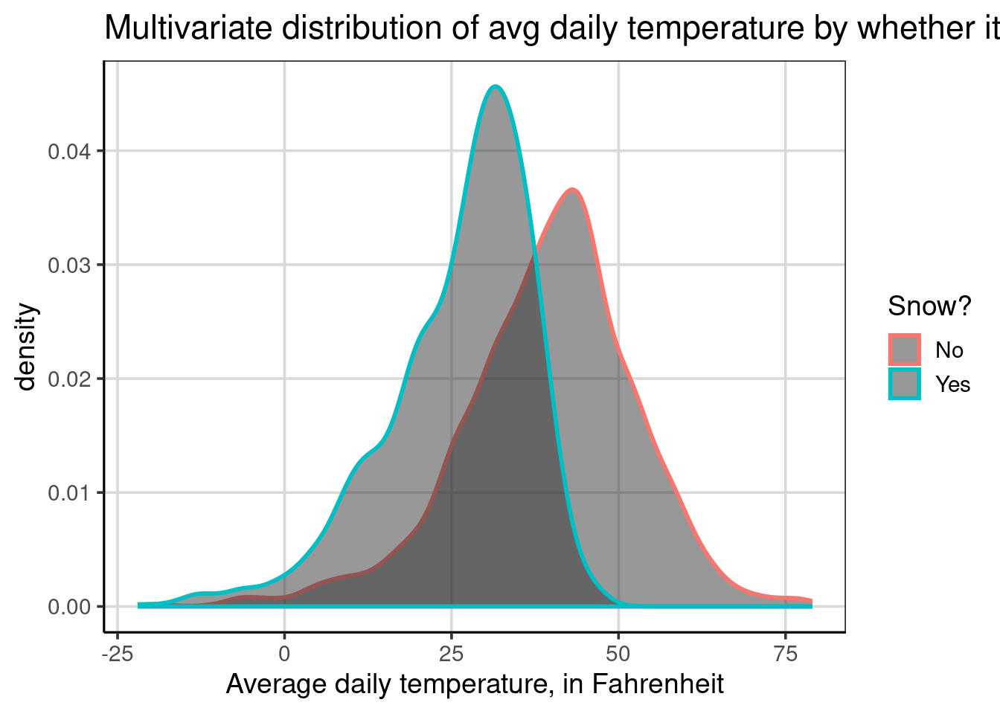
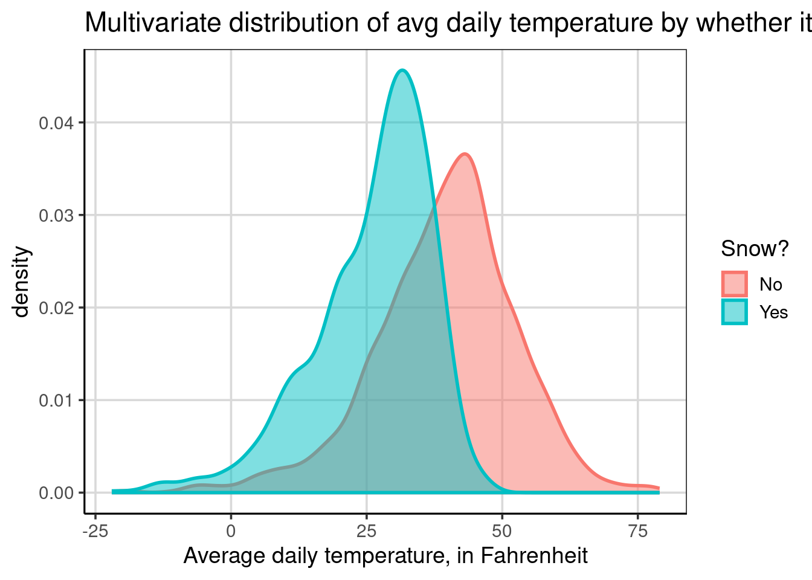
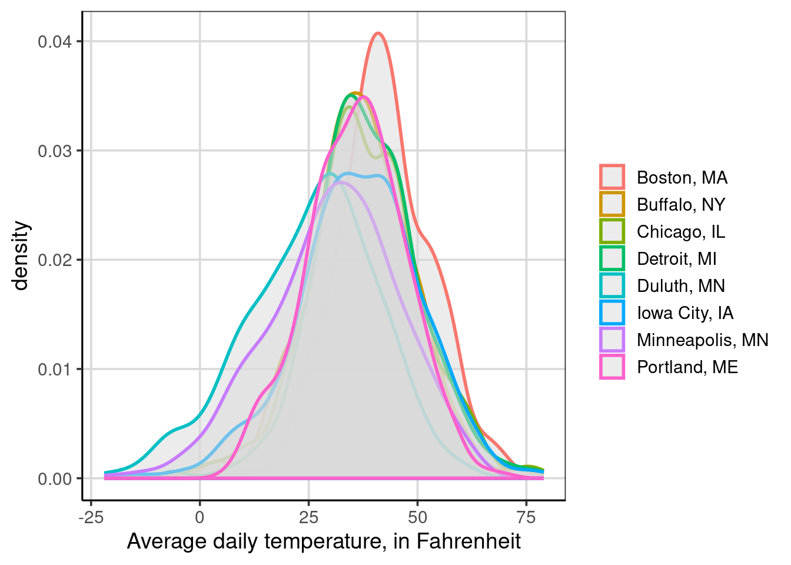
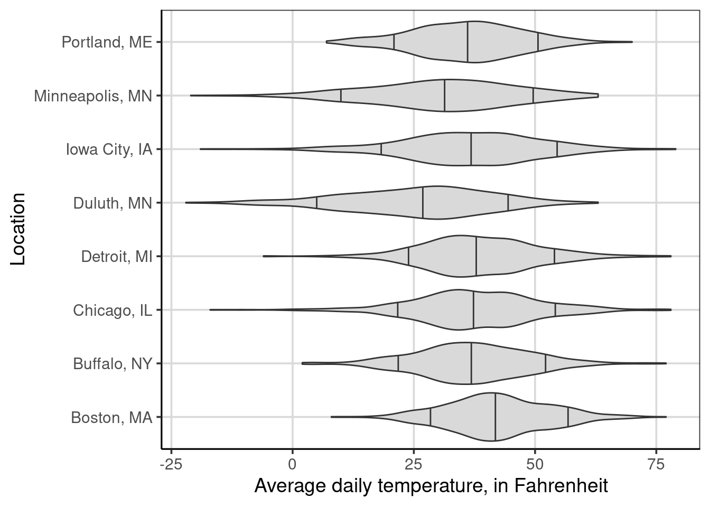
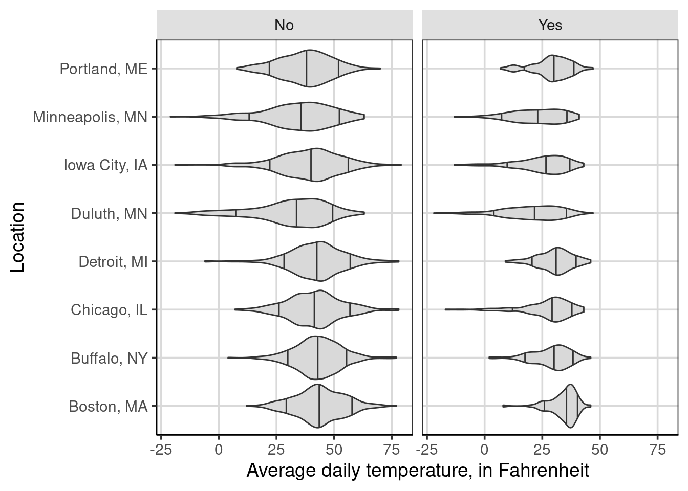
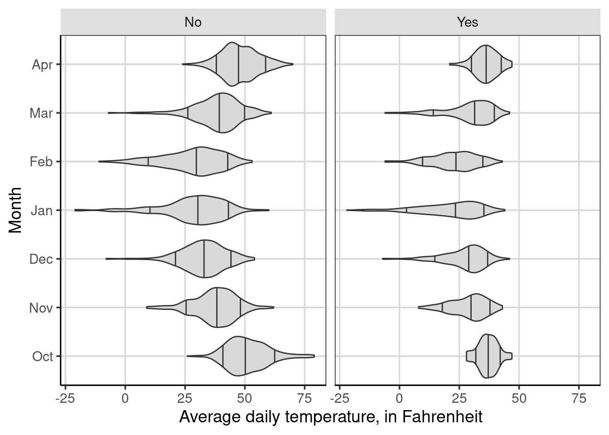

# Multivariate Visualization   


```r
library(tidyverse)
library(ggformula)
library(statthink)

# Add plot theme
theme_set(theme_statthinking())
```

Real world data are never as simple as exploring a distribution of a single variable, particularly when trying to understand individual variation. In most cases attributes interact with one another, move in tandem, and many phenomena help to explain the attribute of interest. For example, when thinking about admission rates of higher education institutions, what may be some important attributes that would explain some of the reasons why higher education institutions differ in their admission rates? When thinking about the high temperature for the given day, what attributes would be helpful to understand why the high temperature on a day is different? Take a few minutes to brainstorm some ideas.

Building off of the high temperature example, we will use weather data from two seasons of cooler months of the year, October through April of 2018-2019 and 2019-2020, of various locations around the United States. This data was downloaded from the [National Centers for Environmental Information (NCEI) Climate Data Online portal](https://www.ncdc.noaa.gov/cdo-web/) and is part of the companion package, `statthink`. The locations extracted in these data are found in the northern part of the United States and include: c("Buffalo, NY", "Iowa City, IA", "Chicago, IL", "Boston, MA", "Portland, ME", "Minneapolis, MN", "Duluth, MN", "Detroit, MI"). The first few rows of the data are shown below.


```r
DT::datatable(us_weather)
```

<!--html_preserve--><div id="htmlwidget-04e8700f11de95257e1f" style="width:100%;height:auto;" class="datatables html-widget"></div>
<script type="application/json" data-for="htmlwidget-04e8700f11de95257e1f">{"x":{"filter":"none","data":[["1","2","3","4","5","6","7","8","9","10","11","12","13","14","15","16","17","18","19","20","21","22","23","24","25","26","27","28","29","30","31","32","33","34","35","36","37","38","39","40","41","42","43","44","45","46","47","48","49","50","51","52","53","54","55","56","57","58","59","60","61","62","63","64","65","66","67","68","69","70","71","72","73","74","75","76","77","78","79","80","81","82","83","84","85","86","87","88","89","90","91","92","93","94","95","96","97","98","99","100","101","102","103","104","105","106","107","108","109","110","111","112","113","114","115","116","117","118","119","120","121","122","123","124","125","126","127","128","129","130","131","132","133","134","135","136","137","138","139","140","141","142","143","144","145","146","147","148","149","150","151","152","153","154","155","156","157","158","159","160","161","162","163","164","165","166","167","168","169","170","171","172","173","174","175","176","177","178","179","180","181","182","183","184","185","186","187","188","189","190","191","192","193","194","195","196","197","198","199","200","201","202","203","204","205","206","207","208","209","210","211","212","213","214","215","216","217","218","219","220","221","222","223","224","225","226","227","228","229","230","231","232","233","234","235","236","237","238","239","240","241","242","243","244","245","246","247","248","249","250","251","252","253","254","255","256","257","258","259","260","261","262","263","264","265","266","267","268","269","270","271","272","273","274","275","276","277","278","279","280","281","282","283","284","285","286","287","288","289","290","291","292","293","294","295","296","297","298","299","300","301","302","303","304","305","306","307","308","309","310","311","312","313","314","315","316","317","318","319","320","321","322","323","324","325","326","327","328","329","330","331","332","333","334","335","336","337","338","339","340","341","342","343","344","345","346","347","348","349","350","351","352","353","354","355","356","357","358","359","360","361","362","363","364","365","366","367","368","369","370","371","372","373","374","375","376","377","378","379","380","381","382","383","384","385","386","387","388","389","390","391","392","393","394","395","396","397","398","399","400","401","402","403","404","405","406","407","408","409","410","411","412","413","414","415","416","417","418","419","420","421","422","423","424","425","426","427","428","429","430","431","432","433","434","435","436","437","438","439","440","441","442","443","444","445","446","447","448","449","450","451","452","453","454","455","456","457","458","459","460","461","462","463","464","465","466","467","468","469","470","471","472","473","474","475","476","477","478","479","480","481","482","483","484","485","486","487","488","489","490","491","492","493","494","495","496","497","498","499","500","501","502","503","504","505","506","507","508","509","510","511","512","513","514","515","516","517","518","519","520","521","522","523","524","525","526","527","528","529","530","531","532","533","534","535","536","537","538","539","540","541","542","543","544","545","546","547","548","549","550","551","552","553","554","555","556","557","558","559","560","561","562","563","564","565","566","567","568","569","570","571","572","573","574","575","576","577","578","579","580","581","582","583","584","585","586","587","588","589","590","591","592","593","594","595","596","597","598","599","600","601","602","603","604","605","606","607","608","609","610","611","612","613","614","615","616","617","618","619","620","621","622","623","624","625","626","627","628","629","630","631","632","633","634","635","636","637","638","639","640","641","642","643","644","645","646","647","648","649","650","651","652","653","654","655","656","657","658","659","660","661","662","663","664","665","666","667","668","669","670","671","672","673","674","675","676","677","678","679","680","681","682","683","684","685","686","687","688","689","690","691","692","693","694","695","696","697","698","699","700","701","702","703","704","705","706","707","708","709","710","711","712","713","714","715","716","717","718","719","720","721","722","723","724","725","726","727","728","729","730","731","732","733","734","735","736","737","738","739","740","741","742","743","744","745","746","747","748","749","750","751","752","753","754","755","756","757","758","759","760","761","762","763","764","765","766","767","768","769","770","771","772","773","774","775","776","777","778","779","780","781","782","783","784","785","786","787","788","789","790","791","792","793","794","795","796","797","798","799","800","801","802","803","804","805","806","807","808","809","810","811","812","813","814","815","816","817","818","819","820","821","822","823","824","825","826","827","828","829","830","831","832","833","834","835","836","837","838","839","840","841","842","843","844","845","846","847","848","849","850","851","852","853","854","855","856","857","858","859","860","861","862","863","864","865","866","867","868","869","870","871","872","873","874","875","876","877","878","879","880","881","882","883","884","885","886","887","888","889","890","891","892","893","894","895","896","897","898","899","900","901","902","903","904","905","906","907","908","909","910","911","912","913","914","915","916","917","918","919","920","921","922","923","924","925","926","927","928","929","930","931","932","933","934","935","936","937","938","939","940","941","942","943","944","945","946","947","948","949","950","951","952","953","954","955","956","957","958","959","960","961","962","963","964","965","966","967","968","969","970","971","972","973","974","975","976","977","978","979","980","981","982","983","984","985","986","987","988","989","990","991","992","993","994","995","996","997","998","999","1000","1001","1002","1003","1004","1005","1006","1007","1008","1009","1010","1011","1012","1013","1014","1015","1016","1017","1018","1019","1020","1021","1022","1023","1024","1025","1026","1027","1028","1029","1030","1031","1032","1033","1034","1035","1036","1037","1038","1039","1040","1041","1042","1043","1044","1045","1046","1047","1048","1049","1050","1051","1052","1053","1054","1055","1056","1057","1058","1059","1060","1061","1062","1063","1064","1065","1066","1067","1068","1069","1070","1071","1072","1073","1074","1075","1076","1077","1078","1079","1080","1081","1082","1083","1084","1085","1086","1087","1088","1089","1090","1091","1092","1093","1094","1095","1096","1097","1098","1099","1100","1101","1102","1103","1104","1105","1106","1107","1108","1109","1110","1111","1112","1113","1114","1115","1116","1117","1118","1119","1120","1121","1122","1123","1124","1125","1126","1127","1128","1129","1130","1131","1132","1133","1134","1135","1136","1137","1138","1139","1140","1141","1142","1143","1144","1145","1146","1147","1148","1149","1150","1151","1152","1153","1154","1155","1156","1157","1158","1159","1160","1161","1162","1163","1164","1165","1166","1167","1168","1169","1170","1171","1172","1173","1174","1175","1176","1177","1178","1179","1180","1181","1182","1183","1184","1185","1186","1187","1188","1189","1190","1191","1192","1193","1194","1195","1196","1197","1198","1199","1200","1201","1202","1203","1204","1205","1206","1207","1208","1209","1210","1211","1212","1213","1214","1215","1216","1217","1218","1219","1220","1221","1222","1223","1224","1225","1226","1227","1228","1229","1230","1231","1232","1233","1234","1235","1236","1237","1238","1239","1240","1241","1242","1243","1244","1245","1246","1247","1248","1249","1250","1251","1252","1253","1254","1255","1256","1257","1258","1259","1260","1261","1262","1263","1264","1265","1266","1267","1268","1269","1270","1271","1272","1273","1274","1275","1276","1277","1278","1279","1280","1281","1282","1283","1284","1285","1286","1287","1288","1289","1290","1291","1292","1293","1294","1295","1296","1297","1298","1299","1300","1301","1302","1303","1304","1305","1306","1307","1308","1309","1310","1311","1312","1313","1314","1315","1316","1317","1318","1319","1320","1321","1322","1323","1324","1325","1326","1327","1328","1329","1330","1331","1332","1333","1334","1335","1336","1337","1338","1339","1340","1341","1342","1343","1344","1345","1346","1347","1348","1349","1350","1351","1352","1353","1354","1355","1356","1357","1358","1359","1360","1361","1362","1363","1364","1365","1366","1367","1368","1369","1370","1371","1372","1373","1374","1375","1376","1377","1378","1379","1380","1381","1382","1383","1384","1385","1386","1387","1388","1389","1390","1391","1392","1393","1394","1395","1396","1397","1398","1399","1400","1401","1402","1403","1404","1405","1406","1407","1408","1409","1410","1411","1412","1413","1414","1415","1416","1417","1418","1419","1420","1421","1422","1423","1424","1425","1426","1427","1428","1429","1430","1431","1432","1433","1434","1435","1436","1437","1438","1439","1440","1441","1442","1443","1444","1445","1446","1447","1448","1449","1450","1451","1452","1453","1454","1455","1456","1457","1458","1459","1460","1461","1462","1463","1464","1465","1466","1467","1468","1469","1470","1471","1472","1473","1474","1475","1476","1477","1478","1479","1480","1481","1482","1483","1484","1485","1486","1487","1488","1489","1490","1491","1492","1493","1494","1495","1496","1497","1498","1499","1500","1501","1502","1503","1504","1505","1506","1507","1508","1509","1510","1511","1512","1513","1514","1515","1516","1517","1518","1519","1520","1521","1522","1523","1524","1525","1526","1527","1528","1529","1530","1531","1532","1533","1534","1535","1536","1537","1538","1539","1540","1541","1542","1543","1544","1545","1546","1547","1548","1549","1550","1551","1552","1553","1554","1555","1556","1557","1558","1559","1560","1561","1562","1563","1564","1565","1566","1567","1568","1569","1570","1571","1572","1573","1574","1575","1576","1577","1578","1579","1580","1581","1582","1583","1584","1585","1586","1587","1588","1589","1590","1591","1592","1593","1594","1595","1596","1597","1598","1599","1600","1601","1602","1603","1604","1605","1606","1607","1608","1609","1610","1611","1612","1613","1614","1615","1616","1617","1618","1619","1620","1621","1622","1623","1624","1625","1626","1627","1628","1629","1630","1631","1632","1633","1634","1635","1636","1637","1638","1639","1640","1641","1642","1643","1644","1645","1646","1647","1648","1649","1650","1651","1652","1653","1654","1655","1656","1657","1658","1659","1660","1661","1662","1663","1664","1665","1666","1667","1668","1669","1670","1671","1672","1673","1674","1675","1676","1677","1678","1679","1680","1681","1682","1683","1684","1685","1686","1687","1688","1689","1690","1691","1692","1693","1694","1695","1696","1697","1698","1699","1700","1701","1702","1703","1704","1705","1706","1707","1708","1709","1710","1711","1712","1713","1714","1715","1716","1717","1718","1719","1720","1721","1722","1723","1724","1725","1726","1727","1728","1729","1730","1731","1732","1733","1734","1735","1736","1737","1738","1739","1740","1741","1742","1743","1744","1745","1746","1747","1748","1749","1750","1751","1752","1753","1754","1755","1756","1757","1758","1759","1760","1761","1762","1763","1764","1765","1766","1767","1768","1769","1770","1771","1772","1773","1774","1775","1776","1777","1778","1779","1780","1781","1782","1783","1784","1785","1786","1787","1788","1789","1790","1791","1792","1793","1794","1795","1796","1797","1798","1799","1800","1801","1802","1803","1804","1805","1806","1807","1808","1809","1810","1811","1812","1813","1814","1815","1816","1817","1818","1819","1820","1821","1822","1823","1824","1825","1826","1827","1828","1829","1830","1831","1832","1833","1834","1835","1836","1837","1838","1839","1840","1841","1842","1843","1844","1845","1846","1847","1848","1849","1850","1851","1852","1853","1854","1855","1856","1857","1858","1859","1860","1861","1862","1863","1864","1865","1866","1867","1868","1869","1870","1871","1872","1873","1874","1875","1876","1877","1878","1879","1880","1881","1882","1883","1884","1885","1886","1887","1888","1889","1890","1891","1892","1893","1894","1895","1896","1897","1898","1899","1900","1901","1902","1903","1904","1905","1906","1907","1908","1909","1910","1911","1912","1913","1914","1915","1916","1917","1918","1919","1920","1921","1922","1923","1924","1925","1926","1927","1928","1929","1930","1931","1932","1933","1934","1935","1936","1937","1938","1939","1940","1941","1942","1943","1944","1945","1946","1947","1948","1949","1950","1951","1952","1953","1954","1955","1956","1957","1958","1959","1960","1961","1962","1963","1964","1965","1966","1967","1968","1969","1970","1971","1972","1973","1974","1975","1976","1977","1978","1979","1980","1981","1982","1983","1984","1985","1986","1987","1988","1989","1990","1991","1992","1993","1994","1995","1996","1997","1998","1999","2000","2001","2002","2003","2004","2005","2006","2007","2008","2009","2010","2011","2012","2013","2014","2015","2016","2017","2018","2019","2020","2021","2022","2023","2024","2025","2026","2027","2028","2029","2030","2031","2032","2033","2034","2035","2036","2037","2038","2039","2040","2041","2042","2043","2044","2045","2046","2047","2048","2049","2050","2051","2052","2053","2054","2055","2056","2057","2058","2059","2060","2061","2062","2063","2064","2065","2066","2067","2068","2069","2070","2071","2072","2073","2074","2075","2076","2077","2078","2079","2080","2081","2082","2083","2084","2085","2086","2087","2088","2089","2090","2091","2092","2093","2094","2095","2096","2097","2098","2099","2100","2101","2102","2103","2104","2105","2106","2107","2108","2109","2110","2111","2112","2113","2114","2115","2116","2117","2118","2119","2120","2121","2122","2123","2124","2125","2126","2127","2128","2129","2130","2131","2132","2133","2134","2135","2136","2137","2138","2139","2140","2141","2142","2143","2144","2145","2146","2147","2148","2149","2150","2151","2152","2153","2154","2155","2156","2157","2158","2159","2160","2161","2162","2163","2164","2165","2166","2167","2168","2169","2170","2171","2172","2173","2174","2175","2176","2177","2178","2179","2180","2181","2182","2183","2184","2185","2186","2187","2188","2189","2190","2191","2192","2193","2194","2195","2196","2197","2198","2199","2200","2201","2202","2203","2204","2205","2206","2207","2208","2209","2210","2211","2212","2213","2214","2215","2216","2217","2218","2219","2220","2221","2222","2223","2224","2225","2226","2227","2228","2229","2230","2231","2232","2233","2234","2235","2236","2237","2238","2239","2240","2241","2242","2243","2244","2245","2246","2247","2248","2249","2250","2251","2252","2253","2254","2255","2256","2257","2258","2259","2260","2261","2262","2263","2264","2265","2266","2267","2268","2269","2270","2271","2272","2273","2274","2275","2276","2277","2278","2279","2280","2281","2282","2283","2284","2285","2286","2287","2288","2289","2290","2291","2292","2293","2294","2295","2296","2297","2298","2299","2300","2301","2302","2303","2304","2305","2306","2307","2308","2309","2310","2311","2312","2313","2314","2315","2316","2317","2318","2319","2320","2321","2322","2323","2324","2325","2326","2327","2328","2329","2330","2331","2332","2333","2334","2335","2336","2337","2338","2339","2340","2341","2342","2343","2344","2345","2346","2347","2348","2349","2350","2351","2352","2353","2354","2355","2356","2357","2358","2359","2360","2361","2362","2363","2364","2365","2366","2367","2368","2369","2370","2371","2372","2373","2374","2375","2376","2377","2378","2379","2380","2381","2382","2383","2384","2385","2386","2387","2388","2389","2390","2391","2392","2393","2394","2395","2396","2397","2398","2399","2400","2401","2402","2403","2404","2405","2406","2407","2408","2409","2410","2411","2412","2413","2414","2415","2416","2417","2418","2419","2420","2421","2422","2423","2424","2425","2426","2427","2428","2429","2430","2431","2432","2433","2434","2435","2436","2437","2438","2439","2440","2441","2442","2443","2444","2445","2446","2447","2448","2449","2450","2451","2452","2453","2454","2455","2456","2457","2458","2459","2460","2461","2462","2463","2464","2465","2466","2467","2468","2469","2470","2471","2472","2473","2474","2475","2476","2477","2478","2479","2480","2481","2482","2483","2484","2485","2486","2487","2488","2489","2490","2491","2492","2493","2494","2495","2496","2497","2498","2499","2500","2501","2502","2503","2504","2505","2506","2507","2508","2509","2510","2511","2512","2513","2514","2515","2516","2517","2518","2519","2520","2521","2522","2523","2524","2525","2526","2527","2528","2529","2530","2531","2532","2533","2534","2535","2536","2537","2538","2539","2540","2541","2542","2543","2544","2545","2546","2547","2548","2549","2550","2551","2552","2553","2554","2555","2556","2557","2558","2559","2560","2561","2562","2563","2564","2565","2566","2567","2568","2569","2570","2571","2572","2573","2574","2575","2576","2577","2578","2579","2580","2581","2582","2583","2584","2585","2586","2587","2588","2589","2590","2591","2592","2593","2594","2595","2596","2597","2598","2599","2600","2601","2602","2603","2604","2605","2606","2607","2608","2609","2610","2611","2612","2613","2614","2615","2616","2617","2618","2619","2620","2621","2622","2623","2624","2625","2626","2627","2628","2629","2630","2631","2632","2633","2634","2635","2636","2637","2638","2639","2640","2641","2642","2643","2644","2645","2646","2647","2648","2649","2650","2651","2652","2653","2654","2655","2656","2657","2658","2659","2660","2661","2662","2663","2664","2665","2666","2667","2668","2669","2670","2671","2672","2673","2674","2675","2676","2677","2678","2679","2680","2681","2682","2683","2684","2685","2686","2687","2688","2689","2690","2691","2692","2693","2694","2695","2696","2697","2698","2699","2700","2701","2702","2703","2704","2705","2706","2707","2708","2709","2710","2711","2712","2713","2714","2715","2716","2717","2718","2719","2720","2721","2722","2723","2724","2725","2726","2727","2728","2729","2730","2731","2732","2733","2734","2735","2736","2737","2738","2739","2740","2741","2742","2743","2744","2745","2746","2747","2748","2749","2750","2751","2752","2753","2754","2755","2756","2757","2758","2759","2760","2761","2762","2763","2764","2765","2766","2767","2768","2769","2770","2771","2772","2773","2774","2775","2776","2777","2778","2779","2780","2781","2782","2783","2784","2785","2786","2787","2788","2789","2790","2791","2792","2793","2794","2795","2796","2797","2798","2799","2800","2801","2802","2803","2804","2805","2806","2807","2808","2809","2810","2811","2812","2813","2814","2815","2816","2817","2818","2819","2820","2821","2822","2823","2824","2825","2826","2827","2828","2829","2830","2831","2832","2833","2834","2835","2836","2837","2838","2839","2840","2841","2842","2843","2844","2845","2846","2847","2848","2849","2850","2851","2852","2853","2854","2855","2856","2857","2858","2859","2860","2861","2862","2863","2864","2865","2866","2867","2868","2869","2870","2871","2872","2873","2874","2875","2876","2877","2878","2879","2880","2881","2882","2883","2884","2885","2886","2887","2888","2889","2890","2891","2892","2893","2894","2895","2896","2897","2898","2899","2900","2901","2902","2903","2904","2905","2906","2907","2908","2909","2910","2911","2912","2913","2914","2915","2916","2917","2918","2919","2920","2921","2922","2923","2924","2925","2926","2927","2928","2929","2930","2931","2932","2933","2934","2935","2936","2937","2938","2939","2940","2941","2942","2943","2944","2945","2946","2947","2948","2949","2950","2951","2952","2953","2954","2955","2956","2957","2958","2959","2960","2961","2962","2963","2964","2965","2966","2967","2968","2969","2970","2971","2972","2973","2974","2975","2976","2977","2978","2979","2980","2981","2982","2983","2984","2985","2986","2987","2988","2989","2990","2991","2992","2993","2994","2995","2996","2997","2998","2999","3000","3001","3002","3003","3004","3005","3006","3007","3008","3009","3010","3011","3012","3013","3014","3015","3016","3017","3018","3019","3020","3021","3022","3023","3024","3025","3026","3027","3028","3029","3030","3031","3032","3033","3034","3035","3036","3037","3038","3039","3040","3041","3042","3043","3044","3045","3046","3047","3048","3049","3050","3051","3052","3053","3054","3055","3056","3057","3058","3059","3060","3061","3062","3063","3064","3065","3066","3067","3068","3069","3070","3071","3072","3073","3074","3075","3076","3077","3078","3079","3080","3081","3082","3083","3084","3085","3086","3087","3088","3089","3090","3091","3092","3093","3094","3095","3096","3097","3098","3099","3100","3101","3102","3103","3104","3105","3106","3107","3108","3109","3110","3111","3112","3113","3114","3115","3116","3117","3118","3119","3120","3121","3122","3123","3124","3125","3126","3127","3128","3129","3130","3131","3132","3133","3134","3135","3136","3137","3138","3139","3140","3141","3142","3143","3144","3145","3146","3147","3148","3149","3150","3151","3152","3153","3154","3155","3156","3157","3158","3159","3160","3161","3162","3163","3164","3165","3166","3167","3168","3169","3170","3171","3172","3173","3174","3175","3176","3177","3178","3179","3180","3181","3182","3183","3184","3185","3186","3187","3188","3189","3190","3191","3192","3193","3194","3195","3196","3197","3198","3199","3200","3201","3202","3203","3204","3205","3206","3207","3208","3209","3210","3211","3212","3213","3214","3215","3216","3217","3218","3219","3220","3221","3222","3223","3224","3225","3226","3227","3228","3229","3230","3231","3232","3233","3234","3235","3236","3237","3238","3239","3240","3241","3242","3243","3244","3245","3246","3247","3248","3249","3250","3251","3252","3253","3254","3255","3256","3257","3258","3259","3260","3261","3262","3263","3264","3265","3266","3267","3268","3269","3270","3271","3272","3273","3274","3275","3276","3277","3278","3279","3280","3281","3282","3283","3284","3285","3286","3287","3288","3289","3290","3291","3292","3293","3294","3295","3296","3297","3298","3299","3300","3301","3302","3303","3304","3305","3306","3307","3308","3309","3310","3311","3312","3313","3314","3315","3316","3317","3318","3319","3320","3321","3322","3323","3324","3325","3326","3327","3328","3329","3330","3331","3332","3333","3334","3335","3336","3337","3338","3339","3340","3341","3342","3343","3344","3345","3346","3347","3348","3349","3350","3351","3352","3353","3354","3355","3356","3357","3358","3359","3360","3361","3362","3363","3364","3365","3366","3367","3368","3369","3370","3371","3372","3373","3374","3375","3376","3377","3378","3379","3380","3381","3382","3383","3384","3385","3386","3387","3388","3389","3390","3391","3392","3393","3394","3395","3396","3397","3398","3399","3400"],[72528014733,72528014733,72528014733,72528014733,72528014733,72528014733,72528014733,72528014733,72528014733,72528014733,72528014733,72528014733,72528014733,72528014733,72528014733,72528014733,72528014733,72528014733,72528014733,72528014733,72528014733,72528014733,72528014733,72528014733,72528014733,72528014733,72528014733,72528014733,72528014733,72528014733,72528014733,72528014733,72528014733,72528014733,72528014733,72528014733,72528014733,72528014733,72528014733,72528014733,72528014733,72528014733,72528014733,72528014733,72528014733,72528014733,72528014733,72528014733,72528014733,72528014733,72528014733,72528014733,72528014733,72528014733,72528014733,72528014733,72528014733,72528014733,72528014733,72528014733,72528014733,72528014733,72528014733,72528014733,72528014733,72528014733,72528014733,72528014733,72528014733,72528014733,72528014733,72528014733,72528014733,72528014733,72528014733,72528014733,72528014733,72528014733,72528014733,72528014733,72528014733,72528014733,72528014733,72528014733,72528014733,72528014733,72528014733,72528014733,72528014733,72528014733,72528014733,72528014733,72528014733,72528014733,72528014733,72528014733,72528014733,72528014733,72528014733,72528014733,72528014733,72528014733,72528014733,72528014733,72528014733,72528014733,72528014733,72528014733,72528014733,72528014733,72528014733,72528014733,72528014733,72528014733,72528014733,72528014733,72528014733,72528014733,72528014733,72528014733,72528014733,72528014733,72528014733,72528014733,72528014733,72528014733,72528014733,72528014733,72528014733,72528014733,72528014733,72528014733,72528014733,72528014733,72528014733,72528014733,72528014733,72528014733,72528014733,72528014733,72528014733,72528014733,72528014733,72528014733,72528014733,72528014733,72528014733,72528014733,72528014733,72528014733,72528014733,72528014733,72528014733,72528014733,72528014733,72528014733,72528014733,72528014733,72528014733,72528014733,72528014733,72528014733,72528014733,72528014733,72528014733,72528014733,72528014733,72528014733,72528014733,72528014733,72528014733,72528014733,72528014733,72528014733,72528014733,72528014733,72528014733,72528014733,72528014733,72528014733,72528014733,72528014733,72528014733,72528014733,72528014733,72528014733,72528014733,72528014733,72528014733,72528014733,72528014733,72528014733,72528014733,72528014733,72528014733,72528014733,72528014733,72528014733,72528014733,72528014733,72528014733,72528014733,72528014733,72528014733,72528014733,72528014733,72528014733,72528014733,72528014733,72528014733,72528014733,72528014733,72546214937,72546214937,72546214937,72546214937,72546214937,72546214937,72546214937,72546214937,72546214937,72546214937,72546214937,72546214937,72546214937,72546214937,72546214937,72546214937,72546214937,72546214937,72546214937,72546214937,72546214937,72546214937,72546214937,72546214937,72546214937,72546214937,72546214937,72546214937,72546214937,72546214937,72546214937,72546214937,72546214937,72546214937,72546214937,72546214937,72546214937,72546214937,72546214937,72546214937,72546214937,72546214937,72546214937,72546214937,72546214937,72546214937,72546214937,72546214937,72546214937,72546214937,72546214937,72546214937,72546214937,72546214937,72546214937,72546214937,72546214937,72546214937,72546214937,72546214937,72546214937,72546214937,72546214937,72546214937,72546214937,72546214937,72546214937,72546214937,72546214937,72546214937,72546214937,72546214937,72546214937,72546214937,72546214937,72546214937,72546214937,72546214937,72546214937,72546214937,72546214937,72546214937,72546214937,72546214937,72546214937,72546214937,72546214937,72546214937,72546214937,72546214937,72546214937,72546214937,72546214937,72546214937,72546214937,72546214937,72546214937,72546214937,72546214937,72546214937,72546214937,72546214937,72546214937,72546214937,72546214937,72546214937,72546214937,72546214937,72546214937,72546214937,72546214937,72546214937,72546214937,72546214937,72546214937,72546214937,72546214937,72546214937,72546214937,72546214937,72546214937,72546214937,72546214937,72546214937,72546214937,72546214937,72546214937,72546214937,72546214937,72546214937,72546214937,72546214937,72546214937,72546214937,72546214937,72546214937,72546214937,72546214937,72546214937,72546214937,72546214937,72546214937,72546214937,72546214937,72546214937,72546214937,72546214937,72546214937,72546214937,72546214937,72546214937,72546214937,72546214937,72546214937,72546214937,72546214937,72546214937,72546214937,72546214937,72546214937,72546214937,72546214937,72546214937,72546214937,72546214937,72546214937,72546214937,72546214937,72546214937,72546214937,72546214937,72546214937,72546214937,72546214937,72546214937,72546214937,72546214937,72546214937,72546214937,72546214937,72546214937,72546214937,72546214937,72546214937,72546214937,72546214937,72546214937,72546214937,72546214937,72546214937,72546214937,72546214937,72546214937,72546214937,72546214937,72546214937,72546214937,72546214937,72546214937,72546214937,72546214937,72546214937,72546214937,72546214937,72546214937,72546214937,72546214937,72546214937,72546214937,72546214937,72546214937,72546214937,72530094846,72530094846,72530094846,72530094846,72530094846,72530094846,72530094846,72530094846,72530094846,72530094846,72530094846,72530094846,72530094846,72530094846,72530094846,72530094846,72530094846,72530094846,72530094846,72530094846,72530094846,72530094846,72530094846,72530094846,72530094846,72530094846,72530094846,72530094846,72530094846,72530094846,72530094846,72530094846,72530094846,72530094846,72530094846,72530094846,72530094846,72530094846,72530094846,72530094846,72530094846,72530094846,72530094846,72530094846,72530094846,72530094846,72530094846,72530094846,72530094846,72530094846,72530094846,72530094846,72530094846,72530094846,72530094846,72530094846,72530094846,72530094846,72530094846,72530094846,72530094846,72530094846,72530094846,72530094846,72530094846,72530094846,72530094846,72530094846,72530094846,72530094846,72530094846,72530094846,72530094846,72530094846,72530094846,72530094846,72530094846,72530094846,72530094846,72530094846,72530094846,72530094846,72530094846,72530094846,72530094846,72530094846,72530094846,72530094846,72530094846,72530094846,72530094846,72530094846,72530094846,72530094846,72530094846,72530094846,72530094846,72530094846,72530094846,72530094846,72530094846,72530094846,72530094846,72530094846,72530094846,72530094846,72530094846,72530094846,72530094846,72530094846,72530094846,72530094846,72530094846,72530094846,72530094846,72530094846,72530094846,72530094846,72530094846,72530094846,72530094846,72530094846,72530094846,72530094846,72530094846,72530094846,72530094846,72530094846,72530094846,72530094846,72530094846,72530094846,72530094846,72530094846,72530094846,72530094846,72530094846,72530094846,72530094846,72530094846,72530094846,72530094846,72530094846,72530094846,72530094846,72530094846,72530094846,72530094846,72530094846,72530094846,72530094846,72530094846,72530094846,72530094846,72530094846,72530094846,72530094846,72530094846,72530094846,72530094846,72530094846,72530094846,72530094846,72530094846,72530094846,72530094846,72530094846,72530094846,72530094846,72530094846,72530094846,72530094846,72530094846,72530094846,72530094846,72530094846,72530094846,72530094846,72530094846,72530094846,72530094846,72530094846,72530094846,72530094846,72530094846,72530094846,72530094846,72530094846,72530094846,72530094846,72530094846,72530094846,72530094846,72530094846,72530094846,72530094846,72530094846,72530094846,72530094846,72530094846,72530094846,72530094846,72530094846,72530094846,72530094846,72530094846,72530094846,72530094846,72530094846,72530094846,72530094846,72530094846,72509014739,72509014739,72509014739,72509014739,72509014739,72509014739,72509014739,72509014739,72509014739,72509014739,72509014739,72509014739,72509014739,72509014739,72509014739,72509014739,72509014739,72509014739,72509014739,72509014739,72509014739,72509014739,72509014739,72509014739,72509014739,72509014739,72509014739,72509014739,72509014739,72509014739,72509014739,72509014739,72509014739,72509014739,72509014739,72509014739,72509014739,72509014739,72509014739,72509014739,72509014739,72509014739,72509014739,72509014739,72509014739,72509014739,72509014739,72509014739,72509014739,72509014739,72509014739,72509014739,72509014739,72509014739,72509014739,72509014739,72509014739,72509014739,72509014739,72509014739,72509014739,72509014739,72509014739,72509014739,72509014739,72509014739,72509014739,72509014739,72509014739,72509014739,72509014739,72509014739,72509014739,72509014739,72509014739,72509014739,72509014739,72509014739,72509014739,72509014739,72509014739,72509014739,72509014739,72509014739,72509014739,72509014739,72509014739,72509014739,72509014739,72509014739,72509014739,72509014739,72509014739,72509014739,72509014739,72509014739,72509014739,72509014739,72509014739,72509014739,72509014739,72509014739,72509014739,72509014739,72509014739,72509014739,72509014739,72509014739,72509014739,72509014739,72509014739,72509014739,72509014739,72509014739,72509014739,72509014739,72509014739,72509014739,72509014739,72509014739,72509014739,72509014739,72509014739,72509014739,72509014739,72509014739,72509014739,72509014739,72509014739,72509014739,72509014739,72509014739,72509014739,72509014739,72509014739,72509014739,72509014739,72509014739,72509014739,72509014739,72509014739,72509014739,72509014739,72509014739,72509014739,72509014739,72509014739,72509014739,72509014739,72509014739,72509014739,72509014739,72509014739,72509014739,72509014739,72509014739,72509014739,72509014739,72509014739,72509014739,72509014739,72509014739,72509014739,72509014739,72509014739,72509014739,72509014739,72509014739,72509014739,72509014739,72509014739,72509014739,72509014739,72509014739,72509014739,72509014739,72509014739,72509014739,72509014739,72509014739,72509014739,72509014739,72509014739,72509014739,72509014739,72509014739,72509014739,72509014739,72509014739,72509014739,72509014739,72509014739,72509014739,72509014739,72509014739,72509014739,72509014739,72509014739,72509014739,72509014739,72509014739,72509014739,72509014739,72509014739,72509014739,72509014739,72509014739,72509014739,72509014739,72509014739,72509014739,72509014739,72606014764,72606014764,72606014764,72606014764,72606014764,72606014764,72606014764,72606014764,72606014764,72606014764,72606014764,72606014764,72606014764,72606014764,72606014764,72606014764,72606014764,72606014764,72606014764,72606014764,72606014764,72606014764,72606014764,72606014764,72606014764,72606014764,72606014764,72606014764,72606014764,72606014764,72606014764,72606014764,72606014764,72606014764,72606014764,72606014764,72606014764,72606014764,72606014764,72606014764,72606014764,72606014764,72606014764,72606014764,72606014764,72606014764,72606014764,72606014764,72606014764,72606014764,72606014764,72606014764,72606014764,72606014764,72606014764,72606014764,72606014764,72606014764,72606014764,72606014764,72606014764,72606014764,72606014764,72606014764,72606014764,72606014764,72606014764,72606014764,72606014764,72606014764,72606014764,72606014764,72606014764,72606014764,72606014764,72606014764,72606014764,72606014764,72606014764,72606014764,72606014764,72606014764,72606014764,72606014764,72606014764,72606014764,72606014764,72606014764,72606014764,72606014764,72606014764,72606014764,72606014764,72606014764,72606014764,72606014764,72606014764,72606014764,72606014764,72606014764,72606014764,72606014764,72606014764,72606014764,72606014764,72606014764,72606014764,72606014764,72606014764,72606014764,72606014764,72606014764,72606014764,72606014764,72606014764,72606014764,72606014764,72606014764,72606014764,72606014764,72606014764,72606014764,72606014764,72606014764,72606014764,72606014764,72606014764,72606014764,72606014764,72606014764,72606014764,72606014764,72606014764,72606014764,72606014764,72606014764,72606014764,72606014764,72606014764,72606014764,72606014764,72606014764,72606014764,72606014764,72606014764,72606014764,72606014764,72606014764,72606014764,72606014764,72606014764,72606014764,72606014764,72606014764,72606014764,72606014764,72606014764,72606014764,72606014764,72606014764,72606014764,72606014764,72606014764,72606014764,72606014764,72606014764,72606014764,72606014764,72606014764,72606014764,72606014764,72606014764,72606014764,72606014764,72606014764,72606014764,72606014764,72606014764,72606014764,72606014764,72606014764,72606014764,72606014764,72606014764,72606014764,72606014764,72606014764,72606014764,72606014764,72606014764,72606014764,72606014764,72606014764,72606014764,72606014764,72606014764,72606014764,72606014764,72606014764,72606014764,72606014764,72606014764,72606014764,72606014764,72606014764,72606014764,72606014764,72606014764,72606014764,72606014764,72606014764,72606014764,72658014922,72658014922,72658014922,72658014922,72658014922,72658014922,72658014922,72658014922,72658014922,72658014922,72658014922,72658014922,72658014922,72658014922,72658014922,72658014922,72658014922,72658014922,72658014922,72658014922,72658014922,72658014922,72658014922,72658014922,72658014922,72658014922,72658014922,72658014922,72658014922,72658014922,72658014922,72658014922,72658014922,72658014922,72658014922,72658014922,72658014922,72658014922,72658014922,72658014922,72658014922,72658014922,72658014922,72658014922,72658014922,72658014922,72658014922,72658014922,72658014922,72658014922,72658014922,72658014922,72658014922,72658014922,72658014922,72658014922,72658014922,72658014922,72658014922,72658014922,72658014922,72658014922,72658014922,72658014922,72658014922,72658014922,72658014922,72658014922,72658014922,72658014922,72658014922,72658014922,72658014922,72658014922,72658014922,72658014922,72658014922,72658014922,72658014922,72658014922,72658014922,72658014922,72658014922,72658014922,72658014922,72658014922,72658014922,72658014922,72658014922,72658014922,72658014922,72658014922,72658014922,72658014922,72658014922,72658014922,72658014922,72658014922,72658014922,72658014922,72658014922,72658014922,72658014922,72658014922,72658014922,72658014922,72658014922,72658014922,72658014922,72658014922,72658014922,72658014922,72658014922,72658014922,72658014922,72658014922,72658014922,72658014922,72658014922,72658014922,72658014922,72658014922,72658014922,72658014922,72658014922,72658014922,72658014922,72658014922,72658014922,72658014922,72658014922,72658014922,72658014922,72658014922,72658014922,72658014922,72658014922,72658014922,72658014922,72658014922,72658014922,72658014922,72658014922,72658014922,72658014922,72658014922,72658014922,72658014922,72658014922,72658014922,72658014922,72658014922,72658014922,72658014922,72658014922,72658014922,72658014922,72658014922,72658014922,72658014922,72658014922,72658014922,72658014922,72658014922,72658014922,72658014922,72658014922,72658014922,72658014922,72658014922,72658014922,72658014922,72658014922,72658014922,72658014922,72658014922,72658014922,72658014922,72658014922,72658014922,72658014922,72658014922,72658014922,72658014922,72658014922,72658014922,72658014922,72658014922,72658014922,72658014922,72658014922,72658014922,72658014922,72658014922,72658014922,72658014922,72658014922,72658014922,72658014922,72658014922,72658014922,72658014922,72658014922,72658014922,72658014922,72658014922,72658014922,72658014922,72658014922,72658014922,72658014922,72658014922,72745014913,72745014913,72745014913,72745014913,72745014913,72745014913,72745014913,72745014913,72745014913,72745014913,72745014913,72745014913,72745014913,72745014913,72745014913,72745014913,72745014913,72745014913,72745014913,72745014913,72745014913,72745014913,72745014913,72745014913,72745014913,72745014913,72745014913,72745014913,72745014913,72745014913,72745014913,72745014913,72745014913,72745014913,72745014913,72745014913,72745014913,72745014913,72745014913,72745014913,72745014913,72745014913,72745014913,72745014913,72745014913,72745014913,72745014913,72745014913,72745014913,72745014913,72745014913,72745014913,72745014913,72745014913,72745014913,72745014913,72745014913,72745014913,72745014913,72745014913,72745014913,72745014913,72745014913,72745014913,72745014913,72745014913,72745014913,72745014913,72745014913,72745014913,72745014913,72745014913,72745014913,72745014913,72745014913,72745014913,72745014913,72745014913,72745014913,72745014913,72745014913,72745014913,72745014913,72745014913,72745014913,72745014913,72745014913,72745014913,72745014913,72745014913,72745014913,72745014913,72745014913,72745014913,72745014913,72745014913,72745014913,72745014913,72745014913,72745014913,72745014913,72745014913,72745014913,72745014913,72745014913,72745014913,72745014913,72745014913,72745014913,72745014913,72745014913,72745014913,72745014913,72745014913,72745014913,72745014913,72745014913,72745014913,72745014913,72745014913,72745014913,72745014913,72745014913,72745014913,72745014913,72745014913,72745014913,72745014913,72745014913,72745014913,72745014913,72745014913,72745014913,72745014913,72745014913,72745014913,72745014913,72745014913,72745014913,72745014913,72745014913,72745014913,72745014913,72745014913,72745014913,72745014913,72745014913,72745014913,72745014913,72745014913,72745014913,72745014913,72745014913,72745014913,72745014913,72745014913,72745014913,72745014913,72745014913,72745014913,72745014913,72745014913,72745014913,72745014913,72745014913,72745014913,72745014913,72745014913,72745014913,72745014913,72745014913,72745014913,72745014913,72745014913,72745014913,72745014913,72745014913,72745014913,72745014913,72745014913,72745014913,72745014913,72745014913,72745014913,72745014913,72745014913,72745014913,72745014913,72745014913,72745014913,72745014913,72745014913,72745014913,72745014913,72745014913,72745014913,72745014913,72745014913,72745014913,72745014913,72745014913,72745014913,72745014913,72745014913,72745014913,72745014913,72745014913,72745014913,72745014913,72745014913,72745014913,72745014913,72537094847,72537094847,72537094847,72537094847,72537094847,72537094847,72537094847,72537094847,72537094847,72537094847,72537094847,72537094847,72537094847,72537094847,72537094847,72537094847,72537094847,72537094847,72537094847,72537094847,72537094847,72537094847,72537094847,72537094847,72537094847,72537094847,72537094847,72537094847,72537094847,72537094847,72537094847,72537094847,72537094847,72537094847,72537094847,72537094847,72537094847,72537094847,72537094847,72537094847,72537094847,72537094847,72537094847,72537094847,72537094847,72537094847,72537094847,72537094847,72537094847,72537094847,72537094847,72537094847,72537094847,72537094847,72537094847,72537094847,72537094847,72537094847,72537094847,72537094847,72537094847,72537094847,72537094847,72537094847,72537094847,72537094847,72537094847,72537094847,72537094847,72537094847,72537094847,72537094847,72537094847,72537094847,72537094847,72537094847,72537094847,72537094847,72537094847,72537094847,72537094847,72537094847,72537094847,72537094847,72537094847,72537094847,72537094847,72537094847,72537094847,72537094847,72537094847,72537094847,72537094847,72537094847,72537094847,72537094847,72537094847,72537094847,72537094847,72537094847,72537094847,72537094847,72537094847,72537094847,72537094847,72537094847,72537094847,72537094847,72537094847,72537094847,72537094847,72537094847,72537094847,72537094847,72537094847,72537094847,72537094847,72537094847,72537094847,72537094847,72537094847,72537094847,72537094847,72537094847,72537094847,72537094847,72537094847,72537094847,72537094847,72537094847,72537094847,72537094847,72537094847,72537094847,72537094847,72537094847,72537094847,72537094847,72537094847,72537094847,72537094847,72537094847,72537094847,72537094847,72537094847,72537094847,72537094847,72537094847,72537094847,72537094847,72537094847,72537094847,72537094847,72537094847,72537094847,72537094847,72537094847,72537094847,72537094847,72537094847,72537094847,72537094847,72537094847,72537094847,72537094847,72537094847,72537094847,72537094847,72537094847,72537094847,72537094847,72537094847,72537094847,72537094847,72537094847,72537094847,72537094847,72537094847,72537094847,72537094847,72537094847,72537094847,72537094847,72537094847,72537094847,72537094847,72537094847,72537094847,72537094847,72537094847,72537094847,72537094847,72537094847,72537094847,72537094847,72537094847,72537094847,72537094847,72537094847,72537094847,72537094847,72537094847,72537094847,72537094847,72537094847,72537094847,72537094847,72537094847,72537094847,72537094847,72537094847,72537094847,72528014733,72528014733,72528014733,72528014733,72528014733,72528014733,72528014733,72528014733,72528014733,72528014733,72528014733,72528014733,72528014733,72528014733,72528014733,72528014733,72528014733,72528014733,72528014733,72528014733,72528014733,72528014733,72528014733,72528014733,72528014733,72528014733,72528014733,72528014733,72528014733,72528014733,72528014733,72528014733,72528014733,72528014733,72528014733,72528014733,72528014733,72528014733,72528014733,72528014733,72528014733,72528014733,72528014733,72528014733,72528014733,72528014733,72528014733,72528014733,72528014733,72528014733,72528014733,72528014733,72528014733,72528014733,72528014733,72528014733,72528014733,72528014733,72528014733,72528014733,72528014733,72528014733,72528014733,72528014733,72528014733,72528014733,72528014733,72528014733,72528014733,72528014733,72528014733,72528014733,72528014733,72528014733,72528014733,72528014733,72528014733,72528014733,72528014733,72528014733,72528014733,72528014733,72528014733,72528014733,72528014733,72528014733,72528014733,72528014733,72528014733,72528014733,72528014733,72528014733,72528014733,72528014733,72528014733,72528014733,72528014733,72528014733,72528014733,72528014733,72528014733,72528014733,72528014733,72528014733,72528014733,72528014733,72528014733,72528014733,72528014733,72528014733,72528014733,72528014733,72528014733,72528014733,72528014733,72528014733,72528014733,72528014733,72528014733,72528014733,72528014733,72528014733,72528014733,72528014733,72528014733,72528014733,72528014733,72528014733,72528014733,72528014733,72528014733,72528014733,72528014733,72528014733,72528014733,72528014733,72528014733,72528014733,72528014733,72528014733,72528014733,72528014733,72528014733,72528014733,72528014733,72528014733,72528014733,72528014733,72528014733,72528014733,72528014733,72528014733,72528014733,72528014733,72528014733,72528014733,72528014733,72528014733,72528014733,72528014733,72528014733,72528014733,72528014733,72528014733,72528014733,72528014733,72528014733,72528014733,72528014733,72528014733,72528014733,72528014733,72528014733,72528014733,72528014733,72528014733,72528014733,72528014733,72528014733,72528014733,72528014733,72528014733,72528014733,72528014733,72528014733,72528014733,72528014733,72528014733,72528014733,72528014733,72528014733,72528014733,72528014733,72528014733,72528014733,72528014733,72528014733,72528014733,72528014733,72528014733,72528014733,72528014733,72528014733,72528014733,72528014733,72528014733,72528014733,72528014733,72528014733,72528014733,72528014733,72528014733,72528014733,72546214937,72546214937,72546214937,72546214937,72546214937,72546214937,72546214937,72546214937,72546214937,72546214937,72546214937,72546214937,72546214937,72546214937,72546214937,72546214937,72546214937,72546214937,72546214937,72546214937,72546214937,72546214937,72546214937,72546214937,72546214937,72546214937,72546214937,72546214937,72546214937,72546214937,72546214937,72546214937,72546214937,72546214937,72546214937,72546214937,72546214937,72546214937,72546214937,72546214937,72546214937,72546214937,72546214937,72546214937,72546214937,72546214937,72546214937,72546214937,72546214937,72546214937,72546214937,72546214937,72546214937,72546214937,72546214937,72546214937,72546214937,72546214937,72546214937,72546214937,72546214937,72546214937,72546214937,72546214937,72546214937,72546214937,72546214937,72546214937,72546214937,72546214937,72546214937,72546214937,72546214937,72546214937,72546214937,72546214937,72546214937,72546214937,72546214937,72546214937,72546214937,72546214937,72546214937,72546214937,72546214937,72546214937,72546214937,72546214937,72546214937,72546214937,72546214937,72546214937,72546214937,72546214937,72546214937,72546214937,72546214937,72546214937,72546214937,72546214937,72546214937,72546214937,72546214937,72546214937,72546214937,72546214937,72546214937,72546214937,72546214937,72546214937,72546214937,72546214937,72546214937,72546214937,72546214937,72546214937,72546214937,72546214937,72546214937,72546214937,72546214937,72546214937,72546214937,72546214937,72546214937,72546214937,72546214937,72546214937,72546214937,72546214937,72546214937,72546214937,72546214937,72546214937,72546214937,72546214937,72546214937,72546214937,72546214937,72546214937,72546214937,72546214937,72546214937,72546214937,72546214937,72546214937,72546214937,72546214937,72546214937,72546214937,72546214937,72546214937,72546214937,72546214937,72546214937,72546214937,72546214937,72546214937,72546214937,72546214937,72546214937,72546214937,72546214937,72546214937,72546214937,72546214937,72546214937,72546214937,72546214937,72546214937,72546214937,72546214937,72546214937,72546214937,72546214937,72546214937,72546214937,72546214937,72546214937,72546214937,72546214937,72546214937,72546214937,72546214937,72546214937,72546214937,72546214937,72546214937,72546214937,72546214937,72546214937,72546214937,72546214937,72546214937,72546214937,72546214937,72546214937,72546214937,72546214937,72546214937,72546214937,72546214937,72546214937,72546214937,72546214937,72546214937,72546214937,72546214937,72546214937,72546214937,72546214937,72546214937,72546214937,72530094846,72530094846,72530094846,72530094846,72530094846,72530094846,72530094846,72530094846,72530094846,72530094846,72530094846,72530094846,72530094846,72530094846,72530094846,72530094846,72530094846,72530094846,72530094846,72530094846,72530094846,72530094846,72530094846,72530094846,72530094846,72530094846,72530094846,72530094846,72530094846,72530094846,72530094846,72530094846,72530094846,72530094846,72530094846,72530094846,72530094846,72530094846,72530094846,72530094846,72530094846,72530094846,72530094846,72530094846,72530094846,72530094846,72530094846,72530094846,72530094846,72530094846,72530094846,72530094846,72530094846,72530094846,72530094846,72530094846,72530094846,72530094846,72530094846,72530094846,72530094846,72530094846,72530094846,72530094846,72530094846,72530094846,72530094846,72530094846,72530094846,72530094846,72530094846,72530094846,72530094846,72530094846,72530094846,72530094846,72530094846,72530094846,72530094846,72530094846,72530094846,72530094846,72530094846,72530094846,72530094846,72530094846,72530094846,72530094846,72530094846,72530094846,72530094846,72530094846,72530094846,72530094846,72530094846,72530094846,72530094846,72530094846,72530094846,72530094846,72530094846,72530094846,72530094846,72530094846,72530094846,72530094846,72530094846,72530094846,72530094846,72530094846,72530094846,72530094846,72530094846,72530094846,72530094846,72530094846,72530094846,72530094846,72530094846,72530094846,72530094846,72530094846,72530094846,72530094846,72530094846,72530094846,72530094846,72530094846,72530094846,72530094846,72530094846,72530094846,72530094846,72530094846,72530094846,72530094846,72530094846,72530094846,72530094846,72530094846,72530094846,72530094846,72530094846,72530094846,72530094846,72530094846,72530094846,72530094846,72530094846,72530094846,72530094846,72530094846,72530094846,72530094846,72530094846,72530094846,72530094846,72530094846,72530094846,72530094846,72530094846,72530094846,72530094846,72530094846,72530094846,72530094846,72530094846,72530094846,72530094846,72530094846,72530094846,72530094846,72530094846,72530094846,72530094846,72530094846,72530094846,72530094846,72530094846,72530094846,72530094846,72530094846,72530094846,72530094846,72530094846,72530094846,72530094846,72530094846,72530094846,72530094846,72530094846,72530094846,72530094846,72530094846,72530094846,72530094846,72530094846,72530094846,72530094846,72530094846,72530094846,72530094846,72530094846,72530094846,72530094846,72530094846,72530094846,72530094846,72530094846,72530094846,72530094846,72530094846,72530094846,72509014739,72509014739,72509014739,72509014739,72509014739,72509014739,72509014739,72509014739,72509014739,72509014739,72509014739,72509014739,72509014739,72509014739,72509014739,72509014739,72509014739,72509014739,72509014739,72509014739,72509014739,72509014739,72509014739,72509014739,72509014739,72509014739,72509014739,72509014739,72509014739,72509014739,72509014739,72509014739,72509014739,72509014739,72509014739,72509014739,72509014739,72509014739,72509014739,72509014739,72509014739,72509014739,72509014739,72509014739,72509014739,72509014739,72509014739,72509014739,72509014739,72509014739,72509014739,72509014739,72509014739,72509014739,72509014739,72509014739,72509014739,72509014739,72509014739,72509014739,72509014739,72509014739,72509014739,72509014739,72509014739,72509014739,72509014739,72509014739,72509014739,72509014739,72509014739,72509014739,72509014739,72509014739,72509014739,72509014739,72509014739,72509014739,72509014739,72509014739,72509014739,72509014739,72509014739,72509014739,72509014739,72509014739,72509014739,72509014739,72509014739,72509014739,72509014739,72509014739,72509014739,72509014739,72509014739,72509014739,72509014739,72509014739,72509014739,72509014739,72509014739,72509014739,72509014739,72509014739,72509014739,72509014739,72509014739,72509014739,72509014739,72509014739,72509014739,72509014739,72509014739,72509014739,72509014739,72509014739,72509014739,72509014739,72509014739,72509014739,72509014739,72509014739,72509014739,72509014739,72509014739,72509014739,72509014739,72509014739,72509014739,72509014739,72509014739,72509014739,72509014739,72509014739,72509014739,72509014739,72509014739,72509014739,72509014739,72509014739,72509014739,72509014739,72509014739,72509014739,72509014739,72509014739,72509014739,72509014739,72509014739,72509014739,72509014739,72509014739,72509014739,72509014739,72509014739,72509014739,72509014739,72509014739,72509014739,72509014739,72509014739,72509014739,72509014739,72509014739,72509014739,72509014739,72509014739,72509014739,72509014739,72509014739,72509014739,72509014739,72509014739,72509014739,72509014739,72509014739,72509014739,72509014739,72509014739,72509014739,72509014739,72509014739,72509014739,72509014739,72509014739,72509014739,72509014739,72509014739,72509014739,72509014739,72509014739,72509014739,72509014739,72509014739,72509014739,72509014739,72509014739,72509014739,72509014739,72509014739,72509014739,72509014739,72509014739,72509014739,72509014739,72509014739,72509014739,72509014739,72509014739,72509014739,72509014739,72509014739,72509014739,72606014764,72606014764,72606014764,72606014764,72606014764,72606014764,72606014764,72606014764,72606014764,72606014764,72606014764,72606014764,72606014764,72606014764,72606014764,72606014764,72606014764,72606014764,72606014764,72606014764,72606014764,72606014764,72606014764,72606014764,72606014764,72606014764,72606014764,72606014764,72606014764,72606014764,72606014764,72606014764,72606014764,72606014764,72606014764,72606014764,72606014764,72606014764,72606014764,72606014764,72606014764,72606014764,72606014764,72606014764,72606014764,72606014764,72606014764,72606014764,72606014764,72606014764,72606014764,72606014764,72606014764,72606014764,72606014764,72606014764,72606014764,72606014764,72606014764,72606014764,72606014764,72606014764,72606014764,72606014764,72606014764,72606014764,72606014764,72606014764,72606014764,72606014764,72606014764,72606014764,72606014764,72606014764,72606014764,72606014764,72606014764,72606014764,72606014764,72606014764,72606014764,72606014764,72606014764,72606014764,72606014764,72606014764,72606014764,72606014764,72606014764,72606014764,72606014764,72606014764,72606014764,72606014764,72606014764,72606014764,72606014764,72606014764,72606014764,72606014764,72606014764,72606014764,72606014764,72606014764,72606014764,72606014764,72606014764,72606014764,72606014764,72606014764,72606014764,72606014764,72606014764,72606014764,72606014764,72606014764,72606014764,72606014764,72606014764,72606014764,72606014764,72606014764,72606014764,72606014764,72606014764,72606014764,72606014764,72606014764,72606014764,72606014764,72606014764,72606014764,72606014764,72606014764,72606014764,72606014764,72606014764,72606014764,72606014764,72606014764,72606014764,72606014764,72606014764,72606014764,72606014764,72606014764,72606014764,72606014764,72606014764,72606014764,72606014764,72606014764,72606014764,72606014764,72606014764,72606014764,72606014764,72606014764,72606014764,72606014764,72606014764,72606014764,72606014764,72606014764,72606014764,72606014764,72606014764,72606014764,72606014764,72606014764,72606014764,72606014764,72606014764,72606014764,72606014764,72606014764,72606014764,72606014764,72606014764,72606014764,72606014764,72606014764,72606014764,72606014764,72606014764,72606014764,72606014764,72606014764,72606014764,72606014764,72606014764,72606014764,72606014764,72606014764,72606014764,72606014764,72606014764,72606014764,72606014764,72606014764,72606014764,72606014764,72606014764,72606014764,72606014764,72606014764,72606014764,72606014764,72606014764,72606014764,72606014764,72606014764,72606014764,72658014922,72658014922,72658014922,72658014922,72658014922,72658014922,72658014922,72658014922,72658014922,72658014922,72658014922,72658014922,72658014922,72658014922,72658014922,72658014922,72658014922,72658014922,72658014922,72658014922,72658014922,72658014922,72658014922,72658014922,72658014922,72658014922,72658014922,72658014922,72658014922,72658014922,72658014922,72658014922,72658014922,72658014922,72658014922,72658014922,72658014922,72658014922,72658014922,72658014922,72658014922,72658014922,72658014922,72658014922,72658014922,72658014922,72658014922,72658014922,72658014922,72658014922,72658014922,72658014922,72658014922,72658014922,72658014922,72658014922,72658014922,72658014922,72658014922,72658014922,72658014922,72658014922,72658014922,72658014922,72658014922,72658014922,72658014922,72658014922,72658014922,72658014922,72658014922,72658014922,72658014922,72658014922,72658014922,72658014922,72658014922,72658014922,72658014922,72658014922,72658014922,72658014922,72658014922,72658014922,72658014922,72658014922,72658014922,72658014922,72658014922,72658014922,72658014922,72658014922,72658014922,72658014922,72658014922,72658014922,72658014922,72658014922,72658014922,72658014922,72658014922,72658014922,72658014922,72658014922,72658014922,72658014922,72658014922,72658014922,72658014922,72658014922,72658014922,72658014922,72658014922,72658014922,72658014922,72658014922,72658014922,72658014922,72658014922,72658014922,72658014922,72658014922,72658014922,72658014922,72658014922,72658014922,72658014922,72658014922,72658014922,72658014922,72658014922,72658014922,72658014922,72658014922,72658014922,72658014922,72658014922,72658014922,72658014922,72658014922,72658014922,72658014922,72658014922,72658014922,72658014922,72658014922,72658014922,72658014922,72658014922,72658014922,72658014922,72658014922,72658014922,72658014922,72658014922,72658014922,72658014922,72658014922,72658014922,72658014922,72658014922,72658014922,72658014922,72658014922,72658014922,72658014922,72658014922,72658014922,72658014922,72658014922,72658014922,72658014922,72658014922,72658014922,72658014922,72658014922,72658014922,72658014922,72658014922,72658014922,72658014922,72658014922,72658014922,72658014922,72658014922,72658014922,72658014922,72658014922,72658014922,72658014922,72658014922,72658014922,72658014922,72658014922,72658014922,72658014922,72658014922,72658014922,72658014922,72658014922,72658014922,72658014922,72658014922,72658014922,72658014922,72658014922,72658014922,72658014922,72658014922,72658014922,72658014922,72658014922,72658014922,72745014913,72745014913,72745014913,72745014913,72745014913,72745014913,72745014913,72745014913,72745014913,72745014913,72745014913,72745014913,72745014913,72745014913,72745014913,72745014913,72745014913,72745014913,72745014913,72745014913,72745014913,72745014913,72745014913,72745014913,72745014913,72745014913,72745014913,72745014913,72745014913,72745014913,72745014913,72745014913,72745014913,72745014913,72745014913,72745014913,72745014913,72745014913,72745014913,72745014913,72745014913,72745014913,72745014913,72745014913,72745014913,72745014913,72745014913,72745014913,72745014913,72745014913,72745014913,72745014913,72745014913,72745014913,72745014913,72745014913,72745014913,72745014913,72745014913,72745014913,72745014913,72745014913,72745014913,72745014913,72745014913,72745014913,72745014913,72745014913,72745014913,72745014913,72745014913,72745014913,72745014913,72745014913,72745014913,72745014913,72745014913,72745014913,72745014913,72745014913,72745014913,72745014913,72745014913,72745014913,72745014913,72745014913,72745014913,72745014913,72745014913,72745014913,72745014913,72745014913,72745014913,72745014913,72745014913,72745014913,72745014913,72745014913,72745014913,72745014913,72745014913,72745014913,72745014913,72745014913,72745014913,72745014913,72745014913,72745014913,72745014913,72745014913,72745014913,72745014913,72745014913,72745014913,72745014913,72745014913,72745014913,72745014913,72745014913,72745014913,72745014913,72745014913,72745014913,72745014913,72745014913,72745014913,72745014913,72745014913,72745014913,72745014913,72745014913,72745014913,72745014913,72745014913,72745014913,72745014913,72745014913,72745014913,72745014913,72745014913,72745014913,72745014913,72745014913,72745014913,72745014913,72745014913,72745014913,72745014913,72745014913,72745014913,72745014913,72745014913,72745014913,72745014913,72745014913,72745014913,72745014913,72745014913,72745014913,72745014913,72745014913,72745014913,72745014913,72745014913,72745014913,72745014913,72745014913,72745014913,72745014913,72745014913,72745014913,72745014913,72745014913,72745014913,72745014913,72745014913,72745014913,72745014913,72745014913,72745014913,72745014913,72745014913,72745014913,72745014913,72745014913,72745014913,72745014913,72745014913,72745014913,72745014913,72745014913,72745014913,72745014913,72745014913,72745014913,72745014913,72745014913,72745014913,72745014913,72745014913,72745014913,72745014913,72745014913,72745014913,72745014913,72745014913,72745014913,72745014913,72745014913,72745014913,72745014913,72745014913,72745014913,72537094847,72537094847,72537094847,72537094847,72537094847,72537094847,72537094847,72537094847,72537094847,72537094847,72537094847,72537094847,72537094847,72537094847,72537094847,72537094847,72537094847,72537094847,72537094847,72537094847,72537094847,72537094847,72537094847,72537094847,72537094847,72537094847,72537094847,72537094847,72537094847,72537094847,72537094847,72537094847,72537094847,72537094847,72537094847,72537094847,72537094847,72537094847,72537094847,72537094847,72537094847,72537094847,72537094847,72537094847,72537094847,72537094847,72537094847,72537094847,72537094847,72537094847,72537094847,72537094847,72537094847,72537094847,72537094847,72537094847,72537094847,72537094847,72537094847,72537094847,72537094847,72537094847,72537094847,72537094847,72537094847,72537094847,72537094847,72537094847,72537094847,72537094847,72537094847,72537094847,72537094847,72537094847,72537094847,72537094847,72537094847,72537094847,72537094847,72537094847,72537094847,72537094847,72537094847,72537094847,72537094847,72537094847,72537094847,72537094847,72537094847,72537094847,72537094847,72537094847,72537094847,72537094847,72537094847,72537094847,72537094847,72537094847,72537094847,72537094847,72537094847,72537094847,72537094847,72537094847,72537094847,72537094847,72537094847,72537094847,72537094847,72537094847,72537094847,72537094847,72537094847,72537094847,72537094847,72537094847,72537094847,72537094847,72537094847,72537094847,72537094847,72537094847,72537094847,72537094847,72537094847,72537094847,72537094847,72537094847,72537094847,72537094847,72537094847,72537094847,72537094847,72537094847,72537094847,72537094847,72537094847,72537094847,72537094847,72537094847,72537094847,72537094847,72537094847,72537094847,72537094847,72537094847,72537094847,72537094847,72537094847,72537094847,72537094847,72537094847,72537094847,72537094847,72537094847,72537094847,72537094847,72537094847,72537094847,72537094847,72537094847,72537094847,72537094847,72537094847,72537094847,72537094847,72537094847,72537094847,72537094847,72537094847,72537094847,72537094847,72537094847,72537094847,72537094847,72537094847,72537094847,72537094847,72537094847,72537094847,72537094847,72537094847,72537094847,72537094847,72537094847,72537094847,72537094847,72537094847,72537094847,72537094847,72537094847,72537094847,72537094847,72537094847,72537094847,72537094847,72537094847,72537094847,72537094847,72537094847,72537094847,72537094847,72537094847,72537094847,72537094847,72537094847,72537094847,72537094847,72537094847,72537094847,72537094847,72537094847,72537094847],["2018-10-01T23:59:00Z","2018-10-02T23:59:00Z","2018-10-03T23:59:00Z","2018-10-04T23:59:00Z","2018-10-05T23:59:00Z","2018-10-06T23:59:00Z","2018-10-07T23:59:00Z","2018-10-08T23:59:00Z","2018-10-09T23:59:00Z","2018-10-10T23:59:00Z","2018-10-11T23:59:00Z","2018-10-12T23:59:00Z","2018-10-13T23:59:00Z","2018-10-14T23:59:00Z","2018-10-15T23:59:00Z","2018-10-16T23:59:00Z","2018-10-17T23:59:00Z","2018-10-18T23:59:00Z","2018-10-19T23:59:00Z","2018-10-20T23:59:00Z","2018-10-21T23:59:00Z","2018-10-22T23:59:00Z","2018-10-23T23:59:00Z","2018-10-24T23:59:00Z","2018-10-25T23:59:00Z","2018-10-26T23:59:00Z","2018-10-27T23:59:00Z","2018-10-28T23:59:00Z","2018-10-29T23:59:00Z","2018-10-30T23:59:00Z","2018-10-31T23:59:00Z","2018-11-01T23:59:00Z","2018-11-02T23:59:00Z","2018-11-03T23:59:00Z","2018-11-04T23:59:00Z","2018-11-05T23:59:00Z","2018-11-06T23:59:00Z","2018-11-07T23:59:00Z","2018-11-08T23:59:00Z","2018-11-09T23:59:00Z","2018-11-10T23:59:00Z","2018-11-11T23:59:00Z","2018-11-12T23:59:00Z","2018-11-13T23:59:00Z","2018-11-14T23:59:00Z","2018-11-15T23:59:00Z","2018-11-16T23:59:00Z","2018-11-17T23:59:00Z","2018-11-18T23:59:00Z","2018-11-19T23:59:00Z","2018-11-20T23:59:00Z","2018-11-21T23:59:00Z","2018-11-22T23:59:00Z","2018-11-23T23:59:00Z","2018-11-24T23:59:00Z","2018-11-25T23:59:00Z","2018-11-26T23:59:00Z","2018-11-27T23:59:00Z","2018-11-28T23:59:00Z","2018-11-29T23:59:00Z","2018-11-30T23:59:00Z","2018-12-01T23:59:00Z","2018-12-02T23:59:00Z","2018-12-03T23:59:00Z","2018-12-04T23:59:00Z","2018-12-05T23:59:00Z","2018-12-06T23:59:00Z","2018-12-07T23:59:00Z","2018-12-08T23:59:00Z","2018-12-09T23:59:00Z","2018-12-10T23:59:00Z","2018-12-11T23:59:00Z","2018-12-12T23:59:00Z","2018-12-13T23:59:00Z","2018-12-14T23:59:00Z","2018-12-15T23:59:00Z","2018-12-16T23:59:00Z","2018-12-17T23:59:00Z","2018-12-18T23:59:00Z","2018-12-19T23:59:00Z","2018-12-20T23:59:00Z","2018-12-21T23:59:00Z","2018-12-22T23:59:00Z","2018-12-23T23:59:00Z","2018-12-24T23:59:00Z","2018-12-25T23:59:00Z","2018-12-26T23:59:00Z","2018-12-27T23:59:00Z","2018-12-28T23:59:00Z","2018-12-29T23:59:00Z","2018-12-30T23:59:00Z","2018-12-31T23:59:00Z","2019-01-01T23:59:00Z","2019-01-02T23:59:00Z","2019-01-03T23:59:00Z","2019-01-04T23:59:00Z","2019-01-05T23:59:00Z","2019-01-06T23:59:00Z","2019-01-07T23:59:00Z","2019-01-08T23:59:00Z","2019-01-09T23:59:00Z","2019-01-10T23:59:00Z","2019-01-11T23:59:00Z","2019-01-12T23:59:00Z","2019-01-13T23:59:00Z","2019-01-14T23:59:00Z","2019-01-15T23:59:00Z","2019-01-16T23:59:00Z","2019-01-17T23:59:00Z","2019-01-18T23:59:00Z","2019-01-19T23:59:00Z","2019-01-20T23:59:00Z","2019-01-21T23:59:00Z","2019-01-22T23:59:00Z","2019-01-23T23:59:00Z","2019-01-24T23:59:00Z","2019-01-25T23:59:00Z","2019-01-26T23:59:00Z","2019-01-27T23:59:00Z","2019-01-28T23:59:00Z","2019-01-29T23:59:00Z","2019-01-30T23:59:00Z","2019-01-31T23:59:00Z","2019-02-01T23:59:00Z","2019-02-02T23:59:00Z","2019-02-03T23:59:00Z","2019-02-04T23:59:00Z","2019-02-05T23:59:00Z","2019-02-06T23:59:00Z","2019-02-07T23:59:00Z","2019-02-08T23:59:00Z","2019-02-09T23:59:00Z","2019-02-10T23:59:00Z","2019-02-11T23:59:00Z","2019-02-12T23:59:00Z","2019-02-13T23:59:00Z","2019-02-14T23:59:00Z","2019-02-15T23:59:00Z","2019-02-16T23:59:00Z","2019-02-17T23:59:00Z","2019-02-18T23:59:00Z","2019-02-19T23:59:00Z","2019-02-20T23:59:00Z","2019-02-21T23:59:00Z","2019-02-22T23:59:00Z","2019-02-23T23:59:00Z","2019-02-24T23:59:00Z","2019-02-25T23:59:00Z","2019-02-26T23:59:00Z","2019-02-27T23:59:00Z","2019-02-28T23:59:00Z","2019-03-01T23:59:00Z","2019-03-02T23:59:00Z","2019-03-03T23:59:00Z","2019-03-04T23:59:00Z","2019-03-05T23:59:00Z","2019-03-06T23:59:00Z","2019-03-07T23:59:00Z","2019-03-08T23:59:00Z","2019-03-09T23:59:00Z","2019-03-10T23:59:00Z","2019-03-11T23:59:00Z","2019-03-12T23:59:00Z","2019-03-13T23:59:00Z","2019-03-14T23:59:00Z","2019-03-15T23:59:00Z","2019-03-16T23:59:00Z","2019-03-17T23:59:00Z","2019-03-18T23:59:00Z","2019-03-19T23:59:00Z","2019-03-20T23:59:00Z","2019-03-21T23:59:00Z","2019-03-22T23:59:00Z","2019-03-23T23:59:00Z","2019-03-24T23:59:00Z","2019-03-25T23:59:00Z","2019-03-26T23:59:00Z","2019-03-27T23:59:00Z","2019-03-28T23:59:00Z","2019-03-29T23:59:00Z","2019-03-30T23:59:00Z","2019-03-31T23:59:00Z","2019-04-01T23:59:00Z","2019-04-02T23:59:00Z","2019-04-03T23:59:00Z","2019-04-04T23:59:00Z","2019-04-05T23:59:00Z","2019-04-06T23:59:00Z","2019-04-07T23:59:00Z","2019-04-08T23:59:00Z","2019-04-09T23:59:00Z","2019-04-10T23:59:00Z","2019-04-11T23:59:00Z","2019-04-12T23:59:00Z","2019-04-13T23:59:00Z","2019-04-14T23:59:00Z","2019-04-15T23:59:00Z","2019-04-16T23:59:00Z","2019-04-17T23:59:00Z","2019-04-18T23:59:00Z","2019-04-19T23:59:00Z","2019-04-20T23:59:00Z","2019-04-21T23:59:00Z","2019-04-22T23:59:00Z","2019-04-23T23:59:00Z","2019-04-24T23:59:00Z","2019-04-25T23:59:00Z","2019-04-26T23:59:00Z","2019-04-27T23:59:00Z","2019-04-28T23:59:00Z","2019-04-29T23:59:00Z","2019-04-30T23:59:00Z","2018-10-01T23:59:00Z","2018-10-02T23:59:00Z","2018-10-03T23:59:00Z","2018-10-04T23:59:00Z","2018-10-05T23:59:00Z","2018-10-06T23:59:00Z","2018-10-07T23:59:00Z","2018-10-08T23:59:00Z","2018-10-09T23:59:00Z","2018-10-10T23:59:00Z","2018-10-11T23:59:00Z","2018-10-12T23:59:00Z","2018-10-13T23:59:00Z","2018-10-14T23:59:00Z","2018-10-15T23:59:00Z","2018-10-16T23:59:00Z","2018-10-17T23:59:00Z","2018-10-18T23:59:00Z","2018-10-19T23:59:00Z","2018-10-20T23:59:00Z","2018-10-21T23:59:00Z","2018-10-22T23:59:00Z","2018-10-23T23:59:00Z","2018-10-24T23:59:00Z","2018-10-25T23:59:00Z","2018-10-26T23:59:00Z","2018-10-27T23:59:00Z","2018-10-28T23:59:00Z","2018-10-29T23:59:00Z","2018-10-30T23:59:00Z","2018-10-31T23:59:00Z","2018-11-01T23:59:00Z","2018-11-02T23:59:00Z","2018-11-03T23:59:00Z","2018-11-04T23:59:00Z","2018-11-05T23:59:00Z","2018-11-06T23:59:00Z","2018-11-07T23:59:00Z","2018-11-08T23:59:00Z","2018-11-09T23:59:00Z","2018-11-10T23:59:00Z","2018-11-11T23:59:00Z","2018-11-12T23:59:00Z","2018-11-13T23:59:00Z","2018-11-14T23:59:00Z","2018-11-15T23:59:00Z","2018-11-16T23:59:00Z","2018-11-17T23:59:00Z","2018-11-18T23:59:00Z","2018-11-19T23:59:00Z","2018-11-20T23:59:00Z","2018-11-21T23:59:00Z","2018-11-22T23:59:00Z","2018-11-23T23:59:00Z","2018-11-24T23:59:00Z","2018-11-25T23:59:00Z","2018-11-26T23:59:00Z","2018-11-27T23:59:00Z","2018-11-28T23:59:00Z","2018-11-29T23:59:00Z","2018-11-30T23:59:00Z","2018-12-01T23:59:00Z","2018-12-02T23:59:00Z","2018-12-03T23:59:00Z","2018-12-04T23:59:00Z","2018-12-05T23:59:00Z","2018-12-06T23:59:00Z","2018-12-07T23:59:00Z","2018-12-08T23:59:00Z","2018-12-09T23:59:00Z","2018-12-10T23:59:00Z","2018-12-11T23:59:00Z","2018-12-12T23:59:00Z","2018-12-13T23:59:00Z","2018-12-14T23:59:00Z","2018-12-15T23:59:00Z","2018-12-16T23:59:00Z","2018-12-17T23:59:00Z","2018-12-18T23:59:00Z","2018-12-19T23:59:00Z","2018-12-20T23:59:00Z","2018-12-21T23:59:00Z","2018-12-22T23:59:00Z","2018-12-23T23:59:00Z","2018-12-24T23:59:00Z","2018-12-25T23:59:00Z","2018-12-26T23:59:00Z","2018-12-27T23:59:00Z","2018-12-28T23:59:00Z","2018-12-29T23:59:00Z","2018-12-30T23:59:00Z","2018-12-31T23:59:00Z","2019-01-01T23:59:00Z","2019-01-02T23:59:00Z","2019-01-03T23:59:00Z","2019-01-04T23:59:00Z","2019-01-05T23:59:00Z","2019-01-06T23:59:00Z","2019-01-07T23:59:00Z","2019-01-08T23:59:00Z","2019-01-09T23:59:00Z","2019-01-10T23:59:00Z","2019-01-11T23:59:00Z","2019-01-12T23:59:00Z","2019-01-13T23:59:00Z","2019-01-14T23:59:00Z","2019-01-15T23:59:00Z","2019-01-16T23:59:00Z","2019-01-17T23:59:00Z","2019-01-18T23:59:00Z","2019-01-19T23:59:00Z","2019-01-20T23:59:00Z","2019-01-21T23:59:00Z","2019-01-22T23:59:00Z","2019-01-23T23:59:00Z","2019-01-24T23:59:00Z","2019-01-25T23:59:00Z","2019-01-26T23:59:00Z","2019-01-27T23:59:00Z","2019-01-28T23:59:00Z","2019-01-29T23:59:00Z","2019-01-30T23:59:00Z","2019-01-31T23:59:00Z","2019-02-01T23:59:00Z","2019-02-02T23:59:00Z","2019-02-03T23:59:00Z","2019-02-04T23:59:00Z","2019-02-05T23:59:00Z","2019-02-06T23:59:00Z","2019-02-07T23:59:00Z","2019-02-08T23:59:00Z","2019-02-09T23:59:00Z","2019-02-10T23:59:00Z","2019-02-11T23:59:00Z","2019-02-12T23:59:00Z","2019-02-13T23:59:00Z","2019-02-14T23:59:00Z","2019-02-15T23:59:00Z","2019-02-16T23:59:00Z","2019-02-17T23:59:00Z","2019-02-18T23:59:00Z","2019-02-19T23:59:00Z","2019-02-20T23:59:00Z","2019-02-21T23:59:00Z","2019-02-22T23:59:00Z","2019-02-23T23:59:00Z","2019-02-24T23:59:00Z","2019-02-25T23:59:00Z","2019-02-26T23:59:00Z","2019-02-27T23:59:00Z","2019-02-28T23:59:00Z","2019-03-01T23:59:00Z","2019-03-02T23:59:00Z","2019-03-03T23:59:00Z","2019-03-04T23:59:00Z","2019-03-05T23:59:00Z","2019-03-06T23:59:00Z","2019-03-07T23:59:00Z","2019-03-08T23:59:00Z","2019-03-09T23:59:00Z","2019-03-10T23:59:00Z","2019-03-11T23:59:00Z","2019-03-12T23:59:00Z","2019-03-13T23:59:00Z","2019-03-14T23:59:00Z","2019-03-15T23:59:00Z","2019-03-16T23:59:00Z","2019-03-17T23:59:00Z","2019-03-18T23:59:00Z","2019-03-19T23:59:00Z","2019-03-20T23:59:00Z","2019-03-21T23:59:00Z","2019-03-22T23:59:00Z","2019-03-23T23:59:00Z","2019-03-24T23:59:00Z","2019-03-25T23:59:00Z","2019-03-26T23:59:00Z","2019-03-27T23:59:00Z","2019-03-28T23:59:00Z","2019-03-29T23:59:00Z","2019-03-30T23:59:00Z","2019-03-31T23:59:00Z","2019-04-01T23:59:00Z","2019-04-02T23:59:00Z","2019-04-03T23:59:00Z","2019-04-04T23:59:00Z","2019-04-05T23:59:00Z","2019-04-06T23:59:00Z","2019-04-07T23:59:00Z","2019-04-08T23:59:00Z","2019-04-09T23:59:00Z","2019-04-10T23:59:00Z","2019-04-11T23:59:00Z","2019-04-12T23:59:00Z","2019-04-13T23:59:00Z","2019-04-14T23:59:00Z","2019-04-15T23:59:00Z","2019-04-16T23:59:00Z","2019-04-17T23:59:00Z","2019-04-18T23:59:00Z","2019-04-19T23:59:00Z","2019-04-20T23:59:00Z","2019-04-21T23:59:00Z","2019-04-22T23:59:00Z","2019-04-23T23:59:00Z","2019-04-24T23:59:00Z","2019-04-25T23:59:00Z","2019-04-26T23:59:00Z","2019-04-27T23:59:00Z","2019-04-28T23:59:00Z","2019-04-29T23:59:00Z","2019-04-30T23:59:00Z","2018-10-01T23:59:00Z","2018-10-02T23:59:00Z","2018-10-03T23:59:00Z","2018-10-04T23:59:00Z","2018-10-05T23:59:00Z","2018-10-06T23:59:00Z","2018-10-07T23:59:00Z","2018-10-08T23:59:00Z","2018-10-09T23:59:00Z","2018-10-10T23:59:00Z","2018-10-11T23:59:00Z","2018-10-12T23:59:00Z","2018-10-13T23:59:00Z","2018-10-14T23:59:00Z","2018-10-15T23:59:00Z","2018-10-16T23:59:00Z","2018-10-17T23:59:00Z","2018-10-18T23:59:00Z","2018-10-19T23:59:00Z","2018-10-20T23:59:00Z","2018-10-21T23:59:00Z","2018-10-22T23:59:00Z","2018-10-23T23:59:00Z","2018-10-24T23:59:00Z","2018-10-25T23:59:00Z","2018-10-26T23:59:00Z","2018-10-27T23:59:00Z","2018-10-28T23:59:00Z","2018-10-29T23:59:00Z","2018-10-30T23:59:00Z","2018-10-31T23:59:00Z","2018-11-01T23:59:00Z","2018-11-02T23:59:00Z","2018-11-03T23:59:00Z","2018-11-04T23:59:00Z","2018-11-05T23:59:00Z","2018-11-06T23:59:00Z","2018-11-07T23:59:00Z","2018-11-08T23:59:00Z","2018-11-09T23:59:00Z","2018-11-10T23:59:00Z","2018-11-11T23:59:00Z","2018-11-12T23:59:00Z","2018-11-13T23:59:00Z","2018-11-14T23:59:00Z","2018-11-15T23:59:00Z","2018-11-16T23:59:00Z","2018-11-17T23:59:00Z","2018-11-18T23:59:00Z","2018-11-19T23:59:00Z","2018-11-20T23:59:00Z","2018-11-21T23:59:00Z","2018-11-22T23:59:00Z","2018-11-23T23:59:00Z","2018-11-24T23:59:00Z","2018-11-25T23:59:00Z","2018-11-26T23:59:00Z","2018-11-27T23:59:00Z","2018-11-28T23:59:00Z","2018-11-29T23:59:00Z","2018-11-30T23:59:00Z","2018-12-01T23:59:00Z","2018-12-02T23:59:00Z","2018-12-03T23:59:00Z","2018-12-04T23:59:00Z","2018-12-05T23:59:00Z","2018-12-06T23:59:00Z","2018-12-07T23:59:00Z","2018-12-08T23:59:00Z","2018-12-09T23:59:00Z","2018-12-10T23:59:00Z","2018-12-11T23:59:00Z","2018-12-12T23:59:00Z","2018-12-13T23:59:00Z","2018-12-14T23:59:00Z","2018-12-15T23:59:00Z","2018-12-16T23:59:00Z","2018-12-17T23:59:00Z","2018-12-18T23:59:00Z","2018-12-19T23:59:00Z","2018-12-20T23:59:00Z","2018-12-21T23:59:00Z","2018-12-22T23:59:00Z","2018-12-23T23:59:00Z","2018-12-24T23:59:00Z","2018-12-25T23:59:00Z","2018-12-26T23:59:00Z","2018-12-27T23:59:00Z","2018-12-28T23:59:00Z","2018-12-29T23:59:00Z","2018-12-30T23:59:00Z","2018-12-31T23:59:00Z","2019-01-01T23:59:00Z","2019-01-02T23:59:00Z","2019-01-03T23:59:00Z","2019-01-04T23:59:00Z","2019-01-05T23:59:00Z","2019-01-06T23:59:00Z","2019-01-07T23:59:00Z","2019-01-08T23:59:00Z","2019-01-09T23:59:00Z","2019-01-10T23:59:00Z","2019-01-11T23:59:00Z","2019-01-12T23:59:00Z","2019-01-13T23:59:00Z","2019-01-14T23:59:00Z","2019-01-15T23:59:00Z","2019-01-16T23:59:00Z","2019-01-17T23:59:00Z","2019-01-18T23:59:00Z","2019-01-19T23:59:00Z","2019-01-20T23:59:00Z","2019-01-21T23:59:00Z","2019-01-22T23:59:00Z","2019-01-23T23:59:00Z","2019-01-24T23:59:00Z","2019-01-25T23:59:00Z","2019-01-26T23:59:00Z","2019-01-27T23:59:00Z","2019-01-28T23:59:00Z","2019-01-29T23:59:00Z","2019-01-30T23:59:00Z","2019-01-31T23:59:00Z","2019-02-01T23:59:00Z","2019-02-02T23:59:00Z","2019-02-03T23:59:00Z","2019-02-04T23:59:00Z","2019-02-05T23:59:00Z","2019-02-06T23:59:00Z","2019-02-07T23:59:00Z","2019-02-08T23:59:00Z","2019-02-09T23:59:00Z","2019-02-10T23:59:00Z","2019-02-11T23:59:00Z","2019-02-12T23:59:00Z","2019-02-13T23:59:00Z","2019-02-14T23:59:00Z","2019-02-15T23:59:00Z","2019-02-16T23:59:00Z","2019-02-17T23:59:00Z","2019-02-18T23:59:00Z","2019-02-19T23:59:00Z","2019-02-20T23:59:00Z","2019-02-21T23:59:00Z","2019-02-22T23:59:00Z","2019-02-23T23:59:00Z","2019-02-24T23:59:00Z","2019-02-25T23:59:00Z","2019-02-26T23:59:00Z","2019-02-27T23:59:00Z","2019-02-28T23:59:00Z","2019-03-01T23:59:00Z","2019-03-02T23:59:00Z","2019-03-03T23:59:00Z","2019-03-04T23:59:00Z","2019-03-05T23:59:00Z","2019-03-06T23:59:00Z","2019-03-07T23:59:00Z","2019-03-08T23:59:00Z","2019-03-09T23:59:00Z","2019-03-10T23:59:00Z","2019-03-11T23:59:00Z","2019-03-12T23:59:00Z","2019-03-13T23:59:00Z","2019-03-14T23:59:00Z","2019-03-15T23:59:00Z","2019-03-16T23:59:00Z","2019-03-17T23:59:00Z","2019-03-18T23:59:00Z","2019-03-19T23:59:00Z","2019-03-20T23:59:00Z","2019-03-21T23:59:00Z","2019-03-22T23:59:00Z","2019-03-23T23:59:00Z","2019-03-24T23:59:00Z","2019-03-25T23:59:00Z","2019-03-26T23:59:00Z","2019-03-27T23:59:00Z","2019-03-28T23:59:00Z","2019-03-29T23:59:00Z","2019-03-30T23:59:00Z","2019-03-31T23:59:00Z","2019-04-01T23:59:00Z","2019-04-02T23:59:00Z","2019-04-03T23:59:00Z","2019-04-04T23:59:00Z","2019-04-05T23:59:00Z","2019-04-06T23:59:00Z","2019-04-07T23:59:00Z","2019-04-08T23:59:00Z","2019-04-09T23:59:00Z","2019-04-10T23:59:00Z","2019-04-11T23:59:00Z","2019-04-12T23:59:00Z","2019-04-13T23:59:00Z","2019-04-14T23:59:00Z","2019-04-15T23:59:00Z","2019-04-16T23:59:00Z","2019-04-17T23:59:00Z","2019-04-18T23:59:00Z","2019-04-19T23:59:00Z","2019-04-20T23:59:00Z","2019-04-21T23:59:00Z","2019-04-22T23:59:00Z","2019-04-23T23:59:00Z","2019-04-24T23:59:00Z","2019-04-25T23:59:00Z","2019-04-26T23:59:00Z","2019-04-27T23:59:00Z","2019-04-28T23:59:00Z","2019-04-29T23:59:00Z","2019-04-30T23:59:00Z","2018-10-01T23:59:00Z","2018-10-02T23:59:00Z","2018-10-03T23:59:00Z","2018-10-04T23:59:00Z","2018-10-05T23:59:00Z","2018-10-06T23:59:00Z","2018-10-07T23:59:00Z","2018-10-08T23:59:00Z","2018-10-09T23:59:00Z","2018-10-10T23:59:00Z","2018-10-11T23:59:00Z","2018-10-12T23:59:00Z","2018-10-13T23:59:00Z","2018-10-14T23:59:00Z","2018-10-15T23:59:00Z","2018-10-16T23:59:00Z","2018-10-17T23:59:00Z","2018-10-18T23:59:00Z","2018-10-19T23:59:00Z","2018-10-20T23:59:00Z","2018-10-21T23:59:00Z","2018-10-22T23:59:00Z","2018-10-23T23:59:00Z","2018-10-24T23:59:00Z","2018-10-25T23:59:00Z","2018-10-26T23:59:00Z","2018-10-27T23:59:00Z","2018-10-28T23:59:00Z","2018-10-29T23:59:00Z","2018-10-30T23:59:00Z","2018-10-31T23:59:00Z","2018-11-01T23:59:00Z","2018-11-02T23:59:00Z","2018-11-03T23:59:00Z","2018-11-04T23:59:00Z","2018-11-05T23:59:00Z","2018-11-06T23:59:00Z","2018-11-07T23:59:00Z","2018-11-08T23:59:00Z","2018-11-09T23:59:00Z","2018-11-10T23:59:00Z","2018-11-11T23:59:00Z","2018-11-12T23:59:00Z","2018-11-13T23:59:00Z","2018-11-14T23:59:00Z","2018-11-15T23:59:00Z","2018-11-16T23:59:00Z","2018-11-17T23:59:00Z","2018-11-18T23:59:00Z","2018-11-19T23:59:00Z","2018-11-20T23:59:00Z","2018-11-21T23:59:00Z","2018-11-22T23:59:00Z","2018-11-23T23:59:00Z","2018-11-24T23:59:00Z","2018-11-25T23:59:00Z","2018-11-26T23:59:00Z","2018-11-27T23:59:00Z","2018-11-28T23:59:00Z","2018-11-29T23:59:00Z","2018-11-30T23:59:00Z","2018-12-01T23:59:00Z","2018-12-02T23:59:00Z","2018-12-03T23:59:00Z","2018-12-04T23:59:00Z","2018-12-05T23:59:00Z","2018-12-06T23:59:00Z","2018-12-07T23:59:00Z","2018-12-08T23:59:00Z","2018-12-09T23:59:00Z","2018-12-10T23:59:00Z","2018-12-11T23:59:00Z","2018-12-12T23:59:00Z","2018-12-13T23:59:00Z","2018-12-14T23:59:00Z","2018-12-15T23:59:00Z","2018-12-16T23:59:00Z","2018-12-17T23:59:00Z","2018-12-18T23:59:00Z","2018-12-19T23:59:00Z","2018-12-20T23:59:00Z","2018-12-21T23:59:00Z","2018-12-22T23:59:00Z","2018-12-23T23:59:00Z","2018-12-24T23:59:00Z","2018-12-25T23:59:00Z","2018-12-26T23:59:00Z","2018-12-27T23:59:00Z","2018-12-28T23:59:00Z","2018-12-29T23:59:00Z","2018-12-30T23:59:00Z","2018-12-31T23:59:00Z","2019-01-01T23:59:00Z","2019-01-02T23:59:00Z","2019-01-03T23:59:00Z","2019-01-04T23:59:00Z","2019-01-05T23:59:00Z","2019-01-06T23:59:00Z","2019-01-07T23:59:00Z","2019-01-08T23:59:00Z","2019-01-09T23:59:00Z","2019-01-10T23:59:00Z","2019-01-11T23:59:00Z","2019-01-12T23:59:00Z","2019-01-13T23:59:00Z","2019-01-14T23:59:00Z","2019-01-15T23:59:00Z","2019-01-16T23:59:00Z","2019-01-17T23:59:00Z","2019-01-18T23:59:00Z","2019-01-19T23:59:00Z","2019-01-20T23:59:00Z","2019-01-21T23:59:00Z","2019-01-22T23:59:00Z","2019-01-23T23:59:00Z","2019-01-24T23:59:00Z","2019-01-25T23:59:00Z","2019-01-26T23:59:00Z","2019-01-27T23:59:00Z","2019-01-28T23:59:00Z","2019-01-29T23:59:00Z","2019-01-30T23:59:00Z","2019-01-31T23:59:00Z","2019-02-01T23:59:00Z","2019-02-02T23:59:00Z","2019-02-03T23:59:00Z","2019-02-04T23:59:00Z","2019-02-05T23:59:00Z","2019-02-06T23:59:00Z","2019-02-07T23:59:00Z","2019-02-08T23:59:00Z","2019-02-09T23:59:00Z","2019-02-10T23:59:00Z","2019-02-11T23:59:00Z","2019-02-12T23:59:00Z","2019-02-13T23:59:00Z","2019-02-14T23:59:00Z","2019-02-15T23:59:00Z","2019-02-16T23:59:00Z","2019-02-17T23:59:00Z","2019-02-18T23:59:00Z","2019-02-19T23:59:00Z","2019-02-20T23:59:00Z","2019-02-21T23:59:00Z","2019-02-22T23:59:00Z","2019-02-23T23:59:00Z","2019-02-24T23:59:00Z","2019-02-25T23:59:00Z","2019-02-26T23:59:00Z","2019-02-27T23:59:00Z","2019-02-28T23:59:00Z","2019-03-01T23:59:00Z","2019-03-02T23:59:00Z","2019-03-03T23:59:00Z","2019-03-04T23:59:00Z","2019-03-05T23:59:00Z","2019-03-06T23:59:00Z","2019-03-07T23:59:00Z","2019-03-08T23:59:00Z","2019-03-09T23:59:00Z","2019-03-10T23:59:00Z","2019-03-11T23:59:00Z","2019-03-12T23:59:00Z","2019-03-13T23:59:00Z","2019-03-14T23:59:00Z","2019-03-15T23:59:00Z","2019-03-16T23:59:00Z","2019-03-17T23:59:00Z","2019-03-18T23:59:00Z","2019-03-19T23:59:00Z","2019-03-20T23:59:00Z","2019-03-21T23:59:00Z","2019-03-22T23:59:00Z","2019-03-23T23:59:00Z","2019-03-24T23:59:00Z","2019-03-25T23:59:00Z","2019-03-26T23:59:00Z","2019-03-27T23:59:00Z","2019-03-28T23:59:00Z","2019-03-29T23:59:00Z","2019-03-30T23:59:00Z","2019-03-31T23:59:00Z","2019-04-01T23:59:00Z","2019-04-02T23:59:00Z","2019-04-03T23:59:00Z","2019-04-04T23:59:00Z","2019-04-05T23:59:00Z","2019-04-06T23:59:00Z","2019-04-07T23:59:00Z","2019-04-08T23:59:00Z","2019-04-09T23:59:00Z","2019-04-10T23:59:00Z","2019-04-11T23:59:00Z","2019-04-12T23:59:00Z","2019-04-13T23:59:00Z","2019-04-14T23:59:00Z","2019-04-15T23:59:00Z","2019-04-16T23:59:00Z","2019-04-17T23:59:00Z","2019-04-18T23:59:00Z","2019-04-19T23:59:00Z","2019-04-20T23:59:00Z","2019-04-21T23:59:00Z","2019-04-22T23:59:00Z","2019-04-23T23:59:00Z","2019-04-24T23:59:00Z","2019-04-25T23:59:00Z","2019-04-26T23:59:00Z","2019-04-27T23:59:00Z","2019-04-28T23:59:00Z","2019-04-29T23:59:00Z","2019-04-30T23:59:00Z","2018-10-01T23:59:00Z","2018-10-02T23:59:00Z","2018-10-03T23:59:00Z","2018-10-04T23:59:00Z","2018-10-05T23:59:00Z","2018-10-06T23:59:00Z","2018-10-07T23:59:00Z","2018-10-08T23:59:00Z","2018-10-09T23:59:00Z","2018-10-10T23:59:00Z","2018-10-11T23:59:00Z","2018-10-12T23:59:00Z","2018-10-13T23:59:00Z","2018-10-14T23:59:00Z","2018-10-15T23:59:00Z","2018-10-16T23:59:00Z","2018-10-17T23:59:00Z","2018-10-18T23:59:00Z","2018-10-19T23:59:00Z","2018-10-20T23:59:00Z","2018-10-21T23:59:00Z","2018-10-22T23:59:00Z","2018-10-23T23:59:00Z","2018-10-24T23:59:00Z","2018-10-25T23:59:00Z","2018-10-26T23:59:00Z","2018-10-27T23:59:00Z","2018-10-28T23:59:00Z","2018-10-29T23:59:00Z","2018-10-30T23:59:00Z","2018-10-31T23:59:00Z","2018-11-01T23:59:00Z","2018-11-02T23:59:00Z","2018-11-03T23:59:00Z","2018-11-04T23:59:00Z","2018-11-05T23:59:00Z","2018-11-06T23:59:00Z","2018-11-07T23:59:00Z","2018-11-08T23:59:00Z","2018-11-09T23:59:00Z","2018-11-10T23:59:00Z","2018-11-11T23:59:00Z","2018-11-12T23:59:00Z","2018-11-13T23:59:00Z","2018-11-14T23:59:00Z","2018-11-15T23:59:00Z","2018-11-16T23:59:00Z","2018-11-17T23:59:00Z","2018-11-18T23:59:00Z","2018-11-19T23:59:00Z","2018-11-20T23:59:00Z","2018-11-21T23:59:00Z","2018-11-22T23:59:00Z","2018-11-23T23:59:00Z","2018-11-24T23:59:00Z","2018-11-25T23:59:00Z","2018-11-26T23:59:00Z","2018-11-27T23:59:00Z","2018-11-28T23:59:00Z","2018-11-29T23:59:00Z","2018-11-30T23:59:00Z","2018-12-01T23:59:00Z","2018-12-02T23:59:00Z","2018-12-03T23:59:00Z","2018-12-04T23:59:00Z","2018-12-05T23:59:00Z","2018-12-06T23:59:00Z","2018-12-07T23:59:00Z","2018-12-08T23:59:00Z","2018-12-09T23:59:00Z","2018-12-10T23:59:00Z","2018-12-11T23:59:00Z","2018-12-12T23:59:00Z","2018-12-13T23:59:00Z","2018-12-14T23:59:00Z","2018-12-15T23:59:00Z","2018-12-16T23:59:00Z","2018-12-17T23:59:00Z","2018-12-18T23:59:00Z","2018-12-19T23:59:00Z","2018-12-20T23:59:00Z","2018-12-21T23:59:00Z","2018-12-22T23:59:00Z","2018-12-23T23:59:00Z","2018-12-24T23:59:00Z","2018-12-25T23:59:00Z","2018-12-26T23:59:00Z","2018-12-27T23:59:00Z","2018-12-28T23:59:00Z","2018-12-29T23:59:00Z","2018-12-30T23:59:00Z","2018-12-31T23:59:00Z","2019-01-01T23:59:00Z","2019-01-02T23:59:00Z","2019-01-03T23:59:00Z","2019-01-04T23:59:00Z","2019-01-05T23:59:00Z","2019-01-06T23:59:00Z","2019-01-07T23:59:00Z","2019-01-08T23:59:00Z","2019-01-09T23:59:00Z","2019-01-10T23:59:00Z","2019-01-11T23:59:00Z","2019-01-12T23:59:00Z","2019-01-13T23:59:00Z","2019-01-14T23:59:00Z","2019-01-15T23:59:00Z","2019-01-16T23:59:00Z","2019-01-17T23:59:00Z","2019-01-18T23:59:00Z","2019-01-19T23:59:00Z","2019-01-20T23:59:00Z","2019-01-21T23:59:00Z","2019-01-22T23:59:00Z","2019-01-23T23:59:00Z","2019-01-24T23:59:00Z","2019-01-25T23:59:00Z","2019-01-26T23:59:00Z","2019-01-27T23:59:00Z","2019-01-28T23:59:00Z","2019-01-29T23:59:00Z","2019-01-30T23:59:00Z","2019-01-31T23:59:00Z","2019-02-01T23:59:00Z","2019-02-02T23:59:00Z","2019-02-03T23:59:00Z","2019-02-04T23:59:00Z","2019-02-05T23:59:00Z","2019-02-06T23:59:00Z","2019-02-07T23:59:00Z","2019-02-08T23:59:00Z","2019-02-09T23:59:00Z","2019-02-10T23:59:00Z","2019-02-11T23:59:00Z","2019-02-12T23:59:00Z","2019-02-13T23:59:00Z","2019-02-14T23:59:00Z","2019-02-15T23:59:00Z","2019-02-16T23:59:00Z","2019-02-17T23:59:00Z","2019-02-18T23:59:00Z","2019-02-19T23:59:00Z","2019-02-20T23:59:00Z","2019-02-21T23:59:00Z","2019-02-22T23:59:00Z","2019-02-23T23:59:00Z","2019-02-24T23:59:00Z","2019-02-25T23:59:00Z","2019-02-26T23:59:00Z","2019-02-27T23:59:00Z","2019-02-28T23:59:00Z","2019-03-01T23:59:00Z","2019-03-02T23:59:00Z","2019-03-03T23:59:00Z","2019-03-04T23:59:00Z","2019-03-05T23:59:00Z","2019-03-06T23:59:00Z","2019-03-07T23:59:00Z","2019-03-08T23:59:00Z","2019-03-09T23:59:00Z","2019-03-10T23:59:00Z","2019-03-11T23:59:00Z","2019-03-12T23:59:00Z","2019-03-13T23:59:00Z","2019-03-14T23:59:00Z","2019-03-15T23:59:00Z","2019-03-16T23:59:00Z","2019-03-17T23:59:00Z","2019-03-18T23:59:00Z","2019-03-19T23:59:00Z","2019-03-20T23:59:00Z","2019-03-21T23:59:00Z","2019-03-22T23:59:00Z","2019-03-23T23:59:00Z","2019-03-24T23:59:00Z","2019-03-25T23:59:00Z","2019-03-26T23:59:00Z","2019-03-27T23:59:00Z","2019-03-28T23:59:00Z","2019-03-29T23:59:00Z","2019-03-30T23:59:00Z","2019-03-31T23:59:00Z","2019-04-01T23:59:00Z","2019-04-02T23:59:00Z","2019-04-03T23:59:00Z","2019-04-04T23:59:00Z","2019-04-05T23:59:00Z","2019-04-06T23:59:00Z","2019-04-07T23:59:00Z","2019-04-08T23:59:00Z","2019-04-09T23:59:00Z","2019-04-10T23:59:00Z","2019-04-11T23:59:00Z","2019-04-12T23:59:00Z","2019-04-13T23:59:00Z","2019-04-14T23:59:00Z","2019-04-15T23:59:00Z","2019-04-16T23:59:00Z","2019-04-17T23:59:00Z","2019-04-18T23:59:00Z","2019-04-19T23:59:00Z","2019-04-20T23:59:00Z","2019-04-21T23:59:00Z","2019-04-22T23:59:00Z","2019-04-23T23:59:00Z","2019-04-24T23:59:00Z","2019-04-25T23:59:00Z","2019-04-26T23:59:00Z","2019-04-27T23:59:00Z","2019-04-28T23:59:00Z","2019-04-29T23:59:00Z","2019-04-30T23:59:00Z","2018-10-01T23:59:00Z","2018-10-02T23:59:00Z","2018-10-03T23:59:00Z","2018-10-04T23:59:00Z","2018-10-05T23:59:00Z","2018-10-06T23:59:00Z","2018-10-07T23:59:00Z","2018-10-08T23:59:00Z","2018-10-09T23:59:00Z","2018-10-10T23:59:00Z","2018-10-11T23:59:00Z","2018-10-12T23:59:00Z","2018-10-13T23:59:00Z","2018-10-14T23:59:00Z","2018-10-15T23:59:00Z","2018-10-16T23:59:00Z","2018-10-17T23:59:00Z","2018-10-18T23:59:00Z","2018-10-19T23:59:00Z","2018-10-20T23:59:00Z","2018-10-21T23:59:00Z","2018-10-22T23:59:00Z","2018-10-23T23:59:00Z","2018-10-24T23:59:00Z","2018-10-25T23:59:00Z","2018-10-26T23:59:00Z","2018-10-27T23:59:00Z","2018-10-28T23:59:00Z","2018-10-29T23:59:00Z","2018-10-30T23:59:00Z","2018-10-31T23:59:00Z","2018-11-01T23:59:00Z","2018-11-02T23:59:00Z","2018-11-03T23:59:00Z","2018-11-04T23:59:00Z","2018-11-05T23:59:00Z","2018-11-06T23:59:00Z","2018-11-07T23:59:00Z","2018-11-08T23:59:00Z","2018-11-09T23:59:00Z","2018-11-10T23:59:00Z","2018-11-11T23:59:00Z","2018-11-12T23:59:00Z","2018-11-13T23:59:00Z","2018-11-14T23:59:00Z","2018-11-15T23:59:00Z","2018-11-16T23:59:00Z","2018-11-17T23:59:00Z","2018-11-18T23:59:00Z","2018-11-19T23:59:00Z","2018-11-20T23:59:00Z","2018-11-21T23:59:00Z","2018-11-22T23:59:00Z","2018-11-23T23:59:00Z","2018-11-24T23:59:00Z","2018-11-25T23:59:00Z","2018-11-26T23:59:00Z","2018-11-27T23:59:00Z","2018-11-28T23:59:00Z","2018-11-29T23:59:00Z","2018-11-30T23:59:00Z","2018-12-01T23:59:00Z","2018-12-02T23:59:00Z","2018-12-03T23:59:00Z","2018-12-04T23:59:00Z","2018-12-05T23:59:00Z","2018-12-06T23:59:00Z","2018-12-07T23:59:00Z","2018-12-08T23:59:00Z","2018-12-09T23:59:00Z","2018-12-10T23:59:00Z","2018-12-11T23:59:00Z","2018-12-12T23:59:00Z","2018-12-13T23:59:00Z","2018-12-14T23:59:00Z","2018-12-15T23:59:00Z","2018-12-16T23:59:00Z","2018-12-17T23:59:00Z","2018-12-18T23:59:00Z","2018-12-19T23:59:00Z","2018-12-20T23:59:00Z","2018-12-21T23:59:00Z","2018-12-22T23:59:00Z","2018-12-23T23:59:00Z","2018-12-24T23:59:00Z","2018-12-25T23:59:00Z","2018-12-26T23:59:00Z","2018-12-27T23:59:00Z","2018-12-28T23:59:00Z","2018-12-29T23:59:00Z","2018-12-30T23:59:00Z","2018-12-31T23:59:00Z","2019-01-01T23:59:00Z","2019-01-02T23:59:00Z","2019-01-03T23:59:00Z","2019-01-04T23:59:00Z","2019-01-05T23:59:00Z","2019-01-06T23:59:00Z","2019-01-07T23:59:00Z","2019-01-08T23:59:00Z","2019-01-09T23:59:00Z","2019-01-10T23:59:00Z","2019-01-11T23:59:00Z","2019-01-12T23:59:00Z","2019-01-13T23:59:00Z","2019-01-14T23:59:00Z","2019-01-15T23:59:00Z","2019-01-16T23:59:00Z","2019-01-17T23:59:00Z","2019-01-18T23:59:00Z","2019-01-19T23:59:00Z","2019-01-20T23:59:00Z","2019-01-21T23:59:00Z","2019-01-22T23:59:00Z","2019-01-23T23:59:00Z","2019-01-24T23:59:00Z","2019-01-25T23:59:00Z","2019-01-26T23:59:00Z","2019-01-27T23:59:00Z","2019-01-28T23:59:00Z","2019-01-29T23:59:00Z","2019-01-30T23:59:00Z","2019-01-31T23:59:00Z","2019-02-01T23:59:00Z","2019-02-02T23:59:00Z","2019-02-03T23:59:00Z","2019-02-04T23:59:00Z","2019-02-05T23:59:00Z","2019-02-06T23:59:00Z","2019-02-07T23:59:00Z","2019-02-08T23:59:00Z","2019-02-09T23:59:00Z","2019-02-10T23:59:00Z","2019-02-11T23:59:00Z","2019-02-12T23:59:00Z","2019-02-13T23:59:00Z","2019-02-14T23:59:00Z","2019-02-15T23:59:00Z","2019-02-16T23:59:00Z","2019-02-17T23:59:00Z","2019-02-18T23:59:00Z","2019-02-19T23:59:00Z","2019-02-20T23:59:00Z","2019-02-21T23:59:00Z","2019-02-22T23:59:00Z","2019-02-23T23:59:00Z","2019-02-24T23:59:00Z","2019-02-25T23:59:00Z","2019-02-26T23:59:00Z","2019-02-27T23:59:00Z","2019-02-28T23:59:00Z","2019-03-01T23:59:00Z","2019-03-02T23:59:00Z","2019-03-03T23:59:00Z","2019-03-04T23:59:00Z","2019-03-05T23:59:00Z","2019-03-06T23:59:00Z","2019-03-07T23:59:00Z","2019-03-08T23:59:00Z","2019-03-09T23:59:00Z","2019-03-10T23:59:00Z","2019-03-11T23:59:00Z","2019-03-12T23:59:00Z","2019-03-13T23:59:00Z","2019-03-14T23:59:00Z","2019-03-15T23:59:00Z","2019-03-16T23:59:00Z","2019-03-17T23:59:00Z","2019-03-18T23:59:00Z","2019-03-19T23:59:00Z","2019-03-20T23:59:00Z","2019-03-21T23:59:00Z","2019-03-22T23:59:00Z","2019-03-23T23:59:00Z","2019-03-24T23:59:00Z","2019-03-25T23:59:00Z","2019-03-26T23:59:00Z","2019-03-27T23:59:00Z","2019-03-28T23:59:00Z","2019-03-29T23:59:00Z","2019-03-30T23:59:00Z","2019-03-31T23:59:00Z","2019-04-01T23:59:00Z","2019-04-02T23:59:00Z","2019-04-03T23:59:00Z","2019-04-04T23:59:00Z","2019-04-05T23:59:00Z","2019-04-06T23:59:00Z","2019-04-07T23:59:00Z","2019-04-08T23:59:00Z","2019-04-09T23:59:00Z","2019-04-10T23:59:00Z","2019-04-11T23:59:00Z","2019-04-12T23:59:00Z","2019-04-13T23:59:00Z","2019-04-14T23:59:00Z","2019-04-15T23:59:00Z","2019-04-16T23:59:00Z","2019-04-17T23:59:00Z","2019-04-18T23:59:00Z","2019-04-19T23:59:00Z","2019-04-20T23:59:00Z","2019-04-21T23:59:00Z","2019-04-22T23:59:00Z","2019-04-23T23:59:00Z","2019-04-24T23:59:00Z","2019-04-25T23:59:00Z","2019-04-26T23:59:00Z","2019-04-27T23:59:00Z","2019-04-28T23:59:00Z","2019-04-29T23:59:00Z","2019-04-30T23:59:00Z","2018-10-01T23:59:00Z","2018-10-02T23:59:00Z","2018-10-03T23:59:00Z","2018-10-04T23:59:00Z","2018-10-05T23:59:00Z","2018-10-06T23:59:00Z","2018-10-07T23:59:00Z","2018-10-08T23:59:00Z","2018-10-09T23:59:00Z","2018-10-10T23:59:00Z","2018-10-11T23:59:00Z","2018-10-12T23:59:00Z","2018-10-13T23:59:00Z","2018-10-14T23:59:00Z","2018-10-15T23:59:00Z","2018-10-16T23:59:00Z","2018-10-17T23:59:00Z","2018-10-18T23:59:00Z","2018-10-19T23:59:00Z","2018-10-20T23:59:00Z","2018-10-21T23:59:00Z","2018-10-22T23:59:00Z","2018-10-23T23:59:00Z","2018-10-24T23:59:00Z","2018-10-25T23:59:00Z","2018-10-26T23:59:00Z","2018-10-27T23:59:00Z","2018-10-28T23:59:00Z","2018-10-29T23:59:00Z","2018-10-30T23:59:00Z","2018-10-31T23:59:00Z","2018-11-01T23:59:00Z","2018-11-02T23:59:00Z","2018-11-03T23:59:00Z","2018-11-04T23:59:00Z","2018-11-05T23:59:00Z","2018-11-06T23:59:00Z","2018-11-07T23:59:00Z","2018-11-08T23:59:00Z","2018-11-09T23:59:00Z","2018-11-10T23:59:00Z","2018-11-11T23:59:00Z","2018-11-12T23:59:00Z","2018-11-13T23:59:00Z","2018-11-14T23:59:00Z","2018-11-15T23:59:00Z","2018-11-16T23:59:00Z","2018-11-17T23:59:00Z","2018-11-18T23:59:00Z","2018-11-19T23:59:00Z","2018-11-20T23:59:00Z","2018-11-21T23:59:00Z","2018-11-22T23:59:00Z","2018-11-23T23:59:00Z","2018-11-24T23:59:00Z","2018-11-25T23:59:00Z","2018-11-26T23:59:00Z","2018-11-27T23:59:00Z","2018-11-28T23:59:00Z","2018-11-29T23:59:00Z","2018-11-30T23:59:00Z","2018-12-01T23:59:00Z","2018-12-02T23:59:00Z","2018-12-03T23:59:00Z","2018-12-04T23:59:00Z","2018-12-05T23:59:00Z","2018-12-06T23:59:00Z","2018-12-07T23:59:00Z","2018-12-08T23:59:00Z","2018-12-09T23:59:00Z","2018-12-10T23:59:00Z","2018-12-11T23:59:00Z","2018-12-12T23:59:00Z","2018-12-13T23:59:00Z","2018-12-14T23:59:00Z","2018-12-15T23:59:00Z","2018-12-16T23:59:00Z","2018-12-17T23:59:00Z","2018-12-18T23:59:00Z","2018-12-19T23:59:00Z","2018-12-20T23:59:00Z","2018-12-21T23:59:00Z","2018-12-22T23:59:00Z","2018-12-23T23:59:00Z","2018-12-24T23:59:00Z","2018-12-25T23:59:00Z","2018-12-26T23:59:00Z","2018-12-27T23:59:00Z","2018-12-28T23:59:00Z","2018-12-29T23:59:00Z","2018-12-30T23:59:00Z","2018-12-31T23:59:00Z","2019-01-01T23:59:00Z","2019-01-02T23:59:00Z","2019-01-03T23:59:00Z","2019-01-04T23:59:00Z","2019-01-05T23:59:00Z","2019-01-06T23:59:00Z","2019-01-07T23:59:00Z","2019-01-08T23:59:00Z","2019-01-09T23:59:00Z","2019-01-10T23:59:00Z","2019-01-11T23:59:00Z","2019-01-12T23:59:00Z","2019-01-13T23:59:00Z","2019-01-14T23:59:00Z","2019-01-15T23:59:00Z","2019-01-16T23:59:00Z","2019-01-17T23:59:00Z","2019-01-18T23:59:00Z","2019-01-19T23:59:00Z","2019-01-20T23:59:00Z","2019-01-21T23:59:00Z","2019-01-22T23:59:00Z","2019-01-23T23:59:00Z","2019-01-24T23:59:00Z","2019-01-25T23:59:00Z","2019-01-26T23:59:00Z","2019-01-27T23:59:00Z","2019-01-28T23:59:00Z","2019-01-29T23:59:00Z","2019-01-30T23:59:00Z","2019-01-31T23:59:00Z","2019-02-01T23:59:00Z","2019-02-02T23:59:00Z","2019-02-03T23:59:00Z","2019-02-04T23:59:00Z","2019-02-05T23:59:00Z","2019-02-06T23:59:00Z","2019-02-07T23:59:00Z","2019-02-08T23:59:00Z","2019-02-09T23:59:00Z","2019-02-10T23:59:00Z","2019-02-11T23:59:00Z","2019-02-12T23:59:00Z","2019-02-13T23:59:00Z","2019-02-14T23:59:00Z","2019-02-15T23:59:00Z","2019-02-16T23:59:00Z","2019-02-17T23:59:00Z","2019-02-18T23:59:00Z","2019-02-19T23:59:00Z","2019-02-20T23:59:00Z","2019-02-21T23:59:00Z","2019-02-22T23:59:00Z","2019-02-23T23:59:00Z","2019-02-24T23:59:00Z","2019-02-25T23:59:00Z","2019-02-26T23:59:00Z","2019-02-27T23:59:00Z","2019-02-28T23:59:00Z","2019-03-01T23:59:00Z","2019-03-02T23:59:00Z","2019-03-03T23:59:00Z","2019-03-04T23:59:00Z","2019-03-05T23:59:00Z","2019-03-06T23:59:00Z","2019-03-07T23:59:00Z","2019-03-08T23:59:00Z","2019-03-09T23:59:00Z","2019-03-10T23:59:00Z","2019-03-11T23:59:00Z","2019-03-12T23:59:00Z","2019-03-13T23:59:00Z","2019-03-14T23:59:00Z","2019-03-15T23:59:00Z","2019-03-16T23:59:00Z","2019-03-17T23:59:00Z","2019-03-18T23:59:00Z","2019-03-19T23:59:00Z","2019-03-20T23:59:00Z","2019-03-21T23:59:00Z","2019-03-22T23:59:00Z","2019-03-23T23:59:00Z","2019-03-24T23:59:00Z","2019-03-25T23:59:00Z","2019-03-26T23:59:00Z","2019-03-27T23:59:00Z","2019-03-28T23:59:00Z","2019-03-29T23:59:00Z","2019-03-30T23:59:00Z","2019-03-31T23:59:00Z","2019-04-01T23:59:00Z","2019-04-02T23:59:00Z","2019-04-03T23:59:00Z","2019-04-04T23:59:00Z","2019-04-05T23:59:00Z","2019-04-06T23:59:00Z","2019-04-07T23:59:00Z","2019-04-08T23:59:00Z","2019-04-09T23:59:00Z","2019-04-10T23:59:00Z","2019-04-11T23:59:00Z","2019-04-12T23:59:00Z","2019-04-13T23:59:00Z","2019-04-14T23:59:00Z","2019-04-15T23:59:00Z","2019-04-16T23:59:00Z","2019-04-17T23:59:00Z","2019-04-18T23:59:00Z","2019-04-19T23:59:00Z","2019-04-20T23:59:00Z","2019-04-21T23:59:00Z","2019-04-22T23:59:00Z","2019-04-23T23:59:00Z","2019-04-24T23:59:00Z","2019-04-25T23:59:00Z","2019-04-26T23:59:00Z","2019-04-27T23:59:00Z","2019-04-28T23:59:00Z","2019-04-29T23:59:00Z","2019-04-30T23:59:00Z","2018-10-01T23:59:00Z","2018-10-02T23:59:00Z","2018-10-03T23:59:00Z","2018-10-04T23:59:00Z","2018-10-05T23:59:00Z","2018-10-06T23:59:00Z","2018-10-07T23:59:00Z","2018-10-08T23:59:00Z","2018-10-09T23:59:00Z","2018-10-10T23:59:00Z","2018-10-11T23:59:00Z","2018-10-12T23:59:00Z","2018-10-13T23:59:00Z","2018-10-14T23:59:00Z","2018-10-15T23:59:00Z","2018-10-16T23:59:00Z","2018-10-17T23:59:00Z","2018-10-18T23:59:00Z","2018-10-19T23:59:00Z","2018-10-20T23:59:00Z","2018-10-21T23:59:00Z","2018-10-22T23:59:00Z","2018-10-23T23:59:00Z","2018-10-24T23:59:00Z","2018-10-25T23:59:00Z","2018-10-26T23:59:00Z","2018-10-27T23:59:00Z","2018-10-28T23:59:00Z","2018-10-29T23:59:00Z","2018-10-30T23:59:00Z","2018-10-31T23:59:00Z","2018-11-01T23:59:00Z","2018-11-02T23:59:00Z","2018-11-03T23:59:00Z","2018-11-04T23:59:00Z","2018-11-05T23:59:00Z","2018-11-06T23:59:00Z","2018-11-07T23:59:00Z","2018-11-08T23:59:00Z","2018-11-09T23:59:00Z","2018-11-10T23:59:00Z","2018-11-11T23:59:00Z","2018-11-12T23:59:00Z","2018-11-13T23:59:00Z","2018-11-14T23:59:00Z","2018-11-15T23:59:00Z","2018-11-16T23:59:00Z","2018-11-17T23:59:00Z","2018-11-18T23:59:00Z","2018-11-19T23:59:00Z","2018-11-20T23:59:00Z","2018-11-21T23:59:00Z","2018-11-22T23:59:00Z","2018-11-23T23:59:00Z","2018-11-24T23:59:00Z","2018-11-25T23:59:00Z","2018-11-26T23:59:00Z","2018-11-27T23:59:00Z","2018-11-28T23:59:00Z","2018-11-29T23:59:00Z","2018-11-30T23:59:00Z","2018-12-01T23:59:00Z","2018-12-02T23:59:00Z","2018-12-03T23:59:00Z","2018-12-04T23:59:00Z","2018-12-05T23:59:00Z","2018-12-06T23:59:00Z","2018-12-07T23:59:00Z","2018-12-08T23:59:00Z","2018-12-09T23:59:00Z","2018-12-10T23:59:00Z","2018-12-11T23:59:00Z","2018-12-12T23:59:00Z","2018-12-13T23:59:00Z","2018-12-14T23:59:00Z","2018-12-15T23:59:00Z","2018-12-16T23:59:00Z","2018-12-17T23:59:00Z","2018-12-18T23:59:00Z","2018-12-19T23:59:00Z","2018-12-20T23:59:00Z","2018-12-21T23:59:00Z","2018-12-22T23:59:00Z","2018-12-23T23:59:00Z","2018-12-24T23:59:00Z","2018-12-25T23:59:00Z","2018-12-26T23:59:00Z","2018-12-27T23:59:00Z","2018-12-28T23:59:00Z","2018-12-29T23:59:00Z","2018-12-30T23:59:00Z","2018-12-31T23:59:00Z","2019-01-01T23:59:00Z","2019-01-02T23:59:00Z","2019-01-03T23:59:00Z","2019-01-04T23:59:00Z","2019-01-05T23:59:00Z","2019-01-06T23:59:00Z","2019-01-07T23:59:00Z","2019-01-08T23:59:00Z","2019-01-09T23:59:00Z","2019-01-10T23:59:00Z","2019-01-11T23:59:00Z","2019-01-12T23:59:00Z","2019-01-13T23:59:00Z","2019-01-14T23:59:00Z","2019-01-15T23:59:00Z","2019-01-16T23:59:00Z","2019-01-17T23:59:00Z","2019-01-18T23:59:00Z","2019-01-19T23:59:00Z","2019-01-20T23:59:00Z","2019-01-21T23:59:00Z","2019-01-22T23:59:00Z","2019-01-23T23:59:00Z","2019-01-24T23:59:00Z","2019-01-25T23:59:00Z","2019-01-26T23:59:00Z","2019-01-27T23:59:00Z","2019-01-28T23:59:00Z","2019-01-29T23:59:00Z","2019-01-30T23:59:00Z","2019-01-31T23:59:00Z","2019-02-01T23:59:00Z","2019-02-02T23:59:00Z","2019-02-03T23:59:00Z","2019-02-04T23:59:00Z","2019-02-05T23:59:00Z","2019-02-06T23:59:00Z","2019-02-07T23:59:00Z","2019-02-08T23:59:00Z","2019-02-09T23:59:00Z","2019-02-10T23:59:00Z","2019-02-11T23:59:00Z","2019-02-12T23:59:00Z","2019-02-13T23:59:00Z","2019-02-14T23:59:00Z","2019-02-15T23:59:00Z","2019-02-16T23:59:00Z","2019-02-17T23:59:00Z","2019-02-18T23:59:00Z","2019-02-19T23:59:00Z","2019-02-20T23:59:00Z","2019-02-21T23:59:00Z","2019-02-22T23:59:00Z","2019-02-23T23:59:00Z","2019-02-24T23:59:00Z","2019-02-25T23:59:00Z","2019-02-26T23:59:00Z","2019-02-27T23:59:00Z","2019-02-28T23:59:00Z","2019-03-01T23:59:00Z","2019-03-02T23:59:00Z","2019-03-03T23:59:00Z","2019-03-04T23:59:00Z","2019-03-05T23:59:00Z","2019-03-06T23:59:00Z","2019-03-07T23:59:00Z","2019-03-08T23:59:00Z","2019-03-09T23:59:00Z","2019-03-10T23:59:00Z","2019-03-11T23:59:00Z","2019-03-12T23:59:00Z","2019-03-13T23:59:00Z","2019-03-14T23:59:00Z","2019-03-15T23:59:00Z","2019-03-16T23:59:00Z","2019-03-17T23:59:00Z","2019-03-18T23:59:00Z","2019-03-19T23:59:00Z","2019-03-20T23:59:00Z","2019-03-21T23:59:00Z","2019-03-22T23:59:00Z","2019-03-23T23:59:00Z","2019-03-24T23:59:00Z","2019-03-25T23:59:00Z","2019-03-26T23:59:00Z","2019-03-27T23:59:00Z","2019-03-28T23:59:00Z","2019-03-29T23:59:00Z","2019-03-30T23:59:00Z","2019-03-31T23:59:00Z","2019-04-01T23:59:00Z","2019-04-02T23:59:00Z","2019-04-03T23:59:00Z","2019-04-04T23:59:00Z","2019-04-05T23:59:00Z","2019-04-06T23:59:00Z","2019-04-07T23:59:00Z","2019-04-08T23:59:00Z","2019-04-09T23:59:00Z","2019-04-10T23:59:00Z","2019-04-11T23:59:00Z","2019-04-12T23:59:00Z","2019-04-13T23:59:00Z","2019-04-14T23:59:00Z","2019-04-15T23:59:00Z","2019-04-16T23:59:00Z","2019-04-17T23:59:00Z","2019-04-18T23:59:00Z","2019-04-19T23:59:00Z","2019-04-20T23:59:00Z","2019-04-21T23:59:00Z","2019-04-22T23:59:00Z","2019-04-23T23:59:00Z","2019-04-24T23:59:00Z","2019-04-25T23:59:00Z","2019-04-26T23:59:00Z","2019-04-27T23:59:00Z","2019-04-28T23:59:00Z","2019-04-29T23:59:00Z","2019-04-30T23:59:00Z","2019-10-01T23:59:00Z","2019-10-02T23:59:00Z","2019-10-03T23:59:00Z","2019-10-04T23:59:00Z","2019-10-05T23:59:00Z","2019-10-06T23:59:00Z","2019-10-07T23:59:00Z","2019-10-08T23:59:00Z","2019-10-09T23:59:00Z","2019-10-10T23:59:00Z","2019-10-11T23:59:00Z","2019-10-12T23:59:00Z","2019-10-13T23:59:00Z","2019-10-14T23:59:00Z","2019-10-15T23:59:00Z","2019-10-16T23:59:00Z","2019-10-17T23:59:00Z","2019-10-18T23:59:00Z","2019-10-19T23:59:00Z","2019-10-20T23:59:00Z","2019-10-21T23:59:00Z","2019-10-22T23:59:00Z","2019-10-23T23:59:00Z","2019-10-24T23:59:00Z","2019-10-25T23:59:00Z","2019-10-26T23:59:00Z","2019-10-27T23:59:00Z","2019-10-28T23:59:00Z","2019-10-29T23:59:00Z","2019-10-30T23:59:00Z","2019-10-31T23:59:00Z","2019-11-01T23:59:00Z","2019-11-02T23:59:00Z","2019-11-03T23:59:00Z","2019-11-04T23:59:00Z","2019-11-05T23:59:00Z","2019-11-06T23:59:00Z","2019-11-07T23:59:00Z","2019-11-08T23:59:00Z","2019-11-09T23:59:00Z","2019-11-10T23:59:00Z","2019-11-11T23:59:00Z","2019-11-12T23:59:00Z","2019-11-13T23:59:00Z","2019-11-14T23:59:00Z","2019-11-15T23:59:00Z","2019-11-16T23:59:00Z","2019-11-17T23:59:00Z","2019-11-18T23:59:00Z","2019-11-19T23:59:00Z","2019-11-20T23:59:00Z","2019-11-21T23:59:00Z","2019-11-22T23:59:00Z","2019-11-23T23:59:00Z","2019-11-24T23:59:00Z","2019-11-25T23:59:00Z","2019-11-26T23:59:00Z","2019-11-27T23:59:00Z","2019-11-28T23:59:00Z","2019-11-29T23:59:00Z","2019-11-30T23:59:00Z","2019-12-01T23:59:00Z","2019-12-02T23:59:00Z","2019-12-03T23:59:00Z","2019-12-04T23:59:00Z","2019-12-05T23:59:00Z","2019-12-06T23:59:00Z","2019-12-07T23:59:00Z","2019-12-08T23:59:00Z","2019-12-09T23:59:00Z","2019-12-10T23:59:00Z","2019-12-11T23:59:00Z","2019-12-12T23:59:00Z","2019-12-13T23:59:00Z","2019-12-14T23:59:00Z","2019-12-15T23:59:00Z","2019-12-16T23:59:00Z","2019-12-17T23:59:00Z","2019-12-18T23:59:00Z","2019-12-19T23:59:00Z","2019-12-20T23:59:00Z","2019-12-21T23:59:00Z","2019-12-22T23:59:00Z","2019-12-23T23:59:00Z","2019-12-24T23:59:00Z","2019-12-25T23:59:00Z","2019-12-26T23:59:00Z","2019-12-27T23:59:00Z","2019-12-28T23:59:00Z","2019-12-29T23:59:00Z","2019-12-30T23:59:00Z","2019-12-31T23:59:00Z","2020-01-01T23:59:00Z","2020-01-02T23:59:00Z","2020-01-03T23:59:00Z","2020-01-04T23:59:00Z","2020-01-05T23:59:00Z","2020-01-06T23:59:00Z","2020-01-07T23:59:00Z","2020-01-08T23:59:00Z","2020-01-09T23:59:00Z","2020-01-10T23:59:00Z","2020-01-11T23:59:00Z","2020-01-12T23:59:00Z","2020-01-13T23:59:00Z","2020-01-14T23:59:00Z","2020-01-15T23:59:00Z","2020-01-16T23:59:00Z","2020-01-17T23:59:00Z","2020-01-18T23:59:00Z","2020-01-19T23:59:00Z","2020-01-20T23:59:00Z","2020-01-21T23:59:00Z","2020-01-22T23:59:00Z","2020-01-23T23:59:00Z","2020-01-24T23:59:00Z","2020-01-25T23:59:00Z","2020-01-26T23:59:00Z","2020-01-27T23:59:00Z","2020-01-28T23:59:00Z","2020-01-29T23:59:00Z","2020-01-30T23:59:00Z","2020-01-31T23:59:00Z","2020-02-01T23:59:00Z","2020-02-02T23:59:00Z","2020-02-03T23:59:00Z","2020-02-04T23:59:00Z","2020-02-05T23:59:00Z","2020-02-06T23:59:00Z","2020-02-07T23:59:00Z","2020-02-08T23:59:00Z","2020-02-09T23:59:00Z","2020-02-10T23:59:00Z","2020-02-11T23:59:00Z","2020-02-12T23:59:00Z","2020-02-13T23:59:00Z","2020-02-14T23:59:00Z","2020-02-15T23:59:00Z","2020-02-16T23:59:00Z","2020-02-17T23:59:00Z","2020-02-18T23:59:00Z","2020-02-19T23:59:00Z","2020-02-20T23:59:00Z","2020-02-21T23:59:00Z","2020-02-22T23:59:00Z","2020-02-23T23:59:00Z","2020-02-24T23:59:00Z","2020-02-25T23:59:00Z","2020-02-26T23:59:00Z","2020-02-27T23:59:00Z","2020-02-28T23:59:00Z","2020-02-29T23:59:00Z","2020-03-01T23:59:00Z","2020-03-02T23:59:00Z","2020-03-03T23:59:00Z","2020-03-04T23:59:00Z","2020-03-05T23:59:00Z","2020-03-06T23:59:00Z","2020-03-07T23:59:00Z","2020-03-08T23:59:00Z","2020-03-09T23:59:00Z","2020-03-10T23:59:00Z","2020-03-11T23:59:00Z","2020-03-12T23:59:00Z","2020-03-13T23:59:00Z","2020-03-14T23:59:00Z","2020-03-15T23:59:00Z","2020-03-16T23:59:00Z","2020-03-17T23:59:00Z","2020-03-18T23:59:00Z","2020-03-19T23:59:00Z","2020-03-20T23:59:00Z","2020-03-21T23:59:00Z","2020-03-22T23:59:00Z","2020-03-23T23:59:00Z","2020-03-24T23:59:00Z","2020-03-25T23:59:00Z","2020-03-26T23:59:00Z","2020-03-27T23:59:00Z","2020-03-28T23:59:00Z","2020-03-29T23:59:00Z","2020-03-30T23:59:00Z","2020-03-31T23:59:00Z","2020-04-01T23:59:00Z","2020-04-02T23:59:00Z","2020-04-03T23:59:00Z","2020-04-04T23:59:00Z","2020-04-05T23:59:00Z","2020-04-06T23:59:00Z","2020-04-07T23:59:00Z","2020-04-08T23:59:00Z","2020-04-09T23:59:00Z","2020-04-10T23:59:00Z","2020-04-11T23:59:00Z","2020-04-12T23:59:00Z","2020-04-13T23:59:00Z","2020-04-14T23:59:00Z","2020-04-15T23:59:00Z","2020-04-16T23:59:00Z","2020-04-17T23:59:00Z","2020-04-18T23:59:00Z","2020-04-19T23:59:00Z","2020-04-20T23:59:00Z","2020-04-21T23:59:00Z","2020-04-22T23:59:00Z","2020-04-23T23:59:00Z","2020-04-24T23:59:00Z","2020-04-25T23:59:00Z","2020-04-26T23:59:00Z","2020-04-27T23:59:00Z","2020-04-28T23:59:00Z","2020-04-29T23:59:00Z","2020-04-30T23:59:00Z","2019-10-01T23:59:00Z","2019-10-02T23:59:00Z","2019-10-03T23:59:00Z","2019-10-04T23:59:00Z","2019-10-05T23:59:00Z","2019-10-06T23:59:00Z","2019-10-07T23:59:00Z","2019-10-08T23:59:00Z","2019-10-09T23:59:00Z","2019-10-10T23:59:00Z","2019-10-11T23:59:00Z","2019-10-12T23:59:00Z","2019-10-13T23:59:00Z","2019-10-14T23:59:00Z","2019-10-15T23:59:00Z","2019-10-16T23:59:00Z","2019-10-17T23:59:00Z","2019-10-18T23:59:00Z","2019-10-19T23:59:00Z","2019-10-20T23:59:00Z","2019-10-21T23:59:00Z","2019-10-22T23:59:00Z","2019-10-23T23:59:00Z","2019-10-24T23:59:00Z","2019-10-25T23:59:00Z","2019-10-26T23:59:00Z","2019-10-27T23:59:00Z","2019-10-28T23:59:00Z","2019-10-29T23:59:00Z","2019-10-30T23:59:00Z","2019-10-31T23:59:00Z","2019-11-01T23:59:00Z","2019-11-02T23:59:00Z","2019-11-03T23:59:00Z","2019-11-04T23:59:00Z","2019-11-05T23:59:00Z","2019-11-06T23:59:00Z","2019-11-07T23:59:00Z","2019-11-08T23:59:00Z","2019-11-09T23:59:00Z","2019-11-10T23:59:00Z","2019-11-11T23:59:00Z","2019-11-12T23:59:00Z","2019-11-13T23:59:00Z","2019-11-14T23:59:00Z","2019-11-15T23:59:00Z","2019-11-16T23:59:00Z","2019-11-17T23:59:00Z","2019-11-18T23:59:00Z","2019-11-19T23:59:00Z","2019-11-20T23:59:00Z","2019-11-21T23:59:00Z","2019-11-22T23:59:00Z","2019-11-23T23:59:00Z","2019-11-24T23:59:00Z","2019-11-25T23:59:00Z","2019-11-26T23:59:00Z","2019-11-27T23:59:00Z","2019-11-28T23:59:00Z","2019-11-29T23:59:00Z","2019-11-30T23:59:00Z","2019-12-01T23:59:00Z","2019-12-02T23:59:00Z","2019-12-03T23:59:00Z","2019-12-04T23:59:00Z","2019-12-05T23:59:00Z","2019-12-06T23:59:00Z","2019-12-07T23:59:00Z","2019-12-08T23:59:00Z","2019-12-09T23:59:00Z","2019-12-10T23:59:00Z","2019-12-11T23:59:00Z","2019-12-12T23:59:00Z","2019-12-13T23:59:00Z","2019-12-14T23:59:00Z","2019-12-15T23:59:00Z","2019-12-16T23:59:00Z","2019-12-17T23:59:00Z","2019-12-18T23:59:00Z","2019-12-19T23:59:00Z","2019-12-20T23:59:00Z","2019-12-21T23:59:00Z","2019-12-22T23:59:00Z","2019-12-23T23:59:00Z","2019-12-24T23:59:00Z","2019-12-25T23:59:00Z","2019-12-26T23:59:00Z","2019-12-27T23:59:00Z","2019-12-28T23:59:00Z","2019-12-29T23:59:00Z","2019-12-30T23:59:00Z","2019-12-31T23:59:00Z","2020-01-01T23:59:00Z","2020-01-02T23:59:00Z","2020-01-03T23:59:00Z","2020-01-04T23:59:00Z","2020-01-05T23:59:00Z","2020-01-06T23:59:00Z","2020-01-07T23:59:00Z","2020-01-08T23:59:00Z","2020-01-09T23:59:00Z","2020-01-10T23:59:00Z","2020-01-11T23:59:00Z","2020-01-12T23:59:00Z","2020-01-13T23:59:00Z","2020-01-14T23:59:00Z","2020-01-15T23:59:00Z","2020-01-16T23:59:00Z","2020-01-17T23:59:00Z","2020-01-18T23:59:00Z","2020-01-19T23:59:00Z","2020-01-20T23:59:00Z","2020-01-21T23:59:00Z","2020-01-22T23:59:00Z","2020-01-23T23:59:00Z","2020-01-24T23:59:00Z","2020-01-25T23:59:00Z","2020-01-26T23:59:00Z","2020-01-27T23:59:00Z","2020-01-28T23:59:00Z","2020-01-29T23:59:00Z","2020-01-30T23:59:00Z","2020-01-31T23:59:00Z","2020-02-01T23:59:00Z","2020-02-02T23:59:00Z","2020-02-03T23:59:00Z","2020-02-04T23:59:00Z","2020-02-05T23:59:00Z","2020-02-06T23:59:00Z","2020-02-07T23:59:00Z","2020-02-08T23:59:00Z","2020-02-09T23:59:00Z","2020-02-10T23:59:00Z","2020-02-11T23:59:00Z","2020-02-12T23:59:00Z","2020-02-13T23:59:00Z","2020-02-14T23:59:00Z","2020-02-15T23:59:00Z","2020-02-16T23:59:00Z","2020-02-17T23:59:00Z","2020-02-18T23:59:00Z","2020-02-19T23:59:00Z","2020-02-20T23:59:00Z","2020-02-21T23:59:00Z","2020-02-22T23:59:00Z","2020-02-23T23:59:00Z","2020-02-24T23:59:00Z","2020-02-25T23:59:00Z","2020-02-26T23:59:00Z","2020-02-27T23:59:00Z","2020-02-28T23:59:00Z","2020-02-29T23:59:00Z","2020-03-01T23:59:00Z","2020-03-02T23:59:00Z","2020-03-03T23:59:00Z","2020-03-04T23:59:00Z","2020-03-05T23:59:00Z","2020-03-06T23:59:00Z","2020-03-07T23:59:00Z","2020-03-08T23:59:00Z","2020-03-09T23:59:00Z","2020-03-10T23:59:00Z","2020-03-11T23:59:00Z","2020-03-12T23:59:00Z","2020-03-13T23:59:00Z","2020-03-14T23:59:00Z","2020-03-15T23:59:00Z","2020-03-16T23:59:00Z","2020-03-17T23:59:00Z","2020-03-18T23:59:00Z","2020-03-19T23:59:00Z","2020-03-20T23:59:00Z","2020-03-21T23:59:00Z","2020-03-22T23:59:00Z","2020-03-23T23:59:00Z","2020-03-24T23:59:00Z","2020-03-25T23:59:00Z","2020-03-26T23:59:00Z","2020-03-27T23:59:00Z","2020-03-28T23:59:00Z","2020-03-29T23:59:00Z","2020-03-30T23:59:00Z","2020-03-31T23:59:00Z","2020-04-01T23:59:00Z","2020-04-02T23:59:00Z","2020-04-03T23:59:00Z","2020-04-04T23:59:00Z","2020-04-05T23:59:00Z","2020-04-06T23:59:00Z","2020-04-07T23:59:00Z","2020-04-08T23:59:00Z","2020-04-09T23:59:00Z","2020-04-10T23:59:00Z","2020-04-11T23:59:00Z","2020-04-12T23:59:00Z","2020-04-13T23:59:00Z","2020-04-14T23:59:00Z","2020-04-15T23:59:00Z","2020-04-16T23:59:00Z","2020-04-17T23:59:00Z","2020-04-18T23:59:00Z","2020-04-19T23:59:00Z","2020-04-20T23:59:00Z","2020-04-21T23:59:00Z","2020-04-22T23:59:00Z","2020-04-23T23:59:00Z","2020-04-24T23:59:00Z","2020-04-25T23:59:00Z","2020-04-26T23:59:00Z","2020-04-27T23:59:00Z","2020-04-28T23:59:00Z","2020-04-29T23:59:00Z","2020-04-30T23:59:00Z","2019-10-01T23:59:00Z","2019-10-02T23:59:00Z","2019-10-03T23:59:00Z","2019-10-04T23:59:00Z","2019-10-05T23:59:00Z","2019-10-06T23:59:00Z","2019-10-07T23:59:00Z","2019-10-08T23:59:00Z","2019-10-09T23:59:00Z","2019-10-10T23:59:00Z","2019-10-11T23:59:00Z","2019-10-12T23:59:00Z","2019-10-13T23:59:00Z","2019-10-14T23:59:00Z","2019-10-15T23:59:00Z","2019-10-16T23:59:00Z","2019-10-17T23:59:00Z","2019-10-18T23:59:00Z","2019-10-19T23:59:00Z","2019-10-20T23:59:00Z","2019-10-21T23:59:00Z","2019-10-22T23:59:00Z","2019-10-23T23:59:00Z","2019-10-24T23:59:00Z","2019-10-25T23:59:00Z","2019-10-26T23:59:00Z","2019-10-27T23:59:00Z","2019-10-28T23:59:00Z","2019-10-29T23:59:00Z","2019-10-30T23:59:00Z","2019-10-31T23:59:00Z","2019-11-01T23:59:00Z","2019-11-02T23:59:00Z","2019-11-03T23:59:00Z","2019-11-04T23:59:00Z","2019-11-05T23:59:00Z","2019-11-06T23:59:00Z","2019-11-07T23:59:00Z","2019-11-08T23:59:00Z","2019-11-09T23:59:00Z","2019-11-10T23:59:00Z","2019-11-11T23:59:00Z","2019-11-12T23:59:00Z","2019-11-13T23:59:00Z","2019-11-14T23:59:00Z","2019-11-15T23:59:00Z","2019-11-16T23:59:00Z","2019-11-17T23:59:00Z","2019-11-18T23:59:00Z","2019-11-19T23:59:00Z","2019-11-20T23:59:00Z","2019-11-21T23:59:00Z","2019-11-22T23:59:00Z","2019-11-23T23:59:00Z","2019-11-24T23:59:00Z","2019-11-25T23:59:00Z","2019-11-26T23:59:00Z","2019-11-27T23:59:00Z","2019-11-28T23:59:00Z","2019-11-29T23:59:00Z","2019-11-30T23:59:00Z","2019-12-01T23:59:00Z","2019-12-02T23:59:00Z","2019-12-03T23:59:00Z","2019-12-04T23:59:00Z","2019-12-05T23:59:00Z","2019-12-06T23:59:00Z","2019-12-07T23:59:00Z","2019-12-08T23:59:00Z","2019-12-09T23:59:00Z","2019-12-10T23:59:00Z","2019-12-11T23:59:00Z","2019-12-12T23:59:00Z","2019-12-13T23:59:00Z","2019-12-14T23:59:00Z","2019-12-15T23:59:00Z","2019-12-16T23:59:00Z","2019-12-17T23:59:00Z","2019-12-18T23:59:00Z","2019-12-19T23:59:00Z","2019-12-20T23:59:00Z","2019-12-21T23:59:00Z","2019-12-22T23:59:00Z","2019-12-23T23:59:00Z","2019-12-24T23:59:00Z","2019-12-25T23:59:00Z","2019-12-26T23:59:00Z","2019-12-27T23:59:00Z","2019-12-28T23:59:00Z","2019-12-29T23:59:00Z","2019-12-30T23:59:00Z","2019-12-31T23:59:00Z","2020-01-01T23:59:00Z","2020-01-02T23:59:00Z","2020-01-03T23:59:00Z","2020-01-04T23:59:00Z","2020-01-05T23:59:00Z","2020-01-06T23:59:00Z","2020-01-07T23:59:00Z","2020-01-08T23:59:00Z","2020-01-09T23:59:00Z","2020-01-10T23:59:00Z","2020-01-11T23:59:00Z","2020-01-12T23:59:00Z","2020-01-13T23:59:00Z","2020-01-14T23:59:00Z","2020-01-15T23:59:00Z","2020-01-16T23:59:00Z","2020-01-17T23:59:00Z","2020-01-18T23:59:00Z","2020-01-19T23:59:00Z","2020-01-20T23:59:00Z","2020-01-21T23:59:00Z","2020-01-22T23:59:00Z","2020-01-23T23:59:00Z","2020-01-24T23:59:00Z","2020-01-25T23:59:00Z","2020-01-26T23:59:00Z","2020-01-27T23:59:00Z","2020-01-28T23:59:00Z","2020-01-29T23:59:00Z","2020-01-30T23:59:00Z","2020-01-31T23:59:00Z","2020-02-01T23:59:00Z","2020-02-02T23:59:00Z","2020-02-03T23:59:00Z","2020-02-04T23:59:00Z","2020-02-05T23:59:00Z","2020-02-06T23:59:00Z","2020-02-07T23:59:00Z","2020-02-08T23:59:00Z","2020-02-09T23:59:00Z","2020-02-10T23:59:00Z","2020-02-11T23:59:00Z","2020-02-12T23:59:00Z","2020-02-13T23:59:00Z","2020-02-14T23:59:00Z","2020-02-15T23:59:00Z","2020-02-16T23:59:00Z","2020-02-17T23:59:00Z","2020-02-18T23:59:00Z","2020-02-19T23:59:00Z","2020-02-20T23:59:00Z","2020-02-21T23:59:00Z","2020-02-22T23:59:00Z","2020-02-23T23:59:00Z","2020-02-24T23:59:00Z","2020-02-25T23:59:00Z","2020-02-26T23:59:00Z","2020-02-27T23:59:00Z","2020-02-28T23:59:00Z","2020-02-29T23:59:00Z","2020-03-01T23:59:00Z","2020-03-02T23:59:00Z","2020-03-03T23:59:00Z","2020-03-04T23:59:00Z","2020-03-05T23:59:00Z","2020-03-06T23:59:00Z","2020-03-07T23:59:00Z","2020-03-08T23:59:00Z","2020-03-09T23:59:00Z","2020-03-10T23:59:00Z","2020-03-11T23:59:00Z","2020-03-12T23:59:00Z","2020-03-13T23:59:00Z","2020-03-14T23:59:00Z","2020-03-15T23:59:00Z","2020-03-16T23:59:00Z","2020-03-17T23:59:00Z","2020-03-18T23:59:00Z","2020-03-19T23:59:00Z","2020-03-20T23:59:00Z","2020-03-21T23:59:00Z","2020-03-22T23:59:00Z","2020-03-23T23:59:00Z","2020-03-24T23:59:00Z","2020-03-25T23:59:00Z","2020-03-26T23:59:00Z","2020-03-27T23:59:00Z","2020-03-28T23:59:00Z","2020-03-29T23:59:00Z","2020-03-30T23:59:00Z","2020-03-31T23:59:00Z","2020-04-01T23:59:00Z","2020-04-02T23:59:00Z","2020-04-03T23:59:00Z","2020-04-04T23:59:00Z","2020-04-05T23:59:00Z","2020-04-06T23:59:00Z","2020-04-07T23:59:00Z","2020-04-08T23:59:00Z","2020-04-09T23:59:00Z","2020-04-10T23:59:00Z","2020-04-11T23:59:00Z","2020-04-12T23:59:00Z","2020-04-13T23:59:00Z","2020-04-14T23:59:00Z","2020-04-15T23:59:00Z","2020-04-16T23:59:00Z","2020-04-17T23:59:00Z","2020-04-18T23:59:00Z","2020-04-19T23:59:00Z","2020-04-20T23:59:00Z","2020-04-21T23:59:00Z","2020-04-22T23:59:00Z","2020-04-23T23:59:00Z","2020-04-24T23:59:00Z","2020-04-25T23:59:00Z","2020-04-26T23:59:00Z","2020-04-27T23:59:00Z","2020-04-28T23:59:00Z","2020-04-29T23:59:00Z","2020-04-30T23:59:00Z","2019-10-01T23:59:00Z","2019-10-02T23:59:00Z","2019-10-03T23:59:00Z","2019-10-04T23:59:00Z","2019-10-05T23:59:00Z","2019-10-06T23:59:00Z","2019-10-07T23:59:00Z","2019-10-08T23:59:00Z","2019-10-09T23:59:00Z","2019-10-10T23:59:00Z","2019-10-11T23:59:00Z","2019-10-12T23:59:00Z","2019-10-13T23:59:00Z","2019-10-14T23:59:00Z","2019-10-15T23:59:00Z","2019-10-16T23:59:00Z","2019-10-17T23:59:00Z","2019-10-18T23:59:00Z","2019-10-19T23:59:00Z","2019-10-20T23:59:00Z","2019-10-21T23:59:00Z","2019-10-22T23:59:00Z","2019-10-23T23:59:00Z","2019-10-24T23:59:00Z","2019-10-25T23:59:00Z","2019-10-26T23:59:00Z","2019-10-27T23:59:00Z","2019-10-28T23:59:00Z","2019-10-29T23:59:00Z","2019-10-30T23:59:00Z","2019-10-31T23:59:00Z","2019-11-01T23:59:00Z","2019-11-02T23:59:00Z","2019-11-03T23:59:00Z","2019-11-04T23:59:00Z","2019-11-05T23:59:00Z","2019-11-06T23:59:00Z","2019-11-07T23:59:00Z","2019-11-08T23:59:00Z","2019-11-09T23:59:00Z","2019-11-10T23:59:00Z","2019-11-11T23:59:00Z","2019-11-12T23:59:00Z","2019-11-13T23:59:00Z","2019-11-14T23:59:00Z","2019-11-15T23:59:00Z","2019-11-16T23:59:00Z","2019-11-17T23:59:00Z","2019-11-18T23:59:00Z","2019-11-19T23:59:00Z","2019-11-20T23:59:00Z","2019-11-21T23:59:00Z","2019-11-22T23:59:00Z","2019-11-23T23:59:00Z","2019-11-24T23:59:00Z","2019-11-25T23:59:00Z","2019-11-26T23:59:00Z","2019-11-27T23:59:00Z","2019-11-28T23:59:00Z","2019-11-29T23:59:00Z","2019-11-30T23:59:00Z","2019-12-01T23:59:00Z","2019-12-02T23:59:00Z","2019-12-03T23:59:00Z","2019-12-04T23:59:00Z","2019-12-05T23:59:00Z","2019-12-06T23:59:00Z","2019-12-07T23:59:00Z","2019-12-08T23:59:00Z","2019-12-09T23:59:00Z","2019-12-10T23:59:00Z","2019-12-11T23:59:00Z","2019-12-12T23:59:00Z","2019-12-13T23:59:00Z","2019-12-14T23:59:00Z","2019-12-15T23:59:00Z","2019-12-16T23:59:00Z","2019-12-17T23:59:00Z","2019-12-18T23:59:00Z","2019-12-19T23:59:00Z","2019-12-20T23:59:00Z","2019-12-21T23:59:00Z","2019-12-22T23:59:00Z","2019-12-23T23:59:00Z","2019-12-24T23:59:00Z","2019-12-25T23:59:00Z","2019-12-26T23:59:00Z","2019-12-27T23:59:00Z","2019-12-28T23:59:00Z","2019-12-29T23:59:00Z","2019-12-30T23:59:00Z","2019-12-31T23:59:00Z","2020-01-01T23:59:00Z","2020-01-02T23:59:00Z","2020-01-03T23:59:00Z","2020-01-04T23:59:00Z","2020-01-05T23:59:00Z","2020-01-06T23:59:00Z","2020-01-07T23:59:00Z","2020-01-08T23:59:00Z","2020-01-09T23:59:00Z","2020-01-10T23:59:00Z","2020-01-11T23:59:00Z","2020-01-12T23:59:00Z","2020-01-13T23:59:00Z","2020-01-14T23:59:00Z","2020-01-15T23:59:00Z","2020-01-16T23:59:00Z","2020-01-17T23:59:00Z","2020-01-18T23:59:00Z","2020-01-19T23:59:00Z","2020-01-20T23:59:00Z","2020-01-21T23:59:00Z","2020-01-22T23:59:00Z","2020-01-23T23:59:00Z","2020-01-24T23:59:00Z","2020-01-25T23:59:00Z","2020-01-26T23:59:00Z","2020-01-27T23:59:00Z","2020-01-28T23:59:00Z","2020-01-29T23:59:00Z","2020-01-30T23:59:00Z","2020-01-31T23:59:00Z","2020-02-01T23:59:00Z","2020-02-02T23:59:00Z","2020-02-03T23:59:00Z","2020-02-04T23:59:00Z","2020-02-05T23:59:00Z","2020-02-06T23:59:00Z","2020-02-07T23:59:00Z","2020-02-08T23:59:00Z","2020-02-09T23:59:00Z","2020-02-10T23:59:00Z","2020-02-11T23:59:00Z","2020-02-12T23:59:00Z","2020-02-13T23:59:00Z","2020-02-14T23:59:00Z","2020-02-15T23:59:00Z","2020-02-16T23:59:00Z","2020-02-17T23:59:00Z","2020-02-18T23:59:00Z","2020-02-19T23:59:00Z","2020-02-20T23:59:00Z","2020-02-21T23:59:00Z","2020-02-22T23:59:00Z","2020-02-23T23:59:00Z","2020-02-24T23:59:00Z","2020-02-25T23:59:00Z","2020-02-26T23:59:00Z","2020-02-27T23:59:00Z","2020-02-28T23:59:00Z","2020-02-29T23:59:00Z","2020-03-01T23:59:00Z","2020-03-02T23:59:00Z","2020-03-03T23:59:00Z","2020-03-04T23:59:00Z","2020-03-05T23:59:00Z","2020-03-06T23:59:00Z","2020-03-07T23:59:00Z","2020-03-08T23:59:00Z","2020-03-09T23:59:00Z","2020-03-10T23:59:00Z","2020-03-11T23:59:00Z","2020-03-12T23:59:00Z","2020-03-13T23:59:00Z","2020-03-14T23:59:00Z","2020-03-15T23:59:00Z","2020-03-16T23:59:00Z","2020-03-17T23:59:00Z","2020-03-18T23:59:00Z","2020-03-19T23:59:00Z","2020-03-20T23:59:00Z","2020-03-21T23:59:00Z","2020-03-22T23:59:00Z","2020-03-23T23:59:00Z","2020-03-24T23:59:00Z","2020-03-25T23:59:00Z","2020-03-26T23:59:00Z","2020-03-27T23:59:00Z","2020-03-28T23:59:00Z","2020-03-29T23:59:00Z","2020-03-30T23:59:00Z","2020-03-31T23:59:00Z","2020-04-01T23:59:00Z","2020-04-02T23:59:00Z","2020-04-03T23:59:00Z","2020-04-04T23:59:00Z","2020-04-05T23:59:00Z","2020-04-06T23:59:00Z","2020-04-07T23:59:00Z","2020-04-08T23:59:00Z","2020-04-09T23:59:00Z","2020-04-10T23:59:00Z","2020-04-11T23:59:00Z","2020-04-12T23:59:00Z","2020-04-13T23:59:00Z","2020-04-14T23:59:00Z","2020-04-15T23:59:00Z","2020-04-16T23:59:00Z","2020-04-17T23:59:00Z","2020-04-18T23:59:00Z","2020-04-19T23:59:00Z","2020-04-20T23:59:00Z","2020-04-21T23:59:00Z","2020-04-22T23:59:00Z","2020-04-23T23:59:00Z","2020-04-24T23:59:00Z","2020-04-25T23:59:00Z","2020-04-26T23:59:00Z","2020-04-27T23:59:00Z","2020-04-28T23:59:00Z","2020-04-29T23:59:00Z","2020-04-30T23:59:00Z","2019-10-01T23:59:00Z","2019-10-02T23:59:00Z","2019-10-03T23:59:00Z","2019-10-04T23:59:00Z","2019-10-05T23:59:00Z","2019-10-06T23:59:00Z","2019-10-07T23:59:00Z","2019-10-08T23:59:00Z","2019-10-09T23:59:00Z","2019-10-10T23:59:00Z","2019-10-11T23:59:00Z","2019-10-12T23:59:00Z","2019-10-13T23:59:00Z","2019-10-14T23:59:00Z","2019-10-15T23:59:00Z","2019-10-16T23:59:00Z","2019-10-17T23:59:00Z","2019-10-18T23:59:00Z","2019-10-19T23:59:00Z","2019-10-20T23:59:00Z","2019-10-21T23:59:00Z","2019-10-22T23:59:00Z","2019-10-23T23:59:00Z","2019-10-24T23:59:00Z","2019-10-25T23:59:00Z","2019-10-26T23:59:00Z","2019-10-27T23:59:00Z","2019-10-28T23:59:00Z","2019-10-29T23:59:00Z","2019-10-30T23:59:00Z","2019-10-31T23:59:00Z","2019-11-01T23:59:00Z","2019-11-02T23:59:00Z","2019-11-03T23:59:00Z","2019-11-04T23:59:00Z","2019-11-05T23:59:00Z","2019-11-06T23:59:00Z","2019-11-07T23:59:00Z","2019-11-08T23:59:00Z","2019-11-09T23:59:00Z","2019-11-10T23:59:00Z","2019-11-11T23:59:00Z","2019-11-12T23:59:00Z","2019-11-13T23:59:00Z","2019-11-14T23:59:00Z","2019-11-15T23:59:00Z","2019-11-16T23:59:00Z","2019-11-17T23:59:00Z","2019-11-18T23:59:00Z","2019-11-19T23:59:00Z","2019-11-20T23:59:00Z","2019-11-21T23:59:00Z","2019-11-22T23:59:00Z","2019-11-23T23:59:00Z","2019-11-24T23:59:00Z","2019-11-25T23:59:00Z","2019-11-26T23:59:00Z","2019-11-27T23:59:00Z","2019-11-28T23:59:00Z","2019-11-29T23:59:00Z","2019-11-30T23:59:00Z","2019-12-01T23:59:00Z","2019-12-02T23:59:00Z","2019-12-03T23:59:00Z","2019-12-04T23:59:00Z","2019-12-05T23:59:00Z","2019-12-06T23:59:00Z","2019-12-07T23:59:00Z","2019-12-08T23:59:00Z","2019-12-09T23:59:00Z","2019-12-10T23:59:00Z","2019-12-11T23:59:00Z","2019-12-12T23:59:00Z","2019-12-13T23:59:00Z","2019-12-14T23:59:00Z","2019-12-15T23:59:00Z","2019-12-16T23:59:00Z","2019-12-17T23:59:00Z","2019-12-18T23:59:00Z","2019-12-19T23:59:00Z","2019-12-20T23:59:00Z","2019-12-21T23:59:00Z","2019-12-22T23:59:00Z","2019-12-23T23:59:00Z","2019-12-24T23:59:00Z","2019-12-25T23:59:00Z","2019-12-26T23:59:00Z","2019-12-27T23:59:00Z","2019-12-28T23:59:00Z","2019-12-29T23:59:00Z","2019-12-30T23:59:00Z","2019-12-31T23:59:00Z","2020-01-01T23:59:00Z","2020-01-02T23:59:00Z","2020-01-03T23:59:00Z","2020-01-04T23:59:00Z","2020-01-05T23:59:00Z","2020-01-06T23:59:00Z","2020-01-07T23:59:00Z","2020-01-08T23:59:00Z","2020-01-09T23:59:00Z","2020-01-10T23:59:00Z","2020-01-11T23:59:00Z","2020-01-12T23:59:00Z","2020-01-13T23:59:00Z","2020-01-14T23:59:00Z","2020-01-15T23:59:00Z","2020-01-16T23:59:00Z","2020-01-17T23:59:00Z","2020-01-18T23:59:00Z","2020-01-19T23:59:00Z","2020-01-20T23:59:00Z","2020-01-21T23:59:00Z","2020-01-22T23:59:00Z","2020-01-23T23:59:00Z","2020-01-24T23:59:00Z","2020-01-25T23:59:00Z","2020-01-26T23:59:00Z","2020-01-27T23:59:00Z","2020-01-28T23:59:00Z","2020-01-29T23:59:00Z","2020-01-30T23:59:00Z","2020-01-31T23:59:00Z","2020-02-01T23:59:00Z","2020-02-02T23:59:00Z","2020-02-03T23:59:00Z","2020-02-04T23:59:00Z","2020-02-05T23:59:00Z","2020-02-06T23:59:00Z","2020-02-07T23:59:00Z","2020-02-08T23:59:00Z","2020-02-09T23:59:00Z","2020-02-10T23:59:00Z","2020-02-11T23:59:00Z","2020-02-12T23:59:00Z","2020-02-13T23:59:00Z","2020-02-14T23:59:00Z","2020-02-15T23:59:00Z","2020-02-16T23:59:00Z","2020-02-17T23:59:00Z","2020-02-18T23:59:00Z","2020-02-19T23:59:00Z","2020-02-20T23:59:00Z","2020-02-21T23:59:00Z","2020-02-22T23:59:00Z","2020-02-23T23:59:00Z","2020-02-24T23:59:00Z","2020-02-25T23:59:00Z","2020-02-26T23:59:00Z","2020-02-27T23:59:00Z","2020-02-28T23:59:00Z","2020-02-29T23:59:00Z","2020-03-01T23:59:00Z","2020-03-02T23:59:00Z","2020-03-03T23:59:00Z","2020-03-04T23:59:00Z","2020-03-05T23:59:00Z","2020-03-06T23:59:00Z","2020-03-07T23:59:00Z","2020-03-08T23:59:00Z","2020-03-09T23:59:00Z","2020-03-10T23:59:00Z","2020-03-11T23:59:00Z","2020-03-12T23:59:00Z","2020-03-13T23:59:00Z","2020-03-14T23:59:00Z","2020-03-15T23:59:00Z","2020-03-16T23:59:00Z","2020-03-17T23:59:00Z","2020-03-18T23:59:00Z","2020-03-19T23:59:00Z","2020-03-20T23:59:00Z","2020-03-21T23:59:00Z","2020-03-22T23:59:00Z","2020-03-23T23:59:00Z","2020-03-24T23:59:00Z","2020-03-25T23:59:00Z","2020-03-26T23:59:00Z","2020-03-27T23:59:00Z","2020-03-28T23:59:00Z","2020-03-29T23:59:00Z","2020-03-30T23:59:00Z","2020-03-31T23:59:00Z","2020-04-01T23:59:00Z","2020-04-02T23:59:00Z","2020-04-03T23:59:00Z","2020-04-04T23:59:00Z","2020-04-05T23:59:00Z","2020-04-06T23:59:00Z","2020-04-07T23:59:00Z","2020-04-08T23:59:00Z","2020-04-09T23:59:00Z","2020-04-10T23:59:00Z","2020-04-11T23:59:00Z","2020-04-12T23:59:00Z","2020-04-13T23:59:00Z","2020-04-14T23:59:00Z","2020-04-15T23:59:00Z","2020-04-16T23:59:00Z","2020-04-17T23:59:00Z","2020-04-18T23:59:00Z","2020-04-19T23:59:00Z","2020-04-20T23:59:00Z","2020-04-21T23:59:00Z","2020-04-22T23:59:00Z","2020-04-23T23:59:00Z","2020-04-24T23:59:00Z","2020-04-25T23:59:00Z","2020-04-26T23:59:00Z","2020-04-27T23:59:00Z","2020-04-28T23:59:00Z","2020-04-29T23:59:00Z","2020-04-30T23:59:00Z","2019-10-01T23:59:00Z","2019-10-02T23:59:00Z","2019-10-03T23:59:00Z","2019-10-04T23:59:00Z","2019-10-05T23:59:00Z","2019-10-06T23:59:00Z","2019-10-07T23:59:00Z","2019-10-08T23:59:00Z","2019-10-09T23:59:00Z","2019-10-10T23:59:00Z","2019-10-11T23:59:00Z","2019-10-12T23:59:00Z","2019-10-13T23:59:00Z","2019-10-14T23:59:00Z","2019-10-15T23:59:00Z","2019-10-16T23:59:00Z","2019-10-17T23:59:00Z","2019-10-18T23:59:00Z","2019-10-19T23:59:00Z","2019-10-20T23:59:00Z","2019-10-21T23:59:00Z","2019-10-22T23:59:00Z","2019-10-23T23:59:00Z","2019-10-24T23:59:00Z","2019-10-25T23:59:00Z","2019-10-26T23:59:00Z","2019-10-27T23:59:00Z","2019-10-28T23:59:00Z","2019-10-29T23:59:00Z","2019-10-30T23:59:00Z","2019-10-31T23:59:00Z","2019-11-01T23:59:00Z","2019-11-02T23:59:00Z","2019-11-03T23:59:00Z","2019-11-04T23:59:00Z","2019-11-05T23:59:00Z","2019-11-06T23:59:00Z","2019-11-07T23:59:00Z","2019-11-08T23:59:00Z","2019-11-09T23:59:00Z","2019-11-10T23:59:00Z","2019-11-11T23:59:00Z","2019-11-12T23:59:00Z","2019-11-13T23:59:00Z","2019-11-14T23:59:00Z","2019-11-15T23:59:00Z","2019-11-16T23:59:00Z","2019-11-17T23:59:00Z","2019-11-18T23:59:00Z","2019-11-19T23:59:00Z","2019-11-20T23:59:00Z","2019-11-21T23:59:00Z","2019-11-22T23:59:00Z","2019-11-23T23:59:00Z","2019-11-24T23:59:00Z","2019-11-25T23:59:00Z","2019-11-26T23:59:00Z","2019-11-27T23:59:00Z","2019-11-28T23:59:00Z","2019-11-29T23:59:00Z","2019-11-30T23:59:00Z","2019-12-01T23:59:00Z","2019-12-02T23:59:00Z","2019-12-03T23:59:00Z","2019-12-04T23:59:00Z","2019-12-05T23:59:00Z","2019-12-06T23:59:00Z","2019-12-07T23:59:00Z","2019-12-08T23:59:00Z","2019-12-09T23:59:00Z","2019-12-10T23:59:00Z","2019-12-11T23:59:00Z","2019-12-12T23:59:00Z","2019-12-13T23:59:00Z","2019-12-14T23:59:00Z","2019-12-15T23:59:00Z","2019-12-16T23:59:00Z","2019-12-17T23:59:00Z","2019-12-18T23:59:00Z","2019-12-19T23:59:00Z","2019-12-20T23:59:00Z","2019-12-21T23:59:00Z","2019-12-22T23:59:00Z","2019-12-23T23:59:00Z","2019-12-24T23:59:00Z","2019-12-25T23:59:00Z","2019-12-26T23:59:00Z","2019-12-27T23:59:00Z","2019-12-28T23:59:00Z","2019-12-29T23:59:00Z","2019-12-30T23:59:00Z","2019-12-31T23:59:00Z","2020-01-01T23:59:00Z","2020-01-02T23:59:00Z","2020-01-03T23:59:00Z","2020-01-04T23:59:00Z","2020-01-05T23:59:00Z","2020-01-06T23:59:00Z","2020-01-07T23:59:00Z","2020-01-08T23:59:00Z","2020-01-09T23:59:00Z","2020-01-10T23:59:00Z","2020-01-11T23:59:00Z","2020-01-12T23:59:00Z","2020-01-13T23:59:00Z","2020-01-14T23:59:00Z","2020-01-15T23:59:00Z","2020-01-16T23:59:00Z","2020-01-17T23:59:00Z","2020-01-18T23:59:00Z","2020-01-19T23:59:00Z","2020-01-20T23:59:00Z","2020-01-21T23:59:00Z","2020-01-22T23:59:00Z","2020-01-23T23:59:00Z","2020-01-24T23:59:00Z","2020-01-25T23:59:00Z","2020-01-26T23:59:00Z","2020-01-27T23:59:00Z","2020-01-28T23:59:00Z","2020-01-29T23:59:00Z","2020-01-30T23:59:00Z","2020-01-31T23:59:00Z","2020-02-01T23:59:00Z","2020-02-02T23:59:00Z","2020-02-03T23:59:00Z","2020-02-04T23:59:00Z","2020-02-05T23:59:00Z","2020-02-06T23:59:00Z","2020-02-07T23:59:00Z","2020-02-08T23:59:00Z","2020-02-09T23:59:00Z","2020-02-10T23:59:00Z","2020-02-11T23:59:00Z","2020-02-12T23:59:00Z","2020-02-13T23:59:00Z","2020-02-14T23:59:00Z","2020-02-15T23:59:00Z","2020-02-16T23:59:00Z","2020-02-17T23:59:00Z","2020-02-18T23:59:00Z","2020-02-19T23:59:00Z","2020-02-20T23:59:00Z","2020-02-21T23:59:00Z","2020-02-22T23:59:00Z","2020-02-23T23:59:00Z","2020-02-24T23:59:00Z","2020-02-25T23:59:00Z","2020-02-26T23:59:00Z","2020-02-27T23:59:00Z","2020-02-28T23:59:00Z","2020-02-29T23:59:00Z","2020-03-01T23:59:00Z","2020-03-02T23:59:00Z","2020-03-03T23:59:00Z","2020-03-04T23:59:00Z","2020-03-05T23:59:00Z","2020-03-06T23:59:00Z","2020-03-07T23:59:00Z","2020-03-08T23:59:00Z","2020-03-09T23:59:00Z","2020-03-10T23:59:00Z","2020-03-11T23:59:00Z","2020-03-12T23:59:00Z","2020-03-13T23:59:00Z","2020-03-14T23:59:00Z","2020-03-15T23:59:00Z","2020-03-16T23:59:00Z","2020-03-17T23:59:00Z","2020-03-18T23:59:00Z","2020-03-19T23:59:00Z","2020-03-20T23:59:00Z","2020-03-21T23:59:00Z","2020-03-22T23:59:00Z","2020-03-23T23:59:00Z","2020-03-24T23:59:00Z","2020-03-25T23:59:00Z","2020-03-26T23:59:00Z","2020-03-27T23:59:00Z","2020-03-28T23:59:00Z","2020-03-29T23:59:00Z","2020-03-30T23:59:00Z","2020-03-31T23:59:00Z","2020-04-01T23:59:00Z","2020-04-02T23:59:00Z","2020-04-03T23:59:00Z","2020-04-04T23:59:00Z","2020-04-05T23:59:00Z","2020-04-06T23:59:00Z","2020-04-07T23:59:00Z","2020-04-08T23:59:00Z","2020-04-09T23:59:00Z","2020-04-10T23:59:00Z","2020-04-11T23:59:00Z","2020-04-12T23:59:00Z","2020-04-13T23:59:00Z","2020-04-14T23:59:00Z","2020-04-15T23:59:00Z","2020-04-16T23:59:00Z","2020-04-17T23:59:00Z","2020-04-18T23:59:00Z","2020-04-19T23:59:00Z","2020-04-20T23:59:00Z","2020-04-21T23:59:00Z","2020-04-22T23:59:00Z","2020-04-23T23:59:00Z","2020-04-24T23:59:00Z","2020-04-25T23:59:00Z","2020-04-26T23:59:00Z","2020-04-27T23:59:00Z","2020-04-28T23:59:00Z","2020-04-29T23:59:00Z","2020-04-30T23:59:00Z","2019-10-01T23:59:00Z","2019-10-02T23:59:00Z","2019-10-03T23:59:00Z","2019-10-04T23:59:00Z","2019-10-05T23:59:00Z","2019-10-06T23:59:00Z","2019-10-07T23:59:00Z","2019-10-08T23:59:00Z","2019-10-09T23:59:00Z","2019-10-10T23:59:00Z","2019-10-11T23:59:00Z","2019-10-12T23:59:00Z","2019-10-13T23:59:00Z","2019-10-14T23:59:00Z","2019-10-15T23:59:00Z","2019-10-16T23:59:00Z","2019-10-17T23:59:00Z","2019-10-18T23:59:00Z","2019-10-19T23:59:00Z","2019-10-20T23:59:00Z","2019-10-21T23:59:00Z","2019-10-22T23:59:00Z","2019-10-23T23:59:00Z","2019-10-24T23:59:00Z","2019-10-25T23:59:00Z","2019-10-26T23:59:00Z","2019-10-27T23:59:00Z","2019-10-28T23:59:00Z","2019-10-29T23:59:00Z","2019-10-30T23:59:00Z","2019-10-31T23:59:00Z","2019-11-01T23:59:00Z","2019-11-02T23:59:00Z","2019-11-03T23:59:00Z","2019-11-04T23:59:00Z","2019-11-05T23:59:00Z","2019-11-06T23:59:00Z","2019-11-07T23:59:00Z","2019-11-08T23:59:00Z","2019-11-09T23:59:00Z","2019-11-10T23:59:00Z","2019-11-11T23:59:00Z","2019-11-12T23:59:00Z","2019-11-13T23:59:00Z","2019-11-14T23:59:00Z","2019-11-15T23:59:00Z","2019-11-16T23:59:00Z","2019-11-17T23:59:00Z","2019-11-18T23:59:00Z","2019-11-19T23:59:00Z","2019-11-20T23:59:00Z","2019-11-21T23:59:00Z","2019-11-22T23:59:00Z","2019-11-23T23:59:00Z","2019-11-24T23:59:00Z","2019-11-25T23:59:00Z","2019-11-26T23:59:00Z","2019-11-27T23:59:00Z","2019-11-28T23:59:00Z","2019-11-29T23:59:00Z","2019-11-30T23:59:00Z","2019-12-01T23:59:00Z","2019-12-02T23:59:00Z","2019-12-03T23:59:00Z","2019-12-04T23:59:00Z","2019-12-05T23:59:00Z","2019-12-06T23:59:00Z","2019-12-07T23:59:00Z","2019-12-08T23:59:00Z","2019-12-09T23:59:00Z","2019-12-10T23:59:00Z","2019-12-11T23:59:00Z","2019-12-12T23:59:00Z","2019-12-13T23:59:00Z","2019-12-14T23:59:00Z","2019-12-15T23:59:00Z","2019-12-16T23:59:00Z","2019-12-17T23:59:00Z","2019-12-18T23:59:00Z","2019-12-19T23:59:00Z","2019-12-20T23:59:00Z","2019-12-21T23:59:00Z","2019-12-22T23:59:00Z","2019-12-23T23:59:00Z","2019-12-24T23:59:00Z","2019-12-25T23:59:00Z","2019-12-26T23:59:00Z","2019-12-27T23:59:00Z","2019-12-28T23:59:00Z","2019-12-29T23:59:00Z","2019-12-30T23:59:00Z","2019-12-31T23:59:00Z","2020-01-01T23:59:00Z","2020-01-02T23:59:00Z","2020-01-03T23:59:00Z","2020-01-04T23:59:00Z","2020-01-05T23:59:00Z","2020-01-06T23:59:00Z","2020-01-07T23:59:00Z","2020-01-08T23:59:00Z","2020-01-09T23:59:00Z","2020-01-10T23:59:00Z","2020-01-11T23:59:00Z","2020-01-12T23:59:00Z","2020-01-13T23:59:00Z","2020-01-14T23:59:00Z","2020-01-15T23:59:00Z","2020-01-16T23:59:00Z","2020-01-17T23:59:00Z","2020-01-18T23:59:00Z","2020-01-19T23:59:00Z","2020-01-20T23:59:00Z","2020-01-21T23:59:00Z","2020-01-22T23:59:00Z","2020-01-23T23:59:00Z","2020-01-24T23:59:00Z","2020-01-25T23:59:00Z","2020-01-26T23:59:00Z","2020-01-27T23:59:00Z","2020-01-28T23:59:00Z","2020-01-29T23:59:00Z","2020-01-30T23:59:00Z","2020-01-31T23:59:00Z","2020-02-01T23:59:00Z","2020-02-02T23:59:00Z","2020-02-03T23:59:00Z","2020-02-04T23:59:00Z","2020-02-05T23:59:00Z","2020-02-06T23:59:00Z","2020-02-07T23:59:00Z","2020-02-08T23:59:00Z","2020-02-09T23:59:00Z","2020-02-10T23:59:00Z","2020-02-11T23:59:00Z","2020-02-12T23:59:00Z","2020-02-13T23:59:00Z","2020-02-14T23:59:00Z","2020-02-15T23:59:00Z","2020-02-16T23:59:00Z","2020-02-17T23:59:00Z","2020-02-18T23:59:00Z","2020-02-19T23:59:00Z","2020-02-20T23:59:00Z","2020-02-21T23:59:00Z","2020-02-22T23:59:00Z","2020-02-23T23:59:00Z","2020-02-24T23:59:00Z","2020-02-25T23:59:00Z","2020-02-26T23:59:00Z","2020-02-27T23:59:00Z","2020-02-28T23:59:00Z","2020-02-29T23:59:00Z","2020-03-01T23:59:00Z","2020-03-02T23:59:00Z","2020-03-03T23:59:00Z","2020-03-04T23:59:00Z","2020-03-05T23:59:00Z","2020-03-06T23:59:00Z","2020-03-07T23:59:00Z","2020-03-08T23:59:00Z","2020-03-09T23:59:00Z","2020-03-10T23:59:00Z","2020-03-11T23:59:00Z","2020-03-12T23:59:00Z","2020-03-13T23:59:00Z","2020-03-14T23:59:00Z","2020-03-15T23:59:00Z","2020-03-16T23:59:00Z","2020-03-17T23:59:00Z","2020-03-18T23:59:00Z","2020-03-19T23:59:00Z","2020-03-20T23:59:00Z","2020-03-21T23:59:00Z","2020-03-22T23:59:00Z","2020-03-23T23:59:00Z","2020-03-24T23:59:00Z","2020-03-25T23:59:00Z","2020-03-26T23:59:00Z","2020-03-27T23:59:00Z","2020-03-28T23:59:00Z","2020-03-29T23:59:00Z","2020-03-30T23:59:00Z","2020-03-31T23:59:00Z","2020-04-01T23:59:00Z","2020-04-02T23:59:00Z","2020-04-03T23:59:00Z","2020-04-04T23:59:00Z","2020-04-05T23:59:00Z","2020-04-06T23:59:00Z","2020-04-07T23:59:00Z","2020-04-08T23:59:00Z","2020-04-09T23:59:00Z","2020-04-10T23:59:00Z","2020-04-11T23:59:00Z","2020-04-12T23:59:00Z","2020-04-13T23:59:00Z","2020-04-14T23:59:00Z","2020-04-15T23:59:00Z","2020-04-16T23:59:00Z","2020-04-17T23:59:00Z","2020-04-18T23:59:00Z","2020-04-19T23:59:00Z","2020-04-20T23:59:00Z","2020-04-21T23:59:00Z","2020-04-22T23:59:00Z","2020-04-23T23:59:00Z","2020-04-24T23:59:00Z","2020-04-25T23:59:00Z","2020-04-26T23:59:00Z","2020-04-27T23:59:00Z","2020-04-28T23:59:00Z","2020-04-29T23:59:00Z","2020-04-30T23:59:00Z","2019-10-01T23:59:00Z","2019-10-02T23:59:00Z","2019-10-03T23:59:00Z","2019-10-04T23:59:00Z","2019-10-05T23:59:00Z","2019-10-06T23:59:00Z","2019-10-07T23:59:00Z","2019-10-08T23:59:00Z","2019-10-09T23:59:00Z","2019-10-10T23:59:00Z","2019-10-11T23:59:00Z","2019-10-12T23:59:00Z","2019-10-13T23:59:00Z","2019-10-14T23:59:00Z","2019-10-15T23:59:00Z","2019-10-16T23:59:00Z","2019-10-17T23:59:00Z","2019-10-18T23:59:00Z","2019-10-19T23:59:00Z","2019-10-20T23:59:00Z","2019-10-21T23:59:00Z","2019-10-22T23:59:00Z","2019-10-23T23:59:00Z","2019-10-24T23:59:00Z","2019-10-25T23:59:00Z","2019-10-26T23:59:00Z","2019-10-27T23:59:00Z","2019-10-28T23:59:00Z","2019-10-29T23:59:00Z","2019-10-30T23:59:00Z","2019-10-31T23:59:00Z","2019-11-01T23:59:00Z","2019-11-02T23:59:00Z","2019-11-03T23:59:00Z","2019-11-04T23:59:00Z","2019-11-05T23:59:00Z","2019-11-06T23:59:00Z","2019-11-07T23:59:00Z","2019-11-08T23:59:00Z","2019-11-09T23:59:00Z","2019-11-10T23:59:00Z","2019-11-11T23:59:00Z","2019-11-12T23:59:00Z","2019-11-13T23:59:00Z","2019-11-14T23:59:00Z","2019-11-15T23:59:00Z","2019-11-16T23:59:00Z","2019-11-17T23:59:00Z","2019-11-18T23:59:00Z","2019-11-19T23:59:00Z","2019-11-20T23:59:00Z","2019-11-21T23:59:00Z","2019-11-22T23:59:00Z","2019-11-23T23:59:00Z","2019-11-24T23:59:00Z","2019-11-25T23:59:00Z","2019-11-26T23:59:00Z","2019-11-27T23:59:00Z","2019-11-28T23:59:00Z","2019-11-29T23:59:00Z","2019-11-30T23:59:00Z","2019-12-01T23:59:00Z","2019-12-02T23:59:00Z","2019-12-03T23:59:00Z","2019-12-04T23:59:00Z","2019-12-05T23:59:00Z","2019-12-06T23:59:00Z","2019-12-07T23:59:00Z","2019-12-08T23:59:00Z","2019-12-09T23:59:00Z","2019-12-10T23:59:00Z","2019-12-11T23:59:00Z","2019-12-12T23:59:00Z","2019-12-13T23:59:00Z","2019-12-14T23:59:00Z","2019-12-15T23:59:00Z","2019-12-16T23:59:00Z","2019-12-17T23:59:00Z","2019-12-18T23:59:00Z","2019-12-19T23:59:00Z","2019-12-20T23:59:00Z","2019-12-21T23:59:00Z","2019-12-22T23:59:00Z","2019-12-23T23:59:00Z","2019-12-24T23:59:00Z","2019-12-25T23:59:00Z","2019-12-26T23:59:00Z","2019-12-27T23:59:00Z","2019-12-28T23:59:00Z","2019-12-29T23:59:00Z","2019-12-30T23:59:00Z","2019-12-31T23:59:00Z","2020-01-01T23:59:00Z","2020-01-02T23:59:00Z","2020-01-03T23:59:00Z","2020-01-04T23:59:00Z","2020-01-05T23:59:00Z","2020-01-06T23:59:00Z","2020-01-07T23:59:00Z","2020-01-08T23:59:00Z","2020-01-09T23:59:00Z","2020-01-10T23:59:00Z","2020-01-11T23:59:00Z","2020-01-12T23:59:00Z","2020-01-13T23:59:00Z","2020-01-14T23:59:00Z","2020-01-15T23:59:00Z","2020-01-16T23:59:00Z","2020-01-17T23:59:00Z","2020-01-18T23:59:00Z","2020-01-19T23:59:00Z","2020-01-20T23:59:00Z","2020-01-21T23:59:00Z","2020-01-22T23:59:00Z","2020-01-23T23:59:00Z","2020-01-24T23:59:00Z","2020-01-25T23:59:00Z","2020-01-26T23:59:00Z","2020-01-27T23:59:00Z","2020-01-28T23:59:00Z","2020-01-29T23:59:00Z","2020-01-30T23:59:00Z","2020-01-31T23:59:00Z","2020-02-01T23:59:00Z","2020-02-02T23:59:00Z","2020-02-03T23:59:00Z","2020-02-04T23:59:00Z","2020-02-05T23:59:00Z","2020-02-06T23:59:00Z","2020-02-07T23:59:00Z","2020-02-08T23:59:00Z","2020-02-09T23:59:00Z","2020-02-10T23:59:00Z","2020-02-11T23:59:00Z","2020-02-12T23:59:00Z","2020-02-13T23:59:00Z","2020-02-14T23:59:00Z","2020-02-15T23:59:00Z","2020-02-16T23:59:00Z","2020-02-17T23:59:00Z","2020-02-18T23:59:00Z","2020-02-19T23:59:00Z","2020-02-20T23:59:00Z","2020-02-21T23:59:00Z","2020-02-22T23:59:00Z","2020-02-23T23:59:00Z","2020-02-24T23:59:00Z","2020-02-25T23:59:00Z","2020-02-26T23:59:00Z","2020-02-27T23:59:00Z","2020-02-28T23:59:00Z","2020-02-29T23:59:00Z","2020-03-01T23:59:00Z","2020-03-02T23:59:00Z","2020-03-03T23:59:00Z","2020-03-04T23:59:00Z","2020-03-05T23:59:00Z","2020-03-06T23:59:00Z","2020-03-07T23:59:00Z","2020-03-08T23:59:00Z","2020-03-09T23:59:00Z","2020-03-10T23:59:00Z","2020-03-11T23:59:00Z","2020-03-12T23:59:00Z","2020-03-13T23:59:00Z","2020-03-14T23:59:00Z","2020-03-15T23:59:00Z","2020-03-16T23:59:00Z","2020-03-17T23:59:00Z","2020-03-18T23:59:00Z","2020-03-19T23:59:00Z","2020-03-20T23:59:00Z","2020-03-21T23:59:00Z","2020-03-22T23:59:00Z","2020-03-23T23:59:00Z","2020-03-24T23:59:00Z","2020-03-25T23:59:00Z","2020-03-26T23:59:00Z","2020-03-27T23:59:00Z","2020-03-28T23:59:00Z","2020-03-29T23:59:00Z","2020-03-30T23:59:00Z","2020-03-31T23:59:00Z","2020-04-01T23:59:00Z","2020-04-02T23:59:00Z","2020-04-03T23:59:00Z","2020-04-04T23:59:00Z","2020-04-05T23:59:00Z","2020-04-06T23:59:00Z","2020-04-07T23:59:00Z","2020-04-08T23:59:00Z","2020-04-09T23:59:00Z","2020-04-10T23:59:00Z","2020-04-11T23:59:00Z","2020-04-12T23:59:00Z","2020-04-13T23:59:00Z","2020-04-14T23:59:00Z","2020-04-15T23:59:00Z","2020-04-16T23:59:00Z","2020-04-17T23:59:00Z","2020-04-18T23:59:00Z","2020-04-19T23:59:00Z","2020-04-20T23:59:00Z","2020-04-21T23:59:00Z","2020-04-22T23:59:00Z","2020-04-23T23:59:00Z","2020-04-24T23:59:00Z","2020-04-25T23:59:00Z","2020-04-26T23:59:00Z","2020-04-27T23:59:00Z","2020-04-28T23:59:00Z","2020-04-29T23:59:00Z","2020-04-30T23:59:00Z"],[51,59,55,56,43,62,58,61,66,64,56,36,36,39,43,32,34,30,38,42,27,35,37,31,29,32,37,38,36,35,49,43,42,35,33,43,45,35,28,32,21,28,27,29,17,23,31,27,28,27,25,17,5,11,29,38,37,30,28,26,28,31,44,32,19,20,26,16,17,20,24,22,26,30,32,34,33,29,19,22,28,38,24,26,27,26,25,25,45,26,26,32,30,22,26,28,31,25,19,41,24,14,7,11,10,12,22,18,11,23,12,2,-5,5,35,26,12,5,9,6,17,-2,-3,-2,18,35,40,31,28,35,18,9,11,17,25,21,22,26,16,16,15,8,19,29,23,25,32,12,8,10,11,14,23,18,10,4,2,8,9,14,33,25,19,22,38,35,22,16,23,24,25,33,28,17,24,13,11,13,27,30,43,26,18,21,27,18,32,41,44,47,39,30,28,46,32,35,31,33,39,47,49,41,42,44,45,34,37,45,14,31,29,37,null,null,null,null,null,null,null,null,null,null,null,null,null,null,null,null,null,null,null,null,null,null,null,null,null,null,null,null,null,null,null,null,null,null,null,null,null,null,null,null,null,null,null,null,null,null,null,null,null,null,null,null,null,null,null,null,null,null,null,null,null,null,null,null,null,null,null,null,null,null,null,null,null,null,null,null,null,null,null,null,null,null,null,null,null,null,null,null,null,null,null,null,null,null,null,null,null,null,null,null,null,null,null,null,null,null,null,null,null,null,null,null,null,null,null,null,null,null,null,null,null,null,null,null,null,null,null,null,null,null,null,null,null,null,null,null,null,null,null,null,null,null,null,null,null,null,null,null,null,null,null,null,null,null,null,null,null,null,null,null,null,null,null,null,null,null,null,null,null,null,null,null,null,null,null,null,null,null,null,null,null,null,null,null,null,null,null,null,null,null,null,null,null,null,null,null,null,null,null,null,null,null,null,null,null,null,null,null,null,null,null,null,58,56,63,47,57,57,56,64,66,60,34,32,34,40,30,32,28,28,40,28,23,31,33,35,34,40,40,42,39,46,41,36,34,33,44,41,39,26,25,22,16,22,21,10,16,27,29,29,24,23,21,23,26,36,39,33,23,16,17,25,29,37,36,27,22,21,17,11,15,17,20,24,27,29,37,31,30,22,26,33,40,28,25,24,18,28,29,41,31,25,21,33,25,24,25,28,33,31,41,29,9,11,19,25,22,21,24,22,27,23,19,0,1,19,22,9,-5,-2,-4,15,-5,-24,-17,7,29,41,40,25,32,28,1,6,19,26,27,15,31,8,15,22,17,16,28,18,22,33,20,1,12,15,10,17,21,4,-4,1,7,11,23,31,27,20,25,42,44,30,21,22,24,25,36,33,28,26,33,21,13,24,38,32,29,13,24,31,29,39,41,45,51,42,34,32,37,29,27,30,30,44,49,45,31,19,32,47,44,38,40,33,32,26,44,41,55,57,55,61,47,48,61,53,64,66,59,48,41,39,52,33,35,20,33,45,28,26,42,38,27,23,44,42,44,31,38,52,61,45,30,43,50,41,30,36,32,17,26,42,8,15,34,29,25,34,35,21,-2,0,23,42,41,37,29,27,27,29,44,39,16,13,19,14,2,15,14,14,11,16,31,40,35,32,11,12,29,52,38,18,25,12,12,16,41,34,16,29,35,11,28,26,36,23,0,29,31,18,4,-2,8,14,13,19,1,23,19,22,-6,-5,23,47,17,7,25,8,21,14,-11,-5,5,24,35,38,25,36,31,0,6,4,16,31,18,38,19,12,23,3,9,29,21,23,37,16,-3,-4,10,12,27,27,26,5,-1,2,8,18,31,25,19,20,32,49,25,10,8,15,23,31,35,24,16,19,7,12,29,41,45,46,13,20,29,7,16,38,39,39,35,27,23,38,56,46,46,24,28,40,58,62,55,50,45,44,39,44,35,35,27,39,50,50,52,59,43,45,55,43,62,64,52,45,40,36,48,32,36,22,33,41,26,23,39,36,26,19,33,40,44,34,35,44,48,43,28,33,46,40,31,33,31,14,23,38,7,10,28,30,20,32,30,21,-2,1,16,33,34,35,32,29,28,27,39,35,15,15,20,14,0,12,12,13,9,8,27,32,27,31,11,13,20,45,40,16,18,7,8,10,32,29,12,27,30,8,24,25,29,22,0,22,32,20,4,1,7,9,16,19,1,14,9,7,-6,-7,15,43,19,7,23,7,2,12,-10,-6,0,16,32,35,20,33,28,0,0,1,5,27,15,30,22,11,13,0,3,25,20,20,33,18,-5,-7,0,9,20,23,26,4,-3,0,6,9,27,28,18,20,34,43,26,11,10,13,21,30,34,25,16,9,6,12,29,39,37,44,15,21,28,8,15,37,36,31,30,28,22,31,44,33,42,27,25,34,49,51,50,49,42,42,37,39,28,32,22,32,45,49,57,33,46,39,45,49,47,45,30,27,37,28,25,31,27,36,40,21,28,29,29,31,37,41,46,39,37,39,34,30,29,33,36,39,32,25,18,13,12,18,9,7,19,25,25,13,10,17,16,16,26,36,32,16,10,10,18,25,28,29,26,20,36,39,32,25,18,13,12,18,9,7,19,25,25,13,10,17,16,16,26,36,32,16,10,10,19,13,20,null,-3,10,23,29,29,27,34,14,2,8,17,21,25,26,25,6,9,-1,-6,-7,-1,11,12,-2,-10,-4,-9,0,-20,-28,-19,2,25,34,14,5,14,11,-11,-8,8,17,18,7,9,0,4,11,6,3,19,9,13,25,5,-10,-5,-1,0,10,2,-14,-6,0,4,2,16,26,18,13,26,37,37,21,17,24,24,27,29,30,23,26,29,18,26,38,29,16,10,17,25,27,20,22,38,46,48,39,30,26,27,29,24,23,29,31,39,36,31,37,43,41,36,39,32,27,21,27,35,36,39,44,48,29,39,37,40,43,40,37,28,22,30,23,24,26,17,32,36,21,24,28,28,30,38,42,41,39,34,36,29,26,28,28,31,33,33,22,15,12,9,15,6,3,15,23,17,6,11,6,7,7,19,32,28,12,7,8,12,22,26,26,20,15,16,14,2,6,12,16,16,18,23,24,23,23,21,11,21,29,26,14,20,16,12,16,16,29,5,1,14,9,-12,1,21,27,25,19,30,10,0,6,15,21,23,20,14,-6,-6,-14,-20,-15,-4,7,6,-6,-20,-16,-19,-1,-25,-30,null,-4,11,21,6,1,12,4,-12,-9,5,13,15,10,7,-1,3,7,-2,-3,11,15,12,23,6,-15,-11,-2,-1,6,-4,-16,-10,-6,-1,-2,12,21,18,10,25,34,34,18,12,16,21,26,29,25,21,23,19,9,18,34,22,11,5,null,20,23,13,18,34,36,39,39,23,21,23,28,22,17,23,31,33,35,26,36,39,34,32,39,30,24,18,19,17,21,53,59,60,53,48,63,53,64,65,64,43,34,35,38,37,28,29,27,35,38,27,32,33,28,31,36,39,39,36,39,47,41,38,31,36,42,43,29,25,28,20,20,25,21,13,27,29,27,28,27,21,17,11,26,40,34,28,19,17,22,29,33,42,29,18,19,21,17,12,16,19,21,25,28,37,30,28,24,21,26,34,34,24,26,20,20,30,34,40,23,21,33,28,26,23,27,30,23,31,36,15,11,12,18,14,15,21,19,20,21,15,-3,-9,8,32,17,3,5,5,13,2,-18,-17,-4,20,38,42,29,30,35,7,5,14,20,27,16,25,20,14,16,13,9,23,22,19,26,29,8,7,14,11,14,18,15,1,4,5,8,16,21,31,19,20,33,43,32,19,18,21,22,29,34,24,16,25,15,15,21,38,29,35,16,18,27,24,21,35,42,44,45,34,28,30,40,26,31,25,37,42,52,37,37,41,42,45,35,41,37,28,29,32,39,66,58,49,42,40,54,51,45,41,44,39,42,32,35,38,45,40,36,40,49,43,53,41,40,42,42,50,46,48,49,53,null,null,null,null,null,null,null,null,null,null,null,null,null,null,null,null,null,null,null,null,null,null,null,null,null,null,null,null,null,null,26,28,24,29,25,27,20,24,39,28,13,12,21,33,22,20,24,10,10,14,20,29,33,27,30,37,44,30,34,38,27,22,27,38,29,26,27,25,17,11,39,47,28,31,33,28,24,7,21,20,7,17,16,13,27,33,32,29,25,19,null,null,25,31,32,28,17,24,19,12,25,31,27,23,25,0,8,28,21,32,16,9,12,22,19,28,32,31,16,12,12,18,37,39,30,25,28,20,23,31,39,27,36,35,25,16,18,34,30,42,45,14,14,34,31,35,39,34,41,47,null,null,26,28,34,41,38,28,32,41,34,24,24,32,44,21,22,22,25,30,34,24,25,22,29,30,29,40,32,35,44,null,null,null,null,null,null,null,null,null,null,null,null,null,null,null,null,null,null,null,null,null,null,null,null,null,null,null,null,null,null,null,null,null,null,null,null,null,null,null,null,null,null,null,null,null,null,null,null,null,null,null,null,null,null,null,null,null,null,null,null,null,null,null,null,null,null,null,null,null,null,null,null,null,null,null,null,null,null,null,null,null,null,null,null,null,null,null,null,null,null,null,null,null,null,null,null,null,null,null,null,null,null,null,null,null,null,null,null,null,null,null,null,null,null,null,null,null,null,null,null,null,null,null,null,null,null,null,null,null,null,null,null,null,null,null,null,null,null,null,null,null,null,null,null,null,null,null,null,null,null,null,null,null,null,null,null,null,null,null,null,null,null,null,null,null,null,null,null,null,null,null,null,null,null,null,null,null,null,null,null,null,null,null,null,null,null,null,null,null,null,null,null,null,null,null,null,null,null,null,null,null,null,null,null,null,null,null,null,null,null,null,null,null,null,68,59,52,46,49,44,43,44,45,55,45,29,32,33,42,36,38,44,46,48,67,67,40,42,38,41,43,41,32,35,28,null,null,null,null,null,null,null,null,null,null,null,null,null,null,null,null,null,null,null,null,null,null,null,null,null,null,null,null,null,null,35,26,28,27,30,26,25,36,37,9,9,23,26,24,16,21,19,1,17,25,29,31,32,37,41,45,29,35,50,28,21,24,33,29,24,26,21,23,7,30,40,30,24,26,31,30,9,16,20,5,14,16,20,29,34,32,28,28,25,24,null,null,30,31,31,24,18,22,15,21,27,24,20,24,8,-4,14,20,29,24,5,-1,8,20,28,29,29,20,13,6,9,33,29,28,26,27,22,22,25,44,32,36,40,22,25,25,31,23,34,47,30,19,24,31,32,38,39,41,47,37,null,null,35,32,40,35,28,39,55,48,25,24,34,47,23,19,19,16,30,31,32,33,17,33,41,38,37,31,40,54,48,null,57,59,40,41,33,49,58,51,47,44,48,50,50,51,39,46,44,42,37,44,48,51,47,54,46,45,47,49,null,null,62,null,null,null,null,null,null,null,null,null,null,null,null,null,null,null,null,null,null,null,null,null,null,null,null,null,null,null,null,null,null,20,32,24,23,24,22,15,17,45,null,30,12,27,42,23,9,24,20,-1,6,18,25,30,21,23,27,36,30,26,34,36,24,24,33,39,23,21,21,21,3,31,49,45,31,33,31,26,-4,3,21,2,1,13,15,27,38,33,27,23,12,null,null,32,25,27,32,23,33,31,10,16,36,37,23,33,7,1,20,18,28,19,5,1,11,19,26,39,39,29,8,8,7,26,41,26,21,30,4,11,23,39,32,30,39,22,13,14,33,24,38,47,20,11,27,32,31,29,25,29,39,null,null,29,35,41,36,38,27,25,38,38,26,21,29,53,25,22,19,19,33,31,30,30,14,14,35,33,37,37,33,36,null,55,52,37,38,32,45,57,47,42,39,41,49,50,52,38,42,47,38,36,39,48,47,51,41,42,40,null,45,48,53,57,null,null,null,null,null,null,null,null,null,null,null,null,null,null,null,null,null,null,null,null,null,null,null,null,null,null,null,null,null,null,12,19,24,21,23,17,12,9,37,36,21,8,24,38,22,5,20,21,0,5,15,21,26,18,17,12,30,27,22,23,28,25,24,30,32,20,13,19,20,4,22,41,33,18,27,28,27,-3,2,14,1,1,10,16,25,33,33,28,22,10,null,null,22,20,23,25,16,23,26,8,8,31,29,21,29,0,-1,18,14,16,15,0,0,12,23,26,32,33,29,8,9,7,23,37,28,19,23,3,11,26,34,25,22,35,18,10,9,31,28,36,40,12,6,23,29,28,27,26,25,36,null,null,28,38,40,35,36,22,27,33,35,28,23,28,47,30,21,17,17,30,31,24,30,18,11,26,27,32,34,31,30,null,50,46,41,38,46,40,40,40,44,52,29,30,32,33,38,36,36,41,48,38,62,38,37,28,31,30,33,17,18,16,17,null,null,null,null,null,null,null,null,null,null,null,null,null,null,null,null,null,null,null,null,null,null,null,null,null,null,null,null,null,null,22,14,null,null,25,14,23,28,12,null,null,8,11,8,3,16,10,-4,13,20,23,26,25,31,31,26,21,28,33,25,14,19,26,25,20,21,21,10,-2,17,6,0,8,18,19,8,-11,5,6,1,2,4,27,27,27,24,22,20,14,13,null,null,26,29,17,5,7,7,16,-2,11,12,16,11,-15,-6,15,6,21,6,-4,-5,16,24,25,22,19,13,10,6,21,29,23,26,22,27,16,25,35,25,22,31,31,16,13,19,26,21,34,35,11,15,26,31,36,38,30,37,40,32,null,null,33,39,24,18,24,38,44,27,22,20,23,25,15,13,11,15,18,29,19,30,22,36,39,43,41,42,40,43,38,null,41,39,39,36,43,42,37,38,43,49,34,31,31,29,36,35,36,44,43,35,42,39,36,27,30,32,31,23,14,14,14,null,null,null,null,null,null,null,null,null,null,null,null,null,null,null,null,null,null,null,null,null,null,null,null,null,null,null,null,null,null,15,7,19,null,23,9,18,23,3,-10,-13,8,13,8,-1,6,-1,-12,4,18,20,25,23,27,30,28,19,23,31,22,9,15,21,16,20,19,17,2,-6,12,-2,-1,7,14,17,3,-15,2,11,6,1,4,22,24,23,24,22,16,11,15,null,null,22,26,8,-2,5,10,9,1,5,11,12,1,-20,-10,6,-7,13,1,-11,-8,11,18,23,18,18,5,0,-3,12,25,18,20,15,22,12,21,29,19,14,25,28,12,10,16,20,14,23,28,4,6,23,23,29,28,25,28,29,26,null,null,28,32,26,13,20,28,32,24,21,19,21,16,9,6,8,9,14,25,13,20,8,21,26,31,28,25,39,38,36,null,67,61,55,43,46,51,45,44,47,51,57,33,34,35,41,42,36,36,43,63,67,56,37,42,43,44,51,44,46,41,42,null,null,null,null,null,null,null,null,null,null,null,null,null,null,null,null,null,null,null,null,null,null,null,null,null,null,null,null,null,null,37,29,27,29,26,25,20,32,44,22,10,18,27,30,21,20,19,9,8,20,26,28,33,32,35,46,39,30,43,33,24,23,31,37,28,24,22,24,13,21,45,42,22,29,32,31,21,14,30,12,9,14,18,24,34,34,34,30,27,23,null,null,28,32,34,26,17,23,23,23,27,30,23,23,22,2,14,26,22,30,11,5,11,19,25,33,32,27,11,11,12,22,40,32,26,26,29,21,27,38,40,34,37,25,21,18,27,27,30,41,39,15,19,31,30,34,42,36,43,43,null,null,36,28,27,36,35,23,44,45,31,23,27,42,34,19,24,17,27,30,32,26,22,22,36,37,30,25,35,47,51,null],[52,60,62,60,51,63,60,68,77,74,62,47,46,51,49,45,45,40,50,48,38,44,44,39,41,42,39,39,42,41,51,45,43,40,40,51,56,45,41,37,32,33,38,33,30,29,34,34,34,35,30,24,15,24,37,42,41,34,32,32,32,35,47,39,26,25,30,23,26,27,30,29,30,36,40,37,37,35,28,32,40,40,31,33,33,31,33,34,46,32,30,41,41,29,34,39,34,31,32,43,30,19,16,20,18,19,26,24,19,27,18,5,2,17,39,33,20,15,19,21,22,4,3,4,21,44,51,38,30,45,37,18,20,26,31,28,34,33,25,22,18,13,26,36,30,33,39,23,19,16,19,23,27,24,17,12,12,14,19,26,38,32,28,37,53,46,31,28,29,35,39,43,32,27,38,33,30,38,44,46,49,30,28,38,38,35,39,51,54,51,47,38,38,57,48,42,40,36,48,65,51,43,45,53,58,43,51,52,37,43,40,45,64,57,76,53,57,57,56,68,74,57,42,40,45,44,42,47,44,47,54,40,40,51,45,44,46,51,52,47,47,55,51,46,47,45,48,45,40,34,33,25,20,34,26,23,27,30,38,31,23,26,27,31,38,43,43,33,24,19,17,32,29,37,37,32,28,29,24,18,23,21,25,30,31,31,31,36,36,35,37,43,38,31,27,30,26,36,32,46,30,19,28,34,27,25,33,36,41,35,43,36,21,23,27,30,26,22,31,32,29,26,12,8,9,24,12,10,-3,-1,3,16,-6,-19,-13,6,25,42,30,22,30,19,5,14,26,29,21,17,26,6,16,25,12,12,29,18,25,35,21,9,18,15,17,27,24,8,4,13,19,22,31,35,30,32,34,47,46,36,35,34,36,38,44,43,43,42,48,41,39,53,53,50,38,32,46,44,43,49,51,56,63,59,58,45,47,39,42,38,43,61,64,50,52,52,63,66,55,53,58,55,45,42,52,49,65,63,74,65,60,64,60,74,78,63,46,39,43,46,43,47,45,46,50,41,40,51,46,45,45,50,49,48,48,55,54,48,44,42,49,48,44,36,37,29,27,35,29,24,27,31,35,34,32,29,32,33,36,43,44,37,29,22,22,33,35,39,40,32,30,29,26,21,26,26,25,32,35,35,36,36,37,35,34,41,42,34,31,33,28,37,37,46,42,26,28,35,30,28,31,40,42,35,47,35,20,19,24,31,28,25,28,31,32,29,20,9,10,23,27,12,-1,3,3,21,0,-17,-10,11,28,44,41,29,34,27,9,14,25,29,27,19,39,20,21,26,25,24,33,30,30,44,30,13,18,22,19,29,29,14,5,15,20,21,30,35,34,34,37,49,51,36,35,36,35,40,41,41,38,39,42,34,36,44,55,47,37,32,38,47,48,43,48,53,59,63,53,37,47,45,44,36,42,59,61,55,46,50,61,69,57,53,57,56,41,42,47,43,63,61,59,66,61,57,70,58,69,77,65,57,50,52,58,54,54,44,50,58,45,44,49,45,44,41,48,49,52,45,48,59,62,58,49,49,54,59,51,44,44,41,42,48,34,31,41,44,40,39,39,34,19,24,38,46,45,44,40,42,39,40,46,51,36,31,36,33,26,30,33,31,32,28,38,48,43,40,32,33,41,54,47,38,36,34,33,34,46,43,30,38,47,33,39,41,41,36,25,37,41,32,24,22,23,27,32,33,26,35,33,24,8,18,34,48,36,31,37,33,29,24,12,17,25,33,49,53,39,39,44,31,31,32,29,38,36,42,40,29,27,26,26,37,41,34,41,36,26,20,25,31,33,37,33,25,23,23,28,36,36,44,40,35,44,52,46,38,36,40,41,43,42,41,47,44,38,36,44,51,56,56,42,42,53,46,41,52,56,46,39,42,44,50,66,58,58,52,53,53,70,67,63,54,52,58,51,48,51,51,53,49,52,51,59,61,54,51,59,50,66,70,53,51,44,45,48,48,49,38,45,51,39,39,45,42,38,36,39,41,45,42,38,46,49,52,42,37,46,52,45,37,41,34,34,43,27,23,31,38,34,33,30,26,12,16,27,36,36,40,36,36,33,37,40,43,27,24,28,28,19,23,25,21,23,18,33,38,33,34,27,27,29,43,43,29,28,27,25,26,35,37,24,34,39,27,29,34,32,31,20,26,35,27,14,15,17,19,24,30,16,24,20,13,7,12,26,43,32,24,28,25,13,22,8,12,12,20,41,46,32,34,40,25,24,23,21,31,28,31,31,23,21,17,15,34,34,27,33,30,16,12,20,21,26,26,31,22,15,13,23,28,32,39,33,29,36,47,41,30,30,29,30,37,37,39,42,35,30,30,38,46,38,46,36,35,47,37,36,48,46,38,32,35,40,39,58,51,53,43,47,39,57,55,52,52,48,48,46,45,49,46,43,47,47,52,60,42,47,46,49,51,48,44,36,39,45,37,38,48,42,53,57,40,44,47,41,43,49,48,49,51,43,47,46,43,41,41,38,41,36,29,25,20,17,26,18,15,30,37,31,22,17,25,23,28,32,41,35,24,20,19,21,28,31,31,31,26,23,26,15,17,18,22,20,20,26,28,31,32,39,30,35,37,33,26,29,25,21,24,27,35,23,13,23,22,6,14,31,38,37,31,38,25,11,17,26,26,32,31,27,14,19,10,5,3,9,15,17,6,-2,4,-2,6,-13,-21,-13,7,26,36,18,8,17,8,-5,-2,12,21,18,12,12,6,10,20,14,10,22,14,19,29,14,-1,4,7,9,12,9,-7,-1,9,14,12,25,32,25,22,28,38,38,30,27,32,32,37,41,41,40,40,43,38,38,52,44,37,32,30,38,40,41,40,44,50,54,56,45,32,31,34,34,36,42,52,48,47,49,61,63,45,51,62,61,51,46,45,51,42,44,49,48,40,42,43,43,46,43,39,35,34,39,35,36,39,36,48,50,33,39,43,37,39,44,46,44,45,39,42,37,33,35,38,37,37,35,29,22,19,13,21,14,10,24,33,27,15,15,9,8,13,26,38,32,19,15,15,16,26,29,29,27,18,19,21,9,11,14,22,23,19,28,27,33,34,33,23,29,32,28,17,24,22,19,20,22,31,12,1,18,12,-2,6,27,34,27,24,33,21,8,11,23,27,29,21,17,1,3,-4,-7,-8,6,11,12,0,-13,-7,-11,4,-14,-22,-19,3,15,26,10,5,17,9,-5,-6,11,19,20,20,13,10,5,10,9,5,16,23,17,27,12,-6,0,8,10,12,4,-7,-6,4,8,6,20,26,23,20,30,37,37,29,27,27,31,35,38,41,33,39,29,26,33,49,37,33,27,29,32,37,34,33,41,41,42,44,34,32,30,33,30,29,33,47,45,45,45,60,46,40,44,57,58,46,44,39,37,35,58,66,68,63,53,71,60,70,77,73,60,45,47,49,45,44,43,42,50,48,41,47,48,43,41,48,45,45,48,48,53,47,46,44,46,53,52,44,40,35,30,35,35,31,27,32,36,38,34,33,32,30,27,38,46,45,37,31,29,30,38,37,50,37,30,30,33,31,26,27,25,30,32,38,44,37,39,34,30,34,39,37,33,34,32,29,39,41,45,32,32,38,34,31,34,40,40,37,42,44,29,24,24,28,27,25,27,27,26,30,23,9,4,16,37,27,18,14,10,17,13,-6,-6,8,24,45,47,39,32,44,26,19,22,27,31,25,32,31,24,25,23,21,30,35,31,34,38,23,21,22,19,25,31,23,14,15,16,23,28,31,41,35,33,45,55,41,33,30,36,38,40,40,38,37,43,37,36,40,53,46,39,29,33,44,47,39,48,54,58,64,56,42,41,55,50,39,45,52,52,59,44,42,55,58,59,50,54,54,46,46,43,46,72,59,52,49,50,60,54,55,52,53,60,51,52,48,49,52,45,43,46,53,56,57,49,50,47,48,57,55,56,52,51,37,39,37,45,43,39,39,28,33,41,31,21,21,30,33,24,31,35,38,39,41,41,36,40,45,47,51,36,30,30,30,32,29,34,33,34,28,35,48,40,23,23,35,37,30,31,30,22,17,20,28,40,43,34,39,45,48,36,36,46,35,32,39,44,36,32,35,33,28,30,46,54,40,36,42,39,30,17,29,26,17,24,27,33,41,40,35,34,33,26,25,30,32,34,41,34,28,27,23,18,28,35,34,32,24,9,21,34,32,38,28,22,25,35,39,42,38,35,28,23,19,28,45,45,36,38,34,29,41,55,47,37,46,46,34,33,39,40,41,46,48,29,31,39,41,45,51,47,46,60,45,44,42,47,42,49,45,42,52,46,40,38,38,52,53,38,35,31,35,38,45,39,41,34,36,45,48,44,49,51,58,55,79,69,55,54,54,53,56,57,59,62,46,46,44,47,54,44,47,56,49,51,55,48,49,41,42,39,44,40,35,34,28,32,40,43,39,35,43,25,26,43,38,22,10,25,25,34,37,38,39,41,42,44,33,36,43,43,39,40,33,36,43,37,31,39,39,40,32,33,42,30,16,19,32,29,23,17,27,26,19,31,36,36,39,38,42,46,39,37,46,47,32,28,34,44,35,30,36,32,31,22,44,33,27,27,33,31,21,8,22,19,5,10,12,29,33,35,34,27,30,25,25,28,32,37,42,36,32,27,26,26,25,33,29,29,30,10,5,30,33,37,30,20,15,27,41,44,40,39,30,29,26,31,49,34,42,42,43,39,45,59,49,43,45,53,40,36,35,41,40,46,52,39,36,34,38,44,43,50,49,61,45,48,47,48,55,44,43,52,54,64,60,42,43,51,54,37,35,34,34,42,48,51,50,48,60,59,52,52,54,63,63,55,59,77,63,58,52,56,58,59,58,60,62,53,45,45,46,52,47,47,49,56,56,59,48,49,46,43,42,50,45,40,37,29,34,37,42,45,35,42,26,24,37,38,23,12,19,27,30,34,34,37,38,43,46,33,32,41,45,41,44,34,37,38,36,32,35,37,36,35,31,41,36,19,19,32,40,30,23,27,24,19,25,32,40,43,43,43,47,49,33,38,52,37,26,32,43,37,30,33,35,34,22,37,43,31,27,32,32,31,20,20,20,11,24,22,29,32,35,33,30,31,32,32,34,35,36,44,39,35,30,29,31,33,31,33,31,31,18,7,20,32,35,32,24,17,25,40,45,39,37,30,27,25,27,45,42,41,41,43,34,39,55,53,43,41,48,42,37,37,35,43,43,53,47,31,32,39,42,45,45,44,56,54,45,40,46,48,58,45,44,50,66,61,43,42,53,58,45,36,34,38,38,47,51,50,45,52,50,45,45,52,54,62,52,49,65,67,53,54,50,58,71,61,58,56,55,56,61,59,57,55,58,55,53,52,57,55,62,59,58,56,54,54,55,59,66,58,45,50,48,52,49,50,36,35,44,49,35,27,33,45,36,36,39,43,41,44,48,42,44,48,52,47,44,38,33,31,36,33,35,39,34,31,32,51,53,36,30,38,54,45,34,33,31,21,25,29,38,46,43,37,38,44,45,40,39,41,40,42,48,44,37,34,38,37,28,41,60,57,40,40,46,39,23,24,35,25,23,30,38,41,45,46,44,39,36,28,38,38,40,43,41,38,38,43,31,29,43,43,41,38,28,22,38,40,37,39,31,25,39,46,50,48,46,44,33,29,26,38,53,46,44,38,37,42,57,53,48,39,51,46,37,30,38,44,41,53,44,29,35,42,40,39,52,42,41,40,37,37,43,43,42,47,53,54,45,45,43,45,48,56,52,46,41,42,37,49,45,44,39,45,42,45,44,40,41,44,47,59,56,45,49,47,48,64,57,54,55,56,54,57,58,50,46,51,49,47,44,51,48,57,53,52,48,43,50,50,57,59,49,37,43,42,52,42,40,31,29,40,38,26,21,23,38,27,26,34,38,37,39,39,35,34,42,40,38,39,32,27,25,29,30,26,32,28,25,22,45,50,34,28,32,46,42,29,28,29,16,18,21,33,35,35,29,27,36,38,34,29,34,36,36,41,38,28,20,29,33,23,30,51,41,27,32,38,29,13,11,27,17,10,22,28,31,40,41,40,36,28,25,30,36,34,35,33,33,28,29,18,14,34,32,37,35,19,13,33,32,28,31,21,15,32,33,38,40,42,40,32,27,26,31,47,44,40,35,35,39,54,43,44,36,45,45,35,28,37,38,40,50,40,31,30,41,35,42,46,40,42,37,39,38,43,45,46,45,49,43,43,39,40,39,42,52,51,42,38,40,37,42,43,39,37,40,43,46,44,41,44,44,45,58,51,47,47,53,56,56,60,63,51,38,36,40,43,47,45,46,57,56,53,51,43,40,38,43,48,39,34,34,30,31,37,33,37,35,27,25,22,26,37,26,13,13,23,26,35,39,36,34,39,42,33,25,36,39,41,35,29,25,31,33,26,20,29,32,30,25,32,36,17,2,2,14,14,11,8,22,14,7,20,30,32,34,31,35,32,30,26,30,38,28,19,25,34,30,27,31,29,19,9,27,16,8,15,22,25,11,-2,12,13,6,10,9,28,32,31,30,28,24,20,20,23,31,33,39,26,17,21,22,22,9,18,19,26,18,-5,2,26,19,29,16,7,4,25,30,36,33,33,25,20,23,28,41,33,37,33,37,31,43,53,39,33,39,37,33,29,31,33,36,41,36,27,28,37,38,44,42,40,49,43,41,45,44,45,51,33,32,43,52,60,46,36,38,48,37,30,26,27,36,39,53,43,48,40,55,48,55,57,57,63,54,52,56,53,46,44,43,50,52,51,59,63,56,47,35,40,42,41,43,44,51,56,50,49,44,42,38,42,51,39,33,30,26,30,32,31,29,31,23,21,17,19,29,20,10,9,20,26,26,36,35,29,31,36,26,22,32,40,34,29,24,20,28,29,20,8,23,27,26,17,23,29,9,-7,-8,10,17,8,-4,13,4,-6,12,24,25,31,28,30,33,29,24,26,33,27,14,17,27,22,25,26,24,11,-1,18,7,3,15,16,17,5,-8,3,15,12,9,11,24,28,26,29,26,19,16,21,19,24,29,33,18,5,14,18,16,9,11,14,21,6,-11,-1,19,6,15,8,-2,1,21,28,33,30,25,17,10,10,18,32,31,30,25,25,16,36,42,29,27,30,33,23,21,20,26,26,31,31,20,16,30,37,33,36,31,36,37,40,36,31,34,41,31,28,35,42,50,40,31,35,41,32,26,21,24,31,33,44,36,38,31,36,38,47,43,45,49,40,51,53,78,66,63,54,55,65,61,57,59,60,59,45,54,47,50,55,49,46,49,57,58,55,52,52,44,46,52,53,53,45,41,39,43,40,48,40,35,32,31,34,41,29,19,16,29,31,28,31,41,35,40,46,37,32,38,44,45,48,37,35,36,40,35,32,36,36,34,29,40,49,35,22,25,35,37,30,32,32,21,21,28,37,39,44,36,43,46,46,37,43,42,32,32,42,42,35,35,37,35,25,33,46,44,28,33,37,34,30,23,32,21,20,24,24,31,37,36,35,35,34,31,32,30,29,43,42,35,28,27,31,27,29,34,34,30,24,13,22,36,30,35,26,22,25,36,41,41,35,28,23,25,27,31,46,41,40,37,34,34,47,55,45,39,44,42,34,38,36,45,39,47,48,32,30,38,40,44,51,41,46,55,45,42,45,49,50,49,49,46,57,61,42,40,44,53,45,37,34,35,34,41,49,44,39,33,40,52,46,54,50,58,62,51],[95,96,86,77,75,90,97,84,72,70,77,66,74,69,79,61,66,68,63,86,64,73,78,73,68,70,95,96,80,78,89,95,96,80,72,74,77,69,62,89,64,81,65,83,63,79,90,73,84,72,80,68,65,52,74,83,89,91,86,83,86,89,83,85,73,76,83,75,74,75,77,79,81,79,76,90,89,79,72,64,65,94,78,76,81,82,75,73,84,81,86,83,80,79,75,70,89,74,67,90,78,76,67,67,74,74,80,73,72,79,85,80,70,62,85,85,73,71,69,65,80,80,71,75,75,74,65,86,92,94,72,69,66,70,82,81,66,74,69,77,81,77,73,82,73,72,82,66,64,80,74,66,88,81,78,71,66,71,67,59,82,75,68,52,59,82,70,63,78,70,55,70,80,66,58,46,47,41,44,56,85,85,67,49,62,51,75,74,69,92,82,75,71,71,55,82,77,83,68,58,94,95,93,73,71,71,60,88,41,64,65,74,null,null,null,null,null,null,null,null,null,null,null,null,null,null,null,null,null,null,null,null,null,null,null,null,null,null,null,null,null,null,null,null,null,null,null,null,null,null,null,null,null,null,null,null,null,null,null,null,null,null,null,null,null,null,null,null,null,null,null,null,null,null,null,null,null,null,null,null,null,null,null,null,null,null,null,null,null,null,null,null,null,null,null,null,null,null,null,null,null,null,null,null,null,null,null,null,null,null,null,null,null,null,null,null,null,null,null,null,null,null,null,null,null,null,null,null,null,null,null,null,null,null,null,null,null,null,null,null,null,null,null,null,null,null,null,null,null,null,null,null,null,null,null,null,null,null,null,null,null,null,null,null,null,null,null,null,null,null,null,null,null,null,null,null,null,null,null,null,null,null,null,null,null,null,null,null,null,null,null,null,null,null,null,null,null,null,null,null,null,null,null,null,null,null,null,null,null,null,null,null,null,null,null,null,null,null,null,null,null,null,null,null,84,84,65,69,89,87,91,75,69,78,61,74,74,76,66,56,53,49,71,57,50,50,61,73,65,70,76,82,74,76,67,64,72,68,84,79,79,65,65,73,61,61,68,56,66,86,78,86,73,78,67,68,71,77,85,89,80,78,76,77,79,93,87,79,70,72,65,66,66,78,81,79,76,83,98,85,80,60,72,73,93,84,79,71,67,77,75,86,86,88,76,94,87,84,78,72,76,77,87,72,62,71,76,83,77,83,88,71,82,79,85,62,63,82,88,82,74,75,67,87,71,64,70,78,88,92,87,82,96,88,66,68,79,88,90,84,67,73,74,88,78,69,83,66,70,81,71,55,75,71,65,65,75,56,61,59,57,65,75,84,75,59,61,82,80,76,60,59,66,55,83,79,69,59,72,59,41,43,62,63,74,47,56,61,51,87,80,78,79,53,47,82,73,54,52,89,61,66,67,83,58,31,30,49,70,54,55,47,85,54,91,95,82,93,86,81,67,69,84,85,80,74,91,70,69,62,80,46,54,39,52,61,50,50,77,74,53,51,83,79,76,57,66,84,87,71,51,76,91,55,47,68,62,40,55,82,35,57,82,58,57,86,88,55,39,34,57,88,88,77,63,57,63,68,90,69,45,47,51,43,37,54,47,49,43,58,75,74,74,76,45,42,62,92,69,47,64,43,43,50,85,64,56,69,66,44,64,56,84,58,31,78,71,53,41,35,53,59,48,56,36,61,63,81,53,33,64,83,47,39,60,40,69,58,33,36,41,66,63,60,66,89,68,28,35,32,66,76,51,80,44,49,80,39,49,70,45,64,86,44,27,35,54,48,78,69,71,42,36,42,43,53,83,51,44,53,68,81,44,32,31,40,49,65,78,54,30,42,28,39,59,70,76,72,35,44,53,22,43,64,56,86,88,57,45,67,75,71,72,35,41,69,69,85,83,88,85,68,65,87,58,58,40,72,94,97,88,93,71,76,85,77,81,81,98,79,89,71,95,51,69,55,58,61,56,56,84,82,65,54,84,95,97,75,81,89,96,81,60,83,98,63,56,76,73,43,67,92,46,54,89,70,59,94,95,76,50,47,59,91,96,95,84,71,77,74,95,80,55,72,69,54,46,62,63,75,59,62,72,74,78,90,56,57,73,97,82,58,67,44,50,49,91,72,61,76,73,49,86,68,87,68,42,90,93,68,60,58,69,69,73,64,49,65,62,81,53,37,58,96,55,50,76,48,63,69,39,42,57,73,81,69,64,95,74,34,35,40,60,85,59,91,63,59,74,47,52,77,58,72,93,55,37,41,46,56,75,80,80,46,43,52,46,43,82,63,52,66,90,92,54,45,46,51,62,72,91,59,36,35,37,47,66,80,92,88,46,54,61,30,47,74,68,91,92,75,52,69,70,52,81,51,45,78,78,91,93,90,82,86,70,88,62,58,41,62,93,92,88,68,95,79,89,97,97,98,79,67,76,72,58,55,57,53,57,48,60,54,64,66,63,83,91,71,76,74,68,65,64,72,96,93,85,78,77,75,79,74,63,68,66,66,82,63,71,74,75,66,81,87,90,68,68,67,85,87,93,92,81,76,96,93,85,78,77,75,79,74,63,68,66,66,82,63,71,74,75,66,81,87,90,68,68,67,85,82,79,null,68,75,74,78,79,83,91,65,63,65,74,79,78,86,87,64,65,60,58,60,64,84,77,68,66,75,67,75,63,62,72,76,93,100,90,87,89,91,73,72,84,87,91,81,78,72,73,71,74,73,88,85,76,86,72,59,64,68,63,85,70,64,70,66,65,62,70,82,73,68,85,98,95,64,65,76,72,65,69,67,54,57,63,47,58,63,59,45,41,57,61,64,46,55,87,90,80,58,54,78,83,85,65,57,57,44,78,70,48,40,54,86,58,43,37,39,39,50,59,80,79,84,90,63,90,79,88,91,88,88,78,66,71,62,61,62,50,49,58,62,57,58,69,68,79,90,91,82,79,80,72,72,76,72,84,89,89,77,71,73,73,77,64,67,67,68,75,60,74,75,78,73,81,81,85,72,74,74,77,88,89,88,75,76,87,76,64,76,83,80,79,87,84,87,73,65,59,60,70,90,87,83,86,78,75,79,80,88,76,81,84,75,67,75,79,84,85,78,88,67,66,76,74,80,78,82,80,66,57,60,51,65,64,75,75,66,63,62,60,74,62,58,57,68,81,87,79,77,83,77,66,70,79,80,80,68,73,64,75,76,61,56,75,75,75,83,69,57,56,65,59,73,61,61,70,62,62,60,67,74,72,63,77,92,87,64,54,63,67,68,72,55,61,53,68,44,48,66,55,55,50,null,62,65,44,58,83,87,93,84,65,66,77,86,69,56,64,62,71,76,43,46,81,75,57,57,38,45,40,40,78,78,87,79,73,65,78,85,82,83,71,77,62,66,67,66,68,55,56,58,61,74,61,61,61,60,65,63,82,81,68,71,78,81,76,64,63,70,71,60,57,74,65,57,67,68,57,77,77,66,80,77,63,56,54,62,79,67,77,62,60,74,75,84,75,75,61,65,67,60,58,66,76,70,71,68,81,76,73,66,72,74,83,85,72,72,60,67,74,81,77,72,66,86,82,82,68,66,70,59,71,72,61,59,62,64,63,68,78,69,76,71,78,59,56,65,85,66,60,68,67,76,62,54,55,60,77,80,83,76,88,88,58,58,72,75,84,71,71,65,65,71,67,63,79,57,63,73,73,53,59,74,67,62,61,70,59,64,59,55,61,68,72,54,60,69,71,73,57,63,59,55,68,79,59,47,52,44,47,50,59,54,86,60,54,52,43,48,64,66,70,53,44,59,62,56,42,81,51,62,71,72,80,83,67,58,61,56,67,59,54,56,69,78,82,94,93,80,71,78,83,75,70,74,53,70,50,64,67,83,85,78,74,64,62,80,63,65,83,77,86,78,79,92,93,null,null,null,null,null,null,null,null,null,null,null,null,null,null,null,null,null,null,null,null,null,null,null,null,null,null,null,null,null,null,82,88,79,67,73,78,72,60,76,70,65,60,58,90,68,67,80,61,73,75,68,65,69,76,77,82,84,76,86,82,75,69,57,79,82,78,70,70,67,53,80,82,78,81,76,67,73,65,76,79,67,72,64,44,58,81,89,82,74,76,null,null,79,89,75,75,67,89,80,77,81,81,77,70,85,63,56,78,67,79,59,58,56,61,43,58,86,88,70,61,70,63,77,89,78,65,82,67,44,43,77,71,69,71,70,51,44,82,68,84,74,55,49,83,73,70,70,67,80,77,null,null,54,53,76,79,76,60,53,85,79,60,59,45,78,51,63,67,70,70,71,60,60,63,76,62,48,87,57,54,57,null,null,null,null,null,null,null,null,null,null,null,null,null,null,null,null,null,null,null,null,null,null,null,null,null,null,null,null,null,null,null,null,null,null,null,null,null,null,null,null,null,null,null,null,null,null,null,null,null,null,null,null,null,null,null,null,null,null,null,null,null,null,null,null,null,null,null,null,null,null,null,null,null,null,null,null,null,null,null,null,null,null,null,null,null,null,null,null,null,null,null,null,null,null,null,null,null,null,null,null,null,null,null,null,null,null,null,null,null,null,null,null,null,null,null,null,null,null,null,null,null,null,null,null,null,null,null,null,null,null,null,null,null,null,null,null,null,null,null,null,null,null,null,null,null,null,null,null,null,null,null,null,null,null,null,null,null,null,null,null,null,null,null,null,null,null,null,null,null,null,null,null,null,null,null,null,null,null,null,null,null,null,null,null,null,null,null,null,null,null,null,null,null,null,null,null,null,null,null,null,null,null,null,null,null,null,null,null,null,null,null,null,null,null,71,95,78,78,78,61,60,62,59,76,79,52,63,64,70,66,73,70,62,83,81,88,63,69,63,87,73,83,81,94,89,null,null,null,null,null,null,null,null,null,null,null,null,null,null,null,null,null,null,null,null,null,null,null,null,null,null,null,null,null,null,91,78,79,69,74,72,72,80,89,65,66,64,66,81,72,80,79,49,67,79,71,68,72,83,73,79,82,86,90,84,78,72,72,79,78,75,60,64,56,68,95,93,85,81,87,92,64,77,85,72,72,76,69,92,98,95,89,87,75,73,null,null,82,64,75,67,61,75,52,66,82,76,67,76,70,57,66,68,78,68,45,43,48,48,53,69,75,69,54,47,45,58,65,64,56,54,63,53,34,75,73,79,79,46,64,66,83,51,74,90,69,60,74,80,74,71,83,89,88,66,null,null,71,57,54,78,58,64,71,75,49,49,52,72,55,51,56,40,79,55,52,50,36,58,75,79,76,48,58,78,87,null,74,76,62,60,53,65,63,72,67,64,78,80,74,76,53,71,65,55,54,70,74,81,62,59,63,67,78,81,null,null,82,null,null,null,null,null,null,null,null,null,null,null,null,null,null,null,null,null,null,null,null,null,null,null,null,null,null,null,null,null,null,65,83,71,62,55,64,51,56,82,null,64,48,69,79,44,36,75,61,38,45,63,60,55,43,60,67,71,55,59,83,82,55,51,57,80,58,60,51,54,34,62,67,56,74,76,58,59,32,49,60,39,39,49,41,60,79,61,55,51,38,null,null,79,55,54,69,52,82,75,43,58,73,83,48,82,44,41,47,42,66,42,35,34,31,37,43,76,79,59,35,41,45,59,71,47,42,75,27,29,28,65,61,69,75,41,37,50,82,49,91,81,42,46,75,71,72,64,39,59,93,null,null,71,78,92,83,76,43,38,78,81,54,41,48,87,37,42,43,40,87,50,57,62,37,30,78,60,78,91,70,71,null,87,81,67,68,61,78,84,70,66,58,62,86,80,83,62,77,84,67,65,79,76,79,76,62,72,72,null,87,89,89,93,null,null,null,null,null,null,null,null,null,null,null,null,null,null,null,null,null,null,null,null,null,null,null,null,null,null,null,null,null,null,56,69,79,76,69,62,60,54,80,62,65,45,70,82,48,39,72,71,47,56,69,68,66,47,60,52,79,65,61,81,82,67,63,66,85,64,69,65,64,45,63,77,78,72,81,73,80,45,60,66,46,59,59,61,68,81,74,64,57,45,null,null,58,55,59,67,49,81,83,60,69,83,86,53,83,44,50,55,49,69,51,41,42,42,65,65,72,74,70,37,45,47,68,74,53,44,60,28,30,44,73,49,57,71,38,35,45,78,63,84,79,34,39,71,67,70,59,46,51,80,null,null,66,83,82,71,74,38,54,72,84,65,50,52,88,48,40,42,39,74,58,45,70,47,32,53,50,64,80,61,56,null,87,85,78,69,85,57,57,49,54,89,71,77,78,69,78,74,68,57,66,56,81,75,69,59,56,48,69,51,54,57,56,null,null,null,null,null,null,null,null,null,null,null,null,null,null,null,null,null,null,null,null,null,null,null,null,null,null,null,null,null,null,79,73,null,null,81,68,71,79,77,null,null,72,81,71,70,76,71,58,74,78,72,74,78,87,100,84,79,85,89,87,75,75,77,79,75,68,70,62,62,69,62,63,72,83,79,72,59,73,77,73,76,71,84,86,84,78,81,83,79,76,null,null,74,67,61,58,58,53,75,56,75,78,69,60,54,62,64,55,72,62,57,60,66,77,67,63,56,62,62,52,76,67,67,66,62,69,54,47,53,65,62,80,74,53,54,61,72,54,79,90,49,58,69,81,78,84,66,66,86,74,null,null,61,60,80,57,50,64,68,45,59,48,40,79,57,59,48,44,42,45,41,54,48,52,70,68,58,60,48,78,63,null,71,77,81,73,83,73,60,47,50,79,73,81,78,65,78,74,74,67,59,54,80,80,68,60,59,51,65,56,54,56,55,null,null,null,null,null,null,null,null,null,null,null,null,null,null,null,null,null,null,null,null,null,null,null,null,null,null,null,null,null,null,80,71,80,null,83,70,79,82,80,72,70,83,84,71,74,72,67,62,73,83,77,78,81,91,93,90,82,89,94,85,72,83,84,83,84,77,73,65,71,74,64,73,72,83,87,79,69,76,82,76,71,71,87,90,87,84,87,87,77,81,null,null,75,74,60,69,63,67,79,63,67,78,72,65,55,57,64,55,78,65,59,57,68,66,70,63,71,61,58,51,71,73,63,66,62,81,72,54,62,64,56,79,82,60,69,74,74,60,75,87,50,54,78,65,82,76,77,73,72,67,null,null,80,73,85,56,58,60,66,56,66,54,46,52,51,54,52,42,45,50,42,52,37,61,68,62,56,48,81,94,67,null,77,89,84,69,72,68,60,62,68,75,81,62,52,65,66,75,63,71,70,71,78,64,57,63,71,86,81,76,82,87,90,null,null,null,null,null,null,null,null,null,null,null,null,null,null,null,null,null,null,null,null,null,null,null,null,null,null,null,null,null,null,89,84,82,79,67,64,68,74,85,69,64,72,76,80,69,64,64,62,59,71,72,68,75,86,87,88,78,79,93,77,77,71,67,80,78,71,56,67,64,63,96,97,78,83,80,85,67,66,89,75,67,68,75,70,95,97,98,83,75,72,null,null,93,72,79,69,68,87,77,86,90,83,70,76,84,61,70,71,74,81,54,50,57,53,57,77,86,92,61,59,56,66,81,75,64,69,81,63,47,55,79,84,80,51,59,50,69,57,72,89,70,53,64,79,72,71,76,81,91,71,null,null,73,50,47,65,66,46,73,63,66,54,49,71,67,52,74,50,81,65,55,48,49,65,84,67,50,34,58,70,73,null],[30.26,30.01,30.05,29.97,30.17,30.03,30.24,30.23,30.13,29.89,29.66,29.82,29.95,30.12,29.94,30.06,30.02,30.37,30,29.68,30.12,30.08,30.02,30.27,30.21,30.01,29.81,29.71,29.85,30.09,29.84,29.82,29.65,30,30.4,30.08,29.68,29.96,30.29,30.04,30.07,30.32,30.28,30.15,30.48,30.24,29.81,30.19,30.25,30.07,30.01,30.14,30.57,30.31,29.8,29.82,29.53,29.55,29.75,30.03,30.04,30.04,29.53,29.72,30.1,30.08,30.08,30.41,30.48,30.34,30.19,30.04,30.1,30.2,30.21,30.2,30.01,29.9,30.18,30.03,29.83,29.29,29.78,30.07,30.08,30.32,30.46,30.37,29.8,30.14,30.14,29.93,29.99,30.18,29.95,29.79,29.71,30.17,30.19,29.68,29.77,30.08,30.41,30.53,30.45,30.3,30.12,30.12,30.25,30.08,30.13,29.91,30.42,30.48,29.84,29.65,29.96,30.14,29.94,29.98,29.77,29.97,30.28,30.4,30.13,29.96,29.87,30.05,30.02,29.9,30.08,30.73,30.56,30.32,29.84,29.65,29.87,29.62,30.03,30.04,30.13,30.63,30.21,30.03,30.42,30.22,29.41,30.03,30.47,30.22,30.26,30.22,30.11,30.09,30.01,30.03,30.19,30.3,30.29,30.19,29.79,30.12,30.33,30.16,29.82,29.74,30.09,30.25,30.3,30.38,30.2,29.88,29.73,30.16,30.12,30.21,30.4,30.38,30.08,30.07,29.75,29.93,30.31,30.13,30.1,30.47,30.21,30.2,30.05,29.76,29.68,30,30.15,29.87,30.04,29.71,29.66,30.09,30.04,29.68,29.6,29.68,30.05,30.19,29.86,29.94,29.86,29.43,30.35,30.05,30.28,30.3,null,null,null,null,null,null,null,null,null,null,null,null,null,null,null,null,null,null,null,null,null,null,null,null,null,null,null,null,null,null,null,null,null,null,null,null,null,null,null,null,null,null,null,null,null,null,null,null,null,null,null,null,null,null,null,null,null,null,null,null,null,null,null,null,null,null,null,null,null,null,null,null,null,null,null,null,null,null,null,null,null,null,null,null,null,null,null,null,null,null,null,null,null,null,null,null,null,null,null,null,null,null,null,null,null,null,null,null,null,null,null,null,null,null,null,null,null,null,null,null,null,null,null,null,null,null,null,null,null,null,null,null,null,null,null,null,null,null,null,null,null,null,null,null,null,null,null,null,null,null,null,null,null,null,null,null,null,null,null,null,null,null,null,null,null,null,null,null,null,null,null,null,null,null,null,null,null,null,null,null,null,null,null,null,null,null,null,null,null,null,null,null,null,null,null,null,null,null,null,null,null,null,null,null,null,null,null,null,null,null,null,null,30.11,30.07,29.81,30.11,29.96,30.01,30.15,30.03,29.93,29.69,29.94,29.97,30.01,30.02,30.17,30.1,30.31,30.41,30,30.04,30.23,30.06,30.27,30.37,30.13,29.86,29.87,29.76,30.03,29.86,29.92,29.82,29.88,30.12,29.93,29.83,29.72,30.12,30.33,30.14,30.33,30.25,30.34,30.44,30.51,30.06,29.99,30.27,30.24,30.1,30.18,30.31,30.3,29.91,29.6,29.77,29.87,29.98,30.06,29.92,30.01,29.59,29.47,30.01,30.16,30.14,30.26,30.5,30.58,30.39,30.24,30.06,29.84,30.09,30.18,30.16,30.1,30.19,30.15,29.84,29.66,29.69,29.94,30.08,30.23,30.28,30.37,29.83,29.86,30.23,30.06,29.78,30.27,30.12,30.01,29.78,29.88,30.17,29.73,29.85,30.26,30.41,30.36,30.33,30.39,30.34,30.16,30.24,30.08,30.16,30.06,30.34,30.49,30.1,29.79,29.93,30.22,30.11,30.11,29.68,29.97,30.28,30.41,30.32,30.04,29.85,29.77,30.07,29.94,29.79,30.5,30.78,30.36,30.12,29.64,29.93,29.6,29.94,30.08,29.91,30.33,30.52,29.91,30.2,30.37,29.83,29.7,30.39,30.45,30.2,30.25,30.18,30.24,30.23,30.21,30.17,30.28,30.35,30.17,29.72,29.94,30.32,30.24,29.83,29.47,29.91,30.27,30.26,30.36,30.34,30.01,29.98,30.12,30.26,30.12,30.29,30.42,30.23,30.04,30.02,29.95,30.29,30.22,30.01,30.24,30.28,30.1,30.1,29.85,29.82,29.86,29.98,29.69,29.76,30.04,29.76,30,29.92,29.75,29.66,29.82,29.83,29.97,29.93,29.99,29.94,29.75,29.81,29.91,30.17,30.05,30.15,30.31,30.16,30.04,29.97,30.17,30.21,30.2,30.45,30.24,30.01,29.72,29.57,29.85,30.17,29.99,29.97,29.87,30.18,30.08,29.63,29.82,30.16,30.03,29.94,30,30.11,29.88,29.73,29.75,29.97,30.03,29.87,29.72,29.76,30.46,30.42,29.9,29.87,30.19,30.25,29.82,30.25,30.39,29.95,30.31,30.49,29.66,30.04,30.31,30.11,29.89,29.96,30.33,30.46,30.1,29.83,29.84,29.27,29.33,29.73,30.02,30.18,29.83,29.55,29.88,30.07,30.08,30.22,30.43,30.32,30.11,30.07,30.08,30.51,30.43,30.18,30.03,29.59,29.84,30.07,30.08,29.59,29.41,30.03,30.01,30.18,30.38,30.58,30.09,29.88,30.22,30.27,29.74,30.27,29.92,29.88,29.6,29.84,30.37,29.99,29.37,29.55,30.07,30.44,30.43,30.2,30.07,30,30.33,30.12,30.23,29.53,29.82,30.45,30.22,29.53,29.87,30.22,30.06,30.07,30.02,29.79,30.24,30.33,30.13,30.12,30.01,29.92,30.21,30.13,29.88,30.38,30.49,30.33,30.32,29.58,29.93,29.81,29.79,30.07,29.95,30.44,30.49,29.92,30.27,30.42,29.66,29.56,30.18,30.31,30.17,30.33,30.05,30.05,29.72,29.97,30.02,30.21,30.3,30.3,30.16,29.91,30.08,30.32,30.23,29.78,29.83,30.09,30.23,30.35,30.35,30.11,29.25,29.59,29.98,30.04,30.25,30.5,30.34,30.09,30.07,29.71,30.07,30.35,29.91,30.27,30.43,30.16,30.18,29.91,29.73,29.83,30.2,30.26,30,29.86,29.36,29.82,30.15,30.14,29.8,29.87,30.03,30.03,29.91,29.73,29.94,29.75,29.46,29.99,30.3,30.27,30.34,30.21,30.05,29.95,30.18,30.21,30.21,30.48,30.18,29.98,29.76,29.56,29.82,30.14,29.97,29.89,29.82,30.11,30.03,29.58,29.79,30.12,30.06,29.91,29.95,30.09,30.05,29.74,29.73,29.93,30.03,29.89,29.76,29.7,30.43,30.49,29.91,29.81,30.13,30.29,29.77,30.18,30.38,29.96,30.28,30.52,29.71,29.97,30.31,30.12,29.92,29.9,30.25,30.4,30.08,29.88,29.93,29.27,29.27,29.68,30.01,30.19,29.88,29.5,29.85,30.07,30.04,30.18,30.4,30.28,30.12,30.09,30.08,30.53,30.42,30.18,30.13,29.58,29.77,30.04,30.09,29.66,29.35,30,30,30.15,30.34,30.58,30.12,29.84,30.22,30.27,29.71,30.27,29.91,29.83,29.63,29.8,30.35,30.02,29.29,29.49,30.01,30.39,30.44,30.23,30.05,29.94,30.33,30.12,30.28,29.6,29.73,30.38,30.18,29.49,29.8,30.2,30.07,30.08,30.11,29.74,30.14,30.25,30.08,30.12,29.98,29.88,30.23,30.18,29.81,30.27,30.43,30.33,30.39,29.59,29.88,29.85,29.76,30.06,29.97,30.4,30.47,29.9,30.25,30.42,29.72,29.42,30.11,30.29,30.18,30.33,30.09,30.05,29.72,29.92,29.97,30.18,30.25,30.3,30.22,29.83,30.04,30.31,30.25,29.77,29.74,30.05,30.2,30.35,30.35,30.14,29.26,29.49,29.92,30.03,30.25,30.49,30.3,30.06,30.1,29.69,30,30.35,29.9,30.2,30.4,30.14,30.18,29.99,29.77,29.81,30.18,30.26,29.96,29.89,29.33,29.75,30.12,30.16,29.76,29.88,30.05,30.09,29.93,29.75,29.96,29.85,29.9,29.95,30.28,30.27,30.21,30.05,29.67,30.25,29.99,30.16,30.22,30,29.93,29.62,30.01,29.98,29.86,30.12,30.15,30.04,30.38,30.23,29.87,30.19,30.09,30.12,30.37,30.31,30.05,29.86,29.79,29.86,29.97,29.87,29.95,29.92,29.92,30.07,29.88,29.72,29.76,30.17,30.37,30.3,30.3,30.23,30.51,30.51,30.34,29.9,30.07,30.42,30.21,30.18,30.15,30.33,30.09,29.61,29.64,30.05,30.15,30.09,29.95,29.88,30,29.75,29.8,30.22,29.88,29.72,29.76,30.17,30.37,30.3,30.3,30.23,30.51,30.51,30.34,29.9,30.07,30.42,30.21,30.18,30.15,30.33,30.09,29.61,29.64,30.05,30.15,30.09,29.92,30.17,29.82,null,30.44,30.02,29.82,29.75,29.93,30.02,29.6,30.01,30.46,30.39,30.26,30.4,30.41,30.26,30.09,30.32,30.17,30.32,30.42,30.51,30.33,30.1,29.92,30.1,30.21,30.1,30.03,29.96,30.11,30.36,30.35,30.17,29.82,29.69,29.9,30.19,30.1,29.94,30.6,30.77,30.39,30.18,29.9,29.91,29.74,30.11,30.15,30.1,30.47,30.52,29.83,30.19,30.36,29.89,29.97,30.54,30.56,30.37,30.25,30.21,30.43,30.42,30.17,30.21,30.26,30.36,30.12,29.69,30,30.35,30.01,29.59,29.38,30.04,30.32,30.31,30.35,30.22,30.02,30.09,30.22,30.2,30.18,30.38,30.32,29.95,30.13,30.14,30.23,30.32,30.05,29.97,30.21,30.25,30.06,29.96,29.79,29.8,29.96,30.04,29.67,29.57,30.03,29.94,29.87,29.91,29.7,29.87,29.98,29.78,29.8,29.99,30.08,29.81,29.83,29.98,29.99,30.09,30.03,30.19,30.28,30.07,29.65,30.24,30.04,30.16,30.31,30.08,30.08,29.71,29.89,29.92,29.81,30.07,30.02,29.97,30.31,30.13,29.75,30.14,30.05,30.05,30.36,30.31,30.06,29.89,29.82,29.84,30,29.85,29.9,29.96,29.97,30.15,29.97,29.72,29.67,30.07,30.32,30.22,30.27,30.18,30.44,30.46,30.31,29.85,30.04,30.38,30.13,30.22,30.1,30.4,30.14,29.62,29.6,30.06,30.1,30.03,29.97,29.87,29.99,29.94,29.92,30.22,30.13,30,30.32,30.41,30.46,30.3,30.05,30,29.83,30,30.12,30.08,30.03,30.24,29.9,29.64,29.83,29.9,29.9,29.99,30.2,30.31,30.4,29.77,30.06,30.16,29.83,30.06,30.41,29.96,29.7,29.69,29.88,30.12,29.57,29.86,30.38,30.41,30.3,30.45,30.36,30.23,30.02,30.34,30.18,30.38,30.44,30.54,30.37,30.09,29.89,30,30.18,30.07,30.07,29.96,29.98,30.22,30.3,30.13,29.88,29.78,29.89,30.23,30.12,29.93,30.43,30.77,30.46,30.28,29.92,29.85,29.67,30.03,30.17,30.2,30.46,30.47,29.9,30.09,30.34,29.94,29.76,30.46,30.56,30.28,30.13,30.22,30.38,30.28,30.02,30.1,30.2,30.33,30.11,29.8,29.86,30.25,29.95,29.68,29.39,29.95,30.25,30.27,30.28,30.15,29.98,29.99,30.23,30.16,30.28,30.41,30.3,29.87,30.1,30.04,30.24,null,30.06,29.84,30.19,30.31,30.07,30.06,29.81,29.8,29.99,30.17,29.93,29.55,29.99,29.98,29.92,29.95,29.84,29.88,29.96,29.77,30,30.13,30.07,29.76,29.8,29.94,29.99,30.14,30.08,30.3,30.21,30.03,29.97,30.02,30.11,30,30.22,30.16,30.07,29.8,29.78,29.92,30,30.07,30.03,30.11,30.17,30.45,30.03,29.81,30.23,30.06,30.14,30.37,30.21,29.9,29.79,29.72,29.99,30.03,29.84,29.8,29.76,30.11,30.24,29.95,29.64,30.05,30.33,30.04,30.21,30.33,30.28,30.29,30.54,30.12,29.91,30.26,30.24,30.08,30.11,30.25,30.51,30.16,29.65,29.82,29.6,29.82,30,30.04,30.04,29.88,29.45,29.86,30.16,30.12,30.17,30.44,30.57,30.37,30.25,30.07,29.99,30.14,30.18,30.16,30.04,30.07,30.23,29.98,29.75,29.46,29.91,30.06,30.18,30.35,30.46,30.17,29.78,30.21,30.13,29.82,30.14,30.15,30,29.79,29.78,30.25,29.97,29.74,30.03,30.29,30.43,30.44,30.39,30.32,30.15,30.2,30.16,30.14,30.06,30.17,30.57,30.36,29.76,29.78,30.1,30.13,30.02,29.8,29.84,30.11,30.4,30.41,30.14,29.94,29.82,30.09,29.97,29.82,30.28,30.81,30.5,30.23,29.67,29.77,29.77,29.73,30.11,29.98,30.25,30.61,30.06,30.1,30.44,30.08,29.45,30.24,30.51,30.19,30.25,30.21,30.17,30.13,30.11,30.07,30.26,30.34,30.22,30.01,29.78,30.24,30.34,30.05,29.65,29.79,30.22,30.28,30.33,30.38,30.12,29.9,29.94,30.27,30.14,30.24,30.43,30.34,30.04,30.07,29.79,30.15,30.32,30.05,30.17,30.42,30.14,30.17,29.96,29.78,29.75,30.03,29.97,29.77,30.04,29.68,29.88,30.02,29.97,29.62,29.69,29.71,30.04,30.13,29.88,29.99,29.79,29.57,29.86,30.15,30.18,30.26,29.93,29.95,29.99,30.29,30.28,30.04,30.13,30.29,30.3,30.27,30.12,29.96,29.94,29.99,30.03,29.57,29.63,30,30.07,30.11,29.97,29.79,29.94,30.13,30.25,30.15,29.76,30.1,30.12,30.13,29.57,null,null,null,null,null,null,null,null,null,null,null,null,null,null,null,null,null,null,null,null,null,null,null,null,null,null,null,null,null,null,29.63,29.74,29.84,29.88,29.9,30.05,30.4,30.14,29.69,29.86,30.3,30.53,30.14,29.53,29.95,30.21,29.9,29.97,30.4,30.6,30.41,30.22,30.05,30.18,30.07,30.11,30.1,30.27,29.98,29.59,29.59,29.74,29.73,29.76,29.77,29.94,29.89,29.94,30.12,30.5,30.23,29.84,30.14,30.33,30.15,30.11,30.2,30.78,29.99,29.92,30.45,30.48,30.37,30.29,30.14,29.86,29.74,29.77,29.96,30.21,null,null,29.91,29.52,29.8,29.87,30.09,29.56,29.48,30.17,30.31,30.03,29.99,30.06,29.83,30.48,30.33,30.06,30.25,29.99,30.36,30.51,30.43,30.2,30.04,29.92,29.92,29.79,29.63,29.77,29.99,30.08,29.71,29.57,29.81,30.07,29.97,30.44,30.32,30.18,29.99,30.12,29.94,29.88,30.42,30.59,30.36,30.15,30.32,30.09,29.87,30.51,30.57,30.15,30.17,29.97,29.85,29.99,29.9,29.7,null,null,29.95,29.97,30,30.04,30.08,30.11,29.82,29.63,29.41,29.65,29.96,29.88,29.54,30.07,30,30.17,30.1,29.91,29.96,29.76,29.59,29.98,29.94,29.83,30.01,29.95,30.11,30.05,29.83,null,null,null,null,null,null,null,null,null,null,null,null,null,null,null,null,null,null,null,null,null,null,null,null,null,null,null,null,null,null,null,null,null,null,null,null,null,null,null,null,null,null,null,null,null,null,null,null,null,null,null,null,null,null,null,null,null,null,null,null,null,null,null,null,null,null,null,null,null,null,null,null,null,null,null,null,null,null,null,null,null,null,null,null,null,null,null,null,null,null,null,null,null,null,null,null,null,null,null,null,null,null,null,null,null,null,null,null,null,null,null,null,null,null,null,null,null,null,null,null,null,null,null,null,null,null,null,null,null,null,null,null,null,null,null,null,null,null,null,null,null,null,null,null,null,null,null,null,null,null,null,null,null,null,null,null,null,null,null,null,null,null,null,null,null,null,null,null,null,null,null,null,null,null,null,null,null,null,null,null,null,null,null,null,null,null,null,null,null,null,null,null,null,null,null,null,null,null,null,null,null,null,null,null,null,null,null,null,null,null,null,null,null,null,29.89,29.91,30.07,30.33,30.06,30.08,30.16,30.18,30.13,30.01,29.92,29.92,29.87,30.04,29.82,29.93,30.03,30.04,29.88,29.89,30.03,29.87,29.93,30.11,30.18,29.88,29.87,30.03,30.21,30.14,29.94,null,null,null,null,null,null,null,null,null,null,null,null,null,null,null,null,null,null,null,null,null,null,null,null,null,null,null,null,null,null,29.46,29.98,29.74,29.75,29.97,30.24,30.29,29.91,29.61,30.15,30.42,30.21,29.95,29.91,30.11,30.17,30.11,30.31,30.28,30.41,30.32,30.19,30.08,30.01,29.88,29.95,30.22,30.07,29.59,29.5,29.73,29.71,29.6,29.81,30.01,29.97,30.12,30,30.35,30.02,30.03,29.88,30.24,30.26,30.12,30.12,30.64,30.56,29.89,30.32,30.57,30.54,30.22,30.07,29.85,29.84,29.91,29.99,30.09,30.19,null,null,29.86,29.6,29.75,30.03,30.02,29.69,29.78,30.1,30.05,30.14,30.13,29.98,30.15,30.51,30.14,30.13,29.98,30.15,30.56,30.69,30.5,30.19,29.96,29.89,29.98,30.07,30.06,30.08,30.16,29.8,29.74,29.65,29.94,29.94,30.35,30.4,30.16,29.98,30.17,30.01,29.78,30.2,30.48,30.58,30.27,30.26,30.13,29.88,30.2,30.54,30.39,30.2,30.08,29.91,29.85,29.86,29.64,29.65,null,null,30.09,30.13,30.03,30.11,30.17,30.02,29.71,29.72,29.79,29.99,29.84,29.58,29.87,30.11,30.09,30.26,30.06,29.9,29.79,29.67,29.92,29.87,29.73,29.89,29.96,30.1,30.01,29.75,29.53,null,29.99,29.84,30.13,30.06,30.4,30.31,30.12,30.25,30.3,30.25,30.14,29.96,30.02,29.96,30.09,29.86,29.07,30.26,30.04,30.07,30.11,30.07,29.85,29.79,30.15,30.16,29.99,30.17,null,null,29.85,null,null,null,null,null,null,null,null,null,null,null,null,null,null,null,null,null,null,null,null,null,null,null,null,null,null,null,null,null,null,29.95,29.58,29.37,29.49,29.66,30.01,30.31,30.46,30.03,null,30.16,30.64,30.45,29.74,29.64,30.21,29.87,29.74,30.11,30.44,30.56,30.22,29.94,30.07,30.21,30.37,30.17,30.1,30.18,30.01,29.61,29.63,29.85,29.77,29.63,29.67,29.92,29.98,29.87,30.59,30.48,30.14,29.99,30.43,30.28,30.08,29.85,30.45,30.34,29.69,30.15,30.39,30.41,30.34,30.39,30.1,29.67,29.6,29.74,30.02,null,null,29.89,29.52,29.75,29.81,29.99,29.71,29.17,30.07,30.52,30.14,29.92,30.05,29.72,30.23,30.51,30.13,30.23,30.26,30.1,30.39,30.4,30.14,30.1,30,29.91,29.95,29.45,29.73,29.81,30.05,29.98,29.63,29.58,30.01,29.97,30.09,30.3,30.19,29.97,30.06,30.22,29.91,30.17,30.43,30.61,30.2,30.41,30.32,29.86,30.25,30.69,30.41,30.06,30.15,29.93,29.82,30.16,30.1,null,null,29.8,29.53,29.65,30.01,30.02,29.93,29.8,29.59,29.3,29.26,29.78,30.17,29.77,29.95,29.89,30.01,30.09,29.82,29.74,29.66,29.57,29.72,29.97,29.83,30.04,30.01,29.87,30.09,30.31,null,29.99,29.85,30.15,30.07,30.38,30.29,30.1,30.26,30.38,30.34,30.23,29.99,30.02,29.97,30.07,29.93,29.02,29.75,30.01,30.09,30.12,30.11,29.77,30.09,30.23,30.19,null,30.21,30.35,30.26,29.83,null,null,null,null,null,null,null,null,null,null,null,null,null,null,null,null,null,null,null,null,null,null,null,null,null,null,null,null,null,null,29.99,29.72,29.39,29.45,29.6,29.99,30.28,30.43,30.02,29.81,30.18,30.53,30.46,29.74,29.6,30.18,29.92,29.69,29.99,30.42,30.55,30.17,29.9,30.06,30.22,30.4,30.14,30.06,30.17,30.12,29.66,29.54,29.79,29.73,29.67,29.64,29.92,29.97,29.82,30.55,30.44,30.08,30,30.47,30.3,30.07,29.85,null,null,null,30.13,30.38,30.39,30.33,30.43,30.21,29.61,29.54,29.73,30.02,null,null,29.9,29.5,29.7,29.83,29.99,29.79,29.17,30.02,30.53,30.11,29.93,29.99,29.71,30.23,null,30.09,30.22,30.32,30.05,30.38,30.37,30.09,30.08,29.98,29.92,29.99,29.43,29.66,29.78,30.01,29.98,29.62,29.45,29.95,30.04,30.1,30.25,30.16,29.97,30.05,30.25,29.91,30.09,30.44,30.62,30.19,30.4,30.39,29.81,30.25,30.69,30.49,30.08,30.2,29.94,29.79,30.16,30.18,null,null,29.82,29.53,29.72,30.02,30.01,29.91,29.8,29.61,29.32,29.15,29.72,30.14,29.77,29.89,29.86,29.97,30.05,29.84,29.67,29.65,29.55,29.63,29.92,29.86,30.04,30.08,29.94,30.07,30.32,null,30,30.04,30.22,30.36,29.86,29.97,30.1,29.97,29.92,29.82,29.79,29.65,29.81,29.96,29.89,30.09,29.98,29.7,29.75,29.81,29.64,29.55,29.87,30.24,30.14,29.84,29.91,30.1,30.27,30.31,30.11,null,null,null,null,null,null,null,null,null,null,null,null,null,null,null,null,null,null,null,null,null,null,null,null,null,null,null,null,null,null,29.81,30.06,null,null,29.95,30.34,30.03,29.79,29.78,null,null,30.14,29.98,30.03,30.15,30.21,30.17,30.27,30.18,30.2,30.16,30,30.05,29.89,29.8,29.96,30.2,29.96,29.45,29.51,29.78,29.44,29.54,29.85,30.04,29.93,30.04,30.1,30.32,29.84,30.26,30.26,30.25,30.16,30.09,30.28,30.82,30.4,29.99,30.5,30.68,30.33,29.95,30.04,30.03,29.98,29.96,30.09,30.19,30.25,null,null,29.74,29.61,29.94,30.29,30.09,29.74,29.85,30.12,30.11,30.12,30.07,29.93,30.43,30.29,29.97,30.12,29.95,30.33,30.7,30.74,30.26,29.99,29.92,30.02,30.26,30.29,30.17,30.19,29.99,29.69,29.73,29.61,29.9,29.95,30.44,30.1,29.83,30.02,30.21,29.94,29.73,30.28,30.61,30.6,30.24,30.24,30.07,29.96,30.46,30.51,30.24,30.14,29.98,29.84,29.9,29.86,29.64,29.75,null,null,30.01,29.95,30.16,30.25,30.13,29.9,29.69,29.82,29.95,30.01,29.78,29.87,30.01,30.11,30.16,30.23,30.03,29.69,29.88,29.67,29.96,29.72,29.75,29.9,30,30.07,29.86,29.77,29.93,null,30.05,30.15,30.19,30.4,29.84,29.84,30.05,29.94,29.93,29.88,29.61,29.49,29.7,29.93,29.92,30.06,30.01,29.8,29.7,29.84,29.45,29.41,29.79,30.16,30.05,29.79,29.87,30.1,30.2,30.26,30.07,null,null,null,null,null,null,null,null,null,null,null,null,null,null,null,null,null,null,null,null,null,null,null,null,null,null,null,null,null,null,29.91,30.02,29.69,null,29.97,30.3,29.99,29.8,29.8,30.13,30.37,30.18,29.97,29.97,30.12,30.13,30.13,30.24,30.23,30.21,30.08,29.95,30.1,29.95,29.88,29.86,30.13,30.07,29.58,29.5,29.71,29.4,29.47,29.87,29.99,29.82,29.91,29.98,30.34,29.87,30.26,30.33,30.29,30.19,30.03,30.25,30.75,30.48,29.88,30.43,30.61,30.19,29.92,30.11,30.08,29.96,29.94,30.08,30.18,30.23,null,null,29.63,29.51,29.92,30.25,30.01,29.72,29.88,30.04,30.1,30.02,29.96,29.95,30.36,30.21,29.87,30.14,30,30.24,30.63,30.61,30.13,29.93,29.79,30.03,30.31,30.29,30.16,30.16,29.97,29.62,29.65,29.5,29.86,29.94,30.44,30.08,29.81,30.04,30.18,29.91,29.69,30.19,30.65,30.64,30.16,30.19,30.13,30.02,30.47,30.55,30.24,30.12,29.98,29.84,29.93,29.91,29.83,29.78,null,null,30.11,30.05,30.08,30.24,30.16,29.97,29.72,29.76,29.88,29.96,29.8,29.91,29.92,30.05,30.09,30.16,29.97,29.61,29.83,29.6,29.95,29.87,29.84,29.93,null,30.15,29.92,29.9,29.99,null,29.94,29.93,29.99,30.32,30.18,30.03,30.14,30.25,30.23,30.18,29.97,30.01,29.87,30.04,29.94,29.67,29.9,30.07,30,30.13,30.09,29.88,29.94,30.1,30.18,29.98,29.72,30.06,30.12,30.13,29.67,null,null,null,null,null,null,null,null,null,null,null,null,null,null,null,null,null,null,null,null,null,null,null,null,null,null,null,null,null,null,29.45,29.84,29.77,29.58,29.99,30.13,30.4,30.05,29.61,29.99,30.4,30.44,30.01,29.73,30.06,30.16,30,30.16,30.38,30.54,30.38,30.25,30.09,30.15,30.02,30.02,30.15,30.26,29.81,29.47,29.63,29.78,29.67,29.77,29.88,29.99,30.01,29.95,30.27,30.34,30.13,29.78,30.24,30.33,30.14,30.11,30.42,30.75,29.87,30.12,30.54,30.56,30.34,30.21,29.97,29.83,29.83,29.89,30.05,30.22,null,null,29.91,29.53,29.79,29.94,30.08,29.61,29.64,30.14,30.22,30.07,30.08,30.05,29.95,30.52,30.27,30.1,30.19,30.01,30.47,30.61,30.5,30.23,30.02,29.91,29.92,29.9,29.92,29.93,30.09,30.01,29.68,29.59,29.88,30.03,30.12,30.49,30.28,30.13,30.05,30.08,29.88,30.01,30.48,30.59,30.33,30.2,30.23,30.05,29.98,30.56,30.5,30.16,30.14,29.96,29.85,29.98,29.81,29.65,null,null,30.02,30.1,30.08,30.05,30.15,30.12,29.78,29.64,29.59,29.88,29.95,29.75,29.65,30.12,30.12,30.24,30.09,29.93,29.76,29.71,29.76,30.05,29.82,29.92,29.97,29.94,30.09,29.89,29.58,null],[29.5,29.26,29.31,29.18,29.41,29.28,29.44,29.49,29.39,29.18,28.91,29.05,29.15,29.34,29.16,29.31,29.21,29.59,29.28,28.9,29.31,29.31,29.23,29.47,29.44,29.26,29.06,28.95,29.04,29.31,29.08,29.08,28.87,29.16,29.62,29.34,28.95,29.15,29.49,29.31,29.24,29.53,29.51,29.35,29.66,29.52,29.03,29.36,29.49,29.31,29.21,29.31,29.73,29.55,29.07,29.03,28.81,28.76,28.93,29.23,29.24,29.23,28.77,28.9,29.3,29.29,29.29,29.61,29.66,29.54,29.4,29.23,29.31,29.4,29.44,29.43,29.21,29.12,29.39,29.25,29.03,28.53,28.97,29.28,29.28,29.54,29.66,29.59,29.03,29.32,29.36,29.23,29.11,29.37,29.16,29.02,28.94,29.35,29.46,28.92,28.97,29.24,29.58,29.71,29.65,29.51,29.35,29.28,29.47,29.26,29.36,29.08,29.54,29.7,29.11,28.86,29.13,29.35,29.14,29.22,28.95,29.13,29.44,29.57,29.36,29.2,29.13,29.23,29.26,29.16,29.18,29.88,29.79,29.52,29.15,28.84,29.1,28.82,29.21,29.28,29.26,29.81,29.51,29.2,29.6,29.49,28.69,29.15,29.65,29.46,29.44,29.43,29.31,29.31,29.21,29.23,29.36,29.47,29.49,29.44,29,29.31,29.52,29.39,29.1,28.93,29.27,29.46,29.49,29.59,29.44,29.15,28.94,29.36,29.35,29.41,29.59,29.62,29.33,29.29,29.03,29.1,29.49,29.38,29.28,29.67,29.47,29.41,29.34,29.01,28.91,29.18,29.38,29.11,29.27,29.03,28.81,29.31,29.29,28.95,28.84,28.9,29.23,29.44,29.13,29.16,29.12,28.69,28.94,29.29,29.53,29.48,29.38,29.34,29.08,29.44,29.21,29.36,29.38,29.24,29.1,29.03,29.36,29.3,29.26,29.35,29.54,29.42,29.7,29.67,29.27,29.51,29.47,29.41,29.63,29.59,29.33,29.15,29.13,29.21,29.28,29.12,29.27,29.15,29.15,29.28,29.07,28.99,29.18,29.54,29.62,29.57,29.6,29.54,29.72,29.79,29.72,29.32,29.32,29.55,29.57,29.41,29.52,29.56,29.45,29,28.91,29.11,29.33,29.37,29.28,29.16,29.27,28.71,28.77,29.39,29.51,29.42,29.6,29.82,29.83,29.67,29.53,29.28,29.13,29.32,29.51,29.47,29.45,29.53,29.36,29.02,29.03,29.1,29.25,29.43,29.49,29.53,29.53,28.91,29.18,29.55,29.23,29.11,29.57,29.42,29.27,29.1,29.23,29.32,28.97,29.33,29.7,29.66,29.52,29.55,29.69,29.6,29.42,29.51,29.39,29.38,29.47,29.7,29.57,29.24,29.18,29.39,29.49,29.36,29.24,29.11,29.41,29.66,29.59,29.51,29.23,29.03,29.18,29.32,29.24,29.28,29.95,29.96,29.51,29.26,29.13,29.21,28.97,29.38,29.33,29.2,29.72,29.72,29.1,29.54,29.57,28.93,29.39,29.77,29.65,29.57,29.52,29.44,29.62,29.66,29.53,29.57,29.6,29.56,29.36,28.85,29.44,29.68,29.36,28.87,28.74,29.42,29.62,29.62,29.67,29.57,29.3,29.37,29.46,29.5,29.34,29.62,29.65,29.36,29.33,29.3,29.39,29.63,29.41,29.34,29.52,29.44,29.36,29.28,29.11,29.16,29.21,29.07,28.79,29.11,29.36,29.13,29.21,29.14,28.97,29.08,29.23,29.17,29.18,29.18,29.34,29.19,29.1,29.26,29.18,29.38,29.3,29.32,29.36,29.34,29.08,29.41,29.23,29.32,29.42,29.31,29.2,28.96,29.23,29.24,29.28,29.28,29.46,29.36,29.59,29.66,29.21,29.34,29.47,29.31,29.56,29.62,29.36,29.1,29.13,29.04,29.31,29.11,29.2,29.09,29.15,29.41,29.18,29.05,29.03,29.43,29.58,29.38,29.57,29.51,29.59,29.69,29.72,29.26,29.26,29.54,29.47,29.34,29.42,29.58,29.54,29.1,28.89,29.02,29.15,29.24,29.31,29.16,29.26,28.85,28.7,29.28,29.44,29.39,29.51,29.75,29.82,29.64,29.48,29.31,29.1,29.34,29.44,29.42,29.36,29.45,29.41,29.1,28.92,28.94,29.21,29.34,29.49,29.54,29.63,29.08,29.1,29.49,29.28,29.05,29.5,29.39,29.25,29.04,29.14,29.44,28.97,29.13,29.54,29.65,29.59,29.57,29.63,29.56,29.38,29.49,29.33,29.39,29.31,29.59,29.71,29.28,29.03,29.2,29.46,29.32,29.31,28.93,29.21,29.52,29.61,29.53,29.25,29.08,29.06,29.31,29.2,29.05,29.81,30,29.54,29.31,28.89,29.18,28.86,29.22,29.32,29.16,29.63,29.75,29.12,29.47,29.61,29,29.02,29.68,29.65,29.44,29.49,29.41,29.49,29.47,29.42,29.41,29.52,29.59,29.41,28.92,29.26,29.61,29.46,29.03,28.74,29.23,29.55,29.52,29.62,29.57,29.23,29.23,29.41,29.53,29.38,29.57,29.67,29.44,29.29,29.26,29.23,29.56,29.44,29.26,29.52,29.52,29.36,29.36,29.09,29.1,29.16,29.23,28.92,29.07,29.33,29,29.26,29.2,28.98,28.95,29.1,29.11,29.26,29.21,29.28,29.2,29.02,29.1,29.2,29.45,29.32,29.39,30.27,30.16,29.99,29.95,30.1,30.18,30.14,30.42,30.24,29.99,29.73,29.52,29.79,30.11,30.01,29.91,29.83,30.11,30.09,29.62,29.73,30.12,30.02,29.9,29.96,30.06,29.9,29.69,29.71,29.91,30.01,29.83,29.72,29.65,30.39,30.42,29.91,29.81,30.12,30.27,29.77,30.17,30.35,29.95,30.22,30.5,29.67,29.96,30.27,30.1,29.87,29.91,30.26,30.45,30.11,29.78,29.85,29.26,29.27,29.65,29.96,30.15,29.8,29.51,29.85,30.03,30.05,30.19,30.4,30.29,30.08,30.04,30.05,30.48,30.4,30.15,29.76,29.58,29.75,30.04,30.05,29.59,29.35,30,29.98,30.15,30.32,30.55,30.02,29.8,30.16,30.27,29.69,30.24,29.9,29.85,29.57,29.82,30.32,30.03,29.35,29.47,29.97,30.4,30.4,30.19,30.03,29.96,30.27,30.09,30.19,29.53,29.72,30.37,30.24,29.53,29.78,30.17,30.06,30.01,30.02,29.72,30.17,30.29,30.12,30.08,29.98,29.88,30.17,30.12,29.84,30.29,30.48,30.29,30.35,29.56,29.9,29.83,29.72,30.03,29.9,30.37,30.48,29.91,30.19,30.4,29.75,29.46,30.11,30.3,30.11,30.3,30.04,30.03,29.69,29.94,29.96,30.17,30.29,30.25,30.2,29.87,30.01,30.28,30.22,29.8,29.75,30.04,30.19,30.31,30.33,30.12,29.29,29.44,29.96,29.99,30.19,30.45,30.34,30.06,30.06,29.7,29.96,30.35,29.89,30.2,30.42,30.14,30.15,29.91,29.72,29.75,30.14,30.24,29.98,29.86,29.34,29.74,30.09,30.14,29.78,29.83,29.98,30.03,29.89,29.69,29.9,29.78,29.39,29.91,30.26,30.22,30.26,30.17,29.96,29.89,30.09,30.15,30.11,30.41,30.15,29.92,29.73,29.47,29.72,30.04,29.96,29.79,29.75,30.01,30,29.52,29.67,30.03,30.01,29.83,29.88,29.99,30.03,29.67,29.65,29.83,29.98,29.82,29.7,29.59,30.3,30.45,29.91,29.72,30.02,30.24,29.7,30.06,30.29,29.96,30.12,30.47,29.7,29.85,30.22,30.07,29.86,29.81,30.14,30.35,30.03,29.8,29.89,29.25,29.17,29.55,29.91,30.12,29.83,29.41,29.78,30.01,29.97,30.11,30.33,30.21,30.05,30.03,30.01,30.46,30.35,30.11,30.03,29.57,29.7,29.97,30.02,29.58,29.23,29.93,29.93,30.08,30.27,30.51,30.03,29.71,30.14,30.22,29.61,30.2,29.85,29.76,29.56,29.73,30.25,30.03,29.24,29.37,29.87,30.29,30.37,30.19,29.97,29.86,30.23,30.07,30.18,29.61,29.59,30.25,30.17,29.46,29.65,30.11,30.03,29.98,30.06,29.66,30.03,30.17,30.03,30.04,29.92,29.79,30.14,30.14,29.75,30.14,30.38,30.24,30.37,29.56,29.81,29.82,29.65,29.98,29.88,30.29,30.42,29.86,30.13,30.36,29.77,29.28,30,30.24,30.09,30.26,30.04,29.98,29.66,29.85,29.88,30.09,30.19,30.19,30.24,29.75,29.93,30.22,30.2,29.76,29.64,29.96,30.12,30.27,30.29,30.11,29.28,29.38,29.85,29.93,30.15,30.41,30.27,29.98,30.06,29.64,29.86,30.29,29.86,30.09,30.35,30.08,30.11,29.96,29.71,29.7,30.08,30.22,29.91,29.85,29.3,29.63,30.03,30.12,29.7,29.8,29.96,30.04,29.88,29.68,29.85,29.83,29.38,29.83,30.19,30.19,29.28,29.1,28.79,29.33,29.06,29.28,29.29,29.07,28.98,28.71,29.13,29.05,28.95,29.22,29.21,29.14,29.49,29.28,28.94,29.31,29.16,29.21,29.47,29.36,29.1,28.93,28.85,29,29.05,28.97,29.05,28.99,29,29.18,28.93,28.77,28.87,29.29,29.44,29.36,29.31,29.31,29.57,29.54,29.36,28.94,29.16,29.49,29.22,29.26,29.21,29.39,29.11,28.65,28.77,29.16,29.21,29.13,28.99,28.95,29.08,28.82,28.83,29.29,29.26,29.12,29.44,29.54,29.56,29.41,29.25,29.05,28.89,29.13,29.28,29.21,29.22,29.31,28.99,28.72,28.9,28.95,28.99,29.16,29.28,29.36,29.36,28.73,28.99,29.33,28.87,null,29.47,29.08,28.89,28.83,29.01,29.09,28.67,29.13,29.54,29.41,29.31,29.47,29.46,29.31,29.16,29.36,29.23,29.39,29.46,29.53,29.33,29.12,28.95,29.18,29.25,29.13,29,29.01,29.18,29.37,29.34,29.18,28.84,28.76,29.02,29.24,29.13,29.01,29.69,29.76,29.39,29.2,28.95,28.94,28.82,29.18,29.19,29.17,29.54,29.52,28.85,29.28,29.39,28.89,29.09,29.62,29.56,29.39,29.26,29.28,29.49,29.42,29.15,29.26,29.32,29.39,29.15,28.72,29.13,29.42,29.02,28.61,28.5,29.18,29.4,29.38,29.41,29.26,29.1,29.16,29.31,29.28,29.27,29.46,29.36,29.02,29.23,29.21,29.33,29.38,29.11,29.05,29.31,29.31,29.12,29.02,28.89,28.92,29.07,29.1,28.69,28.67,29.1,29.02,28.94,29.02,28.79,28.98,29.08,28.87,28.92,29.1,29.16,28.89,28.95,29.08,29.09,29.17,29.13,29.26,28.71,28.49,28.15,28.71,28.46,28.64,28.76,28.52,28.51,28.15,28.36,28.36,28.28,28.53,28.45,28.44,28.77,28.54,28.22,28.63,28.48,28.52,28.82,28.72,28.48,28.33,28.26,28.33,28.46,28.3,28.36,28.4,28.41,28.61,28.38,28.15,28.15,28.56,28.74,28.62,28.64,28.61,28.84,28.84,28.68,28.27,28.51,28.79,28.51,28.63,28.5,28.79,28.51,28.02,28.09,28.51,28.5,28.43,28.37,28.3,28.43,28.4,28.33,28.64,28.54,28.4,28.72,28.79,28.84,28.7,28.46,28.42,28.26,28.43,28.55,28.52,28.46,28.66,28.34,28.06,28.23,28.33,28.33,28.41,28.61,28.73,28.8,28.24,28.38,28.51,28.23,28.51,28.76,28.31,28.14,28.14,28.33,28.51,28,28.35,28.79,28.77,28.7,28.87,28.75,28.63,28.44,28.71,28.54,28.76,28.79,28.87,28.7,28.46,28.27,28.41,28.53,28.41,28.38,28.33,28.35,28.56,28.62,28.47,28.25,28.21,28.35,28.61,28.52,28.35,28.85,29.1,28.79,28.64,28.3,28.24,28.1,28.46,28.57,28.61,28.85,28.81,28.25,28.54,28.75,28.3,28.23,28.87,28.89,28.63,28.5,28.62,28.77,28.61,28.35,28.5,28.6,28.69,28.51,28.19,28.34,28.68,28.34,28.13,27.87,28.35,28.69,28.68,28.71,28.58,28.41,28.46,28.66,28.6,28.7,28.83,28.72,28.33,28.55,28.51,28.64,null,28.51,28.26,28.62,28.73,28.51,28.51,28.28,28.26,28.43,28.61,28.33,28,28.39,28.43,28.36,28.4,28.3,28.3,28.44,28.26,28.48,28.6,28.53,28.24,28.28,28.41,28.46,28.59,28.58,28.73,29.5,29.31,29.29,29.27,29.41,29.28,29.49,29.46,29.38,29.14,29.05,29.21,29.25,29.36,29.29,29.4,29.39,29.72,29.36,29.05,29.49,29.35,29.38,29.63,29.49,29.21,29.07,29,29.23,29.34,29.12,29.11,29.03,29.33,29.54,29.26,28.91,29.28,29.59,29.34,29.44,29.59,29.54,29.52,29.78,29.44,29.15,29.49,29.52,29.36,29.36,29.47,29.76,29.47,28.95,29.1,28.87,29.08,29.23,29.31,29.28,29.12,28.74,29.08,29.43,29.38,29.41,29.7,29.81,29.63,29.5,29.34,29.26,29.4,29.45,29.43,29.31,29.34,29.49,29.25,29,28.74,29.17,29.32,29.44,29.61,29.72,29.45,29.06,29.45,29.39,29.15,29.41,29.38,29.28,29.07,29.06,29.49,29.31,29,29.26,29.52,29.67,29.69,29.64,29.58,29.43,29.42,29.45,29.37,29.36,29.37,29.78,29.65,29.06,29.03,29.31,29.4,29.24,29.11,29.06,29.3,29.6,29.64,29.42,29.23,29.11,29.33,29.24,29.13,29.44,30.04,29.78,29.5,29,29,29.05,28.96,29.36,29.26,29.43,29.86,29.39,29.31,29.67,29.42,28.72,29.42,29.75,29.47,29.49,29.47,29.41,29.4,29.36,29.31,29.49,29.57,29.52,29.35,29,29.47,29.61,29.35,28.98,29.03,29.46,29.54,29.58,29.65,29.42,29.18,29.18,29.53,29.42,29.49,29.68,29.63,29.34,29.36,29.07,29.36,29.58,29.34,29.41,29.68,29.44,29.44,29.28,29.08,29.03,29.28,29.28,29.03,29.33,29,29.09,29.31,29.28,28.92,28.96,28.98,29.28,29.44,29.16,29.28,29.11,28.84,29.14,29.38,29.45,29.53,29.21,29.17,29.23,29.47,29.54,29.28,29.34,29.51,29.53,29.51,29.39,29.19,29.19,29.2,29.3,28.84,28.84,29.21,29.26,29.15,29.21,29,29.15,29.39,29.5,29.41,28.99,29.33,29.34,29.39,28.85,29.22,29.3,29.34,29.31,29.33,29.53,29.4,29.49,29.34,29.19,29.32,29.31,29.54,29.4,29.46,29.7,29.39,29.05,29.05,29.31,29.28,29.09,29.12,28.79,28.95,29.1,28.9,29.32,29.58,29.34,28.84,28.93,28.92,28.71,29.1,29.24,29.59,29.36,28.9,29.05,29.47,29.74,29.32,28.77,29.06,29.4,29.13,29.14,29.57,29.79,29.65,29.45,29.28,29.39,29.28,29.33,29.31,29.47,29.24,28.84,28.82,28.98,28.96,28.97,28.99,29.16,29.08,29.17,29.26,29.73,29.45,29.12,29.27,29.54,29.39,29.35,29.34,29.95,29.12,29.07,29.62,29.68,29.57,29.49,29.38,29.11,28.97,28.97,29.16,29.39,29.47,29.44,29.18,28.76,29,29.07,29.31,28.83,28.65,29.32,29.54,29.24,29.21,29.29,29.03,29.62,29.57,29.27,29.45,29.21,29.53,29.7,29.66,29.42,29.27,29.15,29.15,29.06,28.83,28.97,29.15,29.31,28.97,28.85,28.99,29.31,29.15,29.62,29.55,29.42,29.21,29.36,29.2,29.06,29.6,29.78,29.62,29.35,29.55,29.34,29.06,29.68,29.8,29.37,29.39,29.21,29.1,29.2,29.15,28.93,29.1,29.22,29.17,29.21,29.22,29.26,29.3,29.35,29.1,28.87,28.66,28.84,29.16,29.15,28.75,29.29,29.22,29.36,29.35,29.13,28.98,28.97,28.79,29.18,29.2,29.04,29.24,29.18,29.34,29.29,29.1,28.9,29.15,29.21,29.52,29.6,29.26,29.42,29.49,29.4,29.31,29.15,29.33,29.17,29.21,29.31,29.18,29.37,29.31,29.14,29.07,29.11,28.71,29.05,29.24,29.62,29.57,29.13,29.24,29.39,29.57,29.49,29.39,29.45,29.47,29.28,29.33,29.6,29.58,29.82,29.67,29.23,29.37,29.66,29.78,29.37,29.54,29.65,29.54,29.22,29.08,29.18,29.27,29.23,29.45,29.12,28.96,28.95,28.86,29.29,29.75,29.47,28.88,28.92,29.37,null,null,29.24,29.57,29.51,29.07,28.96,29.54,29.67,29.39,29.18,29.21,29.41,29.49,29.46,29.58,29.49,29.59,29.56,29.41,29.34,29.18,29.08,29.33,29.53,29.11,28.79,28.9,29.13,28.92,28.9,29.17,29.39,29.33,29.42,29.4,29.55,29.15,29.34,29.34,29.49,29.47,29.41,29.52,30.04,29.59,29.27,29.78,29.93,29.79,29.34,29.24,29.17,29.26,29.25,29.34,29.43,29.49,29.46,29.36,29.13,29,29.04,29.41,29.3,28.99,29.13,29.44,29.29,29.46,29.46,29.22,29.65,29.71,29.35,29.36,29.17,29.62,29.93,30.02,29.7,29.39,29.25,29.17,29.37,29.49,29.4,29.44,29.36,29.05,29.07,29,29.28,29.34,29.73,29.56,29.31,29.26,29.49,29.25,29.09,29.62,29.8,29.83,29.52,29.55,29.33,29.08,29.67,29.79,29.57,29.46,29.3,29.13,29.11,29.04,28.79,29.13,29.44,29.34,29.33,29.29,29.38,29.46,29.41,29.21,28.99,29.09,29.27,29.32,29.03,28.89,29.34,29.45,29.46,29.57,29.36,29.14,29.13,29.03,29.27,29.07,28.98,29.16,29.29,29.41,29.24,29,29.02,29.21,29.18,29.2,29.38,29.6,29.29,29.36,29.44,29.44,29.39,29.26,29.21,29.18,29.15,29.32,29.08,29.21,29.29,29.25,29.05,29.16,28.8,28.95,29.21,29.55,29.54,29.04,29.17,29.3,29.49,29.36,29.21,29.43,29.38,29.31,29.24,29.53,29.57,29.69,29.66,29.23,29.3,29.51,29.7,29.43,29.48,29.62,29.6,29.24,29.05,29.14,29.38,29.11,29.39,29.06,28.91,28.91,28.95,29.05,29.7,29.52,29.02,28.72,29.26,29.03,29,29.24,29.49,29.56,29.17,28.86,29.42,29.66,29.47,29.13,29.05,29.35,29.41,29.34,29.56,29.52,29.65,29.55,29.42,29.34,29.26,29.15,29.23,29.49,29.28,28.81,28.77,29.02,28.97,28.87,29.1,29.29,29.23,29.36,29.26,29.62,29.26,29.26,29.16,29.49,29.51,29.37,29.39,29.93,29.73,29.08,29.59,29.83,29.77,29.43,29.29,29.08,29.1,29.17,29.26,29.36,29.44,29.45,29.38,29.08,28.87,29.02,29.33,29.25,28.9,29.07,29.4,29.3,29.38,29.38,29.21,29.46,29.75,29.35,29.38,29.21,29.46,29.84,29.93,29.7,29.41,29.22,29.14,29.26,29.34,29.31,29.33,29.4,29.04,28.98,28.92,29.24,29.2,29.65,29.65,29.39,29.23,29.44,29.26,29.03,29.52,29.75,29.81,29.49,29.51,29.38,29.1,29.52,29.82,29.6,29.44,29.32,29.15,29.13,29.11,28.89,28.97,29.38,29.31,29.36,29.4,29.28,29.39,29.44,29.26,28.97,29,29.08,29.26,29.08,28.82,29.08,29.39,29.36,29.52,29.29,29.12,29.07,28.94,29.21,29.13,29,29.18,29.24,29.39,29.29,28.99,28.81,29.08,30,29.77,30.11,29.98,30.37,30.3,30.09,30.2,30.27,30.22,30.13,29.93,29.98,29.94,30.04,29.91,29.02,29.62,29.95,30.03,30.06,30.07,29.8,30.17,30.21,30.19,30.04,30.18,null,null,29.88,29.82,30.11,30.02,30.29,30.12,30.25,30.03,30.03,30.23,30.01,30.02,29.77,30.21,30.37,30.11,30.42,30.31,29.82,29.72,29.86,30.03,29.7,29.85,29.38,29.62,29.92,29.88,29.6,30.03,29.92,29.89,29.56,29.32,29.46,29.63,29.97,30.28,30.43,30.02,null,30.18,30.62,30.45,29.51,29.57,30.12,29.9,29.68,30.03,30.37,30.54,30.21,29.94,29.99,30.16,30.31,30.18,30.06,30.14,29.98,29.61,29.6,29.8,29.72,29.62,29.59,29.88,29.95,29.79,30.49,30.48,30.16,29.9,30.4,30.26,30.04,29.81,30.36,30.4,29.64,30.09,30.35,30.37,30.32,30.35,30.14,29.64,29.57,29.68,29.95,30.26,30.26,29.91,29.49,29.68,29.79,29.92,29.73,29.13,29.95,30.48,30.1,29.92,29.99,29.71,30.11,30.52,30.11,30.21,30.29,30.03,30.34,30.38,30.12,30.07,29.98,29.88,29.93,29.44,29.68,29.77,30,29.99,29.65,29.49,29.94,29.96,30.01,30.27,30.17,29.97,29.99,30.16,29.9,30.11,30.37,30.58,30.19,30.35,30.32,29.87,30.15,30.63,30.34,29.99,30.14,29.94,29.75,30.12,30.08,29.95,30.01,29.8,29.52,29.57,29.97,29.99,29.91,29.8,29.57,29.32,29.18,29.7,30.12,29.69,29.89,29.85,29.96,30.08,29.81,29.72,29.63,29.56,29.65,29.93,29.81,29.98,30.01,29.83,30.03,30.26,30.24,29.96,29.73,30.1,29.96,30.3,30.24,30.03,30.17,30.31,30.27,30.18,29.93,29.94,29.91,29.98,29.91,28.99,29.51,29.88,30.01,30.05,30.09,29.76,30.09,30.18,30.14,null,30.09,30.27,30.21,29.83,29.64,30.06,29.95,30.23,30.1,30.16,29.98,29.95,30.16,29.94,30.04,29.7,30.11,30.33,30.02,30.4,30.35,29.82,29.69,29.83,29.98,29.62,29.75,29.43,29.52,29.85,29.86,29.57,29.98,29.87,29.91,29.69,29.3,29.38,29.52,29.91,30.19,30.36,29.99,29.63,30.08,30.52,30.42,29.54,29.36,30.03,29.9,29.62,29.86,30.29,30.5,30.13,29.85,29.93,30.14,30.3,30.1,29.97,30.08,30.06,29.63,29.47,29.7,29.65,29.62,29.52,29.85,29.9,29.72,30.4,30.4,30.05,29.82,30.41,30.24,29.99,29.78,30.3,30.35,29.59,30.01,30.31,30.31,30.25,30.35,30.21,29.57,29.47,29.62,29.91,30.22,30.2,29.88,29.44,29.59,29.77,29.89,29.78,29.11,29.85,30.46,30.06,29.9,29.9,29.67,30.07,30.46,30.03,30.15,30.3,29.93,30.29,30.32,30.02,30.01,29.91,29.85,29.93,29.39,29.57,29.69,29.91,29.95,29.59,29.34,29.84,29.98,29.99,30.17,30.09,29.93,29.95,30.16,29.88,29.98,30.33,30.56,30.15,30.3,30.34,29.78,30.11,30.6,30.34,29.99,30.14,29.91,29.7,30.08,30.12,29.98,29.99,29.78,29.49,29.6,29.95,29.96,29.85,29.75,29.54,29.31,29.05,29.59,30.05,29.68,29.78,29.8,29.88,29.98,29.8,29.62,29.58,29.5,29.52,29.83,29.8,29.93,30.03,29.87,29.99,30.22,30.27,29.1,29.13,29.34,29.42,28.92,29.07,29.2,29.05,29.03,28.9,28.86,28.74,28.92,29.05,29,29.18,29.05,28.75,28.79,28.9,28.36,28.66,29.07,29.41,29.24,28.9,29.05,29.2,29.36,29.36,29.15,29.13,29.19,29,29.08,29.37,29.47,29.62,29.3,29,29.3,29.63,29.45,29.05,29.29,29.39,29.21,29,28.85,28.95,29,29.07,29.2,28.79,28.66,28.67,28.86,29.15,29.58,29.32,28.77,28.82,29.15,null,null,29.04,29.41,29.1,28.86,28.79,null,null,29.16,29,29.05,29.19,29.26,29.24,29.28,29.23,29.27,29.21,29.05,29.12,28.95,28.86,29.07,29.28,28.97,28.5,28.61,28.87,28.53,28.66,28.97,29.1,29.03,29.1,29.19,29.33,28.9,29.34,29.3,29.28,29.18,29.16,29.39,29.85,29.35,28.96,29.58,29.72,29.37,28.99,29.12,29.1,29.05,29.03,29.18,29.25,29.29,29.21,29.1,28.77,28.73,29.07,29.36,29.11,28.77,28.95,29.18,29.17,29.19,29.11,29.03,29.49,29.27,29.03,29.18,29.01,29.43,29.76,29.73,29.26,29.03,28.99,29.11,29.36,29.34,29.21,29.26,29,28.8,28.79,28.72,28.98,29.1,29.52,29.13,28.9,29.14,29.28,28.98,28.84,29.41,29.7,29.62,29.28,29.29,29.13,29.04,29.57,29.55,29.28,29.21,29.03,28.93,28.98,28.95,28.69,28.9,29.29,29.18,29.1,29.05,29.25,29.31,29.2,28.95,28.79,28.94,29.07,29.07,28.85,28.97,29.09,29.18,29.23,29.28,29.07,28.77,28.97,28.77,29.05,28.8,28.85,29.01,29.11,29.15,28.97,28.88,29.05,29.04,28.54,28.61,28.68,28.82,28.25,28.32,28.54,28.41,28.42,28.33,28.06,27.96,28.19,28.41,28.4,28.52,28.46,28.17,28.12,28.33,27.89,27.86,28.36,28.71,28.53,28.24,28.36,28.51,28.64,28.67,28.46,28.41,28.46,28.38,28.36,28.65,28.78,28.9,28.55,28.31,28.62,28.9,28.73,28.4,28.54,28.77,28.56,28.33,28.21,28.29,28.43,28.42,28.45,28.07,27.97,27.94,28.32,28.51,28.95,28.74,28.39,28.31,28.43,28.07,null,28.41,28.71,28.43,28.24,28.22,28.5,28.72,28.6,28.32,28.33,28.46,28.51,28.54,28.58,28.63,28.61,28.48,28.37,28.54,28.38,28.31,28.32,28.58,28.48,27.99,27.96,28.14,27.82,27.96,28.34,28.4,28.25,28.33,28.43,28.69,28.27,28.68,28.69,28.68,28.56,28.48,28.67,29.11,28.77,28.27,28.85,28.98,28.57,28.34,28.56,28.5,28.38,28.38,28.51,28.59,28.64,28.55,28.41,28.03,28.01,28.41,28.64,28.37,28.12,28.32,28.46,28.51,28.44,28.36,28.4,28.72,28.53,28.28,28.53,28.4,28.67,29.01,28.93,28.49,28.32,28.23,28.5,28.74,28.67,28.54,28.56,28.34,28.09,28.07,27.99,28.31,28.45,28.84,28.48,28.25,28.51,28.61,28.32,28.14,28.68,29.08,28.99,28.54,28.6,28.56,28.46,28.91,28.94,28.61,28.55,28.4,28.3,28.38,28.35,28.25,28.28,28.71,28.62,28.54,28.48,28.53,28.66,28.59,28.38,28.17,28.22,28.35,28.38,28.25,28.35,28.36,28.48,28.51,28.58,28.37,28.07,28.27,28.09,28.41,28.31,28.3,28.4,28.58,28.59,28.37,28.35,28.46,28.41,29.25,29.21,29.26,29.57,29.49,29.29,29.41,29.52,29.51,29.47,29.28,29.28,29.16,29.28,29.27,28.94,29.16,29.34,29.24,29.15,29.13,28.97,29.2,29.44,29.56,29.36,29,29.34,29.36,29.44,28.95,29.44,29.35,29.41,29.28,29.47,29.59,29.57,29.63,29.34,29.27,29.39,29.52,29.58,29.46,29.59,29.7,29.36,29.06,29.1,29.41,29.24,29.29,29.16,28.93,28.95,29.12,28.85,29.56,29.65,29.29,28.75,29.11,29.06,28.87,29.25,29.38,29.66,29.32,28.88,29.25,29.64,29.71,29.31,28.95,29.27,29.42,29.26,29.37,29.62,29.78,29.64,29.52,29.36,29.42,29.29,29.29,29.4,29.53,29.13,28.74,28.87,29.05,28.95,29.04,29.13,29.27,29.25,29.23,29.46,29.62,29.41,29.1,29.41,29.57,29.42,29.39,29.62,30.01,29.18,29.31,29.76,29.81,29.61,29.48,29.27,29.1,29.1,29.15,29.3,29.47,29.5,29.48,29.22,28.82,29.07,29.18,29.37,28.9,28.87,29.36,29.51,29.33,29.33,29.35,29.16,29.73,29.57,29.35,29.44,29.25,29.7,29.84,29.77,29.51,29.29,29.18,29.18,29.18,29.16,29.18,29.33,29.31,29,28.87,29.11,29.32,29.33,29.75,29.56,29.44,29.29,29.39,29.19,29.25,29.73,29.84,29.64,29.44,29.54,29.36,29.2,29.79,29.78,29.42,29.44,29.24,29.13,29.26,29.1,28.94,29.21,29.28,29.28,29.38,29.35,29.32,29.41,29.41,29.1,28.94,28.86,29.12,29.23,29.08,28.81,29.38,29.31,29.48,29.39,29.21,29.04,29.03,28.99,29.33,29.11,29.14,29.26,29.2,29.39,29.21,28.9,28.88],[51,60,57,59,47,63,58,63,69,68,59,42,41,45,47,39,40,36,45,45,34,40,40,36,35,38,38,39,39,39,51,44,43,38,38,47,49,41,35,35,28,31,33,32,25,27,32,32,31,32,29,24,12,22,34,41,39,31,30,29,31,33,46,35,24,24,29,20,22,24,28,26,29,33,36,36,35,33,24,29,36,39,28,30,30,29,30,30,47,29,28,35,33,26,30,34,33,30,26,43,28,19,14,18,15,18,25,23,16,27,15,6,1,13,38,29,17,11,16,13,21,1,2,3,23,39,46,34,29,36,23,16,18,23,28,25,29,31,22,20,18,13,24,32,28,31,35,19,16,14,16,21,26,22,14,10,9,14,16,23,35,29,26,32,46,38,28,24,27,30,34,39,31,24,32,27,25,28,39,39,45,29,25,33,35,29,37,46,49,49,42,34,33,51,40,38,35,36,45,54,50,42,43,48,50,39,45,47,29,38,36,41,null,null,null,null,null,null,null,null,null,null,null,null,null,null,null,null,null,null,null,null,null,null,null,null,null,null,null,null,null,null,null,null,null,null,null,null,null,null,null,null,null,null,null,null,null,null,null,null,null,null,null,null,null,null,null,null,null,null,null,null,null,null,null,null,null,null,null,null,null,null,null,null,null,null,null,null,null,null,null,null,null,null,null,null,null,null,null,null,null,null,null,null,null,null,null,null,null,null,null,null,null,null,null,null,null,null,null,null,null,null,null,null,null,null,null,null,null,null,null,null,null,null,null,null,null,null,null,null,null,null,null,null,null,null,null,null,null,null,null,null,null,null,null,null,null,null,null,null,null,null,null,null,null,null,null,null,null,null,null,null,null,null,null,null,null,null,null,null,null,null,null,null,null,null,null,null,null,null,null,null,null,null,null,null,null,null,null,null,null,null,null,null,null,null,null,null,null,null,null,null,null,null,null,null,null,null,null,null,null,null,null,null,60,58,68,52,59,59,57,67,69,63,41,37,39,44,37,41,38,39,45,37,34,42,40,40,40,44,44,45,43,50,47,43,40,39,47,45,43,33,32,27,24,30,27,20,23,30,33,32,29,27,28,29,31,40,41,35,26,21,22,29,33,38,38,31,27,26,24,18,22,22,23,28,31,32,37,33,34,30,31,38,41,31,29,30,25,32,34,43,33,27,26,34,27,27,29,34,37,34,43,34,17,17,23,28,26,24,26,28,30,27,22,7,9,23,24,13,0,3,2,18,0,-17,-10,11,31,43,42,28,33,30,8,13,23,28,29,18,36,13,20,24,22,22,31,25,28,36,26,11,17,21,17,25,26,14,4,11,16,19,28,34,31,28,33,45,47,34,30,31,31,35,39,37,33,35,38,30,29,37,45,40,34,25,33,38,40,41,44,49,54,52,46,36,42,39,37,33,37,49,55,47,40,39,48,56,49,46,48,45,35,36,45,42,57,58,57,63,52,53,63,55,66,69,60,53,46,46,55,44,44,35,43,52,39,37,46,42,37,35,47,46,48,39,44,54,62,51,40,47,51,50,41,42,40,32,36,46,26,25,37,38,35,37,37,30,14,18,34,44,43,41,35,36,34,35,45,45,29,25,30,28,20,26,27,26,26,25,36,45,40,36,24,26,36,53,44,30,32,28,26,28,43,41,26,35,42,26,35,35,38,32,20,34,36,28,19,16,19,23,25,28,19,31,28,25,4,14,31,50,29,24,33,24,27,25,8,13,20,31,42,45,32,38,38,23,24,24,25,35,29,41,32,24,27,19,21,34,34,30,39,29,19,15,21,25,31,33,31,20,17,18,23,29,35,36,32,31,38,51,38,28,28,31,34,38,39,34,36,35,29,29,38,46,48,50,32,35,41,33,32,45,47,41,37,36,36,44,59,51,51,40,41,46,63,64,57,51,47,50,46,46,44,43,42,44,51,51,54,60,48,49,57,46,64,66,52,48,42,41,49,41,41,32,40,48,35,33,42,39,33,30,36,41,44,38,38,46,48,46,36,36,46,47,40,37,37,28,30,40,20,21,30,35,29,33,31,26,9,15,25,34,35,36,34,34,32,32,40,39,25,21,26,25,14,20,20,18,18,16,32,37,31,33,21,22,26,46,43,25,25,22,20,22,34,34,20,32,36,21,27,31,31,29,15,25,33,26,13,10,13,15,21,26,14,22,18,10,4,10,25,43,28,19,28,19,11,20,5,8,10,21,36,41,27,34,34,19,19,18,15,30,24,32,29,21,19,13,14,30,29,26,34,28,12,9,15,19,25,27,30,18,12,11,19,24,31,35,29,27,35,44,36,25,24,25,29,35,36,34,33,28,24,26,35,42,38,45,29,32,37,29,30,41,42,33,32,33,33,37,50,43,45,37,38,38,52,53,51,50,45,44,42,41,37,40,37,40,46,50,58,39,47,42,46,49,47,45,34,33,41,33,34,39,36,45,48,33,37,39,36,38,43,44,47,44,41,43,40,37,36,38,37,41,35,28,23,18,16,23,16,14,26,32,28,20,16,22,21,23,30,38,34,22,17,17,21,27,30,30,29,24,37,41,35,28,23,18,16,23,16,14,26,32,28,20,16,22,21,23,30,38,34,22,17,17,22,16,24,null,3,15,28,33,33,30,36,22,10,15,22,25,29,29,27,13,17,7,2,1,7,14,17,4,-2,1,-1,4,-12,-20,-13,7,26,34,16,7,16,12,-5,-2,11,20,20,11,14,4,9,17,12,8,21,12,18,28,11,0,3,5,9,12,8,-6,0,6,11,11,22,29,24,19,29,37,38,28,24,28,29,34,35,36,34,35,37,30,34,45,37,30,26,26,33,34,33,32,41,47,51,48,39,30,30,32,30,32,38,43,44,42,43,49,52,44,44,51,48,41,36,39,42,39,42,47,50,36,41,40,41,44,42,39,32,28,35,30,31,33,29,42,44,29,33,36,34,36,41,43,43,42,37,39,34,31,32,34,33,35,35,27,20,17,14,19,13,10,22,29,22,14,16,11,12,12,23,35,31,18,12,13,17,24,28,28,25,19,19,19,10,11,15,19,20,20,26,26,28,30,29,19,27,31,28,17,23,20,17,20,19,31,9,5,17,14,-4,6,25,30,27,23,32,17,7,11,20,25,27,24,18,0,4,-5,-7,-7,3,12,11,1,-12,-7,-10,3,-16,-21,null,2,15,24,10,5,15,9,-4,-3,10,17,19,16,12,7,8,12,6,7,16,20,17,26,12,-5,0,5,7,11,4,-7,-4,2,6,6,19,26,24,18,29,35,36,25,22,23,28,32,34,35,29,33,26,23,29,41,32,21,17,null,28,30,27,28,37,38,40,41,30,28,27,30,28,27,31,38,38,40,39,47,43,39,40,47,44,37,34,33,22,26,55,61,63,59,51,65,56,66,69,67,50,40,41,44,43,38,38,35,42,43,35,40,41,36,37,42,42,42,41,44,50,44,41,38,42,47,48,37,34,33,28,29,32,28,23,31,33,34,32,31,28,27,22,34,43,40,33,26,25,27,33,36,46,34,26,26,27,25,21,23,24,27,30,34,40,34,33,30,26,31,37,37,29,31,28,27,34,37,44,29,28,35,31,29,29,33,36,32,36,41,23,20,20,25,22,21,25,26,25,27,19,6,1,16,35,24,12,12,12,18,10,-7,-6,5,24,41,45,33,32,37,16,15,19,25,30,22,30,27,21,22,20,18,27,31,27,31,34,19,17,19,18,22,26,21,10,12,14,19,24,28,36,29,28,39,48,37,28,26,30,32,35,37,32,29,35,30,28,33,46,39,37,25,28,37,38,33,42,48,49,54,46,36,37,49,39,35,37,44,46,56,40,39,47,50,51,43,47,45,38,39,38,42,68,58,50,45,45,57,53,49,46,48,49,47,43,42,44,48,42,40,44,54,50,56,47,46,45,45,52,50,51,50,54,null,null,null,null,null,null,null,null,null,null,null,null,null,null,null,null,null,null,null,null,null,null,null,null,null,null,null,null,null,null,29,30,28,36,30,31,25,32,44,34,21,21,30,35,28,27,28,19,15,18,26,35,39,31,34,40,46,34,36,40,32,28,36,42,33,30,32,30,23,22,43,50,31,34,37,34,29,14,26,24,14,23,24,26,35,37,33,32,30,24,null,null,29,33,36,32,24,26,23,17,28,34,31,28,27,7,18,31,27,35,25,18,22,30,33,37,35,33,22,20,17,26,42,41,34,32,32,27,36,44,44,32,41,40,31,28,31,37,36,44,49,24,25,37,36,40,44,39,45,51,null,null,36,38,38,44,42,37,42,44,38,32,33,43,48,32,30,28,31,36,40,33,33,29,33,38,40,43,41,43,52,null,null,null,null,null,null,null,null,null,null,null,null,null,null,null,null,null,null,null,null,null,null,null,null,null,null,null,null,null,null,null,null,null,null,null,null,null,null,null,null,null,null,null,null,null,null,null,null,null,null,null,null,null,null,null,null,null,null,null,null,null,null,null,null,null,null,null,null,null,null,null,null,null,null,null,null,null,null,null,null,null,null,null,null,null,null,null,null,null,null,null,null,null,null,null,null,null,null,null,null,null,null,null,null,null,null,null,null,null,null,null,null,null,null,null,null,null,null,null,null,null,null,null,null,null,null,null,null,null,null,null,null,null,null,null,null,null,null,null,null,null,null,null,null,null,null,null,null,null,null,null,null,null,null,null,null,null,null,null,null,null,null,null,null,null,null,null,null,null,null,null,null,null,null,null,null,null,null,null,null,null,null,null,null,null,null,null,null,null,null,null,null,null,null,null,null,null,null,null,null,null,null,null,null,null,null,null,null,null,null,null,null,null,null,72,59,55,49,52,51,50,51,52,59,48,39,39,40,47,42,43,49,52,50,69,68,46,47,45,44,48,44,36,36,30,null,null,null,null,null,null,null,null,null,null,null,null,null,null,null,null,null,null,null,null,null,null,null,null,null,null,null,null,null,null,36,30,32,33,35,31,30,39,39,17,16,30,33,27,22,25,23,14,24,29,34,37,37,40,45,48,32,37,51,31,25,29,38,33,28,30,29,30,17,36,40,31,26,29,33,32,17,21,23,10,20,20,26,31,35,32,29,30,29,29,null,null,34,38,36,31,26,26,26,28,30,28,27,29,14,5,21,27,33,31,19,13,21,32,37,35,34,27,23,19,22,41,36,35,35,36,30,33,42,49,37,39,44,34,32,32,34,34,39,49,35,27,30,34,36,43,42,43,49,43,null,null,40,41,48,39,37,46,59,52,36,35,44,52,34,30,29,31,34,41,42,43,34,42,45,42,41,42,48,57,50,null,61,62,47,48,43,54,64,56,52,50,51,53,54,55,48,51,50,50,46,49,52,53,55,61,52,51,51,51,null,null,64,null,null,null,null,null,null,null,null,null,null,null,null,null,null,null,null,null,null,null,null,null,null,null,null,null,null,null,null,null,null,27,35,29,31,34,30,26,27,48,null,37,25,33,45,36,26,29,29,16,20,26,33,40,34,31,33,41,40,34,37,38,33,35,42,42,32,29,32,32,22,38,54,53,36,37,39,35,16,17,29,19,18,25,30,35,41,40,36,33,28,null,null,36,34,36,38,34,36,35,24,25,41,40,34,36,22,17,32,33,35,34,24,20,30,35,39,43,43,38,26,23,21,35,46,38,35,35,27,32,43,46,40,36,44,36,30,26,37,36,39,50,34,24,32,37,36,35,42,38,40,null,null,35,39,42,38,42,42,41,42,42,36,36,41,55,41,36,33,34,35,41,39,38,30,34,39,41,41,39,38,41,null,57,55,42,44,40,49,59,52,48,47,48,51,53,54,46,46,49,44,43,43,52,50,54,48,47,45,null,47,49,54,58,null,null,null,null,null,null,null,null,null,null,null,null,null,null,null,null,null,null,null,null,null,null,null,null,null,null,null,null,null,null,22,25,28,25,29,26,21,21,41,43,28,22,30,41,34,21,25,27,13,16,21,28,32,30,25,23,34,34,30,26,31,32,31,36,35,28,19,27,28,18,30,45,37,24,30,33,30,10,11,21,15,11,20,25,31,36,37,35,31,23,null,null,31,29,31,31,28,27,29,17,15,34,31,31,33,13,11,28,27,23,27,16,14,26,30,33,37,38,35,25,22,20,30,42,38,33,31,25,31,40,39,36,31,41,34,28,22,35,36,39,43,30,23,29,35,34,35,38,36,39,null,null,35,41,43,40,40,39,37,38,38,35,34,38,49,41,35,31,32,35,39,38,36,30,32,36,39,39,38,38,39,null,52,48,45,43,49,48,48,50,53,53,35,34,36,39,42,41,42,49,54,46,64,42,42,36,40,41,39,28,28,25,26,null,null,null,null,null,null,null,null,null,null,null,null,null,null,null,null,null,null,null,null,null,null,null,null,null,null,null,null,null,null,26,19,null,null,28,21,28,32,17,null,null,14,14,14,9,20,17,4,18,24,28,31,30,33,31,29,25,31,35,27,18,24,31,29,25,27,27,18,6,23,15,7,14,21,23,13,-1,11,11,7,7,10,30,30,30,28,25,23,18,18,null,null,30,35,25,14,17,18,21,7,16,16,22,20,-4,2,22,16,26,14,5,3,23,28,31,29,28,21,18,18,26,35,30,33,29,33,27,36,44,32,30,35,36,27,23,27,31,31,37,37,23,25,32,35,39,40,37,43,42,37,null,null,40,46,27,28,36,45,51,40,31,32,38,29,24,21,23,29,33,41,34,39,33,45,44,48,50,49,51,47,46,null,46,43,42,40,46,46,44,49,52,52,39,34,35,36,39,40,40,49,51,44,45,42,41,35,38,42,38,32,24,23,24,null,null,null,null,null,null,null,null,null,null,null,null,null,null,null,null,null,null,null,null,null,null,null,null,null,null,null,null,null,null,19,13,22,null,26,15,22,27,7,-5,-6,11,16,14,3,12,5,-3,10,22,24,28,27,29,31,30,22,25,32,25,14,18,24,19,23,23,22,10,0,17,6,3,13,17,20,7,-8,7,14,11,7,10,24,26,26,26,25,18,15,18,null,null,27,30,17,4,13,16,13,10,12,15,18,9,-9,0,14,3,17,8,-1,1,17,25,29,25,23,14,9,8,18,30,25,27,23,26,18,31,36,26,24,29,32,20,17,21,25,23,28,30,17,16,27,31,32,33,29,33,34,34,null,null,31,36,28,23,29,35,40,34,28,29,33,26,20,17,19,24,28,36,28,31,25,29,32,38,37,36,42,39,43,null,70,62,57,48,50,56,52,50,52,55,59,40,43,42,47,46,43,41,48,66,69,61,45,49,47,46,54,48,49,43,43,null,null,null,null,null,null,null,null,null,null,null,null,null,null,null,null,null,null,null,null,null,null,null,null,null,null,null,null,null,null,39,32,30,33,33,32,26,37,47,28,18,24,31,33,27,27,26,17,17,25,32,34,38,34,37,47,43,33,44,37,28,29,38,40,32,30,32,30,20,28,46,42,25,32,35,34,27,21,31,17,16,21,22,29,35,35,34,33,31,28,null,null,30,37,38,32,24,25,27,26,29,33,29,27,25,11,20,31,27,34,22,17,21,29,34,37,35,28,19,20,22,29,44,37,34,33,32,29,39,46,43,37,40,36,30,30,33,37,35,43,45,25,27,35,35,39,46,39,45,47,null,null,41,40,40,42,41,38,49,52,37,33,38,48,41,30,29,28,31,37,41,37,33,30,39,43,40,41,44,52,55,null],[10.9,8.5,5.5,12.5,9.6,8.1,9.4,7.9,11.4,10.6,15.7,12.5,8.4,6.5,12.8,15.8,15.3,11.2,18,12.3,11.6,9,10.4,10.3,6,10.6,13.9,5.3,11.1,7.9,10,8.8,7.5,11.2,7.7,11.5,21.2,18.4,10.6,8.4,17.9,5.8,4.9,8.1,10.3,8.8,12.1,11.4,3.8,4.1,8.1,17,6.8,8.2,10.4,9.8,10.7,15.6,14,10.2,2.4,8.3,12,14.1,6.3,5.6,14.6,7.4,9.4,8.5,5.6,12.4,6.2,6.6,6.5,8.8,8.5,14.1,8.7,10.2,6,9.6,14.6,5.8,11.5,4,7.6,10.4,18.7,11.9,5.8,9,14.3,4.7,16.1,12.9,8,11.4,13,11.8,16.2,14.4,7,8.2,12.3,5.8,12.8,16.3,4.8,7.9,13.8,13.8,12.4,7.4,16,12.4,18.5,5.7,14.9,9.2,17.3,17.6,19.5,6.2,15.4,10.9,11.9,10.2,9,8.8,29.3,15,5.5,13.8,15.3,26.3,10.9,18.4,10.2,10.4,9.6,8.1,9,18.4,4.4,8.2,25.3,24.7,11.1,9.5,3.3,4.1,6.6,5.4,13.6,16,13.1,9.9,5.6,9.9,26,19.2,11,4.9,9.2,22.2,15.6,11.3,10.5,9.5,7.1,8.1,14.8,15.2,13.3,8.9,4.7,4.4,13.9,4.8,11.6,14.9,10.5,9.3,15.6,5.9,7.9,4.7,7.2,12.1,11.6,7.2,13.3,13.8,13.8,15.3,15.9,7.9,8.8,14.4,8.8,12.4,8.1,3.6,13.6,14.4,5.6,16,17.5,7.7,10.7,7.9,8.3,5,13.7,10.7,5,8.2,7.2,8,7.9,12.9,13,5.3,7.9,5.6,8.9,9.8,8.1,4.9,8.2,13.3,5.4,5.5,3.9,3,5.4,3.5,2.4,13.8,4.8,6.5,4.7,1.2,3.1,8.6,11.9,8.5,17.8,11.4,3.7,13.5,8.4,5.8,12.6,7.8,3.6,5.4,10.1,9.9,4.6,7.3,6.7,5.6,6.9,10.4,10.9,15.9,14.4,9.5,5.9,3.4,5.2,15.2,8.9,8.7,8.5,6.9,9.6,3.5,1.7,1,2.8,3.5,9.6,6.2,4.2,1.6,5.5,4.1,5.3,4.8,10.5,10.4,5.3,8.8,3.2,1,5.8,12.7,16.4,8.5,8.8,6.6,8.5,7.5,5.5,2.8,3.9,10.2,10.2,16,16.4,5.2,8.1,11.5,8.1,6.6,8.3,6.9,7.2,10.4,16,6.4,11.8,8.7,10.4,15.2,6.2,4.4,8.3,15.7,15.7,11.1,5.8,4.4,3.4,5.8,12.1,5.6,5.9,19.4,13.2,8.6,6.6,10.4,16.4,8.6,11.2,11.6,7.4,8.6,6.7,6.2,12.4,4,7.4,8.1,25.4,8.9,11.9,10.9,4.1,4.6,10.9,14.5,14,14.2,8.3,7.4,4.6,13.6,17.5,4,8.2,9.9,16.9,17.6,6.3,7.1,3.5,4.6,7.1,10.2,7.4,5.9,7.3,5.8,4.6,12.7,7,8.8,14.6,7.4,13.5,8.4,5.6,12.1,3.7,9.2,8.8,9.1,9.5,17.3,16.2,16.8,10.5,9.8,8.8,5.1,12.7,15.5,13,1.9,8.7,12.8,7.7,5.5,6.8,12.7,13.8,9.1,5.2,9.2,7.2,5.1,13.9,16,7.1,8.1,10.6,8.8,10.2,13.4,13.8,6.9,7.5,5.9,11.3,12.4,10,5.8,12.3,14.1,9.1,7.3,7.1,3.5,5,9,5.2,11.8,6.1,7.9,7.2,13,7,7.5,14.9,9.7,16.3,15,4,12,10.9,8,9.6,9.1,5,5.1,9.6,7.4,6.1,8,11.7,10.4,9.7,11.7,10.8,15.1,17.5,8.6,4.6,5.8,5,12.6,9,13,7.9,10.6,9.8,6.2,3.7,4.2,7,7.7,10.8,4.3,6.8,7.7,6.5,7.6,6.7,10.9,7.8,13.6,6.2,11.2,5.8,3.6,5.2,15.6,15.2,7.6,11.1,8.7,7.7,8.7,11.7,8.1,8.3,11.6,15.6,14.5,13.6,4.4,4.9,11.4,12.6,8.2,11.2,9.3,5.5,10.4,20.1,13.5,8.4,9.3,9.9,11.7,9.3,5.7,6.9,12.7,14.5,15.2,6.3,5.1,11.1,10.1,11.4,9.4,8.4,13,17.6,5.7,6.9,12.4,13.6,12.7,10.4,12.6,8.9,11.2,7.6,4.6,13.8,10.8,7.6,10.2,24.4,10.4,12.5,10,4.4,5.7,8.6,12,14.9,15.5,11.8,6.1,5.4,14,19.7,9.5,9.2,11.8,20.4,15,8.5,7.6,7.7,7.9,8.5,11.2,10.9,4.4,8.8,17.4,5,12,12,8.5,12.9,11.5,12.7,14.1,9.4,9.8,3.5,4.9,8.2,8.4,11.8,17.8,16,16.6,12.2,18.1,8.2,10.3,12,12,26,13.8,8.7,13.2,9,5.8,6.7,14.3,12.5,9.6,8.9,12.6,9,7.9,5.4,11,10.7,7.7,10.6,9.3,12.4,12.3,7.8,11.2,9.3,10,12.4,14,14.1,15.5,13.8,13.1,14.7,9,8.6,11.1,13.4,8.2,24.7,8.7,9.6,12.6,9.3,6.7,12.7,18,9.8,13.6,8.9,12.7,10.7,14.8,17,13.1,7,13.9,17.1,9.8,20.7,12.8,6.8,5.5,10,15.9,18.5,12.3,10.4,9,13.5,17,15.2,15.6,6.7,6.7,8,10.4,15.6,7,11,13.5,10.5,9.4,8.9,6.7,12.2,6.1,5.8,9.2,17.9,14.6,20.8,9.8,8.1,14.8,17.3,12.1,7.6,10.8,10.5,9.1,11.4,13.2,6.3,10.4,15.9,9.4,10.5,11.2,9.2,14.2,11.7,7.5,15.7,16.2,18,14.8,8.2,8.7,7.4,11.7,9.7,6.8,12.1,17.9,20.1,14.1,13.7,23.8,13.7,8.5,13.2,10.1,12.6,15.8,17.2,13.1,12.7,6.3,9.4,12,10,9.5,13.1,19.6,12.4,10.5,14.1,13.3,13.7,11.5,12.1,9.7,10.3,13.4,8.1,10.3,8.9,6.5,13.8,23,20.2,9.7,8.4,6.6,10,8.4,13.1,10.4,16.1,13.8,10.9,7,12.8,14.6,13.8,7.9,7.4,12.9,18.8,14.1,10.3,7.9,10.6,10.7,21,21.6,13.1,10.3,10,10.7,15.2,11.4,11.6,16.9,16,10.4,18.2,17.7,10.4,7.4,8.3,11.7,9.8,13.6,9.8,8.6,14,7.7,16.2,18.4,12,11,22.8,17.9,8.4,11.7,11.7,9.6,10.5,15,17.8,10.5,9.4,7.7,5.1,7.3,4.7,7.8,7.5,5.9,7.5,6.3,9.8,9,7.9,6.2,5.8,4.4,6.2,12.6,10,11.7,6.9,9.5,9.8,5.9,6.8,10.8,9.7,6.6,13.8,5.6,4.1,7.3,4.5,2,6.1,12.2,7.9,4.9,5.7,8.6,8.6,7.6,16.2,9.5,2.9,7.6,15.5,3.7,13,6.9,4.7,2,8.1,10.6,14.3,6.4,3.9,5.8,12.3,12,6.6,10.4,3.4,5.1,8,6.1,11.3,2.1,5.1,9.7,5.9,6.1,6.5,5.1,7.6,4.1,5.9,5.8,8.3,8.5,15.1,2.5,2.2,14.9,12.5,7.1,4.5,6.8,5.8,5.1,6.2,10.6,4.9,6,12.3,4.6,3.9,7.3,6.2,11.1,11.1,4.9,6.6,10.6,13.1,8.3,2,4.9,4.4,8.3,6.2,3.7,9.5,14.2,14.2,11.4,8,12.5,8.3,5.3,12.5,10.3,8.7,10.1,11.1,8.4,5.4,3.8,6.5,8.4,6.9,9.3,12.5,16,6.9,7.9,9.1,12.1,7.3,8,7.6,5.2,8.8,8,3.9,8,7.4,4.3,11.6,18.4,23.7,5.1,7.5,4.7,6.3,5.4,10.4,7.2,10.4,7.5,7.7,5.3,11.2,14.2,9.8,5.2,4.8,6.3,13.6,10.8,6.9,4.4,6,8.3,13,15.4,8.7,8.8,7.5,6.3,12,5.8,5.4,11.7,14.2,9,14.5,17.3,8.3,7.2,5.7,13.2,6.7,9.8,6.9,5,4.9,6.4,9.2,16.7,7.7,5.9,8.4,10.6,5.5,6.9,9.2,4.4,4.7,11.3,9.9,7.4,5.9,5.9,7.7,6,12.1,8.9,7.2,9,8.8,6.4,11,10.9,14.8,7.7,10.2,9.5,12.7,13.7,8.5,9,16.1,15.4,6.9,10.1,5.6,5.9,6.5,6.9,5.5,16.3,7.5,7.7,6.2,4.6,6.6,10.3,9.7,6.9,12.7,13,6.7,13.8,7.8,10.7,13.1,6.2,10,10.8,10.1,9.6,7.8,8.5,7.7,10.3,12.9,9.1,11.3,13.5,13.2,10.2,8.2,6.8,5.8,16,18,7.8,6.7,9.3,8.7,5,5.4,5.3,6.9,5.6,6.1,5.4,5.7,7.7,8.7,5.4,7.6,6.5,12,7.3,5.5,12.4,4.8,3.4,9.7,11.6,15.7,8.2,7.8,13,7.4,8.4,7.3,4.5,7,13.5,8.8,18.3,12.8,8.4,6.9,6.9,6.6,6.4,11.5,7.5,7.1,9.9,10.5,6.3,14.9,6.9,5.7,17.5,4.4,6.9,11.5,13,16.7,10.1,6.5,9.6,6.3,4.5,13.6,6.9,6.1,11.5,11.1,7.1,6.3,10.2,13.4,7.5,12.8,9.4,4.4,12,6.9,4.7,10.7,7.3,4.7,10.1,21.9,8.7,7.6,8.8,6.4,4.6,10.9,11.6,10.6,13,8.5,4.5,6.9,12.4,14.1,5.3,9.6,10.7,12.1,18.4,7,6.1,5.5,8.4,12.5,9.7,5.9,3.3,8.4,5.1,7.6,14,9.7,6.7,16.2,7.3,7.5,13.4,6.4,11.7,4.9,9.2,6.2,11.7,11.7,15.8,21.7,10.7,8.3,5.2,9.3,4.7,11.4,10.9,3.6,8.4,11.8,13.8,5.1,10.7,11.4,14.6,8.6,11.4,8.7,10.8,8.9,6.9,11.6,8.2,9.8,9.1,10,10.4,11.9,20.3,15.6,8.2,13.6,8,14.5,16.4,11.8,14.6,18,12.8,9.7,13.1,6.3,5.8,6.1,8.5,8.5,10.6,6.6,9,10.9,2.6,3.7,3.5,13.7,5.7,9.4,13.8,7.2,14,7,6.6,11.5,8.2,10.2,11.5,13.3,9.8,8.9,8.3,9.6,8.7,12.3,10.1,11.4,12.2,13.7,9.1,7.3,8.7,6.4,15.6,13.3,7,10.4,10.4,9.4,7.9,11,9.1,12.4,6.6,6.2,9.5,11.1,10.4,16.5,6.9,9.6,3.4,12.3,6.9,8.2,10.9,3.6,2.1,9.5,14,15.8,8.8,7.6,13.8,7,11.9,12.5,8.1,10.4,15.6,12.8,18.7,13.1,7.9,7.9,12.2,10.8,6.3,13.8,4.8,7.2,9.7,9.9,4.9,10.4,7.1,5.3,14.6,7,8.1,9.4,11.5,18.5,13.5,5.4,8.3,11.5,8.3,12.9,8.9,9.2,14.2,15.2,3.9,13.2,13.7,13.2,9,11.3,13.5,6,10.4,5,6.4,12.1,7.4,6.4,10.7,22.8,11.8,4.3,9.9,12,5.1,10.7,12.1,12.4,13,10.2,5.1,7.1,13.1,15.3,10.8,13.8,11,12.5,16.2,8.4,4.6,8.5,10.6,11,12,5.6,11,13.8,5.1,7.8,14.6,11.5,8.6,13.6,7.4,6.1,16.6,11.3,10.8,6.6,11.2,9.2,6.9,11.5,18.3,30.2,13.3,9.3,6.7,5.8,5.9,10.9,7.8,5.1,10.9,14.3,12.4,7.5,11.8,10.3,14.4,5.3,8.1,10.8,12,6.8,9.1,9.3,13.8,4.8,5.1,8.4,5.1,7.1,9.8,16.8,8.9,8.4,5.1,11.4,11.9,11.6,6.5,15.4,14.5,9.3,7.4,10.4,5.1,2.7,9.4,10.2,8.5,9.2,6,6.9,7.6,9.2,7.2,8.6,10.9,20.5,14.4,6.3,10.4,14.1,9.6,3.4,11.1,4.8,5.7,13,7.1,3.5,5.6,11.6,12.2,8.3,7.9,12.2,7.5,18,15,12.1,6.8,2,8.8,12.5,11,5.5,9.7,13.4,9.2,6.6,2.6,7.1,10.9,6.7,4.4,3.1,9.3,6.2,9.1,4,7.3,4.6,11.4,10.3,7.2,11.4,3.9,5.9,11,16,8.5,11.1,6.2,8.7,7.3,13.4,8.1,7.5,7.7,15.8,13.3,16.3,12.2,3.8,8.8,10,4.7,12.3,9.2,5.6,8,15.2,13.5,6.9,7.7,12.4,13.7,17.3,5.7,9,9.5,20.3,19.4,13.3,2.7,10.6,10.7,9.9,9.4,6.1,10.3,23.2,5.7,6,9.7,14.1,20.5,7.8,17.3,6.4,9.9,7.3,3,9.4,14.8,4.6,7.9,23.8,18.1,6.8,7.9,3.3,4,5.8,5.7,11.1,15,10.8,6.2,1.9,9.3,21.7,13.5,6.4,7.6,14.7,19.8,12.5,6.2,5.5,6.8,8.5,6.8,14,6.6,7.7,10.4,5.3,5.6,13.2,8.9,9.9,15.1,9.5,12.9,13.9,9,5.6,3.5,5.9,11.9,14.7,10.5,15.7,15.9,12.4,12.9,12.4,6.5,8.5,15.8,14.5,12.2,5.8,6.9,12.8,5.4,5.1,15.6,11.3,10,8.7,7.5,12.5,10,9.3,7.6,8.1,12,8.7,6,7.1,6.9,8.9,12.9,12.1,6.9,6.9,10.3,15.2,7.6,4.1,4.6,8.7,11.7,16,10.4,2.6,7.2,19.1,5.5,9.4,7.1,11.6,16.7,11.7,12.1,16.1,12.2,10.3,7.5,6.6,13.5,11.6,12.5,10.3,5.1,9.3,11.9,10.3,7.1,4.6,2.9,4.5,10,17.2,6.8,12.7,10.4,10.6,19,15.1,4.5,10.3,12.6,8.9,8.3,9.8,12,8.5,6,14.7,13.4,14.8,13.3,6,8.5,10.8,14.8,4.1,8.2,16.6,5.1,6.4,6.7,14.6,15,8.5,7.4,5.4,12.4,7.7,9.6,14.6,15.6,14.9,14.4,7.5,8.8,11.5,18.2,8.1,15.4,9.1,13.4,15.9,13.8,6.9,10.9,8.4,15.4,6.9,14.9,15,6.9,11.4,12.8,3.7,7.6,11,17.5,10.7,9.4,5.5,5,1.8,4.4,9.1,10.5,7.3,9.8,12.3,11.4,6.3,7.9,8,11,8.9,9.6,7.3,13.6,14.3,7.4,15.6,13.9,9.7,17.8,19.3,11.8,10.8,10,9.9,24.6,22.7,11,7.9,14,9.6,15.3,7.2,8.1,9.7,15.2,16,15.1,6.7,5.2,19.6,8.6,8.3,6.6,13.5,8.6,6.3,19.2,7.9,10.8,7.5,5.8,7,12.5,6.6,8.6,15.6,15.8,8.3,9.3,10.8,8.1,3.7,7.8,6.3,5.1,9.6,13,17.1,12,8.5,19.6,14.8,11,11.1,7.1,11.7,14.7,5.9,19.7,14.5,11.7,9.5,9.5,13.6,8.5,7.3,14.6,10.4,6.5,8.1,12.7,7.4,7.4,3.4,3.5,4.6,6,10.1,16.3,12.2,9.5,3.1,12.6,10.5,2.6,10.9,5.5,4.7,15.5,18.3,6.3,5.7,1.2,4.3,6,8.2,4.8,10.6,9.4,5.2,8.6,3.3,7.3,6.9,12.7,9.8,6.5,6.9,9.3,15,7.5,9.1,6.2,1.7,8,5.7,5.2,2.9,9.2,16,4.7,5.4,4.2,3.8,9.9,19.8,6.9,8.1,11.8,12.5,7.8,8.9,9.7,3.3,9.2,7.2,5.8,13.5,8.9,4.1,8.4,3.2,12.6,5,5.1,10,7.1,3.7,4.3,2.5,5.2,1.5,2.3,3.9,8.6,6.1,9.1,12.1,18.6,13.4,8.5,9,5,9.3,12.9,3,8.8,12,12.3,10.6,11.4,7,9.3,8.5,11.9,9.2,12.6,18.6,14.4,5.2,6.2,10.1,6.4,9.4,12.7,7,5.8,6.2,1.9,2,4.9,9,7.7,12,14.2,9.5,3.7,2.4,6.8,10.7,3.7,6.4,7.8,15.7,8.1,10.4,4.3,6.5,14.9,9.1,6.9,8.9,8.3,4.7,11,14.5,12,6.8,6.7,7.1,9.3,6,9.8,7.5,18.4,8,11.8,14.3,9.4,6.7,5.5,13.6,11.1,10.4,7.9,4.4,6.8,7.7,9.2,13.8,8.4,9.8,4.9,8,8.4,9,9.9,11.3,20.7,6.5,7.6,8.1,11.7,11.9,8.3,6.8,7,6.6,8.3,15.9,8.5,5.5,13.4,17.8,12.6,8.3,3.6,9.1,13.6,8.6,10.8,10.4,8.7,6.5,8.1,9.2,3.4,10.9,10.2,16.2,10.1,10.1,10.6,10.2,10.9,9.4,9.7,7.3,4.2,7.8,8.8,12.4,13.9,10.5,6.9,10.6,14,5.5,7,7.9,7.4,15.6,17.3,8.7,6.2,3.8,12.6,9.7,3.9,8.3,12.3,14.9,9.7,10.6,7.9,10.7,7.6,11.3,11.2,7.1,10.2,8.6,16.8,9.3,11.6,7.2,6.1,5.4,6.4,5.1,2.8,6.5,14.8,6.8,6.2,9.3,7.2,7.7,21.1,8.3,6.5,13.1,10.1,10.2,11.9,12.1,6.8,9.9,8.2,10.2,13,11.8,7.3,12.2,4.9,9.3,6,6.7,10.7,8.8,8.5,5.6,7.7,10,7.6,8.1,8.7,11.1,7.2,7,10.9,17.6,14.5,11.9,11.7,6.1,9.2,13.8,9.5,10.7,11.2,16.1,11.4,25,6.5,8.3,8.5,8,11.7,10.5,15.8,13,6.8,7.7,12.2,7.6,4.7,8.2,9.3,5.8,5.8,4.7,3.6,5.3,11.5,14.4,9.7,21.7,12.7,12.9,7.8,6.3,10.1,5.8,9.7,5.3,12.4,7.8,12.7,3.6,9.1,13.6,8.7,8.9,12.8,13.6,10.4,12.2,23.3,16.2,9.8,9.2,8.9,12.9,5.9,11.4,7.9,14.4,14.4,10.8,16.6,15.6,8.2,5.9,10.8,14.1,12.4,10.1,5.2,7.9,6.9,9.6,15.4,10.3,6.9,4.6,6.5,7.4,10.7,10.2,9.2,20.9,10.4,12.6,7,5,6.5,7.5,8.5,5.8,7.8,8,17.9,9.6,7.7,9.5,17,12.3,8.2,9.2,7.8,16.4,11.2,12.6,14.6,7,7.6,9.9,12.7,11.5,9.2,7.4,10.7,13.7,11.7,11.7,11.4,13.2,9.4,12,16.1,8.5,17.9,21.3,23.6,11.1,6.3,7.3,8.2,16.3,24.7,14.5,7.7,4.7,9,10.8,10,11.9,5.9,7.5,15.6,8.4,4.4,3.4,18,20.6,6.9,10,8.7,7.8,10.6,11.3,16.7,9.6,11.1,8.4,13.1,16.1,6.9,13,13.3,13.4,14,4.8,10.6,8.4,15.6,9.9,16.4,11,9.1,6.2,19.5,17.6,16.1,11,24.1,15.7,9.6,13.3,9.2,11.9,9.7,13.9,15.6,10.9,10.1,7,12.5,22.7,11.5,9.5,14.4,19.6,13.2,5.2,9.9,11.4,9.7,4.6,6.9,11.5,11,7.2,20.7,13.5,15.5,12.6,7.1,5.3,16.5,6.8,9.2,14.1,13.1,13.8,18.1,20.7,9.2,5.5,8.4,15.1,20.2,8.8,13.4,13.8,7.6,4.8,7.3,6.9,14,12.5,12.2,13,10.4,7.6,9,4.5,7,9.5,3.2,6.2,12.2,15,16.6,7.4,13.4,6.3,11.5,6.8,14.3,10.3,11.1,8.8,10.7,15,11.9,10,11.6,8.9,8.9,5.3,9.3,22.6,15.4,12.4,12.3,11.7,11.2,19.7,10.7,13.9,20.1,10.6,13.5,11.5,9.2,9.7,16.4,15.8,10.4,12.1,8.9,9.4,13.2,15.6,14,11.5,15.2,12,13.8,11.3,12.7,6.5,16.1,15.5,12.2,12,17.6,25.4,13.1,8.2,10.3,8.7,7.1,14,18,15.2,10.8,22.4,10.3,9.6,12.4,14.4,10.2,15,9.4,16.6,19.6,12.5,9.2,7.7,15,22.9,10.3,9.8,13.1,5.4,6.3,4.9,10.7,4.9,8.4,7.5,5.9,8.9,10.7,13.1,7.7,2.1,4.7,3.8,8.7,15,10.1,5.4,3.8,3.4,8.9,8.7,8,1.9,4.2,9.6,5,3.9,5.7,11.4,15.3,3.4,6.3,6.9,8,8.1,5.7,13.6,6.5,5.7,9.2,8.2,11.8,2.8,8.9,11.9,6.7,11.9,4,7.7,5,8,6.3,10.8,7.3,2.8,6.1,17.3,14.6,13.2,5.8,14.5,15,1.4,5.8,5.4,4.8,5.5,7.3,9.3,4.6,6.7,3.7,10.2,19.2,7.4,7,6.3,10.5,6.8,1.6,3.3,4.8,9.4,1.7,3.6,6.3,4.6,3.7,11.6,9.7,9.3,5.6,3.1,4.5,10.6,3.7,3.8,9.2,8.3,5.2,5.9,8.5,6.6,6.2,5.4,7.7,15.3,4.4,7.6,8.8,3,3.5,2.4,5.9,12.1,9.4,6.8,9.6,10.6,4.1,2,2.5,4.8,7,2.4,5.8,7.7,11,10.5,2.8,5.9,3.9,8.6,3.1,12,4.6,8.7,7.6,6.6,11.3,5.8,6.9,8,2.6,3.5,3.1,5.7,20.2,12.3,10.1,9.2,5.3,5.8,16.4,7.9,11.2,18.6,5.8,6.1,4.8,7,6.3,12.7,13.6,11.5,7.4,7.5,5.7,9.2,8.1,14.7,7.1,9.1,12.1,7.6,7.2,11.2,5.6,8.3,11.2,9.9,10.6,13.7,17.3,7.9,6.6,9.2,5.7,5.8,12.1,14.5,10.9,9.2,13.5,10.4,7.8,7.6,9.2,8.7,9.2,9.2,10.3,14.1,7.4,7.4,5.8,8.6,15.3,9.7,6.8,9.2,10.6,11.7,10,9.1,14.8,12.3,6.7,12.5,13.3,12,18,15.6,11.8,6.9,10.8,8.8,6.9,17.2,6.5,6.6,11.3,18.1,7.7,8,8.1,10.5,9.8,8,6.7,5.4,7.2,8.2,8.4,5.8,12,8.9,9.5,7.1,9.3,7.2,13.1,14.6,10.5,8,9,6.2,12.1,8.1,5.9,4.1,9,14.3,6.6,8,5,12.6,12.3,18.9,6.2,8.4,15.8,13.9,4.9,7.7,6.6,7.7,7.5,9.3,7.6,12.9,8.7,6,7.7,4.7,10.5,5.3,6.9,10.4,7.5,5.9,10.8,5.5,5.5,6.5,7.7,7.7,9.9,7.5,9.8,9.6,12.5,9.9,6.9,7.7,6.1,8.2,11.9,8.4,12,11.6,11.8,11.9,10.2,8.6,8.6,9.2,9.4,6.3,12.5,14.9,9.5,5.1,9.8,8.3,6.7,9.3,9.7,4.7,6.4,5.1,3.7,7.1,6.6,8.4,11.8,10.7,8.6,5.8,6,5.3,6.1,7.3,7.8,10.8,14.3,10.9,12.3,11.4,6.7,10.2,12.8,7.9,6.6,9.2,5.1,9.1,6,9.9,11.1,8,7,9.8,11.5,10.1,12.9,7.9,15.6,6.7,13.3,11.8,10.8,4.8,6.6,13.8,13.3,6.7,7.1,10.6,9.2,7.5,11,13.4,9.7,15,4.2,11,5.2,4,4.7,13.5,14.1,4.5,7.8,12.1,12.7,12.7,5.5,7.1,9.7,6.8,13.2,16.6,6.9,6.9,16.2,14.7,12,8.1,9.2,7.8,12.7,10.4,14.5,9.5,10.6,8.2,5.2,5.4,7.7,7.4,12.9,16.1,6.6,9.6,14,8.2,8.1,16,16,7.7,14.1,13.4,10.9,18.1,14.5,11.5,7.9,7.9,6.1,6.4,13.5,9.9,5.1,18.7,17.3,13.5,9.2,12.7,12.3,11.6,8.6,10.4,8.8,6.2,9.9,11.9,4.9,10.9,10.9,11,8.6,7.4,8.1,11.1,11.9,9.6,7.5,13.5,9.3,13.3,10,5.2,4.4,5.8,13.8,12.7,12.1,11,11.4,12,15.9,5.2,9.5,23.8,14.1,8.1,11.3,12.8,7.7,9.3,9.1,10.7,13.7,11.5,11.5,7.1,4.7,12.8,7.7,11.2,11.5,7.4,8.5,11.3,12,9.3,12.4,7.6,14.5,12.5,13,10.2,26.5,15.1,10.8,8.7,9.9,8.1,8.7,15.9,13.4,16.3,10.2,12.7,11.4,11.1,10.6,7.9,9.9,10,8.9,14.1,13.5,9.1,7,17.3,8.6,13.5,8.1,8.6,6,8,3.9,2.8,5.6,6.9,11.9,14.5,13.7,9.8,12.7,7.2,6.8,7.7,6.8,10.8,14.4,15.4,10.5,13.5,16.4,5.1,7.5,13.4,10.9,13.3,15.8,9.2,15,8.1,6.2,9.1,6.8,8.8,8.5,14.1,14.8,16,9,11.7,7.2,12.1,11.1,9.1,6.6,7.7,10.5,18.6,5,9.2,12.5,10.4,9.6,10.3,10.9,7.4,12,5.4,8.1,9.5,7.7,5.1,16.6,11.9,7.4,10,11.6,13.1,12.7,6.7,6.7,10.2,8.5,13.5,14.3,9.4,11,12.2,14.2,10.8,9.3,11.7,10.3,15.7,12.3,16.4,9.2,16.1,10.5,3.8,10.4,13.1,8.6,10,10.3,7.2,6.9,7.8,8.7,9.7,7.1,9,6.5,5.2,5,6.5,8.3,13,14.8,7.4,6,15.3,12.3,3.8,4,1.8,10.2,16.6,13.8,7.4,4,7.7,13.9,5.1,7.4,8,12,12.8,11.3,9.6,13,10.4,5.7,11.5,7.7,11,7.9,11,10.7,8.4,10.3,8.6,8.4,3.7,2.1,3.3,5.3,13.6,10.8,4.5,10.7,9,6,21.6,11.9,4.9,10.1,9.2,10.5,11.9,12.8,8.5,11.2,4.1,11.6,14.2,15.8,14.5,7.8,4.7,7.3,12.1,4,10.2,12.7,8.2,5,7,10,9.3,4.6,4.6,6.7,11,4.7,4.9,20.7,20.1,12.5,14.3,6.8,9.5,14.7,15.3,9.7,11.5,11.5,9.6,13.5,7.5,5.8,8.2,4.8,15,6.8,16.1,13.7,6.3,8.1,8.9,4,8.1,10.3,12.8,7.8,6.2,3.7,4.2,3.3,7.7,14,4.6,10.7,9.7,10.8,10.8,4.6,9,5.3,11.8,8.4,7.9,8.8,14.8,8.4,7.7,12.8,10.4,9,14.1,13.9,12.2,5.2,12.6,12.8,18.5,16.4,12,9.9,11.5,8.3,10.7,7,12.5,7.3,13.6,16.1,12.1,3.9,6.9,15.8,5.8,8.8,5.5,9.5,4.9,6.2,19.8,9.4,7.8,6.2,5.3,5.2,8.5,7.1,8.1,20.6,14.6,6.9,6.2,7.6,4,4.6,6.3,3.2,3.9,7.9,15.7,16.1,9,7.6,16.4,12.9,6.3,11.1,4.6,12.6,13.5,10.2,17.6,4.7,8.6,6,9.5,14.2,7.1,7.3,13.9,7.7],[0,0,0,0,0,0,0,3,12,9,0,0,0,0,0,0,0,0,0,0,0,0,0,0,0,0,0,0,0,0,0,0,0,0,0,0,0,0,0,0,0,0,0,0,0,0,0,0,0,0,0,0,0,0,0,0,0,0,0,0,0,0,0,0,0,0,0,0,0,0,0,0,0,0,0,0,0,0,0,0,0,0,0,0,0,0,0,0,0,0,0,0,0,0,0,0,0,0,0,0,0,0,0,0,0,0,0,0,0,0,0,0,0,0,0,0,0,0,0,0,0,0,0,0,0,0,0,0,0,0,0,0,0,0,0,0,0,0,0,0,0,0,0,0,0,0,0,0,0,0,0,0,0,0,0,0,0,0,0,0,0,0,0,0,0,0,0,0,0,0,0,0,0,0,0,0,0,0,0,0,0,0,0,0,0,0,0,0,0,0,0,0,0,0,0,0,0,0,0,0,0,0,0,0,0,0,0,0,0,0,0,0,0,0,11,0,0,0,0,3,9,0,0,0,0,0,0,0,0,0,0,0,0,0,0,0,0,0,0,0,0,0,0,0,0,0,0,0,0,0,0,0,0,0,0,0,0,0,0,0,0,0,0,0,0,0,0,0,0,0,0,0,0,0,0,0,0,0,0,0,0,0,0,0,0,0,0,0,0,0,0,0,0,0,0,0,0,0,0,0,0,0,0,0,0,0,0,0,0,0,0,0,0,0,0,0,0,0,0,0,0,0,0,0,0,0,0,0,0,0,0,0,0,0,0,0,0,0,0,0,0,0,0,0,0,0,0,0,0,0,0,0,0,0,0,0,0,0,0,0,0,0,0,0,0,0,0,0,0,0,0,0,0,0,0,0,0,0,0,0,0,0,0,0,0,0,0,0,0,0,0,0,0,0,0,0,0,0,0,0,0,0,0,0,0,0,0,0,0,0,0,0,0,0,0,1,0,0,0,0,0,0,0,0,0,0,9,0,0,0,0,9,13,0,0,0,0,0,0,0,0,0,0,0,0,0,0,0,0,0,0,0,0,0,0,0,0,0,0,0,0,0,0,0,0,0,0,0,0,0,0,0,0,0,0,0,0,0,0,0,0,0,0,0,0,0,0,0,0,0,0,0,0,0,0,0,0,0,0,0,0,0,0,0,0,0,0,0,0,0,0,0,0,0,0,0,0,0,0,0,0,0,0,0,0,0,0,0,0,0,0,0,0,0,0,0,0,0,0,0,0,0,0,0,0,0,0,0,0,0,0,0,0,0,0,0,0,0,0,0,0,0,0,0,0,0,0,0,0,0,0,0,0,0,0,0,0,0,0,0,0,0,0,0,0,0,0,0,0,0,0,0,0,0,0,0,0,0,0,0,0,0,0,0,0,0,0,0,0,0,0,0,0,0,0,0,0,0,0,0,0,0,0,0,0,0,0,4,0,0,0,0,0,0,0,0,0,0,0,1,0,0,5,0,4,12,0,0,0,0,0,0,0,0,0,0,0,0,0,0,0,0,0,0,0,0,0,0,0,0,0,0,0,0,0,0,0,0,0,0,0,0,0,0,0,0,0,0,0,0,0,0,0,0,0,0,0,0,0,0,0,0,0,0,0,0,0,0,0,0,0,0,0,0,0,0,0,0,0,0,0,0,0,0,0,0,0,0,0,0,0,0,0,0,0,0,0,0,0,0,0,0,0,0,0,0,0,0,0,0,0,0,0,0,0,0,0,0,0,0,0,0,0,0,0,0,0,0,0,0,0,0,0,0,0,0,0,0,0,0,0,0,0,0,0,0,0,0,0,0,0,0,0,0,0,0,0,0,0,0,0,0,0,0,0,0,0,0,0,0,0,0,0,0,0,0,0,0,0,0,0,0,0,0,0,0,0,0,0,0,1,0,0,0,0,0,5,2,0,0,0,0,0,0,0,0,0,0,0,0,0,0,0,0,0,0,1,5,0,0,0,0,0,0,0,0,0,0,0,0,0,0,0,0,0,0,0,0,0,0,0,0,0,0,0,0,0,0,0,0,0,0,0,0,0,0,0,0,0,0,0,0,0,0,0,0,0,0,0,0,0,0,0,0,0,0,0,0,0,0,0,0,0,0,0,0,0,0,0,0,0,0,0,0,0,0,0,0,0,0,0,0,0,0,0,0,0,0,0,0,0,0,0,0,0,0,0,0,0,0,0,0,0,0,0,0,0,0,0,0,0,0,0,0,0,0,0,0,0,0,0,0,0,0,0,0,0,0,0,0,0,0,0,0,0,0,0,0,0,0,0,0,0,0,0,0,0,0,0,0,0,0,0,0,0,0,0,0,0,0,0,0,0,0,0,0,0,0,0,0,0,0,0,0,0,0,0,0,0,0,0,0,0,0,0,0,0,0,0,0,0,0,0,0,0,0,0,0,0,0,0,0,0,0,0,0,0,0,0,0,0,0,0,0,0,0,0,0,0,0,0,0,0,0,0,0,0,0,0,0,0,0,0,0,0,0,0,0,0,0,0,0,0,0,0,0,0,0,0,0,0,0,0,0,0,0,0,0,0,0,0,0,0,0,0,0,0,0,0,0,0,0,0,0,0,0,0,0,0,0,0,0,0,0,0,0,0,0,0,0,0,0,0,0,0,0,0,0,0,0,0,0,0,0,0,0,0,0,0,0,0,0,0,0,0,0,0,0,0,0,0,0,0,0,0,0,0,0,0,0,0,0,0,0,0,0,0,0,0,0,0,0,0,0,0,0,0,0,0,0,0,0,0,0,0,0,0,0,0,0,0,0,0,0,0,0,0,0,0,0,0,0,0,0,0,0,0,0,0,0,0,0,0,0,0,0,0,0,0,0,0,0,0,0,0,0,0,0,0,0,0,0,0,0,0,0,0,0,0,0,0,0,0,0,0,0,0,0,0,0,0,0,0,0,0,0,0,0,0,0,0,0,0,0,0,0,0,0,0,0,0,0,0,0,0,0,0,0,0,0,0,0,0,0,0,0,0,0,0,0,0,0,0,0,0,0,0,0,0,0,0,0,0,0,0,0,0,0,0,0,0,0,0,0,0,0,0,0,0,0,0,0,0,0,0,0,0,0,0,0,0,0,0,0,0,0,0,0,0,0,0,0,0,0,0,0,0,0,0,0,0,0,0,0,0,0,0,0,0,0,0,0,0,0,0,0,0,0,0,0,0,0,0,0,0,0,0,0,0,0,0,0,0,0,0,0,0,0,0,0,0,0,0,0,0,0,0,0,0,0,0,0,0,0,0,0,0,0,0,0,0,0,0,0,0,0,0,0,0,0,0,0,0,0,0,0,0,0,0,0,0,0,0,0,0,0,0,0,0,0,0,0,0,0,0,0,0,0,0,0,0,0,0,0,0,1,3,0,0,6,0,5,12,8,0,0,0,0,0,0,0,0,0,0,0,0,0,0,0,0,0,0,0,0,0,0,0,0,0,0,0,0,0,0,0,0,0,0,0,0,0,0,0,0,0,0,0,0,0,0,0,0,0,0,0,0,0,0,0,0,0,0,0,0,0,0,0,0,0,0,0,0,0,0,0,0,0,0,0,0,0,0,0,0,0,0,0,0,0,0,0,0,0,0,0,0,0,0,0,0,0,0,0,0,0,0,0,0,0,0,0,0,0,0,0,0,0,0,0,0,0,0,0,0,0,0,0,0,0,0,0,0,0,0,0,0,0,0,0,0,0,0,0,0,0,0,0,0,0,0,0,0,0,0,0,0,0,0,0,0,0,0,0,0,0,0,0,0,0,0,0,0,0,0,0,0,0,0,0,0,0,0,0,0,0,0,0,0,0,0,0,0,0,0,0,0,0,0,0,0,0,0,0,0,0,0,7,0,0,0,0,0,0,0,0,0,0,0,0,0,0,0,0,0,0,0,0,0,0,0,0,0,0,0,0,0,0,0,0,0,0,0,0,0,0,0,0,0,0,0,0,0,0,0,0,0,0,0,0,0,0,0,0,0,0,0,0,0,0,0,0,0,0,0,0,0,0,0,0,0,0,0,0,0,0,0,0,0,0,0,0,0,0,0,0,0,0,0,0,0,0,0,0,0,0,0,0,0,0,0,0,0,0,0,0,0,0,0,0,0,0,0,0,0,0,0,0,0,0,0,0,0,0,0,0,0,0,0,0,0,0,0,0,0,0,0,0,0,0,0,0,0,0,0,0,0,0,0,0,0,0,0,0,0,0,0,0,0,0,0,0,0,0,0,0,0,0,0,0,0,0,0,0,0,0,0,0,0,0,0,0,0,0,0,0,0,0,0,0,0,0,0,0,0,0,0,0,0,0,0,0,0,0,0,0,0,0,0,0,14,4,0,0,0,0,0,0,0,0,0,0,0,0,0,0,0,0,0,0,0,0,0,0,0,0,0,0,0,0,0,0,0,0,0,0,0,0,0,0,0,0,0,0,0,0,0,0,0,0,0,0,0,0,0,0,0,0,0,0,0,0,0,0,0,0,0,0,0,0,0,0,0,0,0,0,0,0,0,0,0,0,0,0,0,0,0,0,0,0,0,0,0,0,0,0,0,0,0,0,0,0,0,0,0,0,0,0,0,0,0,0,0,0,0,0,0,0,0,0,0,0,0,0,0,0,0,0,0,0,0,0,0,0,0,0,0,0,0,0,0,0,0,0,0,0,0,0,0,0,0,0,0,0,0,0,0,0,0,0,0,0,0,0,0,0,0,0,0,0,0,0,0,0,0,0,0,0,0,0,0,0,0,0,0,0,0,0,0,0,0,0,0,0,0,0,0,0,0,0,0,0,0,0,0,0,0,0,0,0,0,0,0,12,0,0,0,0,0,0,0,0,0,0,0,0,0,0,0,0,0,0,0,0,0,0,0,0,0,0,0,0,0,0,0,0,0,0,0,0,0,0,0,0,0,0,0,0,0,0,0,0,0,0,0,0,0,0,0,0,0,0,0,0,0,0,0,0,0,0,0,0,0,0,0,0,0,0,0,0,0,0,0,0,0,0,0,0,0,0,0,0,0,0,0,0,0,0,0,0,0,0,0,0,0,0,0,0,0,0,0,0,0,0,0,0,0,0,0,0,0,0,0,0,0,0,0,0,0,0,0,0,0,0,0,0,0,0,0,0,0,0,0,0,0,0,0,0,0,0,0,0,0,0,0,0,0,0,0,0,0,0,0,0,0,0,0,0,0,0,0,0,0,0,0,0,0,0,0,0,0,0,0,0,0,0,0,0,0,0,0,0,1,0,0,0,0,0,0,0,0,0,0,0,0,0,0,0,0,0,0,0,0,0,0,0,0,2,0,0,0,0,6,0,0,0,0,0,0,0,0,0,0,0,0,0,0,0,0,0,0,0,0,0,0,0,1,0,0,0,0,0,0,0,0,0,0,0,0,0,0,0,0,0,0,0,0,0,0,0,0,0,0,0,0,0,0,0,0,0,0,0,0,0,0,0,0,0,0,0,0,0,0,0,0,0,0,0,0,0,0,0,0,0,0,0,0,0,0,0,0,0,0,0,0,0,0,0,0,0,0,0,0,0,0,0,0,0,0,0,0,0,0,0,0,0,0,0,0,0,0,0,0,0,0,0,0,0,0,0,0,0,0,0,0,0,0,0,0,0,0,0,0,0,0,0,0,0,0,0,0,0,0,0,0,0,0,0,0,0,0,0,0,0,0,0,0,0,0,0,0,0,0,0,0,0,0,0,0,0,0,0,0,0,0,0,0,0,0,0,0,0,0,0,0,0,0,0,0,0,0,0,0,0,0,0,0,0,0,0,0,0,0,0,0,0,0,0,0,0,0,0,0,0,0,0,0,0,0,0,0,0,0,0,0,0,0,0,0,0,0,0,0,0,0,0,0,0,0,0,0,0,0,0,0,0,0,0,0,0,0,0,0,0,0,0,0,0,0,0,0,0,0,0,0,0,0,0,0,0,0,0,0,0,0,0,0,0,0,0,0,0,0,0,0,0,0,0,0,0,0,0,0,0,0,0,0,0,0,0,0,0,0,0,0,0,0,0,0,0,0,0,0,0,0,0,0,0,0,0,0,0,0,0,0,0,0,0,0,0,0,0,0,0,0,0,0,0,0,0,0,0,0,0,0,0,0,0,0,0,0,0,0,0,0,0,0,0,0,0,0,0,0,0,0,0,0,0,0,0,0,0,0,0,0,0,0,0,0,0,0,0,0,0,0,0,0,0,0,0,0,0,0,0,0,0,0,0,0,0,0,0,0,0,0,0,0,0,0,0,0,0,0,0,0,0,0,0,0,0,0,0,0,0,0,0,0,0,0,0,0,0,0,0,0,0,0,0,0,0,0,0,0,0,0,0,0,0,0,0,0,0,0,0,0,0,0,0,0,0,0,0,0,0,0,0,0,0,0,0,0,0,0,0,0,0,0,0,0,0,0,0,0,0,0,0,0,0,0,0,0,0,0,0,0,0,0,0,0,0,0,0,0,0,0,0,0,0,0,0,0,0,0,0,0,0,0,0,0,0,0,0,0,0,0,0,0,0,0,0,0,0,0,0,0,0,0,0,0,0,0,0,0,0,0,0,0,0,0,0,0,0,0,0,0,0,0,0,0,0,0,0,0,0,0,0,0,0,0,0,0,0,0,0,0,0,0,0,0,0,0,0,0,0,0,0,0,0,0,0,0,0,0,0,0,0,0,0,0,0,0,0,0,0,0,0,0,0,0,0,0,0,0,0,0,0,0,0,0,0,0,0,0,0,0,0,0,0,0,0,0,0,0,0,0,0,0,0,0,0,0,0,0,0,0,0,0,0,0,0,0,0,0,0,0,0,0,0,0,0,0,0,0,0,0,0,0,0,0,0,0,0,0,0,0,0,0,0,0,0,0,0,0,0,0,0,0,0,0,0,0,0,0,0,0,0,0,0,0,0,0,0,0,0,0,0,0,0,0,0,0,0,0,0,0,0,0,0,0,0,0,0,0,0,0,0,0,0,0,0,0,0,0,0,0,0,0,0,0,0,0,0,0,0,0,0,0,0,0,0,0,0,0,0,0,0,0,0,0,0,0,0,0,0,0,0,0,0,0,0,0,0,0,0,0,0,0,0,0,0,0,0,0,0,0,0,0,0,0,0,0,0,0,0,0,0,0,0,0,0,0,0,0,0,0,0,0,0,0,0,0,0,0,0,0,0,0,0,0,0,0,0,0,0,0,0,0,0,0,0,0,0,0,0,0,0,0,0,13,1,0,0,0,0,0,0,0,0,0,0,0,0,0,0,0,0,0,0,0,0,0,0,0,0,0,0,0,0,0,0,0,0,0,0,0,0,0,0,0,0,0,0,0,0,0,0,0,0,0,0,0,0,0,0,0,0,0,0,0,0,0,0,0,0,0,0,0,0,0,0,0,0,0,0,0,0,0,0,0,0,0,0,0,0,0,0,0,0,0,0,0,0,0,0,0,0,0,0,0,0,0,0,0,0,0,0,0,0,0,0,0,0,0,0,0,0,0,0,0,0,0,0,0,0,0,0,0,0,0,0,0,0,0,0,0,0,0,0,0,0,0,0,0,0,0,0,0,0,0,0,0,0,0,0,0,0,0,0,0,0,0,0,0,0,0,0,0,0,0,0,0,0,0,0,0,0,0,0,0,0,0,0,0,0,0,0,0,0,0,0,0,0,0,0,0,0,0,0,0,0,0,0,0,0,0,0,0,0,0,0,0],[-4.6,3.8,6.2,4.6,-4,8.4,5.7,14.1,23.5,20.9,9.2,-5.4,-6.1,-0.7,-2.4,-6,-5.7,-10.4,0,-1.7,-11.4,-5.1,-4.8,-9.5,-7.1,-5.8,-8.5,-8.2,-4.9,-5.6,4.7,-1,-2.7,-5.4,-5.1,6.2,11.5,0.9,-2.8,-6.5,-11.2,-9.8,-4.5,-9.1,-11.8,-12.4,-7.1,-6.7,-6.3,-5,-9.6,-15.2,-23.8,-14.5,-1.1,4.3,3.7,-2.9,-4.5,-4.1,-3.7,-0.4,12,4.4,-8.2,-8.8,-3.5,-10.1,-6.7,-5.4,-2,-2.7,-1.4,5,9.3,6.6,6.9,5.2,-1.5,2.8,11.1,11.3,2.6,4.8,5.1,3.3,5.5,6.7,18.9,5.1,3.3,14.5,14.8,3,8.1,13.3,8.4,5.5,6.7,17.8,4.9,-6,-8.9,-4.9,-6.8,-5.7,1.4,-0.6,-5.5,2.5,-6.5,-19.4,-22.4,-7.4,14.6,8.6,-4.4,-9.4,-5.4,-3.4,-2.4,-20.5,-21.5,-20.6,-3.6,19.3,26.2,13.2,5.1,20,11.9,-7.2,-5.4,0.5,5.4,2.2,8.1,6.9,-1.2,-4.4,-8.6,-13.8,-1,8.8,2.6,5.4,11.1,-5.1,-9.3,-12.6,-9.8,-6,-2.1,-5.4,-12.7,-17.9,-18.2,-16.5,-11.8,-5.1,6.5,0.2,-4.1,4.6,20.2,12.9,-2.5,-5.8,-5.2,0.5,4.1,7.7,-3.6,-9,1.6,-3.8,-7.2,0.4,6,7.6,10.2,-9.2,-11.6,-2,-2.4,-5.8,-2.2,9.4,12,8.5,4.1,-5.3,-5.7,12.9,3.5,-2.9,-5.4,-9.8,1.8,18.4,4,-4.4,-2.8,4.8,9.4,-6,1.7,2.3,-13.1,-7.5,-10.9,-6.2,5.9,-0.7,18.7,-3.9,0.5,0.9,0.3,12.7,19.1,2.5,-12.1,-13.8,-8.4,-9,-10.7,-5.3,-8,-4.6,2.8,-10.9,-10.5,0.8,-4.8,-5.5,-3.1,2.3,3.6,-1,-0.6,7.8,4.2,-0.4,1,-0.6,2.8,0.3,-4.3,-9.9,-10.4,-17.9,-22.4,-8,-15.5,-18,-13.5,-9.9,-1.4,-7.9,-15.3,-11.8,-10.3,-5.7,1.8,7.4,8,-1.5,-9.9,-14.4,-15.9,-0.3,-2.8,5.7,6.2,1.8,-1.8,-0.3,-4.8,-10.3,-4.9,-6.5,-2,3.4,4.7,5.1,5.5,10.8,11.1,10.4,12.7,19,14.2,7.4,3.7,6.8,3,13.2,9.3,23.5,7.6,-3.3,5.8,11.9,5,3.1,11.1,14.1,19.2,13.2,21.2,14.2,-0.8,1.2,5.2,8.1,4.1,0.1,9.1,10,7,3.9,-10.1,-14.2,-13.2,1.7,-10.3,-12.4,-25.5,-23.6,-19.6,-6.7,-28.8,-41.9,-36,-17.2,1.7,18.6,6.4,-1.7,6.1,-5.1,-19.3,-10.5,1.3,4,-4.2,-8.5,0.3,-20,-10.3,-1.6,-15,-15.3,1.4,-10,-3.4,6.2,-8.2,-20.6,-12,-15.5,-13.9,-4.1,-7.4,-23.8,-28.3,-19.8,-14.3,-11.8,-3.3,0.2,-5.3,-3.8,-2.3,10.2,8.7,-1.8,-3.3,-4.8,-3.3,-1.8,3.8,2.3,1.8,0.3,5.9,-1.6,-4,9.5,9.1,5.7,-6.8,-13.2,0.4,-2,-3.4,2.3,3.9,8.5,15.2,10.8,9.5,-3.9,-2.2,-10.6,-7.9,-12.2,-7.5,10.1,12.8,-1.5,0.2,-0.1,10.6,13.2,1.9,-0.4,4.3,1,-9.3,-12.7,-3,-6.3,6.6,5,16.4,7.8,3.2,7.6,4,18.4,22.8,8.1,-8.5,-15.2,-10.8,-7.5,-10.1,-5.8,-7.5,-6.1,-1.8,-10.5,-11.2,0.2,-4.5,-5.2,-4.8,0.5,-0.2,-0.8,-0.5,6.9,6.3,0.6,-3,-4.6,2.8,2.2,-1.4,-8.9,-7.5,-15,-16.6,-8.1,-13.6,-18.2,-14.7,-10.2,-5.7,-6.2,-7.7,-10.2,-6.7,-5.1,-1.6,5.9,7.4,0.9,-6.6,-13.1,-12.6,-1.1,1.4,5.8,7.3,-0.3,-1.8,-2.4,-5,-9.6,-4.2,-3.8,-4.4,2.9,6.3,6.6,7.9,8.2,9.5,7.7,7,14.3,15.5,7.7,4.9,7.1,2.3,11.5,11.6,20.8,17,1.1,3.2,10.4,5.6,3.7,6.8,15.9,18,11.1,23.1,11.2,-3.7,-4.7,0.4,7.4,4.5,1.5,4.5,7.5,8.6,5.6,-3.4,-14.4,-13.5,-0.5,3.5,-11.6,-24.6,-20.7,-20.8,-2.9,-24,-41.1,-34.2,-13.3,3.5,19.3,16.2,4,8.8,1.6,-16.7,-11.9,-1.2,2.6,0.3,-8,11.7,-7.6,-6.9,-2.2,-3.5,-4.8,3.8,0.5,0.1,13.8,-0.6,-18,-13.3,-9.7,-13.1,-3.3,-3.4,-18.8,-28.2,-18.6,-13.9,-13.3,-4.7,-0.1,-1.4,-1.8,0.8,12.5,14.1,-1.2,-2.6,-1.9,-3.3,1.3,2,1.6,-1.7,-1.1,1.6,-6.8,-5.1,2.5,13.2,4.8,-5.5,-10.9,-5.2,3.4,4.1,-1.3,3.3,8,13.6,17.2,6.9,-9.5,0.1,-2.2,-3.6,-12,-6.4,10.3,11.9,5.5,-3.9,-0.2,10.4,18,5.7,1.3,5,3.6,-11.8,-11.1,-6.5,-10.8,3.4,1.8,0.2,7.6,2.9,-0.7,12.7,1.1,12.4,20.8,9.2,1.5,-5.1,-2.8,3.6,-0.1,0.2,-9.4,-3.1,5.2,-7.5,-8.2,-2.9,-6.6,-7.3,-10,-2.7,-1.4,1.9,-4.8,-1.6,9.7,13,9.3,0.6,0.8,6.1,11.4,3.7,-3.1,-2.8,-5.5,-4.2,2.1,-11.6,-14.3,-4,-0.7,-4.4,-5.1,-4.8,-9.5,-24.2,-18.8,-4.5,3.8,3.2,2.5,-1.2,1.2,-1.5,-0.1,6.2,11.6,-3.1,-7.7,-2.3,-5,-11.6,-7.3,-3.9,-5.6,-4.2,-7.9,2.5,12.8,8.2,5.5,-2.2,-0.8,7.5,20.8,14.1,5.4,3.7,1.9,1.2,2.5,14.7,12,-0.8,7.4,16.8,3,9.2,11.4,11.5,6.7,-4.2,7.9,12,3.1,-4.8,-6.7,-5.7,-1.6,3.4,4.4,-2.5,6.5,4.4,-4.6,-20.6,-10.6,5.3,19.2,7.2,2.1,8,3.9,-0.2,-5.3,-17.4,-12.5,-4.6,3.2,19.1,22.9,8.8,8.6,13.5,0.3,0.2,1,-2.2,6.7,4.5,10.3,8.1,-3.1,-5.2,-6.4,-6.6,4.2,8,0.8,7.6,2.4,-7.8,-14,-9.2,-3.3,-1.4,2.3,-1.9,-10.1,-12.3,-12.6,-7.8,0,-0.3,7.5,3.2,-2,6.7,14.5,8.2,-0.1,-2.3,1.4,2.1,3.8,2.5,1.2,6.9,3.6,-2.7,-5,2.6,9.3,14,13.6,-0.7,-1,9.6,2.3,-3.1,7.6,11.2,0.9,-6.5,-3.8,-2.2,3.4,19.1,10.7,10.4,4,4.7,4.3,21,17.6,13.3,3.9,1.6,7.3,-0.1,-3.4,-0.7,-1,0.6,-3.7,-2.5,-3.1,5.3,7.7,1.1,-1.6,6.8,-1.8,14.6,18.9,2.3,0.7,-6,-4.6,-1.3,-0.9,0.4,-10.3,-3,3.4,-8.3,-8,-1.7,-4.4,-8.1,-9.8,-6.5,-4.2,0,-2.7,-6.4,1.9,5.2,8.5,-1.3,-6,3.3,9.6,2.9,-4.8,-0.5,-7.2,-7,2.3,-13.4,-17,-8.7,-1.4,-5.1,-5.8,-8.5,-12.1,-25.8,-21.5,-10.1,-0.8,-0.4,3.9,0.3,0.6,-2,2.4,5.7,9.1,-6.5,-9.2,-4.8,-4.4,-13,-8.6,-6.3,-9.9,-7.5,-12.1,3.2,8.6,4,5.3,-1.3,-1,1.4,15.7,16.1,2.4,1.7,1,-0.7,0.6,9.9,12.2,-0.6,9.7,15.2,3.4,5.6,10.8,9,8.2,-2.7,3.5,12.6,4.8,-8.1,-7,-5,-2.9,2.2,8.2,-5.8,2.3,-1.7,-8.7,-14.8,-9.8,4.2,21.1,10,1.9,5.9,2.8,-9.4,-0.5,-14.6,-10.8,-10.9,-3.1,17.8,22.6,8.4,10.2,16,0.8,-0.4,-1.6,-3.8,6,2.7,5.5,5.3,-3,-5.2,-9.4,-11.7,7.1,6.8,-0.4,5.3,2,-12.2,-16.5,-8.7,-7.9,-3,-3.3,1.4,-7.8,-15.1,-17.4,-7.7,-3,0.7,7.5,1.2,-3.1,3.6,14.2,7.9,-3.4,-3.7,-5,-4.3,2.3,2,3.7,6.4,-1,-6.3,-6.7,1,8.6,0.3,7.9,-2.4,-3.8,7.8,-2.5,-3.9,7.8,5.4,-3,-9.3,-6.7,-2.1,-3.4,15.2,7.8,9.5,-0.9,2.8,-5.6,12,9.7,6.3,6,1.7,1.3,-1,-2.3,1.3,-2,-5.3,-1.6,-8.6,-3.2,5.3,-12.3,-6.9,-7.4,-4,-1.6,-4.2,-7.8,-15.4,-11.9,-5.5,-13.1,-11.7,-1.3,-6.9,4.5,8.9,-7.7,-3.3,0.2,-5.4,-3,3.4,2.9,4.3,6.8,-0.7,3.7,3.2,0.7,-0.8,-0.3,-2.8,0.8,-3.7,-10.2,-13.6,-18.1,-20.5,-10.9,-18.4,-20.8,-5.2,2.4,-3,-11.4,-15.8,-7.2,-8.7,-3.1,1.5,11.1,5.7,-4.8,-8.2,-8.7,-6.1,1.4,4.9,5.4,5.9,1.4,-1.1,2.4,-8.2,-5.8,-4.3,0.1,-1.5,-1.2,5.2,7.6,10.9,12.2,19.5,10.8,16.1,18.4,14.6,7.9,11.1,7.3,3.5,6.7,9.9,18.1,6.3,-3.6,6.6,5.7,-10,-1.9,15.2,22.3,21.4,15.4,22.5,9.6,-4.4,1.7,10.7,10.8,16.8,15.8,11.8,-1.2,3.8,-5.2,-10.3,-12.3,-6.4,-0.4,1.5,-9.6,-17.7,-11.8,-18,-10.1,-29.3,-37.4,-29.6,-9.8,9,18.7,0.5,-9.7,-1,-10.3,-23.5,-20.8,-7.1,1.6,-1.8,-8.1,-8.4,-14.8,-11.1,-1.5,-7.8,-12.2,-0.6,-9,-4.4,5.2,-10.2,-25.6,-21,-18.4,-16.8,-14,-17.2,-33.6,-28,-18.5,-13.9,-16.3,-3.7,2.8,-4.6,-8,-2.5,7.1,6.7,-1.8,-5.2,-0.7,-1.1,3.4,7,6.5,5,4.6,7.1,1.6,1.1,14.7,6.2,-1.3,-6.8,-9.3,-1.8,-0.3,0.2,-1.3,2.2,7.6,11.1,12.6,1.1,-12.4,-13.9,-11.4,-11.9,-10.4,-4.9,4.6,0.1,-1.4,0.1,11.6,13.2,-5.3,0.3,10.8,9.4,-1.1,-6.5,-7.9,-2.3,-11.7,-5.5,-0.1,-0.7,-8.3,-5.9,-4.5,-4.1,-0.7,-3.3,-6.9,-10.5,-11.1,-5.8,-9.4,-8,-4.6,-7.2,5.2,7.6,-9,-2.7,1.7,-3.9,-1.4,4,6.4,4.8,6.3,0.7,4.1,-0.4,-3.9,-1.5,2,1.5,2,0.5,-5,-11.5,-13.9,-19.4,-10.9,-17.3,-20.8,-6.2,3.3,-2.1,-13.5,-13,-18.4,-18.8,-13.3,0.3,12.9,7.4,-5,-8.5,-8,-6.4,4.1,7.6,8.1,6.6,-1.9,-0.4,2.1,-9.5,-7,-3.6,4.8,6.2,2.6,12,11.4,17.7,19,18.4,8.7,15,18.3,14.6,3.8,11.1,9.3,6.6,7.8,10,19.2,0.4,-10.4,6.7,0.9,-12.8,-4.7,16.4,23.5,16.6,13.7,22.8,10.9,-2,1,13.1,17.1,19.2,11.2,7.2,-8.8,-6.8,-13.8,-16.8,-17.9,-3.9,1,1.9,-10.1,-23.2,-17.4,-21.5,-6.6,-24.8,-32.9,-30.1,-8.3,3.5,14.3,-1.9,-7.1,4.6,-3.6,-17.9,-19.2,-2.4,5.3,6,5.7,-1.7,-5,-10.3,-5.7,-7,-11.3,-0.7,5.9,-0.4,9.2,-6.2,-24.5,-18.9,-11.3,-9.7,-7.8,-16,-27.4,-26.8,-17.2,-13.6,-15.9,-2.3,3.3,-0.1,-3.5,6.1,12.7,12.3,3.9,1.5,1.1,4.7,8.3,10.9,13.5,5.1,10.7,0.3,-3.1,3.4,19,6.6,2.1,-4.3,-2.8,-0.2,4.3,0.8,-0.6,6.9,6.4,7,8.5,-2,-4.5,-7,-4.5,-8,-9.5,-5.9,7.6,5.1,4.6,4.1,18.6,4.2,-2.3,1.2,13.8,14.3,1.9,-0.6,-6,-8.4,-10.8,-0.4,8.1,10.5,5.9,-3.7,14.7,4.1,14.5,21.9,18.2,5.6,-9,-6.7,-4.3,-8,-8.6,-9.3,-10,-1.6,-3.3,-10,-3.7,-2.4,-7,-8.7,-1.4,-4.1,-3.8,-0.4,-0.1,5.2,-0.5,-1.1,-2.8,-0.4,6.9,6.3,-1.4,-5,-9.7,-14.3,-8.9,-8.5,-12.1,-15.7,-10.3,-5.9,-3.5,-7.1,-7.7,-8.2,-9.8,-12.4,-0.9,7.5,6.9,-0.6,-6.2,-7.8,-6.4,2.1,1.5,14.9,2.3,-4.3,-3.9,-0.5,-2.1,-6.7,-5.3,-7,-1.6,0.7,7.1,13.4,6.7,9,4.3,0.6,4.9,10.1,8.4,4.6,5.8,4.1,1.3,11.5,13.7,17.8,5,5.2,11.3,7.6,4.7,7.9,14,14.1,11.2,16.2,18.3,3.4,-1.5,-1.5,2.6,1.6,-0.3,1.7,1.7,0.7,4.8,-2.2,-16.2,-21.3,-9.3,11.7,1.7,-7.3,-11.4,-15.4,-8.5,-12.6,-31.6,-31.7,-17.8,-1.9,19,20.9,12.8,5.6,17.5,-0.7,-7.8,-5,-0.1,3.7,-2.5,4.3,3.1,-4.1,-3.4,-5.6,-7.8,0.9,5.6,1.4,4.1,7.8,-7.5,-9.8,-9.1,-12.4,-6.5,-0.7,-9,-18.3,-17.7,-17,-10.4,-5.7,-3.1,6.6,0.2,-2.2,9.5,19.1,4.7,-3.7,-7.1,-1.5,0.1,1.7,1.3,-1.1,-2.5,3.1,-3.3,-4.7,-1.1,11.5,4.1,-3.3,-13.7,-10.2,0.4,3,-5.4,3.2,8.8,12.4,18,9.6,-4.8,-6.2,7.4,2,-9.4,-3.8,2.8,2.4,9.1,-6.3,-8.7,3.9,6.6,7.2,-2.1,1.5,1.2,-7.2,-7.5,-10.9,-8.2,15.4,2.8,-3.8,-6.4,-5,5.4,-0.3,1.1,-1.5,-0.1,7.2,-1.4,-0.1,-3.7,-2.4,1,-5.7,-7.4,-4,3.3,6.6,7.9,0.2,1.5,-1.1,0.2,9.5,7.8,9.1,5.4,4.7,-9,-6.7,-8.4,-0.1,-1.8,-5.5,-5.1,-15.8,-10.5,-2.2,-11.8,-21.5,-21.1,-11.8,-8.4,-17.1,-9.7,-5.3,-2,-0.6,1.8,2.2,-2.5,1.9,7.3,9.7,14.1,-0.5,-6.1,-5.7,-5.4,-3,-5.6,-0.2,-0.8,0.5,-5.1,2.3,15.6,8,-8.7,-8.4,4,6.3,-0.4,0.9,0.2,-7.5,-12.2,-8.9,-0.7,11.6,14.8,6.1,11.3,17.5,20.7,8.9,9.1,19.3,8.5,5.8,13,18.1,10.3,6.4,9.5,7.7,2.8,4.9,21,29.1,15.1,11.2,17.3,14.4,5.4,-7.5,4.5,1.5,-7.4,-0.4,2.6,8.6,16.6,15.6,10.6,9.6,8.6,1.6,0.5,5.5,7.4,9.4,16.3,9.2,3.2,2.1,-2,-7.1,2.8,9.6,8.5,6.4,-1.8,-16.9,-5.1,7.8,5.6,11.4,1.2,-5,-2.2,7.6,11.4,14.1,9.9,6.7,-0.6,-5.8,-10,-1.1,15.6,15.3,6.1,7.8,3.5,-1.8,9.9,23.5,15.2,4.9,13.6,13.2,0.9,-0.5,5.2,5.8,6.5,11.1,12.7,-6.6,-5,2.6,4.2,7.8,13.4,9,7.6,21.2,5.8,4.4,2,6.6,1.2,7.8,3.4,0,9.5,3.1,-3.3,-5.7,-6.1,7.5,8.1,-7.4,-10.8,-15.2,-11.6,-9,-2.4,-8.8,-7.2,-14.6,-13,-4.3,-1.7,-6.1,-1.5,0.1,6.8,3.4,20.9,11.3,-2.3,-2.9,-2.5,-3.1,0.3,1.7,4.1,7.5,-8.1,-7.8,-9.4,-6,1.3,-8.3,-5,4.4,-2.2,0.1,4.5,-2.2,-0.8,-8.5,-7.1,-9.7,-4.4,-8,-12.6,-13.2,-18.8,-14.4,-6,-2.6,-6.2,-9.7,-1.3,-18.9,-17.4,0.1,-4.4,-20,-31.5,-16,-15.5,-5.9,-2.4,-0.9,0.7,3.2,4.7,7.3,-3.2,0.4,8,8.5,5.1,6.6,0.1,3.7,11.2,5.7,0.2,8.8,9.2,10.7,3.2,4.7,14.1,2.5,-11,-7.6,5.7,3.1,-2.5,-8.2,2.1,1.4,-5.3,7,12.2,12.4,15.7,14.8,19,23.2,16.3,14.5,23.6,24.7,9.8,5.9,12,22.1,13.1,8.1,14.2,10.2,9.2,0.2,22.2,11.2,5.2,5.1,11.1,9.1,-0.9,-14,0,-3.1,-17.1,-12.2,-10.2,6.7,10.7,12.6,11.5,4.4,7.4,2.3,2.2,5.1,9,13.8,18.7,12.6,8.4,3.3,2.1,1.9,0.7,8.5,4.3,4,4.8,-15.5,-20.7,4,6.7,10.4,3,-7.3,-12.6,-1,12.6,15.2,10.8,9.4,0,-1.5,-4.9,-0.1,17.6,2.2,9.7,9.2,9.7,5.2,10.7,24.2,13.7,7.2,8.7,16.2,2.7,-1.8,-3.3,2.2,0.7,6.2,11.8,-1.7,-5.2,-7.7,-4.1,1.4,0,6.5,5.1,16.7,0.2,2.8,1.4,2,8.6,-2.7,-4.1,4.5,6.2,15.8,11.5,-6.9,-6.2,1.4,4.1,-13.2,-15.5,-16.9,-17.2,-9.5,-3.8,-1.1,-2.4,-4.8,6.9,5.6,-1.7,-2,-0.3,8.3,8,-0.3,3.4,18.6,5,0.4,-5.2,-0.8,1.6,3,2.4,4.8,7.1,-1.5,-9.2,-8.8,-7.5,-1.1,-5.8,-5.5,-3.1,4.2,4.5,7.8,-2.8,-1.5,-4.2,-6.8,-7.5,0.8,-3.8,-8.5,-11.1,-18.7,-13.4,-10,-4.6,-1.2,-10.8,-3.4,-18.9,-20.5,-7,-5.6,-20.1,-30.6,-23.2,-14.7,-11.2,-6.7,-6.2,-2.7,-1.2,4.3,7.9,-4.6,-5.1,4.4,8.9,5.4,8.9,-0.6,2.9,4.4,2.8,-0.7,2.7,5.2,4.6,4,0.4,10.8,6.2,-10.4,-10.1,3.3,11.6,1.9,-4.8,-0.5,-3.3,-8,-1.7,5.5,13.7,16.9,17.1,17.3,21.5,23.6,7.8,13,27.1,12.2,1.4,7.6,18.7,12.8,5.9,9,11.1,10.1,-1.8,13.3,19.3,7.4,3.4,8.5,8.5,7.5,-3.5,-3.4,-3.4,-12.4,0.6,-1.5,5.5,8.5,11.4,9.4,6.3,7.2,8.1,8,9.9,10.8,11.7,19.5,14.3,10.2,5,3.8,5.6,7.3,5.1,6.8,4.6,4.3,-9,-20.3,-7.6,4.1,6.8,3.5,-4.8,-12.2,-4.5,10.1,14.8,8.4,6,-1.3,-4.7,-7.1,-5.3,12.6,9.2,7.8,7.4,9.1,-0.3,4.3,19.9,17.6,7.2,4.8,11.5,5.1,-0.2,-0.6,-2.9,4.7,4.3,14,7.6,-8.7,-8.1,-1.4,1.2,3.9,3.5,2.2,13.8,11.5,2.1,-3.2,2.4,4.1,13.7,0.3,-1,4.6,20.2,14.9,-3.5,-4.9,5.8,10.4,-3,-12.4,-14.7,-11.1,-11.5,-2.9,0.8,-0.6,-6,0.7,-1.7,-7,-7.4,-0.8,0.9,8.5,-1.8,-5.1,5.4,7.8,-5.8,-4.4,-8.1,0.3,13.7,4.1,1.4,-0.2,-0.8,0.5,5.9,4.2,2.6,0.9,4.2,1.6,-0.1,-0.8,4.5,2.8,10.1,7.4,6.7,5,3.3,3.6,4.9,9.2,16.4,8.7,-4,1.3,-0.4,3.8,1.1,2.4,-11.3,-12.1,-2.8,2.5,-11.2,-18.9,-12.6,-0.3,-9,-8.7,-5.4,-1.1,-2.8,0.5,4.8,-0.8,1.5,5.8,10.2,5.5,2.8,-2.8,-7.5,-9.1,-3.8,-6.4,-4.1,0.3,-4.3,-7,-5.6,13.7,16.1,-0.6,-6.2,2.1,18.5,9.8,-0.8,-1.5,-3.2,-12.8,-8.5,-4.2,5.1,13.4,10.7,4.9,6.2,12.5,13.7,9,8.2,10.4,9.8,12,18.2,14.4,7.5,4.7,8.8,7.9,-1,12.1,31.2,28.3,11.3,11.4,17.4,10.4,-5.5,-4.5,6.4,-3.6,-5.6,1.4,9.3,12.2,16.2,17.1,15,9.9,6.8,-1.3,8.6,8.5,10.4,13.2,11.1,7.9,7.8,12.6,0.5,-1.7,12.2,12,9.8,6.7,-3.5,-9.7,6.1,7.9,4.8,6.6,-1.6,-7.8,6,12.8,16.6,14.4,12.2,10,-1.2,-5.3,-8.4,3.3,18.1,10.9,8.7,2.4,1.2,6,20.7,16.5,11.2,2,13.7,8.5,-0.8,-8.1,-0.3,5.4,2.1,13.8,4.5,-10.8,-5.1,1.6,-0.7,-2,10.6,0.3,-1,-2.4,-5.7,-6,-0.4,-0.7,-2.1,2.6,8.2,8.9,-0.5,-0.8,-3.2,-1.6,1.1,8.7,4.4,-2,-7.3,-6.7,-12,-0.4,-4.7,-6.1,-11.4,-5.7,-9.1,-6.4,-7.7,-12,-11.4,-8.7,-6,4.5,1.9,-8.7,-4.3,-5.9,-4.6,11.8,5.2,2.6,3.9,5.3,3.7,7,8.4,0.7,-2.9,2.4,0.7,-1,-3.6,3.7,1,10.3,6.6,5.9,2.2,-2.5,4.8,5,12.3,14.6,4.9,-6.8,-0.5,-1.3,9,-0.7,-2.4,-11.1,-12.8,-1.5,-3.2,-15,-19.7,-17.4,-2,-12.7,-13.4,-5.1,-0.8,-1.5,0.9,1.2,-2.5,-3.1,5.2,3.6,1.9,3.3,-3.4,-8,-9.6,-5.3,-3.9,-7.5,-1.2,-4.8,-7.4,-10,13.4,18.7,3.1,-2.5,1.9,16.2,12.6,0,-0.7,0.7,-12,-9.6,-6.3,6.1,8.4,8.7,3,1.3,10.6,12.9,9.2,4.4,9.7,12.2,12.4,17.6,14.8,5,-2.8,6.3,10.5,0.6,7.8,28.9,19,5,10.1,16.2,7.2,-8.8,-10.7,5.3,-4.7,-11.8,0.2,6.2,9.1,18,18.9,17.9,13.8,5.6,2.5,7.4,13.2,11.1,11.9,9.8,9.6,4.4,5.2,-6,-10.2,9.6,7.4,12.2,10,-6.3,-12.5,7.3,6,1.8,4.6,-5.7,-11.9,4.8,5.6,10.3,12,13.8,11.5,3.3,-1.9,-3,1.7,17.4,14.2,9.9,4.6,4.3,8,22.7,11.5,12.2,3.9,12.6,12.2,1.9,-5.4,3.3,4,5.7,15.3,5,-4.3,-5.6,5,-1.3,5.3,9,2.6,4.3,-1.1,0.6,-0.8,3.8,5.5,6.1,4.8,8.4,2,1.7,-2.7,-2.1,-3.4,-0.8,8.8,7.5,-1.9,-6.2,-4.6,-8,-3.3,-2.7,-7,-9.3,-6.7,-4,-1.3,-3.7,-7,-4.3,-4.6,-4,2.4,-4.2,-7.7,-7.3,-0.9,2.6,3,7.4,10.8,-0.8,-13.4,-14.9,-10.5,-7.1,-2.7,-4.3,-2.9,8.5,7.9,5.3,3.7,-3.8,-6.4,-8,-2.6,2.9,-5.7,-10.2,-9.7,-13.3,-11.8,-5.3,-8.8,-4.3,-5.8,-13.2,-14.7,-17.2,-12.6,-1.1,-11.5,-23.9,-23.4,-12.8,-9.2,0.4,5,2.6,1.2,6.8,10.3,1.9,-5.5,6.1,9.7,12.2,6.8,1.3,-2.1,4.4,6.9,0.4,-5.1,4.4,7.9,6.4,1.8,9.2,13.7,-4.9,-19.5,-19.2,-6.8,-6.4,-9.1,-11.8,2.5,-5.2,-11.9,1.4,11.6,13.9,16.1,13.3,17.5,14.7,12.9,9.1,13.3,21.4,11.6,2.7,9,18.1,14.2,11.3,15.4,13.4,3.5,-6.4,11.6,0.7,-7.3,-0.2,6.8,9.8,-4.2,-17.2,-3.2,-2.2,-9.3,-5.3,-6.4,12.6,16.5,15.4,14.3,12.2,8,3.9,3.7,6.6,14.4,16.2,22,8.7,-0.5,3.3,4,3.7,-9.5,-0.8,-0.1,6.6,-1.8,-25.1,-18.4,5.2,-2.1,7.5,-5.8,-15.2,-18.6,2,6.6,12.2,8.8,8.4,0,-5.4,-2.8,2,14.8,6.4,10,5.5,9.1,2.7,14.3,23.8,9.4,3,8.5,6.1,1.7,-2.8,-1.2,0.3,2.9,7.4,2,-7.5,-7,1.6,2.1,7.6,5.1,2.7,11.2,4.7,2.2,5.7,4.2,4.7,10.2,-8.3,-9.8,0.6,9.1,16.6,2.1,-8.4,-6.9,2.6,-8.9,-16.4,-20.9,-20.4,-11.9,-9.4,4.1,-6.4,-1.8,-10.3,4.3,-3.2,3.4,4.9,4.5,10.1,0.7,-1.7,1.9,3.5,-3.1,-4.7,-5.3,2.1,4.5,3.9,12.3,16.7,10.1,1.5,-10.1,-4.8,-2.4,-3,-0.6,0.8,8.2,13.6,8,7.3,2.7,1.1,-2.4,2,11.4,-0.2,-5.7,-8.3,-11.9,-7.4,-4.9,-5.5,-7,-4.5,-12,-13.5,-17,-14.5,-3.9,-12.4,-21.9,-22.3,-10.8,-4.2,-3.7,6.9,6.5,1,3.6,9.2,-0.3,-3.7,6.9,15.4,10,5.5,1,-2.4,6.1,7.6,-0.9,-12.4,3.1,7.6,7.1,-1.5,5,11.4,-8.2,-23.8,-24.4,-6,1.4,-7.3,-19,-1.6,-10.3,-20,-1.7,10.6,11.8,18.1,15.3,17.6,20.8,17,12.2,14.4,21.6,15.7,2.9,6.2,16.3,11.4,14.5,15.6,13.7,0.8,-11.1,8,-3,-6.9,5.1,6.2,7.2,-4.8,-17.8,-6.8,5.2,2.2,-0.9,1.1,14,17.9,15.9,18.8,15.6,8.5,5.4,10.2,8.1,12.9,17.7,21.5,6.3,-6.9,1.9,5.6,3.4,-3.9,-2.2,0.6,7.3,-8,-25.3,-15.7,4,-9.3,-0.7,-8,-18.3,-15.7,3.9,10.6,15.2,11.8,6.5,-1.9,-9.3,-9.7,-1.8,12,10.6,9.2,3.8,3.4,-5.9,13.7,19.3,5.9,3.5,6.1,8.7,-1.7,-4.1,-5.5,0.1,-0.3,4.3,3.9,-7.5,-11.9,1.7,8.3,3.9,6.4,1,5.6,6.1,8.7,4.2,-1.2,1.3,7.8,-2.6,-6.1,0.4,7,14.5,4,-5.5,-2,3.5,-6,-12.5,-17.9,-15.4,-8.9,-7.4,3.1,-5.4,-3.8,-11.3,-6.8,-5.2,3.3,-1.1,0.4,4,-5.4,5.2,6.8,19.6,8.1,5.5,-3.1,-1.7,8.7,5.1,1.5,3.9,5.2,4.6,-9,0.3,-6.3,-3,2.4,-3.3,-6,-2.6,5.7,7,4.3,1.6,2,-5.7,-3.4,2.9,4.2,4.6,-3.1,-6.8,-8.5,-4.1,-6.8,1.6,-6.1,-10.7,-13.4,-14,-10.7,-3.3,-14.9,-24.5,-27.1,-13.7,-11.3,-13.9,-10.5,-0.1,-5.7,-0.2,6.2,-2.4,-6.9,-0.5,5.9,7.4,10.8,0.2,-1.4,0.1,4.5,-0.1,-2.7,1.7,2.1,0.5,-4.1,7.3,16.7,3,-9.6,-6.3,4.1,6.4,-0.3,2,2.3,-8.4,-8.1,-0.9,8.4,10.6,15.8,8.1,15.3,18.5,18.7,9.8,16,15.2,5.3,5.6,15.7,15.9,9,9.1,11.2,9.2,-0.7,7.4,20.5,18.5,2.6,7.6,11.7,8.7,4.7,-2.3,6.8,-4.2,-5.2,-1.3,-1.3,5.7,11.7,10.7,9.6,9.6,8.5,5.4,6.4,4.3,3.2,17.1,16,8.9,1.8,0.6,4.5,0.3,2.2,7,6.9,2.7,-3.5,-14.7,-5.9,7.9,1.6,6.4,-2.8,-7.1,-4.4,6.4,11.1,10.8,4.5,-2.8,-8.1,-6.4,-4.5,-0.7,14,8.7,7.3,4,0.6,0.3,12.9,20.6,10.2,3.8,8.5,6.1,-2.3,1.3,-1.1,7.5,1.1,8.7,9.3,-7.1,-9.5,-1.9,-0.3,3.3,9.9,-0.5,4.1,12.7,2.3,-1.2,1.4,5,5.6,4.2,3.8,0.4,11,14.6,-4.8,-7.2,-3.6,5,-3.4,-11.8,-15.2,-14.6,-15.9,-9.3,-1.7,-7.1,-12.4,-18.8,-12.1,-0.5,-6.8,0.8,-3.5,4.1,7.8,-3.5],[13,5,3,5,14,2,5,0,0,0,3,18,19,14,16,20,20,25,15,17,27,21,21,26,24,23,26,26,23,24,14,20,22,25,25,14,9,20,24,28,33,32,27,32,35,36,31,31,31,30,35,41,50,41,28,23,24,31,33,33,33,30,18,26,39,40,35,42,39,38,35,36,35,29,25,28,28,30,37,33,25,25,34,32,32,34,32,31,19,33,35,24,24,36,31,26,31,34,33,22,35,46,49,45,47,46,39,41,46,38,47,60,63,48,26,32,45,50,46,44,43,61,62,61,44,21,14,27,35,20,28,47,45,39,34,37,31,32,40,43,47,52,39,29,35,32,26,42,46,49,46,42,38,41,48,53,53,51,46,39,27,33,37,28,12,19,34,37,36,30,26,22,33,38,27,32,35,27,21,19,16,35,37,27,27,30,26,14,11,14,18,27,27,8,17,23,25,29,17,0,14,22,20,12,7,22,14,13,28,22,25,20,1,8,0,12,8,8,9,0,0,8,23,25,20,21,23,18,21,18,11,25,25,14,20,21,19,14,13,18,18,10,14,19,18,20,17,20,25,31,32,40,45,31,39,42,38,35,27,34,42,39,38,34,27,22,22,32,41,46,48,33,36,28,28,33,37,36,41,47,42,44,40,35,34,34,34,29,29,30,28,22,27,34,38,35,39,29,33,19,35,46,37,31,38,40,32,29,24,30,22,29,44,42,38,35,39,43,34,33,36,39,53,57,56,41,53,55,68,66,62,49,71,84,78,59,40,23,35,43,35,46,60,51,39,36,44,48,39,59,49,40,53,53,36,47,40,30,44,56,47,50,48,38,41,57,61,52,46,43,34,30,35,33,31,18,19,29,30,31,29,27,21,22,22,23,17,24,26,12,12,15,27,33,19,21,22,16,14,9,2,6,7,20,18,26,23,27,22,4,1,15,13,13,2,0,10,12,7,10,20,23,13,16,0,2,0,0,5,1,5,0,0,2,19,26,22,19,22,18,20,19,15,24,25,14,19,20,20,15,16,17,17,10,11,17,21,23,16,17,21,29,28,36,38,30,36,41,38,34,30,31,33,36,33,32,29,22,21,28,36,43,43,32,30,26,25,33,35,36,39,44,39,39,40,33,30,30,29,29,28,30,31,24,23,31,34,32,37,28,28,19,23,39,37,30,35,37,34,25,23,30,18,30,45,46,41,34,37,40,37,34,33,36,45,56,55,42,38,53,66,62,62,44,65,82,75,54,37,21,24,36,31,38,56,51,40,36,38,46,26,45,44,39,40,41,32,35,35,21,35,52,47,43,46,36,36,51,60,50,45,44,35,30,31,31,28,16,14,29,30,29,30,25,24,24,27,26,23,31,29,21,10,18,28,33,27,18,17,22,17,12,6,2,12,28,18,20,21,29,23,6,4,10,19,15,4,0,8,12,8,9,24,23,18,22,2,4,6,0,4,8,0,7,0,0,0,8,15,13,7,11,11,21,15,7,20,21,16,20,21,24,17,16,13,20,17,6,3,7,16,16,11,6,14,21,21,24,23,17,31,34,24,21,25,26,26,31,46,41,27,19,20,21,25,23,26,25,19,14,29,34,29,32,39,35,32,34,33,37,27,17,22,25,33,32,24,11,18,27,29,31,32,31,19,22,35,27,18,32,26,24,24,29,40,28,24,33,41,43,42,38,33,32,39,30,32,41,57,47,31,17,29,34,28,32,36,41,53,48,40,32,16,12,26,26,21,34,34,33,36,27,29,23,25,36,38,39,39,28,24,31,24,29,39,45,40,34,32,28,32,40,42,42,37,29,29,21,25,30,21,13,19,27,29,25,24,22,23,24,18,21,27,29,21,14,9,9,23,23,12,19,24,13,9,19,26,23,21,15,0,7,7,13,12,12,0,0,2,11,13,7,14,17,14,14,12,16,13,14,6,4,11,14,6,15,0,0,12,14,21,20,17,17,16,27,20,14,26,26,20,23,27,29,26,24,20,23,27,19,16,13,23,28,19,13,20,28,24,31,31,22,38,42,34,27,31,32,35,39,53,49,38,29,29,25,29,29,32,28,25,22,38,41,37,37,46,42,40,44,42,47,32,27,32,31,38,38,36,22,22,36,37,38,40,39,30,28,41,31,26,38,36,31,33,34,45,39,30,38,51,50,48,46,41,35,49,41,45,52,58,53,39,22,33,41,37,40,52,43,57,53,53,45,24,19,33,31,25,40,41,42,44,34,37,34,34,42,44,48,50,31,31,38,32,35,49,53,45,44,39,39,34,43,50,52,42,37,33,26,32,36,29,18,24,35,35,36,35,28,28,26,23,30,35,35,27,19,27,19,29,30,18,28,29,17,19,27,33,30,25,26,7,14,12,22,18,26,8,10,13,13,17,17,19,20,16,19,22,18,18,13,5,23,18,19,16,14,17,21,29,26,20,28,27,17,23,12,8,25,21,18,24,22,16,17,16,14,22,18,19,22,24,24,27,24,29,36,40,45,48,39,47,50,35,28,34,43,48,40,42,37,33,24,30,41,45,46,44,37,34,34,34,39,42,39,50,48,47,43,45,45,39,37,34,33,26,35,30,28,32,39,36,40,44,41,38,30,42,52,42,43,59,51,34,27,28,34,27,40,54,48,39,39,33,34,38,51,46,55,60,62,56,50,48,59,67,61,67,59,78,86,78,58,39,29,47,57,48,57,70,67,53,44,47,53,53,59,55,45,51,55,43,51,46,36,51,66,61,58,56,53,56,72,66,56,51,53,40,33,40,43,37,27,27,35,38,33,33,28,24,24,25,25,22,27,27,13,21,28,33,35,27,25,24,25,21,15,11,9,20,33,34,31,31,29,23,13,17,18,16,4,2,20,14,3,4,14,19,20,14,23,21,16,17,25,23,22,22,19,22,26,30,31,26,30,29,26,29,17,15,32,26,22,28,26,21,19,21,20,26,23,28,32,30,27,28,28,30,36,43,46,52,44,51,55,41,32,38,50,50,56,57,52,39,27,33,46,50,50,49,39,36,36,38,47,46,44,56,54,51,43,42,46,37,38,32,31,32,42,36,33,37,48,41,43,46,45,43,34,53,64,47,53,67,59,38,31,38,41,32,44,57,54,42,38,36,44,48,64,62,69,72,73,59,54,53,65,78,72,76,61,79,87,84,62,50,39,55,60,48,56,70,71,54,46,45,45,52,55,60,55,56,60,49,42,48,38,53,71,65,57,55,53,61,72,71,61,57,59,45,39,42,45,35,28,28,36,38,38,34,30,27,24,32,26,36,39,32,16,28,32,38,36,33,28,31,32,24,24,23,21,31,33,35,32,35,36,32,18,20,20,20,5,19,25,21,8,7,19,21,26,28,30,7,0,0,2,12,0,5,0,0,0,5,20,18,16,20,21,22,23,15,17,24,18,17,22,24,17,20,20,17,17,12,18,19,21,19,12,13,21,25,30,35,30,30,34,38,33,29,27,31,32,33,35,38,27,19,20,28,34,36,35,27,28,15,28,35,35,32,34,39,38,40,35,33,27,21,28,26,31,35,31,26,28,32,31,33,36,26,24,20,33,33,27,31,34,31,25,25,28,23,21,36,41,41,37,38,40,38,38,39,35,42,56,61,49,28,38,47,51,55,48,52,71,71,57,41,20,18,26,33,21,39,46,43,38,34,40,33,34,41,40,42,44,35,30,34,31,27,42,44,43,46,40,34,42,51,50,49,42,37,34,24,30,32,20,10,24,32,35,29,27,25,25,27,28,22,28,29,25,12,19,26,36,32,21,18,26,17,11,7,1,9,23,24,10,15,26,20,13,13,6,21,23,10,7,6,15,11,11,19,19,22,19,0,6,13,16,15,5,11,10,13,12,5,14,13,17,16,13,20,22,19,12,9,8,16,15,18,17,8,10,9,13,14,28,26,28,20,22,26,26,37,32,24,34,44,44,35,32,41,34,30,27,26,24,24,29,25,20,18,14,29,35,35,35,33,36,31,32,31,37,30,17,25,42,42,30,28,35,34,35,43,48,45,37,25,22,31,26,20,17,29,29,19,30,33,26,21,29,33,30,32,37,35,19,11,25,29,23,26,35,48,36,39,48,41,38,32,24,25,30,31,32,39,40,35,33,31,24,31,37,38,42,47,37,30,31,33,41,56,44,31,33,27,37,43,40,30,26,23,27,30,37,42,46,37,20,20,29,27,31,36,24,10,18,28,19,19,31,32,26,25,24,19,17,36,34,26,24,20,14,18,19,5,20,21,23,18,23,16,20,23,13,19,25,27,27,13,12,27,30,34,30,27,20,26,24,31,29,20,17,21,16,14,7,10,0,0,10,11,11,12,9,8,6,3,19,19,21,18,11,21,18,9,16,14,10,17,16,24,23,26,21,25,30,31,37,33,25,22,26,30,22,40,39,22,27,43,55,40,40,31,28,27,26,24,23,21,32,29,22,22,26,25,32,29,22,28,34,26,26,25,33,32,23,35,49,46,33,36,42,48,38,39,46,34,29,29,26,27,23,19,26,28,19,18,33,37,31,21,30,35,29,33,34,43,21,32,38,38,32,34,44,57,43,46,60,55,53,36,32,30,31,38,35,40,40,37,33,28,23,29,33,38,39,39,40,32,36,36,35,55,60,35,32,28,35,45,50,38,24,21,25,26,35,36,39,34,16,31,23,23,22,26,20,6,16,22,20,12,25,29,30,24,25,19,13,26,29,31,27,21,22,15,16,4,20,17,18,17,10,21,22,13,11,1,5,23,22,14,11,28,30,31,31,23,17,14,15,17,5,6,13,13,11,2,2,10,6,0,2,7,13,9,7,6,7,5,3,12,20,20,19,13,18,18,16,9,9,6,17,16,19,22,23,15,20,25,28,36,31,28,23,20,30,23,39,41,28,27,42,53,46,38,35,31,31,28,27,22,19,32,33,24,20,24,21,31,28,27,29,33,30,28,29,30,34,24,29,46,46,33,25,35,42,38,41,46,40,33,25,22,22,22,18,16,32,27,13,28,39,33,22,28,35,32,30,31,43,28,22,34,38,33,33,34,45,45,45,54,41,43,36,33,30,32,35,34,33,33,31,30,29,21,26,30,35,36,34,32,34,32,34,34,47,58,45,33,30,33,41,48,40,25,20,26,28,35,38,40,38,20,23,24,24,22,31,26,10,12,22,24,17,23,28,28,30,22,22,12,18,34,33,26,23,20,20,21,9,11,20,25,19,17,7,20,21,15,0,4,22,23,12,7,20,29,31,27,27,18,14,15,20,13,15,20,20,13,11,3,13,16,0,0,12,11,15,7,0,4,7,9,10,9,4,6,8,10,7,10,12,13,8,10,3,6,7,9,11,11,10,6,0,7,20,15,17,13,16,15,29,30,21,16,30,38,32,20,29,29,26,22,24,21,17,23,21,17,13,18,21,27,32,34,29,32,30,26,31,34,33,14,12,29,35,27,11,20,31,32,34,44,40,36,27,19,22,28,27,21,20,25,26,24,25,23,17,21,28,31,27,28,37,24,5,8,25,25,19,26,42,41,30,40,42,35,27,24,20,19,21,26,29,37,27,27,25,22,24,27,27,22,34,36,22,22,24,27,37,43,27,25,28,26,34,40,26,19,15,17,19,21,32,36,39,27,12,19,21,27,28,23,8,12,17,26,14,19,28,35,27,21,24,12,21,36,30,23,25,26,13,23,24,25,28,28,22,22,23,18,12,11,20,20,22,20,17,9,13,19,24,23,28,16,20,21,26,20,23,20,21,25,24,21,18,6,9,20,16,18,17,1,8,11,10,9,11,8,7,15,19,14,16,18,21,14,17,8,12,13,17,22,15,15,8,6,16,28,22,23,13,23,25,34,36,25,27,39,44,42,27,38,39,31,27,28,26,26,30,31,23,25,27,26,33,38,40,36,35,39,33,37,40,43,20,15,31,37,33,19,23,36,37,36,49,47,44,32,30,30,36,38,29,27,31,36,31,29,29,24,27,37,45,36,32,42,35,14,24,38,33,27,36,52,54,38,48,55,43,37,34,25,24,25,29,37,40,35,29,31,30,32,32,37,36,47,51,31,33,28,30,46,52,32,33,37,34,44,50,33,32,27,25,23,25,33,38,39,34,18,21,25,30,30,26,11,22,21,29,20,20,30,37,28,27,25,15,25,34,35,24,30,23,19,25,23,28,26,27,22,20,19,20,16,22,22,26,25,26,23,13,14,23,27,25,28,23,22,26,28,25,22,19,21,24,21,21,20,7,14,18,18,12,9,9,5,2,14,27,29,25,22,18,20,19,8,9,12,14,22,25,27,22,17,26,31,31,35,34,28,32,28,30,38,40,43,39,28,39,52,52,42,39,30,26,29,31,26,23,32,40,29,26,24,30,36,40,34,32,39,45,36,33,35,40,33,29,48,63,63,51,51,54,57,43,51,58,45,35,33,31,34,30,33,35,39,35,27,37,46,40,31,35,38,34,36,46,56,38,49,57,50,43,40,54,67,53,52,59,55,56,37,33,34,35,37,41,45,45,42,34,32,26,39,48,44,43,43,56,47,46,39,47,70,63,39,46,36,49,58,61,40,35,29,32,32,40,45,42,37,24,32,28,32,28,34,22,12,26,32,26,28,32,36,34,32,29,24,29,38,37,28,27,21,23,25,16,22,24,20,21,20,14,32,33,22,13,5,19,29,27,17,28,35,39,38,29,26,12,22,17,25,10,17,10,8,8,2,11,13,9,12,19,21,22,15,13,14,6,2,9,18,30,25,23,24,22,21,14,9,15,16,21,23,27,23,14,26,32,35,39,35,33,34,36,34,42,44,48,46,36,45,55,56,45,39,39,29,30,36,34,29,39,43,33,25,31,36,41,45,37,36,45,57,42,38,39,48,42,36,56,72,73,55,48,57,69,52,61,71,53,41,40,34,37,35,32,36,41,39,32,38,51,48,38,43,40,39,41,54,66,47,58,62,50,49,48,60,73,62,50,53,56,54,41,37,39,36,39,46,49,44,46,41,36,32,47,60,51,47,49,56,54,51,44,59,76,66,46,59,50,57,67,64,44,37,32,35,40,48,55,55,47,33,34,35,40,40,49,29,23,36,38,35,32,42,44,45,39,39,34,34,45,49,35,28,32,29,34,29,28,25,29,34,31,24,34,37,30,23,15,25,34,30,24,33,39,44,41,34,32,21,29,27,34,29,27,18,22,20,16,25,14,12,0,0,2,11,10,0,4,8,6,5,6,20,11,18,15,10,16,19,16,8,7,10,13,13,21,19,13,12,12,20,24,26,22,25,17,25,30,33,34,31,24,36,46,49,36,34,37,34,24,30,25,19,28,33,27,21,20,17,28,30,29,25,30,33,29,29,31,36,25,16,30,43,40,30,28,35,33,33,44,44,37,28,26,21,29,22,19,19,28,22,23,33,33,23,23,30,30,28,30,40,32,19,21,37,32,28,31,35,42,33,44,45,41,41,34,28,29,30,30,31,34,33,35,36,22,23,30,37,38,34,38,36,31,31,35,41,52,43,29,35,30,39,43,40,29,24,24,30,37,42,40,38,34,19,24,25,28,31,31,18,10,20,26,21,23,31,27,29,20,26,18,17,33,35,27,25,21,14,24,19,10,20,23,20,16,15,16,16,19,8,4,23,25,21,12,20,28,31,30,31,24,16,21,26,32,25,13,19,11,15,7,3,14],[54,69,70,74,58,74,67,82,83,81,74,51,51,60,58,52,53,47,57,55,42,51,51,41,44,48,41,42,46,50,58,47,46,43,49,58,62,50,45,42,37,36,43,38,34,33,37,37,36,40,33,33,20,38,44,45,45,37,35,33,34,37,57,47,31,32,34,26,30,30,33,31,34,42,47,41,40,39,32,41,48,46,33,36,35,32,35,45,54,38,34,56,57,35,37,46,39,39,42,48,37,23,20,23,21,28,29,33,29,32,22,13,8,32,47,40,28,20,28,34,35,11,7,11,38,54,59,49,33,60,59,23,26,29,39,33,44,43,29,26,23,22,37,40,35,42,50,28,22,17,24,36,33,29,22,16,14,21,32,41,42,35,32,50,66,59,35,32,36,42,50,50,39,33,46,39,39,52,54,54,61,36,33,48,45,41,46,60,66,59,55,41,42,74,54,45,47,43,63,76,61,46,49,65,71,47,66,65,41,50,50,51,76,62,89,62,63,61,58,78,81,68,50,45,52,52,49,62,54,63,62,51,55,67,56,57,53,57,64,59,62,64,59,55,57,50,53,49,48,36,36,32,28,43,32,29,39,43,42,34,29,36,33,39,49,50,51,36,29,27,27,36,37,41,39,34,30,38,30,25,31,30,36,43,38,39,41,52,51,47,51,52,42,34,32,40,36,47,41,52,41,22,39,37,33,30,46,50,54,42,53,46,25,29,33,31,33,28,35,35,32,29,22,15,17,31,24,22,8,11,16,30,4,-12,2,14,44,47,46,30,32,33,10,24,27,32,32,29,43,11,28,27,25,26,35,29,36,37,34,16,23,21,25,33,30,18,11,19,31,27,36,36,36,40,44,56,55,45,46,42,47,52,50,53,56,57,53,50,53,67,62,57,46,43,57,52,58,54,58,73,71,78,70,50,53,45,54,46,59,78,78,54,64,71,84,80,65,64,72,64,54,55,60,51,72,67,88,77,65,70,63,85,85,75,51,42,53,54,48,59,51,58,54,51,51,64,54,52,53,53,54,51,56,64,61,52,50,50,52,51,50,39,41,37,33,41,34,29,36,35,41,35,38,34,35,36,40,51,47,40,33,25,27,38,42,42,44,35,32,33,33,25,32,35,34,38,41,46,40,46,49,42,42,49,46,38,34,38,33,45,47,53,53,30,36,39,34,30,38,48,52,40,53,45,24,24,30,32,31,27,32,34,35,31,28,14,17,33,34,22,5,12,11,34,10,-10,1,21,42,48,51,33,36,44,13,24,28,31,34,27,50,32,29,27,31,35,38,35,41,53,50,19,23,30,27,34,33,25,12,21,30,28,39,43,38,41,49,58,62,40,41,43,43,49,44,45,46,53,50,42,48,59,65,57,45,40,49,55,58,47,57,66,67,73,66,39,56,51,52,39,52,73,77,65,51,64,77,80,65,64,67,63,49,52,51,47,68,64,64,73,69,63,80,60,80,86,72,63,54,59,70,60,63,49,63,66,53,54,56,49,51,48,52,54,60,50,58,64,70,68,56,52,60,64,57,50,50,46,50,54,42,38,46,50,41,41,42,43,24,32,47,49,47,49,44,46,44,45,51,58,44,36,42,40,31,37,39,38,39,35,46,55,45,43,39,42,50,65,56,43,39,39,40,38,57,54,34,45,59,37,46,48,43,47,31,43,46,37,30,29,29,31,39,41,33,43,37,37,10,28,48,59,42,36,47,42,38,39,18,23,35,39,63,65,44,42,57,36,37,37,38,43,40,52,49,34,32,34,31,48,46,38,47,42,32,26,31,38,34,41,40,31,27,30,38,46,40,50,45,40,51,64,56,43,44,48,51,52,44,48,60,52,44,41,54,58,67,70,47,53,65,53,46,67,69,54,41,47,52,58,75,67,70,61,60,63,77,74,70,58,56,68,55,49,57,56,63,54,54,53,68,65,63,59,64,53,82,84,55,60,50,57,63,57,58,46,57,64,47,49,52,47,47,46,42,45,51,49,47,50,50,58,51,42,51,61,55,47,46,41,47,51,36,31,35,46,38,35,34,36,17,28,39,37,37,47,41,43,42,43,46,53,35,32,38,38,26,34,33,32,31,29,43,50,40,36,35,37,41,54,55,36,36,35,36,32,43,50,27,41,50,31,35,43,38,40,26,33,36,34,23,24,27,28,35,37,23,32,26,19,11,23,41,50,39,30,41,37,20,32,15,20,26,33,50,62,36,37,50,31,32,32,32,34,36,44,39,32,27,28,28,45,43,36,40,38,22,19,29,33,32,38,39,29,22,24,36,42,38,45,40,37,41,55,49,36,39,38,42,45,39,47,55,44,41,40,45,52,44,55,41,45,59,44,45,61,59,46,35,40,53,47,73,58,64,50,60,47,71,58,59,60,52,53,54,50,54,57,56,53,50,54,79,49,51,49,52,54,50,51,39,46,54,42,45,56,50,72,65,49,59,61,49,54,55,50,53,57,49,54,54,51,48,47,39,45,43,33,28,24,23,30,23,23,43,44,35,29,27,30,33,32,37,46,40,30,24,25,27,31,33,34,34,28,24,29,22,27,27,29,25,27,29,32,39,43,46,36,43,42,37,28,32,31,26,28,33,37,33,16,32,32,11,26,41,47,47,38,42,38,16,24,33,31,35,32,33,21,24,14,11,11,18,20,24,20,5,11,6,13,-1,-13,-3,17,39,39,33,13,21,20,1,8,18,25,24,20,24,15,21,26,23,22,28,21,27,32,29,4,8,14,21,19,18,0,9,16,22,21,33,37,32,32,38,42,43,35,35,40,40,46,49,50,50,54,54,47,51,64,53,47,38,38,45,50,51,46,52,53,63,70,57,34,36,37,39,48,54,68,54,54,64,78,77,49,65,73,72,59,51,54,58,45,48,52,59,49,45,46,44,49,45,42,39,39,47,37,43,45,43,66,60,40,52,54,46,52,47,48,45,49,41,49,42,40,42,44,40,39,39,33,24,24,20,25,20,17,35,37,33,21,23,23,22,19,32,44,38,25,19,20,26,28,30,32,29,26,21,25,17,20,23,30,31,26,30,30,42,44,42,31,36,36,35,21,27,27,25,26,29,34,28,11,25,26,9,18,35,40,33,30,36,32,12,20,26,28,31,31,26,11,16,2,1,5,16,19,17,15,-5,5,2,12,-5,-14,-6,15,24,28,23,16,19,19,2,8,16,22,23,28,23,19,18,19,18,21,25,29,28,31,29,2,11,14,23,18,12,1,8,12,20,22,32,36,31,31,41,39,41,32,34,38,41,43,41,53,38,52,39,41,45,58,45,44,33,39,42,46,43,40,48,43,45,51,38,34,31,37,37,42,44,62,51,52,63,74,50,48,59,72,70,54,55,52,40,37,62,73,78,78,61,81,63,82,86,80,72,49,54,58,55,57,50,53,60,59,46,58,56,52,50,52,46,48,56,59,59,49,48,50,54,57,58,47,43,40,37,41,42,37,34,35,39,41,37,40,35,37,31,46,50,47,42,33,30,34,45,44,60,41,35,34,37,35,32,36,29,35,41,43,50,41,47,41,36,45,43,41,34,37,34,33,48,48,56,34,36,48,41,35,37,50,50,42,53,52,35,28,30,31,33,35,28,34,31,32,27,18,15,30,43,31,24,20,19,36,25,1,3,16,40,55,53,49,35,56,36,26,27,31,35,30,45,42,28,27,30,32,37,40,37,40,48,28,24,27,29,34,36,30,20,22,22,28,39,39,47,42,45,57,65,47,39,39,45,49,50,43,46,50,55,46,47,53,68,52,45,33,44,56,55,43,59,67,72,74,64,48,49,65,60,43,55,65,58,70,48,45,66,69,71,61,59,63,54,56,46,50,81,68,55,54,60,69,61,65,65,65,72,59,66,51,61,59,46,49,58,66,71,62,53,56,51,54,61,64,67,56,62,40,45,41,55,49,46,47,32,39,46,36,25,27,34,36,29,43,41,43,44,51,51,42,45,49,51,62,42,31,34,34,34,35,36,34,39,32,46,54,53,28,33,44,40,36,37,32,31,24,25,39,44,49,38,50,57,57,39,41,55,38,35,47,47,40,34,38,37,35,44,51,67,50,41,51,42,39,20,41,35,22,30,32,43,50,44,36,35,34,31,32,34,33,36,45,37,31,30,26,22,36,39,35,36,33,15,37,36,36,44,34,26,32,39,47,47,40,36,33,25,24,42,49,53,39,45,37,34,53,61,60,45,55,55,37,39,53,43,51,56,66,34,40,43,44,56,62,55,51,74,49,47,50,56,47,57,53,52,64,51,47,43,44,66,64,42,41,37,40,44,52,49,50,39,39,52,61,47,57,61,69,63,87,77,62,63,60,62,71,72,71,70,54,60,53,60,64,51,60,70,57,63,61,56,61,50,54,50,57,46,43,38,35,42,48,53,49,43,56,31,36,57,43,33,17,32,32,49,47,42,43,51,53,56,39,48,56,57,47,47,34,39,47,41,36,50,50,56,42,45,48,46,22,24,46,33,33,23,32,30,25,44,48,51,55,50,58,62,45,42,56,57,36,34,49,52,36,35,48,40,38,28,60,36,30,30,35,37,33,14,32,35,10,18,25,33,35,36,37,31,33,27,28,30,36,40,54,43,37,30,36,34,30,40,35,36,37,22,17,42,45,40,35,24,23,42,54,59,45,43,37,36,33,47,64,39,53,53,53,49,62,73,60,52,51,66,50,41,41,46,50,49,59,44,41,37,44,51,55,55,54,72,54,64,57,59,64,56,54,61,66,80,75,51,55,61,71,44,44,41,44,50,63,63,68,60,80,70,55,62,70,77,74,60,72,86,68,67,58,63,67,69,70,70,70,67,54,52,54,62,52,54,59,68,63,67,51,58,50,48,48,58,49,45,41,33,44,42,53,51,40,55,31,32,46,43,33,17,27,30,38,42,40,40,41,47,54,38,40,50,53,50,55,37,40,40,41,35,40,43,45,42,37,47,47,24,24,45,45,35,26,30,29,27,35,41,47,52,52,55,57,61,37,48,57,47,28,42,48,41,33,42,42,40,29,50,50,37,31,33,39,36,29,29,35,19,31,29,34,34,37,34,33,35,33,34,35,37,38,52,48,39,33,30,38,37,37,39,35,37,32,15,33,43,41,39,31,25,38,51,55,43,41,33,32,30,37,60,50,49,49,53,40,53,67,57,51,45,58,50,40,42,40,50,46,64,63,35,37,45,49,58,52,50,67,63,51,43,53,61,70,52,52,64,80,74,50,50,63,66,56,41,40,47,42,59,62,64,53,63,57,50,47,63,68,76,61,56,72,79,55,62,57,70,81,65,60,59,57,58,70,65,64,63,64,62,62,60,63,60,70,69,63,61,56,57,57,66,72,72,51,57,55,58,56,59,42,41,54,54,44,33,42,54,43,45,41,45,42,51,56,48,48,54,63,54,53,44,39,39,42,36,41,45,38,35,41,61,63,42,33,47,60,55,35,38,38,27,33,35,45,57,50,42,41,52,51,44,41,44,43,49,52,48,41,41,42,45,33,53,70,74,43,42,52,47,30,33,45,30,28,39,50,48,50,51,48,42,43,33,47,41,44,50,47,43,41,56,37,38,47,45,45,41,40,31,46,49,42,46,37,33,49,58,64,53,48,55,38,35,33,52,59,50,51,44,45,53,72,66,59,43,62,53,43,35,45,51,42,68,57,33,41,49,43,46,61,48,43,43,40,43,47,45,44,54,62,62,48,48,48,52,60,60,58,53,47,49,41,61,51,54,44,55,45,53,47,42,44,49,50,64,66,52,57,61,62,71,66,59,61,61,57,65,63,61,59,57,59,59,54,62,57,65,63,56,59,50,53,53,62,62,63,46,54,50,55,51,45,36,39,49,44,33,27,33,48,34,36,37,40,39,49,47,44,40,51,51,47,42,39,32,34,32,33,35,45,34,33,36,53,58,41,33,42,54,54,34,32,34,24,30,31,43,48,45,36,32,43,49,42,32,39,40,41,46,41,35,26,38,39,29,43,63,52,29,36,45,35,23,19,37,27,23,35,41,40,44,47,47,41,37,35,43,40,40,47,40,39,31,34,27,28,40,38,41,38,32,26,42,40,37,40,29,28,44,45,51,47,46,48,37,35,35,44,61,51,51,45,44,52,70,48,51,42,50,53,45,35,42,48,43,63,54,40,38,49,43,52,55,51,46,39,47,46,46,47,53,50,60,53,50,45,44,47,53,59,58,52,47,49,43,56,54,49,43,54,50,56,54,42,52,53,47,65,54,50,50,58,65,67,72,73,60,41,39,45,50,52,48,57,69,67,67,56,46,46,44,56,56,45,38,40,36,36,42,35,45,40,32,31,28,37,45,33,18,20,28,32,39,46,39,37,43,45,44,30,45,45,45,38,32,28,33,34,32,27,38,39,37,32,42,41,34,8,9,19,18,20,17,27,26,15,29,39,44,42,39,37,33,33,29,35,42,34,24,36,37,36,30,38,36,32,17,36,24,16,20,28,32,24,6,25,26,12,18,20,37,33,32,33,30,27,22,22,27,34,38,46,32,24,30,32,30,20,27,30,30,35,1,15,36,24,35,26,14,14,37,42,44,42,38,31,25,28,39,50,36,43,42,44,39,53,61,48,42,43,43,39,35,40,39,44,45,40,34,36,43,44,50,47,51,60,48,49,60,54,55,61,40,45,56,60,70,56,42,49,61,44,37,30,35,48,49,67,50,60,50,67,59,66,71,68,74,62,62,68,58,48,47,46,54,59,63,70,72,59,60,37,45,50,46,47,52,61,67,64,50,49,47,45,53,60,44,36,37,33,34,37,33,36,37,29,26,23,28,34,30,16,19,24,33,32,43,38,30,34,39,33,29,42,47,38,31,29,27,30,30,29,27,30,34,28,24,35,35,22,0,0,20,19,18,8,18,19,3,22,29,32,39,31,32,34,33,28,33,34,34,22,26,30,25,29,30,31,26,10,25,19,16,18,23,26,13,0,21,24,18,19,20,32,31,30,32,28,24,20,24,21,29,33,39,31,14,28,28,22,18,20,25,25,25,0,15,30,15,26,18,8,17,36,42,43,39,32,23,19,22,30,42,36,36,36,32,29,46,51,35,37,39,37,29,28,30,34,36,33,36,27,29,35,44,41,38,37,49,40,47,42,38,40,49,42,40,46,50,62,50,35,46,52,35,33,28,33,42,45,55,44,48,41,42,46,64,55,55,63,42,62,66,89,76,71,61,63,71,70,69,69,71,69,51,63,54,63,63,56,56,61,69,66,62,61,56,51,57,59,65,60,47,47,42,48,47,54,48,43,38,39,41,47,34,25,25,33,36,34,40,50,41,44,52,46,39,47,51,53,56,41,38,40,44,38,35,39,39,42,34,49,51,48,26,35,43,43,34,36,35,30,31,36,47,51,54,41,54,58,56,40,50,51,35,38,48,45,39,39,44,43,33,49,49,55,33,38,42,40,37,27,39,26,27,29,31,36,39,38,36,36,36,32,34,33,35,53,52,38,32,29,35,29,35,36,40,35,33,21,34,42,35,41,32,27,36,47,54,50,39,32,26,29,34,44,53,50,48,48,37,45,61,63,54,45,50,49,37,46,47,53,46,53,65,39,39,44,43,57,60,46,51,63,48,44,50,61,65,60,58,57,71,72,50,47,58,61,55,44,40,44,36,54,64,58,48,38,44,59,55,62,63,68,69,55],[50,51,53,46,44,51,53,53,70,67,50,42,40,41,40,38,36,33,43,40,34,37,37,37,37,35,37,36,38,32,44,43,40,37,30,44,49,39,36,32,27,30,32,28,25,25,30,31,31,30,27,15,9,9,30,38,36,30,29,30,30,32,36,31,21,18,26,19,22,24,26,26,25,30,33,33,33,31,23,22,31,33,29,30,31,30,30,23,38,25,26,25,24,23,31,32,28,22,21,37,23,15,11,16,14,10,23,15,8,21,13,-3,-4,1,30,26,12,9,9,8,9,-3,-2,-4,3,34,42,26,26,29,15,13,13,23,22,23,23,23,20,18,13,4,14,31,25,24,28,18,16,14,13,10,20,19,12,7,9,7,6,11,34,28,24,24,39,33,27,24,22,28,28,36,25,20,30,27,21,23,34,38,36,24,22,27,30,28,32,42,42,42,38,34,33,40,42,38,33,28,33,54,40,40,40,41,44,39,36,38,32,35,29,38,52,51,62,44,51,52,53,58,66,45,34,34,38,36,34,32,33,30,46,28,25,35,34,30,39,44,39,35,32,46,43,36,36,39,42,41,32,31,30,18,12,24,20,17,15,16,33,27,17,16,20,22,27,35,35,29,19,11,7,27,21,33,34,30,25,20,17,10,14,11,13,17,24,23,21,19,21,23,22,34,34,27,22,20,15,24,22,39,19,16,16,30,21,19,20,22,28,28,32,25,16,16,20,29,19,16,27,28,26,22,2,1,0,16,0,-2,-14,-13,-11,2,-16,-26,-28,-2,6,37,14,13,28,4,0,3,24,26,9,4,8,1,4,23,-1,-2,22,6,13,33,7,2,13,8,8,21,17,-3,-4,7,6,17,26,33,23,24,23,38,36,27,24,25,24,24,38,32,30,27,43,32,25,39,44,42,30,21,35,36,28,44,44,38,54,40,45,39,40,32,29,30,27,44,49,45,40,33,42,51,45,42,43,45,35,29,44,46,57,58,59,52,54,57,57,63,70,51,40,36,32,38,37,34,38,34,46,31,28,38,38,37,37,46,43,44,40,45,47,43,37,34,46,44,38,33,33,20,20,28,24,19,17,26,29,32,25,23,29,30,31,34,40,33,24,19,17,27,28,36,35,29,28,25,19,16,20,17,16,25,29,24,32,26,25,28,25,33,38,29,28,28,23,28,26,39,30,22,19,31,26,26,24,31,32,30,40,24,15,14,17,29,25,23,24,28,28,27,11,4,3,13,19,2,-6,-7,-5,8,-10,-23,-21,1,14,39,30,24,32,10,4,4,22,27,19,10,27,8,13,24,18,12,28,24,19,34,10,6,13,14,11,23,25,3,-3,8,9,14,21,26,29,27,24,40,39,32,28,28,27,30,38,36,29,25,34,26,23,29,44,37,29,23,26,39,37,39,39,39,51,52,39,34,37,38,35,32,31,45,44,44,41,36,44,58,49,42,46,49,32,31,43,38,57,57,54,59,53,51,60,55,58,68,58,51,46,45,45,47,44,39,37,49,37,34,41,41,37,34,43,43,44,39,37,53,53,47,42,46,48,53,44,38,37,35,33,42,25,23,35,37,38,36,35,24,14,15,29,42,42,38,36,37,33,35,41,44,27,25,30,26,20,23,26,23,24,21,29,40,41,36,25,24,32,43,37,33,32,29,26,30,34,32,26,31,34,28,32,34,38,25,19,30,35,26,17,15,16,23,24,25,18,27,28,10,5,7,20,37,29,25,27,24,20,9,5,10,14,27,35,40,33,35,31,25,24,26,19,33,31,31,31,24,21,18,21,26,36,30,34,30,20,13,19,23,32,32,25,19,18,15,18,26,31,37,34,30,36,40,36,32,28,32,31,33,40,34,34,36,31,30,33,44,44,41,37,30,40,38,35,37,43,37,36,36,35,41,57,49,45,43,45,43,63,59,55,49,47,47,47,46,45,45,43,44,50,49,50,56,44,42,53,47,50,55,50,41,37,33,33,39,39,30,33,38,31,29,37,37,28,25,35,37,38,35,29,42,48,45,33,31,40,43,34,27,36,26,21,35,18,15,27,30,29,31,25,16,6,4,15,34,34,33,31,29,24,30,34,33,19,15,17,18,11,12,16,10,14,7,23,25,25,32,19,17,17,31,30,21,20,18,14,20,26,24,20,27,27,22,23,25,26,21,14,18,33,19,5,5,7,9,13,22,9,16,14,7,2,1,11,36,25,17,14,12,5,11,1,3,-2,6,31,30,27,31,29,18,16,14,10,28,19,17,23,14,15,5,2,23,25,18,25,22,9,4,11,9,20,13,23,15,8,2,9,13,26,32,26,20,31,39,32,24,20,20,18,28,34,31,28,25,19,20,30,40,31,37,30,24,34,30,26,35,33,30,29,30,27,30,43,43,42,35,33,30,43,52,45,44,43,42,38,39,43,35,30,40,44,49,40,35,42,42,45,47,45,37,32,31,35,32,30,39,34,33,49,31,28,33,32,31,43,45,44,44,37,40,37,34,33,35,36,37,29,25,22,15,11,21,12,7,16,29,26,14,6,20,12,24,27,35,30,17,15,13,15,25,29,28,28,24,22,22,8,6,9,14,14,12,23,23,23,20,31,24,27,32,28,23,25,19,15,19,21,33,13,9,14,11,0,2,20,28,27,24,34,11,6,10,18,21,28,29,20,7,14,6,-1,-5,0,10,9,-8,-9,-4,-9,-1,-25,-28,-23,-3,12,32,2,2,12,-5,-11,-12,6,17,11,4,0,-3,-2,14,5,-3,15,7,10,26,-2,-5,0,0,-3,5,-1,-13,-10,1,6,2,16,27,17,11,18,34,33,25,19,23,24,28,33,31,29,26,31,28,25,39,34,27,26,21,30,30,30,34,35,46,45,41,32,30,26,31,29,24,30,36,41,40,34,44,49,40,36,50,50,43,40,36,43,39,40,45,37,31,38,39,41,43,41,35,30,29,30,32,29,33,28,30,40,26,26,31,28,26,41,43,43,40,37,35,32,26,28,31,33,35,31,24,20,13,6,17,8,2,12,29,20,8,7,-6,-7,7,19,31,25,12,10,10,6,24,28,26,25,9,17,16,1,1,4,13,15,11,25,23,23,23,23,15,22,27,20,13,20,17,12,14,14,28,-4,-9,11,-3,-12,-6,18,27,21,17,29,10,3,2,20,26,26,10,8,-10,-11,-9,-15,-20,-5,3,7,-15,-21,-19,-23,-5,-23,-30,-31,-10,6,23,-3,-6,14,-2,-11,-19,5,16,17,11,2,0,-9,0,-1,-12,7,16,6,23,-6,-14,-11,2,-4,6,-5,-15,-19,-4,-5,-11,8,16,15,9,19,35,32,25,20,15,21,26,35,29,27,26,19,11,21,39,28,21,20,18,21,28,25,25,33,39,38,37,29,29,28,29,23,16,21,31,38,37,26,45,42,32,29,41,45,37,32,26,34,33,54,59,57,47,45,61,57,57,67,66,47,41,40,39,35,31,35,30,39,37,36,35,39,33,32,43,43,41,40,36,47,44,43,37,38,48,45,40,36,30,23,29,28,24,19,29,32,34,30,26,28,23,22,29,42,42,31,28,28,26,31,30,40,32,25,25,28,26,20,17,21,25,22,33,37,33,31,26,24,23,34,33,31,31,30,24,30,34,34,29,27,27,26,26,31,30,30,32,31,35,23,20,17,25,20,15,25,20,21,27,18,-1,-7,1,30,23,11,8,0,-2,1,-13,-14,-1,8,35,40,29,29,32,15,11,16,23,27,20,18,20,20,23,15,9,23,29,24,28,27,18,17,17,8,16,26,15,8,8,9,18,17,22,35,28,21,32,45,34,26,20,27,27,30,37,30,23,30,28,25,26,37,40,32,24,22,32,39,35,36,41,43,54,48,35,33,44,39,35,34,39,45,48,40,39,43,46,46,38,48,45,38,36,39,42,63,49,48,43,39,51,47,45,38,41,47,42,37,44,36,44,43,36,33,40,41,51,44,43,42,41,52,45,45,48,40,34,33,33,34,37,31,30,24,26,35,25,16,14,25,30,19,19,29,32,34,31,30,29,34,41,42,39,30,28,26,25,29,22,32,31,29,23,23,41,27,18,13,26,33,24,25,27,12,10,14,17,35,36,30,28,32,39,32,31,36,31,29,31,40,32,30,31,29,20,16,41,40,29,30,33,36,20,14,16,16,11,18,22,22,32,35,33,32,31,20,17,26,30,31,36,31,25,24,20,14,19,31,32,27,15,2,5,31,28,31,22,18,17,31,30,37,35,33,23,21,14,13,40,37,33,31,31,24,28,48,33,29,36,37,31,26,25,36,30,36,30,24,22,35,37,34,39,39,41,46,40,40,34,37,37,41,37,31,40,41,33,33,31,37,41,33,29,25,30,32,37,28,31,28,32,37,35,41,41,40,47,46,71,61,48,44,48,43,41,42,46,54,37,32,35,33,44,37,33,41,41,39,49,40,36,32,30,28,31,34,26,30,21,22,31,33,29,27,30,19,16,28,32,11,2,17,17,18,27,34,35,31,31,31,26,24,30,29,31,33,31,33,38,33,26,27,28,24,22,20,35,13,10,13,18,25,13,10,22,22,13,17,24,20,23,25,26,29,33,31,36,36,28,21,19,35,33,24,24,23,24,15,28,30,23,23,30,25,9,2,11,2,0,2,-2,25,31,34,30,23,27,22,22,26,28,34,29,29,27,24,16,18,19,26,22,22,22,-2,-8,17,20,33,24,15,6,11,28,28,35,35,22,22,19,14,33,28,30,31,33,29,28,44,38,33,39,39,29,31,29,35,30,42,44,33,30,31,32,37,31,44,43,49,36,32,37,37,46,32,31,42,42,47,45,33,30,40,36,29,25,26,24,34,33,39,32,36,39,47,48,42,37,49,52,50,46,68,57,49,45,48,49,48,46,50,54,39,35,37,37,41,41,40,38,44,48,50,44,39,42,37,36,42,41,35,32,25,23,31,30,38,30,29,20,16,27,33,13,7,11,24,22,26,27,34,35,38,37,28,24,32,37,32,33,31,33,36,31,29,29,31,27,27,25,34,24,14,13,19,34,24,19,24,19,10,15,23,32,33,33,30,37,37,28,27,47,27,24,21,37,33,26,24,27,28,14,23,36,25,23,31,25,25,11,11,5,2,17,15,24,29,32,32,27,27,31,30,32,32,34,35,30,31,27,27,24,28,25,26,26,24,4,-2,7,20,28,25,16,9,12,28,35,35,33,26,21,19,17,30,34,32,32,33,28,25,42,48,35,36,37,34,33,31,30,36,39,41,31,26,26,33,34,32,38,37,44,44,39,37,38,34,46,37,35,35,51,48,36,33,42,49,34,30,27,28,34,34,39,36,36,40,43,40,42,41,40,48,43,42,57,54,51,46,42,45,61,56,55,53,53,53,52,52,49,46,52,48,44,44,51,50,53,49,53,50,51,50,52,51,59,44,39,42,41,45,42,40,30,28,33,43,26,21,23,36,28,27,36,41,39,36,39,35,40,41,40,40,35,31,26,22,29,30,29,32,29,27,23,41,42,30,26,28,47,34,32,27,24,15,17,22,30,35,35,32,34,36,38,36,36,37,36,34,44,40,32,27,33,29,22,29,49,40,36,37,39,30,16,14,24,19,18,20,26,34,40,40,39,36,29,22,29,34,36,35,35,33,34,30,25,20,38,40,37,35,15,12,29,31,31,32,24,17,29,34,35,43,44,33,28,22,19,23,46,41,37,32,29,31,42,40,37,34,40,38,30,24,31,37,39,38,31,25,28,34,37,32,43,36,39,37,33,31,39,41,39,39,44,46,42,41,38,37,35,51,45,38,34,34,32,37,38,34,34,34,39,37,41,37,38,38,44,54,45,38,41,32,33,57,47,48,48,50,50,48,53,39,33,44,39,35,33,40,39,48,43,47,36,36,46,47,52,55,35,28,31,33,48,32,35,26,19,31,31,19,14,13,28,20,16,30,35,34,28,31,26,28,33,28,28,35,24,21,16,25,27,16,18,21,16,7,36,41,26,23,21,37,29,23,24,24,8,5,11,23,21,25,21,22,28,27,25,26,28,32,30,35,34,21,14,19,27,16,16,38,29,24,28,30,23,3,3,16,7,-4,8,15,22,36,35,33,31,19,15,17,31,28,22,26,27,24,24,8,0,27,25,32,31,5,-1,23,23,19,22,12,2,19,21,24,33,37,31,27,19,16,18,32,36,29,25,26,25,38,37,36,30,39,37,25,20,32,28,37,37,26,21,21,33,27,31,36,29,37,34,30,29,39,43,39,39,37,32,35,33,35,31,31,45,44,32,29,31,30,27,32,28,31,26,35,36,34,39,36,34,43,50,48,44,44,48,47,45,47,53,41,34,33,35,36,42,41,35,45,45,39,46,40,34,32,29,39,33,29,27,23,26,32,30,29,29,22,19,15,15,29,18,8,5,18,19,30,32,32,31,34,38,22,19,27,33,37,31,26,22,28,31,19,12,20,24,22,17,22,31,-1,-4,-5,9,9,1,-1,17,2,-2,11,21,19,25,22,32,30,27,23,25,34,21,13,13,31,24,24,24,22,5,1,17,8,-1,9,15,17,-2,-9,-1,0,0,2,-2,19,30,29,27,25,21,18,18,18,27,27,31,20,10,11,11,13,-3,9,7,21,0,-11,-12,15,14,22,5,0,-6,12,18,27,23,28,19,15,17,16,32,30,30,24,30,23,32,44,30,23,34,31,26,23,21,27,28,37,32,20,20,30,32,37,37,29,37,38,33,30,34,34,40,25,19,29,43,49,36,30,27,34,29,23,21,19,24,29,39,36,36,29,43,37,43,42,45,52,46,42,44,47,44,41,40,45,44,39,47,53,52,33,33,34,33,36,39,36,40,44,35,47,38,36,30,30,41,34,30,22,19,26,27,28,22,24,17,16,10,9,24,10,4,-2,15,18,19,29,31,28,28,32,18,15,22,32,30,27,19,13,26,28,10,-11,16,20,24,10,11,22,-4,-14,-16,0,14,-3,-16,7,-11,-15,1,18,18,23,24,28,31,24,20,19,32,19,6,7,23,18,20,21,17,-4,-12,10,-6,-11,12,8,8,-4,-16,-15,6,6,-2,2,16,24,22,25,24,14,12,18,17,19,25,26,5,-4,0,8,9,0,2,3,16,-13,-21,-16,8,-4,4,-3,-11,-15,6,14,22,20,17,10,1,-3,6,22,25,24,14,17,3,25,33,23,17,21,28,17,13,9,18,15,28,25,13,3,24,30,24,33,25,22,33,33,30,24,27,32,20,15,24,33,37,30,27,23,30,28,19,14,14,19,20,33,27,27,21,29,29,29,31,34,35,37,39,39,67,55,55,47,47,58,51,45,48,49,48,39,44,40,37,47,42,36,36,45,49,47,43,47,37,34,44,40,45,42,35,35,37,33,42,31,27,25,22,27,34,23,13,7,24,26,22,21,31,29,36,39,27,24,29,37,36,39,33,32,32,36,31,29,33,32,26,23,30,47,22,17,15,27,31,26,28,28,11,10,20,26,27,33,31,31,34,36,33,36,33,28,26,35,39,30,30,30,27,16,16,43,33,23,27,32,28,23,18,24,15,13,19,17,25,34,33,33,33,31,30,29,26,23,33,31,32,23,24,27,25,23,32,27,24,15,4,10,30,24,28,20,16,14,24,27,32,31,24,19,21,19,18,39,31,31,25,30,22,33,47,35,33,38,35,31,29,25,36,32,40,30,25,21,32,36,31,41,36,40,46,41,39,40,36,35,37,40,34,43,50,34,32,30,45,35,29,27,25,31,27,34,30,30,27,35,44,37,46,37,47,55,46],[50,320,210,220,100,250,50,70,210,190,220,280,250,250,220,210,290,250,210,220,330,220,310,310,310,60,70,240,250,240,210,50,60,260,100,210,240,240,270,220,280,310,200,300,280,70,260,260,280,200,280,290,360,150,170,240,150,270,260,270,150,60,240,240,310,280,210,270,280,220,210,200,70,140,200,50,250,240,310,220,130,310,300,290,240,270,340,170,240,230,240,200,240,180,220,240,220,340,200,200,250,300,300,70,60,230,240,230,210,270,60,320,290,200,190,250,270,260,230,70,230,240,240,260,220,220,210,250,60,190,250,270,60,60,210,240,260,240,240,60,20,210,160,240,300,160,240,230,280,60,320,40,290,230,230,240,230,240,220,70,230,260,220,210,180,240,270,220,240,250,230,190,310,240,230,60,340,260,220,350,210,230,210,200,270,280,160,310,30,240,240,310,60,250,240,340,290,230,90,190,30,70,210,40,240,230,50,230,280,340,90,60,300,320,270,330,300,340,60,190,170,290,290,260,200,340,310,260,310,200,300,330,240,270,340,170,150,50,230,310,150,350,350,310,110,80,210,130,280,290,320,300,290,330,350,350,160,250,300,10,350,320,220,110,150,160,280,10,350,320,90,130,70,60,330,320,300,260,350,210,170,280,260,260,280,60,350,80,310,320,190,180,310,330,300,280,80,200,110,250,270,280,200,330,340,240,210,280,260,120,280,290,300,350,150,50,30,260,300,320,330,40,30,20,110,140,330,300,300,140,140,310,290,320,110,130,210,190,300,330,320,270,280,140,130,60,280,280,310,300,90,80,340,90,80,280,80,80,300,290,70,300,350,280,310,300,260,300,260,120,110,270,280,300,160,130,210,300,240,260,280,200,330,280,320,150,40,50,160,190,10,300,320,290,190,270,180,110,120,180,230,270,350,70,80,270,260,340,150,40,220,320,10,250,180,300,280,170,340,300,30,130,90,60,320,290,290,40,120,320,40,200,200,260,270,240,230,290,310,240,300,220,220,310,230,280,360,150,80,30,30,310,310,300,340,20,20,100,140,240,240,260,330,300,290,210,350,310,30,210,310,50,260,360,210,250,160,180,230,30,20,260,230,140,80,80,240,360,320,310,330,240,330,360,240,240,230,160,10,70,280,340,180,180,330,10,210,270,260,210,120,140,230,240,220,350,360,240,210,230,250,120,210,260,300,320,170,70,50,230,220,40,300,50,20,330,120,160,280,280,270,210,120,290,250,250,240,180,200,200,240,70,70,240,250,140,100,100,250,260,270,270,100,90,350,100,250,250,70,230,260,280,90,300,320,50,360,300,230,270,260,70,80,230,250,270,180,140,220,230,270,310,280,200,210,270,10,220,10,50,110,180,200,30,20,330,210,250,240,80,120,80,270,330,20,60,60,230,280,20,330,220,210,220,360,30,170,180,270,150,360,310,30,110,160,90,40,130,330,210,320,200,50,50,250,260,300,320,280,270,300,280,310,290,220,230,330,240,290,320,320,320,50,360,260,320,170,220,220,280,270,80,60,230,290,80,270,260,240,300,300,90,80,280,280,270,40,310,290,320,220,50,100,60,280,330,330,330,110,270,330,320,270,260,290,270,350,260,310,360,200,210,30,30,290,310,240,170,270,290,270,320,340,320,200,300,310,150,290,330,320,220,360,310,310,160,270,330,310,290,310,360,320,290,330,230,80,300,320,290,230,190,270,230,190,320,120,270,280,250,250,210,210,280,330,40,270,280,270,330,90,290,300,220,300,320,330,280,250,280,340,110,290,260,290,280,320,130,10,120,290,290,300,230,260,290,130,300,340,220,200,210,250,270,310,290,190,180,30,290,250,290,340,160,200,230,200,190,280,160,280,300,280,320,230,50,120,320,320,190,220,90,300,300,110,200,220,200,170,20,20,290,110,80,270,260,310,320,10,40,360,190,340,220,220,70,230,100,100,310,230,250,270,290,250,280,210,220,340,290,110,320,310,300,40,20,280,320,200,210,60,270,310,80,290,240,280,90,280,270,280,300,320,70,330,240,300,260,350,310,330,180,170,80,70,60,320,310,90,40,80,260,350,70,270,330,350,190,340,60,330,190,180,330,40,290,330,290,90,170,310,290,160,320,340,80,180,300,90,180,310,340,140,200,360,320,330,120,280,320,290,310,50,110,310,320,310,40,20,30,320,320,190,170,290,40,170,280,60,290,250,230,190,40,160,340,30,60,290,310,270,30,90,80,300,170,330,60,30,310,40,300,150,40,90,300,null,310,null,30,60,180,40,280,320,270,220,50,110,270,350,190,100,200,280,290,290,160,170,210,10,310,260,340,360,160,200,230,100,180,320,190,290,300,200,320,150,90,90,350,310,190,250,140,300,300,310,170,200,190,160,20,10,100,170,90,260,330,290,300,80,140,300,320,120,340,100,10,60,260,310,280,220,300,320,300,310,210,330,310,230,310,40,210,160,150,250,300,150,340,280,50,20,70,30,150,280,300,330,320,190,270,340,360,190,300,310,20,230,10,210,20,150,170,360,340,320,280,140,210,90,30,20,30,270,330,350,240,200,170,220,80,30,280,230,150,310,300,210,230,350,50,280,280,70,30,90,30,350,230,230,10,350,220,220,230,30,130,160,270,300,120,90,60,180,280,310,360,330,20,350,30,110,130,230,310,300,330,120,320,310,320,100,160,200,20,310,20,20,300,300,120,50,120,320,300,320,300,70,40,10,90,290,270,40,30,300,300,70,310,260,130,310,270,240,330,310,80,150,130,310,240,150,130,320,310,320,350,250,220,10,270,110,210,20,50,170,220,350,null,330,240,100,310,360,100,50,150,300,300,30,60,90,250,350,30,130,60,20,300,340,200,20,30,210,190,320,320,50,120,140,90,100,160,320,310,110,330,100,80,60,70,310,280,290,340,230,300,310,230,300,350,220,300,350,190,210,110,140,310,330,310,300,110,80,110,70,220,300,310,290,340,350,330,270,260,200,200,340,360,260,10,250,120,140,200,350,310,320,310,140,150,260,70,30,30,250,310,320,280,220,230,270,110,120,260,270,230,300,340,140,220,350,120,130,310,310,330,110,100,340,210,200,350,350,240,250,300,290,100,110,290,310,130,100,110,220,260,330,340,310,350,350,360,140,120,340,340,320,280,110,110,310,320,310,200,100,100,90,110,80,330,320,300,80,80,80,310,300,330,90,80,260,230,80,300,190,120,300,320,320,270,270,310,320,310,260,310,300,300,260,80,290,290,200,80,330,340,320,320,260,250,250,310,140,250,90,280,260,310,320,320,330,310,290,300,280,120,190,70,70,310,300,80,70,100,320,100,160,160,50,10,240,200,90,70,130,220,300,310,310,90,100,80,40,280,200,210,120,310,20,180,160,180,260,290,250,190,300,260,300,200,220,300,310,220,320,340,210,50,30,150,280,180,210,20,360,290,100,210,240,250,310,280,240,240,340,290,290,230,220,270,230,220,230,250,110,170,240,70,30,300,300,150,180,80,230,230,10,250,220,280,330,310,220,230,140,160,320,30,40,330,180,200,100,320,300,230,250,220,80,140,230,250,250,240,290,260,250,240,310,10,230,280,280,300,190,60,30,220,220,250,100,280,20,10,320,160,310,250,240,240,260,230,230,250,230,170,230,220,230,290,310,270,250,300,60,70,220,240,160,260,320,40,310,110,360,250,150,80,250,280,50,320,180,90,320,330,260,280,230,330,150,80,220,280,240,210,180,240,300,240,290,230,220,290,330,300,40,30,20,160,210,30,360,300,220,210,260,60,70,160,130,250,270,340,50,230,230,60,290,30,80,220,10,10,160,160,260,150,70,310,290,10,60,70,260,60,40,340,70,200,250,60,100,70,100,250,210,250,200,180,300,320,50,250,160,260,260,250,120,70,240,250,190,30,220,220,200,280,210,180,250,350,310,210,250,50,340,280,190,270,60,150,150,70,230,210,240,250,250,250,230,250,310,340,60,70,30,210,230,290,270,290,190,180,240,220,180,160,260,280,160,290,310,270,70,210,240,240,70,200,190,250,260,40,250,240,230,210,210,270,260,240,260,290,200,200,190,260,270,250,260,330,330,250,230,260,250,220,50,120,120,230,240,260,350,90,220,190,210,240,310,330,50,330,260,190,210,230,210,340,330,240,240,70,240,280,320,230,240,240,220,40,60,250,260,260,190,200,300,250,210,360,220,250,230,210,70,180,230,270,40,210,240,60,40,230,300,90,170,70,90,230,20,70,220,230,60,30,290,320,290,270,220,350,240,330,290,240,190,240,240,220,240,240,240,240,150,240,230,50,20,30,50,240,220,150,170,230,260,300,110,120,250,270,160,170,260,280,220,290,250,290,340,110,150,160,110,250,270,140,340,190,40,310,320,320,340,310,270,280,240,310,320,360,360,160,270,350,20,160,140,310,120,130,320,290,310,150,270,350,300,220,330,70,270,330,130,120,310,320,270,290,330,360,190,220,290,290,100,210,330,310,340,320,250,320,220,190,200,210,240,180,210,290,280,140,200,280,300,180,220,340,310,290,290,310,310,190,20,360,140,140,280,330,310,150,280,300,320,150,150,150,310,310,260,300,310,20,180,130,260,280,70,10,360,300,360,290,330,340,280,330,310,160,190,100,290,310,340,360,210,180,260,20,30,350,340,300,150,330,340,290,350,290,350,160,200,230,310,180,310,290,50,120,270,330,120,360,330,130,120,150,130,160,70,70,190,280,310,80,130,150,320,320,130,180,340,350,310,300,170,340,330,300,270,210,250,210,310,270,310,230,330,90,40,170,210,300,340,300,360,30,270,20,170,290,270,230,80,160,250,230,240,270,300,320,350,180,210,290,230,240,360,360,300,20,290,100,340,20,310,280,250,180,260,240,200,330,210,190,360,350,300,180,280,260,120,200,300,220,170,250,320,240,270,220,50,240,300,120,120,330,320,220,300,210,350,200,200,280,260,260,190,200,280,310,350,280,330,220,180,220,200,240,170,210,210,250,110,190,240,240,190,190,350,300,220,270,270,300,200,30,10,160,280,230,290,290,120,270,280,310,230,190,180,80,230,250,270,300,20,190,160,270,270,20,20,70,40,250,240,200,330,280,220,350,170,220,100,120,280,360,350,240,230,210,30,20,20,260,330,260,200,240,270,310,200,310,180,210,230,350,260,290,260,20,20,230,300,10,200,300,30,120,290,null,180,210,30,190,270,280,20,60,80,270,320,30,190,220,10,290,290,240,160,300,260,260,250,40,220,330,260,310,360,20,30,30,10,160,170,340,330,230,30,30,320,320,190,210,330,50,20,30,20,290,260,310,90,90,270,330,130,90,60,310,220,230,330,110,340,150,90,200,200,300,280,200,300,250,200,330,200,220,360,330,290,190,270,340,60,10,360,310,310,290,290,10,270,220,250,330,320,330,70,60,320,280,290,290,310,200,180,290,320,290,150,240,270,300,340,290,290,310,220,270,250,310,330,50,210,320,290,90,90,250,250,230,360,320,240,260,280,300,240,200,220,20,330,290,320,320,310,260,330,320,250,220,30,110,270,300,330,320,330,260,340,310,260,190,360,90,290,250,170,230,50,300,230,320,210,200,300,140,290,290,310,280,220,200,90,60,260,260,300,320,180,170,270,300,30,30,250,220,220,330,70,300,250,320,110,290,180,90,220,290,20,90,360,50,30,290,190,90,40,50,360,320,30,30,200,330,290,30,280,250,300,190,190,280,280,290,280,30,210,90,180,260,280,30,190,30,30,10,90,100,200,40,30,360,300,180,190,360,30,30,60,40,150,140,300,90,90,290,280,90,100,90,290,200,160,310,130,350,190,220,170,260,90,280,180,170,290,360,310,150,220,30,280,300,200,310,340,10,20,20,360,320,310,290,10,320,200,90,10,340,310,30,20,340,250,310,290,320,200,190,200,290,300,230,110,260,280,10,300,310,340,150,210,290,330,350,30,210,320,40,50,90,240,230,260,20,300,20,240,300,300,220,200,20,350,90,290,330,320,null,330,340,260,210,220,60,90,60,320,310,350,320,180,350,320,260,50,350,50,300,270,180,190,300,280,210,330,210,200,310,130,290,280,170,230,150,180,130,100,90,240,240,300,190,170,260,310,30,360,280,270,40,330,30,240,320,10,150,180,120,60,260,310,360,140,300,90,30,340,210,80,50,30,10,360,10,20,180,290,140,100,140,290,290,180,160,260,280,290,250,50,180,270,150,300,240,70,180,50,40,40,140,130,20,70,290,130,260,270,270,190,150,240,230,240,270,240,340,300,130,150,170,120,70,280,360,330,220,150,300,260,270,350,20,320,310,120,300,350,340,300,140,320,30,330,140,160,240,100,150,330,110,280,130,350,210,240,240,260,30,360,null,110,120,10,200,290,310,360,320,200,240,330,260,320,60,320,320,210,280,320,140,120,210,200,230,30,130,50,270,300,120,150,300,300,220,300,20,160,330,240,310,130,140,350,360,70,140,270,270,310,140,270,300,250,180,250,60,360,340,40,340,40,360,190,240,250,270,20,360,220,200,360,200,20,260,300,350,350,150,200,110,330,290,330,230,240,180,260,50,20,340,360,20,190,300,240,270,170,330,40,170,200,20,170,160,320,260,30,140,260,310,140,360,350,140,140,130,150,20,30,20,70,360,40,110,140,140,250,320,180,140,320,300,310,320,40,30,310,280,300,280,270,290,330,300,310,140,120,350,30,130,350,50,10,290,310,100,100,140,290,290,280,190,170,130,200,200,290,290,10,300,100,130,270,90,70,290,280,310,230,190,310,300,250,260,290,280,310,170,320,290,300,290,170,340,350,310,170,180,250,120,190,310,170,300,100,310,250,230,300,310,60,350,90,100,70,90,230,300,300,310,320,200,90,70,270,300,110,130,320,240,290,310,200,110,130,240,240,70,120,90,260,280,90,100,330,340,200,280,290,270,320,300,280,110,140,310,100,140,130,280,320,300,110,320,340,230,240,220,60,50,330,350,340,340,130,180,230,260,290,320,330,240,240,60,250,340,230,260,360,350,220,210,300,130,290,270,240,240,260,270,310,350,300,320,340,210,290,310,290,310,10,190,220,210,340,250,180,300,300,320,110,310,280,100,340,350,80,170,230,190,310,110,250,50,60,110,90,100,100,300,310,170,100,300,310,350,270,360,330,270,320,260,260,270,270,290,310,330,70,120,270,100,90,270,70,10,10,250,30,270,30,90,260,250,170,70,100,290,230,220,270,160,290,300,170,170,170,170,220,230,190,320,140,220,200,230,40,280,280,260,250,250,250,310,340,290,210,10,330,300,180,250,260,40,60,50,220,240,260,320,290,230,220,80,240,290,20,100,90,350,210,320,290,320,160,230,280,280,240,180,190,280,280,140,310,280,220,150,230,230,230,30,180,210,250,60,100,230,210,210,230,210,310,240,290,300,310,220,210,20,320,250,250,310,310,360,250,260,340,250,210,90,110,220,240,320,320,30,70,250,180,230,50,30,20,20,340,130,210,230,290,220,330,300,230,270,90,270,320,320,220,240,210,220,30,340,290,270,290,160,230,280,280,170,350,200,210,190,220,160,150,280,20,50,160,250,160,170,280,10,120,300,100,210,210,90,10,220,250,350,10,320,340,300,30,170,290,330,290,300,240,220,300,260,310,300,100,230,220,270,280,250,90,80,30,20,220,110,170,360],[24,24,25,39,21,26,21,20,30,25,39,27,24,17,37,40,36,28,48,49,34,29,30,24,17,24,27,16,30,21,32,30,23,28,19,30,55,46,27,31,43,18,14,29,31,19,30,28,17,14,32,36,24,17,29,28,27,35,28,21,12,20,36,45,20,22,33,19,22,24,22,27,17,14,16,20,22,36,23,25,13,28,32,19,28,18,16,24,49,45,23,37,56,17,33,36,29,26,43,36,35,29,21,19,26,20,37,44,15,24,30,28,27,22,38,33,40,19,42,27,40,45,40,19,37,27,31,27,29,36,58,38,14,25,38,58,34,46,28,23,22,22,23,42,13,17,69,54,23,22,13,14,20,13,37,42,32,29,14,26,57,39,24,12,49,45,38,27,31,24,26,22,36,36,32,21,19,13,33,21,38,33,26,24,47,16,22,14,21,38,34,17,30,40,37,30,37,26,21,39,24,32,18,11,42,30,17,37,42,25,26,20,33,15,57,36,31,22,19,27,30,36,36,17,28,29,27,28,30,20,29,59,29,15,17,17,16,14,16,53,17,23,19,11,17,27,26,25,41,27,16,39,27,20,26,24,15,19,37,22,16,25,20,18,20,26,30,40,34,24,20,16,23,47,25,20,20,19,24,12,15,11,18,15,35,15,20,11,20,19,25,22,26,29,22,32,15,9,24,36,35,21,25,24,23,26,22,13,16,31,33,50,45,14,18,27,24,18,22,23,18,31,35,17,37,25,26,43,23,17,25,43,44,44,21,12,20,19,34,24,19,47,41,22,22,28,46,28,42,37,27,25,17,31,33,17,22,24,53,27,25,32,12,14,26,32,30,38,25,18,14,43,48,14,26,30,45,49,21,22,18,21,32,28,28,22,24,24,20,37,23,24,36,21,36,25,19,33,11,27,24,35,29,43,54,46,27,30,31,22,36,34,36,16,35,34,28,21,46,37,39,32,22,27,27,21,43,31,22,24,22,33,29,43,36,21,23,23,28,38,30,20,33,60,26,21,20,13,13,20,14,37,17,39,19,29,18,20,32,29,46,34,17,37,34,23,24,24,16,25,28,19,16,22,31,26,25,34,32,47,51,20,17,17,21,34,26,31,18,22,24,26,14,15,24,21,31,18,18,19,19,23,20,26,23,29,16,36,25,16,23,33,40,29,27,32,21,29,27,20,24,29,37,49,33,19,19,30,26,20,31,21,14,26,39,28,23,29,24,35,27,19,19,35,44,37,20,15,26,27,28,26,22,51,48,17,16,32,42,42,33,35,26,24,19,16,34,33,17,32,60,43,24,26,16,16,21,25,33,33,33,18,14,42,48,27,30,39,60,38,23,24,23,20,25,24,29,16,33,35,17,36,28,19,36,30,37,35,28,25,14,20,39,28,40,39,38,46,31,41,24,25,36,28,49,39,27,36,29,18,38,36,36,23,32,28,18,16,14,25,24,19,23,23,32,27,29,33,22,23,37,40,47,36,28,34,39,29,36,29,30,21,47,26,32,27,26,18,31,51,27,25,25,30,26,40,38,30,19,36,41,33,45,30,20,12,25,38,36,29,25,27,38,37,35,38,15,19,24,31,34,19,27,28,22,21,22,16,29,15,20,23,33,29,45,25,21,42,37,30,25,28,22,21,28,34,22,22,47,23,27,30,22,41,39,21,40,35,35,32,20,19,20,29,26,20,30,41,41,37,30,53,32,21,33,24,23,44,36,29,32,18,22,28,21,23,44,43,25,24,32,32,39,31,25,27,33,30,20,29,23,15,39,55,45,28,19,20,25,18,31,26,37,31,25,18,30,32,30,18,18,36,43,32,24,27,25,25,44,43,28,24,23,19,32,26,35,50,38,26,56,40,22,24,24,31,23,31,24,24,32,23,43,40,23,36,46,48,24,32,27,25,23,31,42,27,25,24,14,14,15,23,25,21,23,19,25,30,21,20,19,16,32,47,37,37,22,35,34,24,31,29,30,29,33,23,23,24,17,11,16,45,23,16,21,29,22,34,41,30,16,32,44,15,38,18,15,8,17,34,39,17,15,16,29,43,16,32,18,14,22,31,31,12,21,27,16,21,24,14,26,12,22,19,23,23,46,14,15,43,35,24,14,18,17,14,26,30,17,29,38,24,17,23,23,45,40,21,19,32,32,26,15,24,17,34,31,20,26,37,47,40,28,44,30,24,36,24,31,43,32,22,21,20,20,26,26,19,45,45,22,36,31,44,37,28,27,22,41,35,28,32,22,27,36,53,null,30,null,22,34,20,30,19,51,25,21,20,28,32,25,20,13,19,47,31,25,17,21,26,37,40,27,25,24,20,32,19,17,37,37,29,43,41,25,21,17,35,23,30,26,19,23,16,30,47,26,30,28,27,22,23,23,13,20,32,39,20,31,25,26,23,61,28,22,28,24,22,33,31,35,19,30,26,31,35,28,32,41,50,31,34,19,19,17,19,19,49,24,22,26,18,22,26,26,17,33,30,20,37,18,28,30,21,25,29,29,30,21,27,24,24,28,23,27,26,24,25,23,19,19,39,42,26,18,26,23,19,17,16,20,24,18,18,16,24,24,16,24,18,30,23,19,34,13,12,26,45,33,22,21,34,29,28,25,14,30,47,32,49,31,19,17,21,17,18,29,25,20,26,23,19,35,29,18,39,17,24,32,29,45,26,17,26,17,20,31,23,23,33,27,22,20,27,36,22,35,26,21,34,22,17,26,21,23,27,48,24,24,23,20,16,28,27,31,37,25,15,16,35,38,20,34,28,35,40,17,20,19,23,33,29,23,15,31,20,24,38,28,null,37,16,25,43,21,26,18,21,26,40,35,43,51,29,25,25,25,15,26,34,21,25,37,38,20,31,39,33,25,38,29,28,21,18,51,34,20,23,24,21,36,46,36,25,33,18,30,38,31,30,41,40,23,35,25,20,15,18,20,25,19,23,27,10,11,11,35,15,27,29,17,33,21,22,25,19,31,33,31,22,26,22,24,22,21,22,36,25,33,22,20,17,16,38,30,23,19,25,28,19,26,22,23,17,15,18,23,32,39,20,22,14,31,20,18,23,18,13,27,30,37,23,20,30,20,24,28,18,24,36,31,39,29,22,19,27,26,21,38,25,19,21,20,15,22,17,19,37,17,20,31,31,37,35,15,23,30,35,36,29,20,31,29,13,31,25,26,25,36,33,18,27,11,17,33,17,15,29,50,30,15,23,23,14,25,27,29,31,28,14,15,28,36,24,28,36,39,36,22,16,20,23,25,33,18,24,37,19,24,33,29,26,36,20,18,47,31,24,14,25,22,29,31,42,58,56,26,20,16,14,31,21,17,28,30,29,22,43,35,36,22,22,27,29,19,25,29,36,18,29,17,16,21,28,42,24,23,18,35,32,29,22,33,47,26,17,26,17,13,26,22,25,25,21,23,29,25,22,27,28,47,30,19,38,31,23,15,25,22,16,29,20,12,14,30,26,22,19,26,22,35,29,26,17,12,26,32,24,16,27,29,23,27,17,22,23,22,17,12,20,16,25,14,17,14,25,24,18,25,15,17,38,39,23,26,29,28,31,27,19,28,19,38,39,33,29,11,22,22,15,30,30,17,21,35,33,19,22,29,30,36,22,24,37,41,38,23,11,23,26,27,24,22,49,48,25,17,26,40,39,20,34,16,23,18,14,26,35,14,20,55,51,16,20,13,14,23,19,27,31,26,22,15,30,49,35,18,20,42,48,35,18,16,21,30,23,36,19,23,23,17,21,31,19,27,32,25,28,43,22,17,17,20,28,37,21,37,44,33,28,28,19,22,41,35,34,19,22,36,16,16,39,34,22,26,30,35,24,22,23,23,27,25,17,18,20,23,33,29,21,21,28,41,20,13,13,24,39,46,29,11,18,55,16,25,17,59,58,30,32,44,29,29,21,18,31,34,27,26,19,29,26,23,16,14,9,12,38,44,22,35,30,29,59,36,13,24,29,20,23,26,29,25,14,32,33,42,42,17,19,27,36,11,23,39,24,16,16,33,38,20,19,19,32,22,18,50,40,34,30,23,26,25,45,32,34,36,34,49,69,22,32,24,36,30,51,39,16,31,28,11,25,30,38,26,19,19,13,9,12,20,25,21,22,23,24,15,28,29,30,28,22,22,44,42,18,40,33,22,42,44,34,29,21,20,50,46,27,23,29,29,36,20,23,24,38,44,47,20,23,47,26,22,28,31,19,17,56,24,24,19,17,18,40,16,19,68,37,22,22,28,19,14,18,18,32,29,39,38,30,24,56,41,38,39,20,30,39,20,47,40,20,21,25,35,25,17,35,35,23,34,33,23,23,13,25,25,26,31,37,46,34,14,34,32,12,36,16,18,39,44,27,22,15,16,20,21,18,26,30,20,32,19,25,23,33,27,20,21,23,35,23,28,18,9,22,23,19,17,29,37,22,24,15,24,36,52,24,25,30,34,29,28,30,32,34,22,19,43,25,17,23,17,26,15,14,23,20,15,17,14,20,11,22,18,22,21,22,33,46,39,26,22,21,28,49,17,26,32,43,32,31,27,30,31,36,32,35,51,33,15,21,23,15,20,33,17,16,17,12,9,14,25,33,31,36,20,15,15,22,30,22,24,28,40,24,26,19,30,35,20,20,30,24,16,26,32,34,27,27,24,26,20,39,28,49,42,36,39,37,23,18,44,29,28,18,16,25,21,35,37,19,26,15,21,23,23,29,44,48,23,23,24,31,28,27,21,22,29,40,54,27,26,42,42,37,25,18,22,39,28,39,34,33,22,22,27,15,36,40,42,33,33,25,28,25,28,24,25,16,20,29,32,39,37,22,43,40,17,20,23,17,54,45,26,18,14,37,35,15,31,29,34,29,36,31,27,30,36,27,19,26,19,33,29,31,20,16,16,16,14,11,24,49,23,18,24,20,21,60,28,22,36,28,29,26,38,18,35,22,28,44,31,29,35,19,29,21,17,28,25,28,17,20,23,22,24,26,30,24,17,31,45,43,34,32,14,24,37,24,30,32,39,34,52,22,26,29,31,29,34,46,39,15,24,29,22,17,21,21,12,17,11,14,14,28,43,27,41,27,28,21,20,31,25,36,20,30,20,33,13,24,38,20,24,35,29,25,28,40,35,28,28,21,35,18,42,23,44,38,28,39,41,23,18,39,35,26,23,15,22,22,31,34,29,22,14,null,25,23,22,40,55,30,24,18,20,19,22,20,22,33,35,47,25,33,27,42,37,24,29,20,40,33,43,37,27,21,18,28,36,36,32,41,43,26,26,27,34,21,23,44,17,38,39,41,30,17,24,22,51,70,30,22,14,20,23,28,26,17,21,40,22,15,17,47,51,18,23,21,25,26,25,39,20,28,20,35,33,15,30,33,26,28,14,20,21,37,27,42,28,28,30,39,35,32,33,44,32,24,30,29,24,25,41,37,29,32,21,37,46,29,23,43,42,30,15,22,31,26,12,23,27,25,22,40,30,42,28,21,18,41,30,26,40,36,36,48,44,21,12,23,45,42,24,33,30,23,15,19,16,38,30,25,24,23,18,22,10,21,26,14,18,29,56,37,22,32,22,27,29,32,26,31,23,23,41,27,22,25,21,24,13,21,54,37,28,25,30,29,49,31,45,45,22,29,40,29,19,45,33,27,22,21,20,29,44,37,22,36,35,25,21,35,20,30,29,24,27,37,49,36,18,23,23,17,44,38,32,31,59,33,36,32,29,23,36,23,42,41,23,26,21,48,46,27,21,28,20,22,20,32,20,29,24,19,21,23,26,19,12,19,17,38,62,32,20,12,12,24,26,24,12,21,24,18,16,14,31,49,14,22,19,24,30,17,36,20,23,25,24,31,16,30,34,17,28,20,22,19,32,28,34,23,17,27,37,37,35,21,33,33,11,20,19,15,23,30,26,16,28,13,40,43,31,18,39,33,23,9,13,22,29,9,13,17,21,18,28,29,26,15,11,17,38,13,16,33,29,24,27,25,22,17,23,38,39,null,29,23,11,11,13,16,35,29,22,22,25,13,10,9,15,21,12,20,19,38,31,13,25,12,26,20,29,20,22,22,21,45,26,20,18,14,18,13,17,47,33,26,24,29,18,45,27,39,45,20,22,20,20,17,35,35,23,19,30,16,21,33,36,24,24,23,17,20,37,19,24,25,27,24,33,35,24,24,33,21,15,42,35,31,28,42,35,30,28,29,21,31,28,36,42,32,26,19,36,33,28,19,23,37,35,29,30,44,47,22,39,37,31,45,48,33,17,29,29,21,43,23,23,38,47,26,25,30,31,28,20,22,19,25,24,32,17,35,27,23,23,28,24,28,33,33,26,26,19,37,23,17,14,34,36,16,25,14,46,37,46,null,23,40,33,16,23,22,37,26,37,31,34,27,19,29,16,22,16,20,25,19,19,22,15,15,29,21,23,32,22,28,30,35,30,21,24,28,17,44,27,33,35,40,26,25,21,37,34,34,22,37,42,24,14,29,30,20,26,24,22,18,17,12,16,15,32,36,26,25,18,19,25,14,25,33,34,37,31,38,34,19,27,35,20,17,38,20,31,31,30,28,24,24,24,45,28,37,23,45,24,33,35,27,24,24,47,32,25,20,31,26,18,38,41,30,43,14,34,16,15,19,44,43,21,25,34,35,27,18,22,21,20,45,48,23,35,35,40,39,23,35,30,36,28,48,26,35,19,30,23,32,28,38,38,16,32,34,29,24,44,45,27,43,35,31,38,39,33,24,21,19,22,32,25,18,60,42,32,24,32,34,27,24,24,24,15,29,31,15,34,29,28,27,21,23,27,29,23,23,31,24,32,23,14,11,26,38,33,29,26,32,34,39,14,27,54,48,24,23,33,27,34,32,31,30,25,29,25,15,32,20,24,32,19,31,37,29,25,31,27,37,28,32,43,63,36,29,21,32,23,18,50,31,43,28,43,33,26,23,23,26,33,33,37,39,32,19,45,30,31,16,19,14,19,15,14,15,32,37,45,30,23,30,21,18,22,16,31,31,33,25,37,35,22,25,36,24,33,31,25,41,20,24,22,22,25,20,42,37,37,24,36,18,28,29,22,22,28,40,47,21,27,31,29,21,38,39,22,28,21,24,25,20,24,43,45,19,22,24,33,26,29,20,22,31,44,38,26,27,33,37,28,27,45,33,34,29,50,26,35,24,33,26,31,22,26,29,23,22,27,33,28,22,27,19,17,20,19,35,29,42,26,26,43,32,15,23,10,30,42,36,21,14,30,58,21,24,21,38,35,39,21,31,30,17,25,21,27,20,24,27,23,26,24,19,10,9,10,12,37,31,16,25,20,17,57,40,12,30,33,25,26,35,23,33,14,28,39,40,37,24,14,27,32,12,22,34,27,21,20,21,21,16,14,23,27,16,21,58,41,28,35,17,28,36,41,35,36,50,45,36,32,23,30,30,38,22,42,38,18,18,25,11,21,23,27,21,17,12,11,12,21,35,18,27,23,24,30,19,27,18,37,21,22,24,36,22,20,35,26,25,31,32,32,15,30,31,44,33,24,29,33,38,31,24,40,21,35,38,35,17,17,45,16,23,15,26,20,18,46,23,24,16,17,18,30,20,22,62,38,15,16,23,20,20,18,17,40,30,59,39,27,26,51,36,28,29,16,37,30,49,44,18,20,16,32,37,28,24,38,24],[0.09,1,0.005,0.45,0,0.73,0.02,0.01,0,0.005,0.01,0.01,0.14,0,0.09,0.005,0.05,0.03,0.005,0.47,0.005,0.005,0.05,0,0,0.005,0.51,0.17,0.1,0.02,0.28,1.46,0.15,0.13,0,0.02,0.29,0.03,0,0.57,0.005,0.01,0,0.02,0.005,0.55,0.33,0.005,0.06,0.005,0.1,0.1,0,0,0.15,0.005,0.52,0.15,0.26,0.005,0.005,0.12,0.38,0.09,0.005,0.005,0.67,0.005,0.05,0,0,0.06,0.005,0.04,0.005,0,0.01,0.005,0.005,0,0.46,0.45,0.005,0.02,0.09,0.02,0.005,0.08,0.14,0.04,0.11,0.53,0.07,0.005,0.05,0,0,0.04,0.1,0.47,0.15,0.05,0.01,0.005,0.005,0,0.005,0.02,0.005,0.12,0.55,0.49,0.01,0,0.83,0.48,0.87,0.02,0.16,0.005,0.3,0.89,0.03,0,0,0.005,0.04,0.16,0.81,0.04,0.01,0.005,0.005,0.005,0.68,0.34,0.005,0.13,0.005,0.1,0.11,0.005,0.08,0.03,0,0.005,0.27,0.01,0.01,0.45,0.01,0,0.09,0.05,0.1,0.02,0.005,0.04,0,0.005,0.64,0.005,0.005,0.005,0.12,0.08,0.02,0.005,0.02,0.005,0.005,0.02,0.06,0,0,0,0,0,0.005,0.05,0.9,0.52,0.005,0,0,0,0.15,0,0.04,0.07,0.005,0.005,0.04,0.09,0,0.67,0.11,0.19,0.005,0.005,0.5,0.38,0.005,0,0.02,0,0.03,0.59,0.01,0.09,0.09,0.005,0.14,0.005,0.38,0,3.18,0.71,0.99,0.46,0.52,0.62,0,0.005,0,0.03,0.005,0,0,0,0.01,0,0,0,0,0,0,0,0.03,0.09,0,0.06,0,0,0.28,0.19,1.42,0.17,0.01,0,0.08,0.02,0,0,0,0,0,0,0,0.11,0.005,0,0,0,0,0.26,0,0.67,0.005,0.005,0,0.005,0,0.75,0.08,0.005,0.005,0.005,0,0,0,0,0,0,0,0.005,0,0,0,0,0,0,0.08,0,0,0,0,0,0.32,0.77,0.005,0,0,0.38,0,0,0,0,0,0.06,0.4,0,0,0,0,0.26,0.005,0,0,0,0,0.1,0.07,0.005,0,0.22,0.11,0.005,0.005,0.04,0.14,0.04,0.005,0,null,0,0,0,0,0.1,0.03,0.25,0,0,0.05,0.6,0.04,0,0,0,0.005,0.2,0.005,0.005,0.12,0,0.005,1.3,0.005,0,0,0.005,0,0,0,0,0,0,0,0.005,0.005,0.66,0,0,0.58,0.09,0.005,0,0.09,0.03,0,0.05,0.09,0,0,0.005,0.13,0,0,0,0,0.29,0,0,0,0.03,0.09,0.005,0,0,0.13,0,0.01,0.66,0.18,0,0,0,0,0,0.22,0,0,0,0,0.1,0,0,0.03,0.005,0.57,0.39,1.55,0.59,1.56,0.01,0.005,0.04,1.24,0.12,0.52,0.15,0.01,0.35,0,0.005,0,0.07,0.1,0,0,0,0.03,0.005,0,0,0,0,0,0,0.005,0.12,0,0.3,0.17,0,0,0.06,0.54,0.37,0.06,0,0,0.13,0,0,0,0,0,0.09,0.005,0.13,0.005,0.005,0.005,0,0,0.04,0.18,1.2,0.39,0.005,0.05,0.005,0.005,1.13,0.1,0.01,0.005,0.005,0,0,0,0,0,0,0.005,0.15,0.13,0,0,0,0,0,0.1,0.05,0.005,0,0,0,0,0.66,0.08,0.05,0,0.86,0.01,0.01,0,0,0,0,0.44,0.005,0.005,0,0,0.12,0.01,0.005,0.005,0.005,0.005,0.12,0.18,0.005,0.005,0.18,0.22,0.005,0.03,0.06,0.005,0.53,0.005,0.005,0.05,0.02,0.005,0.005,0.05,0.31,0.01,0.71,0.005,0.005,0.04,0.19,0.35,0.01,0.005,0,0.005,0.2,0.06,0,0.09,0,0,0.75,0.02,0,0.005,0.005,0,0.005,0.005,0,0.005,0.005,0,0,0.005,0.56,0.005,0,0,0.54,0.4,0.005,0,0,0,0,0.14,0.005,0,0,0.05,0,0,0.01,0,0.32,0.07,0,0,0.005,0.005,0.25,0.005,0,0.39,0,0,0.13,0.28,0.07,0,0.69,0,0,0,0.31,0,0,0,0.02,0.005,0.005,0.19,0.02,0.79,0,1.58,1.3,0.06,0.29,0.21,0,0,0,0.1,0.005,0,0,0.6,0.09,0.13,0,0.07,0.03,0.005,0.005,0,0.005,0.03,0,0.41,0.04,0,0,1.17,0.03,0.52,0,0,0.01,0.36,1.39,0,0.36,0.78,0,0,1.1,0.45,0,0,1.1,0,0.46,0.57,0,0,0.17,0.4,0.005,0,0,0,0.78,0.87,0.46,0,0,0,0,0.75,0.005,0,0,0.005,0,0,0,0,0,0,0,0,0,0.54,0.04,0.02,0,0,0.61,0.02,0,0.005,0,0,0,0.33,0,0,0.41,0.38,0,0.02,0,0.53,0,0,0.02,0.13,0.005,0,0,0,0.005,0,0,0,0,0.13,1.2,0.005,0,0.005,1,0,0,0,0,0.05,0.16,0,0,0,0,0,0.005,0.37,0.21,0.07,0,0,0,0.91,0.28,0,0.1,0,0,0.31,0,0.1,0.42,0,0,0.48,0.005,0,0.05,0.15,0,0.18,0.09,0.97,0,0,0,0,0,0.46,0,0,0,0,0.2,0,0,0,0,0,0.005,0.88,0.04,0,0,0,0,0.01,0.03,0,0.09,0,0.05,0.4,0,0.13,0.09,0,0.31,0.06,0.01,0,0.11,0.28,0.04,0.72,0,0,0.005,0.02,0.17,0.03,2.3,0.21,0.04,0,0.74,0.66,0.01,0,0.14,0.17,0.96,0.34,0.005,0,0,0.005,0,0,0.005,0.62,0,0.11,0,0.24,0.01,0.01,0.005,0,0,0,0,0.29,0.1,0,0,1.29,0.08,0.71,0,0.01,0.03,0.76,1.53,0,0.2,0.78,0.005,0,0.64,0.55,0,0,1.5,0,0.005,1.17,0,0.005,0.13,0.5,0.005,0,0,0,0.26,0.41,1.78,0.02,0,0,0,0.78,0,0,0,0,0,0,0,0,0,0,0,0,0,0.05,0.53,0,0,0,1.29,0.02,0,0,0,0,0,0.78,0,0,0.2,0.78,0,0.28,0,0.1,0,0,0.47,0.49,0.005,0,0,0,0,0,0,0,0.005,0.04,1.2,0.005,0,0.01,1.55,0,0,0,0,0.09,0.52,0,0,0,0.005,0.005,0.005,0.17,0.07,0.19,0,0,0,0.64,1.15,0,0.26,0,0,0.09,0,0,0.26,0,0,1.05,0.005,0,0.02,0.05,0,0.03,0.08,0.61,0,0,0,0,0,0.64,0,0,0.04,0.05,0.14,0,0.005,0,0,0,0,0.77,0.04,0,0,0,0,0,0.04,0,0.25,0,0,0.12,0,0.09,0.07,0,0.7,0.17,0,0,0.005,0.16,0.26,0.7,0,0,0.03,0.005,0.12,0.04,0.36,0.05,0.2,0,0.85,1.22,0,0,0.05,0.34,0.005,0.61,0.22,0.11,0,0.05,0.34,1.04,0.14,0.01,0,0,0.09,0,0,0,0,0.02,0.005,0,0,0,0,0.005,0.29,0.13,0.005,0.01,0,0,0,0,0.02,0.17,0.3,0.3,0.02,0.06,0.01,0.005,0.005,0.005,0,0,0.01,0.01,0.005,0,0.005,0.005,0.005,0,0.27,0.06,0,0.005,0.005,0.12,0.1,0,0.2,0.04,0.005,0.005,0.005,0.005,0.005,0,0,0.01,0,0.005,0,0,0,0,0,0,0,0.01,0,0.01,0.005,0,0,0.3,0.95,0.005,0.005,0,0.01,0,0.005,0,0,0,0,0,0,0,0,0,0,0,0.005,0.005,0,0.005,0.01,0,0,0.005,0.03,0.005,0.005,0,0.05,0.23,0.13,0.005,0,0.005,0.005,0,0.01,0.06,0.31,0.03,0.37,0,0,0.25,0.03,0.32,0.005,0.02,0,0,0.03,0,0,0.6,0.005,0,0.21,0.2,0.005,0.06,0.07,0,0.28,0,0,0.005,0.005,0.005,0,0,0.57,0.09,0,0.21,0.33,0.51,0,0,0.01,0,0,0,0,0,0,0,0,0,0,0,0,0,0.005,0,0.02,0,0.005,0.06,0.94,0.17,0,0,0.48,0.46,0.09,0,0,0,0,1.1,0.005,0,0,0.005,0.35,0,0.005,0,0,0.005,0,0,0.24,0.05,0.01,0.31,0,0.52,0.02,0.2,0.5,0.93,0.97,0.06,0.005,0.005,0.005,0.01,0,0,0,0.01,0.09,0,0,0,0,0.21,0.12,0.4,0.15,0,0.11,0,0,0.005,0,0.37,0.11,0.13,0.01,0.005,0.06,0.05,0.03,0.005,0,0,0.01,0.005,0.005,0.02,0.07,0.11,0.02,0.005,0.33,0.23,0.005,0.005,0.005,0.005,0.12,0.005,0.005,0.005,0,0.005,0.01,0.005,0.005,0,0,0,0,0.005,0.005,0,0,0,0,0,0.005,0.14,0,0.05,0.005,0.005,0.005,0.005,1.19,0.03,0.005,0.01,0.34,0,0.01,0,0,0,0.05,0.29,0.005,0.005,0.005,0,0.005,0,0.005,0.005,0.005,0,0,0,0.01,0.02,0.26,0.005,0.04,0.005,0,0.02,0.1,0,0,0,0,0.005,0.005,0.05,0.15,0.17,0.29,0.005,0.005,0.12,0.04,0.31,0.005,0.02,0,0.005,0.005,0.005,0,0.48,0,0.005,0.07,0.08,0,0.03,0.07,0,0.13,0,0,0.005,0.005,0,0,0.005,0.05,0.25,0,0.05,0.55,0.05,0.005,0,0.005,0,0,0.005,0,0,0,0,0,0,0.1,0,0.01,0.005,0,0,0.05,0,0.005,0.005,0.05,0.23,0.07,0.01,0.01,0.34,0.42,0.005,0,0.01,0,0.28,0.09,0,0.005,0.08,0.18,0,0.02,0,0,0,0,0.35,0.005,0.16,0.27,0,0.02,0.005,1.25,0.05,0.005,0,0.08,0.005,0.09,0.03,0,0.05,0,0.005,0,0.02,0.28,0,0,0,0,0,0.01,0.1,0.21,0,0.005,0.94,1.23,0.27,0,0.005,0.13,0.16,0,0.005,0.3,0.005,0,0.09,0.03,0,0.25,0.005,0.005,0.12,0.005,0.05,0,0,0,0.38,0,0.6,0.005,0.005,0.02,0,0.41,0.17,0.01,0,0.005,0.005,0.005,0.005,0,0,0,0.07,0.01,0.07,0,0,0,0,0,0.31,0.27,0.005,0.005,0.005,0.005,0,0.39,0.03,0.04,0.005,0.88,0.03,0.03,0,0,0,0,0.05,0.02,0.01,0.005,0,0.005,0,0,0.005,0.005,0.03,0.005,0.33,0.005,0,0.17,0.7,0.005,0.005,0.07,0.08,0.34,0.005,0,0,0,0,0,0.16,0,0.5,0.05,0.005,0.005,0.04,0.01,0.64,0.1,0.005,0.005,0.005,0.13,0.05,0,0.09,0,0,0.05,0.23,0.005,0.01,0.16,0,0,0.005,0.01,0.01,0.005,0.005,0.005,0,0.62,0.03,0,0,0.005,0.27,0.08,0.01,0.005,0,0,0.07,0.005,0.01,0,0,0,0,0,0.01,0.005,1.34,0.005,0,0,0,0.005,0.02,0,0.01,0.005,0,0.005,0.005,0.13,0,0.66,0.005,0.01,0.03,0.14,0.39,0.76,0.005,0,0.005,0,0.42,0.47,0.26,0.07,0.35,2.1,0.34,0.52,0.19,0.02,0,0.02,0.23,0,0,0,0,0.04,0,0.01,0,1.18,0.12,0,0,0,0.005,0.5,0.11,0.005,0.02,0.15,0.86,0,0,0.09,1.43,0.02,0.17,0,0.01,0.24,0.005,0.1,0.005,0.02,0.06,0.81,0.21,0.005,0.03,0,0,0,0,0.005,0,0.03,0.01,0,0,0.005,0,0.21,0.05,0,0,0.76,0.28,0.16,1.13,0.05,0.15,0.005,0,0.25,0.005,0.16,0,0.005,0.78,0.005,0,0.09,0.01,0.01,0.005,0,0,0,0,0,0.005,0.04,0,0.44,0.95,0.11,0.005,0,0.005,0.2,0.26,0.005,0.005,0.02,0.005,0.3,0.49,0.07,0.005,0,0.005,0.08,0.005,0.53,0.05,0.005,0.005,0,0,0.17,0.23,0.29,0.03,0.005,0.005,0,0.005,0.08,0.26,0.005,0,0.07,0.31,0.18,0.005,0.13,0.13,0.005,0.04,0.22,0.005,0.005,0.005,0,0.2,0.005,0.005,0,0,0,0,0.06,0.56,0.18,0.005,0.08,0,0.45,0.24,0.005,0,0.18,0.005,0,0.005,0.44,0.005,0.005,0.23,0,0,0.005,0.005,0.14,0.12,0.21,0,0,0.22,0,0,0.02,0,0.45,0.36,0.13,0.01,0,0,0.06,0.02,0.02,0,0.29,0,0.24,0.01,0,0.005,0.81,0.005,0.18,0.02,0.1,0.005,0.21,0,0.13,0.03,0.15,0,0.01,0.64,0,0.005,0.005,0.62,0.1,0.79,0,0.005,0.52,0,0,0,0.005,0.19,0.005,0,0,0,0,0,0,0,0.06,0,0.21,0.005,0.04,0,0,0,0,0.16,0.005,0.04,0.03,0.05,0,0.01,0,0,0.005,0,0,0,0.02,0.1,0,0.005,0,0,0,0.01,0,0.07,0.06,0.67,0,0,0,0,0.39,0.005,0.005,0.22,0.03,0.01,0,0,0,0,0,0,0,0.03,0.005,0.04,0,0,0,0.01,0,0,0,0,0,0,0,0,0,0,0,0,1.2,0.02,0.005,0.005,0,0,0.04,0.005,0,0,0,0,0,0.58,0.01,0.01,0.005,0,0.06,0,0.57,0.02,0,0.005,0,0.1,0.13,0.17,0,0,0,0.005,0.005,0,0.04,0,0,0,0,0,0,0.005,0,0.09,0,0,0.07,0.005,0,0,0,0.08,0,0.005,0,0,0,0,0,0,0,0,0.01,0,0,0,0,0.005,0.005,0,0,0,1.11,0.005,0,0.005,0,0.06,0,0.005,0,0.53,1.31,0.02,0,0.1,0.005,0,0,0.01,0.11,0.74,0.01,0,0,0.01,0.005,0.16,0,0,0.005,0.11,0.02,0.005,0,0.11,0.45,0,0.02,0.09,0.09,0.12,0,0,0.005,0,0.005,0,0.25,0.01,0,0.005,0.24,0.005,0,0,1.76,0.57,0.005,0.27,0,0,0,0,0.19,0.59,0,0,0,0.005,0,0,0,0,0,0.05,0.01,0.02,0,0,2.18,0.04,0.005,0.15,0.62,0.31,0.01,0,0.005,0,0,0.01,0.005,0,0,0.04,0.25,0,0.005,0.01,0,0,0.04,0.005,0.01,0,0.51,0,0,0,0,0.37,0.25,0.005,0.005,0.37,0.11,0,0,0,0,0,0,0,0.05,0.005,0.005,0,0,0,0.005,0.01,0.005,0.005,0,0,0,0,0,0,0,0,0,0.28,0.93,0.09,0.08,0,0,0,0.03,0,0,0,0,0.02,0.84,0.37,0.005,0.005,0,0.005,0.005,0.37,0.4,0.005,0.005,0,0,0.17,0.4,0.12,0.005,0.005,0.005,0.005,0,0.08,0.01,0,0,0,0.07,0.05,0.005,0.005,0.14,0,0,0.18,0.03,0,0.005,0,0.13,0.005,0,0,0,0,0,0.005,0.06,0.1,0.005,0,0,0,0,0.005,0.005,0.005,0.005,0,0,0.83,0.005,0.005,0.01,0,0.01,0,0.04,0,0.29,0.22,0.06,0,0.16,0.05,0,0,0.005,0.33,1.48,0.005,0.005,0.005,0,0,0.005,0.06,0,0.01,0.04,0.22,0.005,0,0.17,0.13,0.02,0.005,0.1,0,0.29,0,0,0.04,0,0.06,0.005,0,0.19,0,0.16,0.27,1.89,0.16,0.05,0.22,0.02,0.09,0,0,0.16,0.01,0.07,0.02,0.33,0.01,0,0,0,0.53,0.67,0,0,0.005,0,0.16,0.42,0,0.01,0.005,1.43,0.06,0.03,0.09,0.07,0.01,0,0,0,0.4,0,0.23,0.005,0,0,0.005,0.08,0,0,0,0,0.005,0.24,0.24,0.23,0,0.09,0,1.51,0,0,0.2,0.14,0,0,0.62,0.43,0.38,0,0,0.04,0,0,0.55,0.19,0.21,0,0.1,1.25,0,0,0.65,0.005,0,0,0,0,0,0,0,0,0.01,0,0.08,1.29,0.27,0,0,0,0.13,0.11,0.005,0.005,0.02,0,0,0,0.02,0.01,0.005,0.005,0.1,0,0.28,0.02,0,0,0,0,0,0.7,0,0,0,0,0,0,0.02,0,0,0,0.05,0.44,0.32,0,0.005,0.16,0.17,0,0.53,0,0,0,0,0.45,0,0,0,0,0,0,0.26,0.15,0.75,0,0,0,0.005,0.03,0.03,0,0.005,0.005,0,0,0.005,0,0.005,0.29,0,0,0,0.03,0,0.56,0.02,0,0,1.38,0.35,0.005,0,0.01,0.08,0.74,0.08,0.005,0,0.13,0.83,0.04,0,0,0,0.07,0.64,0.01,0,0,0.56,0,0.005,0.005,0.01,0.67,0,0,0.33,0.005,0,0.21,0,0.22,0.6,0.01,0,0.005,0.18,0.04,0.005,0.17,0,0.005,0.55,0.06,0,0,0.005,0.04,0,0.005,0,0.06,1.19,0,0,0,0,0.31,1.74,0,0.05,0.03,1.35,0.005,0.05,0.08,0.33,0.09,0,0,0,0.3,0,0.36,0,0,0,0.13,0.08,0,0,0,0,0,0.3,0.09,0.02,0,0.08,0,0.78,0,0,0.73,0.005,0,0,0.02,0.37,0.68,0,0,0.03,0,0,0.76,0.05,0.16,0,0.38,3.4,0,0,0.23,0.01,0,0,0,0,0,0,0,0,0.03,0,0.01,1.6,0.75,0,0,0,0.17,0.11,0.005,0.005,0.03,0,0.005,0.005,0.21,0.005,0.27,0.005,0.67,0,0.32,0.16,0,0,0,0,0,1.37,0.22,0,0,0,0,0,0,0,0,0,0,0.63,0.39,0,0.01,0.23,0.01,0.01,0.24,0,0,0,0,0.57,0,0,0,0,0,0,0.005,0.005,1.45,0,0,0,0.01,0.11,0.005,0,0,0,0,0,0.005,0,0,0.85,0,0,0,0.12,0,0.26,0.09,0,0,0.85,0.17,0.005,0.005,0.005,0,0.81,0.17,0,0.03,1.18,0.47,0,0,0,0,0,1.33,0.02,0,0,1.22,0,0,0,0,0.13,0,0,0.16,0.005,0,0,0,0.02,0.64,0.005,0,0.01,0.59,0.42,0.05,0,1.05,0,0,0,0.01,0.41,0.05,0.07,0.03,0,0.08,0.01,0,0,0.03,0,1.06,0.19,0,0,0,0,0,0,0,0,0,0.07,0.005,0,0.13,0,0.02,0.005,0,0.04,0.01,0.005,0,0.05,0,0,0.005,0.05,0.02,0.14,0,0.43,0,0,0,0,0.19,0.66,0,0.08,0.39,0.07,0,0,0,0,0,0,0,0.16,0.005,0,0.12,0.04,0.005,0,0,0,0,0,0.005,0,0,0,0,0,0,0,0.62,0.4,0.42,0,0,0,0.005,0,0.01,0,0,0,0,0.005,0,0.11,0.1,0.01,0.01,0,0.35,0.06,0.01,0.03,0,0.17,0.06,0.005,0.005,0,0.005,0.005,0.005,0.005,0.05,0,0,0,0,0,0,0.03,0,0.38,0.01,0.005,0.005,0,0,0,0,0.16,0,0,0,0,0,0,0,0,0.005,0,0,0,0.005,0,0.005,0.005,0.005,0,0,0,0,0.04,0,0.09,0,0,0,0.01,0.005,0.005,0.48,0.005,0.005,0.04,0.12,0,0.31,0,0.03,1.07,0.22,0,0,0,0.07,0.08,0,0,0,0.03,0.005,0.03,0,0,0.6,0.01,0.04,0,0,0,0,0,0.005,0.005,0.005,0.005,0.005,0,0.07,0.04,0.83,0,0,0.005,0.35,0.33,0.005,1.17,0.14,0,0,0,0.57,0.21,0.14,0.03,0,0.08,0.03,0,0,0,0,1.24,0.12,0.01,0.005,0,0,0.005,0.005,0,0.005,0.005,0.01,0.005,0.01,0.01,0.005,0.01,0.005,0.03,0.01,0.005,0.005,0,0.11,0.005,0,0.01,0.14,0.005,0.02,0.34,0.09,0.005,0,0.12,0.01,0.04,0.34,0.005,0.01,0.99,0.54,0.005,0.005,0,0.005,0.005,0,0.03,0.36,0.005,0,0.23,0.1,0.005,0.005,0.01,0.005,0,0,0,0,0,0,0.005,0.05,0.005,0.005,0.64,0.69,0.04,0,0.03,0.02,0.005,0.005,0.005,0.005,0.005,0.005,0.03,0.005,0.01,0.005,0.08,0.1,0.14,0,0.41,0.26,0.01,0.005,0,0.01,0.23,0.04,0.005,0.005,0.005,0.005,0.005,0.005,0,0.005,0,0,0,0,0,0.04,0.005,0.005,0.005,0.005,0.005,0,0,0.01,0,0.12,0.01,0,0,0,0,0,0,0.005,0,0,0,0,0,0,0.01,0.005,0.22,0,0,0,0,0,0,0.2,0.005,0,0.005,0.03,0,0.005,0.02,0.005,0,0.05,0.005,0.005,0.005,0,0,0.44,0.77,0,0,0,0.03,0.14,0,0,0.005,0.12,0.005,0.12,0.005,0,0,0.005,0.005,0,0,0,0.005,0.01,0.005,0,0,0,0.005,0,0,0.48,0.4,0.005,0,0,0.46,0.49,0,0.005,0.12,0,0,0,0,0.21,0.13,0,0,0,0.16,0,0,0,0,0.15,0.04,0,0,0,1.37,0.01,0,0.005,0.38,0.89,0.005,0.03,0.005,0.02,0,0.005,0.03,0,0,0.03,0.81,0.05,0,0.005,0,0,0.005,0,0,0,0.06,0.005,0,0.02,0.005,0.05,0.55,0,0,0,0.38,0.01,0.005,0.005,0.005,0,0,0,0.22,0.04,0.005,0,0,0.005,0.005,0,0.005,0.02,0,0,0,0,0,0,0,0,0,0,0.95,0.62,0.05,0.005,0,0,0.01,0.04,0.005,0.03,0.05,0.005,0.32,2.06,0.18,0.01,0,0.03,0.005,0.005,0.82,0.01,0.005,0.005,0,0,0.47,0.06,0.03,0.005,0.005,0.005,0.005,0.005,0.05,0.005,0,0,0.1,0.1,0.02,0.04,0.17,0,0,0.03,0.09,0,0.005,0,0.01,0.02,0,0,0,0,0,0.1,0.12,0.31,0.005,0.005,0,0,0.29,0.005,0.005,0.03,0.02,0,0,0.06,0.13,0.005,0,0.02,0,0,0.005,0.005,0.5,0.3,0.04,0.005,0.1,0.09,0,0,0.23,0.08,1.82,0.12,0.005,0.03,0.005,0,0,0.005,0,0,0.63,0.07,0.05,0.01,0,0.22,0.05,0.005,0.12,0.005,0.35,0,0,0.03,0.02,0.09,0.07,0,0.005,0.005,0.005,0.03,0.14,0.33],[0,0,0,0,0,0,0,0,0,0,0,0,0,0,0,0,0,0,0,0,0,0,0,0,0,0,0,0,0,0,0,0,0,0,0,0,0,0,0,0,0,0,0,0,0.1,0,2,1,0.1,0,0.1,1,1,1,0.1,0,0,0.1,5,4,3,2,0,0,1,0,0.1,5,6,5,4,2,3,3,2,0,0,0,0,0,0,0,0,0,0,1,1,0.1,0,0,2,1,0,0,0,0,0,0,0,0,0,3,3,2,2,1,1,1,1,2,2,13,13,11,9,0.1,6,15,11,10,9,19,25,23,21,16,4,1,0.1,0.1,0.1,0.1,0.1,0.1,0.1,0.1,5,1,0.1,0.1,2,2,2,0.1,0.1,0.1,0,0.1,0.1,0.1,5,4,2,3,4,5,5,5,5,4,1,0.1,0.1,0.1,0,0,0.1,0.1,0.1,0.1,0,0,0,1,0,0,0,0,0,0,0,1,2,0,0,0,0,0,0,0,0,0,0,0,0,0,0,0,0,0,0,0,0,0,0,0,0,0,0.1,0,0,0,null,null,null,null,null,null,null,null,null,null,null,null,null,null,null,null,null,null,null,null,null,null,null,null,null,null,null,null,null,null,null,null,null,null,null,null,null,null,null,null,null,null,null,null,null,null,null,null,null,null,null,null,null,null,null,null,null,null,null,null,null,null,null,null,null,null,null,null,null,null,null,null,null,null,null,null,null,null,null,null,null,null,null,null,null,null,null,null,null,null,null,null,null,null,null,null,null,null,null,null,null,null,null,null,null,null,null,null,null,null,null,null,null,null,null,null,null,null,null,null,null,null,null,null,null,null,null,null,null,null,null,null,null,null,null,null,null,null,null,null,null,null,null,null,null,null,null,null,null,null,null,null,null,null,null,null,null,null,null,null,null,null,null,null,null,null,null,null,null,null,null,null,null,null,null,null,null,null,null,null,null,null,null,null,null,null,null,null,null,null,null,null,null,null,null,null,null,null,null,null,null,null,null,null,null,null,null,null,null,null,null,null,0,0,0,0,0,0,0,0,0,0,0,0,0,0,0,0,0,0,0,0,0,0,0,0,0,0,0,0,0,0,0,0,0,0,0,0,0,0,0,0,0,0,0,0,0,0,0,0,0,0,0,0,0,0,0,0,7,6,5,5,5,3,0,0,0,0,0,0,0,0,0,0,0,0,0,0,0,0,0,0,0,0,0,0,0,0,0,0,0,0,0,0,0,0,0,0,0,0,0,0,0,0,0,0,2,2,1,1,0,0,4,5,5,5,4,5,5,7,7,9,10,8,8,9,9,4,0,0,0,0,0,0,0,1,1,2,1,0,0,0,4,3,2,1,0,0,0,0,0,0,0,0,0,0,0,0,0,0,0,0,0,0,0,0,0,0,0,0,0,0,0,0,0,0,0,0,0,0,0,0,0,0,0,0,0,0,0,0,0,0,0,0,0,0,0,0,3,0,0,0,0,0,0,0,0,0,0,0,0,0,0,0,null,null,null,null,null,null,null,null,null,null,null,null,null,null,null,null,null,null,null,null,null,null,null,null,null,null,null,null,null,null,null,null,null,null,null,null,null,null,null,null,null,null,null,null,null,null,null,null,null,null,null,null,null,null,null,null,null,null,null,null,null,null,null,null,null,null,null,null,null,null,null,null,null,null,null,null,null,null,null,null,null,null,null,null,null,null,null,null,null,null,null,null,null,null,null,null,null,null,null,null,null,null,null,null,null,null,null,null,null,null,null,null,null,null,null,null,null,null,null,null,null,null,null,null,null,null,null,null,null,null,null,null,null,null,null,null,null,null,null,null,null,null,null,null,null,null,null,null,null,null,null,null,null,null,null,null,null,null,null,null,null,null,null,null,null,null,null,null,null,null,null,null,null,null,null,null,null,null,null,null,null,null,null,null,null,null,null,null,null,null,null,null,null,null,null,null,null,null,null,null,null,null,null,null,null,null,null,null,null,null,null,null,0,0,0,0,0,0,0,0,0,0,0,0,0,0,0,0,0,0,0,0,0,0,0,0,0,0,0,0,0,0,0,0,0,0,0,0,0,0,0,0,0,0,0,0,0,0,5,5,4,4,6,8,7,6,6,5,4,4,3,2,2,2,2,0.1,0.1,0,0,0,0,0,0,0,0,0,0,0,0,4,3,3,3,3,0,0,0,0,0,0,0.1,0.1,0,0,0.1,0.1,2,3,2,1,1,2,2,2,2,2,2,2,2,2,2,2,2,5,6,6,6,5,1,1,1,1,0.1,5,4,4,4,4,3,2,0.1,0.1,0.1,0.1,0.1,0.1,0.1,7,7,6,5,4,4,5,5,6,5,5,5,5,4,4,4,4,4,5,8,8,8,7,7,7,7,7,6,5,6,4,2,1,1,1,1,1,1,0.1,0.1,0.1,0.1,0.1,0.1,0.1,0.1,0.1,0,0,0.1,0,0,0,0,0.1,3,3,2,1,0,0,0,0,0,0,0,0,0,0,0,0,0,0,0,0,0,0,0,0,0,0,0,0,0,0,0,0,0,0,0,0,0,0,0,0,0,0,0,0,0,0,0,0,0,0,0,0,0,0,0,0,0,0,0,1,0.1,1,1,1,1,0.1,0.1,0,0.1,0.1,0.1,0.1,0.1,0,0,0,0,0,0,0,0,2,2,2,4,4,4,4,4,4,4,4,4,4,4,4,4,4,3,3,2,1,0.1,0.1,0.1,0.1,0.1,0.1,0.1,2,0.1,0.1,0.1,0.1,0.1,0.1,0.1,0.1,0.1,0.1,0.1,0.1,0.1,0,0,0,0,0,0,0,0.1,0,0.1,0.1,0.1,1,1,1,1,1,1,4,5,5,5,4,4,2,1,0.1,4,4,9,8,8,11,14,14,13,12,12,12,11,11,11,16,16,15,17,16,16,19,18,17,21,20,20,19,19,18,18,16,19,17,16,13,7,4,3,3,2,1,0.1,0.1,0.1,0.1,0.1,0.1,0,0,0,0,0,0,0,0,0,0,0,0,0,0,0,0,6,3,3,1,0.1,0.1,0,0,0,0,0,0,0,0,0,0,0,0,0,0,0,0,0,0,0,0,0,0,0,0,1,0,0,0,0.1,0,0,0,0,0,0,0,0,0,0,0,0,0,0,0,0,0,0,0,0,1,0,1,1,1,2,3,3,2,2,2,1,1,1,3,3,4,4,3,1,1,1,1,1,2,2,2,2,2,2,2,3,3,3,2,2,2,3,3,2,2,2,2,2,2,2,2,2,3,3,3,3,6,14,13,12,15,14,14,14,13,13,13,13,13,12,12,12,12,12,12,12,12,12,12,12,12,12,16,15,16,15,15,15,15,16,15,15,15,15,15,15,16,20,25,25,23,21,26,24,25,24,24,23,23,22,22,22,27,26,26,27,24,24,24,24,24,25,25,25,24,24,24,24,24,27,25,25,24,20,18,17,17,17,16,15,14,13,12,11,10,10,9,5,4,2,2,2,1,0.1,0.1,0.1,0.1,0.1,0.1,0.1,0.1,0.1,4,5,4,3,2,0.1,0.1,0,0,0,0,0,0,0,0,0,0,0.1,0.1,0,0,0,0,0,0,0,0,0,0,0,0,0,0,0,0,0,0,0,0,0,0,0,0,0,0,0,0,0,0,0,0,0,0,0,0,0,0,0,0.1,0.1,0,0,1,0.1,0.1,1,0.1,1,1,1,0.1,0.1,0,0,0,0,0,0,0.1,0.1,0,0,0,0,0,0.1,0,0,0,0,0,0,0,0,0,0,0,0,0,0,0.1,0.1,0.1,0,0,0,0,0,0.1,0.1,0,0,0,0,0,0,0,0,0,0.1,0.1,0,0,0,0,0,0,0.1,0.1,1,5,5,5,3,1,1,1,4,4,5,5,5,5,4,3,0,0,0,0,0.1,0.1,0,1,1,1,1,0,0,1,2,1,1,0.1,0,0,0,0.1,0.1,2,2,1,1,0.1,0.1,0.1,0.1,0.1,0.1,0,0,0,0,0,0,0,0.1,0.1,0,0,0,0,0,0,0,0,0,0,0,0,0,1,1,0,0,0,0,0,0,0,0,0,0,0,0,0,0,0,0,0,0,0,0,0,0,0,0,0,0,0,0,0,0,0,0,0,0,0,0,0,0,0,0,0,0,0,0,0,0,0,0,0,0,0,0,0,0,0,0,0,0,0,0,0,0,0,0,0,0,0,0,0.1,0,0.1,10,8,7,6,4,4,2,1,0.1,0,0,0,0,0,0,0,0,0,0,0,0.1,1,4,4,4,3,3,1,0,0.1,1,1,0,1,0.1,0.1,1,1,2,1,1,0,0,0,0,0,0,0,0,0,0.1,0.1,0,0.1,0.1,3,0.1,0.1,1,0,0,0,0,0,0,0,0.1,0.1,0.1,3,3,3,2,2,0.1,0.1,0.1,0.1,0.1,0.1,0.1,0,1,0.1,0,0,4,3,5,6,3,2,2,3,5,5,4,3,2,0.1,0.1,0.1,0.1,0,0,0,0.1,2,3,4,4,1,0,0,0,0,1,0,0,0,0,0,0,0,0,0,0,0,0,0,0,0,0,0,0,0,0,0,0,0,0,0,0,0,0,0,0,0,0,0,0.1,0,0,0,0,0,1,0.1,0.1,0,0,0,0.1,0,0,0,0,0,0,0,0,null,null,null,null,null,null,null,null,null,null,null,null,null,null,null,null,null,null,null,null,null,null,null,null,null,null,null,null,null,null,null,null,null,null,null,null,null,null,null,null,null,null,null,null,null,null,null,null,null,null,null,null,null,null,null,null,null,null,null,null,null,null,null,null,null,null,null,null,null,null,null,null,null,null,null,null,null,null,null,null,null,null,null,null,null,null,null,null,null,null,null,null,null,null,null,null,null,null,null,null,null,null,null,null,null,null,null,null,null,null,null,null,null,null,null,null,null,null,null,null,null,null,null,null,null,null,null,null,null,null,null,null,null,null,null,null,null,null,null,null,null,null,null,null,null,null,null,null,null,null,null,null,null,null,null,null,null,null,null,null,null,null,null,null,null,null,null,null,null,null,null,null,null,null,null,null,null,null,null,null,null,null,null,null,null,null,null,null,null,null,null,null,null,null,null,null,null,null,null,null,null,null,null,null,null,null,null,null,null,null,null,null,null,0,0,0,0,0,0,0,0,0,0,0,0,0,0,0,0,0,0,0,0,0,0,0,0,0,0,0,0,0,1,0,2,0,0,0,0,0,0,0,0,0,2,3,2,2,2,1,0,0,0,0,0,0,0,0,0,0,0,0,0,0,0,0,0,0,0,0,0,0,0,0,0,0,0,0,0,0.1,0,0,0,0,0,0,0,0,0,0,0,0,0,0,2,0,0,0,1,0,0,0,0,0,0,0,2,2,1,0,0,0,2,2,2,2,2,2,1,1,1,0,0,0,0,0,0,0,0,0,0,1,2,0,0,0,0,0,3,3,3,2,1,0,0,0,0,0,0,0,0,1,1,1,0,0,0,0,0,0,0,0,0,0,0,0,0,0,0,0,0,0,0,0,0,0,0,3,0,0,0,0,0,0,0,0,0,0,0,0,0,0,0,0,0,0,0,0,0,0,1,0,2,0,0,0,0,0,0,0,0,0,0,0,0,0,null,null,null,null,null,null,null,null,null,null,null,null,null,null,null,null,null,null,null,null,null,null,null,null,null,null,null,null,null,null,null,null,null,null,null,null,null,null,null,null,null,null,null,null,null,null,null,null,null,null,null,null,null,null,null,null,null,null,null,null,null,null,null,null,null,null,null,null,null,null,null,null,null,null,null,null,null,null,null,null,null,null,null,null,null,null,null,null,null,null,null,null,null,null,null,null,null,null,null,null,null,null,null,null,null,null,null,null,null,null,null,null,null,null,null,null,null,null,null,null,null,null,null,null,null,null,null,null,null,null,null,null,null,null,null,null,null,null,null,null,null,null,null,null,null,null,null,null,null,null,null,null,null,null,null,null,null,null,null,null,null,null,null,null,null,null,null,null,null,null,null,null,null,null,null,null,null,null,null,null,null,null,null,null,null,null,null,null,null,null,null,null,null,null,null,null,null,null,null,null,null,null,null,null,null,null,null,null,null,null,null,null,null,0,0,0,0,0,0,0,0,0,0,0,0,0,0,0,0,0,0,0,0,0,0,0,0,0,0,0,0,0,0,0,0,0,0,0,0,0,0,0,0,0,0,0.1,0.1,0.1,0.1,0,0,0,0,0,0,0,0,0.1,0,0,0,0,0,0,0,1,3,7,6,5,6,6,5,0.1,0.1,0.1,0.1,0,0,0,0,3,2,2,2,2,2,0.1,0.1,0.1,0.1,0.1,0.1,3,11,10,10,9,8,7,7,7,7,7,7,7,3,3,3,5,5,6,6,10,10,10,9,9,9,7,4,3,3,2,2,2,2,2,2,2,2,4,6,6,5,5,4,4,5,4,4,4,4,4,6,5,5,5,5,4,4,3,1,1,1,0.1,0.1,0.1,0.1,0,0,0,0,0,0,0,0,0,0,0,0,0,0,0,0,0,0,0,5,2,1,1,0,0,0.1,0,0,0,0,0,0,0,0,0,0,2,0.1,0,0,0,0,0,0,0,0,0,0,0,0,0,0,0,0,0,0,0,0,0,0,0,0,0,0,0,0,0,0,0,0,0,0,0,0,0,0,0,0,0,0,0,0,0,0,0,0,0,0,0.1,0.1,0,0,0,0.1,0,0,0,0,0.1,0.1,0.1,0.1,0.1,0.1,0,0,0,0,0,0,0,0,0,0,6,7,6,7,7,6,6,6,5,5,5,5,5,7,7,7,8,8,8,7,7,7,7,7,7,6,6,6,6,6,4,4,3,2,5,5,5,4,4,4,3,3,3,3,3,3,3,4,5,5,5,5,9,8,8,8,8,8,8,7,7,7,7,7,7,7,7,6,5,5,5,5,5,5,6,10,10,10,9,9,8,8,8,9,9,9,8,8,7,5,4,4,4,4,4,4,3,1,0.1,0.1,0.1,0.1,0.1,0,0,0.1,0,0,0,0,0,0,0,0,0,0,0.1,1,0,0,0,0,0,0.1,0,0,0,0,0,0,0,0,0,0,0,0,0,0.1,5,2,0.1,0.1,0,0,0,0,0,0,0,0,0,0,0,0,0,0,0,0,0,0,0,0,0,0,0,0,0,1,0,0,0,0,0,0,0,0,0,0,0,0,0,0,0,0,0,0,0,0.1,0.1,0,0.1,0,0.1,0,0.1,1,0.1,0.1,0.1,1,2,1,1,1,1,1,1,1,1,1,1,0.1,0.1,5,6,6,5,22,22,20,19,19,18,17,17,19,21,20,21,23,23,22,22,22,22,21,20,20,20,19,19,18,18,18,17,21,20,22,21,20,20,20,20,20,20,20,20,20,20,20,20,22,22,24,23,28,28,28,28,27,26,27,27,27,27,26,26,26,26,26,25,24,24,23,23,24,26,25,25,25,25,25,25,25,24,25,25,0,25,24,23,23,23,23,22,21,21,21,21,21,22,22,22,24,23,21,19,18,18,18,17,17,17,17,17,17,17,17,16,17,16,15,14,12,10,9,13,11,9,8,8,5,6,5,3,0.1,0.1,0.1,0.1,0,0,0,0.1,0.1,0.1,0.1,0.1,0.1,0.1,0.1,0.1,0,0,0,0,0,0,0,0,0,0,0,0,0,0,0,0,0,0,0,0,0,0,0,0,0,0,0,0,0,0,0,0,0,0,0,0,0,0,0,0,0,0,0,0,0,0.1,0,0,0,1,9,7,6,5,3,3,2,1,0.1,0.1,0,0,0,0,0,0,0,0,0,0,0,0,0,0.1,0,0,0,0,0,0.1,0.1,0.1,0,0.1,0.1,0.1,1,0.1,0.1,0,0,0,0,0,0,0,0,0,0,1,1,0,0,0,0,0,0,1,1,0,0,0.1,0.1,0,0,0,0,5,4,4,4,4,4,3,2,1,0.1,0.1,0.1,0.1,0.1,0.1,1,0,0,0,2,3,3,2,3,2,0.1,1,2,2,1,0,0.1,0,0,0,0,0,0,0,2,5,5,4,3,0.1,0,0,0,0,0,0,0,0,0,0,0,0,0,0,0,0,0,0,0,0,1,0,0,0,0,0,0,0,0,0,0,0,0,0,0,0,0,0,0.1,0,0,0,0,0,0,0,2,0,0,0,0,0,0,0,0,0,0,0,0],[0,0,0,0,0,0,0,0,0,0,0,0,0,0,0,0,0.005,0.005,0,0.1,0.005,0.005,0.005,0,0,0,0,0,0,0,0,0,0,0,0,0,0,0,0,0.6,0.005,0.005,0,0.2,0.005,1.4,1.4,0.005,0.1,0,0.7,1,0.005,0,0,0,0,2.3,5.7,0.005,0.005,0,0,0.7,0.005,0.005,6.2,0.005,1.3,0,0,0.5,0.005,1,0,0,0.005,0.005,0.005,0,0,0,0.005,0.005,1.5,0.6,0.005,0,0,0.3,2,0,0,0.005,0.005,0,0,0.2,0.005,0,2.7,1.4,0.5,0.005,0.005,0.005,0.005,0.2,0.005,1.5,5.6,7.4,0.1,0,0.1,2.2,17.2,0.7,2.6,0.005,6.4,13.6,1,0,0,0,0,0,0,0,0.1,0.005,0.005,0.1,1.3,5,0.1,0.1,0.005,1.6,1.8,0.005,0.005,0.005,0,0,0.4,0.3,0.6,4.7,0.7,0,1.6,1,2.3,0.5,0.1,0.7,0,0,0,0.005,0.005,0,0,0.005,0.1,0.005,0.8,0.2,0,0,1,0,0,0,0,0,0,0,0,2.2,0.4,0,0,0,0,0,0,0,0,0.005,0.005,0,0,0,0.005,0,0,0,0,0,0,0,0,0,0,0,0.1,0.005,0,0,null,null,null,null,null,null,null,null,null,null,null,null,null,null,null,null,null,null,null,null,null,null,null,null,null,null,null,null,null,null,null,null,null,null,null,null,null,null,null,null,null,null,null,null,null,null,null,null,null,null,null,null,null,null,null,null,null,null,null,null,null,null,null,null,null,null,null,null,null,null,null,null,null,null,null,null,null,null,null,null,null,null,null,null,null,null,null,null,null,null,null,null,null,null,null,null,null,null,null,null,null,null,null,null,null,null,null,null,null,null,null,null,null,null,null,null,null,null,null,null,null,null,null,null,null,null,null,null,null,null,null,null,null,null,null,null,null,null,null,null,null,null,null,null,null,null,null,null,null,null,null,null,null,null,null,null,null,null,null,null,null,null,null,null,null,null,null,null,null,null,null,null,null,null,null,null,null,null,null,null,null,null,null,null,null,null,null,null,null,null,null,null,null,null,null,null,null,null,null,null,null,null,null,null,null,null,null,null,null,null,null,null,0,0,0,0,0,0,0,0,0,0,0,0,0,0,0,0,0,0,0,0.005,0,0,0,0,0,0,0,0,0,0,0,0,0,0,0,0,0,0,0,1,0,0,0,0,0,1.1,0.005,1.5,0.005,0.005,0.005,0,0,0,0,3.3,5.1,0.005,0.7,0.005,0,0,0.005,0.3,0.005,0.005,0,0,0,0,0,0,0.005,0,0,0,0,0,0,0,0,0.005,0.005,0,0,0,0,0,0.2,0.9,0,0.005,0.1,0.1,0,0,0,0,0,0,0.005,0,0,2.2,0.3,0.005,0,0,0.005,1.3,3.7,0.005,0.1,0.5,1,0.4,0.7,1.7,0.005,5,0.3,0.005,0.8,0.9,0,0,0,0,0,0.005,0.005,0.005,0.7,0.1,1.5,0.6,0,0,0.005,3.1,1.8,0,0.2,0,0,0,0.005,0,0.1,0.005,0,0.005,0.005,0,0.005,0.2,0,0,0.1,0,0,0,0,0,0,0.005,0,0,0,0,0,0,0,0,0,0,0,0,0,0,0.005,0,0,0,0,0,0,0,0,0,0,0.005,0,0,0,5.4,0,0,0,0,0,0,0,0,0,0,0,0,2.5,0,0,0,0,0,0,0,0,0,0,0,0,0,0,0,0,0,0,0,0,0,0,0,0,0,0,0,0,0,0,0,0,0,0,0,0,0,0,0,0,0,0,0,0,0,0,0,0,0.1,0.005,0,0,0.005,0.005,0.005,0,0,0,0,0,0,0,0,0,0,0,0,0,0,0.005,0,0,0,0,0,0,0,0,0,0,0.005,0.1,0,0,0,0,0,0.005,0,0,0,0.005,0,0,0.005,0,0,0.005,0,0,0,0,0.005,0,0.005,0,0,0,0.005,0,0,0,0,0.5,1.1,0.005,0,0,0,0,0,0,0,0.005,0.5,0,0,0,0,0,0,0,0,0,0,0,0,2.4,0.1,0,0,0,0.005,3.6,0,0.8,1.3,0,0,0,0.005,0,1.2,2.2,0,2,0.7,9.9,0,0,0,0,0,0.9,0,0,0,0,0,0,0,0,0,0,0,0,0.005,0,0,0,0,0,0,0,0,0,0,0,0,0.005,0,0,0,0,0,0,0,0,0,0,0,0,0,0,0,0,0,0,0,0,0,0,0,0,0,0,0,0,0,0,0,0,0,0,0,0,0,0,0,0,0,0,0.005,0,0,0,0,0,0,0,0,0.005,0.005,0,0,0,0,0,0,0,0,0,0,0,0,0,0,0,0,0,0.005,6.1,0,0.005,1.2,7.1,0.005,0,0,0,0,0.6,0.9,0,0,0,0,0,0,0,0,0,0,0,0,0,0,0,0,0,0,0.2,4.1,0,0,0,0,0,0,0,0,0,0,1.1,0,0,0.1,0.5,0,3.6,0,0,0,0,1.8,1.4,0.005,0,0,0,0,0,0,0,0.005,0.5,5.2,0.005,0,0,0,0,0,0,0,1.4,3.8,0,0,0,0.005,0,0,0.2,0.1,0,0,0,0,5,2.7,0,0,0,0,1.3,0,0,1.4,0,0,0.3,0.005,0,0.1,0.4,0,1.2,0.4,5.8,0,0,0,0,0,2.4,0,0,0.4,0.7,0,0,0.005,0,0,0,0,0.2,0.005,0,0,0,0,0,0,0,0,0,0,0.005,0,0.005,0.005,0,3,0.8,0,0,0,0,0,0,0,0,0,0,0,0,0,0,0,0,0,0,0,0,0,0,0,0,0,0,0,0,0,0,0,0.005,0,0,0.3,0,0,0,0,0,0.005,0,0,0,0,0,0,0,0,0,0,0,0,0,0,0.005,0,0.1,0.5,0.7,0.3,0.005,0.005,0.005,0,0,0,0.1,0.005,0,0.005,0.005,0.005,0,0,0,0,0.005,0.005,1.4,0.9,0,2.3,0.5,0.005,0.005,0.1,0.005,0.1,0,0,0.005,0,0,0,0,0,0,0,0,0,0.005,0,0.3,0.005,0,0,2.3,0.6,0.2,0.1,0,0.2,0,0.005,0,0,0,0,0,0,0,0,0,0,0,0.005,0,0,0.005,0.2,0,0,0.005,0.7,0.005,0.4,0,0.4,2.4,2.6,0.005,0,0.1,0.005,0,0,0.005,4.1,0.4,5.9,0,0,5.9,0.1,5.5,0.005,0.3,0,0,0.4,0,0,9.1,0.005,0,1.9,2.6,0.005,1.1,1.7,0,5.6,0,0,0.005,0.005,0.005,0,0,2.9,1.8,0,0,0,0.1,0,0,0.1,0,0,0,0,0,0,0,0,0,0,0,0,0,0.005,0,0.005,0,0,0,0,0,0,0,4.6,4.3,0.9,0,0,0,0,0,0,0,0,0,0,0,0,0,0,0,0,0,0,0,0,0,0,0,0,0,0,0,0.1,1,0.005,0,0.005,0.3,0.005,0,0,0,0.1,0,0,0,0,0,0,0,0,0,0,0,0,0.005,0,1.8,0.005,0.2,0.4,0.005,1.9,0.6,1.6,0.005,0,0,0.1,0.005,0.005,0.5,1.6,0.8,1,0.005,0,0.3,0.005,0.005,0.1,0.005,1.3,0,0.1,0.005,0,0.005,0.8,0.005,0.1,0.005,0,0,0.005,0.005,0.005,0,0,0,0,0,0,0.5,0.005,0.8,0.005,0.005,0.1,0.1,12.2,0.8,0.005,0.005,4.3,0,0.1,0,0,0,0.8,0.7,0.2,0.005,0.005,0,0.005,0,0.005,0.005,0.005,0,0,0,0.1,0.4,4.6,0.1,1.7,0.005,0,0.2,1.5,0,0,0,0.005,0.005,0.005,1.2,3.5,2.8,7.9,0.005,0.1,4.8,1.7,4.5,0.005,2,0,0.1,0.2,0.005,0,4.7,0.005,0.1,0.7,1.1,0,0.4,0.6,0,1.7,0.005,0.005,0.1,0.005,0,0,0.005,1.1,3.4,0,0,0,0.005,0.1,0,0.005,0,0,0.005,0,0,0,0,0,0,0.005,0,0.3,0.005,0,0,0.005,0,0.005,0,0,0,0,0.005,0.005,2.9,3,0.005,0,0.005,0,0,0,0,0,0,0,0,0,0,0,0,0.005,0.6,0.005,0,0,0,0,0,0,0,0,0,0,0,0,0,0,0,0,0,0,0,0.005,0,0,0,0,0,0,0,0,0,0,0,0,0,0,0,0,0,0,0,1.3,0.005,0,0.5,0.2,0,1.5,0.1,0.005,1.4,0.005,1,0,0,0,0,0,0.5,0.005,0.005,0.2,0,0,0,0.005,0,0.005,0.1,0.005,0.005,0,0,0,0.005,0,0,0,0,0,0,0,0,0.005,0.005,0.005,0.005,0.005,0,0,0,0.3,0.1,0,0.005,0.005,0,0,0,0,0.005,0.005,0.1,0.1,0,0.005,0,0,0.005,0.005,0.4,0.005,5.8,0.005,0,0.005,0,0.1,0.005,1.7,1.9,3.9,0.2,0,0,0,0,0,0,0,0.005,0,0.005,0.005,0.4,0.2,0.4,1.8,0,0,0.005,1.2,1,0,0.1,0,0,0,0.1,0.005,0.3,1.8,0,0,0.005,0.3,0.2,0.1,0.1,0.1,0,0,0,0,0,0,0,0,0.4,0.005,0.005,0,0,0,0.005,0,0,0,0,0,0,0,1,0.4,0,0,0,0,0,0,0,0,0,0.005,0.005,0,0,0.005,0.005,0,0,0,0,0,0,0,0,0,0,0,0.005,0.005,0,0,0,0,0,0,0,0,0,0,0,0,0,0,0,0,0,0,0,0,0,0,0,0,0,0,0,0,0,0,0,0,0,0.005,0.005,0,0,0,0,0.6,0.005,0.2,0,8.7,2.9,0.1,0.1,0,0,0,0,0,0,0,0.005,0,0,0,0,0,0.005,0,0,0.005,1.5,1.1,4.5,0.8,0.005,0.005,0,0,0.005,3.2,0,0,1.2,0.1,0,1.6,0.3,1,0.2,0,0,0,0,0,0,0,0,0,0,0.6,0.005,0,0,0.7,3.2,0.005,0.1,1,0.005,0,0,0.005,0,0,0,0.8,0.005,3.6,2.3,0.005,0.2,0,0,0,0.005,1.1,0.2,0.005,0.005,0,0.005,0.9,1.4,0,0,1,2.7,2.8,0.005,2.5,0.005,0.005,0.3,2.7,0.2,0.005,0.1,0,0.5,0.005,0.005,0,0,0,0,0.005,0.5,3.2,0.005,1.8,0,0,0,0.005,0,2.1,0.005,0,0,0,0.005,0,0,0,0,0,0,0,0,0,0.005,0,0.005,0,0,0,0,0,0,0,0,0,0,0,0,0,0,0,0,0.5,0.4,0,0,0,0.005,1.7,0.6,0.3,0.005,0,0,0.1,0.7,0.005,0,0,0,0,0,0,0,null,null,null,null,null,null,null,null,null,null,null,null,null,null,null,null,null,null,null,null,null,null,null,null,null,null,null,null,null,null,null,null,null,null,null,null,null,null,null,null,null,null,null,null,null,null,null,null,null,null,null,null,null,null,null,null,null,null,null,null,null,null,null,null,null,null,null,null,null,null,null,null,null,null,null,null,null,null,null,null,null,null,null,null,null,null,null,null,null,null,null,null,null,null,null,null,null,null,null,null,null,null,null,null,null,null,null,null,null,null,null,null,null,null,null,null,null,null,null,null,null,null,null,null,null,null,null,null,null,null,null,null,null,null,null,null,null,null,null,null,null,null,null,null,null,null,null,null,null,null,null,null,null,null,null,null,null,null,null,null,null,null,null,null,null,null,null,null,null,null,null,null,null,null,null,null,null,null,null,null,null,null,null,null,null,null,null,null,null,null,null,null,null,null,null,null,null,null,null,null,null,null,null,null,null,null,null,null,null,null,null,null,null,0,0,0,0,0,0,0,0,0,0,0,0,0,0,0,0,0,0,0,0,0,0,0,0,0,0,0,0,0,1.2,3.4,0,0,0,0,0,0.005,0.1,0,0,0.005,3.4,0,0.005,0.2,0,0,0,0,0,0,0,0,0,0,0,0,0,0,0.005,0,0.1,0,0,0,0,0,0,0,0,0.005,0.1,0,0,0,0.005,0.3,0.005,0.005,0,0,0,0,0,0,0,0,0,0,0,0.7,0.8,0,0,0,0.5,0,0,0,0,0,0,2.1,0.005,0.2,0,0,0.005,3.1,0.005,0.005,0.005,0,0.005,0.9,0.005,0.4,0.005,0.005,0.005,0.005,0,0.6,0.005,0,0,0,1,1.4,0.2,0.005,1,0,0,2,1.5,0,0.005,0,0.005,0,0,0,0,0,0,0.005,0.7,1,0.005,0,0,0,0,0.005,0,0.005,0.005,0,0,0,0,0,0,0,0.005,0,0.005,0,0,0,0,0,2.2,1,0,0,0,0,0,0,0,0,0,0,0,0,0,0,0,0,0.005,0,0,0,0,0.005,1.7,0,3,0,0,0,0,0,0,0,0,0,0,0,0,0,0,0,0,0,0,0,0,0,0,0,0,0,0,0,0,0,0,0,0,0,0,0,0,0,0,0,0,0,0,0,0,0,0,0,0,0,0,0,0.005,0,0,0,0.005,0,0,0,0,0,0,0,0,0,0,0,0,0,0,0,0,0,0,1.2,1.1,4.8,0,0,0.2,0,0,0,0,2.8,0,0,0,0,0,1.3,0.1,0,0,0,0,0,0,0,0,0,0,0,0.005,0,0,0,0,0,0.005,0.005,0.005,0.1,0,0,0,0,0.005,0,0,0,0,3,0.005,0,0,0,0,0,0,0,0,0,0,0,0,0.005,0,0,0,0.005,0.3,0.005,0,0.005,0,0,0,0.2,0,0,0,0,0,0,0,0,0,0,0,0,0,0,0,0,0,0.005,0,0,0,0.005,0.005,0,0,0,0,0,0,0,0,0,0.005,0,0,0,0,0,0.005,0,0,0,0,0,0.005,0,0,0,0,0,0,0,0,0,0,0,0,0,0,0,0,0,0.005,0,0.7,0,0,0,0,0,0,0,0,0,0,0,0,0,0,0,0,0,0,0,0,0,0,0,0,0,0,0,0,0,0,0,0,0,0,0,0,0,0,0,0,0,0,0,0,0,0,0,0,0,0,0,0,0,0.005,0.3,0,0,0,0,0,0,0,0,0,0,0,0.005,0,0,0,0.005,0,0,0.1,2.2,6.3,0,0,1.2,0,0,0,0,0.4,0,0.005,0,0,0,2.5,0.5,0,0,0,0,0,0,0,0,0.005,0,0.1,9.8,3,0,0,0,0,0.2,0.005,0.1,0.5,0,0.005,0,0,0.005,2.5,0.005,6,0,3.7,1.7,0,0,0,0,0,0,0,0,0,0,0,0,0.005,0,0,0,0,5.1,0.2,0,0.005,0.4,0,0,1.2,0,0.005,0,0,2.5,0,0,0,0,0,0,0,0,0,0,0.005,0,0,0,0,0,0,0,0,0,0,0,0.005,0,0,0,0,0.005,0,0,0,0,0,5.5,0.6,0,0,0,0,0.005,0.005,0,0,0,0,0,0,0,0,0,3,0.005,0,0,0,0,0,0,0,0.005,0,0,0,0.005,0,0,0,0,0,0.005,0,0,0,0,0,0,0,0,0,0,0,0,0.005,0.005,0.005,0,0,0,0,0,0,0,0,0,0,0,0,0,0,0,0,0,0,0.1,0.1,0,0.2,0,0.4,0.005,0,0,0.2,0.005,0,0.6,0,0,0,0,0,0.005,0,0.1,0,0,0,0,2,7.2,0,0.5,2.9,1.6,0,0,0,0,0,0,0,2.5,0.005,0,1.7,0.5,0.005,0,0,0,0,0,0.005,0,0,0,0,0,0,0,0.1,0,4.9,0,0,0,0.005,0,0.005,0,0,0,0,0.005,0,0.8,1,0,0.005,0,4.7,0.2,0.5,0.4,0,0.6,1,0.005,0.005,0,0,0.005,0.005,0.005,0.6,0,0,0,0,0,0.005,0.5,0,4.8,0.2,0.005,0.005,0,0,0,0,2,0,0,0,0,0,0,0,0,0.005,0,0,0,0.005,0,0.005,0,0.005,0,0,0,0,0.3,0,0.005,0,0,0,0.005,0,0,0,0.005,0.005,0.2,0.8,0,0,0,0,0,0.005,0,0,0,0,0.005,0,0,0,0,0,0.005,0,0,6.6,0.2,0.5,0,0,0,0,0,0,0,0,0,0,0,0,0,0,0,0,0,0.005,0,0,0,0,0,0,0,0,0.1,0.8,0.005,0,0,0,0,0,0,0,0,0.005,0.005,0.005,0,0,0.005,0.005,0.005,0.005,0.005,0.1,0.2,0.3,0.5,0.005,0.3,0.005,0.6,0.005,0.005,0.005,0,1.7,0.005,0,0.005,0.6,0.005,0.4,0.3,0.7,0.005,0,0,0,0.4,7.1,0.005,0.005,14.5,7.2,0.005,0.005,0,0.005,0.005,0,0.2,6.5,0.005,0,4.1,1.6,0.005,0.6,0.2,0.005,0,0,0,0,0,0,0,0.005,0.2,0.005,4.9,1.1,1.1,0,0.3,0.1,0.005,0.005,0.1,0.005,0.005,0.005,0.2,0.005,1.2,0.2,1.7,0.7,2.6,0,3.3,3.7,0.4,0.005,0,0.005,2,1,0.005,0.005,0.005,0.2,0.005,0.005,0,0.005,0,0,0,0,0,2.9,0.1,0.005,0.005,0.005,0.005,0,0,0.2,0,1.7,0.5,0,0,0,0,0,0,0.005,0.005,0,0,0,0.005,0.005,0.1,0.005,2.2,0,0,0,0,0,0,0.005,0.005,0.005,0.005,0.4,0.005,0.005,0.2,0.005,0,1,0.005,0,0,0,0,2.3,3.9,0,0,0,0,0.4,0.005,0,0,0,0.1,1.7,0.005,0,0,0.1,0.005,0,0,0,0.1,0.1,0.2,0,0.005,0,0,0,0,0,0,0,0,0,0,0,0,0,0,0,0,0,0,0,0,0,0,0,0,0,0,0,0,0,0,0,0,0,0,0,0,0,0,0.005,0.005,0.005,0.005,0,0,0.005,0.2,0,0,0.005,8.5,0.7,0,0.1,0,0,0.005,0,0,0,0,0,0,0,0,0,0,0,0,0,0,0.005,0.1,0.1,0.005,0,0,0,0,0.6,0.005,0,0,0,0.005,0,0.005,0.6,0,0,0,0,0,0,0,0,0,0,0,0.005,1.3,0.005,0,0,0.005,0.7,0.005,0.5,0.6,0,0,0,0.3,0.3,0,0,0.005,0.005,6.8,0.5,0.005,0.005,0,0,0,0.005,0.005,0.005,0.005,0.005,0.005,0.005,0.5,0.005,0,0,1.2,1.3,0.9,0.9,1.9,0,0,0.4,1.7,0,0.1,0,0.3,0.005,0,0,0,0,0,0,0.7,4.8,0.005,0.005,0,0,0,0,0.005,0,0.005,0,0,0,0,0,0,0,0,0,0,0,0,0,0,0.005,1.3,0.4,0,0,0,0,0,0,0,0,0,0,0,0,0,0,0,0,0.1,0.1,0,0,0,0.005,1.3,0.005,3.4,0,0,0,0.005,0.005,0,0,0,0,0,0,0,0],[60,320,200,220,70,200,60,70,210,190,240,260,240,250,290,220,290,240,240,240,320,230,310,320,310,60,60,260,260,230,240,50,50,270,90,210,240,240,270,210,260,310,210,280,280,150,270,280,280,190,280,320,340,140,170,240,200,270,280,260,150,70,260,250,320,270,220,290,280,220,210,210,70,190,210,40,250,240,350,220,60,310,280,290,280,280,260,160,230,240,240,200,240,160,230,220,240,340,190,200,260,290,310,70,60,260,210,220,100,300,60,340,320,200,200,240,250,270,240,70,230,240,250,230,250,210,210,250,70,190,240,260,60,70,230,240,250,240,250,50,50,210,160,240,300,170,240,250,260,60,310,40,290,230,240,230,240,230,230,70,240,250,210,210,200,240,270,210,240,240,230,200,310,240,230,50,330,220,210,360,190,230,240,200,260,300,140,290,60,240,240,20,70,250,250,60,230,230,70,200,40,60,210,70,230,230,40,230,240,280,90,70,320,320,270,320,280,320,60,190,170,260,290,250,190,340,270,250,320,190,310,310,180,260,310,170,150,40,220,300,130,340,350,360,240,80,240,130,280,300,310,310,300,330,320,350,160,250,300,20,350,340,220,60,140,160,290,350,340,280,100,120,60,60,340,340,280,250,340,200,160,310,260,260,280,350,340,90,320,320,170,180,320,350,300,270,130,200,110,250,260,290,190,340,340,240,210,270,260,120,290,290,310,150,140,50,30,260,280,340,320,30,10,20,120,350,320,310,300,140,130,300,290,310,90,130,210,180,310,70,310,270,280,130,130,100,270,280,300,300,80,90,330,90,260,280,80,60,280,290,80,320,350,130,320,310,280,290,260,100,130,270,280,250,140,130,200,310,270,290,280,170,330,290,320,140,30,50,200,190,10,330,320,280,190,270,200,110,140,170,250,260,360,80,80,260,310,350,140,60,210,320,10,260,170,290,300,140,350,300,40,120,330,80,320,300,210,30,130,30,30,210,160,260,270,240,200,300,290,220,320,220,210,320,200,260,350,120,90,30,10,310,290,300,340,10,20,110,160,250,240,260,310,290,280,210,360,320,40,200,300,30,260,350,250,30,150,180,240,20,20,260,230,130,90,60,340,360,320,250,320,230,20,350,220,230,230,160,10,30,260,350,230,180,360,360,200,260,270,240,130,170,230,240,210,360,20,260,220,210,250,110,200,270,310,330,180,70,20,250,220,30,300,60,20,350,140,170,300,270,280,280,130,300,260,260,260,190,210,210,280,70,30,260,250,140,110,70,250,260,280,270,90,120,350,90,240,240,70,240,260,270,40,320,360,50,350,350,250,290,260,320,80,250,250,280,180,150,240,240,300,290,270,210,260,350,30,180,20,20,100,190,30,20,20,340,200,240,260,80,110,70,270,330,20,80,80,220,260,20,210,30,200,330,20,30,160,200,310,150,360,320,30,60,150,60,40,130,340,210,20,210,50,50,240,230,300,330,270,230,220,300,300,290,220,250,320,230,290,310,320,300,60,360,260,310,180,220,210,270,260,80,60,270,280,80,270,270,230,300,270,80,80,270,280,300,40,290,300,320,230,70,80,60,290,300,310,330,110,280,320,310,270,300,290,230,340,240,320,10,210,40,50,20,320,300,250,170,270,280,270,300,330,320,200,290,330,140,290,310,320,230,360,310,320,160,270,290,320,290,320,360,320,240,330,240,80,70,290,290,220,180,280,220,190,320,120,270,260,260,220,200,220,290,320,50,280,300,270,330,90,290,290,210,310,320,320,290,290,280,350,320,290,270,290,310,320,120,10,110,270,290,310,270,240,90,120,260,320,220,200,210,270,270,250,280,210,180,20,290,240,280,320,200,200,230,190,190,290,180,270,290,110,320,200,50,120,330,330,190,220,90,270,280,100,210,220,200,180,30,10,300,110,80,270,270,270,320,10,50,360,200,350,210,220,50,270,90,90,290,240,230,270,290,260,300,190,210,350,280,100,320,310,330,30,10,360,340,160,210,330,270,300,60,290,260,280,90,280,280,270,310,310,50,350,310,310,260,50,300,320,290,180,70,50,70,320,320,90,70,80,270,340,80,260,330,340,190,350,70,340,200,180,50,40,290,320,290,160,170,300,300,160,320,330,60,180,280,80,180,310,350,280,200,60,330,310,60,280,300,300,300,150,100,310,320,300,310,40,20,320,310,190,180,280,160,170,40,60,290,260,230,210,160,160,280,50,60,290,290,280,340,80,90,300,160,340,130,110,300,160,290,160,160,90,290,290,310,320,170,60,90,310,290,290,290,230,60,110,260,330,190,110,160,280,290,280,170,160,190,10,310,260,280,300,180,190,240,80,180,300,180,270,290,190,330,160,90,90,330,310,180,240,140,310,300,10,160,180,180,180,10,350,90,190,60,260,320,300,300,80,140,290,330,120,320,90,350,60,270,310,310,220,310,310,330,300,230,320,310,230,310,20,180,170,150,260,310,130,320,280,80,20,130,80,120,280,310,320,320,130,280,330,330,170,310,310,360,220,350,240,130,130,170,330,350,320,320,140,170,120,40,20,20,270,330,330,230,150,160,220,80,80,290,250,160,300,120,230,250,330,350,280,280,120,90,110,30,350,180,150,10,10,230,230,230,320,130,140,310,310,110,160,110,190,270,320,320,320,10,350,30,130,150,270,320,310,330,120,310,320,310,100,170,180,30,300,30,30,310,290,110,30,110,320,300,320,310,80,60,270,80,240,250,60,360,310,310,90,310,220,130,310,270,240,320,320,120,160,110,270,230,160,120,320,310,310,300,250,220,10,280,340,170,30,20,180,230,300,330,330,110,110,300,320,120,120,110,280,280,330,70,80,250,340,90,130,150,90,330,360,180,30,20,260,230,320,330,120,140,130,80,90,160,310,310,110,330,100,70,70,70,310,280,280,300,270,300,340,250,310,350,220,300,360,170,220,110,130,290,130,120,280,110,70,80,70,210,280,320,270,340,320,310,300,260,200,210,330,340,260,350,250,130,140,190,350,340,330,320,140,150,280,70,40,20,250,330,330,270,250,240,270,120,120,260,270,200,280,350,130,140,330,120,130,290,300,330,100,90,350,200,210,360,350,240,250,310,320,110,110,290,310,120,100,110,220,270,270,350,340,350,340,10,140,120,330,330,310,300,110,100,310,330,310,220,90,100,80,100,60,340,290,320,100,110,350,340,330,340,90,100,280,220,80,290,200,140,290,310,200,270,280,280,280,270,260,310,310,250,250,80,290,270,200,80,350,300,320,300,270,250,260,320,130,250,80,290,220,310,320,340,340,280,290,300,270,120,200,90,70,310,310,70,80,90,330,110,190,170,70,360,230,220,70,70,120,230,310,310,310,100,90,80,40,270,200,210,140,300,30,180,170,180,270,300,240,170,270,250,290,220,230,300,330,230,320,340,210,60,30,170,270,180,210,50,10,280,150,200,230,270,310,280,240,240,340,290,290,230,230,290,240,220,230,250,130,170,250,40,320,300,290,220,170,80,220,220,10,240,330,280,320,330,210,230,140,180,340,30,230,330,180,200,100,310,300,230,250,210,70,140,230,240,250,240,280,270,220,200,300,10,220,280,290,310,180,70,60,220,220,260,100,290,10,360,320,160,300,240,250,230,250,230,230,250,220,180,230,230,220,300,310,260,260,300,60,90,230,240,170,250,330,40,310,120,250,250,150,80,250,280,60,320,190,70,320,310,250,280,230,310,160,90,220,290,250,200,240,240,300,220,260,230,230,280,320,260,40,20,170,170,210,60,360,310,210,210,260,30,70,140,130,250,280,30,60,220,250,60,270,30,100,220,10,10,170,170,260,170,20,310,300,10,70,70,240,60,50,350,70,200,240,60,60,60,100,240,210,260,200,180,300,320,110,230,160,270,250,250,120,70,240,260,250,40,210,260,200,280,220,190,230,350,320,210,250,50,320,260,200,260,60,140,150,70,230,210,230,200,240,240,230,250,310,350,70,70,20,210,240,290,310,290,200,230,240,270,180,170,260,280,150,280,300,260,70,210,230,230,100,210,190,240,240,40,250,230,250,210,210,280,270,240,240,280,190,200,190,250,260,240,260,320,340,240,240,320,240,220,50,110,120,240,250,260,360,100,60,200,250,250,310,340,40,290,260,200,200,240,220,340,340,230,240,70,240,250,300,230,230,240,240,60,60,260,250,260,190,210,300,240,220,20,230,240,240,210,70,180,240,270,50,230,240,60,30,240,310,60,170,100,100,250,20,110,220,230,60,340,250,330,300,260,210,350,230,330,280,220,190,240,250,220,250,190,240,240,150,220,240,60,20,40,50,250,220,150,160,220,260,300,130,130,260,270,160,160,260,270,250,270,180,300,330,150,150,220,100,220,270,360,320,190,40,310,340,320,350,320,270,270,240,310,260,360,300,160,270,350,330,170,160,280,120,130,320,290,300,120,270,340,300,230,320,70,290,340,120,120,320,330,270,270,330,350,170,170,300,300,340,190,330,300,330,320,270,330,230,190,200,200,230,180,170,280,270,130,250,280,280,180,320,330,300,300,300,330,310,190,360,350,120,140,270,310,310,130,280,300,310,160,150,60,300,290,280,310,320,40,240,130,260,290,50,20,30,300,360,290,330,360,290,300,320,150,280,140,290,300,330,350,200,190,350,20,30,350,330,310,160,330,320,290,350,290,350,190,190,220,310,170,300,320,50,120,280,320,120,310,330,130,130,140,130,170,60,80,200,280,300,60,140,150,310,330,150,180,210,10,300,330,190,340,320,270,280,200,210,200,330,270,310,230,40,10,30,180,210,300,350,320,10,20,300,20,160,270,290,180,90,150,250,210,250,250,300,320,350,160,200,300,210,240,350,350,240,20,310,90,350,10,310,200,260,190,260,280,210,350,210,210,360,350,310,180,250,250,130,200,310,250,170,250,10,240,230,220,50,260,320,120,110,340,340,240,300,180,360,200,200,270,260,250,190,200,300,310,350,270,330,220,180,220,220,250,170,220,220,260,130,100,240,250,190,190,330,310,280,260,270,300,200,20,20,150,270,240,320,310,120,270,260,310,230,180,190,80,260,230,340,300,20,170,170,250,260,10,20,40,30,270,250,210,340,270,200,350,170,210,100,120,280,10,360,220,210,230,30,20,20,260,290,210,200,250,260,300,200,340,200,190,230,350,260,310,280,30,20,240,320,90,210,300,20,120,300,90,210,20,40,200,250,300,30,60,70,280,320,40,180,220,340,310,270,220,160,300,260,290,270,40,210,40,230,310,10,360,30,20,30,190,190,340,350,230,40,50,330,180,190,220,320,40,30,30,40,290,250,310,90,90,270,310,110,80,80,270,220,250,360,100,320,150,90,200,200,290,280,200,300,260,330,330,200,230,10,320,290,180,280,340,60,360,360,320,310,300,290,20,280,230,250,320,320,320,60,60,350,280,290,290,320,210,190,290,330,290,170,230,270,270,340,290,300,320,220,230,250,320,110,50,210,320,290,80,80,260,280,230,350,310,250,270,280,300,230,230,210,20,70,280,310,310,320,280,320,330,220,220,40,100,260,300,320,310,350,230,330,270,260,190,330,80,240,280,170,220,90,270,220,330,210,220,260,120,290,280,330,260,240,200,80,60,260,250,300,290,190,190,270,320,30,30,260,230,230,330,70,290,270,320,120,150,110,30,240,290,20,90,10,70,20,320,190,50,40,30,30,310,30,30,110,330,240,30,270,340,290,190,190,290,270,290,250,30,220,80,180,280,260,30,200,40,40,10,90,110,190,20,30,340,330,190,180,340,40,10,60,350,140,140,320,80,90,290,290,100,90,80,310,200,160,310,140,360,180,220,180,260,120,280,140,190,290,350,310,150,210,30,290,290,200,300,330,360,10,20,10,330,320,290,340,290,170,90,350,330,310,30,360,330,280,300,300,310,220,190,260,310,300,230,110,280,290,360,310,300,340,290,220,300,330,350,20,230,320,50,50,80,260,230,240,20,320,20,290,290,290,210,230,30,360,70,290,330,340,330,340,320,280,200,220,70,80,60,310,340,350,330,140,350,310,270,60,310,50,310,250,190,190,300,290,220,350,210,280,330,140,280,290,210,280,150,180,130,100,90,260,280,310,180,150,290,310,30,350,280,270,50,320,40,270,300,330,150,180,100,110,270,310,350,150,310,90,360,340,200,80,40,50,30,350,30,30,180,310,160,110,160,280,290,180,180,260,290,300,280,50,180,320,160,290,250,80,160,40,20,30,160,130,20,70,310,110,260,270,270,180,170,200,240,230,270,230,340,320,120,150,310,110,70,280,320,340,210,170,320,240,270,340,350,320,300,120,310,350,330,310,180,320,10,320,180,170,280,110,170,330,120,300,130,340,310,220,200,270,30,350,100,110,100,360,160,280,310,350,320,200,220,340,270,330,110,310,330,200,270,340,140,120,120,190,180,30,120,60,280,280,110,180,300,310,200,310,350,160,320,230,310,130,140,350,360,110,130,310,280,310,130,280,310,230,170,200,70,330,330,280,330,310,150,130,150,230,270,360,10,210,180,310,160,320,230,290,360,350,160,200,110,330,310,340,230,230,180,260,40,340,350,340,310,160,290,310,300,170,340,10,170,190,350,170,170,300,280,20,170,300,300,140,350,340,140,170,120,180,340,30,20,60,350,80,150,120,140,330,320,180,140,330,310,320,310,20,330,310,280,320,310,270,320,340,330,330,140,120,350,100,120,350,30,360,330,320,80,90,140,280,290,290,190,180,130,200,200,290,300,70,300,100,130,240,90,70,300,300,280,220,200,270,280,260,260,280,300,310,180,320,310,320,290,170,320,330,300,170,190,250,110,180,310,180,260,100,330,230,230,290,310,50,350,160,100,90,80,220,290,300,310,310,200,70,70,270,280,100,310,330,250,290,320,190,120,130,240,240,100,110,110,270,280,80,80,70,330,200,290,290,220,310,280,300,120,130,310,90,140,110,290,310,310,100,320,330,240,200,230,70,350,330,10,340,340,130,190,230,270,300,310,290,230,240,60,240,270,250,250,340,280,210,280,300,340,290,280,260,240,240,280,310,350,310,350,310,210,280,310,280,110,350,180,220,210,340,230,180,300,300,310,120,300,270,90,350,340,110,160,220,220,310,110,250,60,50,110,110,110,100,310,320,130,100,290,320,310,270,300,350,300,300,280,280,260,310,320,330,340,80,80,260,80,80,120,70,340,250,350,30,280,60,90,250,250,170,70,90,290,210,230,270,180,300,320,180,170,270,180,220,230,210,320,120,220,210,290,40,280,280,270,240,220,250,310,310,340,210,10,330,310,190,250,250,60,140,190,220,220,250,310,280,230,210,220,230,290,60,80,80,320,210,290,290,340,170,220,240,280,260,180,190,280,280,30,230,290,220,140,220,220,220,50,200,220,250,70,90,240,210,210,230,210,290,280,290,260,320,210,210,30,290,240,270,300,290,350,250,260,330,240,210,170,60,220,240,330,320,30,180,240,190,230,60,20,360,10,300,140,160,230,300,220,360,320,230,270,80,270,320,320,220,230,220,220,40,340,270,280,300,170,220,280,280,180,340,360,220,210,220,170,150,250,30,50,220,250,70,140,270,20,90,310,120,210,230,90,360,220,250,330,20,340,320,310,20,190,270,320,290,330,210,230,280,270,330,260,190,230,230,260,270,240,30,90,20,20,220,90,200,340],[20,21,20,32,16,20,16,16,23,21,29,21,18,14,28,30,28,21,35,36,26,22,23,17,13,17,22,14,22,17,21,25,20,22,16,23,40,36,21,24,33,14,13,22,22,15,23,22,13,12,22,26,18,13,24,22,20,24,23,16,9,16,28,25,16,15,24,15,17,20,18,23,15,12,14,16,16,26,18,21,12,21,24,15,21,14,13,18,35,33,18,29,40,10,25,26,22,21,30,28,25,22,16,16,22,16,28,29,10,18,24,22,22,17,30,25,31,14,32,23,31,35,29,13,28,21,24,21,23,28,41,28,12,21,29,40,24,33,21,20,17,17,20,31,10,14,49,40,18,17,10,12,14,10,30,33,24,21,12,21,41,30,20,12,39,35,28,20,25,20,18,18,29,26,23,16,15,10,24,17,29,25,21,20,36,13,16,12,15,29,25,14,23,30,30,25,26,22,16,32,20,25,15,9,30,24,15,28,30,18,20,16,23,12,38,24,23,16,13,18,21,26,25,13,21,18,18,21,21,15,18,37,18,12,12,13,12,12,13,35,13,16,15,7,12,20,18,18,28,22,12,29,20,15,18,17,12,13,26,16,13,18,15,14,15,18,21,28,24,17,14,10,17,33,17,15,16,15,17,9,12,7,14,12,24,10,15,8,13,14,17,16,18,22,16,24,10,7,16,25,25,17,18,17,17,20,16,10,14,23,23,33,30,10,14,20,17,14,15,15,15,22,25,12,25,17,20,30,16,13,18,30,30,29,15,8,14,14,25,17,13,35,29,17,15,20,32,20,32,23,16,16,13,20,22,13,15,17,37,18,17,22,9,12,18,23,23,28,20,13,9,31,35,10,20,20,32,30,14,15,14,14,21,21,18,16,16,17,14,29,16,16,25,15,26,17,13,22,8,21,18,24,21,29,35,32,20,21,23,15,26,24,26,10,25,24,22,15,31,25,24,21,15,18,18,15,28,24,16,17,17,21,21,28,24,14,15,16,20,25,21,15,21,35,17,15,16,9,10,16,10,25,12,25,15,23,14,15,22,17,32,24,12,25,23,16,17,16,13,14,22,15,12,16,21,20,17,24,24,33,39,15,13,12,15,25,18,24,14,16,17,18,10,12,15,16,22,14,13,14,14,17,14,18,15,22,13,24,17,12,18,22,24,21,20,25,16,20,17,14,18,22,25,32,23,14,13,21,20,14,21,16,12,20,31,21,17,20,17,24,18,14,15,26,29,24,13,12,17,18,18,18,17,33,33,13,13,22,28,28,22,24,20,18,15,13,24,24,13,21,39,29,20,18,12,12,16,20,22,23,22,13,10,29,31,16,21,25,41,25,15,18,17,15,18,17,24,12,26,28,13,22,20,16,28,21,24,25,20,18,10,16,23,20,33,28,25,31,22,31,16,21,24,21,37,30,20,25,21,12,31,26,28,17,23,21,15,14,12,20,20,15,18,20,23,21,22,26,16,17,29,29,35,28,22,24,29,18,25,22,24,15,38,20,23,22,21,14,24,39,22,22,21,23,21,31,30,21,16,26,32,28,39,22,14,9,20,28,26,22,21,23,31,30,23,28,12,14,18,23,24,14,21,21,17,17,17,13,23,13,15,17,25,23,32,20,15,33,29,22,20,21,17,17,22,28,16,18,35,18,20,24,18,30,29,17,29,25,28,24,16,16,15,20,20,15,25,32,29,26,24,39,25,17,26,18,20,33,25,22,25,14,16,20,16,18,33,31,20,18,25,25,29,24,18,22,26,23,15,24,16,12,26,43,32,22,14,17,21,16,24,21,28,22,17,15,25,25,24,15,15,25,33,23,20,16,21,21,35,33,23,18,17,16,25,22,29,38,28,22,38,29,18,18,18,25,20,25,18,20,24,20,32,29,20,28,37,37,20,25,22,20,20,25,33,21,17,18,9,12,13,17,18,13,16,13,18,22,16,14,14,13,20,36,28,26,15,23,24,18,23,22,23,21,25,17,18,17,13,8,12,30,18,12,17,20,16,26,31,21,13,22,30,13,28,15,13,7,14,25,30,14,13,13,22,32,13,24,14,12,18,16,22,8,13,21,12,14,15,9,18,8,16,14,17,18,36,13,12,30,23,17,12,14,13,12,18,24,15,23,29,14,10,17,14,31,26,14,15,22,26,17,10,10,13,25,20,12,16,22,28,29,20,28,20,14,26,17,15,35,15,16,15,10,17,22,15,16,33,35,16,21,23,30,28,20,21,15,17,21,15,25,16,15,28,44,37,14,23,18,16,17,20,14,28,20,14,15,22,24,20,15,12,14,35,24,17,14,16,20,26,30,22,20,20,15,24,13,13,26,30,22,33,29,18,17,13,26,17,22,21,14,16,13,24,37,20,18,21,17,14,18,17,12,15,23,28,15,24,21,18,15,39,22,15,16,16,12,18,22,26,14,22,18,22,25,22,20,30,37,22,26,12,14,12,15,14,35,15,16,18,12,14,20,16,13,24,23,14,28,13,21,22,13,17,22,20,17,15,16,15,16,21,17,20,20,18,17,18,13,13,26,29,17,13,22,16,13,12,10,14,18,12,13,10,16,16,10,15,12,22,16,13,24,10,8,20,28,24,15,15,25,21,18,15,9,18,32,23,36,23,15,10,12,12,13,21,17,14,16,15,15,26,20,10,30,13,16,24,22,30,20,13,18,12,12,23,13,10,25,20,18,10,20,25,15,25,20,13,18,12,10,17,14,14,18,38,17,14,17,15,14,21,20,22,28,20,10,13,24,25,10,24,20,25,29,13,14,14,16,20,21,13,12,20,12,17,25,18,12,25,13,20,31,15,20,12,15,17,31,22,28,38,21,17,14,20,10,20,20,14,18,23,29,13,21,31,24,17,28,20,21,16,14,37,24,16,18,18,15,26,35,26,17,26,14,23,26,24,23,29,30,18,26,16,15,10,14,15,18,14,18,21,9,9,8,25,13,20,23,15,24,16,17,20,17,24,23,23,17,21,16,20,17,16,17,24,18,22,16,16,14,13,28,22,18,15,18,21,15,18,17,18,14,13,15,18,22,28,15,17,10,23,16,15,18,14,10,22,23,26,16,15,22,16,20,20,14,17,28,26,30,22,18,14,20,20,15,26,20,14,16,16,10,17,14,14,25,14,17,24,25,28,24,12,17,25,28,26,20,16,22,22,10,24,22,20,20,25,23,13,21,9,14,25,14,13,22,38,21,10,18,18,12,20,21,24,22,22,12,13,22,26,17,22,26,25,25,16,12,17,20,21,23,15,20,30,15,21,25,22,21,25,16,14,35,23,20,12,18,16,21,23,31,45,39,20,16,13,13,23,16,13,22,24,22,17,31,23,28,17,18,22,21,14,20,24,26,13,23,14,13,14,22,25,17,17,14,28,21,22,17,25,35,21,14,20,14,12,20,16,18,20,17,18,24,21,17,20,24,39,24,14,31,24,20,12,20,18,13,23,14,8,12,25,21,15,16,21,16,28,22,20,13,9,20,28,16,13,21,23,20,22,10,17,18,17,13,9,16,12,17,9,15,10,21,18,15,21,12,12,26,31,18,21,24,21,22,21,16,21,15,30,29,25,21,9,16,17,13,25,22,13,15,25,25,15,17,22,23,29,17,20,24,30,30,20,9,20,22,22,20,20,35,36,20,14,18,30,31,15,26,13,18,14,10,18,28,9,14,43,41,13,16,10,9,18,16,22,24,21,17,12,22,38,25,14,17,31,35,25,14,13,18,21,17,26,14,20,18,13,17,21,15,20,24,22,23,32,17,14,13,16,21,26,17,28,36,25,22,22,15,17,30,25,25,15,17,29,14,12,30,25,17,21,23,25,20,18,18,20,22,18,14,14,16,17,25,23,15,15,21,28,16,10,10,18,29,35,23,9,15,38,13,21,14,41,43,23,23,31,23,23,16,14,25,24,22,20,14,25,21,18,13,10,7,9,30,31,17,28,22,22,44,28,12,18,24,16,18,18,23,18,12,25,24,30,31,15,16,21,26,8,17,29,18,13,14,25,30,16,14,16,22,16,14,33,30,25,23,16,18,18,35,25,25,25,25,37,52,16,26,18,26,22,36,30,13,24,22,10,18,23,28,18,15,15,10,7,9,15,20,15,17,21,18,13,21,23,24,22,18,18,33,31,14,30,23,17,31,32,25,22,16,17,36,33,22,20,21,24,28,15,17,18,29,31,31,16,17,35,18,17,23,25,15,15,39,18,20,16,14,14,28,13,14,48,30,18,17,22,14,10,14,15,24,22,30,28,24,20,38,31,29,30,16,23,30,14,36,29,16,17,20,24,21,13,26,26,17,24,24,13,17,9,18,20,18,25,26,30,24,10,24,21,8,23,10,13,26,32,18,14,9,13,15,15,12,20,23,15,22,15,18,18,24,20,15,17,17,24,16,20,14,6,16,17,13,13,20,28,16,17,12,18,23,38,17,17,22,23,21,20,21,22,22,16,14,28,18,12,16,12,20,10,9,18,14,12,14,9,15,9,17,13,16,16,16,24,32,29,18,17,15,20,32,13,18,23,29,22,22,20,21,21,26,23,23,36,24,12,16,17,10,15,23,13,12,12,8,7,12,21,22,24,28,15,10,12,16,23,16,18,22,29,17,18,13,22,24,15,15,23,17,12,18,23,26,18,21,18,18,15,29,20,35,26,25,29,23,17,14,31,22,22,14,12,18,15,26,25,14,17,12,16,17,16,18,29,35,18,17,17,23,21,18,15,18,20,28,36,18,18,29,31,28,17,14,15,29,21,29,24,24,15,15,18,12,25,29,28,23,23,18,20,21,20,17,16,12,15,20,22,28,26,15,28,29,13,16,16,13,32,29,20,14,9,28,22,12,24,23,25,20,22,23,20,20,24,20,14,18,16,26,21,21,14,12,13,12,10,8,17,29,17,12,16,14,16,38,21,17,28,20,21,18,25,13,26,16,20,28,22,20,24,13,20,16,14,21,17,20,13,15,16,15,17,17,18,17,14,22,30,30,22,22,12,16,26,16,20,23,26,26,39,16,20,22,22,22,25,31,26,12,17,18,15,13,15,15,9,12,9,9,10,20,26,21,32,21,22,15,14,21,18,22,15,23,14,24,8,20,26,17,17,24,21,17,22,32,26,20,18,14,24,14,26,17,28,28,21,25,29,18,13,28,24,21,18,10,16,15,22,24,21,17,12,13,17,18,18,28,35,21,20,13,14,14,16,15,15,23,25,32,18,23,20,29,24,17,20,16,29,21,28,25,22,17,16,22,23,24,23,30,28,21,21,21,26,14,18,35,14,26,31,32,23,12,15,17,41,55,23,16,10,16,18,21,20,14,15,31,16,13,13,38,38,14,18,17,17,20,20,28,16,23,17,26,25,13,22,24,22,21,13,15,15,26,21,35,22,23,21,29,26,23,28,36,25,16,23,22,18,18,29,28,22,24,13,29,33,22,18,31,31,23,10,17,23,20,9,20,20,21,16,35,25,29,21,17,14,31,21,22,30,26,29,39,36,17,9,18,33,31,20,25,23,18,13,16,14,28,23,21,20,17,14,16,9,15,21,13,13,23,41,29,17,24,16,20,24,24,22,25,17,20,30,21,17,20,16,20,12,17,37,30,22,20,24,21,36,23,38,37,17,23,30,24,17,33,23,21,18,16,18,23,24,26,17,29,30,21,17,26,16,24,23,20,22,26,38,30,16,20,18,14,33,29,24,25,47,24,25,23,22,21,29,21,35,30,16,21,17,37,37,21,17,23,14,16,13,25,14,21,16,16,16,17,22,15,10,14,13,26,46,25,17,9,10,18,20,17,10,17,18,15,12,10,22,37,12,17,15,16,24,13,25,15,16,17,18,24,12,23,24,13,21,15,15,15,23,21,26,18,13,22,29,28,26,15,24,25,8,15,15,13,15,20,18,13,23,10,28,32,24,15,29,25,17,8,10,18,21,8,10,12,15,14,21,23,21,13,8,13,26,10,13,24,22,16,18,18,16,14,18,21,24,9,23,18,7,9,10,13,26,23,17,18,21,9,9,8,9,16,10,16,15,28,23,9,17,10,21,14,22,14,16,17,15,36,20,15,15,10,13,10,14,38,24,20,18,20,14,36,21,29,33,15,17,15,15,13,25,26,20,14,17,14,17,22,25,18,17,20,15,16,28,15,18,20,20,18,24,24,18,20,25,16,13,31,28,25,21,28,24,21,22,23,17,22,21,28,31,21,21,15,29,23,22,14,17,21,20,22,17,28,28,16,29,24,18,28,26,20,13,22,18,15,26,16,16,23,29,15,18,18,22,20,14,14,14,13,18,22,14,23,20,16,16,18,18,21,23,23,18,16,15,25,16,13,10,21,26,13,16,9,29,23,33,9,14,29,24,12,16,15,26,20,21,17,26,15,15,16,13,18,12,13,20,15,15,16,10,9,14,16,15,17,16,18,20,22,18,12,18,17,13,33,16,24,22,26,20,20,16,23,22,22,16,22,25,17,10,21,16,13,13,15,12,13,10,8,13,12,18,22,18,20,12,14,15,10,15,20,22,26,24,24,21,16,21,23,15,13,23,14,20,13,18,21,16,15,17,28,20,25,17,30,18,22,23,17,18,18,29,22,14,15,23,17,13,26,29,16,26,12,24,12,12,10,26,28,13,13,21,22,18,14,15,16,16,32,35,16,25,25,29,24,17,18,18,24,21,32,18,20,15,22,16,20,21,25,26,13,21,24,18,17,30,31,18,31,24,22,30,26,24,17,15,14,15,22,18,12,41,28,21,17,23,24,21,16,20,17,12,20,23,10,23,21,20,20,16,15,18,21,17,17,24,17,22,16,12,9,18,25,22,21,18,20,24,25,10,21,38,32,17,17,23,20,24,23,21,22,20,17,17,9,22,14,18,21,15,23,26,21,17,22,22,26,23,22,31,41,24,20,15,24,17,14,36,21,29,21,26,23,18,17,18,18,23,22,30,24,21,15,29,21,22,12,14,10,14,10,12,10,21,30,31,22,16,21,15,14,17,13,22,24,25,17,25,28,16,17,25,20,26,24,20,31,14,16,17,16,17,15,32,26,26,16,23,14,23,22,16,16,20,26,32,15,21,22,21,16,26,24,17,21,16,17,17,16,18,32,32,15,17,18,24,20,20,15,17,20,29,26,18,20,24,28,20,18,30,25,25,21,30,18,26,18,25,21,23,16,20,18,16,15,17,23,17,15,20,16,12,14,13,25,23,30,17,18,29,22,13,16,8,21,32,26,15,10,18,43,17,17,14,28,26,30,16,25,22,14,18,15,21,16,18,20,17,20,18,14,7,7,8,10,28,23,13,20,16,13,43,29,9,18,21,18,21,24,17,24,10,21,29,31,24,18,12,20,24,9,16,25,23,15,17,16,16,13,10,18,20,10,13,41,31,18,26,13,20,25,31,28,24,38,37,26,22,17,20,20,26,15,31,29,14,14,21,8,14,18,22,14,14,9,8,9,16,26,12,18,17,18,21,13,17,13,28,17,17,17,28,16,14,25,20,17,25,24,25,13,21,23,31,25,17,21,25,28,22,18,28,16,25,28,26,13,15,33,13,17,12,18,13,14,33,17,16,14,13,15,22,13,17,51,28,12,12,16,13,15,13,12,24,24,41,30,21,21,37,26,21,22,12,30,23,38,31,15,14,12,23,26,20,15,30,17],["RA DZ BR","RA DZ BR","DZ BR","TS RA BR",null,"TS RA BR","RA DZ BR","RA",null,null,"RA","RA","RA BR",null,"RA BR","RA","GR RA SN","RA SN HZ","RA","TS GR RA BR PL","SN","RA","GR RA",null,null,"RA","RA BR","RA DZ BR","RA BR","RA","RA BR","RA BR","RA DZ FG BR","RA BR",null,"RA","RA","RA",null,"RA SN FG BR",null,"SN BR",null,"RA SN BR","SN","FZRA SN PL BR","RA SN BR","SN","RA DZ SN BR","RA","SN BR","SN BR",null,null,"RA","DZ","RA BR","RA SN BR","SN BR","SN","SN BR","RA BR","RA DZ BR","RA SN BR","SN","SN","SN FG FZFG BR","SN","SN BR",null,null,"SN BR","SN BR","SN BR HZ","RA HZ","FG BR","RA SN FG BR","RA SN BR",null,null,"RA BR","RA DZ BR",null,"RA SN BR","SN FG BR PL","SN BR PL","SN","RA","RA","RA SN FG BR","SN BR",null,"RA BR","SN","SN BR",null,"BR","RA SN BR","RA FZRA SN PL","RA BR","RA SN BR BLSN","SN BR BLSN","SN BR","SN","SN",null,"FZDZ SN BR","FZDZ SN BR RA","SN","SN BR","SN FZFG BR FG","SN BR BLSN","SN",null,"RA SN BR","RA SN BR","SN FZFG BR BLSN FG","SN BR","SN FG FZFG BR BLSN","SN","SN FZFG BR BLSN FG","SN FZFG BR BLSN FG","SN BLSN",null,null,"DZ","RA DZ BR","RA FG BR","RA DZ FZRA BR","RA DZ FZDZ BR","RA SN BR HZ BLSN","SN","SN","SN","RA FZRA SN PL FZFG BR FG","SN BR BLSN","SN","RA SN BR","SN","SN FZFG BR FG","SN BR","SN","RA FZRA SN BR","RA DZ SN BR",null,null,"TS RA SN BR BLSN","SN BLSN","SN BR","SN FZFG BR FG","SN BR",null,"SN FZFG BR FG","SN BR","SN BR BLSN","SN BR HZ BLSN","SN BR","SN BR",null,"RA","RA BR","SN","SN",null,"RA BR","RA SN BR","SN BR","SN","SN FZFG BR FG","SN BR","RA","RA BR","RA SN BR",null,null,null,null,null,"RA","RA","RA BR","RA SN PL BR","SN BR",null,null,null,"RA BR","BR","RA","RA FG BR","RA BR","RA SN","RA DZ SN PL","RA BR",null,"TS RA BR","RA SN BR","RA BR","RA FG BR",null,"RA DZ FG BR","RA DZ BR","RA DZ FG BR",null,"RA",null,"RA","RA DZ BR","SN BR DZ","RA SN BR","RA",null,"RA BR","BR","TS RA BR",null,"TS RA BR","TS RA BR","RA BR","TS RA BR","RA BR","RA BR",null,"RA",null,"RA FG BR UP","UP",null,null,"FG BR",null,"RA",null,null,null,null,null,null,"RA","RA",null,"TS RA",null,null,"RA BR","RA BR","RA BR","RA BR","RA","SN","SN BR","SN BR",null,null,null,null,null,null,null,"RA FZRA SN BR","SN",null,null,null,"BR","RA BR","BR","TS RA SN FG FZFG BR","SN","SN",null,"BR UP","FZFG BR HZ FG","RA BR UP","RA SN BR UP","SN","SN","SN",null,null,"BR","BR HZ","BR HZ","BR","BR","RA BR UP","BR",null,"BR",null,null,"BR","RA SN BR UP",null,null,null,null,null,"RA BR","RA BR","FZRA SN BR",null,null,null,null,null,null,null,null,"RA SN BR","RA BR","BR",null,null,null,"SN FZFG BR FG","SN","BR","BR",null,"BR","SN FZFG BR FG","SN BR","SN",null,"FZRA SN BR","SN BR HZ","SN BR HZ","SN","SN BR","SN BR","SN BR HZ","SN HZ","HZ","SN","HZ","FG BR","FG BR","BR","SN BR UP","FZRA BR UP","FZRA SN BR UP HZ",null,null,"SN FZFG BR FG","FZRA SN FZFG BR HZ FG","SN BR UP HZ",null,null,null,"SN","SN FZFG BR HZ FG","SN BR","SN BR","FZRA SN BR UP","BR","RA BR HZ","TS RA FG BR UP","SN BR",null,null,"SN BR HZ",null,null,null,null,null,null,null,"SN HZ","SN BR HZ","RA BR UP",null,"BR","TS RA BR","RA FG BR","RA BR",null,"SN BR","SN BR","BR","RA","RA BR",null,null,"RA","RA BR HZ",null,null,null,null,"RA",null,null,null,"RA","RA BR","BR","BR","FG BR","TS RA BR","BR","RA HZ","TS RA BR","TS RA BR",null,null,null,null,null,"TS RA",null,null,null,null,"TS RA",null,"BR HZ","RA FG BR","RA","RA BR UP","RA BR","TS RA BR","RA BR","TS RA BR","RA","RA","RA","TS RA DZ BR","TS RA BR","TS RA DZ BR","RA BR",null,"RA BR",null,null,"BR","RA BR","RA BR",null,null,null,"RA DZ BR","SN",null,null,null,null,null,null,"RA BR","RA BR",null,"TS RA BR","RA BR",null,null,"RA","RA BR","RA BR","RA DZ BR",null,null,"SN BR",null,null,null,null,null,"DZ SN FG BR RA","SN","SN BR","SN","SN BR HZ","SN",null,null,"RA BR","RA DZ BR","RA SN FG BR","SN FG BR BLSN","SN","SN BR","FZRA SN BR","FZRA BR HZ","TS RA DZ BR","RA SN BR","SN BR","SN","SN",null,null,null,"BR HZ","BR HZ","BR HZ","PL BR","RA DZ BR","RA DZ FG BR","FZFG BR FG","FZFG BR FG",null,null,null,"RA BR","RA SN BR",null,null,null,"BR","BR","RA BR","RA SN BR","SN BR",null,null,"GR SN BR","FZDZ SN BR RA",null,null,null,null,"RA BR","RA BR","SN",null,null,"SN FZFG BR HZ FG","SN BR","FZDZ BR","FZDZ BR","FZDZ","SN BR HZ","SN BR","SN BR BLSN","SN","SN BR","RA FZRA FZDZ SN PL BR","RA DZ FZRA SN BR","SN BR","SN","SN BR","SN","DZ FZRA FZDZ SN FG FZFG BR BLSN","SN BLSN","SN","SN BR","SN BR","DZ BR HZ","DZ BR","RA BR","FZRA FZDZ BR","DZ FG BR","TS RA DZ SN FG BR","SN",null,"SN BR","FZRA FZDZ SN PL BR RA","DZ FZRA SN BR BLSN RA","SN BR BLSN",null,null,null,"FZDZ SN FZFG BR HZ RA FG","SN BR",null,"DZ FZRA FZDZ SN BR RA",null,null,"TS RA DZ FG BR HZ","RA",null,"SN BR","SN HZ",null,"SN","SN BR",null,"SN HZ","SN",null,null,"SN","TS RA DZ BR HZ","RA DZ BR",null,null,"RA BR","TS RA DZ BR","RA DZ SN BR",null,null,null,null,"RA BR","RA BR",null,null,"RA",null,null,"TS RA",null,"RA BR","RA SN BR",null,null,"RA","RA","RA BR","BR HZ","BR","TS RA BR",null,null,"RA PL BR","TS RA BR","RA BR",null,"RA SN FG BR","BR",null,"BR HZ","RA BR",null,null,null,"TS RA","DZ",null,"RA BR",null,"RA SN FG BR",null,"RA BR","TS RA BR","RA DZ BR","RA DZ BR","RA BR",null,null,null,"RA BR","BR","BR",null,"RA BR","RA BR","RA BR",null,"RA","RA",null,"RA",null,"RA","RA",null,"TS RA BR","RA",null,null,"RA BR","RA DZ BR","RA BR",null,null,"RA DZ BR","RA FG BR","RA BR",null,"RA BR","RA DZ FG BR",null,null,"RA BR","RA BR",null,null,"RA BR",null,"SN FG BR","RA SN FG BR",null,null,"RA SN BR HZ","RA SN BR PL","RA SN",null,null,null,"RA BR","RA BR","RA BR",null,null,null,null,"RA DZ BR","RA FG BR",null,null,"SN",null,null,null,null,null,null,null,"BR",null,"RA BR FG","RA SN BR UP","SN",null,null,"RA BR","RA BR",null,"SN BR",null,null,null,"RA SN BR","BR",null,null,"RA BR",null,"RA SN",null,"RA BR",null,null,"RA DZ SN FG BR","RA BR","SN",null,null,null,"SN",null,null,null,null,"FZDZ SN BR","RA FZRA FZDZ SN PL FG BR","SN",null,null,"RA BR",null,null,null,null,"RA SN PL BR","RA SN FZFG BR BLSN FG",null,null,null,"BR HZ","HZ","RA","RA BR","RA DZ BR","RA BR",null,null,null,"RA FZRA SN PL FZFG BR FG","RA SN BR",null,"RA BR",null,null,"SN FZFG BR FG",null,"SN BR","DZ FZRA FZDZ SN PL BR",null,null,"RA DZ BR","SN",null,"SN","SN BR",null,"SN FG BR","SN BR","SN FG BR",null,null,null,null,null,"RA DZ SN PL FG BR",null,null,null,null,"TS RA BR",null,null,null,null,null,"RA","RA BR","RA SN BR",null,null,null,null,"RA","RA","BR","RA BR",null,"RA","RA BR",null,"RA SN","RA DZ BR",null,"RA DZ BR","RA DZ BR","RA",null,"RA BR","RA BR","RA BR","TS RA DZ BR",null,null,"RA","RA","RA BR","RA FG BR","RA FG BR","RA DZ BR","RA BR",null,"TS RA DZ BR","TS RA BR","RA",null,"RA DZ BR","RA BR","RA BR","RA BR","DZ BR",null,null,null,"BR",null,"RA BR","RA BR",null,"RA",null,"RA BR",null,"RA",null,null,null,null,null,"RA BR","RA BR",null,null,"RA SN PL BR","RA FG BR","RA BR","BR","RA","RA","RA BR","RA FG BR",null,"RA BR","RA FG BR",null,null,"RA BR","RA BR",null,null,"RA BR","SN","SN","RA SN FG FZFG BR BLSN",null,"SN BR","SN BR","SN BR",null,"BLSN",null,null,"RA BR","RA DZ SN BR","RA SN BR","RA BR",null,null,null,"RA BR","FG BR",null,null,null,null,null,null,null,null,null,null,null,null,"SN BR","DZ SN BR RA",null,null,null,"RA DZ FG MIFG BR","RA FG BR",null,null,null,null,null,"RA DZ SN FG BR UP","FG FZFG BR",null,null,"RA SN BR",null,"SN FZFG BR FG",null,"RA",null,null,"RA FZRA SN BR","RA SN FG BR","SN",null,null,null,null,null,null,null,"SN","SN BR","SN PL FZFG BR FG","SN",null,"RA","RA FG BR",null,null,null,null,"SN BR","SN BR",null,null,null,"SN UP","BR","BR","RA DZ FZRA PL BR UP","FZRA SN BR UP","RA BR UP",null,null,null,"SN FZFG BR FG","RA SN BR",null,"RA FG BR",null,null,"SN BR HZ",null,null,"FZDZ SN FZFG BR FG",null,null,"RA SN PL BR","SN",null,"SN","SN BR",null,"SN BR","SN BR","SN FG BR",null,null,null,null,null,"RA DZ SN FG BR",null,null,"SN BR","FG FZFG BR","RA BR","FG BR",null,null,null,null,null,"RA SN BR","RA SN UP",null,null,null,null,null,"RA","FG BR","RA BR",null,null,"RA SN BR",null,"RA SN BR","RA BR UP",null,"RA SN PL BR","RA SN PL FG BR","BR",null,"RA","RA BR","RA BR","RA BR",null,null,"RA BR","RA FG BR HZ","RA FG BR","RA FG BR","RA FG BR","RA BR HZ","RA DZ BR",null,"TS RA DZ BR","TS RA FG BR",null,null,"RA BR","RA DZ BR","DZ BR","TS RA FG BR","RA","TS RA DZ BR",null,"RA DZ BR","RA DZ BR","RA DZ BR","RA DZ BR","DZ SN BR",null,null,"SN FG BR",null,null,null,null,"RA",null,null,null,null,null,null,"RA BR","RA FG BR","RA","RA",null,null,null,null,"RA","RA DZ SN BR","RA DZ BR","RA DZ SN BR","SN BR","SN BR","SN BR HZ","SN BR","SN","SN",null,null,"DZ BR","SN BR","SN","BR FZDZ","SN","SN",null,null,"RA BR","RA BR",null,"SN","SN","SN BR","SN BR","BR","SN FG FZFG BR","FZDZ SN BR","FZDZ SN","SN","SN BR","SN","SN BR","BR","BR","BR SN","BR","FZDZ BR","BR","FG BR","BR",null,null,null,"BR FG","RA DZ BR",null,"SN BR","SN",null,null,"SN FG BR","RA BR SN","SN BR","SN BR HZ",null,null,null,"SN",null,null,null,null,"BR",null,null,null,null,"BR HZ",null,"FZDZ SN","FZDZ",null,null,"SN",null,null,null,"DZ SN BR","SN","SN BR",null,"SN BR","SN BR BLSN","SN BR","SN",null,"SN","SN","BR HZ","DZ FZDZ FG BR","RA FZRA FZDZ SN BR","FZDZ SN BR RA","FZDZ SN BR RA","FZDZ SN FZFG BR BLSN RA FG",null,null,"SN FZFG BR FG","SN BR","SN BR","SN BR","SN BR",null,null,"SN BR",null,null,"SN FZFG BR FG","SN BR","BR","FZDZ SN FZFG BR HZ FG","SN BR BLSN","SN","SN","SN BR",null,"SN FZFG BR HZ FG","BR",null,"SN","SN","SN",null,"BR HZ","RA SN FG BR HZ","SN BR",null,"RA DZ BR","RA FG BR","RA SN FG BR",null,null,"SN BR","BR HZ",null,null,null,null,null,null,null,null,null,null,null,null,"SN",null,"GR RA",null,"DZ BR","RA DZ BR HZ","RA BR HZ","RA BR","BR",null,"SN FG FZFG BR","TS RA SN PL FZFG BR BLSN FG","RA SN BR",null,null,null,null,"TS RA DZ BR",null,null,null,"RA","TS RA DZ BR",null,null,null,null,null,null,null,"RA DZ BR","RA","DZ","RA DZ FG BR",null,"RA DZ BR","RA DZ BR","RA DZ BR","RA DZ BR","RA DZ BR","RA SN BR FG","SN BR","SN","RA","SN","SN",null,null,null,"RA","RA SN BR",null,null,null,"HZ","RA BR","RA DZ BR","RA DZ BR","RA DZ BR",null,"RA BR",null,null,"SN","BR","RA DZ SN FG BR","RA DZ SN BR","RA DZ SN FG BR","SN","SN","SN HZ BLSN","SN","SN BR","SN",null,null,"DZ SN BR","FZDZ SN BR","SN","SN BR","SN BR","SN","SN","FZDZ SN BR","RA BR","RA DZ SN FG BR HZ","SN","SN","SN HZ","SN","FZDZ SN BR","FZDZ FZFG BR FG","SN FZFG BR FG","SN",null,"SN","SN BR","SN","SN","BR HZ","BR HZ","BR HZ","FZFG BR FG","SN BR HZ","SN BR HZ","BR",null,null,null,null,"DZ FG BR","RA SN FG BR",null,"SN FZFG BR FG","SN BR","SN","SN","SN","SN FG BR","SN BLSN",null,"FZDZ SN BR UP",null,null,"SN",null,null,"BR","FZRA SN BLSN RA","DZ FZRA FZDZ SN BR BLSN RA","SN BLSN","SN","SN",null,"SN",null,"FZDZ SN BR","FZRA SN FZFG BR RA FG","SN",null,null,null,"SN","SN","SN","SN HZ","SN BLSN","SN",null,"SN BLSN","SN HZ BLSN","BLSN","BLSN","HZ",null,"FZDZ FZFG BR HZ FG","FZDZ SN FZFG BR HZ FG","FZDZ SN FZFG BR BLSN RA FG","SN FZFG BR FG","SN BR","SN FZFG BR BLSN FG","SN","SN HZ","SN BLSN","SN BR","SN BR BLSN","SN","SN BLSN","BLSN","SN BR","SN","SN",null,"SN BR BLSN","HZ","SN BR","FZDZ SN BR","SN BR BLSN","BLSN","SN","SN",null,"SN BR",null,null,"SN BLSN","SN BLSN","SN",null,"SN","SN BR HZ","SN FZFG FG",null,"DZ BR HZ","RA FG BR","RA DZ SN FG BR","SN BLSN",null,null,null,null,null,null,null,null,null,null,null,"TS RA",null,"SN HZ","SN",null,null,"RA SN",null,"DZ SN BR RA","DZ FG BR","RA DZ FG BR","TS RA DZ FG BR","RA FG BR","SN HZ","SN BR","SN BLSN","SN FG BR HZ BLSN","SN",null,"RA SN BR",null,"RA BR","RA",null,null,"RA","RA",null,"RA",null,null,null,null,"DZ SN BR RA FG","DZ SN FG BR","RA FG BR HZ","TS RA BR HZ",null,"RA","RA DZ BR","TS RA BR","RA BR HZ","FG BR HZ","BR HZ","RA BR",null,"RA","RA",null,"RA BR HZ",null,"RA",null,"RA DZ","TS RA BR HZ",null,null,null,"HZ",null,"RA","RA BR HZ","RA BR HZ",null,"BR HZ","TS RA BR","RA BR","RA BR",null,"RA","RA BR HZ","RA BR",null,"RA","RA SN FG BR","SN",null,"RA SN BR HZ","SN BR HZ",null,"RA SN PL FG BR","SN BR HZ","SN","SN BR HZ","SN FG FZFG BR HZ","SN BR","HZ",null,null,"RA BR HZ",null,"RA SN BR","SN","SN","FZDZ SN BR UP HZ RA","DZ FG FZFG BR HZ","TS RA DZ FG FZFG BR HZ","RA FG BR","RA SN BR HZ",null,"SN","FZRA SN HZ","SN","SN","HZ","HZ","HZ","RA SN HZ","RA HZ","RA BR HZ","BR","BR HZ","HZ",null,"BR HZ","RA BR","RA DZ SN BR","SN","SN HZ","SN","SN","BR HZ","RA BR HZ","RA BR","FZDZ SN BR RA","SN",null,"RA FZDZ SN BR","RA DZ SN BR HZ",null,null,"BR HZ",null,"RA SN","TS RA SN BR HZ","SN","SN",null,null,null,null,"FZDZ SN BR HZ","FZDZ SN BR HZ","SN FZFG BR HZ FG","SN FZFG BR HZ FG","SN FZFG BR BLSN FG","SN",null,"FZRA FZDZ PL BR","RA FZRA BR","SN","SN BLSN","SN BR","SN BR","RA SN BR","SN",null,null,null,"BR HZ","BR","RA BR HZ","BR HZ","RA DZ FZRA FZDZ BR","RA DZ FG BR","SN BLSN","SN","FZDZ SN BR RA","SN BR HZ","RA FZRA SN PL FG BR","SN BLSN","RA BR HZ",null,"SN","GR SN PL","SN","HZ","RA DZ FZRA FZDZ SN BR HZ","HZ","HZ","RA DZ BR HZ","RA SN BR BLSN","SN BLSN","SN","SN","BR HZ","BR HZ","HZ","SN","SN","SN","SN","SN HZ","HZ","RA FZRA BR HZ","RA BR",null,null,"RA HZ","TS RA BR","RA DZ","SN","SN","BR HZ",null,"RA BR","RA DZ FG BR","SN HZ",null,null,null,null,null,"RA","RA","RA DZ SN BR","SN BR",null,null,null,"RA","RA HZ","BR HZ","RA BR HZ","HZ",null,"SN","SN HZ","RA",null,"RA DZ SN BR","SN BR","RA","TS RA HZ","RA BR","RA BR","RA DZ BR","RA BR",null,"TS RA",null,"RA BR","RA BR","RA SN","RA SN BR","RA BR","TS RA BR HZ","TS RA BR","RA FG BR","RA DZ BR","RA",null,"RA","RA",null,null,null,null,"RA",null,null,null,"TS RA BR","RA BR",null,null,null,"RA","RA BR","RA","RA","RA","RA DZ","RA BR",null,null,"RA BR","RA BR","RA SN","RA DZ SN BR",null,"RA","RA BR",null,"RA SN BR","SN","SN BR","RA","RA SN FG FZFG BR","SN BR","SN","SN BR",null,null,null,null,"RA","BR HZ","RA","RA BR",null,null,"RA",null,"RA","RA",null,null,"RA FZRA BR","RA SN BR","SN BR","RA SN FG BR DZ PL","SN BR","RA SN BR","SN",null,"RA BR","RA SN","SN FZFG BR BLSN FG",null,null,"RA SN FG BR","SN",null,"SN BR","SN BLSN","SN HZ","SN",null,null,null,null,"FG BR","FG BR RA","RA BR HZ","BR","RA BR","RA BR",null,"SN",null,"RA BR","RA SN BR","SN BR","SN BR","SN BR","SN BR BLSN","SN","RA DZ BR","RA BR","TS RA BR SN","RA",null,null,"RA SN FG BR PL","SN","RA DZ FZRA SN FZFG BR FG","SN BR BLSN","SN BR","SN",null,null,"RA","RA","RA SN BR","DZ SN BR","DZ SN","SN",null,"SN","SN BR","RA DZ SN FG BR","DZ BR",null,"SN BR","FZRA FZDZ SN PL FZFG BR RA FG","FZDZ SN PL BR","SN","RA SN BR","RA DZ BR","SN BR","SN BR","SN BR","SN","SN","SN",null,"RA SN BR","SN","SN",null,null,null,null,"RA DZ SN BR","RA DZ SN BR","SN BR BLSN","SN","SN BR",null,"RA DZ FG BR","RA DZ FG BR","RA SN",null,"SN FG BR","SN",null,null,"RA BR","SN FZFG BR FG","RA","RA BR",null,null,"RA","DZ BR","RA","RA BR","RA BR",null,null,"RA SN BR",null,null,"RA",null,"RA DZ BR","TS RA BR","RA BR","RA DZ BR",null,null,"RA DZ BR","DZ FG BR","RA","FG BR","TS RA BR","BR","RA SN FG BR PL","SN BR",null,"RA","RA BR",null,"SN FG BR","SN","SN BR","RA SN","RA BR",null,"RA SN BR PL","SN BR","RA SN",null,"RA","RA BR",null,"RA","RA","RA BR","RA","RA BR","BR","RA","TS RA FG BR","BR",null,"BR",null,"TS RA BR","RA BR",null,null,null,null,null,null,"RA","RA FG BR","FG BR","TS RA BR","RA","RA",null,null,"BR","BR","RA SN BR","SN BR","SN BR","SN FZFG BR FG","RA",null,"RA",null,null,"SN",null,null,null,null,"SN BR UP",null,"SN UP",null,null,"BR HZ","RA BR HZ",null,"RA FG BR","RA FG FZFG BR","RA BR",null,null,null,null,"TS RA BR","RA SN FG BR UP",null,"RA BR","RA BR","SN",null,null,null,null,null,null,"BR","RA SN FG FZFG BR",null,"SN BR HZ",null,"BR HZ","BR HZ","SN",null,null,null,"BR HZ","HZ","BR HZ","FZFG BR HZ FG","FZFG BR FG","FZFG BR FG","FG FZFG BR","BR",null,"RA FG BR UP","RA","SN",null,null,null,"SN BR","SN BR",null,null,null,null,null,"RA FZRA BR UP HZ","SN UP HZ","SN BR","BR HZ","BR","FZRA FG BR",null,"FZRA SN FZFG BR UP FG","FZRA SN BR UP HZ",null,"SN","BR HZ","SN BR","SN BR","SN BR HZ",null,"BR HZ","BR","SN BR HZ","SN BR HZ","BR HZ","SN BR HZ","BR",null,null,null,null,null,"FZRA SN BR",null,"RA FZRA BR UP",null,null,"SN FG BR","SN HZ",null,null,"BR","RA FG BR",null,"SN","HZ","HZ",null,null,null,null,null,null,"SN BR",null,null,null,null,null,null,null,null,null,"TS RA BR",null,"BR HZ","FG BR",null,"SN FG BR",null,null,null,"RA BR HZ","TS RA FG BR",null,null,"SN FG BR","BR",null,"FG BR","RA BR","RA BR","TS RA FG BR","RA",null,null,"RA","RA","RA FZRA",null,null,"RA","TS RA FG BR","RA FG BR",null,null,"TS RA BR","RA BR",null,"SN BR","SN BR","SN BR","SN FG BR",null,null,"RA",null,"RA","BR","TS RA BR HZ","RA","BR",null,"TS RA BR","RA",null,null,"TS RA DZ BR","TS RA DZ BR","RA","RA BR",null,null,null,null,"RA BR","TS RA BR",null,null,null,"RA BR",null,null,null,"RA","FG BR","FG BR RA","RA","RA",null,null,"RA BR","RA BR","DZ BR","RA DZ BR","RA SN BR","RA SN PL FZFG BR FG","RA","BR","RA",null,null,"RA DZ FZRA FZDZ SN PL BR","SN BR",null,null,"RA SN BR","SN BR BLSN",null,null,"SN BR",null,"BR HZ","RA BR","BR","RA BR HZ","BR","RA BR",null,null,null,null,"TS RA DZ BR","RA BR","DZ BR","RA DZ BR","TS RA DZ BR","RA SN BR",null,null,null,null,null,null,null,"RA DZ BR","SN","SN",null,null,"BR","SN BR","SN BR","SN",null,"BR","BR HZ",null,null,"BR","FG BR HZ",null,null,null,"TS RA BR HZ","RA BR","RA DZ SN BR",null,null,null,null,"SN BR",null,null,null,null,"RA","RA DZ FG BR","RA DZ SN FZFG BR BLSN FG","FZDZ SN BR","SN BR","BR","DZ BR",null,"FZRA FZDZ SN PL FZFG BR BLSN RA","DZ FZRA FZDZ SN BR HZ RA","SN",null,null,null,"RA DZ SN BR","RA DZ SN FG BR","FZDZ SN BR RA","SN BR","FZDZ SN BR","SN","SN",null,"SN BR HZ","DZ SN BR HZ",null,null,null,"SN BR","SN FZFG BR FG","SN","SN","RA DZ SN FG BR",null,null,"SN FG BR","SN BR BLSN",null,"SN","BR","TS RA DZ SN BR","DZ BR",null,null,null,null,null,null,"SN BR","SN BR","SN",null,null,null,null,"RA SN",null,"RA SN","SN",null,null,"RA BR",null,"DZ BR","RA DZ BR",null,"SN BR",null,"RA DZ SN BR",null,"RA BR","RA DZ FG BR HZ","RA DZ BR",null,"SN BR","SN BR","BR HZ","BR HZ","RA BR","TS RA BR HZ","TS RA BR","RA DZ","RA","RA",null,null,"RA","RA",null,"RA","RA BR TS","TS RA BR","SN PL",null,"RA","RA BR","RA BR","SN","SN BR",null,"SN FG BR",null,null,"RA",null,"RA","HZ","BR HZ","RA",null,"RA BR","TS RA FG BR","RA BR","RA BR","RA","RA BR","RA DZ BR","RA BR",null,null,"RA DZ BR","RA","RA","RA","RA BR","RA DZ BR",null,"FG",null,"RA BR","RA BR",null,null,null,null,"RA DZ BR","RA FG BR",null,"RA","RA","RA BR","RA DZ BR","RA DZ BR","RA DZ FG BR","RA BR","RA",null,null,null,"RA BR",null,"RA",null,null,null,"RA","RA SN BR HZ",null,null,null,null,"RA DZ","RA DZ SN BR","RA DZ BR HZ","RA DZ BR",null,"RA",null,"RA BR",null,"BR","RA DZ FG BR","RA",null,null,"RA SN BR","RA SN BR","SN BR",null,null,"SN BR",null,null,"RA FG BR HZ","RA","RA SN FG",null,"RA DZ BR","RA DZ FG BR",null,null,"RA FZRA FZDZ SN PL BR UP","SN",null,null,null,null,null,null,null,null,"RA DZ",null,"RA","TS RA PL BR",null,null,null,null,"RA DZ BR","RA SN","SN","SN","RA SN",null,null,null,"RA BR","RA DZ SN BR","RA","DZ","RA",null,"SN","DZ FZRA FZDZ SN BR",null,null,null,null,null,"RA BR",null,null,null,null,null,null,"RA SN BR",null,null,null,"RA SN PL","RA DZ SN PL BR","RA DZ BR",null,"SN","RA","RA DZ FG BR HZ",null,"RA SN PL BR",null,null,null,null,"RA",null,null,null,null,null,null,"RA","RA DZ FG BR","RA DZ BR",null,null,null,"SN","RA BR","RA",null,"SN","SN",null,null,"FG BR",null,"RA","RA DZ BR",null,null,null,"RA DZ SN BR",null,"RA DZ BR","RA BR",null,null,"RA SN BR","RA BR","RA",null,"RA","RA","TS GR RA DZ BR","RA DZ BR","RA",null,"RA BR","RA BR","RA BR",null,null,null,"RA","TS RA BR","RA",null,null,"RA BR",null,"RA","SN","RA","RA SN BR",null,null,"RA BR",null,null,"RA BR",null,"RA BR","RA DZ BR",null,null,"RA BR","RA BR","RA",null,"RA DZ BR",null,null,"RA BR","RA",null,null,"RA","RA BR HZ","MIFG BR FG","FG BR",null,"RA BR","RA BR",null,null,null,"FG BR","RA BR","RA BR",null,"RA","RA","RA BR","RA BR","RA BR","RA BR","RA FG BR","RA BR",null,null,null,"RA BR",null,"RA BR",null,null,null,"RA DZ SN BR","FZRA SN PL FG BR",null,null,null,null,null,"RA BR","RA BR UP","RA",null,"RA BR",null,"RA FZRA SN BR",null,null,"RA BR","RA SN BR",null,null,"SN","SN BR UP","SN FG FZFG BR",null,"BR","SN","HZ",null,"RA FG BR HZ","RA","RA SN BR UP",null,"RA BR","RA FG BR",null,null,"SN","FZRA SN HZ",null,null,null,null,null,null,null,null,"RA DZ FZRA BR","FG BR","SN","SN PL FZFG BR FG",null,null,null,null,"RA DZ BR","RA SN BR","SN","SN","SN HZ",null,null,null,"RA DZ FG BR","FZDZ SN BR HZ","RA FZRA SN BR","SN BR","RA SN FG BR","BLSN","SN","SN HZ",null,null,null,null,null,"RA BR","RA FG BR",null,null,null,null,null,null,null,null,null,null,"FZRA FZDZ SN FZFG BR RA FG","RA DZ FZRA FZDZ SN BR",null,"SN","RA FZRA BR UP","RA DZ FG FZFG BR",null,"SN BR",null,null,null,null,"RA FZRA SN FZFG BR FG",null,null,null,null,"HZ",null,"RA","RA BR","RA BR HZ",null,null,null,"RA","RA BR","RA FG BR",null,null,null,null,null,"RA",null,null,"RA FG BR",null,null,null,"RA BR",null,"RA BR","RA BR",null,null,"SN FG BR","RA SN BR","RA",null,null,null,"RA PL BR","RA DZ BR UP HZ",null,"RA","RA BR","RA BR",null,null,null,null,null,"TS RA SN FG BR","GR RA",null,null,"RA BR",null,null,null,null,"RA SN BR",null,null,"RA",null,null,null,null,"RA","RA BR","RA SN",null,"RA","RA DZ BR","RA DZ BR","RA DZ BR",null,"RA DZ BR",null,null,null,"RA","RA DZ BR","RA SN PL BR","RA SN BR","RA SN PL BR",null,"TS RA",null,null,null,"RA",null,"RA BR","RA BR",null,null,null,null,null,null,null,null,null,"RA DZ SN BR","SN BR",null,"RA SN BR",null,"SN BR","SN",null,"RA BR","SN BR","SN",null,"SN BR HZ",null,null,"RA","RA DZ BR HZ","RA BR","RA FG BR","BR HZ","RA SN BR",null,null,null,null,"SN FG FZFG BR","SN FZFG BR BLSN FG",null,"SN BR","TS RA DZ FZRA SN PL FZFG BR","SN FZFG BR FG",null,null,null,"BR",null,null,"BR","SN FZFG BR FG","SN",null,"SN","SN FG FZFG BR HZ","SN BR",null,null,"BR",null,"BR","BR HZ","BR HZ",null,"BR","BR","FZFG BR FG","FZFG BR FG",null,"RA FZRA FZDZ PL BR","RA DZ FG BR HZ","SN FZFG BR BLSN FG",null,null,null,"SN",null,"FZRA PL",null,null,null,null,"SN",null,"SN BR","DZ FZDZ SN FZFG BR FG","FZDZ BR","SN",null,"FZDZ SN FZFG BR BLSN RA FG","FZDZ SN BR BLSN","SN","SN BR HZ",null,"RA SN BR","SN BR HZ","SN",null,"BR","FZDZ","SN BR","SN","SN BR HZ","SN BR HZ","HZ",null,null,null,null,null,"SN BR",null,"SN FG FZFG BR","SN BR","SN","SN",null,null,null,null,"SN BR",null,null,null,null,"BR",null,null,null,null,null,null,"BR HZ",null,null,"SN",null,"RA SN BR",null,null,null,null,"SN BR","BR","RA DZ SN BR",null,null,null,"RA DZ SN BR",null,"DZ BR","RA DZ BR",null,"SN","SN BR","DZ SN BR","BR","RA BR",null,"RA BR HZ","TS RA DZ BR","RA DZ SN BR",null,null,null,"RA BR","RA DZ FZRA FZDZ SN PL BR",null,null,"HZ","TS RA FG BR HZ",null,"SN",null,null,"SN FZFG BR FG","SN FZFG BR FG","SN FZFG BR FG",null,null,null,null,null,"RA",null,"RA",null,"RA",null,"RA","RA","RA BR",null,null,"RA","RA DZ BR HZ","RA DZ BR","DZ","RA BR","RA",null,null,null,"RA BR","RA DZ SN BR","SN BR","RA SN BR HZ",null,"RA DZ BR","RA DZ BR",null,null,null,null,"RA FG BR","RA DZ BR HZ","DZ SN RA","SN",null,null,null,"SN",null,null,"SN","SN","SN","SN BR HZ","SN BR HZ",null,"SN","SN","SN","SN HZ","SN","SN HZ",null,"SN BR HZ","SN",null,"RA SN","RA DZ SN FG BR HZ","SN BR","SN FG FZFG BR","RA SN PL BR","RA DZ FZDZ SN PL BR","SN",null,"RA BR","RA DZ SN BR HZ","SN BR","SN BR BLSN","SN BR","SN BR","FZDZ SN FZFG BR BLSN FG","SN FZFG BR FG","SN","SN FZFG BR FG",null,"SN BR","SN","HZ","FZDZ SN BR RA","SN BR BLSN","SN",null,"SN FZFG BR FG","SN FZFG BR FG","SN BR UP HZ BLSN","SN BR HZ","SN BR HZ","SN",null,"BR","BR","BR HZ","BR",null,"FZDZ FG FZFG BR","RA DZ SN FG FZFG BR","DZ SN FG BR","SN BR","RA SN FG FZFG BR BLSN","RA DZ FZRA SN FG BR","SN FG FZFG BR HZ BLSN",null,"SN BR","FZDZ SN BR HZ RA","SN BR","SN BR","SN BR BLSN","SN","SN BLSN","SN","SN BR HZ","SN BLSN","SN BR HZ","SN BR","SN BR","FZDZ SN FZFG BR RA FG","SN BR BLSN","BLSN","SN FZFG BR BLSN FG","SN BR BLSN","SN BLSN","SN",null,"DZ FZDZ SN FG FZFG BR HZ","FZDZ SN FZFG BR FG DZ","SN FZFG BR FG","SN BR","FZDZ SN BR","FZDZ SN BR RA","FZDZ SN BR RA","FZDZ SN BR RA","SN HZ","FZFG BR FG","SN BR HZ",null,null,null,"SN",null,"SN BR","SN","SN","SN FZFG BR FG","SN","SN BR",null,null,"SN",null,"SN BR","SN BLSN",null,null,null,"BR","BR",null,"SN",null,null,null,null,"BR",null,"SN BR",null,"SN FG FZFG BR BLSN",null,null,null,null,null,null,"RA SN BR BLSN","SN",null,"SN","SN BR",null,"DZ FZDZ SN BR HZ","FZDZ SN FG FZFG BR","SN",null,"DZ SN BR RA","SN BR","RA DZ BR","RA DZ BR",null,"FZFG BR FG","TS RA SN FG BR","RA SN FG BR",null,null,"BR","RA","RA DZ SN BR",null,null,null,"TS RA FG BR","SN HZ","SN FZFG BR HZ FG",null,null,null,"SN HZ","SN",null,null,null,"RA","SN BR","RA SN FG BR",null,null,null,null,null,null,"RA BR","RA FG BR","DZ BR",null,"BR","RA DZ BR","RA BR",null,"RA","RA BR",null,null,"MIFG BR HZ FG","BR HZ","RA DZ BR","RA BR",null,null,null,"RA BR",null,null,"MIFG BR HZ FG","BR","RA BR","RA",null,null,null,"RA BR HZ","TS RA DZ BR","BR","MIFG BR HZ FG","RA BR","RA DZ SN FG BR","SN","RA PL","SN","RA",null,null,"SN FZFG BR FG",null,null,"RA DZ SN BR","SN FZFG BR FG","SN BR",null,"SN BR HZ","HZ",null,null,"BR HZ","BR HZ","BR HZ","RA BR HZ","RA","BR","RA DZ BR HZ","RA BR HZ","RA BR HZ","RA BR",null,null,"HZ","RA DZ BR","SN BR","SN BR HZ","SN BR","SN","HZ",null,null,"RA DZ BR","DZ SN BR","SN",null,"BR","DZ BR HZ","SN HZ",null,"SN","SN BR BLSN",null,"HZ","BR HZ","HZ","BR HZ","FG BR HZ","FG FZFG MIFG BR HZ","MIFG BR FG","BR HZ","BR HZ","RA FG BR HZ","TS RA SN BR",null,"FZDZ SN BR",null,"BR HZ","DZ SN BR HZ RA","SN FZFG BR FG",null,"SN BR","SN FZFG BR BLSN FG","RA","RA BR","RA DZ BR","RA FZRA FZDZ SN PL BR","SN BR","BR HZ","RA DZ MIFG BR HZ FG","SN","SN","RA DZ FZRA FZDZ SN PL FZFG BR","SN BR BLSN","SN","SN","BR HZ","RA","RA DZ FG BR","RA DZ SN FG BR","RA DZ SN BR","SN BR","SN BR",null,"SN","SN BR HZ","RA DZ SN BR","SN BR",null,"BR","SN BR","SN BR","SN BR","SN BR HZ","DZ SN FG FZFG BR HZ","BR SN",null,"SN BR","SN BR",null,"SN","HZ","SN BR","RA DZ SN BR",null,null,null,null,null,"RA BR HZ","RA SN BR HZ","SN FZFG BR BLSN FG","SN BLSN","SN",null,null,"RA BR","BR HZ","SN","RA BR","RA MIFG BR FG",null,null,"RA DZ BR","RA BR","RA BR HZ","BR HZ RA","RA BR HZ",null,null,"RA DZ","RA BR","RA BR","RA DZ FG BR","RA BR","SN","SN BR","SN BR HZ","HZ","BR HZ","RA BR HZ","RA BR HZ","TS RA DZ FG BR","TS RA BR","RA","RA DZ BR HZ","RA BR HZ",null,null,"DZ BR","HZ","MIFG BR HZ FG","TS RA BR HZ","TS RA FG BR","TS RA SN","SN",null,"RA BR","RA DZ FG BR","SN","SN FZFG BR FG",null,"SN FG BR","BR",null,"RA","RA SN PL","RA SN PL BR","RA BR HZ","BR HZ","RA","RA","RA MIFG BR FG","RA","TS RA","RA BR"],[612,613,614,615,616,618,619,620,621,622,623,625,626,627,628,629,631,632,633,634,635,637,638,639,640,642,643,644,645,647,648,649,650,652,653,654,655,657,658,659,701,702,703,704,706,707,708,709,711,712,713,714,716,717,718,719,720,722,723,724,725,726,727,728,729,730,731,732,733,734,735,736,737,737,738,739,740,740,741,742,742,743,743,744,744,745,745,745,745,746,746,746,746,746,746,746,746,746,746,746,746,745,745,745,744,744,744,743,742,742,741,741,740,739,739,738,737,736,735,734,733,732,731,730,729,728,727,726,725,723,722,721,720,718,717,716,714,713,711,710,709,707,706,704,703,701,659,658,656,655,653,651,650,648,646,645,643,641,640,638,636,635,633,631,629,628,626,624,622,621,619,617,615,613,612,610,608,606,605,603,601,559,558,556,554,552,551,549,547,545,544,542,540,539,537,535,534,532,530,529,527,526,524,522,521,519,518,516,515,514,512,511,603,604,605,606,607,608,609,610,611,612,614,615,616,617,618,619,620,621,623,624,625,626,627,628,630,631,632,633,634,636,637,638,639,640,642,643,644,645,646,648,649,650,651,653,654,655,656,657,659,700,701,702,703,704,706,707,708,709,710,711,712,713,714,715,716,717,718,719,720,721,722,723,724,724,725,726,727,727,728,728,729,730,730,731,731,731,732,732,732,733,733,733,733,733,733,733,733,733,733,733,733,733,732,732,732,731,731,730,730,729,729,728,728,727,726,726,725,724,723,722,721,720,719,718,717,716,715,714,713,712,711,710,708,707,706,705,703,702,701,659,658,656,655,653,652,651,649,648,646,644,643,641,640,638,637,635,633,632,630,628,627,625,623,622,620,618,617,615,613,612,610,608,607,605,603,601,600,558,556,555,553,551,550,548,546,545,543,541,540,538,536,535,533,531,530,528,527,525,523,522,520,519,517,516,514,513,512,510,509,507,506,505,548,549,551,552,553,554,555,556,557,558,559,601,602,603,604,605,606,607,609,610,611,612,613,614,616,617,618,619,621,622,623,624,625,627,628,629,630,632,633,634,635,636,638,639,640,641,643,644,645,646,647,649,650,651,652,653,654,656,657,658,659,700,701,702,703,704,705,706,707,708,709,710,710,711,712,713,713,714,715,715,716,716,717,717,718,718,719,719,719,719,720,720,720,720,720,720,720,720,720,720,720,719,719,719,718,718,718,717,717,716,715,715,714,714,713,712,711,710,710,709,708,707,706,705,704,703,702,701,659,658,657,656,655,653,652,651,649,648,647,645,644,642,641,640,638,637,635,634,632,630,629,627,626,624,622,621,619,618,616,614,613,611,609,607,606,604,602,601,559,557,556,554,552,550,549,547,545,543,542,540,538,537,535,533,532,530,528,526,525,523,521,520,518,517,515,513,512,510,509,507,505,504,502,501,459,458,456,455,454,452,451,449,541,542,543,544,545,546,547,549,550,551,552,553,554,555,557,558,559,600,601,602,604,605,606,607,608,610,611,612,613,615,616,617,618,620,621,622,623,625,626,627,628,630,631,632,633,635,636,637,638,639,641,642,643,644,645,647,648,649,650,651,652,653,654,655,656,657,658,659,700,701,702,703,704,705,705,706,707,707,708,709,709,710,710,711,711,712,712,712,713,713,713,713,713,714,714,714,714,713,713,713,713,713,712,712,712,711,711,710,710,709,709,708,708,707,706,705,705,704,703,702,701,700,659,658,657,656,655,654,653,651,650,649,648,646,645,644,642,641,640,638,637,635,634,632,631,629,628,626,625,623,622,620,618,617,615,613,612,610,608,607,605,603,602,600,558,557,555,553,551,550,548,546,544,543,541,539,537,536,534,532,530,529,527,525,524,522,520,519,517,515,513,512,510,508,507,505,504,502,500,459,457,456,454,453,451,450,448,447,445,444,442,441,538,540,541,542,543,544,545,547,548,549,550,551,553,554,555,556,558,559,600,601,603,604,605,606,608,609,610,611,613,614,615,617,618,619,621,622,623,625,626,627,628,630,631,632,634,635,636,638,639,640,641,643,644,645,646,648,649,650,651,652,653,654,656,657,658,659,700,701,702,703,704,704,705,706,707,708,708,709,710,710,711,711,712,712,713,713,714,714,714,714,715,715,715,715,715,715,715,715,715,714,714,714,714,713,713,712,712,711,711,710,710,709,708,707,707,706,705,704,703,702,701,700,659,658,657,656,655,654,652,651,650,649,647,646,645,643,642,640,639,637,636,634,633,631,630,628,627,625,623,622,620,618,617,615,613,612,610,608,606,605,603,601,559,558,556,554,552,550,549,547,545,543,541,540,538,536,534,532,531,529,527,525,523,522,520,518,516,514,513,511,509,508,506,504,502,501,459,457,456,454,452,451,449,448,446,444,443,441,440,438,437,435,611,612,613,614,616,617,618,619,621,622,623,624,626,627,628,630,631,632,633,635,636,637,639,640,641,643,644,645,647,648,650,651,652,654,655,656,658,659,701,702,703,705,706,707,709,710,711,713,714,715,717,718,719,721,722,723,724,726,727,728,729,730,731,733,734,735,736,737,738,739,740,741,741,742,743,744,745,745,746,747,747,748,748,749,749,749,750,750,750,751,751,751,751,751,751,751,751,751,751,750,750,750,749,749,748,748,747,747,746,746,745,744,744,743,742,741,740,739,738,737,736,735,734,733,732,730,729,728,727,725,724,723,721,720,718,717,716,714,713,711,709,708,706,705,703,701,700,658,656,655,653,651,649,648,646,644,642,641,639,637,635,633,631,630,628,626,624,622,620,618,617,615,613,611,609,607,605,603,602,600,558,556,554,552,550,549,547,545,543,541,539,538,536,534,532,531,529,527,525,524,522,520,519,517,515,514,512,510,509,507,506,504,607,608,610,611,613,614,615,617,618,619,621,622,623,625,626,628,629,631,632,633,635,636,638,639,641,642,643,645,646,648,649,651,652,654,655,657,658,700,701,703,704,706,707,708,710,711,713,714,716,717,718,720,721,723,724,725,727,728,729,730,732,733,734,735,736,738,739,740,741,742,743,744,745,745,746,747,748,748,749,750,750,751,751,752,752,753,753,753,754,754,754,754,754,754,754,754,754,754,753,753,753,752,752,751,751,750,750,749,748,748,747,746,745,744,744,743,742,741,739,738,737,736,735,734,732,731,730,728,727,726,724,723,721,720,718,717,715,713,712,710,708,707,705,703,702,700,658,656,654,653,651,649,647,645,643,641,640,638,636,634,632,630,628,626,624,622,620,618,616,614,612,610,608,606,604,602,600,558,556,554,552,550,548,546,545,543,541,539,537,535,533,531,529,527,525,523,522,520,518,516,514,513,511,509,507,505,504,502,500,459,457,456,630,631,632,633,634,636,637,638,639,640,641,642,643,645,646,647,648,649,650,652,653,654,655,656,658,659,700,701,702,704,705,706,707,709,710,711,712,714,715,716,717,719,720,721,722,724,725,726,727,728,730,731,732,733,734,736,737,738,739,740,741,742,743,744,745,746,747,748,749,750,751,752,753,754,754,755,756,756,757,758,758,759,759,800,800,801,801,801,801,802,802,802,802,802,802,802,802,802,802,802,802,802,801,801,801,800,800,759,759,758,758,757,756,756,755,754,753,753,752,751,750,749,748,747,746,745,744,743,742,740,739,738,737,735,734,733,731,730,729,727,726,724,723,721,720,718,717,715,714,712,711,709,707,706,704,703,701,659,658,656,654,653,651,649,647,646,644,642,641,639,637,635,634,632,630,628,627,625,623,622,620,618,616,615,613,611,610,608,606,604,603,601,559,558,556,555,553,551,550,548,547,545,544,542,541,539,538,536,535,533,532,530,612,613,614,615,616,618,619,620,621,622,623,625,626,627,628,629,631,632,633,634,635,637,638,639,640,642,643,644,645,647,648,649,650,652,653,654,655,657,658,659,701,702,703,704,706,707,708,709,711,712,713,714,716,717,718,719,720,722,723,724,725,726,727,728,729,730,731,732,733,734,735,736,737,737,738,739,740,740,741,742,742,743,743,744,744,745,745,745,745,746,746,746,746,746,746,746,746,746,746,746,746,745,745,745,744,744,744,743,742,742,741,741,740,739,739,738,737,736,735,734,733,732,731,730,729,728,727,726,725,723,722,721,720,718,717,716,714,713,711,710,709,707,706,704,703,701,659,658,656,655,653,651,650,648,646,645,643,641,640,638,636,635,633,631,629,628,626,624,622,621,619,617,615,613,612,610,608,606,605,603,601,559,558,556,554,552,551,549,547,545,544,542,540,539,537,535,534,532,530,529,527,526,524,522,521,519,518,516,515,514,512,511,509,603,604,605,606,607,608,609,610,611,612,614,615,616,617,618,619,620,621,623,624,625,626,627,628,630,631,632,633,634,636,637,638,639,640,642,643,644,645,646,648,649,650,651,653,654,655,656,657,659,700,701,702,703,704,706,707,708,709,710,711,712,713,714,715,716,717,718,719,720,721,722,723,724,724,725,726,727,727,728,728,729,730,730,731,731,731,732,732,732,733,733,733,733,733,733,733,733,733,733,733,733,733,732,732,732,731,731,730,730,729,729,728,728,727,726,726,725,724,723,722,721,720,719,718,717,716,715,714,713,712,711,710,708,707,706,705,703,702,701,659,658,656,655,653,652,651,649,648,646,644,643,641,640,638,637,635,633,632,630,628,627,625,623,622,620,618,617,615,613,612,610,608,607,605,603,601,600,558,556,555,553,551,550,548,546,545,543,541,540,538,536,535,533,531,530,528,527,525,523,522,520,519,517,516,514,513,512,510,509,507,506,505,503,548,549,551,552,553,554,555,556,557,558,559,601,602,603,604,605,606,607,609,610,611,612,613,614,616,617,618,619,621,622,623,624,625,627,628,629,630,632,633,634,635,636,638,639,640,641,643,644,645,646,647,649,650,651,652,653,654,656,657,658,659,700,701,702,703,704,705,706,707,708,709,709,710,711,712,712,713,714,714,715,716,716,717,717,718,718,718,719,719,719,719,720,720,720,720,720,720,720,720,720,719,719,719,719,718,718,717,717,716,716,715,715,714,713,713,712,711,710,709,709,708,707,706,705,704,703,702,701,659,658,657,656,655,653,652,651,649,648,647,645,644,642,641,639,638,637,635,633,632,630,629,627,626,624,622,621,619,618,616,614,613,611,609,607,606,604,602,601,559,557,556,554,552,550,549,547,545,544,542,540,538,537,535,533,532,530,528,526,525,523,521,520,518,517,515,513,512,510,509,507,505,504,502,501,459,458,456,455,454,452,451,449,448,541,542,543,544,545,546,547,549,550,551,552,553,554,555,557,558,559,600,601,602,604,605,606,607,608,610,611,612,613,615,616,617,618,620,621,622,623,625,626,627,628,630,631,632,633,635,636,637,638,639,641,642,643,644,645,647,648,649,650,651,652,653,654,655,656,657,658,659,700,701,702,703,704,705,705,706,707,707,708,709,709,710,710,711,711,712,712,712,713,713,713,713,713,714,714,714,714,713,713,713,713,713,712,712,712,711,711,710,710,709,709,708,708,707,706,705,705,704,703,702,701,700,659,658,657,656,655,654,653,651,650,649,648,646,645,644,642,641,640,638,637,635,634,632,631,629,628,626,625,623,622,620,618,617,615,613,612,610,608,607,605,603,602,600,558,557,555,553,551,550,548,546,544,543,541,539,537,536,534,532,530,529,527,525,524,522,520,519,517,515,513,512,510,508,507,505,504,502,500,459,457,456,454,453,451,450,448,447,445,444,442,441,440,538,540,541,542,543,544,545,547,548,549,550,551,553,554,555,556,558,559,600,601,603,604,605,606,608,609,610,611,613,614,615,617,618,619,621,622,623,625,626,627,628,630,631,632,634,635,636,638,639,640,641,643,644,645,646,648,649,650,651,652,653,654,656,657,658,659,700,701,702,703,704,704,705,706,707,708,708,709,710,710,711,711,712,712,713,713,714,714,714,714,715,715,715,715,715,715,715,715,715,714,714,714,714,713,713,712,712,711,711,710,710,709,708,707,707,706,705,704,703,702,701,700,659,658,657,656,655,654,652,651,650,649,647,646,645,643,642,640,639,637,636,634,633,631,630,628,627,625,623,622,620,618,617,615,613,612,610,608,606,605,603,601,559,558,556,554,552,550,549,547,545,543,541,540,538,536,534,532,531,529,527,525,523,522,520,518,516,514,513,511,509,508,506,504,502,501,459,457,456,454,452,451,449,448,446,444,443,441,440,438,437,435,434,611,612,613,614,616,617,618,619,621,622,623,624,626,627,628,630,631,632,633,635,636,637,639,640,641,643,644,645,647,648,650,651,652,654,655,656,658,659,701,702,703,705,706,707,709,710,711,713,714,715,717,718,719,721,722,723,724,726,727,728,729,730,731,733,734,735,736,737,738,739,740,741,741,742,743,744,745,745,746,747,747,748,748,749,749,749,750,750,750,751,751,751,751,751,751,751,751,751,751,750,750,750,749,749,748,748,747,747,746,746,745,744,744,743,742,741,740,739,738,737,736,735,734,733,732,730,729,728,727,725,724,723,721,720,718,717,716,714,713,711,709,708,706,705,703,701,700,658,656,655,653,651,649,648,646,644,642,641,639,637,635,633,631,630,628,626,624,622,620,618,617,615,613,611,609,607,605,603,602,600,558,556,554,552,550,549,547,545,543,541,539,538,536,534,532,531,529,527,525,524,522,520,519,517,515,514,512,510,509,507,506,504,503,607,608,610,611,613,614,615,617,618,619,621,622,623,625,626,628,629,631,632,633,635,636,638,639,641,642,643,645,646,648,649,651,652,654,655,657,658,700,701,703,704,706,707,708,710,711,713,714,716,717,718,720,721,723,724,725,727,728,729,730,732,733,734,735,736,738,739,740,741,742,743,744,745,745,746,747,748,748,749,750,750,751,751,752,752,753,753,753,754,754,754,754,754,754,754,754,754,754,753,753,753,752,752,751,751,750,750,749,748,748,747,746,745,744,744,743,742,741,739,738,737,736,735,734,732,731,730,728,727,726,724,723,721,720,718,717,715,713,712,710,708,707,705,703,702,700,658,656,654,653,651,649,647,645,643,641,640,638,636,634,632,630,628,626,624,622,620,618,616,614,612,610,608,606,604,602,600,558,556,554,552,550,548,546,545,543,541,539,537,535,533,531,529,527,525,523,522,520,518,516,514,513,511,509,507,505,504,502,500,459,457,456,454,630,631,632,633,634,636,637,638,639,640,641,642,643,645,646,647,648,649,650,652,653,654,655,656,658,659,700,701,702,704,705,706,707,709,710,711,712,714,715,716,717,719,720,721,722,724,725,726,727,728,730,731,732,733,734,736,737,738,739,740,741,742,743,744,745,746,747,748,749,750,751,752,753,754,754,755,756,756,757,758,758,759,759,800,800,801,801,801,801,802,802,802,802,802,802,802,802,802,802,802,802,802,801,801,801,800,800,759,759,758,758,757,756,756,755,754,753,753,752,751,750,749,748,747,746,745,744,743,742,740,739,738,737,735,734,733,731,730,729,727,726,724,723,721,720,718,717,715,714,712,711,709,707,706,704,703,701,659,658,656,654,653,651,649,647,646,644,642,641,639,637,635,634,632,630,628,627,625,623,622,620,618,616,615,613,611,610,608,606,604,603,601,559,558,556,555,553,551,550,548,547,545,544,542,541,539,538,536,535,533,532,530,529],[1757,1755,1753,1751,1750,1748,1746,1744,1743,1741,1739,1738,1736,1734,1733,1731,1729,1728,1726,1725,1723,1722,1720,1719,1717,1716,1714,1713,1711,1710,1709,1707,1706,1705,1704,1702,1701,1700,1659,1658,1657,1656,1655,1654,1653,1652,1651,1650,1649,1648,1648,1647,1646,1645,1645,1644,1644,1643,1643,1642,1642,1642,1641,1641,1641,1641,1641,1640,1640,1640,1640,1640,1641,1641,1641,1641,1641,1642,1642,1642,1643,1643,1644,1644,1645,1646,1646,1647,1648,1648,1649,1650,1651,1652,1653,1654,1655,1656,1657,1658,1659,1700,1701,1702,1703,1705,1706,1707,1708,1709,1711,1712,1713,1714,1716,1717,1718,1720,1721,1722,1724,1725,1726,1728,1729,1730,1732,1733,1734,1736,1737,1738,1740,1741,1742,1744,1745,1746,1747,1749,1750,1751,1753,1754,1755,1757,1758,1759,1800,1802,1803,1804,1805,1807,1808,1809,1810,1811,1813,1814,1815,1816,1818,1819,1820,1821,1822,1823,1825,1826,1827,1828,1829,1831,1832,1833,1834,1835,1836,1838,1839,1840,1841,1842,1843,1844,1846,1847,1848,1849,1850,1851,1853,1854,1855,1856,1857,1858,1859,1901,1902,1903,1904,1905,1906,1908,1909,1910,1911,1912,1913,1914,1748,1747,1745,1743,1742,1740,1738,1736,1735,1733,1732,1730,1728,1727,1725,1724,1722,1721,1719,1718,1716,1715,1713,1712,1710,1709,1708,1706,1705,1704,1702,1701,1700,1659,1657,1656,1655,1654,1653,1652,1651,1650,1649,1648,1647,1646,1645,1644,1644,1643,1642,1642,1641,1640,1640,1639,1639,1638,1638,1638,1637,1637,1637,1636,1636,1636,1636,1636,1636,1636,1636,1636,1636,1636,1636,1637,1637,1637,1638,1638,1639,1639,1639,1640,1641,1641,1642,1643,1643,1644,1645,1646,1647,1648,1648,1649,1650,1651,1652,1653,1654,1655,1656,1657,1659,1700,1701,1702,1703,1704,1706,1707,1708,1709,1710,1712,1713,1714,1715,1717,1718,1719,1720,1722,1723,1724,1726,1727,1728,1729,1731,1732,1733,1734,1736,1737,1738,1739,1741,1742,1743,1744,1746,1747,1748,1749,1751,1752,1753,1754,1755,1757,1758,1759,1800,1801,1802,1804,1805,1806,1807,1808,1809,1810,1812,1813,1814,1815,1816,1817,1818,1819,1820,1822,1823,1824,1825,1826,1827,1828,1829,1830,1831,1832,1834,1835,1836,1837,1838,1839,1840,1841,1842,1843,1844,1846,1847,1848,1849,1850,1851,1852,1853,1854,1855,1856,1858,1859,1900,1901,1902,1903,1734,1732,1730,1729,1727,1725,1723,1722,1720,1719,1717,1715,1714,1712,1710,1709,1707,1706,1704,1703,1701,1700,1658,1657,1655,1654,1653,1651,1650,1649,1647,1646,1645,1643,1642,1641,1640,1639,1638,1637,1636,1635,1634,1633,1632,1631,1630,1629,1628,1628,1627,1626,1626,1625,1624,1624,1623,1623,1622,1622,1622,1621,1621,1621,1621,1620,1620,1620,1620,1620,1620,1620,1620,1621,1621,1621,1621,1622,1622,1622,1623,1623,1624,1624,1625,1626,1626,1627,1628,1628,1629,1630,1631,1632,1633,1634,1635,1636,1637,1638,1639,1640,1641,1642,1643,1644,1645,1647,1648,1649,1650,1651,1653,1654,1655,1656,1658,1659,1700,1701,1703,1704,1705,1707,1708,1709,1710,1712,1713,1714,1716,1717,1718,1719,1721,1722,1723,1724,1726,1727,1728,1730,1731,1732,1733,1734,1736,1737,1738,1739,1741,1742,1743,1744,1745,1747,1748,1749,1750,1751,1752,1754,1755,1756,1757,1758,1759,1800,1802,1803,1804,1805,1806,1807,1808,1809,1810,1812,1813,1814,1815,1816,1817,1818,1819,1820,1822,1823,1824,1825,1826,1827,1828,1829,1830,1832,1833,1834,1835,1836,1837,1838,1839,1840,1842,1843,1844,1845,1846,1847,1848,1849,1726,1724,1722,1721,1719,1717,1716,1714,1712,1711,1709,1707,1706,1704,1702,1701,1659,1658,1656,1655,1653,1652,1650,1649,1647,1646,1644,1643,1642,1640,1639,1638,1636,1635,1634,1633,1632,1630,1629,1628,1627,1626,1625,1624,1623,1622,1621,1621,1620,1619,1618,1617,1617,1616,1616,1615,1615,1614,1614,1613,1613,1613,1612,1612,1612,1612,1611,1611,1611,1611,1611,1611,1612,1612,1612,1612,1612,1613,1613,1614,1614,1614,1615,1615,1616,1617,1617,1618,1619,1619,1620,1621,1622,1623,1624,1625,1626,1627,1628,1629,1630,1631,1632,1633,1634,1635,1637,1638,1639,1640,1641,1643,1644,1645,1646,1648,1649,1650,1651,1653,1654,1655,1657,1658,1659,1701,1702,1703,1704,1706,1707,1708,1710,1711,1712,1714,1715,1716,1717,1719,1720,1721,1722,1724,1725,1726,1728,1729,1730,1731,1732,1734,1735,1736,1737,1738,1740,1741,1742,1743,1744,1746,1747,1748,1749,1750,1751,1753,1754,1755,1756,1757,1758,1759,1801,1802,1803,1804,1805,1806,1807,1809,1810,1811,1812,1813,1814,1815,1816,1818,1819,1820,1821,1822,1823,1824,1825,1827,1828,1829,1830,1831,1832,1833,1834,1836,1837,1838,1839,1840,1841,1842,1723,1721,1719,1717,1716,1714,1712,1710,1709,1707,1705,1703,1702,1700,1658,1657,1655,1653,1652,1650,1649,1647,1645,1644,1642,1641,1639,1638,1637,1635,1634,1632,1631,1630,1628,1627,1626,1625,1624,1622,1621,1620,1619,1618,1617,1616,1615,1614,1613,1613,1612,1611,1610,1610,1609,1608,1608,1607,1607,1606,1606,1606,1605,1605,1605,1605,1604,1604,1604,1604,1604,1604,1604,1605,1605,1605,1605,1606,1606,1606,1607,1607,1608,1608,1609,1609,1610,1611,1612,1612,1613,1614,1615,1616,1617,1618,1619,1620,1621,1622,1623,1624,1625,1626,1628,1629,1630,1631,1632,1634,1635,1636,1637,1639,1640,1641,1643,1644,1645,1647,1648,1650,1651,1652,1654,1655,1656,1658,1659,1700,1702,1703,1705,1706,1707,1709,1710,1711,1713,1714,1715,1717,1718,1719,1721,1722,1723,1724,1726,1727,1728,1730,1731,1732,1734,1735,1736,1737,1739,1740,1741,1742,1744,1745,1746,1747,1748,1750,1751,1752,1753,1755,1756,1757,1758,1759,1801,1802,1803,1804,1805,1807,1808,1809,1810,1811,1812,1814,1815,1816,1817,1818,1820,1821,1822,1823,1824,1826,1827,1828,1829,1830,1832,1833,1834,1835,1836,1837,1839,1840,1841,1842,1754,1752,1750,1748,1746,1745,1743,1741,1739,1737,1735,1734,1732,1730,1728,1727,1725,1723,1722,1720,1718,1717,1715,1714,1712,1710,1709,1707,1706,1704,1703,1701,1700,1659,1657,1656,1655,1654,1652,1651,1650,1649,1648,1647,1646,1644,1644,1643,1642,1641,1640,1639,1638,1638,1637,1636,1636,1635,1635,1634,1634,1633,1633,1633,1632,1632,1632,1632,1632,1632,1632,1632,1632,1632,1632,1632,1633,1633,1633,1634,1634,1634,1635,1636,1636,1637,1637,1638,1639,1640,1640,1641,1642,1643,1644,1645,1646,1647,1648,1650,1651,1652,1653,1654,1655,1657,1658,1659,1700,1702,1703,1704,1706,1707,1708,1710,1711,1713,1714,1715,1717,1718,1720,1721,1722,1724,1725,1727,1728,1730,1731,1732,1734,1735,1737,1738,1740,1741,1742,1744,1745,1747,1748,1749,1751,1752,1754,1755,1756,1758,1759,1800,1802,1803,1804,1806,1807,1808,1810,1811,1812,1814,1815,1816,1818,1819,1820,1821,1823,1824,1825,1826,1828,1829,1830,1832,1833,1834,1835,1837,1838,1839,1840,1842,1843,1844,1845,1847,1848,1849,1850,1852,1853,1854,1855,1857,1858,1859,1901,1902,1903,1904,1905,1907,1908,1909,1911,1912,1913,1914,1915,1917,1749,1747,1745,1743,1741,1739,1737,1735,1733,1731,1729,1728,1726,1724,1722,1720,1718,1717,1715,1713,1711,1709,1708,1706,1704,1703,1701,1659,1658,1656,1655,1653,1652,1650,1649,1647,1646,1645,1643,1642,1641,1639,1638,1637,1636,1635,1634,1633,1632,1631,1630,1629,1628,1627,1626,1626,1625,1624,1624,1623,1623,1622,1622,1621,1621,1621,1621,1620,1620,1620,1620,1620,1620,1620,1620,1621,1621,1621,1621,1622,1622,1623,1623,1624,1624,1625,1626,1626,1627,1628,1629,1630,1631,1632,1633,1634,1635,1636,1637,1638,1640,1641,1642,1643,1645,1646,1647,1649,1650,1651,1653,1654,1656,1657,1658,1700,1701,1703,1704,1706,1707,1709,1710,1712,1713,1715,1716,1718,1720,1721,1723,1724,1726,1727,1729,1730,1732,1733,1735,1736,1738,1739,1741,1742,1744,1745,1747,1748,1750,1751,1753,1754,1756,1757,1759,1800,1801,1803,1804,1806,1807,1809,1810,1811,1813,1814,1816,1817,1818,1820,1821,1823,1824,1825,1827,1828,1829,1831,1832,1834,1835,1836,1838,1839,1840,1842,1843,1845,1846,1847,1849,1850,1851,1853,1854,1855,1857,1858,1900,1901,1902,1904,1905,1906,1908,1909,1910,1912,1913,1915,1916,1917,1815,1814,1812,1810,1808,1807,1805,1803,1802,1800,1758,1757,1755,1753,1752,1750,1749,1747,1746,1744,1743,1741,1740,1738,1737,1735,1734,1732,1731,1730,1728,1727,1726,1725,1723,1722,1721,1720,1719,1718,1717,1716,1715,1714,1713,1712,1711,1710,1709,1709,1708,1707,1706,1706,1705,1705,1704,1704,1703,1703,1702,1702,1702,1702,1701,1701,1701,1701,1701,1701,1701,1701,1701,1701,1702,1702,1702,1702,1703,1703,1704,1704,1705,1705,1706,1706,1707,1708,1708,1709,1710,1711,1712,1713,1714,1715,1716,1717,1718,1719,1720,1721,1722,1723,1724,1725,1726,1727,1729,1730,1731,1732,1734,1735,1736,1737,1739,1740,1741,1742,1744,1745,1746,1748,1749,1750,1751,1753,1754,1755,1757,1758,1759,1801,1802,1803,1804,1806,1807,1808,1809,1811,1812,1813,1815,1816,1817,1818,1819,1821,1822,1823,1824,1826,1827,1828,1829,1830,1832,1833,1834,1835,1836,1837,1838,1840,1841,1842,1843,1844,1845,1846,1848,1849,1850,1851,1852,1853,1854,1856,1857,1858,1859,1900,1901,1902,1903,1904,1906,1907,1908,1909,1910,1911,1912,1913,1915,1916,1917,1918,1919,1920,1921,1922,1923,1925,1926,1927,1928,1929,1930,1931,1757,1755,1753,1751,1750,1748,1746,1744,1743,1741,1739,1738,1736,1734,1733,1731,1729,1728,1726,1725,1723,1722,1720,1719,1717,1716,1714,1713,1711,1710,1709,1707,1706,1705,1704,1702,1701,1700,1659,1658,1657,1656,1655,1654,1653,1652,1651,1650,1649,1648,1648,1647,1646,1645,1645,1644,1644,1643,1643,1642,1642,1642,1641,1641,1641,1641,1641,1640,1640,1640,1640,1640,1641,1641,1641,1641,1641,1642,1642,1642,1643,1643,1644,1644,1645,1646,1646,1647,1648,1648,1649,1650,1651,1652,1653,1654,1655,1656,1657,1658,1659,1700,1701,1702,1703,1705,1706,1707,1708,1709,1711,1712,1713,1714,1716,1717,1718,1720,1721,1722,1724,1725,1726,1728,1729,1730,1732,1733,1734,1736,1737,1738,1740,1741,1742,1744,1745,1746,1747,1749,1750,1751,1753,1754,1755,1757,1758,1759,1800,1802,1803,1804,1805,1807,1808,1809,1810,1811,1813,1814,1815,1816,1818,1819,1820,1821,1822,1823,1825,1826,1827,1828,1829,1831,1832,1833,1834,1835,1836,1838,1839,1840,1841,1842,1843,1844,1846,1847,1848,1849,1850,1851,1853,1854,1855,1856,1857,1858,1859,1901,1902,1903,1904,1905,1906,1908,1909,1910,1911,1912,1913,1914,1916,1748,1747,1745,1743,1742,1740,1738,1736,1735,1733,1732,1730,1728,1727,1725,1724,1722,1721,1719,1718,1716,1715,1713,1712,1710,1709,1708,1706,1705,1704,1702,1701,1700,1659,1657,1656,1655,1654,1653,1652,1651,1650,1649,1648,1647,1646,1645,1644,1644,1643,1642,1642,1641,1640,1640,1639,1639,1638,1638,1638,1637,1637,1637,1636,1636,1636,1636,1636,1636,1636,1636,1636,1636,1636,1636,1637,1637,1637,1638,1638,1639,1639,1639,1640,1641,1641,1642,1643,1643,1644,1645,1646,1647,1648,1648,1649,1650,1651,1652,1653,1654,1655,1656,1657,1659,1700,1701,1702,1703,1704,1706,1707,1708,1709,1710,1712,1713,1714,1715,1717,1718,1719,1720,1722,1723,1724,1726,1727,1728,1729,1731,1732,1733,1734,1736,1737,1738,1739,1741,1742,1743,1744,1746,1747,1748,1749,1751,1752,1753,1754,1755,1757,1758,1759,1800,1801,1802,1804,1805,1806,1807,1808,1809,1810,1812,1813,1814,1815,1816,1817,1818,1819,1820,1822,1823,1824,1825,1826,1827,1828,1829,1830,1831,1832,1834,1835,1836,1837,1838,1839,1840,1841,1842,1843,1844,1846,1847,1848,1849,1850,1851,1852,1853,1854,1855,1856,1858,1859,1900,1901,1902,1903,1904,1734,1732,1730,1729,1727,1725,1723,1722,1720,1719,1717,1715,1714,1712,1710,1709,1707,1706,1704,1703,1701,1700,1658,1657,1655,1654,1653,1651,1650,1649,1647,1646,1645,1643,1642,1641,1640,1639,1638,1637,1636,1635,1634,1633,1632,1631,1630,1629,1628,1628,1627,1626,1626,1625,1624,1624,1623,1623,1622,1622,1622,1621,1621,1621,1621,1621,1620,1620,1620,1620,1620,1620,1621,1621,1621,1621,1621,1622,1622,1623,1623,1623,1624,1624,1625,1626,1626,1627,1628,1628,1629,1630,1631,1632,1633,1634,1635,1636,1637,1638,1639,1640,1641,1642,1643,1644,1646,1647,1648,1649,1650,1651,1653,1654,1655,1656,1658,1659,1700,1701,1703,1704,1705,1707,1708,1709,1710,1712,1713,1714,1716,1717,1718,1719,1721,1722,1723,1725,1726,1727,1728,1730,1731,1732,1733,1734,1736,1737,1738,1739,1741,1742,1743,1744,1745,1747,1748,1749,1750,1751,1752,1754,1755,1756,1757,1758,1759,1800,1802,1803,1804,1805,1806,1807,1808,1809,1810,1812,1813,1814,1815,1816,1817,1818,1819,1820,1822,1823,1824,1825,1826,1827,1828,1829,1830,1831,1833,1834,1835,1836,1837,1838,1839,1840,1841,1843,1844,1845,1846,1847,1848,1849,1850,1726,1724,1722,1721,1719,1717,1716,1714,1712,1711,1709,1707,1706,1704,1702,1701,1659,1658,1656,1655,1653,1652,1650,1649,1647,1646,1644,1643,1642,1640,1639,1638,1636,1635,1634,1633,1632,1630,1629,1628,1627,1626,1625,1624,1623,1622,1621,1621,1620,1619,1618,1617,1617,1616,1616,1615,1615,1614,1614,1613,1613,1613,1612,1612,1612,1612,1611,1611,1611,1611,1611,1611,1612,1612,1612,1612,1612,1613,1613,1614,1614,1614,1615,1615,1616,1617,1617,1618,1619,1619,1620,1621,1622,1623,1624,1625,1626,1627,1628,1629,1630,1631,1632,1633,1634,1635,1637,1638,1639,1640,1641,1643,1644,1645,1646,1648,1649,1650,1651,1653,1654,1655,1657,1658,1659,1701,1702,1703,1704,1706,1707,1708,1710,1711,1712,1714,1715,1716,1717,1719,1720,1721,1722,1724,1725,1726,1728,1729,1730,1731,1732,1734,1735,1736,1737,1738,1740,1741,1742,1743,1744,1746,1747,1748,1749,1750,1751,1753,1754,1755,1756,1757,1758,1759,1801,1802,1803,1804,1805,1806,1807,1809,1810,1811,1812,1813,1814,1815,1816,1818,1819,1820,1821,1822,1823,1824,1825,1827,1828,1829,1830,1831,1832,1833,1834,1836,1837,1838,1839,1840,1841,1842,1843,1723,1721,1719,1717,1716,1714,1712,1710,1709,1707,1705,1703,1702,1700,1658,1657,1655,1653,1652,1650,1649,1647,1645,1644,1642,1641,1639,1638,1637,1635,1634,1632,1631,1630,1628,1627,1626,1625,1624,1622,1621,1620,1619,1618,1617,1616,1615,1614,1613,1613,1612,1611,1610,1610,1609,1608,1608,1607,1607,1606,1606,1606,1605,1605,1605,1605,1604,1604,1604,1604,1604,1604,1604,1605,1605,1605,1605,1606,1606,1606,1607,1607,1608,1608,1609,1609,1610,1611,1612,1612,1613,1614,1615,1616,1617,1618,1619,1620,1621,1622,1623,1624,1625,1626,1628,1629,1630,1631,1632,1634,1635,1636,1637,1639,1640,1641,1643,1644,1645,1647,1648,1650,1651,1652,1654,1655,1656,1658,1659,1700,1702,1703,1705,1706,1707,1709,1710,1711,1713,1714,1715,1717,1718,1719,1721,1722,1723,1724,1726,1727,1728,1730,1731,1732,1734,1735,1736,1737,1739,1740,1741,1742,1744,1745,1746,1747,1748,1750,1751,1752,1753,1755,1756,1757,1758,1759,1801,1802,1803,1804,1805,1807,1808,1809,1810,1811,1812,1814,1815,1816,1817,1818,1820,1821,1822,1823,1824,1826,1827,1828,1829,1830,1832,1833,1834,1835,1836,1837,1839,1840,1841,1842,1843,1754,1752,1750,1748,1746,1745,1743,1741,1739,1737,1735,1734,1732,1730,1728,1727,1725,1723,1722,1720,1718,1717,1715,1714,1712,1710,1709,1707,1706,1704,1703,1701,1700,1659,1657,1656,1655,1654,1652,1651,1650,1649,1648,1647,1646,1644,1644,1643,1642,1641,1640,1639,1638,1638,1637,1636,1636,1635,1635,1634,1634,1633,1633,1633,1632,1632,1632,1632,1632,1632,1632,1632,1632,1632,1632,1632,1633,1633,1633,1634,1634,1634,1635,1636,1636,1637,1637,1638,1639,1640,1640,1641,1642,1643,1644,1645,1646,1647,1648,1650,1651,1652,1653,1654,1655,1657,1658,1659,1700,1702,1703,1704,1706,1707,1708,1710,1711,1713,1714,1715,1717,1718,1720,1721,1722,1724,1725,1727,1728,1730,1731,1732,1734,1735,1737,1738,1740,1741,1742,1744,1745,1747,1748,1749,1751,1752,1754,1755,1756,1758,1759,1800,1802,1803,1804,1806,1807,1808,1810,1811,1812,1814,1815,1816,1818,1819,1820,1821,1823,1824,1825,1826,1828,1829,1830,1832,1833,1834,1835,1837,1838,1839,1840,1842,1843,1844,1845,1847,1848,1849,1850,1852,1853,1854,1855,1857,1858,1859,1901,1902,1903,1904,1905,1907,1908,1909,1911,1912,1913,1914,1915,1917,1918,1749,1747,1745,1743,1741,1739,1737,1735,1733,1731,1729,1728,1726,1724,1722,1720,1718,1717,1715,1713,1711,1709,1708,1706,1704,1703,1701,1659,1658,1656,1655,1653,1652,1650,1649,1647,1646,1645,1643,1642,1641,1639,1638,1637,1636,1635,1634,1633,1632,1631,1630,1629,1628,1627,1626,1626,1625,1624,1624,1623,1623,1622,1622,1621,1621,1621,1621,1620,1620,1620,1620,1620,1620,1620,1620,1621,1621,1621,1621,1622,1622,1623,1623,1624,1624,1625,1626,1626,1627,1628,1629,1630,1631,1632,1633,1634,1635,1636,1637,1638,1640,1641,1642,1643,1645,1646,1647,1649,1650,1651,1653,1654,1656,1657,1658,1700,1701,1703,1704,1706,1707,1709,1710,1712,1713,1715,1716,1718,1720,1721,1723,1724,1726,1727,1729,1730,1732,1733,1735,1736,1738,1739,1741,1742,1744,1745,1747,1748,1750,1751,1753,1754,1756,1757,1759,1800,1801,1803,1804,1806,1807,1809,1810,1811,1813,1814,1816,1817,1818,1820,1821,1823,1824,1825,1827,1828,1829,1831,1832,1834,1835,1836,1838,1839,1840,1842,1843,1845,1846,1847,1849,1850,1851,1853,1854,1855,1857,1858,1900,1901,1902,1904,1905,1906,1908,1909,1910,1912,1913,1915,1916,1917,1919,1815,1814,1812,1810,1808,1807,1805,1803,1802,1800,1758,1757,1755,1753,1752,1750,1749,1747,1746,1744,1743,1741,1740,1738,1737,1735,1734,1732,1731,1730,1728,1727,1726,1725,1723,1722,1721,1720,1719,1718,1717,1716,1715,1714,1713,1712,1711,1710,1709,1709,1708,1707,1706,1706,1705,1705,1704,1704,1703,1703,1702,1702,1702,1702,1701,1701,1701,1701,1701,1701,1701,1701,1701,1701,1702,1702,1702,1702,1703,1703,1704,1704,1705,1705,1706,1706,1707,1708,1708,1709,1710,1711,1712,1713,1714,1715,1716,1717,1718,1719,1720,1721,1722,1723,1724,1725,1726,1727,1729,1730,1731,1732,1734,1735,1736,1737,1739,1740,1741,1742,1744,1745,1746,1748,1749,1750,1751,1753,1754,1755,1757,1758,1759,1801,1802,1803,1804,1806,1807,1808,1809,1811,1812,1813,1815,1816,1817,1818,1819,1821,1822,1823,1824,1826,1827,1828,1829,1830,1832,1833,1834,1835,1836,1837,1838,1840,1841,1842,1843,1844,1845,1846,1848,1849,1850,1851,1852,1853,1854,1856,1857,1858,1859,1900,1901,1902,1903,1904,1906,1907,1908,1909,1910,1911,1912,1913,1915,1916,1917,1918,1919,1920,1921,1922,1923,1925,1926,1927,1928,1929,1930,1931,1932],["Oct","Oct","Oct","Oct","Oct","Oct","Oct","Oct","Oct","Oct","Oct","Oct","Oct","Oct","Oct","Oct","Oct","Oct","Oct","Oct","Oct","Oct","Oct","Oct","Oct","Oct","Oct","Oct","Oct","Oct","Oct","Nov","Nov","Nov","Nov","Nov","Nov","Nov","Nov","Nov","Nov","Nov","Nov","Nov","Nov","Nov","Nov","Nov","Nov","Nov","Nov","Nov","Nov","Nov","Nov","Nov","Nov","Nov","Nov","Nov","Nov","Dec","Dec","Dec","Dec","Dec","Dec","Dec","Dec","Dec","Dec","Dec","Dec","Dec","Dec","Dec","Dec","Dec","Dec","Dec","Dec","Dec","Dec","Dec","Dec","Dec","Dec","Dec","Dec","Dec","Dec","Dec","Jan","Jan","Jan","Jan","Jan","Jan","Jan","Jan","Jan","Jan","Jan","Jan","Jan","Jan","Jan","Jan","Jan","Jan","Jan","Jan","Jan","Jan","Jan","Jan","Jan","Jan","Jan","Jan","Jan","Jan","Jan","Feb","Feb","Feb","Feb","Feb","Feb","Feb","Feb","Feb","Feb","Feb","Feb","Feb","Feb","Feb","Feb","Feb","Feb","Feb","Feb","Feb","Feb","Feb","Feb","Feb","Feb","Feb","Feb","Mar","Mar","Mar","Mar","Mar","Mar","Mar","Mar","Mar","Mar","Mar","Mar","Mar","Mar","Mar","Mar","Mar","Mar","Mar","Mar","Mar","Mar","Mar","Mar","Mar","Mar","Mar","Mar","Mar","Mar","Mar","Apr","Apr","Apr","Apr","Apr","Apr","Apr","Apr","Apr","Apr","Apr","Apr","Apr","Apr","Apr","Apr","Apr","Apr","Apr","Apr","Apr","Apr","Apr","Apr","Apr","Apr","Apr","Apr","Apr","Apr","Oct","Oct","Oct","Oct","Oct","Oct","Oct","Oct","Oct","Oct","Oct","Oct","Oct","Oct","Oct","Oct","Oct","Oct","Oct","Oct","Oct","Oct","Oct","Oct","Oct","Oct","Oct","Oct","Oct","Oct","Oct","Nov","Nov","Nov","Nov","Nov","Nov","Nov","Nov","Nov","Nov","Nov","Nov","Nov","Nov","Nov","Nov","Nov","Nov","Nov","Nov","Nov","Nov","Nov","Nov","Nov","Nov","Nov","Nov","Nov","Nov","Dec","Dec","Dec","Dec","Dec","Dec","Dec","Dec","Dec","Dec","Dec","Dec","Dec","Dec","Dec","Dec","Dec","Dec","Dec","Dec","Dec","Dec","Dec","Dec","Dec","Dec","Dec","Dec","Dec","Dec","Dec","Jan","Jan","Jan","Jan","Jan","Jan","Jan","Jan","Jan","Jan","Jan","Jan","Jan","Jan","Jan","Jan","Jan","Jan","Jan","Jan","Jan","Jan","Jan","Jan","Jan","Jan","Jan","Jan","Jan","Jan","Jan","Feb","Feb","Feb","Feb","Feb","Feb","Feb","Feb","Feb","Feb","Feb","Feb","Feb","Feb","Feb","Feb","Feb","Feb","Feb","Feb","Feb","Feb","Feb","Feb","Feb","Feb","Feb","Feb","Mar","Mar","Mar","Mar","Mar","Mar","Mar","Mar","Mar","Mar","Mar","Mar","Mar","Mar","Mar","Mar","Mar","Mar","Mar","Mar","Mar","Mar","Mar","Mar","Mar","Mar","Mar","Mar","Mar","Mar","Mar","Apr","Apr","Apr","Apr","Apr","Apr","Apr","Apr","Apr","Apr","Apr","Apr","Apr","Apr","Apr","Apr","Apr","Apr","Apr","Apr","Apr","Apr","Apr","Apr","Apr","Apr","Apr","Apr","Apr","Apr","Oct","Oct","Oct","Oct","Oct","Oct","Oct","Oct","Oct","Oct","Oct","Oct","Oct","Oct","Oct","Oct","Oct","Oct","Oct","Oct","Oct","Oct","Oct","Oct","Oct","Oct","Oct","Oct","Oct","Oct","Oct","Nov","Nov","Nov","Nov","Nov","Nov","Nov","Nov","Nov","Nov","Nov","Nov","Nov","Nov","Nov","Nov","Nov","Nov","Nov","Nov","Nov","Nov","Nov","Nov","Nov","Nov","Nov","Nov","Nov","Nov","Dec","Dec","Dec","Dec","Dec","Dec","Dec","Dec","Dec","Dec","Dec","Dec","Dec","Dec","Dec","Dec","Dec","Dec","Dec","Dec","Dec","Dec","Dec","Dec","Dec","Dec","Dec","Dec","Dec","Dec","Dec","Jan","Jan","Jan","Jan","Jan","Jan","Jan","Jan","Jan","Jan","Jan","Jan","Jan","Jan","Jan","Jan","Jan","Jan","Jan","Jan","Jan","Jan","Jan","Jan","Jan","Jan","Jan","Jan","Jan","Jan","Jan","Feb","Feb","Feb","Feb","Feb","Feb","Feb","Feb","Feb","Feb","Feb","Feb","Feb","Feb","Feb","Feb","Feb","Feb","Feb","Feb","Feb","Feb","Feb","Feb","Feb","Feb","Feb","Feb","Mar","Mar","Mar","Mar","Mar","Mar","Mar","Mar","Mar","Mar","Mar","Mar","Mar","Mar","Mar","Mar","Mar","Mar","Mar","Mar","Mar","Mar","Mar","Mar","Mar","Mar","Mar","Mar","Mar","Mar","Mar","Apr","Apr","Apr","Apr","Apr","Apr","Apr","Apr","Apr","Apr","Apr","Apr","Apr","Apr","Apr","Apr","Apr","Apr","Apr","Apr","Apr","Apr","Apr","Apr","Apr","Apr","Apr","Apr","Apr","Apr","Oct","Oct","Oct","Oct","Oct","Oct","Oct","Oct","Oct","Oct","Oct","Oct","Oct","Oct","Oct","Oct","Oct","Oct","Oct","Oct","Oct","Oct","Oct","Oct","Oct","Oct","Oct","Oct","Oct","Oct","Oct","Nov","Nov","Nov","Nov","Nov","Nov","Nov","Nov","Nov","Nov","Nov","Nov","Nov","Nov","Nov","Nov","Nov","Nov","Nov","Nov","Nov","Nov","Nov","Nov","Nov","Nov","Nov","Nov","Nov","Nov","Dec","Dec","Dec","Dec","Dec","Dec","Dec","Dec","Dec","Dec","Dec","Dec","Dec","Dec","Dec","Dec","Dec","Dec","Dec","Dec","Dec","Dec","Dec","Dec","Dec","Dec","Dec","Dec","Dec","Dec","Dec","Jan","Jan","Jan","Jan","Jan","Jan","Jan","Jan","Jan","Jan","Jan","Jan","Jan","Jan","Jan","Jan","Jan","Jan","Jan","Jan","Jan","Jan","Jan","Jan","Jan","Jan","Jan","Jan","Jan","Jan","Jan","Feb","Feb","Feb","Feb","Feb","Feb","Feb","Feb","Feb","Feb","Feb","Feb","Feb","Feb","Feb","Feb","Feb","Feb","Feb","Feb","Feb","Feb","Feb","Feb","Feb","Feb","Feb","Feb","Mar","Mar","Mar","Mar","Mar","Mar","Mar","Mar","Mar","Mar","Mar","Mar","Mar","Mar","Mar","Mar","Mar","Mar","Mar","Mar","Mar","Mar","Mar","Mar","Mar","Mar","Mar","Mar","Mar","Mar","Mar","Apr","Apr","Apr","Apr","Apr","Apr","Apr","Apr","Apr","Apr","Apr","Apr","Apr","Apr","Apr","Apr","Apr","Apr","Apr","Apr","Apr","Apr","Apr","Apr","Apr","Apr","Apr","Apr","Apr","Apr","Oct","Oct","Oct","Oct","Oct","Oct","Oct","Oct","Oct","Oct","Oct","Oct","Oct","Oct","Oct","Oct","Oct","Oct","Oct","Oct","Oct","Oct","Oct","Oct","Oct","Oct","Oct","Oct","Oct","Oct","Oct","Nov","Nov","Nov","Nov","Nov","Nov","Nov","Nov","Nov","Nov","Nov","Nov","Nov","Nov","Nov","Nov","Nov","Nov","Nov","Nov","Nov","Nov","Nov","Nov","Nov","Nov","Nov","Nov","Nov","Nov","Dec","Dec","Dec","Dec","Dec","Dec","Dec","Dec","Dec","Dec","Dec","Dec","Dec","Dec","Dec","Dec","Dec","Dec","Dec","Dec","Dec","Dec","Dec","Dec","Dec","Dec","Dec","Dec","Dec","Dec","Dec","Jan","Jan","Jan","Jan","Jan","Jan","Jan","Jan","Jan","Jan","Jan","Jan","Jan","Jan","Jan","Jan","Jan","Jan","Jan","Jan","Jan","Jan","Jan","Jan","Jan","Jan","Jan","Jan","Jan","Jan","Jan","Feb","Feb","Feb","Feb","Feb","Feb","Feb","Feb","Feb","Feb","Feb","Feb","Feb","Feb","Feb","Feb","Feb","Feb","Feb","Feb","Feb","Feb","Feb","Feb","Feb","Feb","Feb","Feb","Mar","Mar","Mar","Mar","Mar","Mar","Mar","Mar","Mar","Mar","Mar","Mar","Mar","Mar","Mar","Mar","Mar","Mar","Mar","Mar","Mar","Mar","Mar","Mar","Mar","Mar","Mar","Mar","Mar","Mar","Mar","Apr","Apr","Apr","Apr","Apr","Apr","Apr","Apr","Apr","Apr","Apr","Apr","Apr","Apr","Apr","Apr","Apr","Apr","Apr","Apr","Apr","Apr","Apr","Apr","Apr","Apr","Apr","Apr","Apr","Apr","Oct","Oct","Oct","Oct","Oct","Oct","Oct","Oct","Oct","Oct","Oct","Oct","Oct","Oct","Oct","Oct","Oct","Oct","Oct","Oct","Oct","Oct","Oct","Oct","Oct","Oct","Oct","Oct","Oct","Oct","Oct","Nov","Nov","Nov","Nov","Nov","Nov","Nov","Nov","Nov","Nov","Nov","Nov","Nov","Nov","Nov","Nov","Nov","Nov","Nov","Nov","Nov","Nov","Nov","Nov","Nov","Nov","Nov","Nov","Nov","Nov","Dec","Dec","Dec","Dec","Dec","Dec","Dec","Dec","Dec","Dec","Dec","Dec","Dec","Dec","Dec","Dec","Dec","Dec","Dec","Dec","Dec","Dec","Dec","Dec","Dec","Dec","Dec","Dec","Dec","Dec","Dec","Jan","Jan","Jan","Jan","Jan","Jan","Jan","Jan","Jan","Jan","Jan","Jan","Jan","Jan","Jan","Jan","Jan","Jan","Jan","Jan","Jan","Jan","Jan","Jan","Jan","Jan","Jan","Jan","Jan","Jan","Jan","Feb","Feb","Feb","Feb","Feb","Feb","Feb","Feb","Feb","Feb","Feb","Feb","Feb","Feb","Feb","Feb","Feb","Feb","Feb","Feb","Feb","Feb","Feb","Feb","Feb","Feb","Feb","Feb","Mar","Mar","Mar","Mar","Mar","Mar","Mar","Mar","Mar","Mar","Mar","Mar","Mar","Mar","Mar","Mar","Mar","Mar","Mar","Mar","Mar","Mar","Mar","Mar","Mar","Mar","Mar","Mar","Mar","Mar","Mar","Apr","Apr","Apr","Apr","Apr","Apr","Apr","Apr","Apr","Apr","Apr","Apr","Apr","Apr","Apr","Apr","Apr","Apr","Apr","Apr","Apr","Apr","Apr","Apr","Apr","Apr","Apr","Apr","Apr","Apr","Oct","Oct","Oct","Oct","Oct","Oct","Oct","Oct","Oct","Oct","Oct","Oct","Oct","Oct","Oct","Oct","Oct","Oct","Oct","Oct","Oct","Oct","Oct","Oct","Oct","Oct","Oct","Oct","Oct","Oct","Oct","Nov","Nov","Nov","Nov","Nov","Nov","Nov","Nov","Nov","Nov","Nov","Nov","Nov","Nov","Nov","Nov","Nov","Nov","Nov","Nov","Nov","Nov","Nov","Nov","Nov","Nov","Nov","Nov","Nov","Nov","Dec","Dec","Dec","Dec","Dec","Dec","Dec","Dec","Dec","Dec","Dec","Dec","Dec","Dec","Dec","Dec","Dec","Dec","Dec","Dec","Dec","Dec","Dec","Dec","Dec","Dec","Dec","Dec","Dec","Dec","Dec","Jan","Jan","Jan","Jan","Jan","Jan","Jan","Jan","Jan","Jan","Jan","Jan","Jan","Jan","Jan","Jan","Jan","Jan","Jan","Jan","Jan","Jan","Jan","Jan","Jan","Jan","Jan","Jan","Jan","Jan","Jan","Feb","Feb","Feb","Feb","Feb","Feb","Feb","Feb","Feb","Feb","Feb","Feb","Feb","Feb","Feb","Feb","Feb","Feb","Feb","Feb","Feb","Feb","Feb","Feb","Feb","Feb","Feb","Feb","Mar","Mar","Mar","Mar","Mar","Mar","Mar","Mar","Mar","Mar","Mar","Mar","Mar","Mar","Mar","Mar","Mar","Mar","Mar","Mar","Mar","Mar","Mar","Mar","Mar","Mar","Mar","Mar","Mar","Mar","Mar","Apr","Apr","Apr","Apr","Apr","Apr","Apr","Apr","Apr","Apr","Apr","Apr","Apr","Apr","Apr","Apr","Apr","Apr","Apr","Apr","Apr","Apr","Apr","Apr","Apr","Apr","Apr","Apr","Apr","Apr","Oct","Oct","Oct","Oct","Oct","Oct","Oct","Oct","Oct","Oct","Oct","Oct","Oct","Oct","Oct","Oct","Oct","Oct","Oct","Oct","Oct","Oct","Oct","Oct","Oct","Oct","Oct","Oct","Oct","Oct","Oct","Nov","Nov","Nov","Nov","Nov","Nov","Nov","Nov","Nov","Nov","Nov","Nov","Nov","Nov","Nov","Nov","Nov","Nov","Nov","Nov","Nov","Nov","Nov","Nov","Nov","Nov","Nov","Nov","Nov","Nov","Dec","Dec","Dec","Dec","Dec","Dec","Dec","Dec","Dec","Dec","Dec","Dec","Dec","Dec","Dec","Dec","Dec","Dec","Dec","Dec","Dec","Dec","Dec","Dec","Dec","Dec","Dec","Dec","Dec","Dec","Dec","Jan","Jan","Jan","Jan","Jan","Jan","Jan","Jan","Jan","Jan","Jan","Jan","Jan","Jan","Jan","Jan","Jan","Jan","Jan","Jan","Jan","Jan","Jan","Jan","Jan","Jan","Jan","Jan","Jan","Jan","Jan","Feb","Feb","Feb","Feb","Feb","Feb","Feb","Feb","Feb","Feb","Feb","Feb","Feb","Feb","Feb","Feb","Feb","Feb","Feb","Feb","Feb","Feb","Feb","Feb","Feb","Feb","Feb","Feb","Mar","Mar","Mar","Mar","Mar","Mar","Mar","Mar","Mar","Mar","Mar","Mar","Mar","Mar","Mar","Mar","Mar","Mar","Mar","Mar","Mar","Mar","Mar","Mar","Mar","Mar","Mar","Mar","Mar","Mar","Mar","Apr","Apr","Apr","Apr","Apr","Apr","Apr","Apr","Apr","Apr","Apr","Apr","Apr","Apr","Apr","Apr","Apr","Apr","Apr","Apr","Apr","Apr","Apr","Apr","Apr","Apr","Apr","Apr","Apr","Apr","Oct","Oct","Oct","Oct","Oct","Oct","Oct","Oct","Oct","Oct","Oct","Oct","Oct","Oct","Oct","Oct","Oct","Oct","Oct","Oct","Oct","Oct","Oct","Oct","Oct","Oct","Oct","Oct","Oct","Oct","Oct","Nov","Nov","Nov","Nov","Nov","Nov","Nov","Nov","Nov","Nov","Nov","Nov","Nov","Nov","Nov","Nov","Nov","Nov","Nov","Nov","Nov","Nov","Nov","Nov","Nov","Nov","Nov","Nov","Nov","Nov","Dec","Dec","Dec","Dec","Dec","Dec","Dec","Dec","Dec","Dec","Dec","Dec","Dec","Dec","Dec","Dec","Dec","Dec","Dec","Dec","Dec","Dec","Dec","Dec","Dec","Dec","Dec","Dec","Dec","Dec","Dec","Jan","Jan","Jan","Jan","Jan","Jan","Jan","Jan","Jan","Jan","Jan","Jan","Jan","Jan","Jan","Jan","Jan","Jan","Jan","Jan","Jan","Jan","Jan","Jan","Jan","Jan","Jan","Jan","Jan","Jan","Jan","Feb","Feb","Feb","Feb","Feb","Feb","Feb","Feb","Feb","Feb","Feb","Feb","Feb","Feb","Feb","Feb","Feb","Feb","Feb","Feb","Feb","Feb","Feb","Feb","Feb","Feb","Feb","Feb","Feb","Mar","Mar","Mar","Mar","Mar","Mar","Mar","Mar","Mar","Mar","Mar","Mar","Mar","Mar","Mar","Mar","Mar","Mar","Mar","Mar","Mar","Mar","Mar","Mar","Mar","Mar","Mar","Mar","Mar","Mar","Mar","Apr","Apr","Apr","Apr","Apr","Apr","Apr","Apr","Apr","Apr","Apr","Apr","Apr","Apr","Apr","Apr","Apr","Apr","Apr","Apr","Apr","Apr","Apr","Apr","Apr","Apr","Apr","Apr","Apr","Apr","Oct","Oct","Oct","Oct","Oct","Oct","Oct","Oct","Oct","Oct","Oct","Oct","Oct","Oct","Oct","Oct","Oct","Oct","Oct","Oct","Oct","Oct","Oct","Oct","Oct","Oct","Oct","Oct","Oct","Oct","Oct","Nov","Nov","Nov","Nov","Nov","Nov","Nov","Nov","Nov","Nov","Nov","Nov","Nov","Nov","Nov","Nov","Nov","Nov","Nov","Nov","Nov","Nov","Nov","Nov","Nov","Nov","Nov","Nov","Nov","Nov","Dec","Dec","Dec","Dec","Dec","Dec","Dec","Dec","Dec","Dec","Dec","Dec","Dec","Dec","Dec","Dec","Dec","Dec","Dec","Dec","Dec","Dec","Dec","Dec","Dec","Dec","Dec","Dec","Dec","Dec","Dec","Jan","Jan","Jan","Jan","Jan","Jan","Jan","Jan","Jan","Jan","Jan","Jan","Jan","Jan","Jan","Jan","Jan","Jan","Jan","Jan","Jan","Jan","Jan","Jan","Jan","Jan","Jan","Jan","Jan","Jan","Jan","Feb","Feb","Feb","Feb","Feb","Feb","Feb","Feb","Feb","Feb","Feb","Feb","Feb","Feb","Feb","Feb","Feb","Feb","Feb","Feb","Feb","Feb","Feb","Feb","Feb","Feb","Feb","Feb","Feb","Mar","Mar","Mar","Mar","Mar","Mar","Mar","Mar","Mar","Mar","Mar","Mar","Mar","Mar","Mar","Mar","Mar","Mar","Mar","Mar","Mar","Mar","Mar","Mar","Mar","Mar","Mar","Mar","Mar","Mar","Mar","Apr","Apr","Apr","Apr","Apr","Apr","Apr","Apr","Apr","Apr","Apr","Apr","Apr","Apr","Apr","Apr","Apr","Apr","Apr","Apr","Apr","Apr","Apr","Apr","Apr","Apr","Apr","Apr","Apr","Apr","Oct","Oct","Oct","Oct","Oct","Oct","Oct","Oct","Oct","Oct","Oct","Oct","Oct","Oct","Oct","Oct","Oct","Oct","Oct","Oct","Oct","Oct","Oct","Oct","Oct","Oct","Oct","Oct","Oct","Oct","Oct","Nov","Nov","Nov","Nov","Nov","Nov","Nov","Nov","Nov","Nov","Nov","Nov","Nov","Nov","Nov","Nov","Nov","Nov","Nov","Nov","Nov","Nov","Nov","Nov","Nov","Nov","Nov","Nov","Nov","Nov","Dec","Dec","Dec","Dec","Dec","Dec","Dec","Dec","Dec","Dec","Dec","Dec","Dec","Dec","Dec","Dec","Dec","Dec","Dec","Dec","Dec","Dec","Dec","Dec","Dec","Dec","Dec","Dec","Dec","Dec","Dec","Jan","Jan","Jan","Jan","Jan","Jan","Jan","Jan","Jan","Jan","Jan","Jan","Jan","Jan","Jan","Jan","Jan","Jan","Jan","Jan","Jan","Jan","Jan","Jan","Jan","Jan","Jan","Jan","Jan","Jan","Jan","Feb","Feb","Feb","Feb","Feb","Feb","Feb","Feb","Feb","Feb","Feb","Feb","Feb","Feb","Feb","Feb","Feb","Feb","Feb","Feb","Feb","Feb","Feb","Feb","Feb","Feb","Feb","Feb","Feb","Mar","Mar","Mar","Mar","Mar","Mar","Mar","Mar","Mar","Mar","Mar","Mar","Mar","Mar","Mar","Mar","Mar","Mar","Mar","Mar","Mar","Mar","Mar","Mar","Mar","Mar","Mar","Mar","Mar","Mar","Mar","Apr","Apr","Apr","Apr","Apr","Apr","Apr","Apr","Apr","Apr","Apr","Apr","Apr","Apr","Apr","Apr","Apr","Apr","Apr","Apr","Apr","Apr","Apr","Apr","Apr","Apr","Apr","Apr","Apr","Apr","Oct","Oct","Oct","Oct","Oct","Oct","Oct","Oct","Oct","Oct","Oct","Oct","Oct","Oct","Oct","Oct","Oct","Oct","Oct","Oct","Oct","Oct","Oct","Oct","Oct","Oct","Oct","Oct","Oct","Oct","Oct","Nov","Nov","Nov","Nov","Nov","Nov","Nov","Nov","Nov","Nov","Nov","Nov","Nov","Nov","Nov","Nov","Nov","Nov","Nov","Nov","Nov","Nov","Nov","Nov","Nov","Nov","Nov","Nov","Nov","Nov","Dec","Dec","Dec","Dec","Dec","Dec","Dec","Dec","Dec","Dec","Dec","Dec","Dec","Dec","Dec","Dec","Dec","Dec","Dec","Dec","Dec","Dec","Dec","Dec","Dec","Dec","Dec","Dec","Dec","Dec","Dec","Jan","Jan","Jan","Jan","Jan","Jan","Jan","Jan","Jan","Jan","Jan","Jan","Jan","Jan","Jan","Jan","Jan","Jan","Jan","Jan","Jan","Jan","Jan","Jan","Jan","Jan","Jan","Jan","Jan","Jan","Jan","Feb","Feb","Feb","Feb","Feb","Feb","Feb","Feb","Feb","Feb","Feb","Feb","Feb","Feb","Feb","Feb","Feb","Feb","Feb","Feb","Feb","Feb","Feb","Feb","Feb","Feb","Feb","Feb","Feb","Mar","Mar","Mar","Mar","Mar","Mar","Mar","Mar","Mar","Mar","Mar","Mar","Mar","Mar","Mar","Mar","Mar","Mar","Mar","Mar","Mar","Mar","Mar","Mar","Mar","Mar","Mar","Mar","Mar","Mar","Mar","Apr","Apr","Apr","Apr","Apr","Apr","Apr","Apr","Apr","Apr","Apr","Apr","Apr","Apr","Apr","Apr","Apr","Apr","Apr","Apr","Apr","Apr","Apr","Apr","Apr","Apr","Apr","Apr","Apr","Apr","Oct","Oct","Oct","Oct","Oct","Oct","Oct","Oct","Oct","Oct","Oct","Oct","Oct","Oct","Oct","Oct","Oct","Oct","Oct","Oct","Oct","Oct","Oct","Oct","Oct","Oct","Oct","Oct","Oct","Oct","Oct","Nov","Nov","Nov","Nov","Nov","Nov","Nov","Nov","Nov","Nov","Nov","Nov","Nov","Nov","Nov","Nov","Nov","Nov","Nov","Nov","Nov","Nov","Nov","Nov","Nov","Nov","Nov","Nov","Nov","Nov","Dec","Dec","Dec","Dec","Dec","Dec","Dec","Dec","Dec","Dec","Dec","Dec","Dec","Dec","Dec","Dec","Dec","Dec","Dec","Dec","Dec","Dec","Dec","Dec","Dec","Dec","Dec","Dec","Dec","Dec","Dec","Jan","Jan","Jan","Jan","Jan","Jan","Jan","Jan","Jan","Jan","Jan","Jan","Jan","Jan","Jan","Jan","Jan","Jan","Jan","Jan","Jan","Jan","Jan","Jan","Jan","Jan","Jan","Jan","Jan","Jan","Jan","Feb","Feb","Feb","Feb","Feb","Feb","Feb","Feb","Feb","Feb","Feb","Feb","Feb","Feb","Feb","Feb","Feb","Feb","Feb","Feb","Feb","Feb","Feb","Feb","Feb","Feb","Feb","Feb","Feb","Mar","Mar","Mar","Mar","Mar","Mar","Mar","Mar","Mar","Mar","Mar","Mar","Mar","Mar","Mar","Mar","Mar","Mar","Mar","Mar","Mar","Mar","Mar","Mar","Mar","Mar","Mar","Mar","Mar","Mar","Mar","Apr","Apr","Apr","Apr","Apr","Apr","Apr","Apr","Apr","Apr","Apr","Apr","Apr","Apr","Apr","Apr","Apr","Apr","Apr","Apr","Apr","Apr","Apr","Apr","Apr","Apr","Apr","Apr","Apr","Apr","Oct","Oct","Oct","Oct","Oct","Oct","Oct","Oct","Oct","Oct","Oct","Oct","Oct","Oct","Oct","Oct","Oct","Oct","Oct","Oct","Oct","Oct","Oct","Oct","Oct","Oct","Oct","Oct","Oct","Oct","Oct","Nov","Nov","Nov","Nov","Nov","Nov","Nov","Nov","Nov","Nov","Nov","Nov","Nov","Nov","Nov","Nov","Nov","Nov","Nov","Nov","Nov","Nov","Nov","Nov","Nov","Nov","Nov","Nov","Nov","Nov","Dec","Dec","Dec","Dec","Dec","Dec","Dec","Dec","Dec","Dec","Dec","Dec","Dec","Dec","Dec","Dec","Dec","Dec","Dec","Dec","Dec","Dec","Dec","Dec","Dec","Dec","Dec","Dec","Dec","Dec","Dec","Jan","Jan","Jan","Jan","Jan","Jan","Jan","Jan","Jan","Jan","Jan","Jan","Jan","Jan","Jan","Jan","Jan","Jan","Jan","Jan","Jan","Jan","Jan","Jan","Jan","Jan","Jan","Jan","Jan","Jan","Jan","Feb","Feb","Feb","Feb","Feb","Feb","Feb","Feb","Feb","Feb","Feb","Feb","Feb","Feb","Feb","Feb","Feb","Feb","Feb","Feb","Feb","Feb","Feb","Feb","Feb","Feb","Feb","Feb","Feb","Mar","Mar","Mar","Mar","Mar","Mar","Mar","Mar","Mar","Mar","Mar","Mar","Mar","Mar","Mar","Mar","Mar","Mar","Mar","Mar","Mar","Mar","Mar","Mar","Mar","Mar","Mar","Mar","Mar","Mar","Mar","Apr","Apr","Apr","Apr","Apr","Apr","Apr","Apr","Apr","Apr","Apr","Apr","Apr","Apr","Apr","Apr","Apr","Apr","Apr","Apr","Apr","Apr","Apr","Apr","Apr","Apr","Apr","Apr","Apr","Apr","Oct","Oct","Oct","Oct","Oct","Oct","Oct","Oct","Oct","Oct","Oct","Oct","Oct","Oct","Oct","Oct","Oct","Oct","Oct","Oct","Oct","Oct","Oct","Oct","Oct","Oct","Oct","Oct","Oct","Oct","Oct","Nov","Nov","Nov","Nov","Nov","Nov","Nov","Nov","Nov","Nov","Nov","Nov","Nov","Nov","Nov","Nov","Nov","Nov","Nov","Nov","Nov","Nov","Nov","Nov","Nov","Nov","Nov","Nov","Nov","Nov","Dec","Dec","Dec","Dec","Dec","Dec","Dec","Dec","Dec","Dec","Dec","Dec","Dec","Dec","Dec","Dec","Dec","Dec","Dec","Dec","Dec","Dec","Dec","Dec","Dec","Dec","Dec","Dec","Dec","Dec","Dec","Jan","Jan","Jan","Jan","Jan","Jan","Jan","Jan","Jan","Jan","Jan","Jan","Jan","Jan","Jan","Jan","Jan","Jan","Jan","Jan","Jan","Jan","Jan","Jan","Jan","Jan","Jan","Jan","Jan","Jan","Jan","Feb","Feb","Feb","Feb","Feb","Feb","Feb","Feb","Feb","Feb","Feb","Feb","Feb","Feb","Feb","Feb","Feb","Feb","Feb","Feb","Feb","Feb","Feb","Feb","Feb","Feb","Feb","Feb","Feb","Mar","Mar","Mar","Mar","Mar","Mar","Mar","Mar","Mar","Mar","Mar","Mar","Mar","Mar","Mar","Mar","Mar","Mar","Mar","Mar","Mar","Mar","Mar","Mar","Mar","Mar","Mar","Mar","Mar","Mar","Mar","Apr","Apr","Apr","Apr","Apr","Apr","Apr","Apr","Apr","Apr","Apr","Apr","Apr","Apr","Apr","Apr","Apr","Apr","Apr","Apr","Apr","Apr","Apr","Apr","Apr","Apr","Apr","Apr","Apr","Apr","Oct","Oct","Oct","Oct","Oct","Oct","Oct","Oct","Oct","Oct","Oct","Oct","Oct","Oct","Oct","Oct","Oct","Oct","Oct","Oct","Oct","Oct","Oct","Oct","Oct","Oct","Oct","Oct","Oct","Oct","Oct","Nov","Nov","Nov","Nov","Nov","Nov","Nov","Nov","Nov","Nov","Nov","Nov","Nov","Nov","Nov","Nov","Nov","Nov","Nov","Nov","Nov","Nov","Nov","Nov","Nov","Nov","Nov","Nov","Nov","Nov","Dec","Dec","Dec","Dec","Dec","Dec","Dec","Dec","Dec","Dec","Dec","Dec","Dec","Dec","Dec","Dec","Dec","Dec","Dec","Dec","Dec","Dec","Dec","Dec","Dec","Dec","Dec","Dec","Dec","Dec","Dec","Jan","Jan","Jan","Jan","Jan","Jan","Jan","Jan","Jan","Jan","Jan","Jan","Jan","Jan","Jan","Jan","Jan","Jan","Jan","Jan","Jan","Jan","Jan","Jan","Jan","Jan","Jan","Jan","Jan","Jan","Jan","Feb","Feb","Feb","Feb","Feb","Feb","Feb","Feb","Feb","Feb","Feb","Feb","Feb","Feb","Feb","Feb","Feb","Feb","Feb","Feb","Feb","Feb","Feb","Feb","Feb","Feb","Feb","Feb","Feb","Mar","Mar","Mar","Mar","Mar","Mar","Mar","Mar","Mar","Mar","Mar","Mar","Mar","Mar","Mar","Mar","Mar","Mar","Mar","Mar","Mar","Mar","Mar","Mar","Mar","Mar","Mar","Mar","Mar","Mar","Mar","Apr","Apr","Apr","Apr","Apr","Apr","Apr","Apr","Apr","Apr","Apr","Apr","Apr","Apr","Apr","Apr","Apr","Apr","Apr","Apr","Apr","Apr","Apr","Apr","Apr","Apr","Apr","Apr","Apr","Apr"],[10,10,10,10,10,10,10,10,10,10,10,10,10,10,10,10,10,10,10,10,10,10,10,10,10,10,10,10,10,10,10,11,11,11,11,11,11,11,11,11,11,11,11,11,11,11,11,11,11,11,11,11,11,11,11,11,11,11,11,11,11,12,12,12,12,12,12,12,12,12,12,12,12,12,12,12,12,12,12,12,12,12,12,12,12,12,12,12,12,12,12,12,1,1,1,1,1,1,1,1,1,1,1,1,1,1,1,1,1,1,1,1,1,1,1,1,1,1,1,1,1,1,1,2,2,2,2,2,2,2,2,2,2,2,2,2,2,2,2,2,2,2,2,2,2,2,2,2,2,2,2,3,3,3,3,3,3,3,3,3,3,3,3,3,3,3,3,3,3,3,3,3,3,3,3,3,3,3,3,3,3,3,4,4,4,4,4,4,4,4,4,4,4,4,4,4,4,4,4,4,4,4,4,4,4,4,4,4,4,4,4,4,10,10,10,10,10,10,10,10,10,10,10,10,10,10,10,10,10,10,10,10,10,10,10,10,10,10,10,10,10,10,10,11,11,11,11,11,11,11,11,11,11,11,11,11,11,11,11,11,11,11,11,11,11,11,11,11,11,11,11,11,11,12,12,12,12,12,12,12,12,12,12,12,12,12,12,12,12,12,12,12,12,12,12,12,12,12,12,12,12,12,12,12,1,1,1,1,1,1,1,1,1,1,1,1,1,1,1,1,1,1,1,1,1,1,1,1,1,1,1,1,1,1,1,2,2,2,2,2,2,2,2,2,2,2,2,2,2,2,2,2,2,2,2,2,2,2,2,2,2,2,2,3,3,3,3,3,3,3,3,3,3,3,3,3,3,3,3,3,3,3,3,3,3,3,3,3,3,3,3,3,3,3,4,4,4,4,4,4,4,4,4,4,4,4,4,4,4,4,4,4,4,4,4,4,4,4,4,4,4,4,4,4,10,10,10,10,10,10,10,10,10,10,10,10,10,10,10,10,10,10,10,10,10,10,10,10,10,10,10,10,10,10,10,11,11,11,11,11,11,11,11,11,11,11,11,11,11,11,11,11,11,11,11,11,11,11,11,11,11,11,11,11,11,12,12,12,12,12,12,12,12,12,12,12,12,12,12,12,12,12,12,12,12,12,12,12,12,12,12,12,12,12,12,12,1,1,1,1,1,1,1,1,1,1,1,1,1,1,1,1,1,1,1,1,1,1,1,1,1,1,1,1,1,1,1,2,2,2,2,2,2,2,2,2,2,2,2,2,2,2,2,2,2,2,2,2,2,2,2,2,2,2,2,3,3,3,3,3,3,3,3,3,3,3,3,3,3,3,3,3,3,3,3,3,3,3,3,3,3,3,3,3,3,3,4,4,4,4,4,4,4,4,4,4,4,4,4,4,4,4,4,4,4,4,4,4,4,4,4,4,4,4,4,4,10,10,10,10,10,10,10,10,10,10,10,10,10,10,10,10,10,10,10,10,10,10,10,10,10,10,10,10,10,10,10,11,11,11,11,11,11,11,11,11,11,11,11,11,11,11,11,11,11,11,11,11,11,11,11,11,11,11,11,11,11,12,12,12,12,12,12,12,12,12,12,12,12,12,12,12,12,12,12,12,12,12,12,12,12,12,12,12,12,12,12,12,1,1,1,1,1,1,1,1,1,1,1,1,1,1,1,1,1,1,1,1,1,1,1,1,1,1,1,1,1,1,1,2,2,2,2,2,2,2,2,2,2,2,2,2,2,2,2,2,2,2,2,2,2,2,2,2,2,2,2,3,3,3,3,3,3,3,3,3,3,3,3,3,3,3,3,3,3,3,3,3,3,3,3,3,3,3,3,3,3,3,4,4,4,4,4,4,4,4,4,4,4,4,4,4,4,4,4,4,4,4,4,4,4,4,4,4,4,4,4,4,10,10,10,10,10,10,10,10,10,10,10,10,10,10,10,10,10,10,10,10,10,10,10,10,10,10,10,10,10,10,10,11,11,11,11,11,11,11,11,11,11,11,11,11,11,11,11,11,11,11,11,11,11,11,11,11,11,11,11,11,11,12,12,12,12,12,12,12,12,12,12,12,12,12,12,12,12,12,12,12,12,12,12,12,12,12,12,12,12,12,12,12,1,1,1,1,1,1,1,1,1,1,1,1,1,1,1,1,1,1,1,1,1,1,1,1,1,1,1,1,1,1,1,2,2,2,2,2,2,2,2,2,2,2,2,2,2,2,2,2,2,2,2,2,2,2,2,2,2,2,2,3,3,3,3,3,3,3,3,3,3,3,3,3,3,3,3,3,3,3,3,3,3,3,3,3,3,3,3,3,3,3,4,4,4,4,4,4,4,4,4,4,4,4,4,4,4,4,4,4,4,4,4,4,4,4,4,4,4,4,4,4,10,10,10,10,10,10,10,10,10,10,10,10,10,10,10,10,10,10,10,10,10,10,10,10,10,10,10,10,10,10,10,11,11,11,11,11,11,11,11,11,11,11,11,11,11,11,11,11,11,11,11,11,11,11,11,11,11,11,11,11,11,12,12,12,12,12,12,12,12,12,12,12,12,12,12,12,12,12,12,12,12,12,12,12,12,12,12,12,12,12,12,12,1,1,1,1,1,1,1,1,1,1,1,1,1,1,1,1,1,1,1,1,1,1,1,1,1,1,1,1,1,1,1,2,2,2,2,2,2,2,2,2,2,2,2,2,2,2,2,2,2,2,2,2,2,2,2,2,2,2,2,3,3,3,3,3,3,3,3,3,3,3,3,3,3,3,3,3,3,3,3,3,3,3,3,3,3,3,3,3,3,3,4,4,4,4,4,4,4,4,4,4,4,4,4,4,4,4,4,4,4,4,4,4,4,4,4,4,4,4,4,4,10,10,10,10,10,10,10,10,10,10,10,10,10,10,10,10,10,10,10,10,10,10,10,10,10,10,10,10,10,10,10,11,11,11,11,11,11,11,11,11,11,11,11,11,11,11,11,11,11,11,11,11,11,11,11,11,11,11,11,11,11,12,12,12,12,12,12,12,12,12,12,12,12,12,12,12,12,12,12,12,12,12,12,12,12,12,12,12,12,12,12,12,1,1,1,1,1,1,1,1,1,1,1,1,1,1,1,1,1,1,1,1,1,1,1,1,1,1,1,1,1,1,1,2,2,2,2,2,2,2,2,2,2,2,2,2,2,2,2,2,2,2,2,2,2,2,2,2,2,2,2,3,3,3,3,3,3,3,3,3,3,3,3,3,3,3,3,3,3,3,3,3,3,3,3,3,3,3,3,3,3,3,4,4,4,4,4,4,4,4,4,4,4,4,4,4,4,4,4,4,4,4,4,4,4,4,4,4,4,4,4,4,10,10,10,10,10,10,10,10,10,10,10,10,10,10,10,10,10,10,10,10,10,10,10,10,10,10,10,10,10,10,10,11,11,11,11,11,11,11,11,11,11,11,11,11,11,11,11,11,11,11,11,11,11,11,11,11,11,11,11,11,11,12,12,12,12,12,12,12,12,12,12,12,12,12,12,12,12,12,12,12,12,12,12,12,12,12,12,12,12,12,12,12,1,1,1,1,1,1,1,1,1,1,1,1,1,1,1,1,1,1,1,1,1,1,1,1,1,1,1,1,1,1,1,2,2,2,2,2,2,2,2,2,2,2,2,2,2,2,2,2,2,2,2,2,2,2,2,2,2,2,2,3,3,3,3,3,3,3,3,3,3,3,3,3,3,3,3,3,3,3,3,3,3,3,3,3,3,3,3,3,3,3,4,4,4,4,4,4,4,4,4,4,4,4,4,4,4,4,4,4,4,4,4,4,4,4,4,4,4,4,4,4,10,10,10,10,10,10,10,10,10,10,10,10,10,10,10,10,10,10,10,10,10,10,10,10,10,10,10,10,10,10,10,11,11,11,11,11,11,11,11,11,11,11,11,11,11,11,11,11,11,11,11,11,11,11,11,11,11,11,11,11,11,12,12,12,12,12,12,12,12,12,12,12,12,12,12,12,12,12,12,12,12,12,12,12,12,12,12,12,12,12,12,12,1,1,1,1,1,1,1,1,1,1,1,1,1,1,1,1,1,1,1,1,1,1,1,1,1,1,1,1,1,1,1,2,2,2,2,2,2,2,2,2,2,2,2,2,2,2,2,2,2,2,2,2,2,2,2,2,2,2,2,2,3,3,3,3,3,3,3,3,3,3,3,3,3,3,3,3,3,3,3,3,3,3,3,3,3,3,3,3,3,3,3,4,4,4,4,4,4,4,4,4,4,4,4,4,4,4,4,4,4,4,4,4,4,4,4,4,4,4,4,4,4,10,10,10,10,10,10,10,10,10,10,10,10,10,10,10,10,10,10,10,10,10,10,10,10,10,10,10,10,10,10,10,11,11,11,11,11,11,11,11,11,11,11,11,11,11,11,11,11,11,11,11,11,11,11,11,11,11,11,11,11,11,12,12,12,12,12,12,12,12,12,12,12,12,12,12,12,12,12,12,12,12,12,12,12,12,12,12,12,12,12,12,12,1,1,1,1,1,1,1,1,1,1,1,1,1,1,1,1,1,1,1,1,1,1,1,1,1,1,1,1,1,1,1,2,2,2,2,2,2,2,2,2,2,2,2,2,2,2,2,2,2,2,2,2,2,2,2,2,2,2,2,2,3,3,3,3,3,3,3,3,3,3,3,3,3,3,3,3,3,3,3,3,3,3,3,3,3,3,3,3,3,3,3,4,4,4,4,4,4,4,4,4,4,4,4,4,4,4,4,4,4,4,4,4,4,4,4,4,4,4,4,4,4,10,10,10,10,10,10,10,10,10,10,10,10,10,10,10,10,10,10,10,10,10,10,10,10,10,10,10,10,10,10,10,11,11,11,11,11,11,11,11,11,11,11,11,11,11,11,11,11,11,11,11,11,11,11,11,11,11,11,11,11,11,12,12,12,12,12,12,12,12,12,12,12,12,12,12,12,12,12,12,12,12,12,12,12,12,12,12,12,12,12,12,12,1,1,1,1,1,1,1,1,1,1,1,1,1,1,1,1,1,1,1,1,1,1,1,1,1,1,1,1,1,1,1,2,2,2,2,2,2,2,2,2,2,2,2,2,2,2,2,2,2,2,2,2,2,2,2,2,2,2,2,2,3,3,3,3,3,3,3,3,3,3,3,3,3,3,3,3,3,3,3,3,3,3,3,3,3,3,3,3,3,3,3,4,4,4,4,4,4,4,4,4,4,4,4,4,4,4,4,4,4,4,4,4,4,4,4,4,4,4,4,4,4,10,10,10,10,10,10,10,10,10,10,10,10,10,10,10,10,10,10,10,10,10,10,10,10,10,10,10,10,10,10,10,11,11,11,11,11,11,11,11,11,11,11,11,11,11,11,11,11,11,11,11,11,11,11,11,11,11,11,11,11,11,12,12,12,12,12,12,12,12,12,12,12,12,12,12,12,12,12,12,12,12,12,12,12,12,12,12,12,12,12,12,12,1,1,1,1,1,1,1,1,1,1,1,1,1,1,1,1,1,1,1,1,1,1,1,1,1,1,1,1,1,1,1,2,2,2,2,2,2,2,2,2,2,2,2,2,2,2,2,2,2,2,2,2,2,2,2,2,2,2,2,2,3,3,3,3,3,3,3,3,3,3,3,3,3,3,3,3,3,3,3,3,3,3,3,3,3,3,3,3,3,3,3,4,4,4,4,4,4,4,4,4,4,4,4,4,4,4,4,4,4,4,4,4,4,4,4,4,4,4,4,4,4,10,10,10,10,10,10,10,10,10,10,10,10,10,10,10,10,10,10,10,10,10,10,10,10,10,10,10,10,10,10,10,11,11,11,11,11,11,11,11,11,11,11,11,11,11,11,11,11,11,11,11,11,11,11,11,11,11,11,11,11,11,12,12,12,12,12,12,12,12,12,12,12,12,12,12,12,12,12,12,12,12,12,12,12,12,12,12,12,12,12,12,12,1,1,1,1,1,1,1,1,1,1,1,1,1,1,1,1,1,1,1,1,1,1,1,1,1,1,1,1,1,1,1,2,2,2,2,2,2,2,2,2,2,2,2,2,2,2,2,2,2,2,2,2,2,2,2,2,2,2,2,2,3,3,3,3,3,3,3,3,3,3,3,3,3,3,3,3,3,3,3,3,3,3,3,3,3,3,3,3,3,3,3,4,4,4,4,4,4,4,4,4,4,4,4,4,4,4,4,4,4,4,4,4,4,4,4,4,4,4,4,4,4,10,10,10,10,10,10,10,10,10,10,10,10,10,10,10,10,10,10,10,10,10,10,10,10,10,10,10,10,10,10,10,11,11,11,11,11,11,11,11,11,11,11,11,11,11,11,11,11,11,11,11,11,11,11,11,11,11,11,11,11,11,12,12,12,12,12,12,12,12,12,12,12,12,12,12,12,12,12,12,12,12,12,12,12,12,12,12,12,12,12,12,12,1,1,1,1,1,1,1,1,1,1,1,1,1,1,1,1,1,1,1,1,1,1,1,1,1,1,1,1,1,1,1,2,2,2,2,2,2,2,2,2,2,2,2,2,2,2,2,2,2,2,2,2,2,2,2,2,2,2,2,2,3,3,3,3,3,3,3,3,3,3,3,3,3,3,3,3,3,3,3,3,3,3,3,3,3,3,3,3,3,3,3,4,4,4,4,4,4,4,4,4,4,4,4,4,4,4,4,4,4,4,4,4,4,4,4,4,4,4,4,4,4,10,10,10,10,10,10,10,10,10,10,10,10,10,10,10,10,10,10,10,10,10,10,10,10,10,10,10,10,10,10,10,11,11,11,11,11,11,11,11,11,11,11,11,11,11,11,11,11,11,11,11,11,11,11,11,11,11,11,11,11,11,12,12,12,12,12,12,12,12,12,12,12,12,12,12,12,12,12,12,12,12,12,12,12,12,12,12,12,12,12,12,12,1,1,1,1,1,1,1,1,1,1,1,1,1,1,1,1,1,1,1,1,1,1,1,1,1,1,1,1,1,1,1,2,2,2,2,2,2,2,2,2,2,2,2,2,2,2,2,2,2,2,2,2,2,2,2,2,2,2,2,2,3,3,3,3,3,3,3,3,3,3,3,3,3,3,3,3,3,3,3,3,3,3,3,3,3,3,3,3,3,3,3,4,4,4,4,4,4,4,4,4,4,4,4,4,4,4,4,4,4,4,4,4,4,4,4,4,4,4,4,4,4,10,10,10,10,10,10,10,10,10,10,10,10,10,10,10,10,10,10,10,10,10,10,10,10,10,10,10,10,10,10,10,11,11,11,11,11,11,11,11,11,11,11,11,11,11,11,11,11,11,11,11,11,11,11,11,11,11,11,11,11,11,12,12,12,12,12,12,12,12,12,12,12,12,12,12,12,12,12,12,12,12,12,12,12,12,12,12,12,12,12,12,12,1,1,1,1,1,1,1,1,1,1,1,1,1,1,1,1,1,1,1,1,1,1,1,1,1,1,1,1,1,1,1,2,2,2,2,2,2,2,2,2,2,2,2,2,2,2,2,2,2,2,2,2,2,2,2,2,2,2,2,2,3,3,3,3,3,3,3,3,3,3,3,3,3,3,3,3,3,3,3,3,3,3,3,3,3,3,3,3,3,3,3,4,4,4,4,4,4,4,4,4,4,4,4,4,4,4,4,4,4,4,4,4,4,4,4,4,4,4,4,4,4],[2018,2018,2018,2018,2018,2018,2018,2018,2018,2018,2018,2018,2018,2018,2018,2018,2018,2018,2018,2018,2018,2018,2018,2018,2018,2018,2018,2018,2018,2018,2018,2018,2018,2018,2018,2018,2018,2018,2018,2018,2018,2018,2018,2018,2018,2018,2018,2018,2018,2018,2018,2018,2018,2018,2018,2018,2018,2018,2018,2018,2018,2018,2018,2018,2018,2018,2018,2018,2018,2018,2018,2018,2018,2018,2018,2018,2018,2018,2018,2018,2018,2018,2018,2018,2018,2018,2018,2018,2018,2018,2018,2018,2019,2019,2019,2019,2019,2019,2019,2019,2019,2019,2019,2019,2019,2019,2019,2019,2019,2019,2019,2019,2019,2019,2019,2019,2019,2019,2019,2019,2019,2019,2019,2019,2019,2019,2019,2019,2019,2019,2019,2019,2019,2019,2019,2019,2019,2019,2019,2019,2019,2019,2019,2019,2019,2019,2019,2019,2019,2019,2019,2019,2019,2019,2019,2019,2019,2019,2019,2019,2019,2019,2019,2019,2019,2019,2019,2019,2019,2019,2019,2019,2019,2019,2019,2019,2019,2019,2019,2019,2019,2019,2019,2019,2019,2019,2019,2019,2019,2019,2019,2019,2019,2019,2019,2019,2019,2019,2019,2019,2019,2019,2019,2019,2019,2019,2019,2019,2019,2019,2019,2019,2018,2018,2018,2018,2018,2018,2018,2018,2018,2018,2018,2018,2018,2018,2018,2018,2018,2018,2018,2018,2018,2018,2018,2018,2018,2018,2018,2018,2018,2018,2018,2018,2018,2018,2018,2018,2018,2018,2018,2018,2018,2018,2018,2018,2018,2018,2018,2018,2018,2018,2018,2018,2018,2018,2018,2018,2018,2018,2018,2018,2018,2018,2018,2018,2018,2018,2018,2018,2018,2018,2018,2018,2018,2018,2018,2018,2018,2018,2018,2018,2018,2018,2018,2018,2018,2018,2018,2018,2018,2018,2018,2018,2019,2019,2019,2019,2019,2019,2019,2019,2019,2019,2019,2019,2019,2019,2019,2019,2019,2019,2019,2019,2019,2019,2019,2019,2019,2019,2019,2019,2019,2019,2019,2019,2019,2019,2019,2019,2019,2019,2019,2019,2019,2019,2019,2019,2019,2019,2019,2019,2019,2019,2019,2019,2019,2019,2019,2019,2019,2019,2019,2019,2019,2019,2019,2019,2019,2019,2019,2019,2019,2019,2019,2019,2019,2019,2019,2019,2019,2019,2019,2019,2019,2019,2019,2019,2019,2019,2019,2019,2019,2019,2019,2019,2019,2019,2019,2019,2019,2019,2019,2019,2019,2019,2019,2019,2019,2019,2019,2019,2019,2019,2019,2019,2019,2019,2019,2019,2019,2019,2019,2019,2018,2018,2018,2018,2018,2018,2018,2018,2018,2018,2018,2018,2018,2018,2018,2018,2018,2018,2018,2018,2018,2018,2018,2018,2018,2018,2018,2018,2018,2018,2018,2018,2018,2018,2018,2018,2018,2018,2018,2018,2018,2018,2018,2018,2018,2018,2018,2018,2018,2018,2018,2018,2018,2018,2018,2018,2018,2018,2018,2018,2018,2018,2018,2018,2018,2018,2018,2018,2018,2018,2018,2018,2018,2018,2018,2018,2018,2018,2018,2018,2018,2018,2018,2018,2018,2018,2018,2018,2018,2018,2018,2018,2019,2019,2019,2019,2019,2019,2019,2019,2019,2019,2019,2019,2019,2019,2019,2019,2019,2019,2019,2019,2019,2019,2019,2019,2019,2019,2019,2019,2019,2019,2019,2019,2019,2019,2019,2019,2019,2019,2019,2019,2019,2019,2019,2019,2019,2019,2019,2019,2019,2019,2019,2019,2019,2019,2019,2019,2019,2019,2019,2019,2019,2019,2019,2019,2019,2019,2019,2019,2019,2019,2019,2019,2019,2019,2019,2019,2019,2019,2019,2019,2019,2019,2019,2019,2019,2019,2019,2019,2019,2019,2019,2019,2019,2019,2019,2019,2019,2019,2019,2019,2019,2019,2019,2019,2019,2019,2019,2019,2019,2019,2019,2019,2019,2019,2019,2019,2019,2019,2019,2019,2018,2018,2018,2018,2018,2018,2018,2018,2018,2018,2018,2018,2018,2018,2018,2018,2018,2018,2018,2018,2018,2018,2018,2018,2018,2018,2018,2018,2018,2018,2018,2018,2018,2018,2018,2018,2018,2018,2018,2018,2018,2018,2018,2018,2018,2018,2018,2018,2018,2018,2018,2018,2018,2018,2018,2018,2018,2018,2018,2018,2018,2018,2018,2018,2018,2018,2018,2018,2018,2018,2018,2018,2018,2018,2018,2018,2018,2018,2018,2018,2018,2018,2018,2018,2018,2018,2018,2018,2018,2018,2018,2018,2019,2019,2019,2019,2019,2019,2019,2019,2019,2019,2019,2019,2019,2019,2019,2019,2019,2019,2019,2019,2019,2019,2019,2019,2019,2019,2019,2019,2019,2019,2019,2019,2019,2019,2019,2019,2019,2019,2019,2019,2019,2019,2019,2019,2019,2019,2019,2019,2019,2019,2019,2019,2019,2019,2019,2019,2019,2019,2019,2019,2019,2019,2019,2019,2019,2019,2019,2019,2019,2019,2019,2019,2019,2019,2019,2019,2019,2019,2019,2019,2019,2019,2019,2019,2019,2019,2019,2019,2019,2019,2019,2019,2019,2019,2019,2019,2019,2019,2019,2019,2019,2019,2019,2019,2019,2019,2019,2019,2019,2019,2019,2019,2019,2019,2019,2019,2019,2019,2019,2019,2018,2018,2018,2018,2018,2018,2018,2018,2018,2018,2018,2018,2018,2018,2018,2018,2018,2018,2018,2018,2018,2018,2018,2018,2018,2018,2018,2018,2018,2018,2018,2018,2018,2018,2018,2018,2018,2018,2018,2018,2018,2018,2018,2018,2018,2018,2018,2018,2018,2018,2018,2018,2018,2018,2018,2018,2018,2018,2018,2018,2018,2018,2018,2018,2018,2018,2018,2018,2018,2018,2018,2018,2018,2018,2018,2018,2018,2018,2018,2018,2018,2018,2018,2018,2018,2018,2018,2018,2018,2018,2018,2018,2019,2019,2019,2019,2019,2019,2019,2019,2019,2019,2019,2019,2019,2019,2019,2019,2019,2019,2019,2019,2019,2019,2019,2019,2019,2019,2019,2019,2019,2019,2019,2019,2019,2019,2019,2019,2019,2019,2019,2019,2019,2019,2019,2019,2019,2019,2019,2019,2019,2019,2019,2019,2019,2019,2019,2019,2019,2019,2019,2019,2019,2019,2019,2019,2019,2019,2019,2019,2019,2019,2019,2019,2019,2019,2019,2019,2019,2019,2019,2019,2019,2019,2019,2019,2019,2019,2019,2019,2019,2019,2019,2019,2019,2019,2019,2019,2019,2019,2019,2019,2019,2019,2019,2019,2019,2019,2019,2019,2019,2019,2019,2019,2019,2019,2019,2019,2019,2019,2019,2019,2018,2018,2018,2018,2018,2018,2018,2018,2018,2018,2018,2018,2018,2018,2018,2018,2018,2018,2018,2018,2018,2018,2018,2018,2018,2018,2018,2018,2018,2018,2018,2018,2018,2018,2018,2018,2018,2018,2018,2018,2018,2018,2018,2018,2018,2018,2018,2018,2018,2018,2018,2018,2018,2018,2018,2018,2018,2018,2018,2018,2018,2018,2018,2018,2018,2018,2018,2018,2018,2018,2018,2018,2018,2018,2018,2018,2018,2018,2018,2018,2018,2018,2018,2018,2018,2018,2018,2018,2018,2018,2018,2018,2019,2019,2019,2019,2019,2019,2019,2019,2019,2019,2019,2019,2019,2019,2019,2019,2019,2019,2019,2019,2019,2019,2019,2019,2019,2019,2019,2019,2019,2019,2019,2019,2019,2019,2019,2019,2019,2019,2019,2019,2019,2019,2019,2019,2019,2019,2019,2019,2019,2019,2019,2019,2019,2019,2019,2019,2019,2019,2019,2019,2019,2019,2019,2019,2019,2019,2019,2019,2019,2019,2019,2019,2019,2019,2019,2019,2019,2019,2019,2019,2019,2019,2019,2019,2019,2019,2019,2019,2019,2019,2019,2019,2019,2019,2019,2019,2019,2019,2019,2019,2019,2019,2019,2019,2019,2019,2019,2019,2019,2019,2019,2019,2019,2019,2019,2019,2019,2019,2019,2019,2018,2018,2018,2018,2018,2018,2018,2018,2018,2018,2018,2018,2018,2018,2018,2018,2018,2018,2018,2018,2018,2018,2018,2018,2018,2018,2018,2018,2018,2018,2018,2018,2018,2018,2018,2018,2018,2018,2018,2018,2018,2018,2018,2018,2018,2018,2018,2018,2018,2018,2018,2018,2018,2018,2018,2018,2018,2018,2018,2018,2018,2018,2018,2018,2018,2018,2018,2018,2018,2018,2018,2018,2018,2018,2018,2018,2018,2018,2018,2018,2018,2018,2018,2018,2018,2018,2018,2018,2018,2018,2018,2018,2019,2019,2019,2019,2019,2019,2019,2019,2019,2019,2019,2019,2019,2019,2019,2019,2019,2019,2019,2019,2019,2019,2019,2019,2019,2019,2019,2019,2019,2019,2019,2019,2019,2019,2019,2019,2019,2019,2019,2019,2019,2019,2019,2019,2019,2019,2019,2019,2019,2019,2019,2019,2019,2019,2019,2019,2019,2019,2019,2019,2019,2019,2019,2019,2019,2019,2019,2019,2019,2019,2019,2019,2019,2019,2019,2019,2019,2019,2019,2019,2019,2019,2019,2019,2019,2019,2019,2019,2019,2019,2019,2019,2019,2019,2019,2019,2019,2019,2019,2019,2019,2019,2019,2019,2019,2019,2019,2019,2019,2019,2019,2019,2019,2019,2019,2019,2019,2019,2019,2019,2018,2018,2018,2018,2018,2018,2018,2018,2018,2018,2018,2018,2018,2018,2018,2018,2018,2018,2018,2018,2018,2018,2018,2018,2018,2018,2018,2018,2018,2018,2018,2018,2018,2018,2018,2018,2018,2018,2018,2018,2018,2018,2018,2018,2018,2018,2018,2018,2018,2018,2018,2018,2018,2018,2018,2018,2018,2018,2018,2018,2018,2018,2018,2018,2018,2018,2018,2018,2018,2018,2018,2018,2018,2018,2018,2018,2018,2018,2018,2018,2018,2018,2018,2018,2018,2018,2018,2018,2018,2018,2018,2018,2019,2019,2019,2019,2019,2019,2019,2019,2019,2019,2019,2019,2019,2019,2019,2019,2019,2019,2019,2019,2019,2019,2019,2019,2019,2019,2019,2019,2019,2019,2019,2019,2019,2019,2019,2019,2019,2019,2019,2019,2019,2019,2019,2019,2019,2019,2019,2019,2019,2019,2019,2019,2019,2019,2019,2019,2019,2019,2019,2019,2019,2019,2019,2019,2019,2019,2019,2019,2019,2019,2019,2019,2019,2019,2019,2019,2019,2019,2019,2019,2019,2019,2019,2019,2019,2019,2019,2019,2019,2019,2019,2019,2019,2019,2019,2019,2019,2019,2019,2019,2019,2019,2019,2019,2019,2019,2019,2019,2019,2019,2019,2019,2019,2019,2019,2019,2019,2019,2019,2019,2019,2019,2019,2019,2019,2019,2019,2019,2019,2019,2019,2019,2019,2019,2019,2019,2019,2019,2019,2019,2019,2019,2019,2019,2019,2019,2019,2019,2019,2019,2019,2019,2019,2019,2019,2019,2019,2019,2019,2019,2019,2019,2019,2019,2019,2019,2019,2019,2019,2019,2019,2019,2019,2019,2019,2019,2019,2019,2019,2019,2019,2019,2019,2019,2019,2019,2019,2019,2019,2019,2019,2019,2019,2019,2019,2019,2019,2019,2019,2019,2019,2019,2019,2019,2019,2019,2019,2019,2019,2019,2019,2019,2020,2020,2020,2020,2020,2020,2020,2020,2020,2020,2020,2020,2020,2020,2020,2020,2020,2020,2020,2020,2020,2020,2020,2020,2020,2020,2020,2020,2020,2020,2020,2020,2020,2020,2020,2020,2020,2020,2020,2020,2020,2020,2020,2020,2020,2020,2020,2020,2020,2020,2020,2020,2020,2020,2020,2020,2020,2020,2020,2020,2020,2020,2020,2020,2020,2020,2020,2020,2020,2020,2020,2020,2020,2020,2020,2020,2020,2020,2020,2020,2020,2020,2020,2020,2020,2020,2020,2020,2020,2020,2020,2020,2020,2020,2020,2020,2020,2020,2020,2020,2020,2020,2020,2020,2020,2020,2020,2020,2020,2020,2020,2020,2020,2020,2020,2020,2020,2020,2020,2020,2020,2019,2019,2019,2019,2019,2019,2019,2019,2019,2019,2019,2019,2019,2019,2019,2019,2019,2019,2019,2019,2019,2019,2019,2019,2019,2019,2019,2019,2019,2019,2019,2019,2019,2019,2019,2019,2019,2019,2019,2019,2019,2019,2019,2019,2019,2019,2019,2019,2019,2019,2019,2019,2019,2019,2019,2019,2019,2019,2019,2019,2019,2019,2019,2019,2019,2019,2019,2019,2019,2019,2019,2019,2019,2019,2019,2019,2019,2019,2019,2019,2019,2019,2019,2019,2019,2019,2019,2019,2019,2019,2019,2019,2020,2020,2020,2020,2020,2020,2020,2020,2020,2020,2020,2020,2020,2020,2020,2020,2020,2020,2020,2020,2020,2020,2020,2020,2020,2020,2020,2020,2020,2020,2020,2020,2020,2020,2020,2020,2020,2020,2020,2020,2020,2020,2020,2020,2020,2020,2020,2020,2020,2020,2020,2020,2020,2020,2020,2020,2020,2020,2020,2020,2020,2020,2020,2020,2020,2020,2020,2020,2020,2020,2020,2020,2020,2020,2020,2020,2020,2020,2020,2020,2020,2020,2020,2020,2020,2020,2020,2020,2020,2020,2020,2020,2020,2020,2020,2020,2020,2020,2020,2020,2020,2020,2020,2020,2020,2020,2020,2020,2020,2020,2020,2020,2020,2020,2020,2020,2020,2020,2020,2020,2020,2019,2019,2019,2019,2019,2019,2019,2019,2019,2019,2019,2019,2019,2019,2019,2019,2019,2019,2019,2019,2019,2019,2019,2019,2019,2019,2019,2019,2019,2019,2019,2019,2019,2019,2019,2019,2019,2019,2019,2019,2019,2019,2019,2019,2019,2019,2019,2019,2019,2019,2019,2019,2019,2019,2019,2019,2019,2019,2019,2019,2019,2019,2019,2019,2019,2019,2019,2019,2019,2019,2019,2019,2019,2019,2019,2019,2019,2019,2019,2019,2019,2019,2019,2019,2019,2019,2019,2019,2019,2019,2019,2019,2020,2020,2020,2020,2020,2020,2020,2020,2020,2020,2020,2020,2020,2020,2020,2020,2020,2020,2020,2020,2020,2020,2020,2020,2020,2020,2020,2020,2020,2020,2020,2020,2020,2020,2020,2020,2020,2020,2020,2020,2020,2020,2020,2020,2020,2020,2020,2020,2020,2020,2020,2020,2020,2020,2020,2020,2020,2020,2020,2020,2020,2020,2020,2020,2020,2020,2020,2020,2020,2020,2020,2020,2020,2020,2020,2020,2020,2020,2020,2020,2020,2020,2020,2020,2020,2020,2020,2020,2020,2020,2020,2020,2020,2020,2020,2020,2020,2020,2020,2020,2020,2020,2020,2020,2020,2020,2020,2020,2020,2020,2020,2020,2020,2020,2020,2020,2020,2020,2020,2020,2020,2019,2019,2019,2019,2019,2019,2019,2019,2019,2019,2019,2019,2019,2019,2019,2019,2019,2019,2019,2019,2019,2019,2019,2019,2019,2019,2019,2019,2019,2019,2019,2019,2019,2019,2019,2019,2019,2019,2019,2019,2019,2019,2019,2019,2019,2019,2019,2019,2019,2019,2019,2019,2019,2019,2019,2019,2019,2019,2019,2019,2019,2019,2019,2019,2019,2019,2019,2019,2019,2019,2019,2019,2019,2019,2019,2019,2019,2019,2019,2019,2019,2019,2019,2019,2019,2019,2019,2019,2019,2019,2019,2019,2020,2020,2020,2020,2020,2020,2020,2020,2020,2020,2020,2020,2020,2020,2020,2020,2020,2020,2020,2020,2020,2020,2020,2020,2020,2020,2020,2020,2020,2020,2020,2020,2020,2020,2020,2020,2020,2020,2020,2020,2020,2020,2020,2020,2020,2020,2020,2020,2020,2020,2020,2020,2020,2020,2020,2020,2020,2020,2020,2020,2020,2020,2020,2020,2020,2020,2020,2020,2020,2020,2020,2020,2020,2020,2020,2020,2020,2020,2020,2020,2020,2020,2020,2020,2020,2020,2020,2020,2020,2020,2020,2020,2020,2020,2020,2020,2020,2020,2020,2020,2020,2020,2020,2020,2020,2020,2020,2020,2020,2020,2020,2020,2020,2020,2020,2020,2020,2020,2020,2020,2020,2019,2019,2019,2019,2019,2019,2019,2019,2019,2019,2019,2019,2019,2019,2019,2019,2019,2019,2019,2019,2019,2019,2019,2019,2019,2019,2019,2019,2019,2019,2019,2019,2019,2019,2019,2019,2019,2019,2019,2019,2019,2019,2019,2019,2019,2019,2019,2019,2019,2019,2019,2019,2019,2019,2019,2019,2019,2019,2019,2019,2019,2019,2019,2019,2019,2019,2019,2019,2019,2019,2019,2019,2019,2019,2019,2019,2019,2019,2019,2019,2019,2019,2019,2019,2019,2019,2019,2019,2019,2019,2019,2019,2020,2020,2020,2020,2020,2020,2020,2020,2020,2020,2020,2020,2020,2020,2020,2020,2020,2020,2020,2020,2020,2020,2020,2020,2020,2020,2020,2020,2020,2020,2020,2020,2020,2020,2020,2020,2020,2020,2020,2020,2020,2020,2020,2020,2020,2020,2020,2020,2020,2020,2020,2020,2020,2020,2020,2020,2020,2020,2020,2020,2020,2020,2020,2020,2020,2020,2020,2020,2020,2020,2020,2020,2020,2020,2020,2020,2020,2020,2020,2020,2020,2020,2020,2020,2020,2020,2020,2020,2020,2020,2020,2020,2020,2020,2020,2020,2020,2020,2020,2020,2020,2020,2020,2020,2020,2020,2020,2020,2020,2020,2020,2020,2020,2020,2020,2020,2020,2020,2020,2020,2020,2019,2019,2019,2019,2019,2019,2019,2019,2019,2019,2019,2019,2019,2019,2019,2019,2019,2019,2019,2019,2019,2019,2019,2019,2019,2019,2019,2019,2019,2019,2019,2019,2019,2019,2019,2019,2019,2019,2019,2019,2019,2019,2019,2019,2019,2019,2019,2019,2019,2019,2019,2019,2019,2019,2019,2019,2019,2019,2019,2019,2019,2019,2019,2019,2019,2019,2019,2019,2019,2019,2019,2019,2019,2019,2019,2019,2019,2019,2019,2019,2019,2019,2019,2019,2019,2019,2019,2019,2019,2019,2019,2019,2020,2020,2020,2020,2020,2020,2020,2020,2020,2020,2020,2020,2020,2020,2020,2020,2020,2020,2020,2020,2020,2020,2020,2020,2020,2020,2020,2020,2020,2020,2020,2020,2020,2020,2020,2020,2020,2020,2020,2020,2020,2020,2020,2020,2020,2020,2020,2020,2020,2020,2020,2020,2020,2020,2020,2020,2020,2020,2020,2020,2020,2020,2020,2020,2020,2020,2020,2020,2020,2020,2020,2020,2020,2020,2020,2020,2020,2020,2020,2020,2020,2020,2020,2020,2020,2020,2020,2020,2020,2020,2020,2020,2020,2020,2020,2020,2020,2020,2020,2020,2020,2020,2020,2020,2020,2020,2020,2020,2020,2020,2020,2020,2020,2020,2020,2020,2020,2020,2020,2020,2020,2019,2019,2019,2019,2019,2019,2019,2019,2019,2019,2019,2019,2019,2019,2019,2019,2019,2019,2019,2019,2019,2019,2019,2019,2019,2019,2019,2019,2019,2019,2019,2019,2019,2019,2019,2019,2019,2019,2019,2019,2019,2019,2019,2019,2019,2019,2019,2019,2019,2019,2019,2019,2019,2019,2019,2019,2019,2019,2019,2019,2019,2019,2019,2019,2019,2019,2019,2019,2019,2019,2019,2019,2019,2019,2019,2019,2019,2019,2019,2019,2019,2019,2019,2019,2019,2019,2019,2019,2019,2019,2019,2019,2020,2020,2020,2020,2020,2020,2020,2020,2020,2020,2020,2020,2020,2020,2020,2020,2020,2020,2020,2020,2020,2020,2020,2020,2020,2020,2020,2020,2020,2020,2020,2020,2020,2020,2020,2020,2020,2020,2020,2020,2020,2020,2020,2020,2020,2020,2020,2020,2020,2020,2020,2020,2020,2020,2020,2020,2020,2020,2020,2020,2020,2020,2020,2020,2020,2020,2020,2020,2020,2020,2020,2020,2020,2020,2020,2020,2020,2020,2020,2020,2020,2020,2020,2020,2020,2020,2020,2020,2020,2020,2020,2020,2020,2020,2020,2020,2020,2020,2020,2020,2020,2020,2020,2020,2020,2020,2020,2020,2020,2020,2020,2020,2020,2020,2020,2020,2020,2020,2020,2020,2020,2019,2019,2019,2019,2019,2019,2019,2019,2019,2019,2019,2019,2019,2019,2019,2019,2019,2019,2019,2019,2019,2019,2019,2019,2019,2019,2019,2019,2019,2019,2019,2019,2019,2019,2019,2019,2019,2019,2019,2019,2019,2019,2019,2019,2019,2019,2019,2019,2019,2019,2019,2019,2019,2019,2019,2019,2019,2019,2019,2019,2019,2019,2019,2019,2019,2019,2019,2019,2019,2019,2019,2019,2019,2019,2019,2019,2019,2019,2019,2019,2019,2019,2019,2019,2019,2019,2019,2019,2019,2019,2019,2019,2020,2020,2020,2020,2020,2020,2020,2020,2020,2020,2020,2020,2020,2020,2020,2020,2020,2020,2020,2020,2020,2020,2020,2020,2020,2020,2020,2020,2020,2020,2020,2020,2020,2020,2020,2020,2020,2020,2020,2020,2020,2020,2020,2020,2020,2020,2020,2020,2020,2020,2020,2020,2020,2020,2020,2020,2020,2020,2020,2020,2020,2020,2020,2020,2020,2020,2020,2020,2020,2020,2020,2020,2020,2020,2020,2020,2020,2020,2020,2020,2020,2020,2020,2020,2020,2020,2020,2020,2020,2020,2020,2020,2020,2020,2020,2020,2020,2020,2020,2020,2020,2020,2020,2020,2020,2020,2020,2020,2020,2020,2020,2020,2020,2020,2020,2020,2020,2020,2020,2020,2020],[1,2,3,4,5,6,7,8,9,10,11,12,13,14,15,16,17,18,19,20,21,22,23,24,25,26,27,28,29,30,31,1,2,3,4,5,6,7,8,9,10,11,12,13,14,15,16,17,18,19,20,21,22,23,24,25,26,27,28,29,30,1,2,3,4,5,6,7,8,9,10,11,12,13,14,15,16,17,18,19,20,21,22,23,24,25,26,27,28,29,30,31,1,2,3,4,5,6,7,8,9,10,11,12,13,14,15,16,17,18,19,20,21,22,23,24,25,26,27,28,29,30,31,1,2,3,4,5,6,7,8,9,10,11,12,13,14,15,16,17,18,19,20,21,22,23,24,25,26,27,28,1,2,3,4,5,6,7,8,9,10,11,12,13,14,15,16,17,18,19,20,21,22,23,24,25,26,27,28,29,30,31,1,2,3,4,5,6,7,8,9,10,11,12,13,14,15,16,17,18,19,20,21,22,23,24,25,26,27,28,29,30,1,2,3,4,5,6,7,8,9,10,11,12,13,14,15,16,17,18,19,20,21,22,23,24,25,26,27,28,29,30,31,1,2,3,4,5,6,7,8,9,10,11,12,13,14,15,16,17,18,19,20,21,22,23,24,25,26,27,28,29,30,1,2,3,4,5,6,7,8,9,10,11,12,13,14,15,16,17,18,19,20,21,22,23,24,25,26,27,28,29,30,31,1,2,3,4,5,6,7,8,9,10,11,12,13,14,15,16,17,18,19,20,21,22,23,24,25,26,27,28,29,30,31,1,2,3,4,5,6,7,8,9,10,11,12,13,14,15,16,17,18,19,20,21,22,23,24,25,26,27,28,1,2,3,4,5,6,7,8,9,10,11,12,13,14,15,16,17,18,19,20,21,22,23,24,25,26,27,28,29,30,31,1,2,3,4,5,6,7,8,9,10,11,12,13,14,15,16,17,18,19,20,21,22,23,24,25,26,27,28,29,30,1,2,3,4,5,6,7,8,9,10,11,12,13,14,15,16,17,18,19,20,21,22,23,24,25,26,27,28,29,30,31,1,2,3,4,5,6,7,8,9,10,11,12,13,14,15,16,17,18,19,20,21,22,23,24,25,26,27,28,29,30,1,2,3,4,5,6,7,8,9,10,11,12,13,14,15,16,17,18,19,20,21,22,23,24,25,26,27,28,29,30,31,1,2,3,4,5,6,7,8,9,10,11,12,13,14,15,16,17,18,19,20,21,22,23,24,25,26,27,28,29,30,31,1,2,3,4,5,6,7,8,9,10,11,12,13,14,15,16,17,18,19,20,21,22,23,24,25,26,27,28,1,2,3,4,5,6,7,8,9,10,11,12,13,14,15,16,17,18,19,20,21,22,23,24,25,26,27,28,29,30,31,1,2,3,4,5,6,7,8,9,10,11,12,13,14,15,16,17,18,19,20,21,22,23,24,25,26,27,28,29,30,1,2,3,4,5,6,7,8,9,10,11,12,13,14,15,16,17,18,19,20,21,22,23,24,25,26,27,28,29,30,31,1,2,3,4,5,6,7,8,9,10,11,12,13,14,15,16,17,18,19,20,21,22,23,24,25,26,27,28,29,30,1,2,3,4,5,6,7,8,9,10,11,12,13,14,15,16,17,18,19,20,21,22,23,24,25,26,27,28,29,30,31,1,2,3,4,5,6,7,8,9,10,11,12,13,14,15,16,17,18,19,20,21,22,23,24,25,26,27,28,29,30,31,1,2,3,4,5,6,7,8,9,10,11,12,13,14,15,16,17,18,19,20,21,22,23,24,25,26,27,28,1,2,3,4,5,6,7,8,9,10,11,12,13,14,15,16,17,18,19,20,21,22,23,24,25,26,27,28,29,30,31,1,2,3,4,5,6,7,8,9,10,11,12,13,14,15,16,17,18,19,20,21,22,23,24,25,26,27,28,29,30,1,2,3,4,5,6,7,8,9,10,11,12,13,14,15,16,17,18,19,20,21,22,23,24,25,26,27,28,29,30,31,1,2,3,4,5,6,7,8,9,10,11,12,13,14,15,16,17,18,19,20,21,22,23,24,25,26,27,28,29,30,1,2,3,4,5,6,7,8,9,10,11,12,13,14,15,16,17,18,19,20,21,22,23,24,25,26,27,28,29,30,31,1,2,3,4,5,6,7,8,9,10,11,12,13,14,15,16,17,18,19,20,21,22,23,24,25,26,27,28,29,30,31,1,2,3,4,5,6,7,8,9,10,11,12,13,14,15,16,17,18,19,20,21,22,23,24,25,26,27,28,1,2,3,4,5,6,7,8,9,10,11,12,13,14,15,16,17,18,19,20,21,22,23,24,25,26,27,28,29,30,31,1,2,3,4,5,6,7,8,9,10,11,12,13,14,15,16,17,18,19,20,21,22,23,24,25,26,27,28,29,30,1,2,3,4,5,6,7,8,9,10,11,12,13,14,15,16,17,18,19,20,21,22,23,24,25,26,27,28,29,30,31,1,2,3,4,5,6,7,8,9,10,11,12,13,14,15,16,17,18,19,20,21,22,23,24,25,26,27,28,29,30,1,2,3,4,5,6,7,8,9,10,11,12,13,14,15,16,17,18,19,20,21,22,23,24,25,26,27,28,29,30,31,1,2,3,4,5,6,7,8,9,10,11,12,13,14,15,16,17,18,19,20,21,22,23,24,25,26,27,28,29,30,31,1,2,3,4,5,6,7,8,9,10,11,12,13,14,15,16,17,18,19,20,21,22,23,24,25,26,27,28,1,2,3,4,5,6,7,8,9,10,11,12,13,14,15,16,17,18,19,20,21,22,23,24,25,26,27,28,29,30,31,1,2,3,4,5,6,7,8,9,10,11,12,13,14,15,16,17,18,19,20,21,22,23,24,25,26,27,28,29,30,1,2,3,4,5,6,7,8,9,10,11,12,13,14,15,16,17,18,19,20,21,22,23,24,25,26,27,28,29,30,31,1,2,3,4,5,6,7,8,9,10,11,12,13,14,15,16,17,18,19,20,21,22,23,24,25,26,27,28,29,30,1,2,3,4,5,6,7,8,9,10,11,12,13,14,15,16,17,18,19,20,21,22,23,24,25,26,27,28,29,30,31,1,2,3,4,5,6,7,8,9,10,11,12,13,14,15,16,17,18,19,20,21,22,23,24,25,26,27,28,29,30,31,1,2,3,4,5,6,7,8,9,10,11,12,13,14,15,16,17,18,19,20,21,22,23,24,25,26,27,28,1,2,3,4,5,6,7,8,9,10,11,12,13,14,15,16,17,18,19,20,21,22,23,24,25,26,27,28,29,30,31,1,2,3,4,5,6,7,8,9,10,11,12,13,14,15,16,17,18,19,20,21,22,23,24,25,26,27,28,29,30,1,2,3,4,5,6,7,8,9,10,11,12,13,14,15,16,17,18,19,20,21,22,23,24,25,26,27,28,29,30,31,1,2,3,4,5,6,7,8,9,10,11,12,13,14,15,16,17,18,19,20,21,22,23,24,25,26,27,28,29,30,1,2,3,4,5,6,7,8,9,10,11,12,13,14,15,16,17,18,19,20,21,22,23,24,25,26,27,28,29,30,31,1,2,3,4,5,6,7,8,9,10,11,12,13,14,15,16,17,18,19,20,21,22,23,24,25,26,27,28,29,30,31,1,2,3,4,5,6,7,8,9,10,11,12,13,14,15,16,17,18,19,20,21,22,23,24,25,26,27,28,1,2,3,4,5,6,7,8,9,10,11,12,13,14,15,16,17,18,19,20,21,22,23,24,25,26,27,28,29,30,31,1,2,3,4,5,6,7,8,9,10,11,12,13,14,15,16,17,18,19,20,21,22,23,24,25,26,27,28,29,30,1,2,3,4,5,6,7,8,9,10,11,12,13,14,15,16,17,18,19,20,21,22,23,24,25,26,27,28,29,30,31,1,2,3,4,5,6,7,8,9,10,11,12,13,14,15,16,17,18,19,20,21,22,23,24,25,26,27,28,29,30,1,2,3,4,5,6,7,8,9,10,11,12,13,14,15,16,17,18,19,20,21,22,23,24,25,26,27,28,29,30,31,1,2,3,4,5,6,7,8,9,10,11,12,13,14,15,16,17,18,19,20,21,22,23,24,25,26,27,28,29,30,31,1,2,3,4,5,6,7,8,9,10,11,12,13,14,15,16,17,18,19,20,21,22,23,24,25,26,27,28,29,1,2,3,4,5,6,7,8,9,10,11,12,13,14,15,16,17,18,19,20,21,22,23,24,25,26,27,28,29,30,31,1,2,3,4,5,6,7,8,9,10,11,12,13,14,15,16,17,18,19,20,21,22,23,24,25,26,27,28,29,30,1,2,3,4,5,6,7,8,9,10,11,12,13,14,15,16,17,18,19,20,21,22,23,24,25,26,27,28,29,30,31,1,2,3,4,5,6,7,8,9,10,11,12,13,14,15,16,17,18,19,20,21,22,23,24,25,26,27,28,29,30,1,2,3,4,5,6,7,8,9,10,11,12,13,14,15,16,17,18,19,20,21,22,23,24,25,26,27,28,29,30,31,1,2,3,4,5,6,7,8,9,10,11,12,13,14,15,16,17,18,19,20,21,22,23,24,25,26,27,28,29,30,31,1,2,3,4,5,6,7,8,9,10,11,12,13,14,15,16,17,18,19,20,21,22,23,24,25,26,27,28,29,1,2,3,4,5,6,7,8,9,10,11,12,13,14,15,16,17,18,19,20,21,22,23,24,25,26,27,28,29,30,31,1,2,3,4,5,6,7,8,9,10,11,12,13,14,15,16,17,18,19,20,21,22,23,24,25,26,27,28,29,30,1,2,3,4,5,6,7,8,9,10,11,12,13,14,15,16,17,18,19,20,21,22,23,24,25,26,27,28,29,30,31,1,2,3,4,5,6,7,8,9,10,11,12,13,14,15,16,17,18,19,20,21,22,23,24,25,26,27,28,29,30,1,2,3,4,5,6,7,8,9,10,11,12,13,14,15,16,17,18,19,20,21,22,23,24,25,26,27,28,29,30,31,1,2,3,4,5,6,7,8,9,10,11,12,13,14,15,16,17,18,19,20,21,22,23,24,25,26,27,28,29,30,31,1,2,3,4,5,6,7,8,9,10,11,12,13,14,15,16,17,18,19,20,21,22,23,24,25,26,27,28,29,1,2,3,4,5,6,7,8,9,10,11,12,13,14,15,16,17,18,19,20,21,22,23,24,25,26,27,28,29,30,31,1,2,3,4,5,6,7,8,9,10,11,12,13,14,15,16,17,18,19,20,21,22,23,24,25,26,27,28,29,30,1,2,3,4,5,6,7,8,9,10,11,12,13,14,15,16,17,18,19,20,21,22,23,24,25,26,27,28,29,30,31,1,2,3,4,5,6,7,8,9,10,11,12,13,14,15,16,17,18,19,20,21,22,23,24,25,26,27,28,29,30,1,2,3,4,5,6,7,8,9,10,11,12,13,14,15,16,17,18,19,20,21,22,23,24,25,26,27,28,29,30,31,1,2,3,4,5,6,7,8,9,10,11,12,13,14,15,16,17,18,19,20,21,22,23,24,25,26,27,28,29,30,31,1,2,3,4,5,6,7,8,9,10,11,12,13,14,15,16,17,18,19,20,21,22,23,24,25,26,27,28,29,1,2,3,4,5,6,7,8,9,10,11,12,13,14,15,16,17,18,19,20,21,22,23,24,25,26,27,28,29,30,31,1,2,3,4,5,6,7,8,9,10,11,12,13,14,15,16,17,18,19,20,21,22,23,24,25,26,27,28,29,30,1,2,3,4,5,6,7,8,9,10,11,12,13,14,15,16,17,18,19,20,21,22,23,24,25,26,27,28,29,30,31,1,2,3,4,5,6,7,8,9,10,11,12,13,14,15,16,17,18,19,20,21,22,23,24,25,26,27,28,29,30,1,2,3,4,5,6,7,8,9,10,11,12,13,14,15,16,17,18,19,20,21,22,23,24,25,26,27,28,29,30,31,1,2,3,4,5,6,7,8,9,10,11,12,13,14,15,16,17,18,19,20,21,22,23,24,25,26,27,28,29,30,31,1,2,3,4,5,6,7,8,9,10,11,12,13,14,15,16,17,18,19,20,21,22,23,24,25,26,27,28,29,1,2,3,4,5,6,7,8,9,10,11,12,13,14,15,16,17,18,19,20,21,22,23,24,25,26,27,28,29,30,31,1,2,3,4,5,6,7,8,9,10,11,12,13,14,15,16,17,18,19,20,21,22,23,24,25,26,27,28,29,30,1,2,3,4,5,6,7,8,9,10,11,12,13,14,15,16,17,18,19,20,21,22,23,24,25,26,27,28,29,30,31,1,2,3,4,5,6,7,8,9,10,11,12,13,14,15,16,17,18,19,20,21,22,23,24,25,26,27,28,29,30,1,2,3,4,5,6,7,8,9,10,11,12,13,14,15,16,17,18,19,20,21,22,23,24,25,26,27,28,29,30,31,1,2,3,4,5,6,7,8,9,10,11,12,13,14,15,16,17,18,19,20,21,22,23,24,25,26,27,28,29,30,31,1,2,3,4,5,6,7,8,9,10,11,12,13,14,15,16,17,18,19,20,21,22,23,24,25,26,27,28,29,1,2,3,4,5,6,7,8,9,10,11,12,13,14,15,16,17,18,19,20,21,22,23,24,25,26,27,28,29,30,31,1,2,3,4,5,6,7,8,9,10,11,12,13,14,15,16,17,18,19,20,21,22,23,24,25,26,27,28,29,30,1,2,3,4,5,6,7,8,9,10,11,12,13,14,15,16,17,18,19,20,21,22,23,24,25,26,27,28,29,30,31,1,2,3,4,5,6,7,8,9,10,11,12,13,14,15,16,17,18,19,20,21,22,23,24,25,26,27,28,29,30,1,2,3,4,5,6,7,8,9,10,11,12,13,14,15,16,17,18,19,20,21,22,23,24,25,26,27,28,29,30,31,1,2,3,4,5,6,7,8,9,10,11,12,13,14,15,16,17,18,19,20,21,22,23,24,25,26,27,28,29,30,31,1,2,3,4,5,6,7,8,9,10,11,12,13,14,15,16,17,18,19,20,21,22,23,24,25,26,27,28,29,1,2,3,4,5,6,7,8,9,10,11,12,13,14,15,16,17,18,19,20,21,22,23,24,25,26,27,28,29,30,31,1,2,3,4,5,6,7,8,9,10,11,12,13,14,15,16,17,18,19,20,21,22,23,24,25,26,27,28,29,30,1,2,3,4,5,6,7,8,9,10,11,12,13,14,15,16,17,18,19,20,21,22,23,24,25,26,27,28,29,30,31,1,2,3,4,5,6,7,8,9,10,11,12,13,14,15,16,17,18,19,20,21,22,23,24,25,26,27,28,29,30,1,2,3,4,5,6,7,8,9,10,11,12,13,14,15,16,17,18,19,20,21,22,23,24,25,26,27,28,29,30,31,1,2,3,4,5,6,7,8,9,10,11,12,13,14,15,16,17,18,19,20,21,22,23,24,25,26,27,28,29,30,31,1,2,3,4,5,6,7,8,9,10,11,12,13,14,15,16,17,18,19,20,21,22,23,24,25,26,27,28,29,1,2,3,4,5,6,7,8,9,10,11,12,13,14,15,16,17,18,19,20,21,22,23,24,25,26,27,28,29,30,31,1,2,3,4,5,6,7,8,9,10,11,12,13,14,15,16,17,18,19,20,21,22,23,24,25,26,27,28,29,30],["18_19","18_19","18_19","18_19","18_19","18_19","18_19","18_19","18_19","18_19","18_19","18_19","18_19","18_19","18_19","18_19","18_19","18_19","18_19","18_19","18_19","18_19","18_19","18_19","18_19","18_19","18_19","18_19","18_19","18_19","18_19","18_19","18_19","18_19","18_19","18_19","18_19","18_19","18_19","18_19","18_19","18_19","18_19","18_19","18_19","18_19","18_19","18_19","18_19","18_19","18_19","18_19","18_19","18_19","18_19","18_19","18_19","18_19","18_19","18_19","18_19","18_19","18_19","18_19","18_19","18_19","18_19","18_19","18_19","18_19","18_19","18_19","18_19","18_19","18_19","18_19","18_19","18_19","18_19","18_19","18_19","18_19","18_19","18_19","18_19","18_19","18_19","18_19","18_19","18_19","18_19","18_19","18_19","18_19","18_19","18_19","18_19","18_19","18_19","18_19","18_19","18_19","18_19","18_19","18_19","18_19","18_19","18_19","18_19","18_19","18_19","18_19","18_19","18_19","18_19","18_19","18_19","18_19","18_19","18_19","18_19","18_19","18_19","18_19","18_19","18_19","18_19","18_19","18_19","18_19","18_19","18_19","18_19","18_19","18_19","18_19","18_19","18_19","18_19","18_19","18_19","18_19","18_19","18_19","18_19","18_19","18_19","18_19","18_19","18_19","18_19","18_19","18_19","18_19","18_19","18_19","18_19","18_19","18_19","18_19","18_19","18_19","18_19","18_19","18_19","18_19","18_19","18_19","18_19","18_19","18_19","18_19","18_19","18_19","18_19","18_19","18_19","18_19","18_19","18_19","18_19","18_19","18_19","18_19","18_19","18_19","18_19","18_19","18_19","18_19","18_19","18_19","18_19","18_19","18_19","18_19","18_19","18_19","18_19","18_19","18_19","18_19","18_19","18_19","18_19","18_19","18_19","18_19","18_19","18_19","18_19","18_19","18_19","18_19","18_19","18_19","18_19","18_19","18_19","18_19","18_19","18_19","18_19","18_19","18_19","18_19","18_19","18_19","18_19","18_19","18_19","18_19","18_19","18_19","18_19","18_19","18_19","18_19","18_19","18_19","18_19","18_19","18_19","18_19","18_19","18_19","18_19","18_19","18_19","18_19","18_19","18_19","18_19","18_19","18_19","18_19","18_19","18_19","18_19","18_19","18_19","18_19","18_19","18_19","18_19","18_19","18_19","18_19","18_19","18_19","18_19","18_19","18_19","18_19","18_19","18_19","18_19","18_19","18_19","18_19","18_19","18_19","18_19","18_19","18_19","18_19","18_19","18_19","18_19","18_19","18_19","18_19","18_19","18_19","18_19","18_19","18_19","18_19","18_19","18_19","18_19","18_19","18_19","18_19","18_19","18_19","18_19","18_19","18_19","18_19","18_19","18_19","18_19","18_19","18_19","18_19","18_19","18_19","18_19","18_19","18_19","18_19","18_19","18_19","18_19","18_19","18_19","18_19","18_19","18_19","18_19","18_19","18_19","18_19","18_19","18_19","18_19","18_19","18_19","18_19","18_19","18_19","18_19","18_19","18_19","18_19","18_19","18_19","18_19","18_19","18_19","18_19","18_19","18_19","18_19","18_19","18_19","18_19","18_19","18_19","18_19","18_19","18_19","18_19","18_19","18_19","18_19","18_19","18_19","18_19","18_19","18_19","18_19","18_19","18_19","18_19","18_19","18_19","18_19","18_19","18_19","18_19","18_19","18_19","18_19","18_19","18_19","18_19","18_19","18_19","18_19","18_19","18_19","18_19","18_19","18_19","18_19","18_19","18_19","18_19","18_19","18_19","18_19","18_19","18_19","18_19","18_19","18_19","18_19","18_19","18_19","18_19","18_19","18_19","18_19","18_19","18_19","18_19","18_19","18_19","18_19","18_19","18_19","18_19","18_19","18_19","18_19","18_19","18_19","18_19","18_19","18_19","18_19","18_19","18_19","18_19","18_19","18_19","18_19","18_19","18_19","18_19","18_19","18_19","18_19","18_19","18_19","18_19","18_19","18_19","18_19","18_19","18_19","18_19","18_19","18_19","18_19","18_19","18_19","18_19","18_19","18_19","18_19","18_19","18_19","18_19","18_19","18_19","18_19","18_19","18_19","18_19","18_19","18_19","18_19","18_19","18_19","18_19","18_19","18_19","18_19","18_19","18_19","18_19","18_19","18_19","18_19","18_19","18_19","18_19","18_19","18_19","18_19","18_19","18_19","18_19","18_19","18_19","18_19","18_19","18_19","18_19","18_19","18_19","18_19","18_19","18_19","18_19","18_19","18_19","18_19","18_19","18_19","18_19","18_19","18_19","18_19","18_19","18_19","18_19","18_19","18_19","18_19","18_19","18_19","18_19","18_19","18_19","18_19","18_19","18_19","18_19","18_19","18_19","18_19","18_19","18_19","18_19","18_19","18_19","18_19","18_19","18_19","18_19","18_19","18_19","18_19","18_19","18_19","18_19","18_19","18_19","18_19","18_19","18_19","18_19","18_19","18_19","18_19","18_19","18_19","18_19","18_19","18_19","18_19","18_19","18_19","18_19","18_19","18_19","18_19","18_19","18_19","18_19","18_19","18_19","18_19","18_19","18_19","18_19","18_19","18_19","18_19","18_19","18_19","18_19","18_19","18_19","18_19","18_19","18_19","18_19","18_19","18_19","18_19","18_19","18_19","18_19","18_19","18_19","18_19","18_19","18_19","18_19","18_19","18_19","18_19","18_19","18_19","18_19","18_19","18_19","18_19","18_19","18_19","18_19","18_19","18_19","18_19","18_19","18_19","18_19","18_19","18_19","18_19","18_19","18_19","18_19","18_19","18_19","18_19","18_19","18_19","18_19","18_19","18_19","18_19","18_19","18_19","18_19","18_19","18_19","18_19","18_19","18_19","18_19","18_19","18_19","18_19","18_19","18_19","18_19","18_19","18_19","18_19","18_19","18_19","18_19","18_19","18_19","18_19","18_19","18_19","18_19","18_19","18_19","18_19","18_19","18_19","18_19","18_19","18_19","18_19","18_19","18_19","18_19","18_19","18_19","18_19","18_19","18_19","18_19","18_19","18_19","18_19","18_19","18_19","18_19","18_19","18_19","18_19","18_19","18_19","18_19","18_19","18_19","18_19","18_19","18_19","18_19","18_19","18_19","18_19","18_19","18_19","18_19","18_19","18_19","18_19","18_19","18_19","18_19","18_19","18_19","18_19","18_19","18_19","18_19","18_19","18_19","18_19","18_19","18_19","18_19","18_19","18_19","18_19","18_19","18_19","18_19","18_19","18_19","18_19","18_19","18_19","18_19","18_19","18_19","18_19","18_19","18_19","18_19","18_19","18_19","18_19","18_19","18_19","18_19","18_19","18_19","18_19","18_19","18_19","18_19","18_19","18_19","18_19","18_19","18_19","18_19","18_19","18_19","18_19","18_19","18_19","18_19","18_19","18_19","18_19","18_19","18_19","18_19","18_19","18_19","18_19","18_19","18_19","18_19","18_19","18_19","18_19","18_19","18_19","18_19","18_19","18_19","18_19","18_19","18_19","18_19","18_19","18_19","18_19","18_19","18_19","18_19","18_19","18_19","18_19","18_19","18_19","18_19","18_19","18_19","18_19","18_19","18_19","18_19","18_19","18_19","18_19","18_19","18_19","18_19","18_19","18_19","18_19","18_19","18_19","18_19","18_19","18_19","18_19","18_19","18_19","18_19","18_19","18_19","18_19","18_19","18_19","18_19","18_19","18_19","18_19","18_19","18_19","18_19","18_19","18_19","18_19","18_19","18_19","18_19","18_19","18_19","18_19","18_19","18_19","18_19","18_19","18_19","18_19","18_19","18_19","18_19","18_19","18_19","18_19","18_19","18_19","18_19","18_19","18_19","18_19","18_19","18_19","18_19","18_19","18_19","18_19","18_19","18_19","18_19","18_19","18_19","18_19","18_19","18_19","18_19","18_19","18_19","18_19","18_19","18_19","18_19","18_19","18_19","18_19","18_19","18_19","18_19","18_19","18_19","18_19","18_19","18_19","18_19","18_19","18_19","18_19","18_19","18_19","18_19","18_19","18_19","18_19","18_19","18_19","18_19","18_19","18_19","18_19","18_19","18_19","18_19","18_19","18_19","18_19","18_19","18_19","18_19","18_19","18_19","18_19","18_19","18_19","18_19","18_19","18_19","18_19","18_19","18_19","18_19","18_19","18_19","18_19","18_19","18_19","18_19","18_19","18_19","18_19","18_19","18_19","18_19","18_19","18_19","18_19","18_19","18_19","18_19","18_19","18_19","18_19","18_19","18_19","18_19","18_19","18_19","18_19","18_19","18_19","18_19","18_19","18_19","18_19","18_19","18_19","18_19","18_19","18_19","18_19","18_19","18_19","18_19","18_19","18_19","18_19","18_19","18_19","18_19","18_19","18_19","18_19","18_19","18_19","18_19","18_19","18_19","18_19","18_19","18_19","18_19","18_19","18_19","18_19","18_19","18_19","18_19","18_19","18_19","18_19","18_19","18_19","18_19","18_19","18_19","18_19","18_19","18_19","18_19","18_19","18_19","18_19","18_19","18_19","18_19","18_19","18_19","18_19","18_19","18_19","18_19","18_19","18_19","18_19","18_19","18_19","18_19","18_19","18_19","18_19","18_19","18_19","18_19","18_19","18_19","18_19","18_19","18_19","18_19","18_19","18_19","18_19","18_19","18_19","18_19","18_19","18_19","18_19","18_19","18_19","18_19","18_19","18_19","18_19","18_19","18_19","18_19","18_19","18_19","18_19","18_19","18_19","18_19","18_19","18_19","18_19","18_19","18_19","18_19","18_19","18_19","18_19","18_19","18_19","18_19","18_19","18_19","18_19","18_19","18_19","18_19","18_19","18_19","18_19","18_19","18_19","18_19","18_19","18_19","18_19","18_19","18_19","18_19","18_19","18_19","18_19","18_19","18_19","18_19","18_19","18_19","18_19","18_19","18_19","18_19","18_19","18_19","18_19","18_19","18_19","18_19","18_19","18_19","18_19","18_19","18_19","18_19","18_19","18_19","18_19","18_19","18_19","18_19","18_19","18_19","18_19","18_19","18_19","18_19","18_19","18_19","18_19","18_19","18_19","18_19","18_19","18_19","18_19","18_19","18_19","18_19","18_19","18_19","18_19","18_19","18_19","18_19","18_19","18_19","18_19","18_19","18_19","18_19","18_19","18_19","18_19","18_19","18_19","18_19","18_19","18_19","18_19","18_19","18_19","18_19","18_19","18_19","18_19","18_19","18_19","18_19","18_19","18_19","18_19","18_19","18_19","18_19","18_19","18_19","18_19","18_19","18_19","18_19","18_19","18_19","18_19","18_19","18_19","18_19","18_19","18_19","18_19","18_19","18_19","18_19","18_19","18_19","18_19","18_19","18_19","18_19","18_19","18_19","18_19","18_19","18_19","18_19","18_19","18_19","18_19","18_19","18_19","18_19","18_19","18_19","18_19","18_19","18_19","18_19","18_19","18_19","18_19","18_19","18_19","18_19","18_19","18_19","18_19","18_19","18_19","18_19","18_19","18_19","18_19","18_19","18_19","18_19","18_19","18_19","18_19","18_19","18_19","18_19","18_19","18_19","18_19","18_19","18_19","18_19","18_19","18_19","18_19","18_19","18_19","18_19","18_19","18_19","18_19","18_19","18_19","18_19","18_19","18_19","18_19","18_19","18_19","18_19","18_19","18_19","18_19","18_19","18_19","18_19","18_19","18_19","18_19","18_19","18_19","18_19","18_19","18_19","18_19","18_19","18_19","18_19","18_19","18_19","18_19","18_19","18_19","18_19","18_19","18_19","18_19","18_19","18_19","18_19","18_19","18_19","18_19","18_19","18_19","18_19","18_19","18_19","18_19","18_19","18_19","18_19","18_19","18_19","18_19","18_19","18_19","18_19","18_19","18_19","18_19","18_19","18_19","18_19","18_19","18_19","18_19","18_19","18_19","18_19","18_19","18_19","18_19","18_19","18_19","18_19","18_19","18_19","18_19","18_19","18_19","18_19","18_19","18_19","18_19","18_19","18_19","18_19","18_19","18_19","18_19","18_19","18_19","18_19","18_19","18_19","18_19","18_19","18_19","18_19","18_19","18_19","18_19","18_19","18_19","18_19","18_19","18_19","18_19","18_19","18_19","18_19","18_19","18_19","18_19","18_19","18_19","18_19","18_19","18_19","18_19","18_19","18_19","18_19","18_19","18_19","18_19","18_19","18_19","18_19","18_19","18_19","18_19","18_19","18_19","18_19","18_19","18_19","18_19","18_19","18_19","18_19","18_19","18_19","18_19","18_19","18_19","18_19","18_19","18_19","18_19","18_19","18_19","18_19","18_19","18_19","18_19","18_19","18_19","18_19","18_19","18_19","18_19","18_19","18_19","18_19","18_19","18_19","18_19","18_19","18_19","18_19","18_19","18_19","18_19","18_19","18_19","18_19","18_19","18_19","18_19","18_19","18_19","18_19","18_19","18_19","18_19","18_19","18_19","18_19","18_19","18_19","18_19","18_19","18_19","18_19","18_19","18_19","18_19","18_19","18_19","18_19","18_19","18_19","18_19","18_19","18_19","18_19","18_19","18_19","18_19","18_19","18_19","18_19","18_19","18_19","18_19","18_19","18_19","18_19","18_19","18_19","18_19","18_19","18_19","18_19","18_19","18_19","18_19","18_19","18_19","18_19","18_19","18_19","18_19","18_19","18_19","18_19","18_19","18_19","18_19","18_19","18_19","18_19","18_19","18_19","18_19","18_19","18_19","18_19","18_19","18_19","18_19","18_19","18_19","18_19","18_19","18_19","18_19","18_19","18_19","18_19","18_19","18_19","18_19","18_19","18_19","18_19","18_19","18_19","18_19","18_19","18_19","18_19","18_19","18_19","18_19","18_19","18_19","18_19","18_19","18_19","18_19","18_19","18_19","18_19","18_19","18_19","18_19","18_19","18_19","18_19","18_19","18_19","18_19","18_19","18_19","18_19","18_19","18_19","18_19","18_19","18_19","18_19","18_19","18_19","18_19","18_19","18_19","18_19","18_19","18_19","18_19","18_19","18_19","18_19","18_19","18_19","18_19","18_19","18_19","18_19","18_19","18_19","18_19","18_19","18_19","18_19","18_19","18_19","18_19","18_19","18_19","18_19","18_19","18_19","18_19","18_19","18_19","18_19","18_19","18_19","18_19","18_19","18_19","18_19","18_19","18_19","18_19","18_19","18_19","18_19","18_19","18_19","18_19","18_19","18_19","18_19","18_19","18_19","18_19","18_19","18_19","18_19","18_19","18_19","18_19","18_19","18_19","18_19","18_19","18_19","18_19","18_19","18_19","18_19","18_19","18_19","18_19","18_19","18_19","18_19","18_19","18_19","18_19","18_19","18_19","18_19","18_19","18_19","18_19","18_19","18_19","18_19","18_19","18_19","18_19","18_19","18_19","18_19","18_19","18_19","18_19","18_19","18_19","18_19","18_19","18_19","18_19","18_19","18_19","18_19","18_19","18_19","18_19","18_19","18_19","18_19","18_19","18_19","18_19","18_19","18_19","18_19","18_19","18_19","18_19","18_19","18_19","18_19","18_19","18_19","18_19","18_19","18_19","18_19","19_20","19_20","19_20","19_20","19_20","19_20","19_20","19_20","19_20","19_20","19_20","19_20","19_20","19_20","19_20","19_20","19_20","19_20","19_20","19_20","19_20","19_20","19_20","19_20","19_20","19_20","19_20","19_20","19_20","19_20","19_20","19_20","19_20","19_20","19_20","19_20","19_20","19_20","19_20","19_20","19_20","19_20","19_20","19_20","19_20","19_20","19_20","19_20","19_20","19_20","19_20","19_20","19_20","19_20","19_20","19_20","19_20","19_20","19_20","19_20","19_20","19_20","19_20","19_20","19_20","19_20","19_20","19_20","19_20","19_20","19_20","19_20","19_20","19_20","19_20","19_20","19_20","19_20","19_20","19_20","19_20","19_20","19_20","19_20","19_20","19_20","19_20","19_20","19_20","19_20","19_20","19_20","19_20","19_20","19_20","19_20","19_20","19_20","19_20","19_20","19_20","19_20","19_20","19_20","19_20","19_20","19_20","19_20","19_20","19_20","19_20","19_20","19_20","19_20","19_20","19_20","19_20","19_20","19_20","19_20","19_20","19_20","19_20","19_20","19_20","19_20","19_20","19_20","19_20","19_20","19_20","19_20","19_20","19_20","19_20","19_20","19_20","19_20","19_20","19_20","19_20","19_20","19_20","19_20","19_20","19_20","19_20","19_20","19_20","19_20","19_20","19_20","19_20","19_20","19_20","19_20","19_20","19_20","19_20","19_20","19_20","19_20","19_20","19_20","19_20","19_20","19_20","19_20","19_20","19_20","19_20","19_20","19_20","19_20","19_20","19_20","19_20","19_20","19_20","19_20","19_20","19_20","19_20","19_20","19_20","19_20","19_20","19_20","19_20","19_20","19_20","19_20","19_20","19_20","19_20","19_20","19_20","19_20","19_20","19_20","19_20","19_20","19_20","19_20","19_20","19_20","19_20","19_20","19_20","19_20","19_20","19_20","19_20","19_20","19_20","19_20","19_20","19_20","19_20","19_20","19_20","19_20","19_20","19_20","19_20","19_20","19_20","19_20","19_20","19_20","19_20","19_20","19_20","19_20","19_20","19_20","19_20","19_20","19_20","19_20","19_20","19_20","19_20","19_20","19_20","19_20","19_20","19_20","19_20","19_20","19_20","19_20","19_20","19_20","19_20","19_20","19_20","19_20","19_20","19_20","19_20","19_20","19_20","19_20","19_20","19_20","19_20","19_20","19_20","19_20","19_20","19_20","19_20","19_20","19_20","19_20","19_20","19_20","19_20","19_20","19_20","19_20","19_20","19_20","19_20","19_20","19_20","19_20","19_20","19_20","19_20","19_20","19_20","19_20","19_20","19_20","19_20","19_20","19_20","19_20","19_20","19_20","19_20","19_20","19_20","19_20","19_20","19_20","19_20","19_20","19_20","19_20","19_20","19_20","19_20","19_20","19_20","19_20","19_20","19_20","19_20","19_20","19_20","19_20","19_20","19_20","19_20","19_20","19_20","19_20","19_20","19_20","19_20","19_20","19_20","19_20","19_20","19_20","19_20","19_20","19_20","19_20","19_20","19_20","19_20","19_20","19_20","19_20","19_20","19_20","19_20","19_20","19_20","19_20","19_20","19_20","19_20","19_20","19_20","19_20","19_20","19_20","19_20","19_20","19_20","19_20","19_20","19_20","19_20","19_20","19_20","19_20","19_20","19_20","19_20","19_20","19_20","19_20","19_20","19_20","19_20","19_20","19_20","19_20","19_20","19_20","19_20","19_20","19_20","19_20","19_20","19_20","19_20","19_20","19_20","19_20","19_20","19_20","19_20","19_20","19_20","19_20","19_20","19_20","19_20","19_20","19_20","19_20","19_20","19_20","19_20","19_20","19_20","19_20","19_20","19_20","19_20","19_20","19_20","19_20","19_20","19_20","19_20","19_20","19_20","19_20","19_20","19_20","19_20","19_20","19_20","19_20","19_20","19_20","19_20","19_20","19_20","19_20","19_20","19_20","19_20","19_20","19_20","19_20","19_20","19_20","19_20","19_20","19_20","19_20","19_20","19_20","19_20","19_20","19_20","19_20","19_20","19_20","19_20","19_20","19_20","19_20","19_20","19_20","19_20","19_20","19_20","19_20","19_20","19_20","19_20","19_20","19_20","19_20","19_20","19_20","19_20","19_20","19_20","19_20","19_20","19_20","19_20","19_20","19_20","19_20","19_20","19_20","19_20","19_20","19_20","19_20","19_20","19_20","19_20","19_20","19_20","19_20","19_20","19_20","19_20","19_20","19_20","19_20","19_20","19_20","19_20","19_20","19_20","19_20","19_20","19_20","19_20","19_20","19_20","19_20","19_20","19_20","19_20","19_20","19_20","19_20","19_20","19_20","19_20","19_20","19_20","19_20","19_20","19_20","19_20","19_20","19_20","19_20","19_20","19_20","19_20","19_20","19_20","19_20","19_20","19_20","19_20","19_20","19_20","19_20","19_20","19_20","19_20","19_20","19_20","19_20","19_20","19_20","19_20","19_20","19_20","19_20","19_20","19_20","19_20","19_20","19_20","19_20","19_20","19_20","19_20","19_20","19_20","19_20","19_20","19_20","19_20","19_20","19_20","19_20","19_20","19_20","19_20","19_20","19_20","19_20","19_20","19_20","19_20","19_20","19_20","19_20","19_20","19_20","19_20","19_20","19_20","19_20","19_20","19_20","19_20","19_20","19_20","19_20","19_20","19_20","19_20","19_20","19_20","19_20","19_20","19_20","19_20","19_20","19_20","19_20","19_20","19_20","19_20","19_20","19_20","19_20","19_20","19_20","19_20","19_20","19_20","19_20","19_20","19_20","19_20","19_20","19_20","19_20","19_20","19_20","19_20","19_20","19_20","19_20","19_20","19_20","19_20","19_20","19_20","19_20","19_20","19_20","19_20","19_20","19_20","19_20","19_20","19_20","19_20","19_20","19_20","19_20","19_20","19_20","19_20","19_20","19_20","19_20","19_20","19_20","19_20","19_20","19_20","19_20","19_20","19_20","19_20","19_20","19_20","19_20","19_20","19_20","19_20","19_20","19_20","19_20","19_20","19_20","19_20","19_20","19_20","19_20","19_20","19_20","19_20","19_20","19_20","19_20","19_20","19_20","19_20","19_20","19_20","19_20","19_20","19_20","19_20","19_20","19_20","19_20","19_20","19_20","19_20","19_20","19_20","19_20","19_20","19_20","19_20","19_20","19_20","19_20","19_20","19_20","19_20","19_20","19_20","19_20","19_20","19_20","19_20","19_20","19_20","19_20","19_20","19_20","19_20","19_20","19_20","19_20","19_20","19_20","19_20","19_20","19_20","19_20","19_20","19_20","19_20","19_20","19_20","19_20","19_20","19_20","19_20","19_20","19_20","19_20","19_20","19_20","19_20","19_20","19_20","19_20","19_20","19_20","19_20","19_20","19_20","19_20","19_20","19_20","19_20","19_20","19_20","19_20","19_20","19_20","19_20","19_20","19_20","19_20","19_20","19_20","19_20","19_20","19_20","19_20","19_20","19_20","19_20","19_20","19_20","19_20","19_20","19_20","19_20","19_20","19_20","19_20","19_20","19_20","19_20","19_20","19_20","19_20","19_20","19_20","19_20","19_20","19_20","19_20","19_20","19_20","19_20","19_20","19_20","19_20","19_20","19_20","19_20","19_20","19_20","19_20","19_20","19_20","19_20","19_20","19_20","19_20","19_20","19_20","19_20","19_20","19_20","19_20","19_20","19_20","19_20","19_20","19_20","19_20","19_20","19_20","19_20","19_20","19_20","19_20","19_20","19_20","19_20","19_20","19_20","19_20","19_20","19_20","19_20","19_20","19_20","19_20","19_20","19_20","19_20","19_20","19_20","19_20","19_20","19_20","19_20","19_20","19_20","19_20","19_20","19_20","19_20","19_20","19_20","19_20","19_20","19_20","19_20","19_20","19_20","19_20","19_20","19_20","19_20","19_20","19_20","19_20","19_20","19_20","19_20","19_20","19_20","19_20","19_20","19_20","19_20","19_20","19_20","19_20","19_20","19_20","19_20","19_20","19_20","19_20","19_20","19_20","19_20","19_20","19_20","19_20","19_20","19_20","19_20","19_20","19_20","19_20","19_20","19_20","19_20","19_20","19_20","19_20","19_20","19_20","19_20","19_20","19_20","19_20","19_20","19_20","19_20","19_20","19_20","19_20","19_20","19_20","19_20","19_20","19_20","19_20","19_20","19_20","19_20","19_20","19_20","19_20","19_20","19_20","19_20","19_20","19_20","19_20","19_20","19_20","19_20","19_20","19_20","19_20","19_20","19_20","19_20","19_20","19_20","19_20","19_20","19_20","19_20","19_20","19_20","19_20","19_20","19_20","19_20","19_20","19_20","19_20","19_20","19_20","19_20","19_20","19_20","19_20","19_20","19_20","19_20","19_20","19_20","19_20","19_20","19_20","19_20","19_20","19_20","19_20","19_20","19_20","19_20","19_20","19_20","19_20","19_20","19_20","19_20","19_20","19_20","19_20","19_20","19_20","19_20","19_20","19_20","19_20","19_20","19_20","19_20","19_20","19_20","19_20","19_20","19_20","19_20","19_20","19_20","19_20","19_20","19_20","19_20","19_20","19_20","19_20","19_20","19_20","19_20","19_20","19_20","19_20","19_20","19_20","19_20","19_20","19_20","19_20","19_20","19_20","19_20","19_20","19_20","19_20","19_20","19_20","19_20","19_20","19_20","19_20","19_20","19_20","19_20","19_20","19_20","19_20","19_20","19_20","19_20","19_20","19_20","19_20","19_20","19_20","19_20","19_20","19_20","19_20","19_20","19_20","19_20","19_20","19_20","19_20","19_20","19_20","19_20","19_20","19_20","19_20","19_20","19_20","19_20","19_20","19_20","19_20","19_20","19_20","19_20","19_20","19_20","19_20","19_20","19_20","19_20","19_20","19_20","19_20","19_20","19_20","19_20","19_20","19_20","19_20","19_20","19_20","19_20","19_20","19_20","19_20","19_20","19_20","19_20","19_20","19_20","19_20","19_20","19_20","19_20","19_20","19_20","19_20","19_20","19_20","19_20","19_20","19_20","19_20","19_20","19_20","19_20","19_20","19_20","19_20","19_20","19_20","19_20","19_20","19_20","19_20","19_20","19_20","19_20","19_20","19_20","19_20","19_20","19_20","19_20","19_20","19_20","19_20","19_20","19_20","19_20","19_20","19_20","19_20","19_20","19_20","19_20","19_20","19_20","19_20","19_20","19_20","19_20","19_20","19_20","19_20","19_20","19_20","19_20","19_20","19_20","19_20","19_20","19_20","19_20","19_20","19_20","19_20","19_20","19_20","19_20","19_20","19_20","19_20","19_20","19_20","19_20","19_20","19_20","19_20","19_20","19_20","19_20","19_20","19_20","19_20","19_20","19_20","19_20","19_20","19_20","19_20","19_20","19_20","19_20","19_20","19_20","19_20","19_20","19_20","19_20","19_20","19_20","19_20","19_20","19_20","19_20","19_20","19_20","19_20","19_20","19_20","19_20","19_20","19_20","19_20","19_20","19_20","19_20","19_20","19_20","19_20","19_20","19_20","19_20","19_20","19_20","19_20","19_20","19_20","19_20","19_20","19_20","19_20","19_20","19_20","19_20","19_20","19_20","19_20","19_20","19_20","19_20","19_20","19_20","19_20","19_20","19_20","19_20","19_20","19_20","19_20","19_20","19_20","19_20","19_20","19_20","19_20","19_20","19_20","19_20","19_20","19_20","19_20","19_20","19_20","19_20","19_20","19_20","19_20","19_20","19_20","19_20","19_20","19_20","19_20","19_20","19_20","19_20","19_20","19_20","19_20","19_20","19_20","19_20","19_20","19_20","19_20","19_20","19_20","19_20","19_20","19_20","19_20","19_20","19_20","19_20","19_20","19_20","19_20","19_20","19_20","19_20","19_20","19_20","19_20","19_20","19_20","19_20","19_20","19_20","19_20","19_20","19_20","19_20","19_20","19_20","19_20","19_20","19_20","19_20","19_20","19_20","19_20","19_20","19_20","19_20","19_20","19_20","19_20","19_20","19_20","19_20","19_20","19_20","19_20","19_20","19_20","19_20","19_20","19_20","19_20","19_20","19_20","19_20","19_20","19_20","19_20","19_20","19_20","19_20","19_20","19_20","19_20","19_20","19_20","19_20","19_20","19_20","19_20","19_20","19_20","19_20","19_20","19_20","19_20","19_20","19_20","19_20","19_20","19_20","19_20","19_20","19_20","19_20","19_20","19_20","19_20","19_20","19_20","19_20","19_20","19_20","19_20","19_20","19_20","19_20","19_20","19_20","19_20","19_20","19_20","19_20","19_20","19_20","19_20","19_20","19_20","19_20","19_20","19_20","19_20","19_20","19_20","19_20","19_20","19_20","19_20","19_20","19_20","19_20","19_20","19_20","19_20","19_20","19_20","19_20","19_20","19_20","19_20","19_20","19_20","19_20","19_20","19_20","19_20","19_20","19_20","19_20","19_20","19_20","19_20","19_20","19_20","19_20","19_20","19_20","19_20","19_20","19_20","19_20","19_20","19_20","19_20","19_20","19_20","19_20","19_20","19_20","19_20","19_20","19_20","19_20","19_20","19_20","19_20","19_20","19_20","19_20","19_20","19_20","19_20","19_20","19_20","19_20","19_20","19_20","19_20","19_20","19_20","19_20","19_20","19_20","19_20","19_20","19_20","19_20","19_20","19_20","19_20","19_20","19_20","19_20","19_20","19_20","19_20","19_20","19_20","19_20","19_20","19_20","19_20","19_20","19_20","19_20","19_20","19_20","19_20","19_20","19_20","19_20","19_20","19_20","19_20","19_20","19_20","19_20","19_20","19_20","19_20","19_20","19_20","19_20","19_20","19_20","19_20","19_20","19_20","19_20","19_20","19_20","19_20","19_20","19_20","19_20","19_20","19_20","19_20","19_20","19_20","19_20","19_20","19_20","19_20","19_20","19_20","19_20","19_20","19_20","19_20","19_20","19_20","19_20","19_20","19_20","19_20","19_20","19_20","19_20","19_20","19_20","19_20","19_20","19_20","19_20","19_20","19_20","19_20","19_20","19_20","19_20","19_20","19_20","19_20","19_20","19_20","19_20","19_20","19_20","19_20","19_20","19_20","19_20","19_20","19_20","19_20","19_20","19_20","19_20","19_20","19_20","19_20","19_20","19_20","19_20","19_20","19_20","19_20","19_20","19_20","19_20","19_20","19_20","19_20","19_20","19_20","19_20","19_20","19_20","19_20","19_20","19_20","19_20","19_20","19_20","19_20","19_20","19_20","19_20","19_20","19_20","19_20","19_20","19_20","19_20","19_20","19_20","19_20","19_20","19_20","19_20","19_20","19_20","19_20","19_20","19_20","19_20","19_20","19_20","19_20","19_20","19_20","19_20","19_20","19_20","19_20","19_20","19_20","19_20","19_20","19_20","19_20","19_20","19_20","19_20","19_20","19_20","19_20","19_20","19_20","19_20","19_20","19_20","19_20","19_20","19_20","19_20","19_20","19_20","19_20","19_20","19_20","19_20","19_20","19_20","19_20","19_20","19_20","19_20","19_20","19_20","19_20","19_20","19_20","19_20","19_20","19_20","19_20","19_20","19_20","19_20","19_20","19_20","19_20","19_20","19_20","19_20","19_20","19_20","19_20"],["Buffalo, NY","Buffalo, NY","Buffalo, NY","Buffalo, NY","Buffalo, NY","Buffalo, NY","Buffalo, NY","Buffalo, NY","Buffalo, NY","Buffalo, NY","Buffalo, NY","Buffalo, NY","Buffalo, NY","Buffalo, NY","Buffalo, NY","Buffalo, NY","Buffalo, NY","Buffalo, NY","Buffalo, NY","Buffalo, NY","Buffalo, NY","Buffalo, NY","Buffalo, NY","Buffalo, NY","Buffalo, NY","Buffalo, NY","Buffalo, NY","Buffalo, NY","Buffalo, NY","Buffalo, NY","Buffalo, NY","Buffalo, NY","Buffalo, NY","Buffalo, NY","Buffalo, NY","Buffalo, NY","Buffalo, NY","Buffalo, NY","Buffalo, NY","Buffalo, NY","Buffalo, NY","Buffalo, NY","Buffalo, NY","Buffalo, NY","Buffalo, NY","Buffalo, NY","Buffalo, NY","Buffalo, NY","Buffalo, NY","Buffalo, NY","Buffalo, NY","Buffalo, NY","Buffalo, NY","Buffalo, NY","Buffalo, NY","Buffalo, NY","Buffalo, NY","Buffalo, NY","Buffalo, NY","Buffalo, NY","Buffalo, NY","Buffalo, NY","Buffalo, NY","Buffalo, NY","Buffalo, NY","Buffalo, NY","Buffalo, NY","Buffalo, NY","Buffalo, NY","Buffalo, NY","Buffalo, NY","Buffalo, NY","Buffalo, NY","Buffalo, NY","Buffalo, NY","Buffalo, NY","Buffalo, NY","Buffalo, NY","Buffalo, NY","Buffalo, NY","Buffalo, NY","Buffalo, NY","Buffalo, NY","Buffalo, NY","Buffalo, NY","Buffalo, NY","Buffalo, NY","Buffalo, NY","Buffalo, NY","Buffalo, NY","Buffalo, NY","Buffalo, NY","Buffalo, NY","Buffalo, NY","Buffalo, NY","Buffalo, NY","Buffalo, NY","Buffalo, NY","Buffalo, NY","Buffalo, NY","Buffalo, NY","Buffalo, NY","Buffalo, NY","Buffalo, NY","Buffalo, NY","Buffalo, NY","Buffalo, NY","Buffalo, NY","Buffalo, NY","Buffalo, NY","Buffalo, NY","Buffalo, NY","Buffalo, NY","Buffalo, NY","Buffalo, NY","Buffalo, NY","Buffalo, NY","Buffalo, NY","Buffalo, NY","Buffalo, NY","Buffalo, NY","Buffalo, NY","Buffalo, NY","Buffalo, NY","Buffalo, NY","Buffalo, NY","Buffalo, NY","Buffalo, NY","Buffalo, NY","Buffalo, NY","Buffalo, NY","Buffalo, NY","Buffalo, NY","Buffalo, NY","Buffalo, NY","Buffalo, NY","Buffalo, NY","Buffalo, NY","Buffalo, NY","Buffalo, NY","Buffalo, NY","Buffalo, NY","Buffalo, NY","Buffalo, NY","Buffalo, NY","Buffalo, NY","Buffalo, NY","Buffalo, NY","Buffalo, NY","Buffalo, NY","Buffalo, NY","Buffalo, NY","Buffalo, NY","Buffalo, NY","Buffalo, NY","Buffalo, NY","Buffalo, NY","Buffalo, NY","Buffalo, NY","Buffalo, NY","Buffalo, NY","Buffalo, NY","Buffalo, NY","Buffalo, NY","Buffalo, NY","Buffalo, NY","Buffalo, NY","Buffalo, NY","Buffalo, NY","Buffalo, NY","Buffalo, NY","Buffalo, NY","Buffalo, NY","Buffalo, NY","Buffalo, NY","Buffalo, NY","Buffalo, NY","Buffalo, NY","Buffalo, NY","Buffalo, NY","Buffalo, NY","Buffalo, NY","Buffalo, NY","Buffalo, NY","Buffalo, NY","Buffalo, NY","Buffalo, NY","Buffalo, NY","Buffalo, NY","Buffalo, NY","Buffalo, NY","Buffalo, NY","Buffalo, NY","Buffalo, NY","Buffalo, NY","Buffalo, NY","Buffalo, NY","Buffalo, NY","Buffalo, NY","Buffalo, NY","Buffalo, NY","Buffalo, NY","Buffalo, NY","Buffalo, NY","Buffalo, NY","Buffalo, NY","Buffalo, NY","Buffalo, NY","Buffalo, NY","Buffalo, NY","Buffalo, NY","Buffalo, NY","Iowa City, IA","Iowa City, IA","Iowa City, IA","Iowa City, IA","Iowa City, IA","Iowa City, IA","Iowa City, IA","Iowa City, IA","Iowa City, IA","Iowa City, IA","Iowa City, IA","Iowa City, IA","Iowa City, IA","Iowa City, IA","Iowa City, IA","Iowa City, IA","Iowa City, IA","Iowa City, IA","Iowa City, IA","Iowa City, IA","Iowa City, IA","Iowa City, IA","Iowa City, IA","Iowa City, IA","Iowa City, IA","Iowa City, IA","Iowa City, IA","Iowa City, IA","Iowa City, IA","Iowa City, IA","Iowa City, IA","Iowa City, IA","Iowa City, IA","Iowa City, IA","Iowa City, IA","Iowa City, IA","Iowa City, IA","Iowa City, IA","Iowa City, IA","Iowa City, IA","Iowa City, IA","Iowa City, IA","Iowa City, IA","Iowa City, IA","Iowa City, IA","Iowa City, IA","Iowa City, IA","Iowa City, IA","Iowa City, IA","Iowa City, IA","Iowa City, IA","Iowa City, IA","Iowa City, IA","Iowa City, IA","Iowa City, IA","Iowa City, IA","Iowa City, IA","Iowa City, IA","Iowa City, IA","Iowa City, IA","Iowa City, IA","Iowa City, IA","Iowa City, IA","Iowa City, IA","Iowa City, IA","Iowa City, IA","Iowa City, IA","Iowa City, IA","Iowa City, IA","Iowa City, IA","Iowa City, IA","Iowa City, IA","Iowa City, IA","Iowa City, IA","Iowa City, IA","Iowa City, IA","Iowa City, IA","Iowa City, IA","Iowa City, IA","Iowa City, IA","Iowa City, IA","Iowa City, IA","Iowa City, IA","Iowa City, IA","Iowa City, IA","Iowa City, IA","Iowa City, IA","Iowa City, IA","Iowa City, IA","Iowa City, IA","Iowa City, IA","Iowa City, IA","Iowa City, IA","Iowa City, IA","Iowa City, IA","Iowa City, IA","Iowa City, IA","Iowa City, IA","Iowa City, IA","Iowa City, IA","Iowa City, IA","Iowa City, IA","Iowa City, IA","Iowa City, IA","Iowa City, IA","Iowa City, IA","Iowa City, IA","Iowa City, IA","Iowa City, IA","Iowa City, IA","Iowa City, IA","Iowa City, IA","Iowa City, IA","Iowa City, IA","Iowa City, IA","Iowa City, IA","Iowa City, IA","Iowa City, IA","Iowa City, IA","Iowa City, IA","Iowa City, IA","Iowa City, IA","Iowa City, IA","Iowa City, IA","Iowa City, IA","Iowa City, IA","Iowa City, IA","Iowa City, IA","Iowa City, IA","Iowa City, IA","Iowa City, IA","Iowa City, IA","Iowa City, IA","Iowa City, IA","Iowa City, IA","Iowa City, IA","Iowa City, IA","Iowa City, IA","Iowa City, IA","Iowa City, IA","Iowa City, IA","Iowa City, IA","Iowa City, IA","Iowa City, IA","Iowa City, IA","Iowa City, IA","Iowa City, IA","Iowa City, IA","Iowa City, IA","Iowa City, IA","Iowa City, IA","Iowa City, IA","Iowa City, IA","Iowa City, IA","Iowa City, IA","Iowa City, IA","Iowa City, IA","Iowa City, IA","Iowa City, IA","Iowa City, IA","Iowa City, IA","Iowa City, IA","Iowa City, IA","Iowa City, IA","Iowa City, IA","Iowa City, IA","Iowa City, IA","Iowa City, IA","Iowa City, IA","Iowa City, IA","Iowa City, IA","Iowa City, IA","Iowa City, IA","Iowa City, IA","Iowa City, IA","Iowa City, IA","Iowa City, IA","Iowa City, IA","Iowa City, IA","Iowa City, IA","Iowa City, IA","Iowa City, IA","Iowa City, IA","Iowa City, IA","Iowa City, IA","Iowa City, IA","Iowa City, IA","Iowa City, IA","Iowa City, IA","Iowa City, IA","Iowa City, IA","Iowa City, IA","Iowa City, IA","Iowa City, IA","Iowa City, IA","Iowa City, IA","Iowa City, IA","Iowa City, IA","Iowa City, IA","Iowa City, IA","Iowa City, IA","Iowa City, IA","Iowa City, IA","Iowa City, IA","Iowa City, IA","Iowa City, IA","Iowa City, IA","Iowa City, IA","Iowa City, IA","Iowa City, IA","Iowa City, IA","Iowa City, IA","Chicago, IL","Chicago, IL","Chicago, IL","Chicago, IL","Chicago, IL","Chicago, IL","Chicago, IL","Chicago, IL","Chicago, IL","Chicago, IL","Chicago, IL","Chicago, IL","Chicago, IL","Chicago, IL","Chicago, IL","Chicago, IL","Chicago, IL","Chicago, IL","Chicago, IL","Chicago, IL","Chicago, IL","Chicago, IL","Chicago, IL","Chicago, IL","Chicago, IL","Chicago, IL","Chicago, IL","Chicago, IL","Chicago, IL","Chicago, IL","Chicago, IL","Chicago, IL","Chicago, IL","Chicago, IL","Chicago, IL","Chicago, IL","Chicago, IL","Chicago, IL","Chicago, IL","Chicago, IL","Chicago, IL","Chicago, IL","Chicago, IL","Chicago, IL","Chicago, IL","Chicago, IL","Chicago, IL","Chicago, IL","Chicago, IL","Chicago, IL","Chicago, IL","Chicago, IL","Chicago, IL","Chicago, IL","Chicago, IL","Chicago, IL","Chicago, IL","Chicago, IL","Chicago, IL","Chicago, IL","Chicago, IL","Chicago, IL","Chicago, IL","Chicago, IL","Chicago, IL","Chicago, IL","Chicago, IL","Chicago, IL","Chicago, IL","Chicago, IL","Chicago, IL","Chicago, IL","Chicago, IL","Chicago, IL","Chicago, IL","Chicago, IL","Chicago, IL","Chicago, IL","Chicago, IL","Chicago, IL","Chicago, IL","Chicago, IL","Chicago, IL","Chicago, IL","Chicago, IL","Chicago, IL","Chicago, IL","Chicago, IL","Chicago, IL","Chicago, IL","Chicago, IL","Chicago, IL","Chicago, IL","Chicago, IL","Chicago, IL","Chicago, IL","Chicago, IL","Chicago, IL","Chicago, IL","Chicago, IL","Chicago, IL","Chicago, IL","Chicago, IL","Chicago, IL","Chicago, IL","Chicago, IL","Chicago, IL","Chicago, IL","Chicago, IL","Chicago, IL","Chicago, IL","Chicago, IL","Chicago, IL","Chicago, IL","Chicago, IL","Chicago, IL","Chicago, IL","Chicago, IL","Chicago, IL","Chicago, IL","Chicago, IL","Chicago, IL","Chicago, IL","Chicago, IL","Chicago, IL","Chicago, IL","Chicago, IL","Chicago, IL","Chicago, IL","Chicago, IL","Chicago, IL","Chicago, IL","Chicago, IL","Chicago, IL","Chicago, IL","Chicago, IL","Chicago, IL","Chicago, IL","Chicago, IL","Chicago, IL","Chicago, IL","Chicago, IL","Chicago, IL","Chicago, IL","Chicago, IL","Chicago, IL","Chicago, IL","Chicago, IL","Chicago, IL","Chicago, IL","Chicago, IL","Chicago, IL","Chicago, IL","Chicago, IL","Chicago, IL","Chicago, IL","Chicago, IL","Chicago, IL","Chicago, IL","Chicago, IL","Chicago, IL","Chicago, IL","Chicago, IL","Chicago, IL","Chicago, IL","Chicago, IL","Chicago, IL","Chicago, IL","Chicago, IL","Chicago, IL","Chicago, IL","Chicago, IL","Chicago, IL","Chicago, IL","Chicago, IL","Chicago, IL","Chicago, IL","Chicago, IL","Chicago, IL","Chicago, IL","Chicago, IL","Chicago, IL","Chicago, IL","Chicago, IL","Chicago, IL","Chicago, IL","Chicago, IL","Chicago, IL","Chicago, IL","Chicago, IL","Chicago, IL","Chicago, IL","Chicago, IL","Chicago, IL","Chicago, IL","Chicago, IL","Chicago, IL","Chicago, IL","Chicago, IL","Chicago, IL","Chicago, IL","Chicago, IL","Chicago, IL","Chicago, IL","Chicago, IL","Chicago, IL","Chicago, IL","Chicago, IL","Chicago, IL","Chicago, IL","Chicago, IL","Chicago, IL","Boston, MA","Boston, MA","Boston, MA","Boston, MA","Boston, MA","Boston, MA","Boston, MA","Boston, MA","Boston, MA","Boston, MA","Boston, MA","Boston, MA","Boston, MA","Boston, MA","Boston, MA","Boston, MA","Boston, MA","Boston, MA","Boston, MA","Boston, MA","Boston, MA","Boston, MA","Boston, MA","Boston, MA","Boston, MA","Boston, MA","Boston, MA","Boston, MA","Boston, MA","Boston, MA","Boston, MA","Boston, MA","Boston, MA","Boston, MA","Boston, MA","Boston, MA","Boston, MA","Boston, MA","Boston, MA","Boston, MA","Boston, MA","Boston, MA","Boston, MA","Boston, MA","Boston, MA","Boston, MA","Boston, MA","Boston, MA","Boston, MA","Boston, MA","Boston, MA","Boston, MA","Boston, MA","Boston, MA","Boston, MA","Boston, MA","Boston, MA","Boston, MA","Boston, MA","Boston, MA","Boston, MA","Boston, MA","Boston, MA","Boston, MA","Boston, MA","Boston, MA","Boston, MA","Boston, MA","Boston, MA","Boston, MA","Boston, MA","Boston, MA","Boston, MA","Boston, MA","Boston, MA","Boston, MA","Boston, MA","Boston, MA","Boston, MA","Boston, MA","Boston, MA","Boston, MA","Boston, MA","Boston, MA","Boston, MA","Boston, MA","Boston, MA","Boston, MA","Boston, MA","Boston, MA","Boston, MA","Boston, MA","Boston, MA","Boston, MA","Boston, MA","Boston, MA","Boston, MA","Boston, MA","Boston, MA","Boston, MA","Boston, MA","Boston, MA","Boston, MA","Boston, MA","Boston, MA","Boston, MA","Boston, MA","Boston, MA","Boston, MA","Boston, MA","Boston, MA","Boston, MA","Boston, MA","Boston, MA","Boston, MA","Boston, MA","Boston, MA","Boston, MA","Boston, MA","Boston, MA","Boston, MA","Boston, MA","Boston, MA","Boston, MA","Boston, MA","Boston, MA","Boston, MA","Boston, MA","Boston, MA","Boston, MA","Boston, MA","Boston, MA","Boston, MA","Boston, MA","Boston, MA","Boston, MA","Boston, MA","Boston, MA","Boston, MA","Boston, MA","Boston, MA","Boston, MA","Boston, MA","Boston, MA","Boston, MA","Boston, MA","Boston, MA","Boston, MA","Boston, MA","Boston, MA","Boston, MA","Boston, MA","Boston, MA","Boston, MA","Boston, MA","Boston, MA","Boston, MA","Boston, MA","Boston, MA","Boston, MA","Boston, MA","Boston, MA","Boston, MA","Boston, MA","Boston, MA","Boston, MA","Boston, MA","Boston, MA","Boston, MA","Boston, MA","Boston, MA","Boston, MA","Boston, MA","Boston, MA","Boston, MA","Boston, MA","Boston, MA","Boston, MA","Boston, MA","Boston, MA","Boston, MA","Boston, MA","Boston, MA","Boston, MA","Boston, MA","Boston, MA","Boston, MA","Boston, MA","Boston, MA","Boston, MA","Boston, MA","Boston, MA","Boston, MA","Boston, MA","Boston, MA","Boston, MA","Boston, MA","Boston, MA","Boston, MA","Boston, MA","Boston, MA","Boston, MA","Boston, MA","Boston, MA","Boston, MA","Boston, MA","Boston, MA","Boston, MA","Boston, MA","Boston, MA","Boston, MA","Boston, MA","Portland, ME","Portland, ME","Portland, ME","Portland, ME","Portland, ME","Portland, ME","Portland, ME","Portland, ME","Portland, ME","Portland, ME","Portland, ME","Portland, ME","Portland, ME","Portland, ME","Portland, ME","Portland, ME","Portland, ME","Portland, ME","Portland, ME","Portland, ME","Portland, ME","Portland, ME","Portland, ME","Portland, ME","Portland, ME","Portland, ME","Portland, ME","Portland, ME","Portland, ME","Portland, ME","Portland, ME","Portland, ME","Portland, ME","Portland, ME","Portland, ME","Portland, ME","Portland, ME","Portland, ME","Portland, ME","Portland, ME","Portland, ME","Portland, ME","Portland, ME","Portland, ME","Portland, ME","Portland, ME","Portland, ME","Portland, ME","Portland, ME","Portland, ME","Portland, ME","Portland, ME","Portland, ME","Portland, ME","Portland, ME","Portland, ME","Portland, ME","Portland, ME","Portland, ME","Portland, ME","Portland, ME","Portland, ME","Portland, ME","Portland, ME","Portland, ME","Portland, ME","Portland, ME","Portland, ME","Portland, ME","Portland, ME","Portland, ME","Portland, ME","Portland, ME","Portland, ME","Portland, ME","Portland, ME","Portland, ME","Portland, ME","Portland, ME","Portland, ME","Portland, ME","Portland, ME","Portland, ME","Portland, ME","Portland, ME","Portland, ME","Portland, ME","Portland, ME","Portland, ME","Portland, ME","Portland, ME","Portland, ME","Portland, ME","Portland, ME","Portland, ME","Portland, ME","Portland, ME","Portland, ME","Portland, ME","Portland, ME","Portland, ME","Portland, ME","Portland, ME","Portland, ME","Portland, ME","Portland, ME","Portland, ME","Portland, ME","Portland, ME","Portland, ME","Portland, ME","Portland, ME","Portland, ME","Portland, ME","Portland, ME","Portland, ME","Portland, ME","Portland, ME","Portland, ME","Portland, ME","Portland, ME","Portland, ME","Portland, ME","Portland, ME","Portland, ME","Portland, ME","Portland, ME","Portland, ME","Portland, ME","Portland, ME","Portland, ME","Portland, ME","Portland, ME","Portland, ME","Portland, ME","Portland, ME","Portland, ME","Portland, ME","Portland, ME","Portland, ME","Portland, ME","Portland, ME","Portland, ME","Portland, ME","Portland, ME","Portland, ME","Portland, ME","Portland, ME","Portland, ME","Portland, ME","Portland, ME","Portland, ME","Portland, ME","Portland, ME","Portland, ME","Portland, ME","Portland, ME","Portland, ME","Portland, ME","Portland, ME","Portland, ME","Portland, ME","Portland, ME","Portland, ME","Portland, ME","Portland, ME","Portland, ME","Portland, ME","Portland, ME","Portland, ME","Portland, ME","Portland, ME","Portland, ME","Portland, ME","Portland, ME","Portland, ME","Portland, ME","Portland, ME","Portland, ME","Portland, ME","Portland, ME","Portland, ME","Portland, ME","Portland, ME","Portland, ME","Portland, ME","Portland, ME","Portland, ME","Portland, ME","Portland, ME","Portland, ME","Portland, ME","Portland, ME","Portland, ME","Portland, ME","Portland, ME","Portland, ME","Portland, ME","Portland, ME","Portland, ME","Portland, ME","Portland, ME","Portland, ME","Portland, ME","Portland, ME","Portland, ME","Portland, ME","Portland, ME","Portland, ME","Portland, ME","Portland, ME","Portland, ME","Minneapolis, MN","Minneapolis, MN","Minneapolis, MN","Minneapolis, MN","Minneapolis, MN","Minneapolis, MN","Minneapolis, MN","Minneapolis, MN","Minneapolis, MN","Minneapolis, MN","Minneapolis, MN","Minneapolis, MN","Minneapolis, MN","Minneapolis, MN","Minneapolis, MN","Minneapolis, MN","Minneapolis, MN","Minneapolis, MN","Minneapolis, MN","Minneapolis, MN","Minneapolis, MN","Minneapolis, MN","Minneapolis, MN","Minneapolis, MN","Minneapolis, MN","Minneapolis, MN","Minneapolis, MN","Minneapolis, MN","Minneapolis, MN","Minneapolis, MN","Minneapolis, MN","Minneapolis, MN","Minneapolis, MN","Minneapolis, MN","Minneapolis, MN","Minneapolis, MN","Minneapolis, MN","Minneapolis, MN","Minneapolis, MN","Minneapolis, MN","Minneapolis, MN","Minneapolis, MN","Minneapolis, MN","Minneapolis, MN","Minneapolis, MN","Minneapolis, MN","Minneapolis, MN","Minneapolis, MN","Minneapolis, MN","Minneapolis, MN","Minneapolis, MN","Minneapolis, MN","Minneapolis, MN","Minneapolis, MN","Minneapolis, MN","Minneapolis, MN","Minneapolis, MN","Minneapolis, MN","Minneapolis, MN","Minneapolis, MN","Minneapolis, MN","Minneapolis, MN","Minneapolis, MN","Minneapolis, MN","Minneapolis, MN","Minneapolis, MN","Minneapolis, MN","Minneapolis, MN","Minneapolis, MN","Minneapolis, MN","Minneapolis, MN","Minneapolis, MN","Minneapolis, MN","Minneapolis, MN","Minneapolis, MN","Minneapolis, MN","Minneapolis, MN","Minneapolis, MN","Minneapolis, MN","Minneapolis, MN","Minneapolis, MN","Minneapolis, MN","Minneapolis, MN","Minneapolis, MN","Minneapolis, MN","Minneapolis, MN","Minneapolis, MN","Minneapolis, MN","Minneapolis, MN","Minneapolis, MN","Minneapolis, MN","Minneapolis, MN","Minneapolis, MN","Minneapolis, MN","Minneapolis, MN","Minneapolis, MN","Minneapolis, MN","Minneapolis, MN","Minneapolis, MN","Minneapolis, MN","Minneapolis, MN","Minneapolis, MN","Minneapolis, MN","Minneapolis, MN","Minneapolis, MN","Minneapolis, MN","Minneapolis, MN","Minneapolis, MN","Minneapolis, MN","Minneapolis, MN","Minneapolis, MN","Minneapolis, MN","Minneapolis, MN","Minneapolis, MN","Minneapolis, MN","Minneapolis, MN","Minneapolis, MN","Minneapolis, MN","Minneapolis, MN","Minneapolis, MN","Minneapolis, MN","Minneapolis, MN","Minneapolis, MN","Minneapolis, MN","Minneapolis, MN","Minneapolis, MN","Minneapolis, MN","Minneapolis, MN","Minneapolis, MN","Minneapolis, MN","Minneapolis, MN","Minneapolis, MN","Minneapolis, MN","Minneapolis, MN","Minneapolis, MN","Minneapolis, MN","Minneapolis, MN","Minneapolis, MN","Minneapolis, MN","Minneapolis, MN","Minneapolis, MN","Minneapolis, MN","Minneapolis, MN","Minneapolis, MN","Minneapolis, MN","Minneapolis, MN","Minneapolis, MN","Minneapolis, MN","Minneapolis, MN","Minneapolis, MN","Minneapolis, MN","Minneapolis, MN","Minneapolis, MN","Minneapolis, MN","Minneapolis, MN","Minneapolis, MN","Minneapolis, MN","Minneapolis, MN","Minneapolis, MN","Minneapolis, MN","Minneapolis, MN","Minneapolis, MN","Minneapolis, MN","Minneapolis, MN","Minneapolis, MN","Minneapolis, MN","Minneapolis, MN","Minneapolis, MN","Minneapolis, MN","Minneapolis, MN","Minneapolis, MN","Minneapolis, MN","Minneapolis, MN","Minneapolis, MN","Minneapolis, MN","Minneapolis, MN","Minneapolis, MN","Minneapolis, MN","Minneapolis, MN","Minneapolis, MN","Minneapolis, MN","Minneapolis, MN","Minneapolis, MN","Minneapolis, MN","Minneapolis, MN","Minneapolis, MN","Minneapolis, MN","Minneapolis, MN","Minneapolis, MN","Minneapolis, MN","Minneapolis, MN","Minneapolis, MN","Minneapolis, MN","Minneapolis, MN","Minneapolis, MN","Minneapolis, MN","Minneapolis, MN","Minneapolis, MN","Minneapolis, MN","Minneapolis, MN","Minneapolis, MN","Minneapolis, MN","Minneapolis, MN","Minneapolis, MN","Minneapolis, MN","Minneapolis, MN","Minneapolis, MN","Minneapolis, MN","Minneapolis, MN","Minneapolis, MN","Minneapolis, MN","Minneapolis, MN","Duluth, MN","Duluth, MN","Duluth, MN","Duluth, MN","Duluth, MN","Duluth, MN","Duluth, MN","Duluth, MN","Duluth, MN","Duluth, MN","Duluth, MN","Duluth, MN","Duluth, MN","Duluth, MN","Duluth, MN","Duluth, MN","Duluth, MN","Duluth, MN","Duluth, MN","Duluth, MN","Duluth, MN","Duluth, MN","Duluth, MN","Duluth, MN","Duluth, MN","Duluth, MN","Duluth, MN","Duluth, MN","Duluth, MN","Duluth, MN","Duluth, MN","Duluth, MN","Duluth, MN","Duluth, MN","Duluth, MN","Duluth, MN","Duluth, MN","Duluth, MN","Duluth, MN","Duluth, MN","Duluth, MN","Duluth, MN","Duluth, MN","Duluth, MN","Duluth, MN","Duluth, MN","Duluth, MN","Duluth, MN","Duluth, MN","Duluth, MN","Duluth, MN","Duluth, MN","Duluth, MN","Duluth, MN","Duluth, MN","Duluth, MN","Duluth, MN","Duluth, MN","Duluth, MN","Duluth, MN","Duluth, MN","Duluth, MN","Duluth, MN","Duluth, MN","Duluth, MN","Duluth, MN","Duluth, MN","Duluth, MN","Duluth, MN","Duluth, MN","Duluth, MN","Duluth, MN","Duluth, MN","Duluth, MN","Duluth, MN","Duluth, MN","Duluth, MN","Duluth, MN","Duluth, MN","Duluth, MN","Duluth, MN","Duluth, MN","Duluth, MN","Duluth, MN","Duluth, MN","Duluth, MN","Duluth, MN","Duluth, MN","Duluth, MN","Duluth, MN","Duluth, MN","Duluth, MN","Duluth, MN","Duluth, MN","Duluth, MN","Duluth, MN","Duluth, MN","Duluth, MN","Duluth, MN","Duluth, MN","Duluth, MN","Duluth, MN","Duluth, MN","Duluth, MN","Duluth, MN","Duluth, MN","Duluth, MN","Duluth, MN","Duluth, MN","Duluth, MN","Duluth, MN","Duluth, MN","Duluth, MN","Duluth, MN","Duluth, MN","Duluth, MN","Duluth, MN","Duluth, MN","Duluth, MN","Duluth, MN","Duluth, MN","Duluth, MN","Duluth, MN","Duluth, MN","Duluth, MN","Duluth, MN","Duluth, MN","Duluth, MN","Duluth, MN","Duluth, MN","Duluth, MN","Duluth, MN","Duluth, MN","Duluth, MN","Duluth, MN","Duluth, MN","Duluth, MN","Duluth, MN","Duluth, MN","Duluth, MN","Duluth, MN","Duluth, MN","Duluth, MN","Duluth, MN","Duluth, MN","Duluth, MN","Duluth, MN","Duluth, MN","Duluth, MN","Duluth, MN","Duluth, MN","Duluth, MN","Duluth, MN","Duluth, MN","Duluth, MN","Duluth, MN","Duluth, MN","Duluth, MN","Duluth, MN","Duluth, MN","Duluth, MN","Duluth, MN","Duluth, MN","Duluth, MN","Duluth, MN","Duluth, MN","Duluth, MN","Duluth, MN","Duluth, MN","Duluth, MN","Duluth, MN","Duluth, MN","Duluth, MN","Duluth, MN","Duluth, MN","Duluth, MN","Duluth, MN","Duluth, MN","Duluth, MN","Duluth, MN","Duluth, MN","Duluth, MN","Duluth, MN","Duluth, MN","Duluth, MN","Duluth, MN","Duluth, MN","Duluth, MN","Duluth, MN","Duluth, MN","Duluth, MN","Duluth, MN","Duluth, MN","Duluth, MN","Duluth, MN","Duluth, MN","Duluth, MN","Duluth, MN","Duluth, MN","Duluth, MN","Duluth, MN","Duluth, MN","Duluth, MN","Duluth, MN","Duluth, MN","Duluth, MN","Duluth, MN","Duluth, MN","Duluth, MN","Duluth, MN","Duluth, MN","Duluth, MN","Detroit, MI","Detroit, MI","Detroit, MI","Detroit, MI","Detroit, MI","Detroit, MI","Detroit, MI","Detroit, MI","Detroit, MI","Detroit, MI","Detroit, MI","Detroit, MI","Detroit, MI","Detroit, MI","Detroit, MI","Detroit, MI","Detroit, MI","Detroit, MI","Detroit, MI","Detroit, MI","Detroit, MI","Detroit, MI","Detroit, MI","Detroit, MI","Detroit, MI","Detroit, MI","Detroit, MI","Detroit, MI","Detroit, MI","Detroit, MI","Detroit, MI","Detroit, MI","Detroit, MI","Detroit, MI","Detroit, MI","Detroit, MI","Detroit, MI","Detroit, MI","Detroit, MI","Detroit, MI","Detroit, MI","Detroit, MI","Detroit, MI","Detroit, MI","Detroit, MI","Detroit, MI","Detroit, MI","Detroit, MI","Detroit, MI","Detroit, MI","Detroit, MI","Detroit, MI","Detroit, MI","Detroit, MI","Detroit, MI","Detroit, MI","Detroit, MI","Detroit, MI","Detroit, MI","Detroit, MI","Detroit, MI","Detroit, MI","Detroit, MI","Detroit, MI","Detroit, MI","Detroit, MI","Detroit, MI","Detroit, MI","Detroit, MI","Detroit, MI","Detroit, MI","Detroit, MI","Detroit, MI","Detroit, MI","Detroit, MI","Detroit, MI","Detroit, MI","Detroit, MI","Detroit, MI","Detroit, MI","Detroit, MI","Detroit, MI","Detroit, MI","Detroit, MI","Detroit, MI","Detroit, MI","Detroit, MI","Detroit, MI","Detroit, MI","Detroit, MI","Detroit, MI","Detroit, MI","Detroit, MI","Detroit, MI","Detroit, MI","Detroit, MI","Detroit, MI","Detroit, MI","Detroit, MI","Detroit, MI","Detroit, MI","Detroit, MI","Detroit, MI","Detroit, MI","Detroit, MI","Detroit, MI","Detroit, MI","Detroit, MI","Detroit, MI","Detroit, MI","Detroit, MI","Detroit, MI","Detroit, MI","Detroit, MI","Detroit, MI","Detroit, MI","Detroit, MI","Detroit, MI","Detroit, MI","Detroit, MI","Detroit, MI","Detroit, MI","Detroit, MI","Detroit, MI","Detroit, MI","Detroit, MI","Detroit, MI","Detroit, MI","Detroit, MI","Detroit, MI","Detroit, MI","Detroit, MI","Detroit, MI","Detroit, MI","Detroit, MI","Detroit, MI","Detroit, MI","Detroit, MI","Detroit, MI","Detroit, MI","Detroit, MI","Detroit, MI","Detroit, MI","Detroit, MI","Detroit, MI","Detroit, MI","Detroit, MI","Detroit, MI","Detroit, MI","Detroit, MI","Detroit, MI","Detroit, MI","Detroit, MI","Detroit, MI","Detroit, MI","Detroit, MI","Detroit, MI","Detroit, MI","Detroit, MI","Detroit, MI","Detroit, MI","Detroit, MI","Detroit, MI","Detroit, MI","Detroit, MI","Detroit, MI","Detroit, MI","Detroit, MI","Detroit, MI","Detroit, MI","Detroit, MI","Detroit, MI","Detroit, MI","Detroit, MI","Detroit, MI","Detroit, MI","Detroit, MI","Detroit, MI","Detroit, MI","Detroit, MI","Detroit, MI","Detroit, MI","Detroit, MI","Detroit, MI","Detroit, MI","Detroit, MI","Detroit, MI","Detroit, MI","Detroit, MI","Detroit, MI","Detroit, MI","Detroit, MI","Detroit, MI","Detroit, MI","Detroit, MI","Detroit, MI","Detroit, MI","Detroit, MI","Detroit, MI","Detroit, MI","Detroit, MI","Detroit, MI","Detroit, MI","Detroit, MI","Detroit, MI","Detroit, MI","Detroit, MI","Detroit, MI","Detroit, MI","Detroit, MI","Detroit, MI","Detroit, MI","Buffalo, NY","Buffalo, NY","Buffalo, NY","Buffalo, NY","Buffalo, NY","Buffalo, NY","Buffalo, NY","Buffalo, NY","Buffalo, NY","Buffalo, NY","Buffalo, NY","Buffalo, NY","Buffalo, NY","Buffalo, NY","Buffalo, NY","Buffalo, NY","Buffalo, NY","Buffalo, NY","Buffalo, NY","Buffalo, NY","Buffalo, NY","Buffalo, NY","Buffalo, NY","Buffalo, NY","Buffalo, NY","Buffalo, NY","Buffalo, NY","Buffalo, NY","Buffalo, NY","Buffalo, NY","Buffalo, NY","Buffalo, NY","Buffalo, NY","Buffalo, NY","Buffalo, NY","Buffalo, NY","Buffalo, NY","Buffalo, NY","Buffalo, NY","Buffalo, NY","Buffalo, NY","Buffalo, NY","Buffalo, NY","Buffalo, NY","Buffalo, NY","Buffalo, NY","Buffalo, NY","Buffalo, NY","Buffalo, NY","Buffalo, NY","Buffalo, NY","Buffalo, NY","Buffalo, NY","Buffalo, NY","Buffalo, NY","Buffalo, NY","Buffalo, NY","Buffalo, NY","Buffalo, NY","Buffalo, NY","Buffalo, NY","Buffalo, NY","Buffalo, NY","Buffalo, NY","Buffalo, NY","Buffalo, NY","Buffalo, NY","Buffalo, NY","Buffalo, NY","Buffalo, NY","Buffalo, NY","Buffalo, NY","Buffalo, NY","Buffalo, NY","Buffalo, NY","Buffalo, NY","Buffalo, NY","Buffalo, NY","Buffalo, NY","Buffalo, NY","Buffalo, NY","Buffalo, NY","Buffalo, NY","Buffalo, NY","Buffalo, NY","Buffalo, NY","Buffalo, NY","Buffalo, NY","Buffalo, NY","Buffalo, NY","Buffalo, NY","Buffalo, NY","Buffalo, NY","Buffalo, NY","Buffalo, NY","Buffalo, NY","Buffalo, NY","Buffalo, NY","Buffalo, NY","Buffalo, NY","Buffalo, NY","Buffalo, NY","Buffalo, NY","Buffalo, NY","Buffalo, NY","Buffalo, NY","Buffalo, NY","Buffalo, NY","Buffalo, NY","Buffalo, NY","Buffalo, NY","Buffalo, NY","Buffalo, NY","Buffalo, NY","Buffalo, NY","Buffalo, NY","Buffalo, NY","Buffalo, NY","Buffalo, NY","Buffalo, NY","Buffalo, NY","Buffalo, NY","Buffalo, NY","Buffalo, NY","Buffalo, NY","Buffalo, NY","Buffalo, NY","Buffalo, NY","Buffalo, NY","Buffalo, NY","Buffalo, NY","Buffalo, NY","Buffalo, NY","Buffalo, NY","Buffalo, NY","Buffalo, NY","Buffalo, NY","Buffalo, NY","Buffalo, NY","Buffalo, NY","Buffalo, NY","Buffalo, NY","Buffalo, NY","Buffalo, NY","Buffalo, NY","Buffalo, NY","Buffalo, NY","Buffalo, NY","Buffalo, NY","Buffalo, NY","Buffalo, NY","Buffalo, NY","Buffalo, NY","Buffalo, NY","Buffalo, NY","Buffalo, NY","Buffalo, NY","Buffalo, NY","Buffalo, NY","Buffalo, NY","Buffalo, NY","Buffalo, NY","Buffalo, NY","Buffalo, NY","Buffalo, NY","Buffalo, NY","Buffalo, NY","Buffalo, NY","Buffalo, NY","Buffalo, NY","Buffalo, NY","Buffalo, NY","Buffalo, NY","Buffalo, NY","Buffalo, NY","Buffalo, NY","Buffalo, NY","Buffalo, NY","Buffalo, NY","Buffalo, NY","Buffalo, NY","Buffalo, NY","Buffalo, NY","Buffalo, NY","Buffalo, NY","Buffalo, NY","Buffalo, NY","Buffalo, NY","Buffalo, NY","Buffalo, NY","Buffalo, NY","Buffalo, NY","Buffalo, NY","Buffalo, NY","Buffalo, NY","Buffalo, NY","Buffalo, NY","Buffalo, NY","Buffalo, NY","Buffalo, NY","Buffalo, NY","Buffalo, NY","Buffalo, NY","Buffalo, NY","Buffalo, NY","Buffalo, NY","Buffalo, NY","Buffalo, NY","Buffalo, NY","Buffalo, NY","Buffalo, NY","Buffalo, NY","Buffalo, NY","Iowa City, IA","Iowa City, IA","Iowa City, IA","Iowa City, IA","Iowa City, IA","Iowa City, IA","Iowa City, IA","Iowa City, IA","Iowa City, IA","Iowa City, IA","Iowa City, IA","Iowa City, IA","Iowa City, IA","Iowa City, IA","Iowa City, IA","Iowa City, IA","Iowa City, IA","Iowa City, IA","Iowa City, IA","Iowa City, IA","Iowa City, IA","Iowa City, IA","Iowa City, IA","Iowa City, IA","Iowa City, IA","Iowa City, IA","Iowa City, IA","Iowa City, IA","Iowa City, IA","Iowa City, IA","Iowa City, IA","Iowa City, IA","Iowa City, IA","Iowa City, IA","Iowa City, IA","Iowa City, IA","Iowa City, IA","Iowa City, IA","Iowa City, IA","Iowa City, IA","Iowa City, IA","Iowa City, IA","Iowa City, IA","Iowa City, IA","Iowa City, IA","Iowa City, IA","Iowa City, IA","Iowa City, IA","Iowa City, IA","Iowa City, IA","Iowa City, IA","Iowa City, IA","Iowa City, IA","Iowa City, IA","Iowa City, IA","Iowa City, IA","Iowa City, IA","Iowa City, IA","Iowa City, IA","Iowa City, IA","Iowa City, IA","Iowa City, IA","Iowa City, IA","Iowa City, IA","Iowa City, IA","Iowa City, IA","Iowa City, IA","Iowa City, IA","Iowa City, IA","Iowa City, IA","Iowa City, IA","Iowa City, IA","Iowa City, IA","Iowa City, IA","Iowa City, IA","Iowa City, IA","Iowa City, IA","Iowa City, IA","Iowa City, IA","Iowa City, IA","Iowa City, IA","Iowa City, IA","Iowa City, IA","Iowa City, IA","Iowa City, IA","Iowa City, IA","Iowa City, IA","Iowa City, IA","Iowa City, IA","Iowa City, IA","Iowa City, IA","Iowa City, IA","Iowa City, IA","Iowa City, IA","Iowa City, IA","Iowa City, IA","Iowa City, IA","Iowa City, IA","Iowa City, IA","Iowa City, IA","Iowa City, IA","Iowa City, IA","Iowa City, IA","Iowa City, IA","Iowa City, IA","Iowa City, IA","Iowa City, IA","Iowa City, IA","Iowa City, IA","Iowa City, IA","Iowa City, IA","Iowa City, IA","Iowa City, IA","Iowa City, IA","Iowa City, IA","Iowa City, IA","Iowa City, IA","Iowa City, IA","Iowa City, IA","Iowa City, IA","Iowa City, IA","Iowa City, IA","Iowa City, IA","Iowa City, IA","Iowa City, IA","Iowa City, IA","Iowa City, IA","Iowa City, IA","Iowa City, IA","Iowa City, IA","Iowa City, IA","Iowa City, IA","Iowa City, IA","Iowa City, IA","Iowa City, IA","Iowa City, IA","Iowa City, IA","Iowa City, IA","Iowa City, IA","Iowa City, IA","Iowa City, IA","Iowa City, IA","Iowa City, IA","Iowa City, IA","Iowa City, IA","Iowa City, IA","Iowa City, IA","Iowa City, IA","Iowa City, IA","Iowa City, IA","Iowa City, IA","Iowa City, IA","Iowa City, IA","Iowa City, IA","Iowa City, IA","Iowa City, IA","Iowa City, IA","Iowa City, IA","Iowa City, IA","Iowa City, IA","Iowa City, IA","Iowa City, IA","Iowa City, IA","Iowa City, IA","Iowa City, IA","Iowa City, IA","Iowa City, IA","Iowa City, IA","Iowa City, IA","Iowa City, IA","Iowa City, IA","Iowa City, IA","Iowa City, IA","Iowa City, IA","Iowa City, IA","Iowa City, IA","Iowa City, IA","Iowa City, IA","Iowa City, IA","Iowa City, IA","Iowa City, IA","Iowa City, IA","Iowa City, IA","Iowa City, IA","Iowa City, IA","Iowa City, IA","Iowa City, IA","Iowa City, IA","Iowa City, IA","Iowa City, IA","Iowa City, IA","Iowa City, IA","Iowa City, IA","Iowa City, IA","Iowa City, IA","Iowa City, IA","Iowa City, IA","Iowa City, IA","Iowa City, IA","Iowa City, IA","Iowa City, IA","Iowa City, IA","Iowa City, IA","Iowa City, IA","Iowa City, IA","Iowa City, IA","Iowa City, IA","Iowa City, IA","Iowa City, IA","Iowa City, IA","Iowa City, IA","Iowa City, IA","Iowa City, IA","Chicago, IL","Chicago, IL","Chicago, IL","Chicago, IL","Chicago, IL","Chicago, IL","Chicago, IL","Chicago, IL","Chicago, IL","Chicago, IL","Chicago, IL","Chicago, IL","Chicago, IL","Chicago, IL","Chicago, IL","Chicago, IL","Chicago, IL","Chicago, IL","Chicago, IL","Chicago, IL","Chicago, IL","Chicago, IL","Chicago, IL","Chicago, IL","Chicago, IL","Chicago, IL","Chicago, IL","Chicago, IL","Chicago, IL","Chicago, IL","Chicago, IL","Chicago, IL","Chicago, IL","Chicago, IL","Chicago, IL","Chicago, IL","Chicago, IL","Chicago, IL","Chicago, IL","Chicago, IL","Chicago, IL","Chicago, IL","Chicago, IL","Chicago, IL","Chicago, IL","Chicago, IL","Chicago, IL","Chicago, IL","Chicago, IL","Chicago, IL","Chicago, IL","Chicago, IL","Chicago, IL","Chicago, IL","Chicago, IL","Chicago, IL","Chicago, IL","Chicago, IL","Chicago, IL","Chicago, IL","Chicago, IL","Chicago, IL","Chicago, IL","Chicago, IL","Chicago, IL","Chicago, IL","Chicago, IL","Chicago, IL","Chicago, IL","Chicago, IL","Chicago, IL","Chicago, IL","Chicago, IL","Chicago, IL","Chicago, IL","Chicago, IL","Chicago, IL","Chicago, IL","Chicago, IL","Chicago, IL","Chicago, IL","Chicago, IL","Chicago, IL","Chicago, IL","Chicago, IL","Chicago, IL","Chicago, IL","Chicago, IL","Chicago, IL","Chicago, IL","Chicago, IL","Chicago, IL","Chicago, IL","Chicago, IL","Chicago, IL","Chicago, IL","Chicago, IL","Chicago, IL","Chicago, IL","Chicago, IL","Chicago, IL","Chicago, IL","Chicago, IL","Chicago, IL","Chicago, IL","Chicago, IL","Chicago, IL","Chicago, IL","Chicago, IL","Chicago, IL","Chicago, IL","Chicago, IL","Chicago, IL","Chicago, IL","Chicago, IL","Chicago, IL","Chicago, IL","Chicago, IL","Chicago, IL","Chicago, IL","Chicago, IL","Chicago, IL","Chicago, IL","Chicago, IL","Chicago, IL","Chicago, IL","Chicago, IL","Chicago, IL","Chicago, IL","Chicago, IL","Chicago, IL","Chicago, IL","Chicago, IL","Chicago, IL","Chicago, IL","Chicago, IL","Chicago, IL","Chicago, IL","Chicago, IL","Chicago, IL","Chicago, IL","Chicago, IL","Chicago, IL","Chicago, IL","Chicago, IL","Chicago, IL","Chicago, IL","Chicago, IL","Chicago, IL","Chicago, IL","Chicago, IL","Chicago, IL","Chicago, IL","Chicago, IL","Chicago, IL","Chicago, IL","Chicago, IL","Chicago, IL","Chicago, IL","Chicago, IL","Chicago, IL","Chicago, IL","Chicago, IL","Chicago, IL","Chicago, IL","Chicago, IL","Chicago, IL","Chicago, IL","Chicago, IL","Chicago, IL","Chicago, IL","Chicago, IL","Chicago, IL","Chicago, IL","Chicago, IL","Chicago, IL","Chicago, IL","Chicago, IL","Chicago, IL","Chicago, IL","Chicago, IL","Chicago, IL","Chicago, IL","Chicago, IL","Chicago, IL","Chicago, IL","Chicago, IL","Chicago, IL","Chicago, IL","Chicago, IL","Chicago, IL","Chicago, IL","Chicago, IL","Chicago, IL","Chicago, IL","Chicago, IL","Chicago, IL","Chicago, IL","Chicago, IL","Chicago, IL","Chicago, IL","Chicago, IL","Chicago, IL","Chicago, IL","Chicago, IL","Chicago, IL","Chicago, IL","Chicago, IL","Chicago, IL","Chicago, IL","Chicago, IL","Chicago, IL","Chicago, IL","Boston, MA","Boston, MA","Boston, MA","Boston, MA","Boston, MA","Boston, MA","Boston, MA","Boston, MA","Boston, MA","Boston, MA","Boston, MA","Boston, MA","Boston, MA","Boston, MA","Boston, MA","Boston, MA","Boston, MA","Boston, MA","Boston, MA","Boston, MA","Boston, MA","Boston, MA","Boston, MA","Boston, MA","Boston, MA","Boston, MA","Boston, MA","Boston, MA","Boston, MA","Boston, MA","Boston, MA","Boston, MA","Boston, MA","Boston, MA","Boston, MA","Boston, MA","Boston, MA","Boston, MA","Boston, MA","Boston, MA","Boston, MA","Boston, MA","Boston, MA","Boston, MA","Boston, MA","Boston, MA","Boston, MA","Boston, MA","Boston, MA","Boston, MA","Boston, MA","Boston, MA","Boston, MA","Boston, MA","Boston, MA","Boston, MA","Boston, MA","Boston, MA","Boston, MA","Boston, MA","Boston, MA","Boston, MA","Boston, MA","Boston, MA","Boston, MA","Boston, MA","Boston, MA","Boston, MA","Boston, MA","Boston, MA","Boston, MA","Boston, MA","Boston, MA","Boston, MA","Boston, MA","Boston, MA","Boston, MA","Boston, MA","Boston, MA","Boston, MA","Boston, MA","Boston, MA","Boston, MA","Boston, MA","Boston, MA","Boston, MA","Boston, MA","Boston, MA","Boston, MA","Boston, MA","Boston, MA","Boston, MA","Boston, MA","Boston, MA","Boston, MA","Boston, MA","Boston, MA","Boston, MA","Boston, MA","Boston, MA","Boston, MA","Boston, MA","Boston, MA","Boston, MA","Boston, MA","Boston, MA","Boston, MA","Boston, MA","Boston, MA","Boston, MA","Boston, MA","Boston, MA","Boston, MA","Boston, MA","Boston, MA","Boston, MA","Boston, MA","Boston, MA","Boston, MA","Boston, MA","Boston, MA","Boston, MA","Boston, MA","Boston, MA","Boston, MA","Boston, MA","Boston, MA","Boston, MA","Boston, MA","Boston, MA","Boston, MA","Boston, MA","Boston, MA","Boston, MA","Boston, MA","Boston, MA","Boston, MA","Boston, MA","Boston, MA","Boston, MA","Boston, MA","Boston, MA","Boston, MA","Boston, MA","Boston, MA","Boston, MA","Boston, MA","Boston, MA","Boston, MA","Boston, MA","Boston, MA","Boston, MA","Boston, MA","Boston, MA","Boston, MA","Boston, MA","Boston, MA","Boston, MA","Boston, MA","Boston, MA","Boston, MA","Boston, MA","Boston, MA","Boston, MA","Boston, MA","Boston, MA","Boston, MA","Boston, MA","Boston, MA","Boston, MA","Boston, MA","Boston, MA","Boston, MA","Boston, MA","Boston, MA","Boston, MA","Boston, MA","Boston, MA","Boston, MA","Boston, MA","Boston, MA","Boston, MA","Boston, MA","Boston, MA","Boston, MA","Boston, MA","Boston, MA","Boston, MA","Boston, MA","Boston, MA","Boston, MA","Boston, MA","Boston, MA","Boston, MA","Boston, MA","Boston, MA","Boston, MA","Boston, MA","Boston, MA","Boston, MA","Boston, MA","Boston, MA","Boston, MA","Boston, MA","Boston, MA","Boston, MA","Boston, MA","Boston, MA","Boston, MA","Boston, MA","Boston, MA","Boston, MA","Boston, MA","Portland, ME","Portland, ME","Portland, ME","Portland, ME","Portland, ME","Portland, ME","Portland, ME","Portland, ME","Portland, ME","Portland, ME","Portland, ME","Portland, ME","Portland, ME","Portland, ME","Portland, ME","Portland, ME","Portland, ME","Portland, ME","Portland, ME","Portland, ME","Portland, ME","Portland, ME","Portland, ME","Portland, ME","Portland, ME","Portland, ME","Portland, ME","Portland, ME","Portland, ME","Portland, ME","Portland, ME","Portland, ME","Portland, ME","Portland, ME","Portland, ME","Portland, ME","Portland, ME","Portland, ME","Portland, ME","Portland, ME","Portland, ME","Portland, ME","Portland, ME","Portland, ME","Portland, ME","Portland, ME","Portland, ME","Portland, ME","Portland, ME","Portland, ME","Portland, ME","Portland, ME","Portland, ME","Portland, ME","Portland, ME","Portland, ME","Portland, ME","Portland, ME","Portland, ME","Portland, ME","Portland, ME","Portland, ME","Portland, ME","Portland, ME","Portland, ME","Portland, ME","Portland, ME","Portland, ME","Portland, ME","Portland, ME","Portland, ME","Portland, ME","Portland, ME","Portland, ME","Portland, ME","Portland, ME","Portland, ME","Portland, ME","Portland, ME","Portland, ME","Portland, ME","Portland, ME","Portland, ME","Portland, ME","Portland, ME","Portland, ME","Portland, ME","Portland, ME","Portland, ME","Portland, ME","Portland, ME","Portland, ME","Portland, ME","Portland, ME","Portland, ME","Portland, ME","Portland, ME","Portland, ME","Portland, ME","Portland, ME","Portland, ME","Portland, ME","Portland, ME","Portland, ME","Portland, ME","Portland, ME","Portland, ME","Portland, ME","Portland, ME","Portland, ME","Portland, ME","Portland, ME","Portland, ME","Portland, ME","Portland, ME","Portland, ME","Portland, ME","Portland, ME","Portland, ME","Portland, ME","Portland, ME","Portland, ME","Portland, ME","Portland, ME","Portland, ME","Portland, ME","Portland, ME","Portland, ME","Portland, ME","Portland, ME","Portland, ME","Portland, ME","Portland, ME","Portland, ME","Portland, ME","Portland, ME","Portland, ME","Portland, ME","Portland, ME","Portland, ME","Portland, ME","Portland, ME","Portland, ME","Portland, ME","Portland, ME","Portland, ME","Portland, ME","Portland, ME","Portland, ME","Portland, ME","Portland, ME","Portland, ME","Portland, ME","Portland, ME","Portland, ME","Portland, ME","Portland, ME","Portland, ME","Portland, ME","Portland, ME","Portland, ME","Portland, ME","Portland, ME","Portland, ME","Portland, ME","Portland, ME","Portland, ME","Portland, ME","Portland, ME","Portland, ME","Portland, ME","Portland, ME","Portland, ME","Portland, ME","Portland, ME","Portland, ME","Portland, ME","Portland, ME","Portland, ME","Portland, ME","Portland, ME","Portland, ME","Portland, ME","Portland, ME","Portland, ME","Portland, ME","Portland, ME","Portland, ME","Portland, ME","Portland, ME","Portland, ME","Portland, ME","Portland, ME","Portland, ME","Portland, ME","Portland, ME","Portland, ME","Portland, ME","Portland, ME","Portland, ME","Portland, ME","Portland, ME","Portland, ME","Portland, ME","Portland, ME","Portland, ME","Portland, ME","Portland, ME","Portland, ME","Portland, ME","Portland, ME","Portland, ME","Portland, ME","Minneapolis, MN","Minneapolis, MN","Minneapolis, MN","Minneapolis, MN","Minneapolis, MN","Minneapolis, MN","Minneapolis, MN","Minneapolis, MN","Minneapolis, MN","Minneapolis, MN","Minneapolis, MN","Minneapolis, MN","Minneapolis, MN","Minneapolis, MN","Minneapolis, MN","Minneapolis, MN","Minneapolis, MN","Minneapolis, MN","Minneapolis, MN","Minneapolis, MN","Minneapolis, MN","Minneapolis, MN","Minneapolis, MN","Minneapolis, MN","Minneapolis, MN","Minneapolis, MN","Minneapolis, MN","Minneapolis, MN","Minneapolis, MN","Minneapolis, MN","Minneapolis, MN","Minneapolis, MN","Minneapolis, MN","Minneapolis, MN","Minneapolis, MN","Minneapolis, MN","Minneapolis, MN","Minneapolis, MN","Minneapolis, MN","Minneapolis, MN","Minneapolis, MN","Minneapolis, MN","Minneapolis, MN","Minneapolis, MN","Minneapolis, MN","Minneapolis, MN","Minneapolis, MN","Minneapolis, MN","Minneapolis, MN","Minneapolis, MN","Minneapolis, MN","Minneapolis, MN","Minneapolis, MN","Minneapolis, MN","Minneapolis, MN","Minneapolis, MN","Minneapolis, MN","Minneapolis, MN","Minneapolis, MN","Minneapolis, MN","Minneapolis, MN","Minneapolis, MN","Minneapolis, MN","Minneapolis, MN","Minneapolis, MN","Minneapolis, MN","Minneapolis, MN","Minneapolis, MN","Minneapolis, MN","Minneapolis, MN","Minneapolis, MN","Minneapolis, MN","Minneapolis, MN","Minneapolis, MN","Minneapolis, MN","Minneapolis, MN","Minneapolis, MN","Minneapolis, MN","Minneapolis, MN","Minneapolis, MN","Minneapolis, MN","Minneapolis, MN","Minneapolis, MN","Minneapolis, MN","Minneapolis, MN","Minneapolis, MN","Minneapolis, MN","Minneapolis, MN","Minneapolis, MN","Minneapolis, MN","Minneapolis, MN","Minneapolis, MN","Minneapolis, MN","Minneapolis, MN","Minneapolis, MN","Minneapolis, MN","Minneapolis, MN","Minneapolis, MN","Minneapolis, MN","Minneapolis, MN","Minneapolis, MN","Minneapolis, MN","Minneapolis, MN","Minneapolis, MN","Minneapolis, MN","Minneapolis, MN","Minneapolis, MN","Minneapolis, MN","Minneapolis, MN","Minneapolis, MN","Minneapolis, MN","Minneapolis, MN","Minneapolis, MN","Minneapolis, MN","Minneapolis, MN","Minneapolis, MN","Minneapolis, MN","Minneapolis, MN","Minneapolis, MN","Minneapolis, MN","Minneapolis, MN","Minneapolis, MN","Minneapolis, MN","Minneapolis, MN","Minneapolis, MN","Minneapolis, MN","Minneapolis, MN","Minneapolis, MN","Minneapolis, MN","Minneapolis, MN","Minneapolis, MN","Minneapolis, MN","Minneapolis, MN","Minneapolis, MN","Minneapolis, MN","Minneapolis, MN","Minneapolis, MN","Minneapolis, MN","Minneapolis, MN","Minneapolis, MN","Minneapolis, MN","Minneapolis, MN","Minneapolis, MN","Minneapolis, MN","Minneapolis, MN","Minneapolis, MN","Minneapolis, MN","Minneapolis, MN","Minneapolis, MN","Minneapolis, MN","Minneapolis, MN","Minneapolis, MN","Minneapolis, MN","Minneapolis, MN","Minneapolis, MN","Minneapolis, MN","Minneapolis, MN","Minneapolis, MN","Minneapolis, MN","Minneapolis, MN","Minneapolis, MN","Minneapolis, MN","Minneapolis, MN","Minneapolis, MN","Minneapolis, MN","Minneapolis, MN","Minneapolis, MN","Minneapolis, MN","Minneapolis, MN","Minneapolis, MN","Minneapolis, MN","Minneapolis, MN","Minneapolis, MN","Minneapolis, MN","Minneapolis, MN","Minneapolis, MN","Minneapolis, MN","Minneapolis, MN","Minneapolis, MN","Minneapolis, MN","Minneapolis, MN","Minneapolis, MN","Minneapolis, MN","Minneapolis, MN","Minneapolis, MN","Minneapolis, MN","Minneapolis, MN","Minneapolis, MN","Minneapolis, MN","Minneapolis, MN","Minneapolis, MN","Minneapolis, MN","Minneapolis, MN","Minneapolis, MN","Minneapolis, MN","Minneapolis, MN","Minneapolis, MN","Minneapolis, MN","Minneapolis, MN","Minneapolis, MN","Minneapolis, MN","Minneapolis, MN","Minneapolis, MN","Minneapolis, MN","Minneapolis, MN","Minneapolis, MN","Minneapolis, MN","Minneapolis, MN","Minneapolis, MN","Minneapolis, MN","Minneapolis, MN","Minneapolis, MN","Minneapolis, MN","Duluth, MN","Duluth, MN","Duluth, MN","Duluth, MN","Duluth, MN","Duluth, MN","Duluth, MN","Duluth, MN","Duluth, MN","Duluth, MN","Duluth, MN","Duluth, MN","Duluth, MN","Duluth, MN","Duluth, MN","Duluth, MN","Duluth, MN","Duluth, MN","Duluth, MN","Duluth, MN","Duluth, MN","Duluth, MN","Duluth, MN","Duluth, MN","Duluth, MN","Duluth, MN","Duluth, MN","Duluth, MN","Duluth, MN","Duluth, MN","Duluth, MN","Duluth, MN","Duluth, MN","Duluth, MN","Duluth, MN","Duluth, MN","Duluth, MN","Duluth, MN","Duluth, MN","Duluth, MN","Duluth, MN","Duluth, MN","Duluth, MN","Duluth, MN","Duluth, MN","Duluth, MN","Duluth, MN","Duluth, MN","Duluth, MN","Duluth, MN","Duluth, MN","Duluth, MN","Duluth, MN","Duluth, MN","Duluth, MN","Duluth, MN","Duluth, MN","Duluth, MN","Duluth, MN","Duluth, MN","Duluth, MN","Duluth, MN","Duluth, MN","Duluth, MN","Duluth, MN","Duluth, MN","Duluth, MN","Duluth, MN","Duluth, MN","Duluth, MN","Duluth, MN","Duluth, MN","Duluth, MN","Duluth, MN","Duluth, MN","Duluth, MN","Duluth, MN","Duluth, MN","Duluth, MN","Duluth, MN","Duluth, MN","Duluth, MN","Duluth, MN","Duluth, MN","Duluth, MN","Duluth, MN","Duluth, MN","Duluth, MN","Duluth, MN","Duluth, MN","Duluth, MN","Duluth, MN","Duluth, MN","Duluth, MN","Duluth, MN","Duluth, MN","Duluth, MN","Duluth, MN","Duluth, MN","Duluth, MN","Duluth, MN","Duluth, MN","Duluth, MN","Duluth, MN","Duluth, MN","Duluth, MN","Duluth, MN","Duluth, MN","Duluth, MN","Duluth, MN","Duluth, MN","Duluth, MN","Duluth, MN","Duluth, MN","Duluth, MN","Duluth, MN","Duluth, MN","Duluth, MN","Duluth, MN","Duluth, MN","Duluth, MN","Duluth, MN","Duluth, MN","Duluth, MN","Duluth, MN","Duluth, MN","Duluth, MN","Duluth, MN","Duluth, MN","Duluth, MN","Duluth, MN","Duluth, MN","Duluth, MN","Duluth, MN","Duluth, MN","Duluth, MN","Duluth, MN","Duluth, MN","Duluth, MN","Duluth, MN","Duluth, MN","Duluth, MN","Duluth, MN","Duluth, MN","Duluth, MN","Duluth, MN","Duluth, MN","Duluth, MN","Duluth, MN","Duluth, MN","Duluth, MN","Duluth, MN","Duluth, MN","Duluth, MN","Duluth, MN","Duluth, MN","Duluth, MN","Duluth, MN","Duluth, MN","Duluth, MN","Duluth, MN","Duluth, MN","Duluth, MN","Duluth, MN","Duluth, MN","Duluth, MN","Duluth, MN","Duluth, MN","Duluth, MN","Duluth, MN","Duluth, MN","Duluth, MN","Duluth, MN","Duluth, MN","Duluth, MN","Duluth, MN","Duluth, MN","Duluth, MN","Duluth, MN","Duluth, MN","Duluth, MN","Duluth, MN","Duluth, MN","Duluth, MN","Duluth, MN","Duluth, MN","Duluth, MN","Duluth, MN","Duluth, MN","Duluth, MN","Duluth, MN","Duluth, MN","Duluth, MN","Duluth, MN","Duluth, MN","Duluth, MN","Duluth, MN","Duluth, MN","Duluth, MN","Duluth, MN","Duluth, MN","Duluth, MN","Duluth, MN","Duluth, MN","Duluth, MN","Duluth, MN","Duluth, MN","Duluth, MN","Duluth, MN","Duluth, MN","Duluth, MN","Duluth, MN","Duluth, MN","Detroit, MI","Detroit, MI","Detroit, MI","Detroit, MI","Detroit, MI","Detroit, MI","Detroit, MI","Detroit, MI","Detroit, MI","Detroit, MI","Detroit, MI","Detroit, MI","Detroit, MI","Detroit, MI","Detroit, MI","Detroit, MI","Detroit, MI","Detroit, MI","Detroit, MI","Detroit, MI","Detroit, MI","Detroit, MI","Detroit, MI","Detroit, MI","Detroit, MI","Detroit, MI","Detroit, MI","Detroit, MI","Detroit, MI","Detroit, MI","Detroit, MI","Detroit, MI","Detroit, MI","Detroit, MI","Detroit, MI","Detroit, MI","Detroit, MI","Detroit, MI","Detroit, MI","Detroit, MI","Detroit, MI","Detroit, MI","Detroit, MI","Detroit, MI","Detroit, MI","Detroit, MI","Detroit, MI","Detroit, MI","Detroit, MI","Detroit, MI","Detroit, MI","Detroit, MI","Detroit, MI","Detroit, MI","Detroit, MI","Detroit, MI","Detroit, MI","Detroit, MI","Detroit, MI","Detroit, MI","Detroit, MI","Detroit, MI","Detroit, MI","Detroit, MI","Detroit, MI","Detroit, MI","Detroit, MI","Detroit, MI","Detroit, MI","Detroit, MI","Detroit, MI","Detroit, MI","Detroit, MI","Detroit, MI","Detroit, MI","Detroit, MI","Detroit, MI","Detroit, MI","Detroit, MI","Detroit, MI","Detroit, MI","Detroit, MI","Detroit, MI","Detroit, MI","Detroit, MI","Detroit, MI","Detroit, MI","Detroit, MI","Detroit, MI","Detroit, MI","Detroit, MI","Detroit, MI","Detroit, MI","Detroit, MI","Detroit, MI","Detroit, MI","Detroit, MI","Detroit, MI","Detroit, MI","Detroit, MI","Detroit, MI","Detroit, MI","Detroit, MI","Detroit, MI","Detroit, MI","Detroit, MI","Detroit, MI","Detroit, MI","Detroit, MI","Detroit, MI","Detroit, MI","Detroit, MI","Detroit, MI","Detroit, MI","Detroit, MI","Detroit, MI","Detroit, MI","Detroit, MI","Detroit, MI","Detroit, MI","Detroit, MI","Detroit, MI","Detroit, MI","Detroit, MI","Detroit, MI","Detroit, MI","Detroit, MI","Detroit, MI","Detroit, MI","Detroit, MI","Detroit, MI","Detroit, MI","Detroit, MI","Detroit, MI","Detroit, MI","Detroit, MI","Detroit, MI","Detroit, MI","Detroit, MI","Detroit, MI","Detroit, MI","Detroit, MI","Detroit, MI","Detroit, MI","Detroit, MI","Detroit, MI","Detroit, MI","Detroit, MI","Detroit, MI","Detroit, MI","Detroit, MI","Detroit, MI","Detroit, MI","Detroit, MI","Detroit, MI","Detroit, MI","Detroit, MI","Detroit, MI","Detroit, MI","Detroit, MI","Detroit, MI","Detroit, MI","Detroit, MI","Detroit, MI","Detroit, MI","Detroit, MI","Detroit, MI","Detroit, MI","Detroit, MI","Detroit, MI","Detroit, MI","Detroit, MI","Detroit, MI","Detroit, MI","Detroit, MI","Detroit, MI","Detroit, MI","Detroit, MI","Detroit, MI","Detroit, MI","Detroit, MI","Detroit, MI","Detroit, MI","Detroit, MI","Detroit, MI","Detroit, MI","Detroit, MI","Detroit, MI","Detroit, MI","Detroit, MI","Detroit, MI","Detroit, MI","Detroit, MI","Detroit, MI","Detroit, MI","Detroit, MI","Detroit, MI","Detroit, MI","Detroit, MI","Detroit, MI","Detroit, MI","Detroit, MI","Detroit, MI","Detroit, MI","Detroit, MI","Detroit, MI","Detroit, MI","Detroit, MI","Detroit, MI","Detroit, MI","Detroit, MI","Detroit, MI","Detroit, MI"],["No","No","No","No","No","No","No","No","No","No","No","No","No","No","No","No","No","No","No","No","No","No","No","No","No","No","No","No","No","No","No","No","Yes","No","No","No","No","No","No","Yes","No","No","No","No","No","No","No","No","No","No","No","No","No","No","No","No","No","No","No","No","No","No","No","No","No","No","Yes","No","No","No","No","No","No","No","No","Yes","Yes","No","No","No","No","No","No","No","Yes","No","No","No","No","Yes","No","No","No","No","No","No","No","No","No","No","No","No","No","No","No","No","No","No","No","No","Yes","No","No","No","No","No","Yes","No","Yes","No","Yes","Yes","No","No","No","No","No","Yes","No","No","No","No","No","No","Yes","No","No","No","No","Yes","No","No","No","No","No","No","No","No","No","Yes","No","No","Yes","No","No","No","No","No","No","No","No","No","No","No","No","No","No","No","Yes","No","No","No","No","No","No","No","No","No","No","No","No","No","No","No","No","No","No","No","No","Yes","No","No","No","No","No","No","No","No","Yes","No","Yes","No","Yes","No","No","No","No","No","No","No","No","No","No","No","No","No","No","No","No","No","No","No","No","No","No","Yes","No","No","No","Yes","No","No","No","No","No","No","No","No","No","No","No","No","No","No","No","No","No","No","No","No","No","No","No","No","No","No","No","No","No","No","No","No","No","No","No","No","No","Yes","No","No","No","No","Yes","No","No","No","No","No","No","No","No","No","No","No","No","No","No","No","No","No","No","No","No","No","No","No","No","No","No","No","No","No","No","No","No","No","No","No","No","No","No","No","No","No","No","Yes","No","No","No","No","No","Yes","No","No","No","No","No","No","No","No","No","No","No","No","No","No","Yes","Yes","No","No","No","No","No","No","Yes","Yes","No","No","No","No","No","Yes","No","No","No","No","No","Yes","No","No","No","No","No","No","No","No","No","No","No","No","No","No","No","No","No","Yes","No","No","No","No","No","No","No","No","No","No","No","No","No","No","No","No","No","No","No","No","No","No","No","Yes","No","No","No","No","No","No","No","No","No","No","No","No","No","No","No","No","No","No","Yes","No","No","No","No","No","No","No","No","No","No","No","No","No","No","No","No","No","No","No","No","No","No","No","No","No","No","No","No","No","No","No","No","No","No","No","No","No","No","No","No","No","No","No","No","No","No","No","No","No","No","Yes","No","No","No","No","No","No","No","No","No","Yes","Yes","No","No","No","No","No","No","No","No","No","No","No","No","No","No","No","No","No","Yes","Yes","Yes","No","No","No","No","No","No","No","No","No","No","No","No","No","No","No","No","No","No","No","No","No","No","No","No","No","No","Yes","No","No","No","No","No","No","No","No","No","No","No","No","No","No","No","Yes","No","No","No","No","No","No","No","No","Yes","Yes","No","No","No","No","No","No","No","No","No","Yes","No","No","No","No","No","Yes","No","No","No","No","No","No","No","No","No","No","No","No","No","No","No","No","No","No","No","No","No","No","No","No","No","No","No","No","No","No","No","No","No","No","No","No","No","No","No","No","No","No","No","No","No","No","No","No","No","Yes","No","No","No","No","No","No","No","No","No","No","No","No","Yes","No","No","No","No","No","No","No","No","No","No","No","No","No","No","No","No","No","No","No","No","No","No","No","No","No","No","No","No","No","No","No","No","No","No","No","Yes","No","No","No","Yes","No","No","No","No","No","No","No","No","Yes","Yes","No","No","No","No","No","No","No","No","No","No","No","No","No","No","No","No","Yes","No","No","No","No","No","No","No","No","No","No","No","No","Yes","No","No","No","No","No","No","No","No","No","No","No","No","No","No","No","No","No","No","No","No","No","No","Yes","No","No","No","No","No","No","No","No","No","No","No","Yes","No","No","No","No","No","No","No","No","No","Yes","No","No","No","No","No","No","No","No","No","No","No","No","Yes","No","No","No","No","No","Yes","No","No","No","No","No","No","No","No","No","No","No","Yes","No","Yes","No","No","No","No","No","Yes","No","No","No","No","No","No","No","No","No","No","No","No","No","No","No","No","No","No","No","No","No","No","No","No","No","No","No","No","No","No","No","No","No","No","No","No","No","No","No","No","No","Yes","Yes","No","No","No","No","No","No","No","No","No","No","No","No","No","No","No","No","No","No","No","No","No","No","No","No","No","No","No","No","No","No","No","No","No","No","No","Yes","No","No","No","No","No","Yes","No","No","Yes","No","No","No","No","No","No","No","No","No","Yes","No","No","No","No","No","No","No","No","No","No","No","No","No","No","No","No","Yes","No","No","No","No","No","No","No","No","No","No","No","No","No","No","No","No","No","Yes","Yes","No","No","No","No","No","Yes","Yes","No","No","No","No","Yes","No","No","No","No","No","Yes","No","No","No","No","No","No","No","No","No","No","Yes","No","No","No","Yes","No","No","No","No","No","No","No","No","No","No","No","No","No","No","No","No","No","No","Yes","No","No","Yes","No","No","No","No","No","Yes","No","No","No","No","No","No","No","No","No","No","Yes","No","No","No","No","No","Yes","No","No","No","Yes","No","Yes","No","No","No","No","No","No","No","No","No","No","No","No","No","Yes","No","No","No","No","No","No","No","No","No","Yes","No","No","No","No","No","No","No","No","No","Yes","Yes","Yes","Yes","No","No","No","No","Yes","No","No","No","No","No","Yes","No","No","No","No","No","No","No","No","No","No","Yes","No","No","No","No","No","No","No","No","No","No","No","No","Yes","No","No","No","No","No","No","No","No","No","No","No","No","No","No","No","No","No","No","No","No","No","No","No","No","No","No","No","No","No","No","No","No","No","No","Yes","No","No","No","No","No","No","No","No","No","No","No","No","Yes","No","No","No","No","Yes","No","No","No","No","No","No","Yes","No","No","No","No","No","No","No","No","No","No","No","No","No","No","No","No","No","No","No","No","No","No","No","No","No","No","No","No","No","No","No","No","No","No","No","No","No","No","Yes","No","No","No","Yes","No","No","Yes","No","No","No","No","No","No","No","No","No","Yes","No","No","Yes","No","No","No","No","No","Yes","No","No","No","No","No","No","No","Yes","No","No","No","Yes","Yes","No","No","No","No","No","No","No","No","No","No","No","No","No","No","No","No","No","No","No","No","No","No","No","No","No","No","Yes","Yes","No","No","No","No","No","No","No","No","No","No","No","No","No","No","No","No","No","No","No","No","No","Yes","No","No","No","No","No","No","Yes","No","No","No","No","No","No","No","No","No","No","No","No","No","No","No","No","No","No","No","No","No","No","No","No","Yes","No","Yes","No","No","No","No","No","No","No","No","No","No","No","No","No","No","No","No","No","Yes","No","No","No","No","No","Yes","Yes","No","No","No","No","No","No","No","No","No","Yes","No","No","No","No","No","No","No","Yes","Yes","No","Yes","No","No","No","No","Yes","No","No","No","No","No","No","No","No","No","No","No","No","No","No","No","No","No","No","Yes","No","No","No","No","No","No","No","No","No","No","No","No","No","No","No","No","No","Yes","Yes","Yes","Yes","No","Yes","No","No","No","No","No","No","No","No","No","No","No","No","No","No","No","No","No","No","No","No","No","No","No","No","No","No","No","No","No","No","Yes","No","No","Yes","Yes","No","No","No","No","No","No","No","No","No","No","No","No","No","No","No","No","No","No","No","No","No","Yes","Yes","Yes","Yes","No","No","No","Yes","No","No","No","No","No","No","No","No","No","No","No","No","No","No","No","No","Yes","Yes","Yes","No","No","No","No","No","No","Yes","No","No","No","No","No","No","No","No","No","No","No","No","No","No","No","No","No","No","No","No","No","No","No","No","No","No","No","No","No","No","No","Yes","No","No","No","No","No","Yes","No","No","No","Yes","No","No","No","No","No","No","No","No","No","No","Yes","Yes","Yes","No","No","No","No","No","No","No","No","No","No","No","No","No","No","No","No","No","No","No","No","No","No","No","No","No","No","No","No","No","No","No","No","No","No","No","No","No","No","No","No","No","No","No","No","No","Yes","Yes","Yes","No","No","No","No","No","No","No","No","No","No","No","No","No","No","No","No","No","No","Yes","No","No","No","No","Yes","No","No","No","No","No","No","No","No","No","No","No","No","No","No","No","No","No","No","No","No","No","No","No","No","No","No","No","No","No","No","No","No","No","No","No","No","Yes","No","No","No","No","No","No","No","No","No","No","No","No","No","No","No","No","No","No","No","No","No","No","No","No","No","No","No","No","No","No","No","No","No","No","No","No","No","No","No","No","No","Yes","No","No","No","No","No","No","No","No","No","No","No","No","No","No","No","No","No","No","No","No","No","No","No","No","No","No","No","No","No","No","No","No","No","No","No","No","No","No","No","Yes","No","No","No","No","No","No","No","No","No","No","No","No","No","No","No","No","No","No","No","No","No","No","Yes","No","No","No","No","No","No","Yes","No","No","Yes","No","No","No","No","No","No","No","No","No","No","Yes","Yes","No","No","No","No","No","No","No","No","No","No","No","No","No","No","No","No","No","No","No","No","Yes","No","Yes","No","No","No","No","No","No","No","No","No","No","No","No","No","No","Yes","No","No","No","Yes","No","No","No","No","No","No","No","No","No","No","No","No","No","No","No","No","No","No","No","No","No","No","No","No","Yes","Yes","No","No","Yes","No","No","No","No","Yes","No","No","No","No","No","No","No","No","No","No","No","No","No","No","No","No","No","No","No","No","No","No","No","Yes","No","Yes","No","No","Yes","No","No","No","No","No","Yes","No","No","No","No","No","No","No","No","No","No","No","No","No","No","No","No","No","No","No","Yes","No","No","No","No","No","No","No","No","No","No","No","No","No","Yes","Yes","No","No","No","No","No","No","No","No","No","No","Yes","No","No","No","No","No","No","No","No","No","No","No","No","No","No","No","No","No","No","Yes","Yes","No","No","No","No","No","No","Yes","No","No","No","No","No","No","No","No","No","No","No","Yes","No","No","No","No","No","No","No","No","No","No","No","No","Yes","Yes","Yes","Yes","No","No","Yes","No","No","No","No","No","No","No","No","No","No","No","No","No","No","No","No","No","Yes","No","Yes","No","No","No","No","No","No","No","No","No","No","No","No","No","No","No","No","No","No","No","No","No","No","No","No","No","Yes","No","No","No","No","Yes","No","No","No","No","No","No","No","No","No","No","No","No","No","No","No","No","No","No","No","No","No","No","No","Yes","No","Yes","No","No","No","No","Yes","No","No","Yes","No","No","Yes","No","No","Yes","No","No","No","No","No","No","No","No","No","Yes","Yes","No","No","No","No","No","No","No","No","Yes","No","No","No","No","No","No","No","No","No","No","No","No","No","No","No","No","No","No","No","No","No","No","No","No","No","No","No","No","No","No","No","No","Yes","Yes","No","No","No","No","No","No","No","No","No","Yes","No","No","No","No","No","No","No","No","No","No","No","No","No","No","No","No","No","No","No","No","No","No","No","No","No","No","No","No","No","No","No","No","No","No","No","No","No","No","No","No","No","No","No","No","No","No","No","No","No","No","No","No","No","Yes","No","No","No","No","No","No","No","No","No","No","No","No","No","No","No","No","Yes","Yes","No","No","No","No","No","Yes","No","No","No","No","No","No","Yes","No","No","No","No","No","No","No","No","No","No","No","No","Yes","No","No","Yes","No","No","Yes","No","No","No","No","No","No","No","No","No","No","No","No","No","No","No","No","No","No","No","No","No","No","No","No","No","No","No","No","No","No","No","No","No","No","No","Yes","No","No","No","No","No","No","No","No","No","No","No","No","No","No","No","No","No","No","No","No","No","No","No","No","No","No","No","No","Yes","No","No","No","No","No","No","No","No","No","No","Yes","No","No","No","No","No","No","No","No","No","No","No","No","No","No","No","Yes","No","No","No","No","No","No","No","No","Yes","No","No","No","No","No","No","Yes","No","No","No","No","No","No","No","No","No","No","No","No","No","No","No","No","No","No","No","No","No","No","No","No","No","No","No","Yes","No","No","No","No","No","No","No","No","No","No","No","Yes","No","Yes","No","No","Yes","No","No","No","No","No","No","No","No","No","No","No","No","No","No","No","No","No","No","No","No","No","No","No","No","No","No","No","No","No","No","No","No","No","No","No","No","No","No","No","No","No","No","No","No","No","No","No","No","No","No","No","No","No","No","No","No","No","No","Yes","No","No","No","No","No","No","No","No","No","No","No","No","No","No","Yes","No","No","No","No","No","No","No","No","No","No","No","No","Yes","No","No","No","No","No","No","No","No","No","No","No","No","No","No","No","No","No","No","No","No","No","No","No","No","No","No","No","No","No","No","No","No","No","No","No","No","No","No","No","No","No","No","No","No","No","No","No","No","No","No","No","No","No","No","No","No","No","No","No","No","No","No","No","Yes","Yes","No","No","No","No","No","No","Yes","No","No","No","No","No","No","No","No","No","Yes","No","No","No","No","No","No","No","No","No","No","No","Yes","No","No","No","No","No","No","No","No","No","No","No","No","No","No","No","No","No","No","No","No","Yes","No","No","No","No","No","Yes","No","No","No","No","Yes","No","No","No","No","No","No","No","No","No","No","No","No","No","Yes","No","Yes","No","No","No","No","No","No","No","No","No","No","No","No","Yes","No","No","No","Yes","No","No","No","No","No","No","No","No","No","Yes","No","No","No","No","No","No","No","No","No","No","Yes","No","No","No","No","Yes","No","No","No","No","No","No","Yes","No","No","No","No","No","No","No","No","No","No","No","No","No","No","Yes","No","No","No","No","No","No","No","No","Yes","No","No","No","No","No","No","No","No","No","Yes","No","No","No","No","No","No","No","No","No","No","No","No","No","No","No","No","Yes","No","No","No","No","No","No","No","No","No","No","No","No","No","No","No","No","No","No","No","No","No","No","No","No","No","No","No","No","No","No","No","No","No","No","No","No","No","No","No","No","No","No","No","No","No","No","No","No","No","No","No","No","No","No","No","No","No","No","No","No","No","No","No","No","No","No","No","No","No","No","Yes","No","No","No","No","No","No","Yes","Yes","No","No","Yes","Yes","No","No","No","No","No","No","No","Yes","No","No","No","Yes","No","No","No","No","No","No","No","No","No","No","No","Yes","Yes","No","No","Yes","Yes","No","No","No","No","No","No","No","No","No","No","No","No","No","Yes","No","No","No","Yes","No","No","No","No","No","No","No","No","No","No","No","No","No","No","No","No","No","No","No","No","No","No","Yes","No","No","No","No","No","No","No","No","No","No","No","No","No","No","No","No","No","No","No","No","No","No","No","No","No","No","No","No","No","No","No","No","No","No","No","No","No","No","No","No","No","No","No","No","No","No","No","No","No","No","No","No","No","No","No","No","No","Yes","No","No","No","No","Yes","Yes","Yes","No","No","No","No","No","No","No","No","No","No","No","No","No","No","No","No","No","No","No","No","No","No","No","No","No","No","No","No","No","No","No","No","No","No","No","No","Yes","No","No","No","No","No","No","No","No","No","No","No","No","No","No","No","No","No","No","No","No","No","No","No","No","No","No","Yes","No","Yes","No","No","No","No","No","No","No","No","No","No","Yes","Yes","No","Yes","No","No","No","No","No","No","No","No","Yes","Yes","No","No","No","No","No","No","No","No","No","No","Yes","Yes","Yes","No","Yes","Yes","Yes","No","No","No","No","No","No","No","No","No","No","No","No","No","No","Yes","No","No","Yes","No","No","No","No","Yes","Yes","Yes","No","No","No","No","No","No","Yes","No","No","No","No","No","No","No","No","No","Yes","No","No","No","No","No","No","No","No","No","No","No","No","No","No","No","No","No","No","No","No","No","No","No","Yes","No","No","No","No","No","No","No","No","No","No","No","No","No","Yes","No","No","No","No","No","No","No","Yes","Yes","Yes","No","No","No","No","No","No","No","No","Yes","No","Yes","No","No","No","No","No","No","No","No","No","No","Yes","No","No","No","No","No","No","No","Yes","No","No","No","No","No","No","No","No","No","No","Yes","No","No","No","No","No","No","No","No","No","Yes","No","No","No","No","No","No","No","No","No","Yes","No","Yes","No","No","No","No","No","No","Yes","No","No","No","Yes","No","No","No","No","No","No","No","No","No","No","No","No","No","No","No","No","No","No","No","No","No","No","No","No","No","No","No","No","No","No","No","No","No","No","No","No","No","No","No","No","No","No","Yes","Yes","Yes","No","No","Yes","No","No","No","No","No","No","Yes","No","No","Yes","No","No","No","No","No","No","Yes","No","No","Yes","No","No","No","No","No","Yes","Yes","No","No","No","No","No","No","No","No","No","No","No","No","No","No","Yes","No","No","No","No","No","No","No","No","No","No","No","No","No","No","No","No","Yes","No","No","No","No","No","No","No","No","Yes","No","No","No","No","No","No","No","No","No","No","No","No","Yes","No","No","No","No","No","No","No","No","Yes","No","No","No","No","No","No","No","No","Yes","No","Yes","No","No","No","No","Yes","No","Yes","No","Yes","No","No","No","No","No","No","No","No","No","Yes","No","No","No"],["Yes","Yes","Yes","Yes","No","Yes","Yes","No","No","No","No","No","Yes","No","Yes","No","No","No","No","Yes","No","No","No","No","No","No","Yes","Yes","Yes","No","Yes","Yes","Yes","Yes","No","No","No","No","No","Yes","No","Yes","No","Yes","No","Yes","Yes","No","Yes","No","Yes","Yes","No","No","No","No","Yes","Yes","Yes","No","Yes","Yes","Yes","Yes","No","No","Yes","No","Yes","No","No","Yes","Yes","Yes","No","Yes","Yes","Yes","No","No","Yes","Yes","No","Yes","Yes","Yes","No","No","No","Yes","Yes","No","Yes","No","Yes","No","Yes","Yes","No","Yes","Yes","Yes","Yes","No","No","No","Yes","Yes","No","Yes","Yes","Yes","No","No","Yes","Yes","Yes","Yes","Yes","No","Yes","Yes","No","No","No","No","Yes","Yes","Yes","Yes","Yes","No","No","No","Yes","Yes","No","Yes","No","Yes","Yes","No","Yes","Yes","No","No","Yes","No","Yes","Yes","Yes","No","Yes","Yes","Yes","Yes","Yes","Yes","No","No","Yes","No","No","No","Yes","Yes","Yes","No","Yes","Yes","No","Yes","Yes","No","No","No","No","No","No","No","Yes","Yes","Yes","No","No","No","Yes","Yes","No","Yes","Yes","No","No","Yes","No","Yes","Yes","Yes","Yes","No","Yes","Yes","Yes","No","No","No","No","Yes","Yes","Yes","No","No","Yes","Yes","Yes","No","Yes","Yes","Yes","Yes","Yes","Yes","No","No","No","Yes","No","No","No","Yes","No","No","No","No","No","No","No","No","No","No","No","No","No","No","Yes","Yes","Yes","Yes","No","No","Yes","Yes","No","No","No","No","No","No","No","Yes","No","No","No","No","Yes","Yes","Yes","Yes","No","No","No","Yes","Yes","Yes","Yes","No","No","No","No","No","Yes","Yes","Yes","Yes","Yes","Yes","Yes","No","Yes","No","No","Yes","Yes","No","No","No","No","No","Yes","Yes","Yes","No","No","No","No","No","No","No","No","Yes","Yes","Yes","No","No","No","Yes","No","Yes","Yes","No","Yes","Yes","Yes","No","No","Yes","Yes","Yes","No","Yes","Yes","Yes","No","No","No","No","Yes","Yes","Yes","Yes","Yes","Yes","No","No","Yes","Yes","Yes","No","No","No","No","Yes","Yes","Yes","Yes","Yes","Yes","Yes","Yes","No","No","Yes","No","No","No","No","No","No","No","No","Yes","Yes","No","Yes","Yes","Yes","Yes","No","Yes","Yes","Yes","No","Yes","No","No","No","Yes","No","No","No","No","No","No","No","No","No","Yes","Yes","Yes","Yes","Yes","Yes","No","Yes","Yes","No","No","No","No","No","No","No","No","No","No","No","No","Yes","Yes","No","Yes","Yes","Yes","Yes","Yes","No","No","No","Yes","Yes","Yes","Yes","No","Yes","No","No","Yes","Yes","Yes","No","No","No","Yes","No","No","No","No","No","No","No","Yes","Yes","No","Yes","Yes","No","No","No","Yes","Yes","Yes","No","No","Yes","No","No","No","No","No","Yes","No","Yes","No","Yes","No","No","No","Yes","Yes","Yes","Yes","No","Yes","Yes","Yes","Yes","Yes","Yes","No","No","No","No","No","Yes","Yes","Yes","Yes","Yes","Yes","Yes","Yes","No","No","No","Yes","Yes","No","No","No","Yes","Yes","Yes","Yes","Yes","No","No","Yes","Yes","No","No","No","No","Yes","Yes","No","No","No","Yes","Yes","Yes","Yes","No","Yes","Yes","Yes","No","Yes","Yes","Yes","Yes","No","Yes","No","Yes","No","No","Yes","Yes","Yes","Yes","Yes","Yes","Yes","Yes","No","No","Yes","Yes","Yes","Yes","No","No","No","Yes","Yes","No","Yes","No","No","Yes","No","No","Yes","No","No","No","Yes","No","No","No","No","No","No","Yes","Yes","No","No","Yes","Yes","Yes","No","No","No","No","Yes","Yes","No","No","No","No","No","No","No","Yes","Yes","No","No","No","No","Yes","Yes","Yes","Yes","No","No","Yes","Yes","Yes","No","Yes","Yes","No","Yes","Yes","No","No","No","No","No","No","Yes","No","Yes","No","Yes","Yes","Yes","Yes","Yes","No","No","No","Yes","Yes","Yes","No","Yes","Yes","Yes","No","No","No","No","No","No","No","No","No","Yes","No","No","No","Yes","Yes","Yes","No","No","Yes","Yes","Yes","No","Yes","Yes","No","No","Yes","Yes","No","No","Yes","No","Yes","Yes","No","No","Yes","Yes","No","No","No","No","Yes","Yes","Yes","No","No","No","No","Yes","Yes","No","No","No","No","No","No","No","No","No","No","Yes","No","Yes","Yes","No","No","No","Yes","Yes","No","Yes","No","No","No","Yes","Yes","No","No","Yes","No","No","No","Yes","No","No","Yes","Yes","No","No","No","No","No","No","No","No","No","Yes","Yes","No","No","No","Yes","No","No","No","No","Yes","Yes","No","No","No","Yes","No","No","Yes","Yes","Yes","No","No","No","Yes","Yes","No","Yes","No","No","Yes","No","Yes","Yes","No","No","Yes","No","No","No","Yes","No","Yes","Yes","Yes","No","No","No","No","No","Yes","No","No","No","No","Yes","No","No","No","No","No","No","Yes","Yes","No","No","No","No","No","No","Yes","Yes","No","No","Yes","No","No","Yes","No","Yes","Yes","No","No","Yes","Yes","Yes","Yes","No","No","No","No","Yes","Yes","Yes","Yes","Yes","No","Yes","Yes","No","No","Yes","Yes","Yes","Yes","Yes","No","No","No","Yes","No","Yes","Yes","No","No","No","Yes","No","No","No","No","No","No","No","Yes","Yes","No","No","Yes","Yes","Yes","Yes","No","No","Yes","Yes","No","Yes","Yes","No","No","Yes","Yes","No","No","Yes","No","No","Yes","No","Yes","Yes","Yes","No","No","No","No","Yes","Yes","Yes","Yes","No","No","No","Yes","Yes","No","No","No","No","No","No","No","No","No","No","No","No","Yes","Yes","No","No","No","Yes","Yes","No","No","No","No","No","Yes","Yes","No","No","Yes","No","Yes","No","No","No","No","Yes","Yes","No","No","No","No","No","No","No","No","No","Yes","Yes","No","No","No","Yes","No","No","No","No","Yes","Yes","No","No","No","No","Yes","Yes","Yes","Yes","Yes","No","No","No","Yes","Yes","No","Yes","No","No","Yes","No","No","Yes","No","No","Yes","No","No","No","Yes","No","Yes","Yes","Yes","No","No","No","No","No","Yes","No","No","Yes","Yes","Yes","Yes","No","No","No","No","No","Yes","No","No","No","No","No","No","No","Yes","Yes","No","No","Yes","No","Yes","Yes","No","Yes","Yes","Yes","No","No","Yes","Yes","Yes","No","No","Yes","Yes","Yes","Yes","Yes","Yes","Yes","No","Yes","Yes","No","No","Yes","Yes","Yes","Yes","No","Yes","No","Yes","Yes","Yes","Yes","Yes","No","No","Yes","No","No","No","No","No","No","No","No","No","No","No","Yes","Yes","No","No","No","No","No","No","No","Yes","Yes","Yes","Yes","Yes","Yes","Yes","No","No","No","No","Yes","Yes","No","Yes","No","No","No","No","Yes","Yes","No","No","No","Yes","Yes","Yes","Yes","Yes","No","No","Yes","No","Yes","Yes","Yes","Yes","Yes","Yes","Yes","Yes","Yes","No","No","No","Yes","Yes","No","Yes","No","No","No","Yes","Yes","Yes","Yes","No","No","No","No","No","No","No","No","Yes","No","No","No","No","Yes","No","No","No","No","No","No","No","No","No","Yes","No","Yes","No","Yes","Yes","Yes","No","No","No","No","Yes","Yes","Yes","Yes","Yes","Yes","No","No","Yes","Yes","Yes","Yes","Yes","No","No","Yes","No","No","Yes","Yes","Yes","Yes","Yes","No","No","Yes","No","Yes","Yes","No","No","No","No","No","Yes","Yes","Yes","No","Yes","Yes","Yes","No","No","Yes","Yes","No","No","No","No","No","No","No","No","No","No","No","No","No","No","No","No","Yes","Yes","Yes","Yes","Yes","No","Yes","Yes","Yes","No","No","No","No","Yes","No","No","No","No","Yes","No","No","No","No","No","No","No","Yes","No","No","Yes","No","Yes","Yes","Yes","Yes","Yes","Yes","Yes","No","No","No","No","No","No","No","No","Yes","No","No","No","No","Yes","Yes","Yes","Yes","No","Yes","No","No","No","Yes","Yes","Yes","Yes","No","No","No","No","Yes","No","No","No","Yes","Yes","No","Yes","Yes","No","No","Yes","Yes","Yes","No","No","No","No","Yes","Yes","Yes","No","No","No","Yes","No","No","Yes","Yes","Yes","Yes","Yes","Yes","Yes","No","No","No","No","Yes","Yes","No","Yes","Yes","No","No","No","Yes","No","No","Yes","No","No","No","No","No","Yes","No","Yes","No","No","No","No","No","No","Yes","Yes","No","No","No","No","No","No","No","No","No","No","No","No","No","No","No","No","No","Yes","Yes","Yes","Yes","Yes","Yes","No","No","No","Yes","Yes","No","No","No","Yes","No","No","No","Yes","No","Yes","Yes","Yes","No","No","No","No","Yes","No","No","No","No","No","No","No","Yes","No","No","Yes","Yes","Yes","No","No","No","No","No","No","No","No","No","No","No","No","No","No","No","No","No","No","No","No","Yes","Yes","Yes","Yes","Yes","No","Yes","No","Yes","No","No","Yes","No","Yes","No","No","No","No","No","No","No","No","No","No","No","Yes","Yes","Yes","Yes","No","No","Yes","Yes","Yes","Yes","Yes","Yes","No","No","No","No","Yes","No","No","No","No","Yes","No","No","No","No","No","No","Yes","Yes","No","Yes","Yes","Yes","Yes","No","No","Yes","Yes","No","No","Yes","No","No","Yes","Yes","No","Yes","Yes","No","Yes","Yes","Yes","No","No","No","Yes","No","Yes","No","No","Yes","Yes","Yes","Yes","Yes","No","No","No","No","No","No","No","No","No","No","Yes","Yes","Yes","No","No","Yes","Yes","Yes","No","No","No","No","Yes","Yes","Yes","Yes","No","No","Yes","Yes","No","No","Yes","No","No","Yes","No","No","No","No","No","No","Yes","Yes","Yes","Yes","Yes","No","No","Yes","Yes","No","No","Yes","Yes","Yes","No","No","No","No","Yes","Yes","Yes","Yes","Yes","Yes","No","No","Yes","Yes","Yes","No","Yes","No","No","No","No","No","Yes","No","No","Yes","Yes","No","No","No","Yes","Yes","No","No","No","No","No","No","No","Yes","Yes","No","No","No","Yes","No","No","No","Yes","No","Yes","Yes","No","No","No","No","No","No","No","No","Yes","Yes","No","No","No","No","No","Yes","Yes","No","No","No","No","No","No","Yes","Yes","No","No","Yes","Yes","Yes","Yes","No","No","No","Yes","Yes","No","Yes","Yes","Yes","Yes","Yes","Yes","No","No","No","No","No","No","No","No","No","No","No","No","Yes","Yes","No","No","No","No","Yes","No","No","No","No","Yes","No","No","Yes","Yes","No","Yes","No","No","Yes","No","Yes","No","Yes","No","Yes","Yes","No","Yes","No","No","No","No","No","Yes","No","Yes","No","No","No","No","No","No","No","No","Yes","Yes","Yes","Yes","Yes","Yes","No","No","Yes","No","Yes","No","No","Yes","No","No","Yes","No","No","No","No","No","No","No","Yes","Yes","Yes","Yes","Yes","Yes","No","No","No","Yes","Yes","Yes","Yes","Yes","Yes","No","Yes","Yes","Yes","No","No","No","Yes","No","Yes","Yes","Yes","No","No","No","No","No","Yes","Yes","No","No","No","No","Yes","Yes","Yes","No","Yes","Yes","Yes","No","Yes","Yes","Yes","Yes","Yes","No","No","No","No","Yes","No","No","No","No","No","No","Yes","Yes","Yes","No","Yes","No","Yes","Yes","No","No","Yes","No","No","No","Yes","Yes","No","Yes","No","No","No","Yes","No","Yes","Yes","No","No","Yes","No","No","No","No","Yes","Yes","Yes","Yes","No","No","Yes","Yes","No","Yes","Yes","Yes","Yes","Yes","No","No","Yes","No","Yes","No","Yes","No","Yes","No","Yes","Yes","No","No","No","Yes","No","No","No","Yes","No","Yes","Yes","No","Yes","Yes","No","Yes","No","Yes","Yes","No","No","No","No","No","No","No","Yes","Yes","Yes","No","No","No","No","Yes","Yes","Yes","Yes","Yes","Yes","No","No","No","No","No","No","No","No","No","No","Yes","No","No","No","No","Yes","Yes","No","Yes","Yes","Yes","No","No","No","No","Yes","Yes","No","Yes","Yes","No","No","No","No","No","No","No","Yes","Yes","No","Yes","No","Yes","Yes","No","No","No","No","Yes","No","Yes","Yes","Yes","Yes","Yes","Yes","No","Yes","No","No","No","No","No","Yes","Yes","No","No","No","No","No","Yes","No","Yes","Yes","Yes","Yes","No","Yes","Yes","No","No","Yes","Yes","Yes","Yes","No","Yes","Yes","Yes","Yes","Yes","Yes","Yes","No","No","No","No","No","Yes","No","Yes","No","No","Yes","No","No","No","Yes","Yes","No","No","No","No","No","No","No","No","No","No","Yes","No","No","No","No","No","No","No","No","No","Yes","No","Yes","Yes","No","Yes","No","No","No","Yes","Yes","No","No","Yes","Yes","No","Yes","Yes","Yes","Yes","No","No","No","No","No","No","No","No","No","Yes","Yes","No","No","Yes","Yes","No","Yes","Yes","Yes","Yes","No","No","No","No","No","Yes","Yes","No","Yes","No","Yes","No","No","No","Yes","Yes","No","Yes","No","No","No","No","Yes","Yes","No","No","No","Yes","No","No","No","No","Yes","Yes","No","No","No","No","Yes","Yes","Yes","Yes","Yes","Yes","No","Yes","No","No","No","Yes","Yes","No","No","Yes","Yes","No","No","Yes","No","Yes","Yes","Yes","Yes","Yes","Yes","No","No","No","No","Yes","Yes","Yes","Yes","Yes","Yes","No","No","No","No","No","No","No","Yes","No","No","No","No","Yes","Yes","Yes","No","No","Yes","Yes","No","No","Yes","Yes","No","No","No","Yes","Yes","Yes","No","No","No","No","Yes","No","No","No","No","No","Yes","Yes","Yes","Yes","Yes","Yes","No","Yes","Yes","No","No","No","No","Yes","Yes","Yes","Yes","Yes","No","No","No","Yes","Yes","No","No","No","Yes","Yes","No","No","Yes","No","No","Yes","Yes","No","No","Yes","Yes","Yes","No","No","No","No","No","No","Yes","Yes","No","No","No","No","No","No","No","No","No","No","No","Yes","No","Yes","Yes","No","Yes","No","Yes","No","Yes","Yes","Yes","No","Yes","Yes","Yes","Yes","Yes","Yes","Yes","No","No","No","No","No","No","No","No","No","Yes","Yes","No","No","No","Yes","Yes","No","Yes","No","Yes","No","No","No","No","No","No","Yes","No","No","Yes","Yes","Yes","Yes","No","Yes","Yes","Yes","No","No","Yes","No","No","No","Yes","Yes","No","No","No","Yes","Yes","No","No","No","No","Yes","Yes","No","No","No","Yes","Yes","Yes","Yes","Yes","No","No","No","No","Yes","No","No","No","No","No","No","Yes","No","No","No","No","No","Yes","Yes","Yes","No","No","No","Yes","No","Yes","Yes","No","No","No","Yes","Yes","Yes","No","No","Yes","No","No","Yes","No","No","No","Yes","Yes","No","No","Yes","No","No","No","No","No","No","No","No","No","No","No","No","Yes","No","No","No","No","Yes","No","No","No","No","No","No","No","Yes","Yes","No","No","No","No","No","Yes","No","No","No","No","No","Yes","No","No","No","No","No","No","Yes","No","No","No","No","Yes","Yes","No","No","No","Yes","No","Yes","No","No","No","No","No","No","No","No","No","No","No","No","Yes","Yes","No","No","No","No","Yes","No","No","No","No","No","No","Yes","No","No","Yes","No","No","No","Yes","No","Yes","Yes","No","No","Yes","Yes","No","No","No","No","Yes","Yes","No","No","Yes","Yes","Yes","No","No","No","No","Yes","No","No","No","Yes","No","No","No","No","Yes","No","No","Yes","No","No","Yes","No","Yes","Yes","No","No","Yes","Yes","No","No","Yes","No","No","Yes","No","No","No","No","Yes","Yes","Yes","No","Yes","Yes","No","No","No","Yes","Yes","Yes","No","No","No","Yes","Yes","Yes","Yes","Yes","Yes","No","No","No","Yes","No","Yes","No","No","No","Yes","Yes","No","No","No","No","No","Yes","Yes","No","No","Yes","No","Yes","No","No","Yes","Yes","No","No","No","Yes","Yes","No","Yes","No","No","No","Yes","No","Yes","No","Yes","Yes","No","No","No","No","No","No","No","No","No","No","No","No","Yes","Yes","No","Yes","No","No","No","No","Yes","Yes","No","No","No","No","No","No","Yes","Yes","Yes","Yes","Yes","No","No","No","No","No","No","No","No","Yes","Yes","No","No","No","No","No","No","No","No","No","No","Yes","Yes","No","No","Yes","Yes","No","Yes","No","No","No","No","Yes","No","No","No","No","No","No","No","Yes","Yes","No","No","No","No","Yes","Yes","No","No","No","No","No","No","No","No","Yes","No","No","No","Yes","No","Yes","Yes","No","No","Yes","Yes","No","No","No","No","Yes","Yes","No","No","Yes","Yes","No","No","No","No","No","Yes","No","No","No","Yes","No","No","No","No","Yes","No","No","No","No","No","No","No","No","Yes","No","No","No","Yes","Yes","Yes","No","Yes","No","No","No","No","Yes","Yes","Yes","Yes","No","No","No","No","No","No","No","Yes","Yes","No","No","No","No","No","No","No","No","No","Yes","Yes","No","Yes","No","Yes","No","No","Yes","Yes","No","No","Yes","No","No","No","Yes","Yes","Yes","Yes","Yes","No","No","No","No","Yes","Yes","No","Yes","Yes","Yes","No","No","No","Yes","No","No","Yes","Yes","No","No","No","Yes","Yes","No","No","Yes","No","Yes","Yes","Yes","No","Yes","Yes","Yes","Yes","No","Yes","Yes","Yes","No","No","No","No","No","No","No","No","No","No","No","No","Yes","Yes","Yes","No","No","Yes","Yes","No","Yes","No","Yes","Yes","No","No","Yes","No","Yes","No","Yes","Yes","No","No","No","No","No","No","Yes","No","Yes","Yes","No","No","No","No","No","No","Yes","No","No","No","No","Yes","No","No","No","No","No","No","Yes","No","No","No","No","Yes","No","No","No","No","Yes","Yes","Yes","No","No","No","Yes","No","Yes","Yes","No","No","Yes","Yes","Yes","Yes","No","Yes","Yes","Yes","No","No","No","Yes","Yes","No","No","No","Yes","No","No","No","No","Yes","Yes","Yes","No","No","No","No","No","No","No","No","No","No","No","No","No","Yes","No","No","No","Yes","Yes","No","Yes","No","No","No","No","Yes","Yes","Yes","Yes","No","Yes","Yes","No","No","No","No","Yes","Yes","No","No","No","No","No","No","No","No","No","No","No","Yes","Yes","No","No","No","No","No","No","No","No","Yes","No","No","No","Yes","Yes","Yes","Yes","Yes","No","No","Yes","Yes","Yes","Yes","Yes","Yes","Yes","Yes","No","Yes","No","Yes","No","No","Yes","Yes","No","No","Yes","Yes","Yes","Yes","Yes","No","No","Yes","Yes","Yes","Yes","No","Yes","Yes","Yes","Yes","Yes","Yes","Yes","No","Yes","Yes","Yes","Yes","Yes","No","No","No","Yes","No","Yes","Yes","Yes","Yes","Yes","No","Yes","Yes","No","No","No","Yes","Yes","Yes","Yes","Yes","Yes","Yes","Yes","No","Yes","Yes","No","No","No","No","No","Yes","No","No","Yes","No","Yes","No","No","No","No","Yes","No","No","No","No","Yes","Yes","No","No","No","No","No","No","Yes","No","Yes","No","Yes","No","No","No","No","No","No","Yes","No","No","No","Yes","No","Yes","Yes","No","No","Yes","Yes","Yes","Yes","No","Yes","Yes","Yes","No","No","Yes","No","Yes","No","No","No","Yes","No","Yes","No","No","No","No","No","No","No","No","No","Yes","Yes","No","No","No","No","No","No","Yes","Yes","Yes","No","Yes","Yes","Yes","No","No","Yes","No","No","Yes","Yes","Yes","Yes","No","No","No","Yes","No","No","Yes","Yes","Yes","No","No","No","No","Yes","Yes","Yes","Yes","Yes","Yes","No","No","No","No","No","No","Yes","No","No","Yes","Yes","Yes","No","Yes","No","No","No","Yes","Yes","Yes","Yes","No","Yes","Yes","Yes","Yes","Yes","No","No","No","Yes","Yes","Yes","Yes","No","No","No","No","Yes","Yes","No","No","Yes","Yes","No","No","No","Yes","No","No","Yes","No","Yes","Yes","Yes","Yes","Yes","Yes","Yes","Yes","No","Yes","No","Yes","Yes","Yes","No","Yes","Yes","No","Yes","Yes","Yes","Yes","Yes","Yes","No","No","Yes","Yes","No","No","Yes","No","Yes","Yes","Yes","Yes","Yes","No","No","Yes","Yes","Yes","No","Yes","Yes","Yes","Yes","Yes","Yes","Yes","No","Yes","Yes","No","No","No","Yes","Yes","No","No","No","No","No","Yes","Yes","Yes","No","No","No","No","Yes","Yes","No","Yes","Yes","No","No","Yes","Yes","Yes","Yes","Yes","No","No","No","Yes","Yes","Yes","Yes","No","Yes","Yes","No","Yes","Yes","Yes","Yes","Yes","No","Yes","Yes","No","No","Yes","No","Yes","Yes","Yes","No","No","No","Yes","Yes","No","Yes","No","Yes","Yes","No","No","No","Yes","Yes","Yes","No","No","Yes","No","No","Yes"],["Yes","Yes","Yes","No","No","No","Yes","No","No","No","No","No","No","No","No","No","No","No","No","No","No","No","No","No","No","No","No","Yes","No","No","No","No","Yes","No","No","No","No","No","No","No","No","No","No","No","No","No","No","No","Yes","No","No","No","No","No","No","Yes","No","No","No","No","No","No","Yes","No","No","No","No","No","No","No","No","No","No","No","No","No","No","No","No","No","No","Yes","No","No","No","No","No","No","No","No","No","No","No","No","No","No","No","No","No","No","No","No","No","No","No","No","Yes","Yes","No","No","No","No","No","No","No","No","No","No","No","No","No","No","No","No","No","Yes","Yes","No","Yes","Yes","No","No","No","No","No","No","No","No","No","No","No","No","No","Yes","No","No","No","No","No","No","No","No","No","No","No","No","No","No","No","No","No","No","No","No","No","No","No","No","No","No","No","No","No","No","No","No","No","No","No","No","No","No","No","No","No","No","No","No","No","No","No","No","Yes","No","No","No","No","No","No","No","Yes","Yes","Yes","No","No","No","No","Yes","Yes","No","No","No","No","No","No","No","No","No","No","No","No","No","No","No","No","No","No","No","No","No","No","No","No","No","No","No","No","No","No","No","No","No","No","No","No","No","No","No","No","No","No","No","No","No","No","No","No","No","No","No","No","No","No","No","No","No","No","No","No","No","No","No","No","No","No","No","No","No","No","No","No","No","No","No","No","No","No","No","No","No","No","No","No","No","No","No","No","No","No","No","No","No","No","No","No","No","No","No","No","No","No","No","No","No","No","No","No","No","No","No","No","No","No","No","No","No","No","No","No","No","No","No","No","No","No","No","No","No","No","No","No","No","No","No","No","No","No","No","No","No","No","No","No","No","No","No","No","No","No","No","No","No","No","No","No","No","No","No","No","No","No","No","No","No","No","No","No","No","No","No","No","No","No","No","No","No","No","No","No","No","No","No","No","No","No","No","No","No","No","No","No","No","No","No","No","No","No","No","No","No","No","No","No","No","No","No","No","No","No","No","No","No","No","No","No","No","No","No","Yes","No","Yes","No","No","No","No","No","No","No","No","No","No","No","Yes","No","No","No","No","No","No","No","No","No","No","No","No","No","No","No","No","No","Yes","No","No","No","No","No","No","No","No","Yes","No","No","No","No","No","No","No","No","Yes","No","No","No","No","No","No","Yes","No","No","No","No","No","No","No","No","No","No","No","Yes","Yes","No","No","No","No","No","No","No","No","No","No","No","No","No","No","No","No","No","No","Yes","No","No","No","No","No","No","No","No","No","No","No","Yes","Yes","Yes","No","No","No","No","No","Yes","Yes","No","No","No","No","Yes","No","No","No","No","Yes","Yes","No","Yes","Yes","Yes","No","No","No","Yes","Yes","No","No","No","No","Yes","No","No","Yes","No","No","Yes","No","No","No","No","No","No","No","No","No","No","No","No","No","Yes","Yes","No","No","No","Yes","Yes","No","No","No","No","No","No","No","No","No","No","No","No","No","No","No","No","No","No","No","No","No","No","No","No","No","No","No","No","No","No","No","No","No","No","No","No","No","No","Yes","No","No","No","No","No","No","No","Yes","Yes","No","No","No","No","No","No","No","No","No","No","No","No","No","No","No","No","No","No","No","No","No","No","No","No","No","Yes","No","No","No","Yes","No","No","No","No","Yes","No","No","No","No","No","No","No","No","No","No","No","No","No","No","No","No","No","No","No","No","No","No","No","No","No","Yes","No","No","No","No","No","No","No","No","No","No","No","No","No","No","No","No","No","No","No","No","No","No","No","No","No","No","No","No","No","No","No","No","No","No","No","No","Yes","No","No","No","No","No","No","No","No","No","No","Yes","Yes","No","No","No","No","No","No","No","No","No","No","No","No","No","No","No","No","No","Yes","No","No","No","No","No","No","No","No","No","No","No","No","No","Yes","No","No","Yes","No","No","No","No","No","No","No","No","No","No","No","No","No","Yes","No","No","No","No","No","No","No","No","No","No","No","No","No","No","No","No","No","No","No","No","No","No","No","No","No","No","Yes","No","Yes","Yes","No","No","No","No","No","Yes","No","No","No","No","No","No","No","Yes","No","No","Yes","No","No","No","Yes","No","No","No","Yes","No","No","No","No","No","No","No","No","No","No","No","No","No","No","No","No","No","No","No","No","No","No","No","No","No","No","No","No","No","No","No","No","No","No","No","No","No","No","No","No","No","No","No","No","No","No","No","No","No","No","No","No","Yes","No","No","No","No","No","No","No","No","No","No","No","No","No","No","No","No","No","No","No","No","Yes","No","No","No","Yes","No","No","No","No","No","No","Yes","No","No","No","No","No","No","No","No","No","No","No","No","No","No","No","No","No","No","No","No","No","No","No","No","No","No","No","No","No","No","No","No","No","No","No","No","No","No","No","Yes","No","No","No","No","No","No","No","No","No","No","No","No","No","No","Yes","No","No","No","No","No","No","No","No","No","No","No","No","No","No","No","No","Yes","No","No","No","No","No","No","No","No","No","No","No","No","No","No","No","No","No","No","No","No","No","No","No","No","No","No","No","No","No","No","No","No","No","No","No","No","No","No","No","No","No","No","No","No","Yes","No","Yes","No","No","No","No","Yes","Yes","No","No","Yes","No","Yes","Yes","Yes","Yes","Yes","No","No","No","No","No","No","No","No","No","No","No","No","No","No","No","No","No","No","No","No","No","No","No","Yes","Yes","Yes","No","No","No","No","No","No","No","No","Yes","No","No","Yes","No","No","No","No","No","No","No","No","No","No","No","No","No","Yes","Yes","No","No","No","No","No","No","No","No","Yes","No","No","No","No","No","No","No","Yes","No","No","No","No","No","No","No","No","No","No","No","No","No","No","No","No","No","No","No","No","No","No","No","No","Yes","Yes","No","No","No","No","No","No","Yes","No","No","No","No","No","No","No","No","No","No","No","Yes","Yes","Yes","Yes","Yes","No","No","No","No","No","No","No","No","No","No","No","No","No","No","No","Yes","No","No","No","No","No","No","No","No","No","No","No","No","No","No","No","No","Yes","No","No","No","No","No","No","No","No","No","No","No","No","No","No","No","No","No","No","No","No","No","No","Yes","Yes","No","No","No","No","No","No","No","No","No","No","No","Yes","No","No","No","No","Yes","No","No","No","No","No","No","No","Yes","No","Yes","Yes","No","Yes","Yes","Yes","Yes","Yes","No","No","No","No","No","No","No","No","No","No","No","No","No","No","No","No","Yes","Yes","Yes","No","No","No","No","No","No","Yes","Yes","Yes","No","No","No","No","No","No","No","No","Yes","Yes","No","No","No","No","No","Yes","No","Yes","No","No","No","No","Yes","Yes","No","No","No","No","No","No","No","No","No","No","No","No","No","No","No","No","No","No","Yes","No","No","No","No","No","No","No","No","No","No","Yes","No","No","No","No","No","No","No","Yes","No","No","No","No","No","No","Yes","No","No","No","No","No","No","No","No","No","No","No","No","No","No","No","No","No","No","Yes","Yes","Yes","No","No","No","No","No","No","No","No","No","No","No","No","No","No","No","No","No","No","Yes","No","No","No","No","No","No","No","No","No","No","No","No","No","No","No","No","Yes","No","Yes","No","No","No","No","No","No","No","No","No","No","No","No","No","No","No","No","No","No","No","No","Yes","Yes","Yes","Yes","No","No","No","No","No","No","No","No","No","No","No","No","No","No","No","No","No","No","No","No","No","Yes","Yes","No","No","No","No","Yes","No","No","No","No","No","No","No","No","No","No","No","No","No","Yes","No","No","No","No","No","No","No","No","No","No","No","No","No","No","No","No","No","No","No","No","No","No","No","No","No","No","No","No","No","No","No","No","No","No","No","No","No","No","No","No","Yes","Yes","Yes","No","No","No","No","No","No","No","No","No","No","No","No","No","No","No","No","No","No","No","Yes","No","No","No","No","No","No","No","Yes","No","No","Yes","Yes","No","No","No","No","No","No","No","No","No","No","No","No","Yes","Yes","No","No","No","No","No","Yes","No","No","No","No","No","No","No","No","No","No","No","No","No","No","Yes","Yes","No","No","Yes","No","No","No","No","No","No","No","No","No","Yes","No","No","Yes","No","No","No","No","No","No","No","No","No","No","No","No","No","No","No","No","No","No","No","Yes","No","No","No","No","No","Yes","No","No","No","No","No","No","No","No","Yes","No","No","No","No","No","No","No","No","No","No","No","No","No","No","Yes","No","No","No","No","No","Yes","No","No","No","No","No","No","No","No","No","No","No","No","Yes","No","No","No","No","No","No","No","No","No","No","No","No","No","No","No","No","No","No","No","No","No","No","Yes","No","No","No","No","No","No","Yes","No","No","No","No","No","No","No","No","No","No","No","No","No","No","No","No","No","No","No","No","No","No","No","No","No","No","No","No","No","No","No","Yes","No","No","No","No","No","No","No","No","No","No","No","No","No","No","No","No","No","No","No","No","No","No","No","No","No","No","No","No","No","No","No","No","No","No","No","No","Yes","No","No","No","No","No","No","No","Yes","No","No","No","No","No","No","No","No","Yes","Yes","No","No","No","No","Yes","Yes","No","No","Yes","Yes","No","No","Yes","No","No","No","No","No","No","No","No","No","No","No","No","No","No","Yes","Yes","No","No","No","No","Yes","Yes","No","No","No","No","No","No","No","No","No","No","No","No","No","Yes","No","No","No","No","No","No","No","No","No","No","Yes","No","No","Yes","No","No","Yes","Yes","No","No","No","No","No","No","No","No","No","No","No","No","No","No","No","No","No","No","No","No","No","No","No","No","No","No","No","No","No","No","No","No","No","No","No","No","No","No","No","No","No","No","No","No","No","No","No","No","No","No","No","No","No","No","No","No","No","No","No","No","No","No","No","No","No","No","No","No","No","No","No","No","No","No","No","No","No","No","No","No","No","No","No","No","No","No","No","No","No","No","No","No","No","No","No","No","No","No","No","No","No","No","No","No","No","No","No","No","No","No","No","No","No","No","No","No","No","No","No","No","No","No","No","No","No","No","No","No","No","No","No","No","No","No","No","No","No","No","No","No","No","No","No","No","No","No","No","No","No","No","No","No","No","No","No","No","No","No","No","No","No","No","No","No","No","No","No","No","No","No","No","No","No","No","No","No","No","No","No","No","No","No","No","No","No","No","No","No","No","No","No","No","No","No","No","No","No","No","No","No","No","No","No","No","No","No","No","No","No","No","No","No","No","No","No","No","No","No","No","No","No","No","No","No","No","No","No","No","No","No","No","No","No","No","No","No","No","No","No","No","Yes","Yes","No","No","No","No","No","No","No","No","No","No","No","No","No","No","No","No","No","No","No","No","No","No","No","No","Yes","Yes","No","No","No","No","No","No","No","Yes","No","No","No","No","No","No","No","No","No","No","No","No","No","No","No","No","No","No","No","Yes","No","Yes","Yes","Yes","No","No","No","No","No","No","No","No","Yes","No","No","No","No","No","No","No","No","No","No","No","No","No","No","No","No","No","No","No","No","Yes","No","No","No","No","No","No","No","No","No","No","Yes","Yes","Yes","No","No","Yes","No","Yes","Yes","No","No","No","No","Yes","Yes","Yes","No","Yes","No","No","No","No","Yes","No","No","No","No","No","No","No","Yes","No","No","No","No","No","No","No","Yes","Yes","No","No","No","No","No","No","No","No","No","No","No","No","No","No","No","No","No","No","No","No","No","Yes","Yes","No","No","No","Yes","No","No","Yes","Yes","No","No","No","No","No","No","No","No","Yes","No","No","No","No","No","No","No","No","No","No","No","No","No","No","No","No","No","No","No","No","No","No","No","No","No","No","No","No","No","No","No","No","No","No","Yes","No","No","No","Yes","No","No","No","No","Yes","No","No","No","No","No","No","No","No","No","Yes","No","No","No","No","No","Yes","Yes","Yes","No","No","No","No","No","No","No","No","No","No","No","No","No","No","No","No","No","Yes","Yes","Yes","Yes","No","No","No","No","No","No","Yes","No","No","No","No","No","No","No","No","No","No","No","No","No","No","No","Yes","Yes","No","No","Yes","No","No","No","No","No","No","No","No","No","Yes","No","No","No","No","No","No","No","Yes","No","No","No","No","No","No","No","No","Yes","No","Yes","No","No","No","Yes","No","No","No","No","No","No","No","No","No","No","No","No","No","No","No","No","No","Yes","Yes","No","No","No","Yes","No","No","No","No","No","No","No","No","No","No","No","No","No","No","Yes","Yes","No","No","No","No","No","No","No","No","No","No","No","No","No","No","Yes","No","No","No","Yes","No","Yes","No","No","No","No","No","No","No","No","No","Yes","Yes","No","No","No","No","No","No","No","No","No","No","No","No","No","No","No","No","No","No","No","No","No","No","No","No","No","No","No","Yes","No","No","No","No","No","No","Yes","No","No","No","No","No","No","No","No","No","No","No","No","No","No","No","No","No","No","No","No","No","No","No","No","No","No","No","No","No","No","No","No","No","No","No","No","No","Yes","No","No","No","No","No","No","No","No","No","No","No","No","No","No","No","No","No","No","No","No","No","No","No","No","No","No","No","No","No","No","No","No","No","No","No","No","No","No","No","No","No","No","No","No","No","Yes","No","No","No","No","No","No","No","Yes","No","No","No","No","No","No","No","Yes","Yes","No","No","No","No","No","No","No","No","No","No","No","No","No","No","No","No","No","No","No","No","No","No","No","Yes","Yes","No","No","No","Yes","No","No","No","No","No","No","No","No","No","No","No","No","No","No","No","No","No","No","No","No","No","No","No","No","No","No","No","No","No","No","No","No","No","No","No","No","No","No","No","No","No","No","No","No","No","No","No","Yes","No","No","No","No","No","No","No","No","No","No","No","No","No","No","No","No","No","No","No","No","No","No","No","No","No","No","No","No","No","No","No","Yes","Yes","Yes","No","Yes","No","No","No","No","Yes","No","No","No","No","No","No","No","No","No","No","No","No","No","No","No","No","No","No","No","No","No","Yes","No","No","No","No","No","No","No","No","No","No","No","No","No","No","No","Yes","No","No","No","No","No","No","No","No","No","No","No","No","Yes","No","No","No","No","No","No","No","No","No","No","No","No","No","No","No","No","No","No","No","No","No","No","No","No","No","No","No","Yes","Yes","No","No","No","No","No","No","No","No","No","No","No","No","No","No","Yes","Yes","No","No","Yes","Yes","No","No","No","No","No","No","No","No","Yes","No","No","No","No","No","No","No","No","No","No","No","No","No","No","No","No","No","No","No","No","No","No","No","No","No","No","No","No","No","No","No","No","No","No","No","No","No","No","No","No","No","No","No","No","Yes","No","No","No","Yes","No","Yes","Yes","No","No","No","Yes","No","No","No","No","Yes","Yes","No","No","No","No","Yes","No","No","No","No","No","No","No","No","No","No","No","No","No","No","No","No","No","No","No","No","No","No","No","No","No","No","No","No","Yes","Yes","Yes","No","No","No","No","No","No","Yes","No","No","No","Yes","Yes","No","No","No","No","No","Yes","Yes","No","No","No","No","No","No","No","No","No","No","No","No","No","No","No","No","No","No","No","No","No","No","No","No","Yes","No","No","No","Yes","No","No","No","Yes","No","No","No","No","Yes","No","No","No","No","No","No","No","Yes","No","No","No","No","No","No","No","No","No","No","No","No","No","No","No","Yes","Yes","Yes","No","No","Yes","No","No","No","Yes","No","No","No","No","No","No","No","No","No","No","No","Yes","No","No","No","No","No","No","No","Yes","Yes","No","No","Yes","Yes","Yes","Yes","No","No","No","No","No","No","No","No","No","No","No","No","No","No","No","No","No","No","No","No","No","No","No","No","No","No","No","No","No","No","No","No","No","No","No","No","No","No","No","No","No","No","No","No","No","No","No","No","Yes","Yes","No","No","Yes","No","Yes","Yes","No","No","No","No","No","No","No","No","Yes","No","No","No","No","No","No","No","No","No","No","No","No","No","No","No","No","No","No","No","No","No","No","No","No","No","Yes","No","No","Yes","No","No","No","No","No","No","No","No","Yes","No","No","No","No","No","No","No","No","No","No","No","No","No","No","No","Yes","No","No","No","Yes","No","No","No","No","No","No","No","No","No","Yes","No","No","No","No","No","No","No","No","No","No","No","No","No","Yes","No","No","No","No","No","No","Yes","No","No","No","No","No","No","No","Yes","Yes","No","No","No","Yes","No","No","No","No","No","No","No","No","No","No","No","No","No","No","No","No","No","Yes","No","No","Yes","No","No","No","No","No","No","Yes","Yes","No","No","Yes","No","No","Yes","No","No","No","No","No","Yes","Yes","Yes","No","No","No","No","No","Yes","No","No","No","No","No","No","No","Yes","No","No","No","No","No","No","No","No","Yes","No","No","No","No","No","No","No","No","No","No","No","No","No","No","No","No","No","No","No","Yes","No","No","No","No","No","No","Yes","No","No","Yes","No","No","No","No","No","No","No","No","Yes","No","No","Yes","No","No","No","Yes","No","No","No","No","No","No","No","No","Yes","No","No","No","No","No","No","No","No","No","No","No","No","No","No","No","No","No"],["Yes","Yes","No","Yes","No","Yes","Yes","Yes","No","No","Yes","Yes","Yes","No","Yes","Yes","Yes","Yes","Yes","Yes","No","Yes","Yes","No","No","Yes","Yes","Yes","Yes","Yes","Yes","Yes","Yes","Yes","No","Yes","Yes","Yes","No","Yes","No","No","No","Yes","No","Yes","Yes","No","Yes","Yes","No","No","No","No","Yes","No","Yes","Yes","No","No","No","Yes","Yes","Yes","No","No","No","No","No","No","No","No","No","No","Yes","No","Yes","Yes","No","No","Yes","Yes","No","Yes","No","No","No","Yes","Yes","Yes","No","No","Yes","No","No","No","No","Yes","Yes","Yes","Yes","No","No","No","No","No","No","Yes","No","No","No","No","No","No","Yes","Yes","No","No","No","No","No","No","No","No","No","No","Yes","Yes","Yes","Yes","Yes","No","No","No","Yes","No","No","Yes","No","No","No","No","Yes","Yes","No","No","Yes","No","No","No","No","No","No","No","No","No","No","No","No","Yes","Yes","No","No","No","Yes","Yes","No","No","No","No","Yes","Yes","Yes","No","No","No","No","No","Yes","Yes","Yes","Yes","No","No","No","No","Yes","No","Yes","Yes","Yes","Yes","Yes","Yes","No","Yes","Yes","Yes","Yes","No","Yes","Yes","Yes","No","Yes","No","Yes","Yes","No","Yes","Yes","No","Yes","No","Yes","No","Yes","Yes","Yes","Yes","Yes","Yes","No","Yes","No","Yes","No","No","No","No","No","Yes","No","No","No","No","No","No","Yes","Yes","No","Yes","No","No","Yes","Yes","Yes","Yes","Yes","No","No","No","No","No","No","No","No","No","No","Yes","No","No","No","No","No","Yes","No","Yes","No","No","No","No","No","Yes","Yes","No","No","No","No","No","No","No","No","No","No","Yes","No","No","No","No","No","No","Yes","No","No","No","No","No","Yes","Yes","Yes","No","No","No","No","No","No","No","No","Yes","Yes","No","No","No","No","No","No","No","No","No","No","No","No","No","No","Yes","No","No","No","No","No","No","No","No","No","No","No","No","No","No","Yes","Yes","No","No","No","Yes","No","No","No","No","No","No","No","No","Yes","No","Yes","Yes","No","No","No","No","No","No","No","No","No","No","No","No","No","Yes","No","No","Yes","Yes","Yes","No","No","No","No","Yes","Yes","No","No","Yes","Yes","No","No","No","No","Yes","No","No","No","Yes","Yes","No","No","No","Yes","No","Yes","Yes","Yes","No","No","No","No","No","Yes","No","No","No","No","Yes","No","No","Yes","Yes","Yes","Yes","Yes","Yes","Yes","Yes","Yes","Yes","Yes","Yes","Yes","Yes","No","Yes","No","No","No","Yes","Yes","No","No","No","Yes","No","No","No","No","No","No","No","Yes","Yes","No","Yes","Yes","No","No","Yes","Yes","Yes","Yes","No","No","No","No","No","No","No","No","Yes","No","No","No","No","No","No","No","Yes","Yes","Yes","No","No","No","Yes","Yes","Yes","Yes","No","No","No","No","No","No","No","No","No","No","Yes","Yes","No","No","No","No","No","Yes","Yes","No","No","No","No","No","Yes","Yes","No","No","No","No","Yes","No","No","No","No","Yes","Yes","No","No","No","No","No","No","No","No","No","No","No","No","No","Yes","Yes","No","No","No","No","Yes","No","No","No","No","No","No","Yes","Yes","No","Yes","No","No","No","Yes","Yes","No","No","No","No","Yes","No","No","Yes","No","No","Yes","Yes","No","No","No","No","No","No","No","No","No","No","No","No","Yes","Yes","No","No","Yes","Yes","Yes","No","No","No","No","Yes","Yes","No","No","Yes","No","No","Yes","No","Yes","Yes","No","No","Yes","Yes","Yes","No","No","Yes","No","No","Yes","Yes","Yes","No","Yes","No","No","No","Yes","No","No","No","Yes","No","No","Yes","No","Yes","No","Yes","Yes","Yes","Yes","Yes","No","No","No","Yes","No","No","No","Yes","Yes","Yes","No","Yes","Yes","No","Yes","No","Yes","Yes","No","Yes","Yes","No","No","Yes","Yes","Yes","No","No","Yes","Yes","Yes","No","Yes","Yes","No","No","Yes","Yes","No","No","Yes","No","No","Yes","No","No","Yes","Yes","Yes","No","No","No","Yes","Yes","Yes","No","No","No","No","Yes","Yes","No","No","No","No","No","No","No","No","No","No","No","No","Yes","Yes","No","No","No","Yes","Yes","No","No","No","No","No","Yes","No","No","No","Yes","No","Yes","No","Yes","No","No","Yes","Yes","No","No","No","No","No","No","No","No","No","No","Yes","No","No","No","Yes","No","No","No","No","Yes","Yes","No","No","No","No","No","Yes","Yes","Yes","Yes","No","No","No","Yes","Yes","No","Yes","No","No","No","No","No","Yes","No","No","Yes","No","No","No","No","No","No","No","No","No","No","No","No","No","Yes","No","No","No","No","Yes","No","No","No","No","No","Yes","Yes","Yes","No","No","No","No","Yes","Yes","No","Yes","No","Yes","Yes","No","Yes","Yes","No","Yes","Yes","Yes","No","Yes","Yes","Yes","Yes","No","No","Yes","Yes","Yes","Yes","Yes","Yes","Yes","No","Yes","Yes","Yes","No","Yes","Yes","Yes","Yes","No","No","No","No","No","No","Yes","Yes","No","Yes","No","Yes","No","Yes","No","No","No","No","No","Yes","Yes","No","No","Yes","Yes","Yes","No","Yes","Yes","Yes","Yes","No","Yes","Yes","No","No","Yes","Yes","No","No","Yes","No","No","Yes","No","No","No","No","No","No","No","No","Yes","Yes","Yes","Yes","No","No","No","Yes","No","No","No","No","No","No","No","No","No","No","No","No","No","No","Yes","No","No","No","Yes","Yes","No","No","No","No","No","Yes","No","No","No","Yes","No","No","No","Yes","No","No","Yes","Yes","No","No","No","No","No","No","No","No","No","No","No","No","No","Yes","Yes","No","No","No","No","No","No","No","No","No","No","No","No","Yes","Yes","Yes","No","No","No","No","Yes","No","Yes","No","No","No","No","No","No","No","No","Yes","No","No","No","No","No","No","No","No","No","No","No","No","No","Yes","No","No","No","No","Yes","No","No","No","No","No","No","Yes","Yes","No","No","No","No","No","Yes","No","Yes","No","No","Yes","No","Yes","Yes","No","Yes","Yes","No","No","Yes","Yes","Yes","Yes","No","No","Yes","Yes","Yes","Yes","Yes","Yes","Yes","No","Yes","Yes","No","No","Yes","Yes","No","Yes","Yes","Yes","No","Yes","Yes","Yes","Yes","No","No","No","No","No","No","No","No","Yes","No","No","No","No","No","No","Yes","Yes","Yes","Yes","No","No","No","No","Yes","Yes","Yes","Yes","No","No","No","No","No","No","No","No","No","No","No","No","No","No","No","No","Yes","Yes","No","No","No","No","No","No","No","No","No","No","No","No","No","No","No","No","No","No","No","No","No","No","No","No","No","Yes","No","No","No","No","No","No","Yes","No","No","No","No","No","No","No","No","No","No","No","No","No","No","No","No","No","No","No","No","No","No","No","No","No","No","No","No","No","No","No","No","No","No","No","No","No","No","Yes","Yes","Yes","Yes","No","No","No","No","No","No","No","No","No","No","No","No","No","No","No","No","No","No","No","No","No","No","No","No","No","No","No","No","No","Yes","No","No","Yes","Yes","Yes","No","No","No","No","No","No","No","No","No","No","No","No","No","No","No","No","No","No","Yes","No","No","Yes","Yes","Yes","No","No","No","Yes","Yes","No","No","No","No","Yes","No","No","No","Yes","Yes","No","No","No","No","No","No","No","Yes","Yes","No","Yes","No","Yes","Yes","Yes","Yes","Yes","Yes","No","No","Yes","No","No","No","No","No","Yes","Yes","No","No","No","No","Yes","Yes","Yes","Yes","No","Yes","No","No","No","No","Yes","Yes","Yes","No","No","No","No","No","No","No","No","No","No","No","No","No","No","No","No","Yes","Yes","No","No","No","No","No","No","No","No","No","No","No","No","No","No","No","No","No","No","No","No","No","No","No","No","No","Yes","No","No","No","No","No","No","No","No","No","No","No","No","No","No","No","No","Yes","Yes","No","No","No","No","No","No","No","Yes","No","No","No","No","No","No","No","No","No","No","No","No","No","No","No","No","No","No","No","Yes","No","No","No","No","No","No","No","No","No","No","No","No","No","No","No","No","No","No","No","No","No","No","No","No","No","No","No","No","No","No","No","No","No","No","No","No","Yes","Yes","No","No","No","No","No","No","No","No","No","No","No","No","Yes","No","No","No","No","No","Yes","No","Yes","No","Yes","Yes","Yes","No","No","No","No","No","No","Yes","No","Yes","Yes","No","No","Yes","Yes","No","Yes","No","No","No","No","Yes","No","Yes","Yes","No","Yes","Yes","Yes","Yes","No","No","Yes","No","Yes","Yes","No","Yes","No","Yes","No","Yes","Yes","No","No","No","No","No","Yes","Yes","Yes","No","No","Yes","Yes","Yes","No","Yes","Yes","Yes","No","Yes","Yes","No","No","Yes","No","No","Yes","No","No","No","No","No","No","No","No","Yes","No","Yes","No","No","Yes","No","Yes","Yes","Yes","No","No","Yes","No","No","No","No","No","Yes","Yes","Yes","No","No","No","No","No","Yes","Yes","No","No","No","No","No","Yes","Yes","Yes","No","No","Yes","Yes","No","No","No","No","Yes","Yes","No","No","No","No","No","No","No","No","No","No","No","No","No","Yes","Yes","No","No","No","No","Yes","No","No","No","No","No","No","Yes","No","Yes","Yes","No","No","Yes","No","Yes","No","Yes","No","No","No","No","No","Yes","No","No","Yes","Yes","No","No","No","No","No","No","No","No","No","No","No","No","Yes","Yes","No","No","Yes","Yes","Yes","No","No","No","No","Yes","Yes","No","No","No","No","No","No","Yes","Yes","Yes","No","No","No","No","Yes","Yes","No","Yes","No","No","No","No","Yes","No","Yes","No","Yes","Yes","Yes","Yes","Yes","Yes","No","Yes","No","Yes","Yes","Yes","Yes","Yes","Yes","Yes","Yes","Yes","Yes","No","Yes","Yes","No","No","No","No","Yes","No","No","No","Yes","Yes","No","No","No","Yes","Yes","Yes","Yes","Yes","Yes","Yes","No","No","Yes","Yes","Yes","Yes","No","Yes","Yes","No","Yes","No","No","Yes","Yes","No","No","No","No","No","No","No","Yes","No","Yes","Yes","No","No","Yes","No","Yes","Yes","No","No","Yes","Yes","No","Yes","No","Yes","No","No","Yes","Yes","No","No","No","Yes","No","No","No","No","No","No","No","No","No","No","No","Yes","Yes","No","Yes","Yes","No","No","No","Yes","Yes","No","No","No","No","No","Yes","Yes","Yes","Yes","No","No","Yes","No","Yes","No","No","No","No","No","Yes","Yes","Yes","No","No","No","No","No","No","Yes","No","No","No","Yes","No","No","Yes","Yes","No","No","No","No","No","No","No","Yes","No","No","No","No","No","No","Yes","Yes","No","No","No","No","Yes","Yes","Yes","No","No","No","No","No","Yes","No","Yes","Yes","No","No","Yes","No","Yes","Yes","Yes","No","No","Yes","No","No","Yes","No","Yes","Yes","Yes","Yes","No","No","Yes","No","Yes","No","Yes","No","Yes","No","No","Yes","Yes","No","No","No","No","Yes","Yes","No","Yes","No","Yes","No","Yes","Yes","No","Yes","Yes","Yes","Yes","Yes","No","Yes","Yes","No","No","No","No","Yes","Yes","No","No","No","No","No","No","Yes","Yes","No","Yes","Yes","Yes","No","No","No","No","Yes","No","No","No","Yes","No","Yes","No","No","No","No","No","No","No","No","No","No","No","No","No","Yes","No","Yes","Yes","Yes","No","No","No","No","Yes","Yes","No","Yes","Yes","No","No","No","No","No","No","No","No","Yes","No","No","No","No","No","No","No","No","No","No","No","No","No","No","No","No","No","No","Yes","Yes","No","No","No","No","No","No","No","No","No","No","No","Yes","No","No","No","No","Yes","No","Yes","Yes","No","No","No","No","No","No","No","No","No","No","No","No","No","No","No","No","No","No","No","Yes","No","Yes","No","No","No","No","No","No","No","Yes","No","No","No","No","No","No","No","No","No","No","No","No","No","No","No","No","No","No","No","No","Yes","No","No","No","No","No","No","No","No","Yes","Yes","No","No","No","No","No","No","Yes","Yes","Yes","Yes","No","No","Yes","Yes","Yes","No","No","Yes","Yes","Yes","No","No","Yes","Yes","No","No","No","No","No","No","No","Yes","No","Yes","No","Yes","Yes","No","No","Yes","Yes","No","No","Yes","Yes","Yes","Yes","No","No","No","No","Yes","Yes","No","No","No","Yes","No","No","No","Yes","No","Yes","Yes","Yes","No","No","Yes","Yes","No","Yes","Yes","Yes","Yes","No","Yes","No","No","Yes","No","No","No","Yes","No","No","No","No","No","No","Yes","No","Yes","No","Yes","No","No","No","No","Yes","Yes","No","Yes","Yes","Yes","No","No","No","No","No","No","No","Yes","No","No","No","No","No","No","No","No","No","No","No","No","No","No","No","No","No","No","Yes","Yes","Yes","No","No","No","No","No","No","No","No","No","Yes","Yes","Yes","No","No","No","No","No","Yes","Yes","No","No","No","No","Yes","Yes","Yes","No","No","No","No","No","No","No","No","No","No","No","No","No","No","Yes","No","No","No","No","No","No","No","Yes","No","No","No","No","No","No","No","No","No","No","No","No","No","No","Yes","No","Yes","No","No","No","Yes","No","No","Yes","No","No","No","Yes","No","Yes","Yes","Yes","No","No","No","No","No","Yes","Yes","Yes","Yes","Yes","Yes","No","No","Yes","Yes","No","Yes","Yes","Yes","No","No","Yes","Yes","Yes","No","No","No","No","No","No","Yes","No","Yes","No","No","Yes","No","Yes","Yes","Yes","Yes","Yes","Yes","Yes","Yes","No","No","Yes","Yes","Yes","Yes","Yes","Yes","No","No","No","Yes","Yes","No","No","No","No","Yes","Yes","No","Yes","Yes","Yes","Yes","Yes","Yes","Yes","Yes","No","No","No","Yes","No","Yes","No","No","No","Yes","Yes","No","No","No","No","Yes","Yes","Yes","Yes","No","Yes","No","Yes","No","No","Yes","Yes","No","No","Yes","Yes","No","No","No","No","No","No","Yes","Yes","Yes","No","Yes","Yes","No","No","Yes","No","No","No","No","No","No","No","No","No","Yes","No","Yes","Yes","No","No","No","No","Yes","Yes","No","No","Yes","No","No","No","Yes","Yes","Yes","No","Yes","No","No","Yes","No","No","No","No","No","Yes","No","No","No","No","No","No","Yes","No","No","No","Yes","Yes","Yes","No","No","Yes","Yes","No","Yes","No","No","No","No","Yes","No","No","No","No","No","No","Yes","Yes","Yes","No","No","No","No","Yes","Yes","No","No","No","No","No","No","No","Yes","Yes","No","No","No","Yes","No","Yes","Yes","No","No","Yes","Yes","Yes","No","Yes","Yes","Yes","Yes","Yes","No","Yes","Yes","Yes","No","No","No","Yes","Yes","Yes","No","No","Yes","No","Yes","No","Yes","Yes","No","No","Yes","No","No","Yes","No","Yes","Yes","No","No","Yes","Yes","Yes","No","Yes","No","No","Yes","Yes","No","No","Yes","Yes","No","No","No","Yes","Yes","No","No","No","No","Yes","Yes","No","Yes","Yes","Yes","Yes","Yes","Yes","Yes","Yes","No","No","No","Yes","No","Yes","No","No","No","Yes","Yes","No","No","No","No","No","Yes","Yes","Yes","No","Yes","No","Yes","No","No","Yes","Yes","No","No","No","No","No","No","No","No","No","No","Yes","Yes","Yes","No","Yes","Yes","No","No","No","Yes","No","No","No","No","No","No","No","No","Yes","No","No","No","No","No","No","No","Yes","Yes","No","No","No","No","No","No","Yes","No","Yes","No","Yes","No","No","No","No","No","No","No","No","Yes","Yes","No","No","No","No","No","No","No","No","No","No","Yes","Yes","No","No","Yes","Yes","No","No","No","No","No","No","Yes","No","No","No","No","No","No","Yes","Yes","Yes","No","No","No","Yes","Yes","Yes","No","No","No","No","No","Yes","No","No","Yes","No","No","No","Yes","No","Yes","Yes","No","No","No","Yes","Yes","No","No","No","Yes","Yes","No","Yes","Yes","Yes","No","No","No","No","No","Yes","Yes","No","No","Yes","No","No","No","No","Yes","No","No","Yes","No","No","No","No","Yes","Yes","Yes","No","Yes","Yes","Yes","Yes","No","Yes","No","No","No","Yes","Yes","Yes","Yes","Yes","No","Yes","No","No","No","Yes","No","Yes","Yes","No","No","No","No","No","No","No","No","No","Yes","No","No","Yes","No","No","No","No","Yes","No","No","No","No","No","No","Yes","Yes","Yes","Yes","No","Yes","No","No","No","No","No","No","No","No","Yes","No","No","No","No","No","No","No","No","No","No","No","No","No","No","No","No","No","No","No","No","No","No","No","No","No","No","No","Yes","Yes","No","No","No","No","No","No","Yes","No","No","No","No","No","No","No","No","No","No","No","Yes","No","No","No","No","Yes","No","No","No","No","No","No","No","No","No","No","No","No","No","No","No","No","No","No","No","No","No","No","No","No","No","No","No","No","No","No","No","No","No","No","No","No","No","No","No","No","No","No","Yes","No","No","No","No","No","No","Yes","No","No","No","Yes","No","No","Yes","No","No","No","No","No","Yes","No","Yes","Yes","Yes","No","No","No","Yes","Yes","No","No","No","Yes","No","No","No","No","No","No","No","No","No","No","No","No","Yes","No","Yes","No","Yes","No","Yes","Yes","Yes","No","No","Yes","Yes","Yes","No","Yes","Yes","No","No","No","Yes","Yes","No","Yes","No","Yes","Yes","No","No","No","No","Yes","Yes","Yes","No","No","No","No","No","No","No","No","No","No","No","No","No","No","No","No","No","No","No","No","No","No","No","Yes","Yes","No","No","Yes","Yes","No","No","Yes","Yes","No","No","No","No","No","No","No","No","No","No","No","No","Yes","No","No","No","No","No","No","No","No","No","No","No","No","No","No","No","No","Yes","No","No","Yes","Yes","No","No","No","Yes","No","No","No","No","No","No","No","No","No","No","No","Yes","No","No","No","No","No","No","No","No","No","No","No","No","Yes","Yes","Yes","No","No","No","No","No","No","No","No","No","No","No","No","No","No","No","No","No","No","No","No","No","No","No","No","No","No","No","No","No","No","No","No","No","No","No","No","No","No","No","No","No","No","Yes","No","No","No","No","No","No","No","No","No","Yes","No","Yes","Yes","No","No","Yes","Yes","No","No","No","Yes","Yes","No","No","No","Yes","No","No","No","No","No","No","No","No","No","No","Yes","No","Yes","No","No","No","No","No","No","Yes","Yes","No","No","No","Yes","Yes","No","Yes","Yes","No","No","No","No","Yes","Yes","No","No","No","Yes","No","No","No","No","Yes","Yes","No","No","No","Yes","Yes","No","No","Yes","Yes","No","Yes","No","Yes","No","No","No","No","No","Yes","No","No","No","No","No","No","No","No","No","No","Yes","Yes","No","Yes","Yes","Yes","Yes","No","No","No","Yes","No","No","No","No","No","No","No","Yes","No","No","No","No","No","No","No","No","No","No","No","No","No","No","No","No","No","No","No","Yes","Yes","No","No","No","No","Yes","No","No","No","No","Yes","Yes","Yes","Yes","No","No","Yes","No","No","Yes","No","No","No","No","Yes","Yes","Yes","Yes","No","No","No","No","No","Yes","No","No","No","No","No","No","No","No","No","No","No","No","No","No","No","No","Yes","No","No","No","No","No","Yes","Yes","No","No","No","No","No","Yes","No","No","Yes","Yes","No","No","Yes","Yes","Yes","Yes","Yes","No","No","Yes","Yes","Yes","Yes","Yes","No","No","No","No","No","Yes","Yes","Yes","Yes","Yes","Yes","Yes","No","No","No","No","No","Yes","Yes","Yes","No","No","Yes","Yes","No","No","No","No","No","No","Yes","Yes","Yes","Yes","No","Yes","Yes","Yes","Yes","Yes","Yes"],["No","No","No","No","No","No","No","No","No","No","No","No","No","No","No","No","Yes","Yes","No","No","Yes","No","No","No","No","No","No","No","No","No","No","No","No","No","No","No","No","No","No","Yes","No","Yes","No","Yes","Yes","Yes","Yes","Yes","Yes","No","Yes","Yes","No","No","No","No","No","Yes","Yes","Yes","Yes","No","No","Yes","Yes","Yes","Yes","Yes","Yes","No","No","Yes","Yes","Yes","No","No","Yes","Yes","No","No","No","No","No","Yes","Yes","Yes","Yes","No","No","Yes","Yes","No","No","Yes","Yes","No","No","Yes","Yes","No","Yes","Yes","Yes","Yes","Yes","No","Yes","Yes","Yes","Yes","Yes","Yes","Yes","No","Yes","Yes","Yes","Yes","Yes","Yes","Yes","Yes","Yes","No","No","No","No","No","No","No","Yes","Yes","Yes","Yes","Yes","Yes","Yes","Yes","Yes","Yes","Yes","Yes","Yes","Yes","No","No","Yes","Yes","Yes","Yes","Yes","No","Yes","Yes","Yes","Yes","Yes","Yes","No","No","No","Yes","Yes","No","No","Yes","Yes","Yes","Yes","Yes","No","No","Yes","No","No","No","No","No","No","No","No","Yes","Yes","No","No","No","No","No","No","No","No","Yes","Yes","No","No","No","Yes","No","No","No","No","No","No","No","No","No","No","No","Yes","Yes","No","No","No","No","No","No","No","No","No","No","No","No","No","No","No","No","No","No","No","No","No","No","No","No","No","No","No","No","No","No","No","No","No","No","No","No","No","No","No","Yes","Yes","Yes","No","No","No","No","No","No","No","Yes","Yes","No","No","No","No","No","No","Yes","Yes","Yes","No","No","No","No","Yes","Yes","Yes","Yes","No","No","No","No","No","No","No","No","No","No","No","No","No","No","Yes","No","No","No","No","No","No","No","Yes","No","No","No","No","No","No","No","No","Yes","No","No","No","No","No","Yes","Yes","No","No","No","No","Yes","Yes","Yes","No","Yes","Yes","Yes","Yes","Yes","Yes","Yes","Yes","No","Yes","No","No","No","No","Yes","No","Yes","No","No","Yes","Yes","Yes","No","No","No","Yes","Yes","Yes","Yes","Yes","No","No","No","Yes","No","No","Yes","No","No","No","No","No","No","No","Yes","Yes","No","No","No","No","No","No","No","Yes","Yes","No","No","No","No","No","No","No","No","No","No","No","No","No","No","No","No","No","No","No","No","No","No","No","No","No","No","No","No","No","No","No","No","No","No","No","No","No","No","No","No","No","No","No","No","No","No","No","No","No","No","No","No","No","No","No","No","No","No","No","No","No","No","No","Yes","No","No","No","No","No","No","No","No","No","No","No","No","No","No","No","No","No","No","No","Yes","No","No","No","No","No","Yes","Yes","Yes","Yes","Yes","Yes","No","No","No","No","Yes","Yes","Yes","Yes","Yes","No","No","Yes","Yes","Yes","Yes","No","No","No","No","No","No","No","No","No","No","No","No","No","No","No","Yes","No","No","No","No","No","No","Yes","Yes","No","No","Yes","Yes","No","No","No","No","No","No","Yes","No","No","Yes","Yes","No","No","No","Yes","Yes","Yes","Yes","Yes","Yes","Yes","Yes","Yes","Yes","Yes","Yes","Yes","Yes","Yes","Yes","No","No","No","No","No","Yes","Yes","No","Yes","Yes","Yes","Yes","No","No","No","Yes","Yes","No","Yes","No","No","No","No","No","Yes","Yes","No","Yes","Yes","No","Yes","Yes","No","No","Yes","No","No","No","No","No","No","Yes","No","No","No","No","No","No","No","No","No","No","No","No","No","No","Yes","No","No","No","No","No","No","No","No","No","No","No","No","No","No","Yes","No","No","No","No","No","No","No","No","No","No","No","No","Yes","No","No","No","No","No","No","No","No","No","No","No","No","No","No","No","No","No","No","No","No","No","No","No","No","No","No","No","No","No","No","No","No","No","No","No","No","No","No","No","No","No","No","No","No","No","No","No","No","Yes","Yes","No","No","Yes","Yes","Yes","No","No","No","No","No","No","No","No","No","No","No","No","No","No","Yes","No","No","No","No","No","No","No","No","No","No","Yes","Yes","No","No","No","No","No","Yes","No","No","No","Yes","No","No","No","No","No","Yes","No","No","No","No","Yes","No","Yes","No","No","No","Yes","No","No","No","No","Yes","Yes","Yes","No","No","No","No","No","No","No","Yes","Yes","No","No","No","No","No","No","No","No","No","No","No","No","Yes","Yes","No","No","No","No","Yes","No","Yes","Yes","No","No","No","Yes","No","Yes","Yes","No","Yes","Yes","Yes","No","No","No","No","No","Yes","No","No","No","No","No","No","No","No","No","No","No","No","Yes","No","No","No","No","No","No","No","No","No","No","No","No","Yes","No","No","No","No","No","No","No","No","No","No","No","No","No","No","No","No","No","No","No","No","No","No","No","No","No","No","No","No","No","No","No","No","No","No","No","No","No","No","No","No","No","No","No","No","No","No","No","No","No","No","No","Yes","No","No","No","No","No","No","No","No","No","No","No","No","No","No","No","No","No","Yes","Yes","Yes","No","Yes","Yes","Yes","No","Yes","No","No","No","Yes","Yes","No","No","No","No","No","No","No","No","No","No","No","No","No","No","No","No","No","No","Yes","Yes","No","No","No","No","No","No","No","No","No","No","Yes","No","No","No","Yes","No","Yes","No","No","No","No","Yes","Yes","Yes","No","No","No","No","No","No","No","Yes","Yes","Yes","Yes","No","No","No","No","No","No","No","Yes","Yes","No","No","No","Yes","No","No","No","Yes","No","No","No","No","Yes","Yes","No","No","No","No","Yes","No","No","Yes","No","No","Yes","Yes","No","Yes","Yes","No","Yes","Yes","Yes","No","No","No","No","No","Yes","No","No","Yes","No","No","No","No","No","No","No","No","Yes","Yes","No","No","No","No","No","No","No","No","No","No","Yes","No","Yes","No","No","Yes","Yes","No","No","No","No","No","No","No","No","No","No","No","No","No","No","No","No","No","No","No","No","No","No","No","No","No","No","No","No","No","No","No","Yes","No","No","Yes","No","No","No","No","No","No","No","No","No","No","No","No","No","No","No","No","No","No","No","No","Yes","No","Yes","Yes","Yes","Yes","Yes","Yes","Yes","No","No","No","Yes","Yes","No","Yes","Yes","No","No","No","No","No","Yes","Yes","Yes","Yes","No","Yes","Yes","Yes","Yes","Yes","Yes","Yes","No","No","Yes","No","No","No","No","No","No","No","No","No","No","No","Yes","Yes","No","No","Yes","Yes","Yes","Yes","No","No","No","Yes","No","No","No","No","No","No","No","No","No","No","No","Yes","No","No","No","Yes","No","No","No","Yes","Yes","Yes","No","Yes","Yes","Yes","Yes","No","Yes","Yes","No","No","Yes","Yes","Yes","Yes","No","No","Yes","Yes","Yes","Yes","Yes","No","No","Yes","No","No","Yes","Yes","No","Yes","Yes","Yes","Yes","Yes","No","Yes","No","No","Yes","Yes","Yes","No","No","Yes","Yes","No","No","No","Yes","No","No","Yes","No","No","No","No","No","No","No","No","No","No","No","No","No","Yes","No","No","No","No","No","No","No","No","No","Yes","Yes","Yes","No","No","No","No","No","No","No","No","No","No","No","No","No","No","No","No","No","No","No","No","No","No","No","No","No","No","No","Yes","Yes","Yes","No","Yes","Yes","No","No","No","No","Yes","No","No","No","No","No","No","No","No","No","No","No","No","Yes","No","Yes","Yes","Yes","Yes","Yes","Yes","Yes","Yes","Yes","No","No","Yes","Yes","Yes","Yes","Yes","Yes","Yes","Yes","No","Yes","Yes","Yes","Yes","Yes","Yes","No","Yes","Yes","No","Yes","Yes","Yes","Yes","No","No","No","No","Yes","Yes","No","No","No","No","No","No","Yes","No","Yes","Yes","Yes","Yes","Yes","Yes","Yes","No","Yes","No","No","Yes","No","No","No","Yes","Yes","Yes","Yes","Yes","No","Yes","No","Yes","Yes","Yes","No","No","No","Yes","Yes","Yes","Yes","Yes","Yes","No","Yes","Yes","Yes","Yes","No","No","No","Yes","Yes","Yes","Yes","Yes","Yes","Yes","Yes","Yes","Yes","Yes","Yes","Yes","Yes","Yes","Yes","No","Yes","No","Yes","Yes","Yes","Yes","Yes","Yes","No","Yes","No","No","Yes","Yes","Yes","No","Yes","Yes","Yes","No","No","No","Yes","Yes","No","No","No","No","No","No","No","No","No","No","No","No","No","Yes","Yes","No","No","Yes","No","Yes","No","No","No","No","Yes","Yes","Yes","Yes","Yes","No","Yes","No","No","No","No","No","No","No","No","No","No","No","No","No","Yes","Yes","No","No","No","No","No","No","No","No","No","No","No","No","No","No","No","No","No","No","No","No","No","No","No","No","No","No","No","No","No","No","No","No","No","No","No","No","No","No","No","Yes","Yes","No","Yes","Yes","No","Yes","Yes","Yes","Yes","Yes","Yes","No","No","No","No","No","Yes","Yes","Yes","Yes","No","No","No","Yes","No","Yes","Yes","Yes","Yes","No","No","No","Yes","No","No","No","No","No","No","No","No","Yes","Yes","Yes","Yes","Yes","No","No","No","Yes","Yes","No","Yes","Yes","No","No","No","No","Yes","Yes","Yes","Yes","No","No","No","No","Yes","Yes","Yes","Yes","Yes","Yes","No","No","No","Yes","Yes","Yes","Yes","Yes","Yes","No","No","No","No","No","No","No","No","No","Yes","Yes","Yes","Yes","Yes","Yes","No","No","Yes","Yes","Yes","No","Yes","No","No","No","Yes","Yes","Yes","Yes","No","No","No","Yes","Yes","Yes","Yes","Yes","No","No","No","No","No","No","No","No","Yes","Yes","No","No","No","No","Yes","No","No","No","No","No","No","No","Yes","Yes","No","No","No","No","No","No","No","No","No","Yes","Yes","No","No","Yes","Yes","No","No","No","No","No","No","No","No","No","No","No","Yes","Yes","No","No","No","No","No","No","No","No","No","No","No","No","No","No","No","No","No","No","No","No","No","No","No","No","No","No","No","No","No","No","No","No","No","Yes","Yes","No","No","No","No","Yes","Yes","Yes","No","Yes","Yes","Yes","Yes","No","No","No","No","No","No","No","No","No","No","No","No","No","No","No","No","No","Yes","Yes","Yes","Yes","Yes","Yes","No","No","Yes","Yes","No","No","Yes","Yes","No","Yes","Yes","Yes","Yes","No","No","No","No","No","No","No","No","No","No","No","Yes","No","No","Yes","Yes","Yes","Yes","Yes","Yes","No","No","Yes","No","No","No","Yes","Yes","Yes","Yes","Yes","Yes","No","No","No","No","Yes","Yes","Yes","Yes","No","Yes","Yes","Yes","No","No","Yes","Yes","Yes","Yes","Yes","No","Yes","Yes","Yes","Yes","Yes","Yes","No","Yes","Yes","Yes","No","No","No","No","Yes","Yes","Yes","Yes","Yes","No","No","No","Yes","No","Yes","Yes","No","No","No","Yes","No","No","No","No","No","No","No","No","No","No","No","Yes","No","No","No","No","No","No","No","No","No","No","No","No","No","No","No","No","Yes","Yes","No","No","No","No","Yes","Yes","Yes","Yes","No","No","Yes","Yes","Yes","No","No","No","No","No","No","No","No","No","No","No","No","No","No","No","No","No","No","No","No","No","No","No","No","No","No","No","No","No","No","No","No","No","No","Yes","Yes","Yes","Yes","No","No","No","No","No","Yes","No","No","No","No","Yes","No","Yes","No","No","No","No","No","No","No","No","No","No","No","No","No","Yes","No","No","No","Yes","No","No","No","No","No","No","No","Yes","No","Yes","No","No","No","Yes","No","No","No","No","No","No","No","No","No","No","No","No","No","No","Yes","No","No","No","Yes","Yes","No","No","No","No","No","No","Yes","Yes","No","No","No","No","Yes","Yes","No","Yes","No","Yes","Yes","Yes","No","No","No","Yes","Yes","No","Yes","No","No","No","No","No","No","Yes","No","No","No","No","Yes","Yes","No","No","No","No","No","Yes","No","No","No","No","No","No","No","No","Yes","No","No","No","No","No","No","No","No","No","No","No","No","No","No","Yes","No","No","No","No","No","No","No","Yes","No","No","No","No","No","No","No","No","No","No","No","No","No","No","No","No","No","No","No","No","No","No","Yes","Yes","Yes","Yes","No","No","No","No","No","No","No","No","No","No","No","No","No","No","No","No","No","No","No","No","No","No","No","No","No","No","No","No","No","No","No","No","No","No","No","No","No","No","No","No","No","No","Yes","Yes","No","No","No","No","No","Yes","Yes","No","No","Yes","Yes","No","No","Yes","No","No","No","No","No","No","No","No","No","No","No","No","No","No","No","No","Yes","No","No","No","No","No","No","No","No","Yes","Yes","No","No","No","Yes","Yes","Yes","No","No","No","No","No","No","No","No","No","No","No","No","Yes","No","No","No","No","Yes","No","No","No","No","No","No","Yes","Yes","Yes","No","No","No","Yes","Yes","Yes","No","No","No","Yes","Yes","Yes","Yes","Yes","Yes","Yes","No","Yes","Yes","No","No","No","Yes","Yes","Yes","Yes","Yes","No","No","Yes","Yes","No","Yes","No","Yes","No","No","No","No","No","No","No","Yes","Yes","Yes","No","No","No","No","Yes","No","Yes","Yes","No","No","No","No","No","No","No","Yes","No","Yes","No","No","No","No","No","Yes","Yes","No","No","No","No","No","No","No","No","No","No","No","No","No","No","No","No","Yes","No","No","No","No","Yes","Yes","No","Yes","No","No","No","No","No","No","No","No","No","No","No","No","No","No","No","No","No","No","No","No","No","No","No","No","No","No","No","No","No","No","No","No","No","No","No","No","No","No","No","No","No","No","No","No","No","No","No","No","No","No","No","No","No","No","No","Yes","No","No","No","No","No","Yes","No","No","No","No","No","No","No","No","No","No","No","No","Yes","Yes","Yes","No","No","Yes","No","No","No","No","Yes","No","No","No","No","No","Yes","Yes","No","No","No","No","No","No","No","No","No","No","No","No","No","No","No","No","No","Yes","Yes","Yes","Yes","No","No","No","No","Yes","No","No","No","No","Yes","Yes","No","No","No","No","No","No","No","No","No","No","No","No","Yes","No","No","No","Yes","Yes","No","No","Yes","No","No","No","Yes","No","No","No","No","No","No","No","No","No","No","No","No","No","No","No","No","No","Yes","No","No","No","Yes","Yes","No","No","No","No","No","No","No","No","No","Yes","No","No","No","No","No","Yes","No","No","No","No","No","No","No","No","No","No","No","No","No","No","No","No","No","No","No","No","No","No","No","Yes","No","Yes","No","No","No","No","No","No","No","No","No","No","No","No","No","No","No","No","No","No","No","No","No","No","No","No","No","No","No","No","No","No","No","No","No","No","No","No","No","No","No","No","No","No","No","No","No","No","No","No","No","No","No","No","No","Yes","Yes","No","No","No","No","No","No","No","No","No","No","No","Yes","No","No","No","Yes","No","No","Yes","Yes","Yes","No","No","Yes","No","No","No","No","Yes","No","No","No","No","No","Yes","Yes","No","No","No","No","No","No","No","No","No","No","Yes","Yes","No","No","No","No","No","Yes","Yes","Yes","Yes","No","No","No","No","Yes","Yes","Yes","Yes","Yes","Yes","Yes","No","No","No","No","No","No","No","No","No","No","No","No","No","No","No","No","No","Yes","Yes","No","Yes","No","No","No","Yes","No","No","No","No","Yes","No","No","No","No","No","No","No","No","No","No","No","No","No","No","No","No","No","No","No","No","No","No","No","No","No","No","No","No","No","No","No","No","No","Yes","Yes","No","No","No","No","No","No","No","No","No","No","No","No","No","No","No","Yes","No","No","No","No","No","No","No","No","Yes","No","No","No","No","No","No","No","No","No","Yes","No","No","No","No","No","No","No","No","No","No","No","No","Yes","Yes","Yes","No","No","No","No","No","No","No","No","No","No","No","No","No","No","No","No","No","No","Yes","Yes","No","Yes","No","Yes","Yes","No","No","Yes","Yes","No","Yes","No","No","No","No","No","No","No","Yes","No","No","No","No","Yes","Yes","No","Yes","Yes","Yes","No","No","No","No","No","No","No","Yes","Yes","No","Yes","Yes","Yes","No","No","No","No","No","No","No","No","No","No","No","No","No","No","No","Yes","No","No","No","Yes","No","No","No","No","No","No","Yes","No","Yes","Yes","No","Yes","No","Yes","Yes","Yes","Yes","No","Yes","Yes","Yes","No","No","No","Yes","Yes","Yes","Yes","No","No","No","No","No","No","Yes","No","Yes","Yes","Yes","Yes","No","No","No","No","Yes","No","No","No","No","No","No","No","No","No","No","No","No","No","No","Yes","No","Yes","No","No","No","No","Yes","No","Yes","No","No","No","Yes","No","No","No","No","Yes","Yes","Yes","No","No","No","No","No","Yes","No","No","No","No","Yes","No","No","No","No","No","Yes","No","No","Yes","Yes","Yes","No","No","No","No","No","No","No","No","No","No","No","No","No","No","No","No","No","No","No","No","No","No","No","No","No","No","Yes","Yes","Yes","No","No","No","No","No","No","No","No","No","Yes","Yes","No","No","No","Yes","No","No","Yes","Yes","Yes","Yes","Yes","No","Yes","Yes","Yes","Yes","Yes","Yes","No","Yes","Yes","No","Yes","Yes","Yes","Yes","Yes","Yes","Yes","No","No","Yes","Yes","Yes","Yes","Yes","Yes","Yes","Yes","Yes","No","Yes","Yes","No","Yes","Yes","Yes","No","Yes","Yes","Yes","Yes","Yes","Yes","No","No","No","No","No","No","No","Yes","Yes","Yes","Yes","Yes","Yes","No","Yes","Yes","Yes","Yes","Yes","Yes","Yes","Yes","Yes","Yes","Yes","Yes","Yes","Yes","Yes","Yes","Yes","Yes","Yes","Yes","No","Yes","Yes","Yes","Yes","Yes","Yes","Yes","Yes","Yes","No","Yes","No","No","No","Yes","No","Yes","Yes","Yes","Yes","Yes","Yes","No","No","Yes","No","Yes","Yes","No","No","No","No","No","No","Yes","No","No","No","No","No","No","Yes","No","Yes","No","No","No","No","No","No","Yes","Yes","No","Yes","Yes","No","Yes","Yes","Yes","No","Yes","Yes","No","No","No","No","Yes","Yes","No","No","No","No","Yes","No","No","No","No","Yes","Yes","No","No","No","Yes","Yes","No","No","No","No","Yes","Yes","No","No","No","No","No","No","No","No","No","No","No","No","No","No","No","No","No","No","No","No","No","No","No","No","No","No","No","No","No","No","No","No","No","No","No","No","No","No","No","No","Yes","Yes","No","Yes","No","No","No","Yes","No","No","Yes","Yes","Yes","No","Yes","No","No","No","No","No","No","No","No","No","No","No","No","No","No","No","No","No","Yes","Yes","Yes","Yes","No","No","No","No","Yes","Yes","No","No","No","Yes","No","Yes","Yes","No","No","No","No","No","No","No","No","No","No","No","Yes","No","Yes","No","No","Yes","Yes","No","Yes","Yes","No","No","No","Yes","Yes","No","No","Yes","Yes","Yes","Yes","Yes","Yes","No","No","No","Yes","Yes","Yes","Yes","No","Yes","Yes","Yes","Yes","No","No","Yes","Yes","Yes","Yes","Yes","Yes","No","Yes","Yes","No","Yes","No","Yes","Yes","No","No","No","No","No","No","Yes","Yes","Yes","Yes","No","No","No","No","Yes","No","No","No","No","No","No","No","No","No","No","No","No","No","No","No","No","Yes","Yes","Yes","No","No","No","No","No","No","No","No","No","No","No","No","No","No","No","No","Yes","Yes","No","No","No","Yes","Yes","No","Yes","No","No","No","Yes","Yes","No","No","No","No","No","No","No","No"]],"container":"<table class=\"display\">\n  <thead>\n    <tr>\n      <th> <\/th>\n      <th>station<\/th>\n      <th>date<\/th>\n      <th>dewpoint_avg<\/th>\n      <th>drybulbtemp_avg<\/th>\n      <th>relativehumidity_avg<\/th>\n      <th>sealevelpressure_avg<\/th>\n      <th>stationpressure_avg<\/th>\n      <th>wetbulbtemp_avg<\/th>\n      <th>windspeed_avg<\/th>\n      <th>cooling_degree_days<\/th>\n      <th>departure_from_normal_temperature<\/th>\n      <th>heating_degree_days<\/th>\n      <th>drybulbtemp_max<\/th>\n      <th>drybulbtemp_min<\/th>\n      <th>peak_wind_direction<\/th>\n      <th>peak_wind_speed<\/th>\n      <th>precipitation<\/th>\n      <th>snow_depth<\/th>\n      <th>snowfall<\/th>\n      <th>wind_direction<\/th>\n      <th>wind_speed<\/th>\n      <th>weather_occurances<\/th>\n      <th>sunrise<\/th>\n      <th>sunset<\/th>\n      <th>month<\/th>\n      <th>month_numeric<\/th>\n      <th>year<\/th>\n      <th>day<\/th>\n      <th>winter_group<\/th>\n      <th>location<\/th>\n      <th>fog<\/th>\n      <th>mist<\/th>\n      <th>drizzle<\/th>\n      <th>rain<\/th>\n      <th>snow<\/th>\n    <\/tr>\n  <\/thead>\n<\/table>","options":{"columnDefs":[{"className":"dt-right","targets":[1,3,4,5,6,7,8,9,10,11,12,13,14,15,16,17,18,19,20,21,23,24,26,27,28]},{"orderable":false,"targets":0}],"order":[],"autoWidth":false,"orderClasses":false}},"evals":[],"jsHooks":[]}</script><!--/html_preserve-->

## Multivariate Distributions
Before moving to multivariate distributions, first, we will explore a univariate distribution of the average daily temperature. The average daily temperature takes the recorded temperatures from a single day and averages those, therefore this value would fall somewhere between the high and low temperature for the day. What are some key characteristics of the average daily temperature distribution? Take a few minutes to summarize the key characteristics.


```r
gf_histogram(~ drybulbtemp_avg, data = us_weather, bins = 30) %>% 
  gf_labs(x = "Average daily temperature, in Fahrenheit", 
          title = "Univariate distribution of avg daily temperature")
```



From the univariate figure of the average daily temperature, you may have noticed that there is variation in these values, with a fairly wide range considering the values. For example, there are some average daily temperatures that are below zero and some of 60 degree Fahrenheit. However, most values are between 20 and 45 or so, which is reasonable given these are cooler months of the year and mostly northern location in the United States. Finally, the distribution is unimodal and somewhat symmetric, at least not skewed enough to be too concerned. 

Earlier the question was asked what other attributes may help to explain why there are variations in high temperatures. If you did not think about that question then, we encourage you to think about this question now. What attributes could help to understand why there is such a wide range of values in the average daily temperature?

There are many answers that could be informative to this discussion, the one we will explore first is whether it snowed on a given day. This could influence the average temperature for a few reasons, first when it snows it must be cold enough for the precipitation to stay in frozen form rather than melting as it falls being at or below freezing (32 degrees Fahrenheit) ^[For more information on why it snows instead of rains, this is an informative description from the [National Snow & Ice Data Center](https://nsidc.org/cryosphere/snow/science/formation.html)]; also, if it snowed during the day it would also be less likely for the sun to be out further making the temperature less variable and likely lower during the winter months. 

### Histograms
Below is the multivariate distribution of the average daily temperature by whether it snowed or not at some point during that day. Whether it snowed or not is depicted by color in the figure, the blue color is showing the distribution of average daily temperature for days where it snowed and red is otherwise. Before we interpret the figure in more detail, the code for making this change was done by adding the snow attribute to the `fill` aesthetic using the formula syntax: `fill = ~ snow`. The `fill` aesthetic is telling the histogram bars to be colored by the different categories of the attribute of interest, here snow. The `fill` attribute for histrograms is best used when the attribute only has a few categories. 
 


```r
gf_histogram(~ drybulbtemp_avg, data = us_weather, bins = 30, 
             fill = ~ snow) %>%
  gf_labs(x = "Average daily temperature, in Fahrenheit", 
          title = "Multivariate distribution of avg daily temperature by whether it snowed",
          fill = "Snow?")
```



If you were to compare the distribution for the average daily temperature for days when it snowed compared to when it did not snow, what similarities and differences do you notice? Take a few minutes to try and interpret this figure, focusing on characteristics that are similar or different across days when it snowed or not. 

You may notice first that the bars are higher for the days that did not snow compared to days that it did snow. Why might this be occurring? If you said the reason is that it tends to snow less frequently, you would be correct. The bars are higher for days when it did not snow due to more data (i.e., days) where it did not snow. This characteristic of the histogram in this example makes the histogram more difficult to interpret and can even mislead when making comparisons across the two groups. We will explore a solution to this problem soon. 

Another observation you may have noticed is that it appears the temperature tends to be lower for days in which it snows compared to those that it did not snow. On average, if you estimated the location of the mean for the two groups, the average daily temperature for days where it snowed would likely be just under 30 degrees where as it would be around 45 degrees Fahrenheit for days it did not snow. You may have also noticed that the variability for days when it snowed was also lower compared to days where it did snow. Why might this occur? This is likely due to the temperature ranges where snow forms readily.

You may wonder, why are there days where the average daily temperature was about 45 degrees Fahrenheit when it generally needs to be lower than 32 degrees Fahrenheit for it to snow? There could be many explanations for this, but since the distribution is showing the average daily temperature over a 24 hour period, the weather can change quite drastically over this period. For example, it could snow at the beginning or end of the day and the rest of the day could be quite different and much warmer than when it snowed. 

Finally, you may also notice that the distribution for days when it snowed is somewhat more left skewed compared to days in which it does not snow. As snow readily forms when it is cooler, typically less than 32 degrees Fahrenheit, the temperature would commonly fall below this value when it snows. Therefore, the average temperature would be restricted by those colder values, pulling the average lower, even if it was warmer earlier or later in the day. This restriction is not found for days when it does not snow, therefore the temperatures are able to be found over a wider range of temperature values. 


### Density Curves
Often density plots are easier to visualize when there are more than one group. The other benefit of moving to a density plot is that any sample size differences across the groups are normalized automatically, which does not occur by default with the histogram. To start, we will explore the average daily temperature based on whether it snowed that day or not. For the first density curve, we will use almost the same code as the multivariate histogram. The only change in the code is to use `gf_density()` instead of `gf_histogram()`. Take a few minutes to summarize important differences in this figure compared to the multivariate histogram. 


```r
gf_density(~ drybulbtemp_avg, data = us_weather, size = 1,
             fill = ~ snow) %>%
  gf_labs(x = "Average daily temperature, in Fahrenheit", 
          title = "Multivariate distribution of avg daily temperature by whether it snowed",
          fill = "Snow?")
```



Notice that there are two density curves, each shaded a different color, light blue for days in which it snowed, and light red for days where it did not snow. One primary difference, between the density and histogram is that the curves are normalized for sample size differences, therefore differences in heights for the two density curves can be interpreted as there being more data at that location. For example, the curve for days it snowed has a higher peak, around 30 degrees Fahrenheit, compared to the peak for days it did not snow, around 45 degrees. The higher peak here means there is more data clustered around 30 degrees for the snowy days compared to the amount of data clustered around 45 degrees for the days it did not snow. 

The normalization of sample size across the groups helps to accentuate the key differences. Namely, there are differences in where the center and amount of variation between the two groups. When plotting two groups with a histogram, the groups are plotted over top of each other which can further mask differences in the group that is plotted first. The density curve with some transparency, as depicted above, does not suffer from these problems. 

There is another plotting aesthetic that is useful to know about when using density curves. This is the `color` aesthetic which changes the colors of the line of the density curve. Similar to the `fill` aesthetic, it is possible to have the lines change color based on the snow attribute as such: `color = ~ snow`. The code below does this and also makes the lines slightly larger to view easier with the `size = 1` global aesthetic.


```r
gf_density(~ drybulbtemp_avg, data = us_weather, 
             color = ~ snow, size = 1) %>%
  gf_labs(x = "Average daily temperature, in Fahrenheit", 
          title = "Multivariate distribution of avg daily temperature by whether it snowed",
          color = "Snow?")
```



Without specifying the fill aesthetic, both groups have the same fill color below the lines, but notice that now the lines are colored instead of the entire curve being filled in. Areas that are darker gray are areas where the two groups overlap. The rest of the density curves are the same besides the appearance differences. 

It is also possible to combine the `color` and `fill` aesthetics, even with the same attribute. For example, the code below using the snow attribute for both the `color` and `fill` aesthetics. The primary difference here is that the lines are a bit larger compared to the first density figure shown. 


```r
gf_density(~ drybulbtemp_avg, data = us_weather, 
           color = ~ snow, size = 1,
           fill = ~ snow) %>%
  gf_labs(x = "Average daily temperature, in Fahrenheit", 
          title = "Multivariate distribution of avg daily temperature by whether it snowed",
          fill = "Snow?",
          color = "Snow?")
```



It is also possible to use both aesthetics, but set one to be constant rather than adding the attribute to it. When there are many groups, this can be a good way to visualize more groups and not have too much color happening. In the code below, the snow attribute is specified to the `color` aesthetic, but now the `fill` aesthetic is set to a specific color, this time a shade of gray. The grayscale ranges from 0 to 100, where 0 is black and 100 is white, therefore in this case when setting `fill = 'gray75'` this would be a lighter gray as the number is closer to 100. 


```r
gf_density(~ drybulbtemp_avg, data = us_weather, 
           color = ~ snow, size = 1,
           fill = 'gray75') %>%
  gf_labs(x = "Average daily temperature, in Fahrenheit", 
          title = "Multivariate distribution of avg daily temperature by whether it snowed",
          color = "Snow?")
```


This results in a figure that is a bit lighter than the default gray color used in density plots. This lighter gray makes it a bit easier to see the density curves that are plotted behind. When there are more than two groups, this can be an important consideration to take into account to ensure the visualization is easier to interpret. Take the example below which instead of showing whether it snowed it shows the different locations. 


```r
gf_density(~ drybulbtemp_avg, data = us_weather, 
           color = ~ location, size = 1,
           fill = 'gray85') %>%
  gf_labs(x = "Average daily temperature, in Fahrenheit", 
          color = "")
```

<div class="figure">

<p class="caption">(\#fig:temp-density-location)Multivariate distribution of avg daily temperature by whether it snowed</p>
</div>

In this figure, the grayscale was changed from 75 to 85 as well, but you'll notice that it is still difficult to view all of the locations. This is made more difficult here due to the locations having similar distributional centers. The next section will show an alternative visualization that can help when density curves are difficult to interpret. 

### Violin Plots
 
Violin plots are another way to make comparisons of distributions across groups. Violin plots are also easier to interpret when there are more than two groups on a single graph. Violin plots are density plots that are mirrored to be fully enclosed. Procedurally, the density curve that was shown above is mirrored or flipped across the x-axis. Let's explore an example that creates a violin plot with the `gf_violin()` function and a two-sided formula, `drybulbtemp_avg ~ snow` which will visualize the average daily temperature by whether it has snowed or not.


```r
gf_violin(drybulbtemp_avg ~ snow, data = us_weather) %>%
  gf_labs(y = "Average daily temperature, in Fahrenheit",
          title = 'Multivariate distribution of avg daily temperature by whether it snowed',
          x = "Snow?")
```


By default, the violin plots are oriented vertically, where the temperature is on the y-axis and whether it snowed or not is on the x-axis. This is opposite of what we have been using with histograms and density curves. Fortunately, we can change this behavior by adding a single line of code, `gf_refine(coord_flip())`. This command flips the x- and y- axes to place the average daily temperature on the x-axis. Throughout the rest of the book, any violin plots shown will have the default axes flipped for consistency with the histograms and density plots. 


```r
gf_violin(drybulbtemp_avg ~ snow, data = us_weather) %>%
  gf_labs(y = "Average daily temperature, in Fahrenheit",
          title = 'Multivariate distribution of avg daily temperature by whether it snowed',
          x = "Snow?") %>%
  gf_refine(coord_flip())
```


Violin plots are depicted for each group separately. This means that there will be the same number of violin plots as the number of groups that are in the attribute on the right hand side of the equation specified inside `gf_violin()`. In the example above, there is a violin plot for days it snowed and second one for days it did not snow and these violin plots are shown separately and never stacked on top of one another. This is the feature that makes these figures able to handle a larger number of groups more efficiently compared to density of histograms. 

From the figure, similar findings discussed earlier can be articulated. For example, there is a higher center and more variation on days that it did not snow. There is also evidence that the distribution for days that did snow is left-skewed whereas the distribution for days it did not snow is more symmetric. 

Aesthetically, these figures are a bit more pleasing to look at if they include a light fill color. This is done similar to the density plots shown above with the `fill = ` argument, specified as `fill = 'gray85'`.


```r
gf_violin(drybulbtemp_avg ~ snow, data = us_weather, fill = 'gray85') %>%
  gf_labs(y = "Average daily temperature, in Fahrenheit",
          title = 'Multivariate distribution of avg daily temperature by whether it snowed', 
          x = "Snow?") %>%
  gf_refine(coord_flip())
```


Percentiles are another useful feature to aid in the comparison across groups with violin plots. These can be added with the `draw_quantiles` argument. In the below code, three percentiles are shown, the 10th, 50th, and 90th percentiles are added with the code, `draw_quantiles = c(0.1, 0.5, 0.9)`. Notice that the percentiles are represented as a proportion instead of as a percentage.


```r
gf_violin(drybulbtemp_avg ~ snow, data = us_weather, fill = 'gray85', 
          draw_quantiles = c(0.1, 0.5, 0.9)) %>%
  gf_labs(y = "Average daily temperature, in Fahrenheit",
          x = "Snow?") %>%
  gf_refine(coord_flip())
```

<div class="figure">

<p class="caption">(\#fig:violin-temp-snow-quantile)Multivariate distribution of average daily temperature by whether it snowed</p>
</div>

When the percentiles are added, it is now easier to compare the center of the two distributions by using the middle vertical line in each violin plot which represents the 50th percentile or median. In this violin plot, the 50th percentile is lower for days it did snow compared to days it did not snow. Furthermore, the 90th percentile is also lower than the 50th percentile for days that it did snow. This helps to provide evidence that days that it did snow tend to be much colder than typical days, as shown by the 50th percentile, when it did not snow. 

Comparing the distance between the 10th and 90th percentiles for each group can also give a sense of the range of typical values. Although this isn't the interquartile range ^[The interquartile range is the difference between the 25th and 75th percentiles], the difference between the 10th and 90th percentiles reflects a similar quantity. For days that it snowed, the 10th percentile is around 10 to 12 degrees Fahrenheit and the 90th percentile is around 37 to 40 degrees Fahrenheit. Therefore the difference would be about 25 to 30 degrees Fahrenheit. Doing the same process for days it did not snow, the 10th percentile would be around 24 degrees Fahrenheit and the 90th percentile would be around 55 degrees Fahrenheit. The difference would then be around 31 degrees Fahrenheit. This suggests that the spread of the middle 80% of the data in each group are similar, with days in which it snowed showing some evidence of being slightly less spread out over this middle 80%. 

#### Violin Plots with many groups
 
As discussed earlier, visualizing many groups can be done more easily using violin plots compared to density or histograms. This is shown below where the average daily temperature is shown for each of the 8 locations in the US weather data. The 10th, 50th, and 90th percentiles are shown as well for comparison. Take a minute to compare this figure to the one with overlapping density curves in Figure \@ref(fig:temp-density-location).


```r
gf_violin(drybulbtemp_avg ~ location, data = us_weather, fill = 'gray85', 
          draw_quantiles = c(.1, .5, .9)) %>%
  gf_labs(y = "Average daily temperature, in Fahrenheit",
          x = "Location") %>%
  gf_refine(coord_flip())
```

<div class="figure">

<p class="caption">(\#fig:temp-location-violin)Average daily temperature by the location of weather measurement.</p>
</div>

## Faceting
 
Faceting is a graphical procedure to create multiple figures side by side. This is helpful when there are more than 2 attributes to explore. For example, we have explored the distribution of average daily temperature by whether it snowed or not and also the location separately. Perhaps, there are differences in the distribution of average daily temperatures for whether it snowed or not based on the location. This multivariate visualization now considers two attributes that may help to understand why the average daily temperature may differ. 

Below is an example of adding the faceting to a violin plot. The violin plot will explore the average daily temperature by the location. This figure was explored initially in Figure \@ref(fig:temp-location-violin). This new figure (Figure \@ref(fig:temp-location-violin-facet)) adds one line of code to do the faceting, `gf_facet_wrap(~ snow)`. You may notice that inside the `gf_facet_wrap()` function, a similar formula notation used by other plotting functions is used. Within this function, a one-sided formula is used where the attribute name is specified after the `~`. 


```r
gf_violin(drybulbtemp_avg ~ location, data = us_weather, fill = 'gray85', 
          draw_quantiles = c(.1, .5, .9)) %>%
  gf_labs(y = "Average daily temperature, in Fahrenheit",
          x = "Location") %>%
  gf_refine(coord_flip()) %>%
  gf_facet_wrap(~ snow)
```

<div class="figure">

<p class="caption">(\#fig:temp-location-violin-facet)Average daily temperature by the location of weather measurement and whether it snowed on a given day.</p>
</div>

From the figure, the primary difference between Figure \@ref(fig:temp-location-violin) is the creation of two side-by-side plots, one representing observations when it did not snow (left-side plot) and the other representing observations when it did snow that day (right-side plot). If the two figures were combined, the same figure as in Figure \@ref(fig:temp-location-violin) happen. The faceting is splitting the observations based on this new attribute, therefore each panel of the figure has less data compared to the overall that did not split the figure by whether it snowed or not. 

There are a few differences shown in the figure, primarily related to variation differences. For instance, the variation of average daily temperatures is much smaller for Detroit when it snows compared to when it does not snow. These variation differences are not as pronounced for a city like Duluth or Minneapolis. Similar to previous discussions, there does not seem to be large differences in average daily temperature across the locations. 

As a contrast, one instance that may have a larger impact than location, would be month of the year. Below is a faceted figure that instead of location, adds month of year. 


```r
gf_violin(drybulbtemp_avg ~ month, data = us_weather, fill = 'gray85', 
          draw_quantiles = c(.1, .5, .9)) %>%
  gf_labs(y = "Average daily temperature, in Fahrenheit",
          x = "Month") %>%
  gf_refine(coord_flip()) %>%
  gf_facet_wrap(~ snow)
```

<div class="figure">

<p class="caption">(\#fig:temp-month-violin-facet)Average daily temperature by the month of weather measurement and whether it snowed on a given day.</p>
</div>


## Multivariate Descriptive Statistics
We've spent a lot of time trying to reason about other attributes that may be important in explaining variation in our attribute of interest. We started this chapter by exploring visually other attributes that help to understand or explain variation in the primary outcome. For example, we visually explored attributes that may help us understand why average daily temperatures may differ. We found that if it snows on a given day has an impact and month has an impact, but location does not seem to have as large of an effect. 

In this section, we will revisit descriptive statistics, or single number summaries of key elements of a distribution. The idea of descriptive statistics will now be generalized to be multivariate in nature. Practically, this means that we will no longer use a single numeric quantity as was done in Chapter 3, instead, we will consider multiple numeric quantities for a single distribution. More accurately, we are now calculating conditional descriptive statistics for conditional distributions. For example, if you look back at Figure \@ref(fig:temp-month-violin-facet), we conditioned the distribution on month and whether it snowed or not. The conditioning means that the distribution of the average daily temperature was split into separate distributions for each unique combination of the month and snow attributes. In the case of descriptive statistics, we will now compute single number summaries for those conditional or separate distributions. Let's jump in with a concrete example that computes the multivariate (conditional) descriptive statistics that we explored in Figure \@ref(fig:violin-temp-snow-quantile).

Recall from Chapter 3, to compute descriptive statistics the `df_stats()` function is used. The primary arguments to this function are a formula indicating the attributes to consider followed by the statistics to be calculated. In Chapter 3, the formula used for the `df_stats()` function were all one-sided as these were univariate descriptive statistics. The formula when calculating multivariate (conditional) descriptive statistics will be two-sided of the following form `primary-attribute ~ conditional-attributes`. In this formula specification, the primary attribute would represent the attribute the descriptive statistics will be computed for or the attribute of interest. The conditional attribute(s) represent the attribute that the data will be conditioned or split on. Looking at the next code chunk, notice that the formula specification is `drybulbtemp_avg ~ snow` which means that the descriptive statistics will be computed for the average daily temperature or the primary attribute and this computation will be done for each unique value of the `snow` attribute. As we know, the snow attribute takes on two unique values, either it snowed or it did not snow. Therefore, the resulting output will contain two rows, one for days in which it did snow and one for when it did not snow. 


```r
us_weather %>% 
  df_stats(drybulbtemp_avg ~ snow, median) 
```

```
##          response snow median
## 1 drybulbtemp_avg   No     41
## 2 drybulbtemp_avg  Yes     29
```

Presented above are the conditional medians for the average daily temperature for days in which it snowed (Yes) compared to days it did not snow (No). These are the middle lines shown in Figure \@ref(fig:violin-temp-snow-quantile), but now explicitly calculated. The data were split into subgroups and the median was computed for each of those subgroups instead of pooling all observations.

One thing that is useful to add in when computing conditional statistics, is how many data points are in each group. This is particularly useful when the groups are different sizes, which commonly occurs. To do this, we can add another function, `length`, to the `df_stats()` function. 


```r
us_weather %>% 
 df_stats(drybulbtemp_avg ~ snow, median, length) 
```

```
##          response snow median length
## 1 drybulbtemp_avg   No     41   2392
## 2 drybulbtemp_avg  Yes     29   1008
```

This adds another columns which represents the number of observations that went into the median calculation for each group and that there are many more days for these locations where it did not snow. The syntax above also shows that you can add additional functions separated by a comma in the `df_stats()` function and are not limited to a single function. We will take advantage of this feature later on. 

### Adding additional groups 
What if we thought more than one attribute was important in explaining variation in the outcome? These can also be added to the `df_stats()` function for additional conditional statistics. The key is to add another attribute to the right-hand side of the formula argument. Each attribute on the right-hand side of the `~` are separated with a `+` symbol. The following example computes the median and number of observations for the average daily temperature based on the unique values of whether it snowed by each month. 


```r
us_weather %>% 
   df_stats(drybulbtemp_avg ~ snow + month, median, length) 
```

```
##           response snow month median length
## 1  drybulbtemp_avg   No   Oct   50.0    466
## 2  drybulbtemp_avg  Yes   Oct   37.0     30
## 3  drybulbtemp_avg   No   Nov   38.0    309
## 4  drybulbtemp_avg  Yes   Nov   30.0    171
## 5  drybulbtemp_avg   No   Dec   33.0    335
## 6  drybulbtemp_avg  Yes   Dec   29.0    161
## 7  drybulbtemp_avg   No   Jan   31.0    238
## 8  drybulbtemp_avg  Yes   Jan   24.0    258
## 9  drybulbtemp_avg   No   Feb   30.0    256
## 10 drybulbtemp_avg  Yes   Feb   23.5    200
## 11 drybulbtemp_avg   No   Mar   40.0    381
## 12 drybulbtemp_avg  Yes   Mar   32.0    115
## 13 drybulbtemp_avg   No   Apr   47.0    407
## 14 drybulbtemp_avg  Yes   Apr   36.0     73
```

From the output, there are 14 rows which coincide with the number of months times 2. The 2 here represents the number of categories for the snow attribute, being if it snowed or not. In this case each month by snow combination has data, but if a combination of the attributes on the right-hand side of the equation do not have any data, those rows would not show up in the descriptive statistic summary table. These multivariate descriptive statistics coincide with Figure \@ref(fig:temp-month-violin-facet), specifically the middle line in these violin plots. 

### Adding more descriptive statistics
Chapter 3 discussed how to add more descriptive statistics to the `df_stats()` function. This section serves as a reminder for how to do that. In this chapter, we have only computed the median and number of observations, these are useful statistics, but it is often useful to compute descriptive statistics of variation or other location based statistics such as percentiles or means. 

To do this, we can continue adding function separated by commas directly at the end of the `df_stats()` function. For example, we can add the mean and standard deviation to the previous multivariate descriptive statistics tables by adding `, mean, sd` to the end of the previous `df_stats()` function. 


```r
us_weather %>% 
   df_stats(drybulbtemp_avg ~ snow + month, median, length, mean, sd) 
```

```
##           response snow month median length     mean        sd
## 1  drybulbtemp_avg   No   Oct   50.0    466 51.25751  8.739614
## 2  drybulbtemp_avg  Yes   Oct   37.0     30 37.03333  4.278925
## 3  drybulbtemp_avg   No   Nov   38.0    309 37.52427  9.009927
## 4  drybulbtemp_avg  Yes   Nov   30.0    171 28.77778  7.512952
## 5  drybulbtemp_avg   No   Dec   33.0    335 32.60000  9.318451
## 6  drybulbtemp_avg  Yes   Dec   29.0    161 27.20497  8.892495
## 7  drybulbtemp_avg   No   Jan   31.0    238 28.51681 13.316250
## 8  drybulbtemp_avg  Yes   Jan   24.0    258 20.96899 12.657990
## 9  drybulbtemp_avg   No   Feb   30.0    256 28.01172 12.269676
## 10 drybulbtemp_avg  Yes   Feb   23.5    200 22.74500  9.545447
## 11 drybulbtemp_avg   No   Mar   40.0    381 38.30446 10.005878
## 12 drybulbtemp_avg  Yes   Mar   32.0    115 29.31304  9.812600
## 13 drybulbtemp_avg   No   Apr   47.0    407 47.91646  7.817367
## 14 drybulbtemp_avg  Yes   Apr   36.0     73 36.31507  4.918437
```

One thing to note when adding more statistics to the `df_stats()` function is the order with which these show up. The statistics computed show up in the order specified, therefore the statistics from the following command will be median, number of observations (length), mean, and then standard deviation. 
