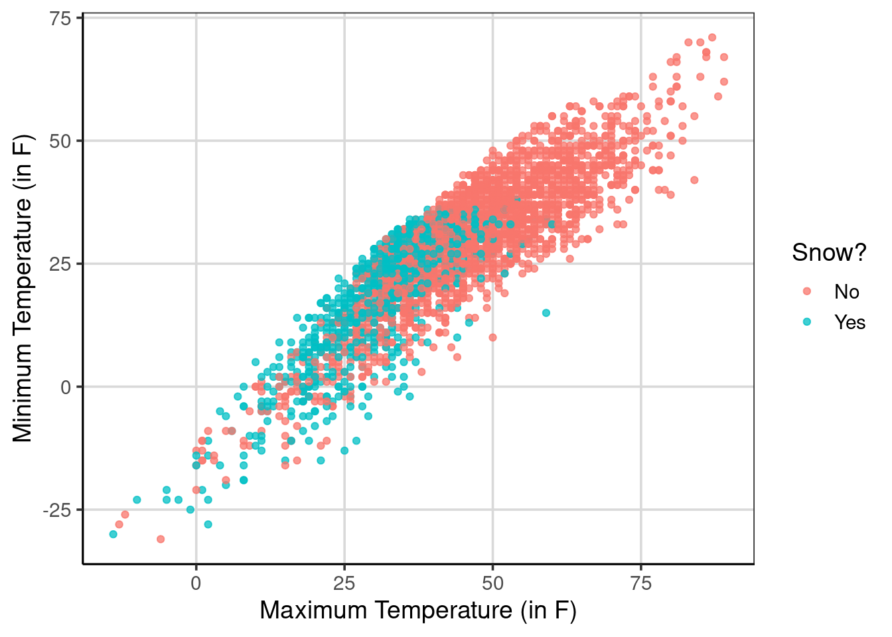
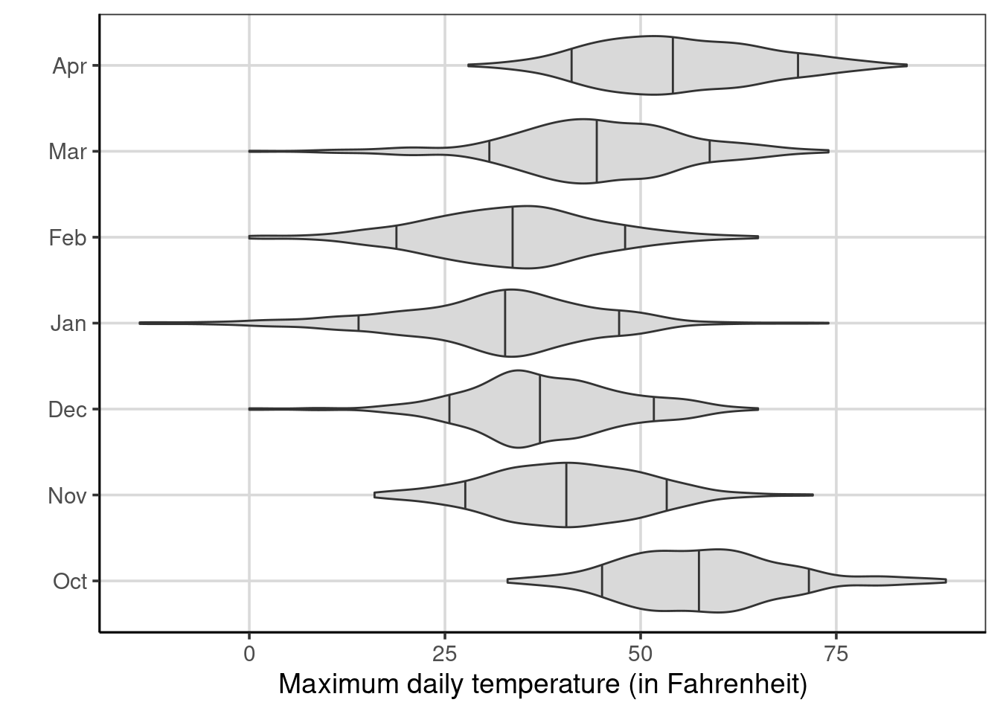
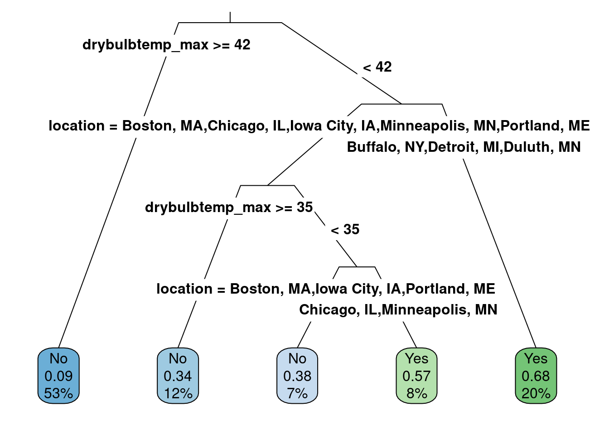

# Classification   

Classification is a task that tries to predict group membership using the data attributes available. For example, one could try to predict if an individual is left or right handed based on their preferences to music or hobbies. In this situation, the classification technique would look for patterns in the music or hobby preferences to help differentiate between those that are left or right handed. Perhaps the data would show that left handed individuals would be more likely to be artistic, therefore those that rated more highly artistic tasks would be more likely to be classified as left handed.

To perform the classification tasks in this chapter, we are going to consider a group of **statistical models** called decision trees, or more specifically in this case, classification trees. Statistical models are used to help us as humans understand patterns in the data and estimate uncertainty. Uncertainty comes from the variation in the data. For example, those that are left handed are likely not all interested or like artistic hobbies or tasks, but on average maybe they are more likely to enjoy these tasks compared to right handed individuals. Statistical models help us to understand if the differences shown in our sample of data are due to signal (true differences) or noise (uncertainty). 

In the remaining sections of this chapter, we will build off of this idea of statistical models to understanding how these work with classification trees to classify. Furthermore, we will aim to develop heuristics to understand if our statistical model is practically useful. That is, does our model help us to do our classification task above just randomly guessing. We will use a few additional packages to perform the classification tasks, including `rpart`, `rpart.plot`, and `rsample`. The following code chunk loads all the packages that will be used in the current chapter. 


```r
library(tidyverse)
library(ggformula)
library(statthink)
library(rpart)
library(rpart.plot)
library(rsample)

remotes::install_github("grantmcdermott/parttree")
library(parttree)

# Add plot theme
theme_set(theme_statthinking())

us_weather <- mutate(us_weather, snow_factor = factor(snow), 
                     snow_numeric = ifelse(snow == 'Yes', 1, 0))
```

## Topic: Decision Trees 

We will continue to use the United States weather data introduced in Chapter 4. Given that this data was for the winter months in the United States, the classification task we will attempt to perform is to correct predict if it will snow on a particular day that precipitation occurs. To get a sense of how often it rains vs snows in these data, we can use the `count()` function to do this. For the `count()` function, the first argument is the name of the data, followed by the attributes we wish to count the number of observations in the unique values of those attributes.


```r
count(us_weather, rain, snow)
```

```
## # A tibble: 4 x 3
##   rain  snow      n
##   <chr> <chr> <int>
## 1 No    No     1571
## 2 No    Yes     728
## 3 Yes   No      821
## 4 Yes   Yes     280
```

The following table counts the number of times that it rains or snows in the data. You may notice that there are days in which it does not rain or snow as shown by the row with No for both the rain and snow columns. There are also days in which it both rains and snows as shown in the row with Yes in both the rain and snow columns. Not surprisingly, a majority of the days it does not rain or snow, occurring about 46% of the time ($1571 / (1571 + 728 + 821 + 280) = 46.2%$). Using similar logic, about 8% of the days in the data have both snow and rain. 

<!--
For the current classification, we will focus on days in which it either rains or snows instead of both or none. To do this, we will filter or restrict that data to those cases only, a data task that can be done with the `filter()` function. The `filter()` function works by selecting rows of data that match specific situations. This is similar to how a search engine, such as Google, works. In a search engine, you type is search criteria and the search engine gives you back matches that meet those criteria. The `filter()` function works similarly, we specify the criteria with which we hope to have data match to keep. 

In this example, we hope to keep the rows where it either rains or snows, but rows where it doesn't or both rains or snows. To do this, we will use the `|` and `&` operators which can be translated into "or" or "and" respectively. In English, the cases we want to keep are days in which it does not rain **and** it does snow *or* days in which it does rain **and** it does not snow. Turning this into data language that `filter()` can understand, we can substitute the `|` or `&` operators into places where or/and are in the English version along with the data attribute names. Therefore we could write in code, `(rain & snow) | (rain & snow)`. The last piece we need to add to the code version, is the values we want to retain for the attributes. For example, in the data, "No" means that the event did not occur and "Yes" means the event did occur. Therefore, translating the English version into code with data values would look like: `(rain == 'No' & snow == 'Yes') | (rain =='Yes' & snow == 'No')`. In R, the `==` means literal values, therefore the code `rain == 'No'` means the literal word "No" within the rain attribute. 


```r
us_weather_rs <- us_weather %>%
  filter((rain == 'No' & snow == 'Yes') | (rain == 'Yes' & snow == 'No'))

count(us_weather_rs, rain, snow)
```

```
## # A tibble: 2 x 3
##   rain  snow      n
##   <chr> <chr> <int>
## 1 No    Yes     728
## 2 Yes   No      821
```

We can further check if the filtering command worked by using the `count()` function. Using the `count()` function on the filtered data shows that we only retained rows of the data for the combinations that we wanted, namely days in which it there is some form of precipitation, but only if it snowed or rained, not both.
-->

### Fitting a Classification Tree

Let's class_tree our first classification tree to predict whether it snowed on a particular day. For this, we will use the `rpart()` function from the *rpart* package. The first argument to the `rpart()` function is a formula where the outcome of interest is specified to the left of the `~` and the attributes that are predictive of the outcome are specified to the right of the `~` separated with `+` signs. The second argument specifies the method for which we want to run the analysis, in this case we want to classify days based on the values in the data, therefore we specify `method = 'class'`. The final argument is the data element, in this case `us_weather`.

Before we fit the model, what attributes do you think would be predictive of whether it will rain or snow on a particular day during the winter months? Take a few minutes to brainstorm some ideas.

In this example, a handful of attributes to explore, including the average, minimum, and maximum temperature for the day. These happen to be all continuous attributes, meaning that these attributes can take many data values. The model is not limited to those types of data attributes, but that is where we will start the classification journey. 

Notice that the fitted model is saved to the object, `class_tree`. This will allow for easier interaction with the model results later. Then after fitting the model, the model is visualized using the `rpart.plot()` function. The primary argument to the `rpart.plot()` function is the fitted model object from the `rpart()` function, here that would be `class_tree`. The additional arguments passed below adjust the appearance of the visualization. 


```r
class_tree <- rpart(snow_factor ~ drybulbtemp_min + drybulbtemp_max, 
   method = 'class', data = us_weather)

rpart.plot(class_tree, roundint = FALSE, type = 3, branch = .3)
```

<div class="figure">

<p class="caption">(\#fig:first-class-tree)Classification tree predicting whether it will snow or rain</p>
</div>

The visualization shown in Figure \@ref(fig:first-class-tree) produces the decision rules for the classification tree. The decision rules start from the top of the tree and proceed down the branches to the leaf nodes at the bottom that highlight the predictions. By default, the `rpart()` algorithm assumes that each split should go in two directions. For example, the first split occurs with the maximum temperature is less than 42 degrees Fahrenheit or greater than or equal to 42 degrees Fahrenheit. If the maximum temperature for the day is greater than or equal to 42 degrees Fahrenheit, the first split in the decision tree follows the left-most branch and proceeds to the left-most leaf node. This results in the prediction for those days as being days in which it does not snow (i.e., a category prediction of "No"). The numbers below the "No" label indicate that the probability of it snowing on a day where the maximum temperature was greater than or equal to 42 degrees Fahrenheit is 0.09 or about 9%. Furthermore, this category represents about 53% of the total number of data cases inputted. 

Following the right-hand split of the first decision, which occurs for days when the maximum temperature is less than 42 degrees, we come to another split. This split is again for the maximum temperature, but now the split comes at 36 degrees Fahrenheit. In this case, if the temperature is greater than or equal to 36 degrees Fahrenheit, the decision leads to the next leaf node and a prediction that it will not snow that day. For this leaf node, there is more uncertainty in the prediction, where on average the probability of it snowing would be 0.42 or about 42%. This value is less than 50%, therefore the "No" category is chosen. This occurs for about 16% of the data. 

For days in which the maximum temperature is less than 36 degrees Fahrenheit, the decision tree moves to the right further and comes to another split. The third split in the decision tree is for the minimum daily temperature and occurs at 23 degrees Fahrenheit. For days where the minimum temperature is greater than 23 degrees Fahrenheit (but also had a maximum temperature less than 36 degree Fahrenheit), the right-most leaf node is predicted. For these data cases, about 8% of the total data, the prediction is that it will snow (i.e., "Yes" category) and the probability of it snowing in those conditions is about 71%. 

Finally, if the minimum temperature is less than 23 degrees Fahrenheit (but also had a maximum temperature less than 36 degree Fahrenheit), then one last split occurs on the maximum temperature at 29 degrees Fahrenheit. This leads to the last two leaf node in the middle of Figure \@ref(fig:first-class-tree). One prediction states it will snow, for maximum temperature less than 29 degrees and one predicting it will not snow, for those greater than or equal to 29 degrees. Both of these leaf nodes have more uncertainty in the predictions, being close to 50% probability.

Note, that the average daily temperature was included in the model fitting procedure, but was not included in the results shown in Figure \@ref(fig:first-class-tree). Why do you think this happened? The model results show the attributes that were helpful in making the prediction of whether it snowed or not. For this task, the model found that the maximum and minimum temperature attributes were more useful and adding the average daily temperature did not appreciably improve the predictions. For this reason, it did not show up in the decision tree. Furthermore, the attributes that are most informative in making the prediction are at the top of the decision tree. In the results shown in Figure \@ref(fig:first-class-tree), the maximum daily temperature was the most helpful attribute in making the snow or not prediction.

The decision tree rules can also be requested in text form using the `rpart.rules()` function and are shown below. The rows in the output are the leaf nodes from \@ref(fig:first-class-tree) and the columns represent the probability of it snowing, the decision rules that are applicable, and the percentage of data found in each row. For example, for the first row, it is predicted to snow about 9% of the time when the maximum temperature for the day is greater than 42 and this occurred in 53% of the original data. Since the probability is less than 50%, the prediction would be that it would not snow on days with those characteristics. In rows where there are `&` symbols, these separate different data attributes that are useful in the classification model.


```r
rpart.rules(class_tree, cover = TRUE)
```

```
##  snow_factor                                                            cover
##         0.09 when drybulbtemp_max >=       42                             53%
##         0.42 when drybulbtemp_max is 36 to 42                             16%
##         0.45 when drybulbtemp_max is 29 to 36 & drybulbtemp_min <  23      9%
##         0.63 when drybulbtemp_max <  29       & drybulbtemp_min <  23     14%
##         0.71 when drybulbtemp_max <  36       & drybulbtemp_min >= 23      8%
```

#### Visualizing Results

To get another view of what the classification model is doing in this scenario, we will visualize the study results. First, the `gf_point()` function is used to create a scatterplot where the maximum temperature is shown on the x-axis and the minimum temperature is shown on the y-axis, shown in Figure \@ref(fig:scatter-usweather). There is a positive relationship between maximum and minimum temperatures and on days with lower maximum temperatures are where it tends to snow. However, there is not perfect separation, meaning that there are days that have similar minimum and maximum temperatures where it does snow and other where it does not snow. 


```r
temperature_scatter <- gf_point(drybulbtemp_min ~ drybulbtemp_max, 
                                color = ~ snow_factor,
                                alpha = .75,
                                data = us_weather) %>%
  gf_labs(x = "Maximum Temperature (in F)",
          y = "Minimum Temperature (in F)",
          color = "Snow?")

temperature_scatter
```

<div class="figure">

<p class="caption">(\#fig:scatter-usweather)Scatterplot of the minimum and maximum daily temperatures and if it snows or not</p>
</div>

The next figure will make use of the *parttree* R package to visualize what the classification model is doing. The `geom_parttree()` function is used where the primary argument is the saved classification model object that was save earlier, named `class_tree`. The other two arguments to add are the fill aesthetic that is the outcome of the classification tree and to control how transparent the backgroud fill color is. In this example, this is set using `alpha = .25` where the transparency is set at 75% (i.e., 1 - 0.25 = 0.75). Setting a higher alpha value would reduce the amount of transparency, whereas setting a smaller value would increase the transparency. 

Figure \@ref(fig:predict-usweather) gives a sense as to what the classification model is doing to the data. The classification model breaks the data into quadrants and makes a single uniform prediction for those quadrants. For example, the areas of the figure that are shaded as red are days in which the model predicts **it will not snow** whereas the blue/green color are days in which the model predicts **it will snow**. The data points are the real data cases, therefore there are instances inside each of the quadrants in which the model did not correctly predict or classify the case. Each of the quadrants in the figure represent different leaf nodes shown in \@ref(fig:first-class-tree) and each represent a different likelihood of it snowing. 


```r
temperature_scatter + 
  geom_parttree(data = class_tree, aes(fill = snow_factor), alpha = .25) + 
  scale_fill_discrete("Snow?")
```

<div class="figure">

<p class="caption">(\#fig:predict-usweather)Showing the predictions based on the classification tree with the raw data</p>
</div>


### Accuracy

Evaluating the model accuracy helps to understand how well the model performed the classification. If you recall, the classification model is making a prediction about whether it is going to snow on a given day based on the observed data where it was recorded if it snowed that day or not. Therefore, the data has for each day if it snowed or not. With this information, how could we evaluate how well the model performed in classifying whether it snows on a given day? 

To do this, the observation of whether it snowed or not can be compared to the model prediction of whether it snowed or not. Better classification accuracy would occur when the observed snow or no snow attribute is the same as the model prediction of snow or not. That is, when the same category is predicted as what is observed, this would result in better classification accuracy, a good thing. If there are cases where different categories between the observed and predicted categories or classes, this would be an example of poor classification accuracy. 

In the data so far, there is the observed data value on whether it snowed or not, this is the attribute that was used to fit the classification model, named `snow_factor`. To add the predicted classes based on the classification model shown in Figure \@ref(fig:first-class-tree), the `predict()` function can be used. To use the `predict()` function, the primary argument is a model object, in this case the classification model object named `class_tree`. To get the predicted classes, that is the leaf nodes at the bottom of Figure \@ref(fig:first-class-tree), a second argument is needed, `type = 'class'` which tells the predict function to report the top line of the leaf nodes in Figure \@ref(fig:first-class-tree). These predicted classes are saved into a new attribute named `snow_predict`. Another element is also added that represent the probability of a particular day not snowing or snowing, these are reported in the columns `No` and `Yes` in the resulting output. 


```r
us_weather_predict <- us_weather %>%
  mutate(snow_predict = predict(class_tree, type = 'class')) %>%
  cbind(predict(class_tree, type = 'prob'))
head(us_weather_predict, n = 20)
```

```
##        station                date dewpoint_avg drybulbtemp_avg
## 1  72528014733 2018-10-01 23:59:00           51              52
## 2  72528014733 2018-10-02 23:59:00           59              60
## 3  72528014733 2018-10-03 23:59:00           55              62
## 4  72528014733 2018-10-04 23:59:00           56              60
## 5  72528014733 2018-10-05 23:59:00           43              51
## 6  72528014733 2018-10-06 23:59:00           62              63
## 7  72528014733 2018-10-07 23:59:00           58              60
## 8  72528014733 2018-10-08 23:59:00           61              68
## 9  72528014733 2018-10-09 23:59:00           66              77
## 10 72528014733 2018-10-10 23:59:00           64              74
## 11 72528014733 2018-10-11 23:59:00           56              62
## 12 72528014733 2018-10-12 23:59:00           36              47
## 13 72528014733 2018-10-13 23:59:00           36              46
## 14 72528014733 2018-10-14 23:59:00           39              51
## 15 72528014733 2018-10-15 23:59:00           43              49
## 16 72528014733 2018-10-16 23:59:00           32              45
## 17 72528014733 2018-10-17 23:59:00           34              45
## 18 72528014733 2018-10-18 23:59:00           30              40
## 19 72528014733 2018-10-19 23:59:00           38              50
## 20 72528014733 2018-10-20 23:59:00           42              48
##    relativehumidity_avg sealevelpressure_avg stationpressure_avg
## 1                    95                30.26               29.50
## 2                    96                30.01               29.26
## 3                    86                30.05               29.31
## 4                    77                29.97               29.18
## 5                    75                30.17               29.41
## 6                    90                30.03               29.28
## 7                    97                30.24               29.44
## 8                    84                30.23               29.49
## 9                    72                30.13               29.39
## 10                   70                29.89               29.18
## 11                   77                29.66               28.91
## 12                   66                29.82               29.05
## 13                   74                29.95               29.15
## 14                   69                30.12               29.34
## 15                   79                29.94               29.16
## 16                   61                30.06               29.31
## 17                   66                30.02               29.21
## 18                   68                30.37               29.59
## 19                   63                30.00               29.28
## 20                   86                29.68               28.90
##    wetbulbtemp_avg windspeed_avg cooling_degree_days
## 1               51          10.9                   0
## 2               60           8.5                   0
## 3               57           5.5                   0
## 4               59          12.5                   0
## 5               47           9.6                   0
## 6               63           8.1                   0
## 7               58           9.4                   0
## 8               63           7.9                   3
## 9               69          11.4                  12
## 10              68          10.6                   9
## 11              59          15.7                   0
## 12              42          12.5                   0
## 13              41           8.4                   0
## 14              45           6.5                   0
## 15              47          12.8                   0
## 16              39          15.8                   0
## 17              40          15.3                   0
## 18              36          11.2                   0
## 19              45          18.0                   0
## 20              45          12.3                   0
##    departure_from_normal_temperature heating_degree_days drybulbtemp_max
## 1                               -4.6                  13              54
## 2                                3.8                   5              69
## 3                                6.2                   3              70
## 4                                4.6                   5              74
## 5                               -4.0                  14              58
## 6                                8.4                   2              74
## 7                                5.7                   5              67
## 8                               14.1                   0              82
## 9                               23.5                   0              83
## 10                              20.9                   0              81
## 11                               9.2                   3              74
## 12                              -5.4                  18              51
## 13                              -6.1                  19              51
## 14                              -0.7                  14              60
## 15                              -2.4                  16              58
## 16                              -6.0                  20              52
## 17                              -5.7                  20              53
## 18                             -10.4                  25              47
## 19                               0.0                  15              57
## 20                              -1.7                  17              55
##    drybulbtemp_min peak_wind_direction peak_wind_speed precipitation snow_depth
## 1               50                  50              24         0.090          0
## 2               51                 320              24         1.000          0
## 3               53                 210              25         0.005          0
## 4               46                 220              39         0.450          0
## 5               44                 100              21         0.000          0
## 6               51                 250              26         0.730          0
## 7               53                  50              21         0.020          0
## 8               53                  70              20         0.010          0
## 9               70                 210              30         0.000          0
## 10              67                 190              25         0.005          0
## 11              50                 220              39         0.010          0
## 12              42                 280              27         0.010          0
## 13              40                 250              24         0.140          0
## 14              41                 250              17         0.000          0
## 15              40                 220              37         0.090          0
## 16              38                 210              40         0.005          0
## 17              36                 290              36         0.050          0
## 18              33                 250              28         0.030          0
## 19              43                 210              48         0.005          0
## 20              40                 220              49         0.470          0
##    snowfall wind_direction wind_speed weather_occurances sunrise sunset month
## 1     0.000             60         20           RA DZ BR     612   1757   Oct
## 2     0.000            320         21           RA DZ BR     613   1755   Oct
## 3     0.000            200         20              DZ BR     614   1753   Oct
## 4     0.000            220         32           TS RA BR     615   1751   Oct
## 5     0.000             70         16               <NA>     616   1750   Oct
## 6     0.000            200         20           TS RA BR     618   1748   Oct
## 7     0.000             60         16           RA DZ BR     619   1746   Oct
## 8     0.000             70         16                 RA     620   1744   Oct
## 9     0.000            210         23               <NA>     621   1743   Oct
## 10    0.000            190         21               <NA>     622   1741   Oct
## 11    0.000            240         29                 RA     623   1739   Oct
## 12    0.000            260         21                 RA     625   1738   Oct
## 13    0.000            240         18              RA BR     626   1736   Oct
## 14    0.000            250         14               <NA>     627   1734   Oct
## 15    0.000            290         28              RA BR     628   1733   Oct
## 16    0.000            220         30                 RA     629   1731   Oct
## 17    0.005            290         28           GR RA SN     631   1729   Oct
## 18    0.005            240         21           RA SN HZ     632   1728   Oct
## 19    0.000            240         35                 RA     633   1726   Oct
## 20    0.100            240         36     TS GR RA BR PL     634   1725   Oct
##    month_numeric year day winter_group    location fog mist drizzle rain snow
## 1             10 2018   1        18_19 Buffalo, NY  No  Yes     Yes  Yes   No
## 2             10 2018   2        18_19 Buffalo, NY  No  Yes     Yes  Yes   No
## 3             10 2018   3        18_19 Buffalo, NY  No  Yes     Yes   No   No
## 4             10 2018   4        18_19 Buffalo, NY  No  Yes      No  Yes   No
## 5             10 2018   5        18_19 Buffalo, NY  No   No      No   No   No
## 6             10 2018   6        18_19 Buffalo, NY  No  Yes      No  Yes   No
## 7             10 2018   7        18_19 Buffalo, NY  No  Yes     Yes  Yes   No
## 8             10 2018   8        18_19 Buffalo, NY  No   No      No  Yes   No
## 9             10 2018   9        18_19 Buffalo, NY  No   No      No   No   No
## 10            10 2018  10        18_19 Buffalo, NY  No   No      No   No   No
## 11            10 2018  11        18_19 Buffalo, NY  No   No      No  Yes   No
## 12            10 2018  12        18_19 Buffalo, NY  No   No      No  Yes   No
## 13            10 2018  13        18_19 Buffalo, NY  No  Yes      No  Yes   No
## 14            10 2018  14        18_19 Buffalo, NY  No   No      No   No   No
## 15            10 2018  15        18_19 Buffalo, NY  No  Yes      No  Yes   No
## 16            10 2018  16        18_19 Buffalo, NY  No   No      No  Yes   No
## 17            10 2018  17        18_19 Buffalo, NY  No   No      No  Yes  Yes
## 18            10 2018  18        18_19 Buffalo, NY  No   No      No  Yes  Yes
## 19            10 2018  19        18_19 Buffalo, NY  No   No      No  Yes   No
## 20            10 2018  20        18_19 Buffalo, NY  No  Yes      No  Yes   No
##    snow_factor snow_numeric snow_predict        No        Yes
## 1           No            0           No 0.9130676 0.08693245
## 2           No            0           No 0.9130676 0.08693245
## 3           No            0           No 0.9130676 0.08693245
## 4           No            0           No 0.9130676 0.08693245
## 5           No            0           No 0.9130676 0.08693245
## 6           No            0           No 0.9130676 0.08693245
## 7           No            0           No 0.9130676 0.08693245
## 8           No            0           No 0.9130676 0.08693245
## 9           No            0           No 0.9130676 0.08693245
## 10          No            0           No 0.9130676 0.08693245
## 11          No            0           No 0.9130676 0.08693245
## 12          No            0           No 0.9130676 0.08693245
## 13          No            0           No 0.9130676 0.08693245
## 14          No            0           No 0.9130676 0.08693245
## 15          No            0           No 0.9130676 0.08693245
## 16          No            0           No 0.9130676 0.08693245
## 17         Yes            1           No 0.9130676 0.08693245
## 18         Yes            1           No 0.9130676 0.08693245
## 19          No            0           No 0.9130676 0.08693245
## 20          No            0           No 0.9130676 0.08693245
```

The first 20 rows of the resulting data are shown. Notice that for all of these 20 rows, the predicted class, shown in the attribute, `snow_predict`, are represented as "No" indicating that these days it was not predicted to snow. Notice toward the bottom however, that there were two days in which it did in fact snow, shown in the column named, `snow_factor`. These would represent two cases of misclassification as the observed data is not the same as the model predicted class. Finally, the probabilities shown in the last two attribute columns are all the same here. These are all the same as the maximum dry bulb temperature was greater than 42 degrees Fahrenheit in all of these days. Therefore, all 20 of the cases shown in the data here represent the left-most leaf node shown in Figure \@ref(fig:first-class-tree). 

Now that the observed data and the model predicted classes are in the data, it is possible to produce a table that shows how many observations were correctly predicted (indicating better model accuracy). To do this, the `count()` function can be used where the observed and predicted class attributes are passed as arguments. 


```r
us_weather_predict %>%
  count(snow_factor, snow_predict)
```

```
##   snow_factor snow_predict    n
## 1          No           No 2147
## 2          No          Yes  245
## 3         Yes           No  529
## 4         Yes          Yes  479
```

The resulting table shows the observed data values in the left-most column (`snow_factor`) followed by the predicted class (`snow_predict`) in the middle column. The final column represents the number of rows or observations that were in each combination of the first two columns. For example, the first row shows that 2,147 observations were counted that had the combination where it was observed and predicted to have not snowed that day. These 2,147 observations would be instances of correct classification. The second row shows that 245 observations occurred where it was observed to not have snowed, but the model predicted it would snow that day. All of the 245 observations were misclassified based on the classification model. 

From this table, the overall model accuracy can be calculated by summing up the cases that matched and dividing by the total number of observations. This computation would look like:
$$
accuracy = \frac{\textrm{matching predictions}}{\textrm{total observations}} = \frac{(2147 + 479)}{(2147 + 245 + 529 + 479)} = .772 = 77.2%
$$
This means that the overall classification accuracy for this example was just over 77%, meaning that about 77% of days the model was able to correctly classify whether it snowed or not. This computation can also be done programmatically. To do this, a new attribute named, `same_class`, can be added to the data that is given a value of 1 if the observed data matches the predicted class and a value of 0 otherwise. Descriptive statistics, such as the mean and sum, can be computed on this new vector to represent the accuracy as a proportion and the number of matching predictions (the numerator shown in the equation above). 


```r
us_weather_predict %>%
  mutate(same_class = ifelse(snow_factor == snow_predict, 1, 0)) %>%
  df_stats(~ same_class, mean, sum)
```

```
##     response      mean  sum
## 1 same_class 0.7723529 2626
```

Notice that the same model accuracy was found, about 77.2%, and the number of observations (i.e., days) that the correct classification was found was 2,626 days. Is correctly predicting 77.2% of the days good? That is, would you say this model is doing a good job at accurately predicting if it will snow or not on that day? 

#### Conditional Accuracy

One potential misleading element of simply computing the overall model accuracy as done above, is that the accuracy will likely differ based on the which class. This could occur for a few reasons, one it could be more difficult to predict one of the classes due to similarities in data across the two classes. The two classes are also often unbalanced, therefore exploring the overall model accuracy will give more weight to the group/class that has more data. In addition, this group has more data so it could make it a bit easier for the model to predict, these issues could be exacerbated in small sample conditions. 

Therefore, similar to earlier discussion in the book about multivariate distributions, it is often important to consider conditional or multivariate accuracy instead of the overall model accuracy. Let's explore this a different way than simply computing a percentage, instead we could use a bar graph to explore the model accuracy. Figure \@ref(fig:bar-accuracy-count) shows the number of correct classifications for the two observed data classes (i.e., snow or did not snow) on the x-axis by the predicted classes shown with the fill color in the bars. The fill color are red for days that the model predicts it will not show and green/blue for days in which it will not snow. Therefore, accuracy would be represented in the left-bar by the red portion of the bar and the right-bar by the green/blue portion of the bar. 


```r
gf_bar(~ snow_factor, fill = ~snow_predict, data = us_weather_predict) %>%
  gf_labs(x = "Observed Snow Status",
          fill = "Predicted Snow Status")
```

<div class="figure">

<p class="caption">(\#fig:bar-accuracy-count)A bar graph showing the conditional prediction accuracy represented as counts.</p>
</div>

Figure \@ref(fig:bar-accuracy-count) is not a very good picture to depict accuracy as the two groups have different numbers of observations so comparisons between the bars is difficult. Secondly, the count metric makes it difficult to estimate how many are in each group, for example, it is difficult from the figure alone to know how many were incorrectly classified in the left-most bar represented by the blue/green color. These issues can be fixed by adding an additional argument, `position = 'fill'` which will scale each bar as a proportion, ranging from 0 to 1. The bar graph is now scaling each bar based on the sample size to normalize sample size differences. 


```r
gf_bar(~ snow_factor, fill = ~snow_predict, 
       data = us_weather_predict, position = "fill") %>%
  gf_labs(x = "Observed Snow Status",
          fill = "Predicted Snow Status",
          y = 'Proportion') %>%
  gf_refine(scale_y_continuous(breaks = seq(0, 1, .1)))
```

<div class="figure">

<p class="caption">(\#fig:bar-accuracy-fill)A bar graph showing the conditional prediction accuracy represented as a proportion.</p>
</div>

From this new figure (Figure \@ref(fig:bar-accuracy-fill)), it is much easier to estimate the prediction accuracy from the figure. For example, the green/blue portion of the left-most bar is at about 0.10, meaning that about 10% of the cases are misclassified and 90% would be correctly classified. Therefore the classification accuracy for days in which it did not snow would be about 90%. Compare this to days in which it did not snow (the right bar), where the prediction accuracy represented by the green/blue color is about 48%, meaning that the misclassification rate is about 52%. 

Let's recalibrate how we think the model is doing? If you were just given the overall classification rate of about 77%, how did you feel about the model? Now that we know the model accurate predicts it won't snow about 90% of the time, but can only identify that it will snow about 48% of the time, how well do you feel the model is performing now? Would you feel comfortable using this model in the real world? 

One last note, we can also compute the conditional model accuracy more directly using the `df_stats()` function as was done for the overall model accuracy. The primary difference in the code is to specify the `same_class` attribute to the left of the `~`. This represent the attribute to compute the statistics of interest with. Another attribute is added to the right of the `~` to represent the attribute to condition on, in this case the observed data point of whether it snowed or not. 


```r
us_weather_predict %>%
  mutate(same_class = ifelse(snow_factor == snow_predict, 1, 0)) %>%
  df_stats(same_class ~ snow_factor, mean, sum, length)
```

```
##     response snow_factor      mean  sum length
## 1 same_class          No 0.8975753 2147   2392
## 2 same_class         Yes 0.4751984  479   1008
```

The output returns the conditional model accuracy as a proportion, the number of correct classifications for each class/group, and the total number of observations (both correct and incorrect classifications) for each class/group. The estimated values we had from the figure were very close to the actual calculated values, but we find the figure to be more engaging than just the statistics. 

## Adding Categorical Attributes
Up to now, the classification models have only used continuous attributes, that is, those that take on many different data values rather than a few specific values that represent categories or groups. Classification models do not need to be limited to only continuous attributes to predict the binary outcome. The model may also add some additional predictive power and accuracy with the inclusion of more attributes.

For example, one attribute that may be helpful in this context to predict whether it will snow on a given day could be the month of year. The data used here are from the fall, winter, and spring seasons, therefore it is likely true that it would be more likely to snow in the winter months rather than fall or spring. Prior to including in the model, this can be visualized. Figure \@ref(fig:snow-month) shows a bar chart that represents the proportion of days in which it tends to snow the most. You may notice that it does snow on some days in every month, however, the frequency is much higher in January and February. As the proportion of days that it snows during different months of the year, this attribute could be helpful in predicting days in which it snows.


```r
gf_bar(~ month, fill = ~ snow, data = us_weather, position = 'fill') %>%
  gf_labs(x = "", 
          y = "Proportion of days with snow",
          fill = "Snow?")
```

<div class="figure">

<p class="caption">(\#fig:snow-month)Bar chart showing the proportion of days that is snows across months</p>
</div>

To add this attribute to the classification model, the model formula is extended to the right of the `~` to add `+ month`. Note, this model is saved to the model object, `class_tree_month`, and the remaining code is the same as the previous model fitted with the two continuous attributes. 


```r
class_tree_month <- rpart(snow_factor ~ drybulbtemp_min + drybulbtemp_max + month, 
   method = 'class', data = us_weather)

rpart.plot(class_tree_month, roundint = FALSE, type = 3, branch = .3)
```

<div class="figure">

<p class="caption">(\#fig:class-categorical)The classification model with the month attribute added as a categorical attribute.</p>
</div>

The fitted model classification results are shown in Figure \@ref(fig:class-categorical). Notice that month does not show up in the figure of the classification tree and Figure \@ref(fig:class-categorical) is identical to Figure \@ref(fig:first-class-tree). Why is this happening and what does this mean? 

To understand what is happening, we need to think about temperature and how that may be related to the month of the year. In the United States, particularly in northern locations as those with the data used here, the temperature varies quite substantially by the month of the year. Figure \@ref(fig:temp-month) shows the maximum daily temperature by the months of the year. Notice there is overlap in adjacent months, but the median for many of the months of the year are quite different from other months. This suggests that temperature can serve as a proxy for month and contain overlapping information. Not shown here, but a similar trend would likely be shown for the minimum daily temperature. 


```r
gf_violin(drybulbtemp_max ~ month, data = us_weather, 
          fill = 'gray85', draw_quantiles = c(0.1, 0.5, 0.9)) %>%
  gf_labs(x = "",
          y = "Maximum daily temperature (in Fahrenheit)") %>%
  gf_refine(coord_flip())
```

<div class="figure">

<p class="caption">(\#fig:temp-month)Violin plots of the maximum temperature by month of the year</p>
</div>

For this reason, month does not show up in the model because the classification model determined that the maximum and minimum daily temperatures were more useful at predicting whether it will snow on a particular day. This highlights an important point with these classification models, only the attributes that are the most helpful in predicting the outcome will show up in the final classification model. If an attribute is not helpful, it will not show up in the classification results. As such, the model that included month had the same classification tree and will result in the same predictions as the model fitted without month in it. With the same predictions, the same model accuracy will also be obtained. 

### Exploring Location

Another categorical attribute that is in the data is the location of the weather observation. These locations are across a variety of geographic locations within the northern part of the United States, including areas close to the Canadian border, others are in the northeast portion of the United States as well. Thus, location could be important, and maybe this would include additional information over and above that of just temperature. Figure \@ref(fig:snow-location) shows a bar chart that explores if some locations are more likely to have snow. The figure shows that Buffalo, Duluth, and Minneapolis all tend to have more days where it snows.


```r
gf_bar(~ location, fill = ~ snow, data = us_weather, position = 'fill') %>%
  gf_labs(x = "", 
          y = "Proportion of days with snow",
          fill = "Snow?")
```

<div class="figure">

<p class="caption">(\#fig:snow-location)Bar chart showing the proportion of days that is snows across locations</p>
</div>

We can also explore if the temperature is located to the location to determine if there is overlapping information in these. Recall, Buffalo, Duluth, and Minneapolis had evidence of higher days when it snowed, but notice from Figure \@ref(fig:temp-location), that Duluth has a lower temperature than the rest, but Minneapolis and Buffalo have similar maximum daily temperatures to the other locations. The location may carry some additional information that would be informative to the classification model. 


```r
gf_violin(drybulbtemp_max ~ location, data = us_weather, 
          fill = 'gray85', draw_quantiles = c(0.1, 0.5, 0.9)) %>%
  gf_labs(x = "",
          y = "Maximum daily temperature (in Fahrenheit)") %>%
  gf_refine(coord_flip())
```

<div class="figure">

<p class="caption">(\#fig:temp-location)Violin plots of the maximum temperature by location</p>
</div>

The location attribute is added similarly to the model as month was. Note, the month attribute was removed as it was not deemed to be a useful attribute to help understand if it snows on a given day. The model results are shown in Figure \@ref(fig:class-location). Notice that now the maximum daily temperature is still included at two separate locations, but now instead of the minimum daily temperature, location is now more important. As such, the minimum daily temperature is not located in the classification tree. 


```r
class_tree_location <- rpart(snow_factor ~ drybulbtemp_min + drybulbtemp_max + location, 
   method = 'class', data = us_weather)

rpart.plot(class_tree_location, roundint = FALSE, type = 3, branch = .3)
```

<div class="figure">

<p class="caption">(\#fig:class-location)The classification model with the location attribute added as a categorical attribute.</p>
</div>

When there is a split for a categorical attribute, the category split does not occur at a value like with continuous attributes, rather the split occurs for one or more categories. For example, for the second split in the latest results, if the location is Buffalo, Detroit, or Duluth, then the path progresses to the right to the "Yes" category representing a prediction of it will snow. The other locations continue to the left of that split, then maximum daily temperature is useful again, and then finally the final split is the location again. Now, the location attribute does not contain Buffalo, Detroit, or Duluth, but contains the other groups. In this case, those locations of Chicago and Minneapolis result in predictions that it will snow and other locations that it will not snow. 

#### Accuracy
As the attributes used in the model differ, the accuracy could be different. Therefore, it is important to explore model accuracy again. Figure \@ref(fig:location-accuracy) shows the classification results. These results can be compared to Figure \@ref(fig:bar-accuracy-fill). There are two major differences, one, the prediction accuracy for days in which it did not snow decreased slightly (left bar), but the prediction accuracy for days where it did snow the accuracy increased (right bar). 


```r
us_weather_predict <- us_weather_predict %>%
  mutate(snow_predict_location = predict(class_tree_location, type = 'class'))

gf_bar(~ snow_factor, fill = ~snow_predict_location, 
       data = us_weather_predict, position = 'fill') %>%
  gf_labs(x = "Observed Snow Status",
          fill = "Predicted Snow Status") %>%
  gf_refine(scale_y_continuous(breaks = seq(0, 1, .1)))
```

<div class="figure">

<p class="caption">(\#fig:location-accuracy)Bar chart showing model accuracy with location attribute included.</p>
</div>

The prediction accuracy can also be computed analytically with the `df_stats()` function. 


```r
us_weather_predict %>%
  mutate(same_class = ifelse(snow_factor == snow_predict, 1, 0),
    same_class_location = ifelse(snow_factor == snow_predict_location, 1, 0)) %>%
  df_stats(same_class_location ~ snow_factor, mean, sum, length)
```

```
##              response snow_factor      mean  sum length
## 1 same_class_location          No 0.8599498 2057   2392
## 2 same_class_location         Yes 0.6220238  627   1008
```

### Comparison to Baseline
Overall model accuracy or conditional model accuracy as shown above, can be an important first step to evaluate how well the classification model is performing. However, it is useful to compare the model accuracy to a baseline. This is important to consider as it is often not the case that the event the model is predicting occurs equally likely, more specifically has a probability of occurring equal to 50%. For example, in the US weather data, the observed number of days in which it snows was 0.3, meaning that on average for the days and locations in the data, it snowed on 3 out of 10 days. This would mean that a naive model that only predicted it did not snow would be correct 70% of the time. Therefore, the overall accuracy of the classification models can use this information to see if the model outperforms a simple analysis that simply predicts the predominate category (in this case that it does not snow). 

The first model fitted to the US weather data used the drybulb maximum and minimum temperature and has 

#### Absolute vs Relative Comparison


### Training/Test Data

So far we have used the entire data to make our classification. This is not best practice and we will explore this is a bit more detail. First, take a minute to hypothesize why using the entire data to make our classification prediction may not be the best?

It is common to split the data prior to fitting a classification/prediction model into a training data set in which the model makes a series of predictions on the data, learns which data attributes are the most important, etc. Then, upon successfully identifying a useful model with the training data, test these model predictions on data that the model has not seen before. This is particularly important as the algorithms to make the predictions are very good at understanding and exploiting small differences in the data used to fit the model. Therefore, exploring the extent to which the model does a good job on data the model has not seen is a better test to the utility of the model. We will explore in more detail the impact of not using the training/test data split later, but first, let's refit the classification tree to the weather data by splitting the data into 80% training and 20% test data. 

A 70/30 split is also common in practice, so why choose an 80/20 training/test data split. This choice can be broken down into two primary arguments to consider when making this decision. The main idea behind the making the test data smaller is so that the model has more data to train on initially to understand the attributes from the data. However, as discussed above, it is helpful to evaluate the model on data the model has not seen before. This helps to ensure the process is similar to that of what may happen in the real world where the model could be used to help predict/classify cases that happen in the future. Secondly, the test data does not need to be quite as large, but we would like it to be representative of the population of interest. In larger samples, the splitting may not make big differences, but in small samples more care choosing the appropriate split percentages is a helpful step.  Here, the data are not small, but also not extremely large, about 3400 weather instances. When using a 80/20 training/test data split, there would be 2720 in the training data and 680 in the testing data.

#### Splitting the data into training/test

This is done with the rsample package utilizing three functions, `initial_split()`, `training()`, and `test()`. The `initial_split()` function helps to take the initial random sample and the proportion of data to use for the training data is initially identified. The random sample is done without replacement meaning that the data are randomly selected, but can not show up in the data more than once. Then, after using the `initial_split()` function, the `training()` and `test()` functions are used to obtain the training and test data respectively. It is good practice to use the `set.seed()` function to save the seed that was used as this is a random process. Without using the `set.seed()` function, the same split of data would likely not be able to be recreated in the code was ran again.

Let's do the data splitting.
 

```r
set.seed(2021)
us_weather_split <- initial_split(us_weather, prop = .8)
us_weather_train <- training(us_weather_split)
us_weather_test <- testing(us_weather_split)
```
 

```r
class_tree <- rpart(snow_factor ~ drybulbtemp_min + drybulbtemp_max + location, 
   method = 'class', data = us_weather_train)

rpart.plot(class_tree, roundint = FALSE, type = 3, branch = .3)
```

This seems like a reasonable model. Let's check the model accuracy.


```r
us_weather_predict <- us_weather_train %>%
  mutate(snow_predict = predict(class_tree, type = 'class'))
us_weather_predict %>%
  mutate(same_class = ifelse(snow_factor == snow_predict, 1, 0)) %>%
  df_stats(~ same_class, mean, sum)
```

The model accuracy on the training data, the same data that was used to fit the model, was ...

#### Evaluate accuracy on the testing data

To evaluate the accuracy on the test data, the primary difference in the code is to pass a data object to the argument, `newdata`. The new data object is the testing data that was not used to fit the data and was withheld for the sole purpose of testing the performance of the classification model. 


```r
us_weather_predict_test <- us_weather_test %>%
  mutate(snow_predict = predict(class_tree, newdata = us_weather_test, type = 'class'))
us_weather_predict_test %>%
  mutate(same_class = ifelse(snow_factor == snow_predict, 1, 0)) %>%
  df_stats(~ same_class, mean, sum)
```

For the test data, prediction accuracy was quite a bit lower, about xxx.

<!--


```r
titanic_predict <- titanic_predict %>%
  mutate(tree_predict_full = predict(class_tree, type = 'class'))

titanic_predict %>%
  count(survived, tree_predict_full)
```


```r
gf_bar(~ survived, fill = ~tree_predict_full, data = titanic_predict, position = "fill") %>%
  gf_labs(y = "proportion") %>%
  gf_refine(scale_y_continuous(breaks = seq(0, 1, .1)))
```


```r
titanic_predict %>%
  mutate(same_class = ifelse(survived == tree_predict_full, 1, 0)) %>%
  df_stats(~ same_class, mean, sum)
```


### Introduction to resampling/bootstrap

To explore these ideas in more detail, it will be helpful to use a statistical technique called resampling or the bootstrap. We will use these ideas a lot going forward in this course. In very simple terminology, resampling or the bootstrap can help us understand uncertainty in our estimates and also allow us to be more flexible in the statistics that we run. The main drawback of resampling and bootstrap methods is that they can be computationally heavy, therefore depending on the situation, more time is needed to come to the conclusion desired.

Resampling and bootstrap methods use the sample data we have and perform the sampling procedure again treating the sample we have data for as the population. Generating the new samples is done with replacement (more on this later). This resampling is done many times (100, 500, 1000, etc.) with more in general being better. As an example with the titanic data, let's take the titanic data, assume this is the population of interest, and resample from this population 1000 times (with replacement) and each time we will calculate the proportion that survived the disaster in each sample. Before we write the code for this, a few questions to consider.

1. Would you expect the proportion that survived to be the same in each new sample? Why or why not?
2. Sampling with replacement keeps coming up, what do you think this means?
3. Hypothesize why sampling with replacement would be a good idea?

Let's now try the resampling with the calculation of the proportion that survived. We will then save these 1000 survival proportions and create a visualization.


```r
resample_titanic <- function(...) {
    titanic %>%
        sample_n(nrow(titanic), replace = TRUE) %>%
        df_stats(~ Survived, mean)
}

survival_prop <- map(1:1000, resample_titanic) %>% 
  bind_rows()

gf_density(~ mean_Survived, data = survival_prop)
```

#### Bootstrap variation in prediction accuracy

We can apply these same methods to evaluate the prediction accuracy based on the classification model above. When using the bootstrap, we can get an estimate for how much variation there is in the classification accuracy based on the sample that we have. In addition, we can explore how different the prediction accuracy would be for many samples when using all the data and by splitting the data into training and test sets.
Bootstrap full data.

Let's first explore the full data to see how much variation there is in the prediction accuracy using all of the data. Here we will again use the sample_n() function to sample with replacement, then fit the classification model to each of these samples, then calculate the prediction accuracy. First, I'm going to write a function to do all of these steps one time.


```r
calc_predict_acc <- function(data) {
  rsamp_titanic <- titanic %>%
    sample_n(nrow(titanic), replace = TRUE)

  class_model <- rpart(survived ~ Pclass + Sex + Age + Fare + SibSp + Parch, 
        method = 'class', data = rsamp_titanic, cp = .02)

  titanic_predict <- rsamp_titanic %>%
    mutate(tree_predict = predict(class_model, type = 'class'))
  titanic_predict %>%
    mutate(same_class = ifelse(survived == tree_predict, 1, 0)) %>%
    df_stats(~ same_class, mean, sum)
}

calc_predict_acc()
```


 To do the bootstrap, this process can be replicated many times. In this case, I'm going to do 500. In practice, we would likely want to do a few more.


```r
predict_accuracy_fulldata <- map(1:2000, calc_predict_acc) %>%
  bind_rows()

gf_density(~ mean_same_class, data = predict_accuracy_fulldata)
```


```r
calc_predict_acc_split <- function(data) {
  titanic_split <- initial_split(titanic, prop = .7)
  titanic_train <- training(titanic_split)
  titanic_test <- testing(titanic_split)

  class_model <- rpart(survived ~ Pclass + Sex + Age + Fare + SibSp + Parch, 
        method = 'class', data = titanic_train, cp = .02)

  titanic_predict <- titanic_test %>%
    mutate(tree_predict = predict(class_model, newdata = titanic_test, type = 'class'))
  titanic_predict %>%
    mutate(same_class = ifelse(survived == tree_predict, 1, 0)) %>%
    df_stats(~ same_class, mean, sum)
}

calc_predict_acc_split()
```


```r
predict_accuracy_traintest <- map(1:2000, calc_predict_acc_split) %>%
  bind_rows()

gf_density(~ mean_same_class, data = predict_accuracy_traintest)
```


```r
bind_rows(
  mutate(predict_accuracy_fulldata, type = "Full Data"),
  mutate(predict_accuracy_traintest, type = "Train/Test")
) %>%
  gf_density(~ mean_same_class, color = ~ type, fill = NA, size = 1.25)
```


### Cross-validation

-->
