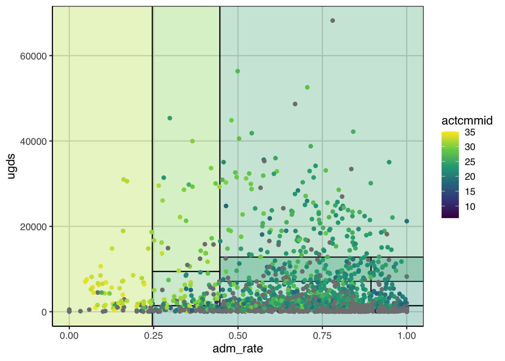
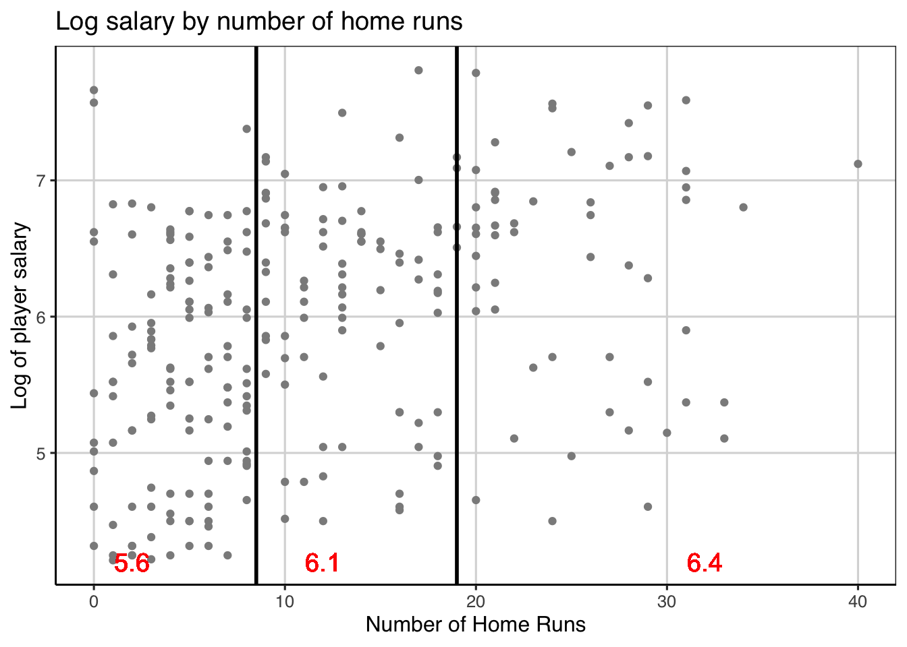
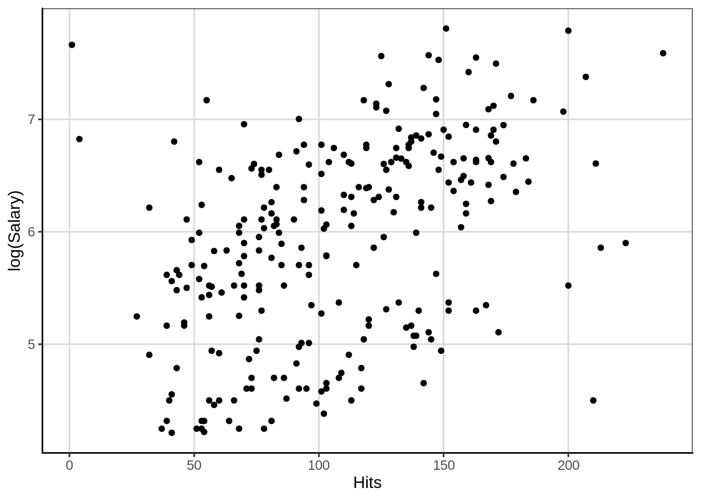
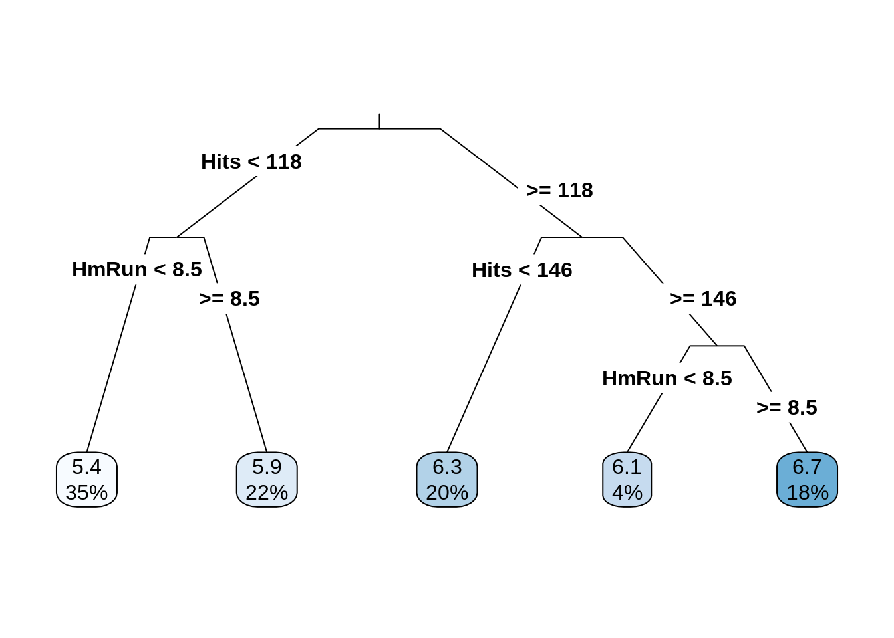
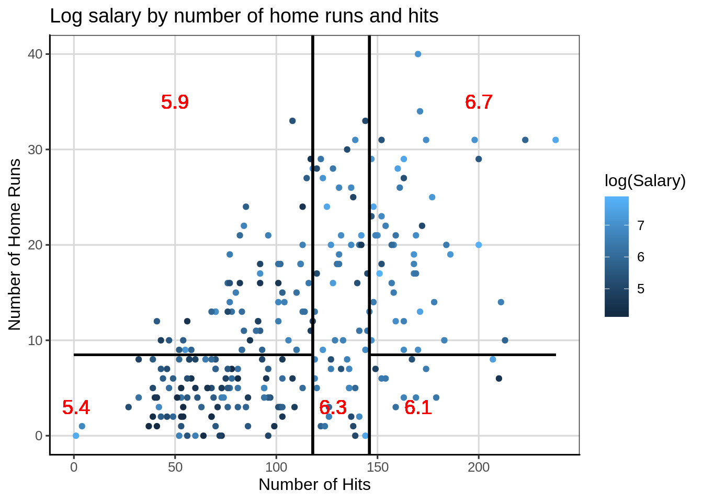

# Linear Model    

## Regression Trees
In this example, data on major league baseball players that comes with an R package, `ISLR`. These data contain information about hitters in major league baseball for the 1986 season and also contain information about their starting salary for the 1987 season. Missing data related to salary information was dropped from the data.
### Loading R packages
hen the packages can be loaded and some processing is done on the `Hitters` data to drop any missing data elements from the salary data attribute. Finally, the first few rows of the data are shown with the `head()` function.


```r
library(tidyverse)
library(ggformula)
library(mosaic)
library(ISLR)
library(rpart)
library(rsample)
library(rpart.plot)

theme_set(theme_bw())

Hitters <- Hitters %>%
  drop_na(Salary)

head(Hitters)
```

```
##                   AtBat Hits HmRun Runs RBI Walks Years CAtBat CHits
## -Alan Ashby         315   81     7   24  38    39    14   3449   835
## -Alvin Davis        479  130    18   66  72    76     3   1624   457
## -Andre Dawson       496  141    20   65  78    37    11   5628  1575
## -Andres Galarraga   321   87    10   39  42    30     2    396   101
## -Alfredo Griffin    594  169     4   74  51    35    11   4408  1133
## -Al Newman          185   37     1   23   8    21     2    214    42
##                   CHmRun CRuns CRBI CWalks League Division PutOuts Assists
## -Alan Ashby           69   321  414    375      N        W     632      43
## -Alvin Davis          63   224  266    263      A        W     880      82
## -Andre Dawson        225   828  838    354      N        E     200      11
## -Andres Galarraga     12    48   46     33      N        E     805      40
## -Alfredo Griffin      19   501  336    194      A        W     282     421
## -Al Newman             1    30    9     24      N        E      76     127
##                   Errors Salary NewLeague
## -Alan Ashby           10  475.0         N
## -Alvin Davis          14  480.0         A
## -Andre Dawson          3  500.0         N
## -Andres Galarraga      4   91.5         N
## -Alfredo Griffin      25  750.0         A
## -Al Newman             7   70.0         A
```


### Visualize distributions
Exploring the distribution of the variable of interest is often the first step in an analysis. Here, we are interested in exploring the distribution of salaries of major league baseball players and seeing if data attributes can help to predict the salary for the player. The first plot explored is the density of the salary variable.


```r
gf_density(~ Salary, data = Hitters)
```


1. What are some features of the distribution above?
2. Could there be some concerns about this distribution if we are looking to do some analysis on this?

In general, symmetric distributions are preferred over skewed distributions and some models make an assumption of normality, a special type of symmetric distribution. One way to help make a skewed distribution more symmetric is to transform the data. For a positively skewed distribution, such as income, rent, salary, etc, a log transformation is a common transformation that is used by econometricians and is a meaningful transformation. The largest downside of the transformation is that the original metric is lost and the analysis is done on the transformed metric. The log transformation identified above is often referred to as a non-linear transformation such that it alters values differently based on where these are on the scale. For example, the log transformation will minimize gaps that are higher up on the scale and spread out gaps in small values, this is why this type of transformation is common for right or positively skewed data. Below is a figure applying the log transformation to the salary attribute.


```r
gf_density(~ log(Salary), data = Hitters)
```


### Explore relationships between two quantitative attributes
So far, the course has focused on exploring relationships between a quantitative and various qualitative (i.e. categorical or grouping) attributes. It is also common to want to explore relationships between two quantitative attributes. One way to visualize this type of relationship is with a scatterplot and this can be done with the `gf_point()` function. Similar to other multivariate figures, this function takes a formula as the input where the attribute of interest (log of salary here) is placed on the left hand side of the equation and the second attribute is placed on the right hand side of the equation. Below, the equation `log(Salary) ~ HmRun` means that the log salary is the attribute of interest (placed on the y-axis) is going to be plotted in conjunction with the number of home runs the player hit (placed on the x-axis). Let's look at the figure.


```r
gf_point(log(Salary) ~ HmRun, data = Hitters)
```


Another measure of association between two attributes is the correlation. This statistic gives a single number summary about the **linear** relationship between two quantitative attributes. The correlation ranges between -1 and +1 where 0 means no relationship. The closer the correlation gets to -1 or +1 indicates a stronger linear relationship between the two attributes. A correlation of -1 means the two attributes are inversely related, more specifically this means that as one goes up the other will tend to decrease. The opposite is true for a correlation of +1 indicating a positive relationship, as one attribute increases the other tends to increase as well.


```r
cor(log(Salary) ~ HmRun, data = Hitters)
```

```
## [1] 0.3398543
```
### Decision Tree - Regression Tree
Another way to explore the relationship between two quantitative attributes is through the fitting a regression tree. A regression tree is similar to a classification tree, however now the output is a numeric or continuous type variable that takes on many different values. In the classification tree example, the focus in this class was predicting if a case belonged to one of two classes. In this case, the regression tree will predict the numeric variable with many potential values rather than just two.

The syntax for fitting a regression tree is very similar in R compared to the classification tree. The same function, `rpart()` is used and the function `rpart.plot()` will be used to visualize the fitted regression tree similar to before. The primary argument to the `rpart()` function is a formula where the left-hand side is the attribute of interest and the right hand side contains attributes that help predict the outcome. In the example below, the log of salary is the outcome and the number of home runs hit during the previous season is used as the sole continuous attribute used to predict the log of the salary. The data argument is also specified and the only difference here between a classification tree and the regression tree here is the `method` argument. In the regression tree the method argument should be set to `method = 'anova'`. This tells the `rpart()` function that the outcome is numeric and that an anova method should be used in the model fitting. The anova stands for Analysis of Variance and we will discuss this in more detail moving forward.


```r
hit_reg <- rpart(log(Salary) ~ HmRun, data = Hitters, method = "anova")

rpart.plot(hit_reg, roundint = FALSE, type = 3, branch = .3)
```


The output from the regression tree is similar to that from a classification tree. One major difference however is that the predicted values in the end are numeric quantities instead of classes and the probabilities that were shown previously are not shown here as there is not a probability of being in a class. The percentage of cases in the predicted nodes at the end of the tree are still shown. The logic for following the tree is the same as before where each split can have two new paths to follow and then the variable(s) are re-evaluated after the first split to see if additional splits can help predict the outcome of interest.

Below is a figure that builds on the scatterplot we saw above. Vertical lines are shown that indicate the two splits that were established from the above regression tree. These splits are where the end buckets lie and all of the data points residing in a single area have the same predicted log salary.


```r
gf_point(log(Salary) ~ HmRun, data = Hitters, color = 'gray55') %>% 
    gf_vline(xintercept = c(8.5, 19), size = 1) %>% 
    gf_text(x = 2, y = 4.2, label = "5.6", color = "red", size = 5) %>%
    gf_text(x = 12, y = 4.2, label = "6.1", color = "red", size = 5) %>%
    gf_text(x = 32, y = 4.2, label = "6.4", color = "red", size = 5) %>%
    gf_labs(y = "Log of player salary",
            x = "Number of Home Runs",
            title = "Log salary by number of home runs")
```

```
## Warning in (function (mapping = NULL, data = NULL, ..., xintercept, na.rm = FALSE, : Using both `xintercept` and `mapping` may not have the desired result as mapping is overwritten if `xintercept` is specified
```


#### Explore another attribute
Let's explore another attribute, the number of hits in the previous season and how this may be related to the log of the salary. First a scatterplot is shown then the correlation is computed.


```r
gf_point(log(Salary) ~ Hits, data = Hitters)
```




```r
cor(log(Salary) ~ Hits, data = Hitters)
```

```
## [1] 0.4495841
```

Updating the regression tree with another variable is similar to a classification tree. More than one attribute used to help predict the outcome are separated by `+` signs. In addition, I specified the model to terminate when the complexity parameter (CP) gets smaller than .012.


```r
hit_reg <- rpart(log(Salary) ~ HmRun + Hits, data = Hitters, method = "anova", cp = .012)

rpart.plot(hit_reg, roundint = FALSE, type = 3, branch = .3)
```



The figure below attempts to show the regression tree in a scatterplot. Now there are more predicted buckets and these are represented by the square areas of the figure below. All of the data points within each square would receive the same predicted score.


```r
gf_point(HmRun ~ Hits, data = Hitters, color = ~ log(Salary)) %>% 
    gf_vline(xintercept = c(118, 146), size = 1) %>%
    gf_segment(8.5 + 8.5 ~ 0 + 118, size = 0.75, color = "black") %>%
    gf_segment(8.5 + 8.5 ~ 146 + 238, size = 0.75, color = "black") %>%
    gf_text(x = 1, y = 3, label = "5.4", color = "red", size = 5) %>%
    gf_text(x = 128, y = 3, label = "6.3", color = "red", size = 5) %>%
    gf_text(x = 170, y = 3, label = "6.1", color = "red", size = 5) %>%
    gf_text(x = 50, y = 35, label = "5.9", color = "red", size = 5) %>%
    gf_text(x = 200, y = 35, label = "6.7", color = "red", size = 5) %>%
    gf_labs(x = "Number of Hits",
            y = "Number of Home Runs",
            title = "Log salary by number of home runs and hits")
```

```
## Warning in (function (mapping = NULL, data = NULL, ..., xintercept, na.rm = FALSE, : Using both `xintercept` and `mapping` may not have the desired result as mapping is overwritten if `xintercept` is specified
```



One thing that can help with interpretation when the data are transformed, in this case by taking the log of the salary variable, is to back-transform to the original salary metric. In this case, the inverse of the log is the exponential function. This can be achieved in R with the `exp()` function. The predicted values from the regression tree are back-transformed to show the salaries in their original metric, in thousands of dollars.


```r
exp(c(5.4, 5.9, 6.3, 6.1, 6.7))
```

```
## [1] 221.4064 365.0375 544.5719 445.8578 812.4058
```
### Evaluating accuracy

In the classification tree example, a natural metric to evaluate how well the model was doing was the classification accuracy. This was most useful being computed individually for each class that was predicted instead of solely overall. In the regression tree example, we do not have class membership, instead we have the original observed salary and the predicted salary. One measure that could be used for accuracy is on average how far do the predicted scores deviate from the observed scores. The below code chunk computes those variables for use, one on the log scale and another on the original back-transformed scale.


```r
Hitters <- Hitters %>%
  mutate(log_salary_pred = predict(hit_reg),
         log_salary = log(Salary),
         log_error = log_salary - log_salary_pred,
         salary_pred = exp(log_salary_pred),
         error = Salary - salary_pred)
head(Hitters)
```

```
##   AtBat Hits HmRun Runs RBI Walks Years CAtBat CHits CHmRun CRuns CRBI
## 1   315   81     7   24  38    39    14   3449   835     69   321  414
## 2   479  130    18   66  72    76     3   1624   457     63   224  266
## 3   496  141    20   65  78    37    11   5628  1575    225   828  838
## 4   321   87    10   39  42    30     2    396   101     12    48   46
## 5   594  169     4   74  51    35    11   4408  1133     19   501  336
## 6   185   37     1   23   8    21     2    214    42      1    30    9
##   CWalks League Division PutOuts Assists Errors Salary NewLeague
## 1    375      N        W     632      43     10  475.0         N
## 2    263      A        W     880      82     14  480.0         A
## 3    354      N        E     200      11      3  500.0         N
## 4     33      N        E     805      40      4   91.5         N
## 5    194      A        W     282     421     25  750.0         A
## 6     24      N        E      76     127      7   70.0         A
##   log_salary_pred log_salary   log_error salary_pred      error
## 1        5.375205   6.163315  0.78810957    215.9842  259.01581
## 2        6.260120   6.173786 -0.08633342    523.2815  -43.28148
## 3        6.260120   6.214608 -0.04551143    523.2815  -23.28148
## 4        5.872782   4.516339 -1.35644260    355.2357 -263.73572
## 5        6.112038   6.620073  0.50803537    451.2574  298.74263
## 6        5.375205   4.248495 -1.12670999    215.9842 -145.98419
```

hen, the `df_stats()` function is used to compute summary statistics for the `log_error` attribute which represented the difference between the observed and predicted log salaries. After this, the same statistics are computed for the error after back-transforming the data. Both of these are not quite what we want here, any idea why?


```r
Hitters %>%
  df_stats(~ log_error, mean, median, sd, min, max)
```

```
##   mean_log_error median_log_error sd_log_error min_log_error max_log_error
## 1    1.09754e-15         0.118683    0.7493933     -1.612228      2.287419
```


```r
Hitters %>%
  df_stats(~ error, mean, median, sd, min, max)
```

```
##   mean_error median_error sd_error min_error max_error
## 1   115.4757     34.01581 386.1183  -609.801  1911.349
```

Instead of computing the average deviation, we first want to take the absolute value of the difference between the observed and predicted scores then compute the summary statistics. This now represents the mean absolute error that was computed earlier when discussing variation and the interpretation of the mean statistic below would be the average distance the predicted scores are from the observed scores, on the log salary scale. In general, lower average distances means the model did a better job of predicting the numeric quantity. However, this value is scale dependent, therefore if the scales of two outcomes are different, the mean absolute error is not directly comparable without some prior standardization.


```r
Hitters %>%
  df_stats(~ abs(log_error), mean, median, sd, min, max)
```

```
##   mean_abs(log_error) median_abs(log_error) sd_abs(log_error)
## 1           0.6128455              0.527838         0.4296245
##   min_abs(log_error) max_abs(log_error)
## 1       0.0002568557           2.287419
```


## Simple Regression continuous predictor


## Conditional Means


## Categorical Predictor(s)


## Multiple Regression

