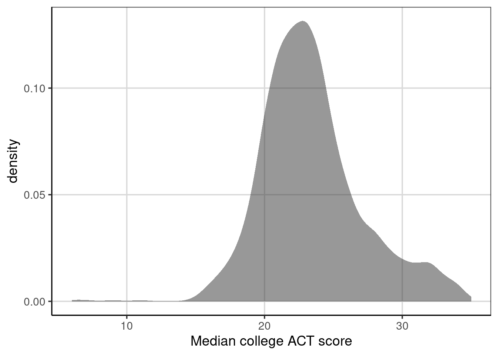
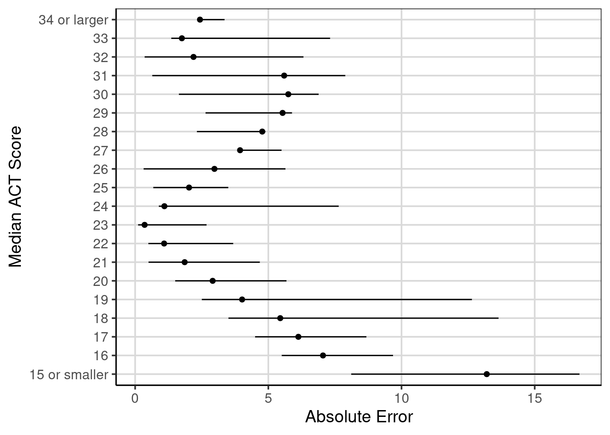
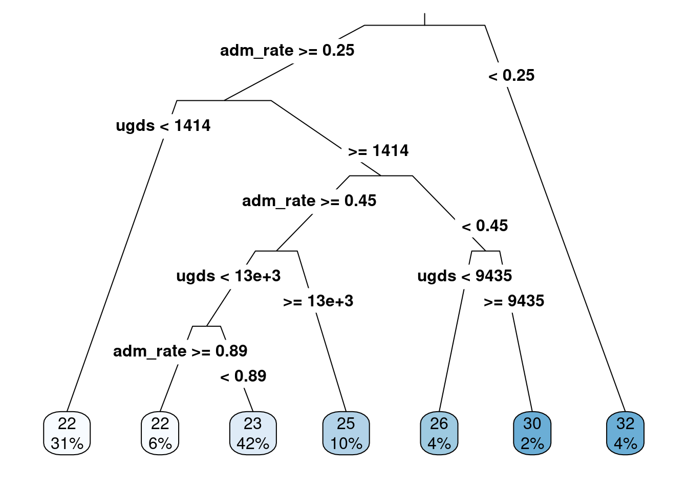
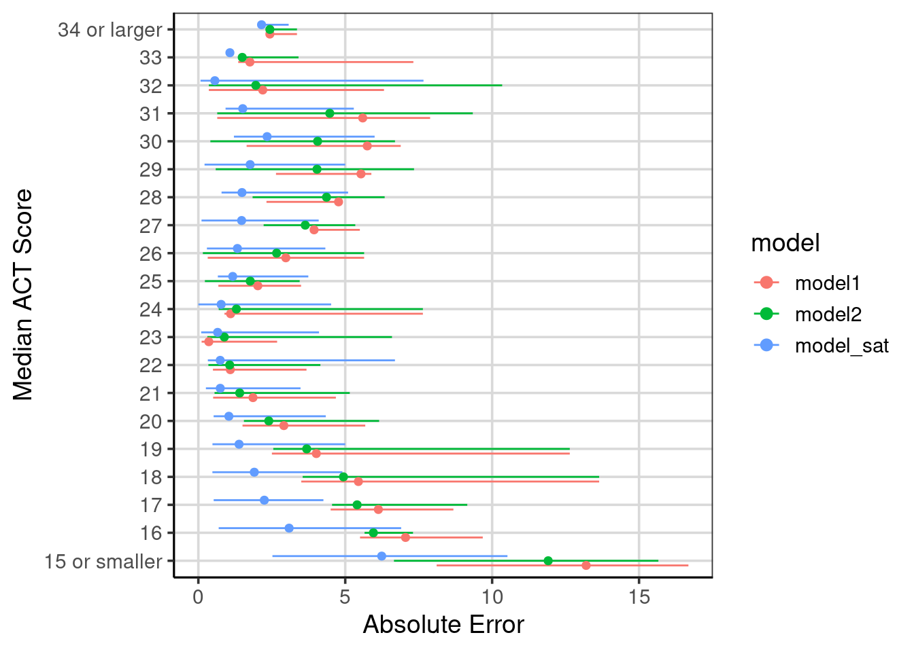

# Regression Trees

Regression trees are an extension of classification trees where the outcome no longer represents categories (e.g., it snowed or did not snow). However, instead, the outcome is a continuous or interval type. For example, earlier in this book, distributions of college admission rates were explored. This represented a continuous or interval-type attribute as the data took on many different values. Regression trees differ from classification trees in that the model's outcome predicts the continuous quantity rather than if an observation belongs to a specific category. For example, a regression tree would predict how much snow fell, such as 5.5 inches, instead of predicting whether it snows or not. The difference in the predicted value has a few implications for the model. First, the accuracy measure used to evaluate the model needs to differ as it is unlikely that the prediction will be the same for any of the data in a regression tree. Secondly, the prediction task is now much more difficult. These two observations must be considered when working with a regression tree.

Much of the machinery is similar between regression and classification trees, however. Most notably, the same tree-type structure will be used to make the prediction. Also, to parallel the classification trees explored so far, the regression trees used in this text will assume that only two splits can occur at any point along the tree. There are also differences between the classification and regression trees. Already discussed is that the outcome attribute is continuous for a regression tree. Therefore, the predicted value will represent one that is continuous instead of a category. Furthermore, since the predictions are done on a continuous scale, a different measure of overall model fit or accuracy will have to be used. This chapter will explore those details in turn. But first, an example of a regression tree.

## Predicting ACT Score
The first example of using a regression tree will attempt to predict the median ACT score for a college institution using other attributes that describe the type of college. Before getting into the model, the packages and the data are loaded.  

### Loading R packages
The following code will load the packages to use for fitting the regression tree and loading the college scorecard data used earlier in the book (see Chapters 2 and 3). 


```r
library(tidyverse)
library(ggformula)
library(mosaic)
library(rpart)
library(rsample)
library(rpart.plot)
library(statthink)
library(parttree)

# Set theme for plots
theme_set(theme_statthinking(base_size = 14))

# Load in data
colleges <- read_csv(
  file = "https://raw.githubusercontent.com/lebebr01/statthink/master/data-raw/College-scorecard-clean.csv", 
  guess_max = 10000
  )
```

### Visualize distributions
Exploring the distribution of the variable of interest is often the first step in an analysis. A density figure is used to understand 


```r
gf_density(~ actcmmid, data = colleges) %>%
  gf_labs(x = "Median college ACT score")
```

```
## Warning: Removed 730 rows containing non-finite outside the scale range
## (`stat_density()`).
```

<div class="figure">

<p class="caption">(\#fig:density-act)Density curve of median college ACT score.</p>
</div>

1. What are the primary features of the distribution for the median ACT score of the college?
2. Could there be concerns regarding specific features of this distribution when analyzing?

## Continuous Association
Estimating whether two continuous/interval attributes are associated or related is often interesting. This can be done with a statistic called the correlation. The correlation measures the degree to which the two attributes move together or not. For example, if one attribute increases, does it indicate whether the second attribute increases (i.e., a positive correlation) or decreases (i.e., a negative correlation)? Before getting to the computation, exploring a sample can be helpful. 

First, it is helpful to explore a scatterplot to understand what the correlation represents. The scatterplot depicts two attributes and places a point where the two attributes intersect. For this first example, a scatterplot with median college ACT score and admission rate is explored. 


```r
gf_point(actcmmid ~ adm_rate, data = colleges, size = 3) %>%
  gf_labs(x = 'Admission Rate',
          y = 'Median College ACT Score')
```

```
## Warning: Removed 730 rows containing missing values or values outside the scale range
## (`geom_point()`).
```

<div class="figure">

<p class="caption">(\#fig:scatter-act)Scatterplot of median college ACT score by college admission rate.</p>
</div>

Figure \@ref(fig:scatter-act) shows the bivariate relationship between median college ACT score and the college admission rate. If these two attributes are unrelated, it would not be possible to identify a trend in the scatterplot. However, there is a noticeable trend in Figure \@ref(fig:scatter-act). As median college ACT scores increase, the admission rates tend to decrease. This example of a negative trend would represent a negative relationship, association, or correlation. 

Although there is a trend in the relationship, there are exceptions to this rule. For instance, notice the points with deficient median college ACT scores; some cases have lower admission rates (about 0.25 or 25%), and some have higher admission rates (above 0.5 or 50%). Focusing on the single point at about 0.25 admission rate and nine median college ACT scores, most of the median college ACT scores for an admission rate around 0.25 are above 30, with a few clustered around 20. This indicates the variation and imperfect relationship between the two attributes. The mantra, "correlation does not mean causation," is common in statistics courses, and this variation and imperfect relationship shows one example of this. In short, it requires precise designs for the data collection to make powerful statements about causation. Most often, the data available represent observations that were simply observed rather than being part of a more stringent experimental design. 

The correlation statistic provides a numeric summary of the degree of relationship between two quantitative attributes. These can be estimated with the `cor()` function. The primary argument is a formula used before and similar to the `gf_point()` function used above. The data argument is specified, and another argument may be helpful when data is missing. This is the `use = 'complete.obs'` argument. Specifying this argument with `'complete.obs'` tells the `cor()` function to remove any missing data on the two attributes being specified and keep any data where pairs of data are present. 


```r
cor(actcmmid ~ adm_rate, data = colleges, use = 'complete.obs')
```

```
## [1] -0.4058855
```

The correlation estimate depicted here is -0.41, which carries two pieces of information. One, it shows the direction of the association. Here, negative means that as one attribute increases, the other tends to decrease (an inverse relationship). This was what was noticed in \@ref(fig:scatter-act). The second element the correlation shows is the magnitude of association. The correlation is standardized, meaning that regardless of the attributes used for the computation, the correlation will always be in the same range. The correlation will exclusively be between -1 and +1. Values of -1 or +1 indicate perfect negative or positive relationships, respectively. A correlation of 0 means no relationship. The correlation in the example was -0.41, which means the relationship is negative/inverse (as one attribute increases, the other tends to decrease) and the magnitude of association is about in between -1 and 0, but slightly closer to 0. What is considered a large, medium, or small association largely depends on the industry, but with education or social science data, this type of association would likely be considered a moderate or medium degree of association. 

The correlation makes one other assumption about the data. The correlation computed above and considered in this text is sometimes referred to as the Pearson correlation. This correlation assumes a straight line or a linear relationship best represents the data. If the relationship is not linear but is best represented by a curved line, the correlation used in this course would likely underrepresent the degree of association. 

*Note: Add some more detail on + or close to 0 correlations*.

### Correlation Computation

The following formula can represent the correlation. In this formula, $\bar{x}, \bar{y}$ are the means for x and y respectively. The terms, $x_{i}$, and $y_{i}$, represent the individual data elements for each attribute. The numerator of the formula represents the deviations from the mean for the two attributes, which are multiplied together and added. The numerator is also referred to as the covariance and measures the degree to which the two attributes move together. 

$$
r = \frac{\sum (x_{i} - \bar{x})(y_{i} - \bar{y})}{\sqrt{\sum(x_{i} - \bar{x})^2}\sqrt{\sum(y_{i} - \bar{y})^2}}
$$

The denominator of the correlation is the standard deviation of the two attributes. These act to standardize the correlation so that no matter which attributes are entered into the formula, the correlation will always be between -1 and +1. 

*Note: maybe add piece about the covariance graphically*.

## First Regression Tree
Another, and related to the correlation, way to explore the relationship between two quantitative attributes is through fitting a regression tree. A regression tree is similar to a classification tree. However, now the output is a numeric or continuous type variable that takes on many different values. In the classification tree example, this class focused on predicting if a case belonged to one of two classes. The regression tree, in contrast, will predict the numeric variable with many potential values rather than just two. This will have implications for how the model is evaluated for accuracy as well as how well the model does at predicting specific values. These will be discussed in more detail later. 

The syntax for fitting a regression tree is similar to the classification tree in R. The same function, `rpart()` is used and the function `rpart.plot()` will be used to visualize the fitted regression tree similar to before. The primary argument to the `rpart()` function is a formula where the left-hand side is the attribute of interest, and the right-hand side contains attributes that help predict the outcome. In the example below, the median college ACT score (`actcmmid`) is the outcome attribute, and the college admission rate (`adm_rate`) is used as the sole continuous attribute to predict the median college ACT score. The data argument is also specified, and the only difference here between a classification tree and a regression tree is the `method` argument. In the regression tree, the method argument should be set to `method = 'anova'`. This tells the `rpart()` function that the outcome is numeric and that an ANOVA method should be used in the model fitting. The ANOVA stands for Analysis of Variance, and we will discuss this in more detail moving forward.


```r
act_reg <- rpart(actcmmid ~ adm_rate, data = colleges, 
                 method = "anova")

rpart.plot(act_reg, roundint = FALSE, type = 3, branch = .3)
```

<div class="figure">

<p class="caption">(\#fig:act-regression-tree)The first regression tree predicting median college ACT score based on the admission rate.</p>
</div>

The output from the regression tree is similar to that from a classification tree. One significant difference is that the predicted values in the end are numeric quantities instead of classes. The probabilities in the classification tree are not shown here, as there is no probability of being in a class. The percentage of cases in the predicted nodes is at the regression tree's end. The logic for following the tree is the same as before, where each split can have two new paths. Then, the variable(s) are re-evaluated after the first split to see if additional splits can help predict the outcome of interest.

Below is a figure that builds on the scatterplot we saw above. Vertical lines indicate the splits established from the regression tree in Figure \@ref(fig:act-regression-tree). The end buckets lie in these splits, and all data points residing in a single area have the same median ACT score. For example, all schools in the left-most quadrant of Figure \@ref(fig:visualize-regression-tree) would all have the same predicted median ACT score of 32. In reality, one can see that the value of 32 is correct for some of the schools, but others in this quadrant have median ACT scores of less than 20. The following section will explore how to estimate the accuracy of the regression tree.


```r
gf_point(actcmmid ~ adm_rate, data = colleges, color = 'gray55') %>% 
    gf_labs(y = "Median college ACT score",
            x = "Admission Rate",
            title = "Log salary by number of home runs") +
  geom_parttree(data = act_reg, aes(fill = actcmmid), alpha = 0.3) + 
  scale_fill_continuous("ACT")
```

```
## Warning: Removed 730 rows containing missing values or values outside the scale range
## (`geom_point()`).
```

<div class="figure">

<p class="caption">(\#fig:visualize-regression-tree)Visual depiction of the regression tree splits.</p>
</div>

## Evaluating accuracy

In the classification tree example, a natural metric to evaluate how well the model was doing was the classification accuracy. Classification accuracy was often best computed for each class instead of a single overall accuracy statistic. The regression tree example shows no class membership; instead, the original observed college ACT score and the predicted college ACT scores can be compared. One measure that could be used for accuracy is how far the predicted scores deviate from the observed scores. Mathematically, this would look like:

$$
accuracy = predicted - observed
$$

However, this will have issues. The computation of the deviation will offset one another. That is, the positive deviations will offset the negative deviations. Therefore, computing the accuracy as the predicted score minus the observed score will, on average, be 0. Similarly to the standard deviation, we could square the difference between the predicted and observed values to get the mean square error. We could also take the square root of the mean square error (MSE) to get the root mean square error (RMSE). The benefit of the RMSE over the MSE is that the RMSE will be on the same metric as the outcome of interest. The equations to compute these statistics are shown:

$$
MSE = \frac{\sum (predicted - observed) ^ 2}{n}
$$

$$
RMSE = \sqrt{\frac{\sum (predicted - observed) ^ 2}{n}}
$$

Another statistic can also be helpful here: the mean absolute error (MAE). This statistic was first introduced in Chapter 3 and is similar to the RMSE above, but instead of squaring values and taking the square root, the absolute value is used instead. This has the strength of never squaring values, so the metric is the same as the outcome, but has the weakness of having weaker statistical properties. The mathematical computation can be shown as:

$$ 
MAE = \frac{\sum \left|predicted - observed \right| }{n}
$$

The below code chunk computes the deviation labeled as an error. The first 10 rows are shown along with the institution name (`instnm`), median ACT score (`actcmmid`), and the predicted median ACT score (`act_pred`). Notice within the error column some values above and below zero. Notice how those with a negative error have median ACT scores less than predicted. Conversely, those with positive errors have median ACT scores greater than the predicted ACT value. 


```r
colleges_pred <- colleges %>%
  drop_na(actcmmid) %>%
  mutate(act_pred = predict(act_reg),
         error = actcmmid - act_pred) %>%
  select(instnm, actcmmid, act_pred, error)
head(colleges_pred, n = 10)
```

```
## # A tibble: 10 × 4
##    instnm                              actcmmid act_pred error
##    <chr>                                  <dbl>    <dbl> <dbl>
##  1 Alabama A & M University                  18     21.5 -3.50
##  2 University of Alabama at Birmingham       25     21.5  3.50
##  3 University of Alabama in Huntsville       28     23.1  4.89
##  4 Alabama State University                  18     21.5 -3.50
##  5 The University of Alabama                 28     23.1  4.89
##  6 Auburn University at Montgomery           22     23.1 -1.11
##  7 Auburn University                         27     23.1  3.89
##  8 Birmingham Southern College               26     23.1  2.89
##  9 Faulkner University                       20     23.1 -3.11
## 10 Huntingdon College                        22     23.1 -1.11
```

The `df_stats()` function can compute summary statistics for the `error` attribute, representing the difference between the observed and predicted college ACT scores. A variety of statistics are computed on the `error` attribute, including the mean, median, variance (var), standard deviation (sd), minimum (min), and maximum (max). 


```r
colleges_pred %>%
  df_stats(~ error, mean, median, var, sd, min, max)
```

```
##   response          mean    median      var       sd       min      max
## 1    error -5.043527e-16 -0.111001 9.919378 3.149504 -16.68116 7.888999
```

Notice from the statistics computed, the mean and median of the deviation or raw error (i.e., $predicted - observed$), the values are very close to zero and are practically zero for the mean. This occurs because the positive and negative errors offset one another. The median is not exactly zero, as the error distribution is not symmetric. Figure \@ref(fig:error-dist) shows the distribution of errors. Notice there is a longer tail on the negative side, meaning that some predicted values are much larger than the observed median ACT score. This is also shown by the min and max statistics computed above. 


```r
gf_density(~ error, data = colleges_pred) %>%
  gf_labs(x = "Error = Predicted - Observed")
```

<div class="figure">

<p class="caption">(\#fig:error-dist)Distribution of error deviations from the regression tree model.</p>
</div>

Circling back to the final statistic computed above, the variance (var) and standard deviation (sd) of the error term represent the MSE and RMSE, respectively, and are interpretable. In general, larger values of these statistics indicate less accuracy. On average, the squared deviations of the predicted minus the observed are larger. In practice, the RMSE is often used more than the MSE as the metric is the same as the outcome, in this case, the median ACT scores. The RMSE of 3.15 says that, on average, the predicted median institution ACT scores are about 3.15 away from the observed median institution ACT score. 

The computation of the mean absolute error is similar, except instead of using the raw deviations (i.e., errors), the computation is done on the absolute value of the deviations. The `abs()` function computes the absolute value in R. In the context of errors, the absolute value is `abs(error)`. The `error` term represents the errors computed as the difference in the predicted and observed median ACT scores. The computation of the mean, median, minimum, and maximum statistics helps interpret model prediction accuracy.


```r
colleges_pred %>%
  df_stats(~ abs(error), mean, median, min, max)
```

```
##     response     mean   median      min      max
## 1 abs(error) 2.396454 1.888999 0.111001 16.68116
```

When interpreting these statistics, the mean and median columns represent the mean and median absolute error. They are on the same scale as the outcome attribute, in this case, the median ACT score. Therefore, the value of 2.4 states that on average the predicted median ACT scores are within 2.4 from the observed scores. Interpretation of the median is similar, but instead of the average absolute deviation, this represents the median absolute deviation. Finally, notice how the absolute value worked. The minimum statistic is positive, whereas before, it was negative. The largest negative deviation/error from before is in the maximum column. The absolute value of the errors can be shown graphically to understand the new distribution fully. 


```r
gf_density(~ abs(error), data = colleges_pred) %>%
  gf_labs(x = "Error = |Predicted - Observed|")
```

<div class="figure">

<p class="caption">(\#fig:absolute-error-dist)The distribution of errors after taking the absolute value .</p>
</div>

This distribution is not symmetric. Instead, it is more like an exponential distribution with many values close to zero and quickly decreasing in frequency of the larger errors. This indicates that many of the predictions are close to the observed value, with a few that are further away indicating worse performance.

It is also worth mentioning that these accuracy statistics are scale-dependent. Therefore, if the scales of the two outcomes differ, the MAE, MSE, or RMSE are not directly comparable without standardization. For example, if the outcome were median SAT scores instead of median ACT scores, the accuracy statistics would naturally be larger due to SAT scores having more variation. For example, the SAT scores for individual sections range from 200 to 800 instead of ACT scores ranging from 0 to 36. The MAE, MSE, or RMSE statistics would look larger due to scale differences, but that would not necessarily mean the model is doing worse. The outcomes or the accuracy statistics would need to be put on the same scale to compare these two outcomes.

### Conditional Error

Similar to problems with just using the overall classification accuracy with classification trees, it can be helpful to use conditional error with regression trees. The conditional error can help to identify areas of the model that are performing worse, more specifically, to understand where the model has larger errors. The `df_stats()` function can be used to compute conditional statistics. The formula input includes two attributes: the error on the left side of the `~` and the attribute to explore the conditional error on the right-hand side. The formula used below explores the MAE across different median ACT scores using the formula, `abs(error) ~ actcmmid`. The function `length` calculates how many schools are in each computation. 


```r
colleges_pred %>%
  df_stats(abs(error) ~ actcmmid, mean, median, min, max, length)
```

```
##      response actcmmid       mean     median        min       max length
## 1  abs(error)        6 15.5032258 15.5032258 15.5032258 15.503226      1
## 2  abs(error)        7 16.1110010 16.1110010 16.1110010 16.111001      1
## 3  abs(error)        9 16.6811594 16.6811594 16.6811594 16.681159      1
## 4  abs(error)       11 12.1110010 12.1110010 12.1110010 12.111001      1
## 5  abs(error)       15  9.3960802  9.3960802  8.1110010 10.681159      2
## 6  abs(error)       16  7.0523290  7.1110010  5.5032258  9.681159     11
## 7  abs(error)       17  6.1276847  6.1110010  4.5032258  8.681159     19
## 8  abs(error)       18  5.4476764  5.1110010  3.5032258 13.642857     32
## 9  abs(error)       19  4.0157276  4.1110010  2.5032258 12.642857     59
## 10 abs(error)       20  2.9102946  3.1110010  1.5032258  5.681159    117
## 11 abs(error)       21  1.8594407  2.1110010  0.5032258  4.681159    156
## 12 abs(error)       22  1.0878288  1.1110010  0.4967742  3.681159    166
## 13 abs(error)       23  0.3555768  0.1110010  0.1110010  2.681159    174
## 14 abs(error)       24  1.0982335  0.8889990  0.8889990  7.642857    155
## 15 abs(error)       25  2.0242671  1.8889990  0.6811594  3.496774    101
## 16 abs(error)       26  2.9769006  2.8889990  0.3188406  5.642857     70
## 17 abs(error)       27  3.9392465  3.8889990  3.8889990  5.496774     47
## 18 abs(error)       28  4.7721736  4.8889990  2.3188406  4.888999     44
## 19 abs(error)       29  5.5355597  5.8889990  2.6428571  5.888999     31
## 20 abs(error)       30  5.7496633  6.8889990  1.6428571  6.888999     25
## 21 abs(error)       31  5.5947035  5.3188406  0.6428571  7.888999     22
## 22 abs(error)       32  2.1915114  0.3571429  0.3571429  6.318841     26
## 23 abs(error)       33  1.7545894  1.3571429  1.3571429  7.318841     15
## 24 abs(error)       34  2.3571429  2.3571429  2.3571429  2.357143     12
## 25 abs(error)       35  3.3571429  3.3571429  3.3571429  3.357143      1
```

Notice a row for each median ACT score found in the data and that each statistic is computed for each unique median ACT score. Procedurally, the data are split into compartments, and the statistics are computed on the data that fit into those compartments. The MAE (shown by the mean column) shows larger errors at low values of median ACT score, which decreases quickly until a median ACT score of 23, then increases slightly, then decreases again for higher values. 

Before spending too much time with this table, peak at the last column, labeled length. This column tells how many data points are in each of the compartments to do the calculation. In general, compartments with less data will produce more unstable statistics. For instance, very few schools have poor ACT scores, for example, scores of 15 and under. Furthermore, only one school has a median ACT score of 35. When there are small numbers for some of these categories, combining them to evaluate model accuracy can be helpful. In this example, ACT scores less than 15 in one category and 34 and higher in another. The other median ACT scores are in the category by themselves.


```r
colleges_pred <- colleges_pred %>%
  mutate(act_recode = ifelse(actcmmid <= 15, '15 or smaller', 
                             ifelse(actcmmid >= 34, '34 or larger', actcmmid)))
```

The `mutate()` function above collapses the categories and creates a new attribute named `act_recode.` Then, this new attribute is used to compute the MAE and other statistics to evaluate conditional model performance. Notice that the length column at the end no longer has categories with a single data point in them. Rather, the smallest is now six, which is still small, but at least there is more than one data point in them. Similar trends to those discussed above pertain here. 


```r
conditional_error <- colleges_pred %>%
  df_stats(abs(error) ~ act_recode, mean, median, min, max, length)

conditional_error
```

```
##      response    act_recode       mean     median       min       max length
## 1  abs(error) 15 or smaller 13.1997579 13.8071134 8.1110010 16.681159      6
## 2  abs(error)            16  7.0523290  7.1110010 5.5032258  9.681159     11
## 3  abs(error)            17  6.1276847  6.1110010 4.5032258  8.681159     19
## 4  abs(error)            18  5.4476764  5.1110010 3.5032258 13.642857     32
## 5  abs(error)            19  4.0157276  4.1110010 2.5032258 12.642857     59
## 6  abs(error)            20  2.9102946  3.1110010 1.5032258  5.681159    117
## 7  abs(error)            21  1.8594407  2.1110010 0.5032258  4.681159    156
## 8  abs(error)            22  1.0878288  1.1110010 0.4967742  3.681159    166
## 9  abs(error)            23  0.3555768  0.1110010 0.1110010  2.681159    174
## 10 abs(error)            24  1.0982335  0.8889990 0.8889990  7.642857    155
## 11 abs(error)            25  2.0242671  1.8889990 0.6811594  3.496774    101
## 12 abs(error)            26  2.9769006  2.8889990 0.3188406  5.642857     70
## 13 abs(error)            27  3.9392465  3.8889990 3.8889990  5.496774     47
## 14 abs(error)            28  4.7721736  4.8889990 2.3188406  4.888999     44
## 15 abs(error)            29  5.5355597  5.8889990 2.6428571  5.888999     31
## 16 abs(error)            30  5.7496633  6.8889990 1.6428571  6.888999     25
## 17 abs(error)            31  5.5947035  5.3188406 0.6428571  7.888999     22
## 18 abs(error)            32  2.1915114  0.3571429 0.3571429  6.318841     26
## 19 abs(error)            33  1.7545894  1.3571429 1.3571429  7.318841     15
## 20 abs(error)  34 or larger  2.4340659  2.3571429 2.3571429  3.357143     13
```

It can be helpful to visualize some of these statistics to help facilitate any trend in the model performance across the median ACT values. A point range plot shows the average mean absolute error and minimum and maximum absolute error values for each median ACT score. The dot in the figure represents the mean absolute error, and the range of the horizontal line stretches to the minimum and maximum absolute error statistics. The `gf_pointrange()` function aids in plotting this in R. The formula input for this function is `y-scores ~ mean-value + min-value + max-value`. 


```r
gf_pointrange(act_recode ~ mean + min + max, 
               data = conditional_error) %>% 
  gf_labs(y = "Median ACT Score",
          x = "Absolute Error")
```

<div class="figure">

<p class="caption">(\#fig:cond-error-figure)Ranges of absolute errors across different median ACT scores with mean absolute error.</p>
</div>

Figure \@ref(fig:cond-error-figure) shows these values with the MAE shown with the circles, and the horizontal lines extend to the minimum and maximum absolute values for each median ACT score. The trend of decreasing absolute error from small median ACT scores up to a score of 23. Then, the error tends to increase, then decrease again for higher median ACT scores. This shows that the regression tree model is doing well for median ACT scores around 23 and median ACT scores around 33. 

Another notable feature this figure helps to articulate is the range of absolute errors. For instance, with median ACT scores of 18 or 19, the absolute error ranges from less than 5 to about 13 or 14. This large range of errors is less surprising here than the regression tree used to generate these errors, only using a single attribute to help predict the median ACT score for institutions, the admission rate. Other attributes may help reduce the error and increase the model's utility, but this is a good baseline to compare how well other models perform. 

#### Explore another attribute
Let us explore another attribute, the undergraduate enrollment of institutions, to see if it is related to the median ACT score. First, a scatterplot is shown then the correlation is computed.


```r
gf_point(actcmmid ~ ugds, data = colleges, size = 3) %>%
  gf_labs(x = "Undergraduate Enrollment",
          y = "Median ACT Score")
```

```
## Warning: Removed 730 rows containing missing values or values outside the scale range
## (`geom_point()`).
```


The correlation is 0.27 between median ACT score and the undergraduate enrollment of institutions. 


```r
act_reg2 <- rpart(actcmmid ~ adm_rate + ugds, data = colleges, method = "anova")

rpart.plot(act_reg2, roundint = FALSE, type = 3, branch = .3)
```

<div class="figure">

<p class="caption">(\#fig:two-attr-regtree)Regression tree with admission rates and ungraduate enrollments predicting median ACT score</p>
</div>

Figure \@ref(fig:two-attr-regtree) shows the regression tree when adding the undergraduate enrollment attribute and the admission rate. The regression tree shows that the admission rate is the most important attribute in predicting the median ACT score (the first split in the regression tree). However, undergraduate enrollment is important as this is the second split for those with admission rates greater than 25%. 

To fully understand how much better this model is than the one with only admission rates included, we can use MAE to evaluate the prediction accuracy. First, the predicted values from the new model and the new errors (predicted - observed) must be added to the data. 


```r
colleges_pred <- colleges_pred %>%
  mutate(act_pred2 = predict(act_reg2),
         error2 = actcmmid - act_pred2)

colleges_pred
```

```
## # A tibble: 1,289 × 7
##    instnm                    actcmmid act_pred error act_recode act_pred2 error2
##    <chr>                        <dbl>    <dbl> <dbl> <chr>          <dbl>  <dbl>
##  1 Alabama A & M University        18     21.5 -3.50 18              21.6 -3.55 
##  2 University of Alabama at…       25     21.5  3.50 25              24.8  0.222
##  3 University of Alabama in…       28     23.1  4.89 28              23.3  4.69 
##  4 Alabama State University        18     21.5 -3.50 18              21.6 -3.55 
##  5 The University of Alabama       28     23.1  4.89 28              24.8  3.22 
##  6 Auburn University at Mon…       22     23.1 -1.11 22              23.3 -1.31 
##  7 Auburn University               27     23.1  3.89 27              24.8  2.22 
##  8 Birmingham Southern Coll…       26     23.1  2.89 26              21.7  4.34 
##  9 Faulkner University             20     23.1 -3.11 20              23.3 -3.31 
## 10 Huntingdon College              22     23.1 -1.11 22              21.7  0.342
## # ℹ 1,279 more rows
```


```r
conditional_error2 <- colleges_pred %>%
  df_stats(abs(error2) ~ act_recode, mean, median, min, max, length)

conditional_error2
```

```
##       response    act_recode       mean     median       min       max length
## 1  abs(error2) 15 or smaller 11.9076028 13.6583541 6.6583541 15.658354      6
## 2  abs(error2)            16  5.9580028  5.6583541 5.6583541  7.306422     11
## 3  abs(error2)            17  5.4041307  4.6583541 4.5512821  9.153846     19
## 4  abs(error2)            18  4.9394393  3.6583541 3.5512821 13.642857     32
## 5  abs(error2)            19  3.6881805  2.6583541 2.5512821 12.642857     59
## 6  abs(error2)            20  2.3972274  1.6583541 1.5512821  6.153846    117
## 7  abs(error2)            21  1.4072426  0.6583541 0.5512821  5.153846    156
## 8  abs(error2)            22  1.0661678  1.3064220 0.3416459  4.153846    166
## 9  abs(error2)            23  0.8835657  0.3064220 0.3064220  6.590909    174
## 10 abs(error2)            24  1.2956011  0.6935780 0.6935780  7.642857    155
## 11 abs(error2)            25  1.7661025  1.6935780 0.2222222  3.448718    101
## 12 abs(error2)            26  2.6643144  2.6935780 0.1538462  5.642857     70
## 13 abs(error2)            27  3.6386582  3.6935780 2.2222222  5.341646     47
## 14 abs(error2)            28  4.3625148  4.6935780 1.8461538  6.341646     44
## 15 abs(error2)            29  4.0390696  4.2222222 0.5909091  7.341646     31
## 16 abs(error2)            30  4.0587815  3.8461538 0.4090909  6.693578     25
## 17 abs(error2)            31  4.4734457  4.8461538 0.6428571  9.341646     22
## 18 abs(error2)            32  1.9545834  0.3571429 0.3571429 10.341646     26
## 19 abs(error2)            33  1.4939394  1.3571429 1.3571429  3.409091     15
## 20 abs(error2)  34 or larger  2.4340659  2.3571429 2.3571429  3.357143     13
```


```r
bind_rows(
  mutate(conditional_error, model = 'model1'),
  mutate(conditional_error2, model = 'model2')
) %>%
  gf_pointrange(act_recode ~ mean + min + max, 
                 color = ~ model,
               position = position_dodge(width = 0.5)) %>% 
  gf_labs(y = "Median ACT Score",
          x = "Absolute Error")
```

<div class="figure">

<p class="caption">(\#fig:cond-error-compare)Compared absolute error across the two regression tree models fitted.</p>
</div>

Comparison of the conditional error can be helpful to evaluate areas of the model that improved and if any other areas did not improve or were worse. 

## Adding more attributes

To evaluate how well this model can do, all attributes will be open to be included in the final model. The institution name is the only one removed from the data. This can be done with the `.` character after the `~` in the model formula. The model tree is not printed as it is large and cannot be easily viewed. Instead, the accuracy evaluation will be compared to the other two models fitted. The attributes included in the final model, though, can be accessed and ranked by those most important. 


```r
act_reg_sat <- rpart(actcmmid ~ ., 
                     data = select(colleges, -instnm),
                                   method = "anova")

colleges_pred <- colleges_pred %>%
  mutate(act_pred_sat = predict(act_reg_sat),
         error_sat = actcmmid - act_pred_sat)

conditional_error_sat <- colleges_pred %>%
  df_stats(abs(error_sat) ~ act_recode, mean, median, min, max, length)

act_reg_sat$variable.importance
```

```
##           city tuitionfee_out  tuitionfee_in       costt4_a       adm_rate 
##    10608.27504     8438.13169     7869.78358     6700.46334     2858.66475 
##         stabbr       debt_mdn  grad_debt_mdn           ugds         region 
##     1420.67466      696.36673      570.77579      210.91393       76.49506 
##         locale 
##       53.73178
```

The table below shows the most important attributes, with those at the top of the table being more important than those at the bottom. Notice that the most important three attributes are the city, the tuition, and the cost. 


|               |           x|
|:--------------|-----------:|
|city           | 10608.27504|
|tuitionfee_out |  8438.13169|
|tuitionfee_in  |  7869.78358|
|costt4_a       |  6700.46334|
|adm_rate       |  2858.66475|
|stabbr         |  1420.67466|
|debt_mdn       |   696.36673|
|grad_debt_mdn  |   570.77579|
|ugds           |   210.91393|
|region         |    76.49506|
|locale         |    53.73178|

The evaluation accuracy of this model that could contain most of the attributes in the data is shown in Figure \@ref(fig:sat-eval-acc). The figure also shows the comparisons to the other two models explored in this chapter, labeled as 'model1' and 'model2', respectively. Notice the improvement across all of the median ACT scores for the model that was fitted with the ability to include all attributes. 


```r
bind_rows(
  mutate(conditional_error, model = 'model1'),
  mutate(conditional_error2, model = 'model2'),
  mutate(conditional_error_sat, model = 'model_sat')
) %>%
  mutate(model = factor(model, levels = c('model1', 'model2', 'model_sat'))) %>%
  gf_pointrange(act_recode ~ mean + min + max, 
                 color = ~ model,
               position = position_dodge(width = 0.5)) %>% 
  gf_labs(y = "Median ACT Score",
          x = "Absolute Error")
```

<div class="figure">

<p class="caption">(\#fig:sat-eval-acc)Evaluation of model accuracy across the three models fitted.</p>
</div>

