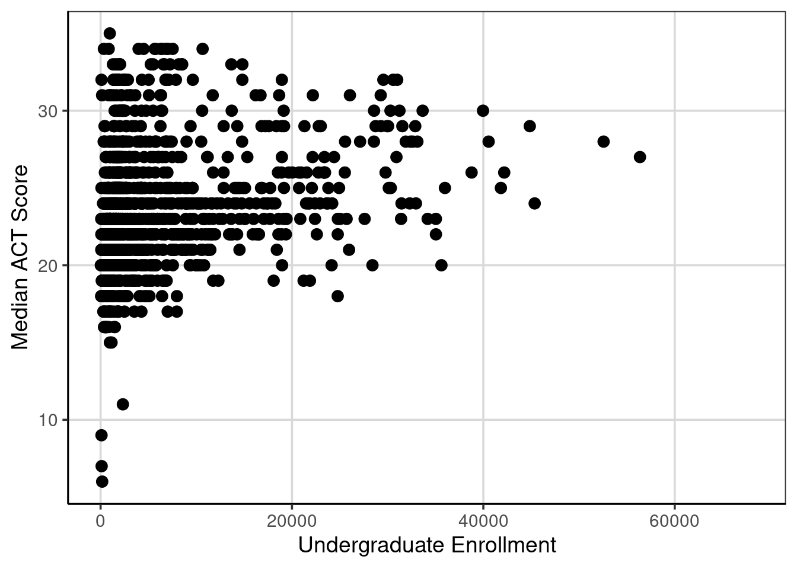

# Regression Trees

Regression trees are an extension of classification trees where the outcome no longer represents categories (e.g., it snowed or did not snow), but instead represents a continuous or interval type outcome. For example, earlier in this book, distributions of college admission rates were explored, this represented a continuous or interval type attribute as the data took on many different values. Regression trees differ from classification trees in that the outcome of the model is a prediction of the continuous quantity rather than predicting if an observation belongs to a specific category. 

Much of the machinery is similar however. Most notably, the same tree type structure will be used to make the prediction. Also, to parallel the classification trees explored so far, the regression trees used in this text will assume that only two splits can occur at any point along the tree. There are also differences between the classification and regression trees. Already discussed is the outcome attribute is continuous for a regression tree, therefore the predicted value will represent one that is continuous as well instead of representing a category. Furthermore, since the predictions are done on a continuous scale, a different measure of overall model fit or accuracy will have to be used. This chapter will explore those details in turn. But first, an example of a regression tree.

## Predicting ACT Score
The first example of using a regression tree will attempt to predict the median ACT score for a college institution using other attributes that describe the type of college. Before getting into the model, the packages and loading of the data needs to be done.  

### Loading R packages
The following code will load the packages to use for the fitting of the regression tree and loading of the college scorecard data that was used earlier in the book (see Chapters 2 and 3). 


```r
library(tidyverse)
library(ggformula)
library(mosaic)
library(rpart)
library(rsample)
library(rpart.plot)
library(statthink)
library(parttree)

# Set theme for plots
theme_set(theme_statthinking())

# Load in data
colleges <- read_csv(
  file = "https://raw.githubusercontent.com/lebebr01/statthink/master/data-raw/College-scorecard-clean.csv", 
  guess_max = 10000
  )
```

### Visualize distributions
Exploring the distribution of the variable of interest is often the first step in an analysis. A density figure is used to understand 


```r
gf_density(~ actcmmid, data = colleges) %>%
  gf_labs(x = "Median college ACT score")
```

```
## Warning: Removed 730 rows containing non-finite values (stat_density).
```

<div class="figure">

<p class="caption">(\#fig:density-act)Density curve of median college ACT score.</p>
</div>

1. What are the primary features of the distribution for median ACT score of the college?
2. Could there be concerns about specific features of this distribution if we are looking to do an analysis on this?

## Continuous Association
It is often interesting to estimate whether two continuous/interval attributes are associated or related to one another. This can be done with a statistic called the correlation. The correlation represents ...

To come...

## First Regression Tree
Another way to explore the relationship between two quantitative attributes is through the fitting a regression tree. A regression tree is similar to a classification tree, however now the output is a numeric or continuous type variable that takes on many different values. In the classification tree example, the focus in this class was predicting if a case belonged to one of two classes. In this case, the regression tree will predict the numeric variable with many potential values rather than just two.

The syntax for fitting a regression tree is very similar in R compared to the classification tree. The same function, `rpart()` is used and the function `rpart.plot()` will be used to visualize the fitted regression tree similar to before. The primary argument to the `rpart()` function is a formula where the left-hand side is the attribute of interest and the right hand side contains attributes that help predict the outcome. In the example below, the median college ACT score (`actcmmid`) is the outcome attribute and the college admission rate (`adm_rate`) is used as the sole continuous attribute used to predict the median college ACT score. The data argument is also specified and the only difference here between a classification tree and the regression tree here is the `method` argument. In the regression tree the method argument should be set to `method = 'anova'`. This tells the `rpart()` function that the outcome is numeric and that an anova method should be used in the model fitting. The anova stands for Analysis of Variance and we will discuss this in more detail moving forward.


```r
act_reg <- rpart(actcmmid ~ adm_rate, data = colleges, method = "anova")

rpart.plot(act_reg, roundint = FALSE, type = 3, branch = .3)
```


The output from the regression tree is similar to that from a classification tree. One major difference however is that the predicted values in the end are numeric quantities instead of classes and the probabilities that were shown previously are not shown here as there is not a probability of being in a class. The percentage of cases in the predicted nodes at the end of the tree are still shown. The logic for following the tree is the same as before where each split can have two new paths to follow and then the variable(s) are re-evaluated after the first split to see if additional splits can help predict the outcome of interest.

Below is a figure that builds on the scatterplot we saw above. Vertical lines are shown that indicate the two splits that were established from the above regression tree. These splits are where the end buckets lie and all of the data points residing in a single area have the same median ACT score.


```r
gf_point(actcmmid ~ adm_rate, data = colleges, color = 'gray55') %>% 
    gf_labs(y = "Median college ACT score",
            x = "Admission Rate",
            title = "Log salary by number of home runs") +
  geom_parttree(data = act_reg, aes(fill = actcmmid), alpha = 0.3) + 
  scale_fill_continuous("ACT")
```

```
## Warning: Removed 730 rows containing missing values (geom_point).
```


#### Explore another attribute
Let's explore another attribute, the number of hits in the previous season and how this may be related to the log of the salary. First a scatterplot is shown then the correlation is computed.


```r
act_reg2 <- rpart(actcmmid ~ adm_rate + ugds, data = colleges, method = "anova")

rpart.plot(act_reg2, roundint = FALSE, type = 3, branch = .3)
```


The figure below attempts to show the regression tree in a scatterplot. Now there are more predicted buckets and these are represented by the square areas of the figure below. All of the data points within each square would receive the same predicted score.


```r
ggplot(data = colleges, aes(x = adm_rate, y = ugds)) +
  geom_parttree(data = act_reg2, aes(fill = actcmmid), alpha = 0.3) +
  geom_point(aes(color = actcmmid)) +
  scale_colour_viridis_c(
    limits = range(colleges$actcmmid, na.rm = TRUE), 
    aesthetics = c('colour', 'fill')
    )
```



## Evaluating accuracy

In the classification tree example, a natural metric to evaluate how well the model was doing was the classification accuracy. This was most useful being computed individually for each class that was predicted instead of solely overall. In the regression tree example, there is no class membership, instead the original observed college ACT score and the predicted college ACT scores can be compared. One measure that could be used for accuracy is on average how far do the predicted scores deviate from the observed scores. The below code chunk computes those variables.


```r
colleges_pred <- colleges %>%
  drop_na(actcmmid) %>%
  mutate(act_pred = predict(act_reg2),
         error = actcmmid - act_pred) %>%
  select(instnm, actcmmid, act_pred, error)
head(colleges_pred, n = 10)
```

```
## # A tibble: 10 x 4
##    instnm                              actcmmid act_pred  error
##    <chr>                                  <dbl>    <dbl>  <dbl>
##  1 Alabama A & M University                  18     21.6 -3.55 
##  2 University of Alabama at Birmingham       25     24.8  0.222
##  3 University of Alabama in Huntsville       28     23.3  4.69 
##  4 Alabama State University                  18     21.6 -3.55 
##  5 The University of Alabama                 28     24.8  3.22 
##  6 Auburn University at Montgomery           22     23.3 -1.31 
##  7 Auburn University                         27     24.8  2.22 
##  8 Birmingham Southern College               26     21.7  4.34 
##  9 Faulkner University                       20     23.3 -3.31 
## 10 Huntingdon College                        22     21.7  0.342
```

The `df_stats()` function is used to compute summary statistics for the `error` attribute which represented the difference between the observed and predicted college ACT score. 


```r
colleges_pred %>%
  df_stats(~ error, mean, median, sd, min, max)
```

```
##   response         mean    median       sd       min      max
## 1    error 4.682798e-16 0.2222222 2.895112 -15.65835 10.34165
```

Instead of computing the average deviation, we first want to take the absolute value of the difference between the observed and predicted scores then compute the summary statistics. This now represents the mean absolute error that was computed earlier when discussing variation and the interpretation of the mean statistic below would be the average distance the predicted scores are from the observed scores, on the median college ACT score scale. In general, lower average distances indicates the model did a better job of predicting the numeric quantity. However, this value is scale dependent, therefore if the scales of two outcomes are different, the mean absolute error is not directly comparable without standardization.


```r
colleges_pred %>%
  df_stats(~ abs(error), mean, median, sd, min, max)
```

```
##     response     mean   median       sd       min      max
## 1 abs(error) 2.175864 1.658354 1.908825 0.1538462 15.65835
```

### Conditional Error

```r
colleges_pred %>%
  df_stats(abs(error) ~ actcmmid, mean, median, sd, min, max, length)
```

```
##      response actcmmid       mean     median        sd        min       max
## 1  abs(error)        6 15.6583541 15.6583541        NA 15.6583541 15.658354
## 2  abs(error)        7 14.6583541 14.6583541        NA 14.6583541 14.658354
## 3  abs(error)        9 12.6583541 12.6583541        NA 12.6583541 12.658354
## 4  abs(error)       11 15.1538462 15.1538462        NA 15.1538462 15.153846
## 5  abs(error)       15  6.6583541  6.6583541 0.0000000  6.6583541  6.658354
## 6  abs(error)       16  5.9580028  5.6583541 0.6666763  5.6583541  7.306422
## 7  abs(error)       17  5.4041307  4.6583541 1.2009643  4.5512821  9.153846
## 8  abs(error)       18  4.9394393  3.6583541 2.1404154  3.5512821 13.642857
## 9  abs(error)       19  3.6881805  2.6583541 1.6666583  2.5512821 12.642857
## 10 abs(error)       20  2.3972274  1.6583541 0.9834885  1.5512821  6.153846
## 11 abs(error)       21  1.4072426  0.6583541 1.0161218  0.5512821  5.153846
## 12 abs(error)       22  1.0661678  1.3064220 0.8946522  0.3416459  4.153846
## 13 abs(error)       23  0.8835657  0.3064220 0.7303649  0.3064220  6.590909
## 14 abs(error)       24  1.2956011  0.6935780 0.9820537  0.6935780  7.642857
## 15 abs(error)       25  1.7661025  1.6935780 1.0169400  0.2222222  3.448718
## 16 abs(error)       26  2.6643144  2.6935780 1.1934238  0.1538462  5.642857
## 17 abs(error)       27  3.6386582  3.6935780 0.8296033  2.2222222  5.341646
## 18 abs(error)       28  4.3625148  4.6935780 1.2600346  1.8461538  6.341646
## 19 abs(error)       29  4.0390696  4.2222222 1.9600094  0.5909091  7.341646
## 20 abs(error)       30  4.0587815  3.8461538 2.3995578  0.4090909  6.693578
## 21 abs(error)       31  4.4734457  4.8461538 3.0245455  0.6428571  9.341646
## 22 abs(error)       32  1.9545834  0.3571429 2.7742406  0.3571429 10.341646
## 23 abs(error)       33  1.4939394  1.3571429 0.5298107  1.3571429  3.409091
## 24 abs(error)       34  2.3571429  2.3571429 0.0000000  2.3571429  2.357143
## 25 abs(error)       35  3.3571429  3.3571429        NA  3.3571429  3.357143
##    length
## 1       1
## 2       1
## 3       1
## 4       1
## 5       2
## 6      11
## 7      19
## 8      32
## 9      59
## 10    117
## 11    156
## 12    166
## 13    174
## 14    155
## 15    101
## 16     70
## 17     47
## 18     44
## 19     31
## 20     25
## 21     22
## 22     26
## 23     15
## 24     12
## 25      1
```


## Adding more attributes
To come ...
