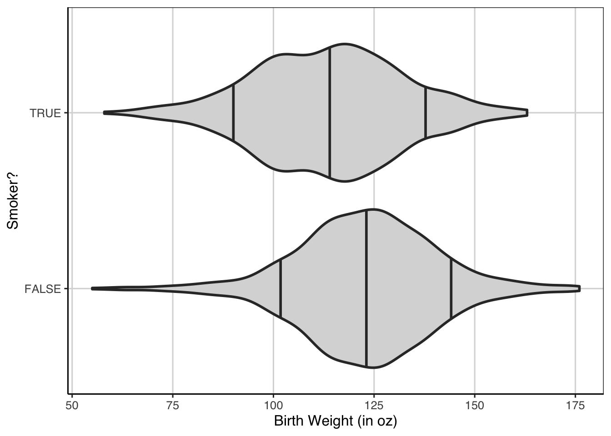
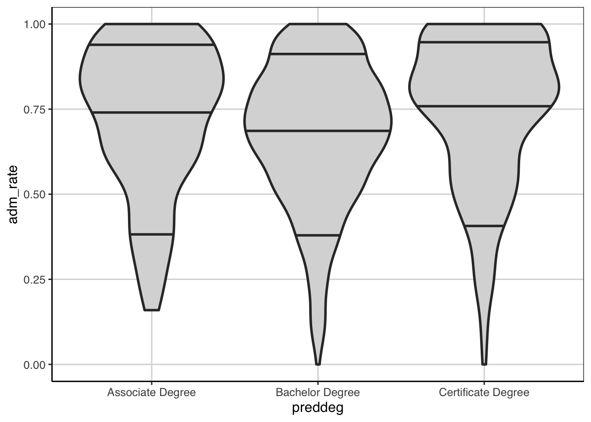

# Estimation / Bootstrap / Uncertainty   


```r
library(tidyverse)
library(ggformula)
library(mosaic)
library(broom)
library(statthink)

# Set theme for plots
theme_set(theme_statthinking())

baby <- read_csv("https://raw.githubusercontent.com/lebebr01/statthink/master/data-raw/baby.csv")
head(baby)
```

```
## # A tibble: 6 x 6
##   birth_weight gestational_days maternal_age maternal_height maternal_pregna…
##          <dbl>            <dbl>        <dbl>           <dbl>            <dbl>
## 1          120              284           27              62              100
## 2          113              282           33              64              135
## 3          128              279           28              64              115
## 4          108              282           23              67              125
## 5          136              286           25              62               93
## 6          138              244           33              62              178
## # … with 1 more variable: maternal_smoker <lgl>
```


Bootstrap and resampling methods can be used to estimate the variability in the estimated effects. 

## Estimating Error
To get some sense of the amount of error in the estimate of the linear slope here, a bootstrap can be done to provide some evidence of the likely range of slope values. The bootstrap will take the following general steps:

1. Resample the observed data available, with replacement
2. Fit the same linear regression model as above.
3. Save the slope coefficient representing the relationship between birth weight and gestational days
4. Repeat steps 1 - 3 many times
5. Explore the distribution of slope estimates from the many resampled data sets.

When this was done with the classification tree, a function was used to do these steps once, then these were repeated many times. Below is a function that does the steps 1 - 3 above a single time.


```r
resample_baby <- function(...) {
  baby_resample <- baby %>%
    sample_n(nrow(baby), replace = TRUE)

  baby_resample %>%
    lm(birth_weight ~ gestational_days, data = .) %>%
    coef(.) %>%
    .[2] %>%
    data.frame()
}

resample_baby()
```

```
##                          .
## gestational_days 0.4535684
```

Now that there is a function that does steps 1 - 3, these processes can now be repeated many times.


```r
baby_coef <- map(1:10000, resample_baby) %>%
  bind_rows()
names(baby_coef) <- 'slope'

gf_density(~ slope, data = baby_coef)
```


```r
baby_coef %>%
  df_stats(~ slope, quantile(c(0.05, 0.5, 0.95)))
```

```
##          5%       50%       95%
## 1 0.3951448 0.4682622 0.5443661
```

## Categorical Predictor(s)
Before, linear regression has been ran with a continuous attribute. In both models, the baby's birth weight was the outcome of interest and the predictor in one model was the number of gestational days and in the other was the age of the mother at time of birth. What happens when a categorical predictor is used instead of a continuous predictor? This section will introduce that idea with a categorical predictor that has two different levels.

### Mother's smoking
It is known that a mother smoking while pregnant can hamper the development of the unborn fetus. Will this transition into lower birth weight for baby's born to mothers who smoked during the pregnancy? First, let's explore the distribution and calculate descriptive statistics for birth weight across the two groups.


```r
gf_density(~ birth_weight, color = ~ maternal_smoker, size = 1.25, fill = 'gray80', data = baby) %>%
  gf_labs(x = 'Birth Weight (in oz)',
          color = 'Smoked?')
```


What are the general take-aways from the distributions above? To give some additional information, a violin plot may be helpful.


```r
gf_violin(birth_weight ~ maternal_smoker, data = baby, draw_quantiles = c(0.1, 0.5, 0.9), 
           fill = 'gray85', size = 1) %>%
  gf_refine(coord_flip()) %>%
  gf_labs(y = "Birth Weight (in oz)",
          x = "Smoker?")
```



Any additional information shown here that shows differences? To finish the descriptive exploration, let's compute some descriptive statistics.


```r
baby %>%
  df_stats(birth_weight ~ maternal_smoker, mean, sd, median, quantile(c(0.25, 0.75)), length)
```

```
##   maternal_smoker mean_birth_weight sd_birth_weight median_birth_weight 25% 75%
## 1           FALSE          123.0853        17.42370                 123 113 134
## 2            TRUE          113.8192        18.29501                 115 101 126
##   length_birth_weight
## 1                 715
## 2                 459
```

### Linear Regression - Categorical Predictor
Now it is time to fit a model to the data here to explore if there indeed is a difference in the population. We know descriptively there is a difference in the two group means and medians, but is this difference large enough to be practical? The model is fitted similar to before with the `lm()` function and a similar formula as before. The outcome (birth weight) is to the left of the `~` and the predictor (maternal smoking status) is to the right.


```r
smoker_reg <- lm(birth_weight ~ maternal_smoker, data = baby)
coef(smoker_reg)
```

```
##         (Intercept) maternal_smokerTRUE 
##          123.085315           -9.266143
```

To explore what these coefficients mean in a bit more detail, let's look at the data a bit more.


```r
baby <- baby %>%
  mutate(smoker = ifelse(maternal_smoker, 1, 0))
head(baby)
```

```
## # A tibble: 6 x 7
##   birth_weight gestational_days maternal_age maternal_height maternal_pregna…
##          <dbl>            <dbl>        <dbl>           <dbl>            <dbl>
## 1          120              284           27              62              100
## 2          113              282           33              64              135
## 3          128              279           28              64              115
## 4          108              282           23              67              125
## 5          136              286           25              62               93
## 6          138              244           33              62              178
## # … with 2 more variables: maternal_smoker <lgl>, smoker <dbl>
```

Instead of using the `maternal_smoker` attribute, instead let's run the model with the `smoker` attribute.


```r
smoker_reg_new <- lm(birth_weight ~ smoker, data = baby)
coef(smoker_reg_new)
```

```
## (Intercept)      smoker 
##  123.085315   -9.266143
```

Notice that the coefficients for the linear regression are the same no matter which attribute is entered into the model. When a categorical attribute is entered into the regression in R, the attribute is automatically converted into something called an indicator or dummy variable. This means that one of the two values are represented with a 1, the other with a 0. The value that is represented with a 0 is the one that is closer to the letter "A", meaning that the 0 is the first category in alphabetical order.

To again get a better grasp, the descriptive stats and the coefficients from the regression are shown together below.


```r
baby %>%
  df_stats(birth_weight ~ maternal_smoker, mean, sd, median, quantile(c(0.25, 0.75)), length)
```

```
##   maternal_smoker mean_birth_weight sd_birth_weight median_birth_weight 25% 75%
## 1           FALSE          123.0853        17.42370                 123 113 134
## 2            TRUE          113.8192        18.29501                 115 101 126
##   length_birth_weight
## 1                 715
## 2                 459
```

```r
coef(smoker_reg)
```

```
##         (Intercept) maternal_smokerTRUE 
##          123.085315           -9.266143
```

### Inference
Similar to the continuous predictor, resampling/bootstrap takes a similar method in the case with a single categorical predictor.

In order to get some sense of the amount of error in the estimate of the linear slope here, a bootstrap can be done to provide some evidence of the likely range of slope values. The bootstrap will take the following general steps:

1. Resample the observed data available, with replacement
2. Fit the same linear regression model as above.
3. Save the slope coefficient representing the relationship between birth weight and gestational days
4. Repeat steps 1 - 3 many times
5. Explore the distribution of slope estimates from the many resampled data sets.


```r
resample_baby <- function(...) {
  baby_resample <- baby %>%
    sample_n(nrow(baby), replace = TRUE)

  baby_resample %>%
    lm(birth_weight ~ maternal_smoker, data = .) %>%
    coef(.) %>%
    .[2] %>%
    data.frame()
}

resample_baby()
```

```
##                             .
## maternal_smokerTRUE -9.993283
```

Now that there is a function that does steps 1 - 3, these processes can now be repeated many times.


```r
baby_coef <- map(1:10000, resample_baby) %>%
  bind_rows()
names(baby_coef) <- 'slope'

gf_density(~ slope, data = baby_coef)
```


```r
baby_coef %>%
  df_stats(~ slope, quantile(c(0.05, 0.5, 0.95)))
```

```
##          5%       50%       95%
## 1 -11.01304 -9.242704 -7.502021
```

## More than 2 categorical groups
Before the model contained one attribute that represented two groups. What happens when there are more than two groups for an attribute? To explore this, the college scorecard data will be used again.


```r
college_score <- read_csv("https://raw.githubusercontent.com/lebebr01/statthink/master/data-raw/College-scorecard-clean.csv", guess_max = 10000)
```

```
## Parsed with column specification:
## cols(
##   instnm = col_character(),
##   city = col_character(),
##   stabbr = col_character(),
##   preddeg = col_character(),
##   region = col_character(),
##   locale = col_character(),
##   adm_rate = col_double(),
##   actcmmid = col_double(),
##   ugds = col_double(),
##   costt4_a = col_double(),
##   costt4_p = col_double(),
##   tuitionfee_in = col_double(),
##   tuitionfee_out = col_double(),
##   debt_mdn = col_double(),
##   grad_debt_mdn = col_double(),
##   female = col_double(),
##   bachelor_degree = col_double()
## )
```

```r
head(college_score)
```

```
## # A tibble: 6 x 17
##   instnm city  stabbr preddeg region locale adm_rate actcmmid  ugds costt4_a
##   <chr>  <chr> <chr>  <chr>   <chr>  <chr>     <dbl>    <dbl> <dbl>    <dbl>
## 1 Alaba… Norm… AL     Bachel… South… City:…    0.903       18  4824    22886
## 2 Unive… Birm… AL     Bachel… South… City:…    0.918       25 12866    24129
## 3 Unive… Hunt… AL     Bachel… South… City:…    0.812       28  6917    22108
## 4 Alaba… Mont… AL     Bachel… South… City:…    0.979       18  4189    19413
## 5 The U… Tusc… AL     Bachel… South… City:…    0.533       28 32387    28836
## 6 Aubur… Mont… AL     Bachel… South… City:…    0.825       22  4211    19892
## # … with 7 more variables: costt4_p <dbl>, tuitionfee_in <dbl>,
## #   tuitionfee_out <dbl>, debt_mdn <dbl>, grad_debt_mdn <dbl>, female <dbl>,
## #   bachelor_degree <dbl>
```

### Explore distribution 3 groups
Early in the course, the distribution of admission rates by the primary degree that the institution grants was explored. Below is a violin plot that shows these three distributions.


```r
gf_violin(adm_rate ~ preddeg, data = college_score, fill = 'gray85', 
          size = 1, draw_quantiles = c(0.1, 0.5, 0.9))
```



There may be some small differences between these groups, but more formally we can test this to understand the amount of uncertainty in the average of the distributions. This again will make use of the `lm()` function in R and the formula is very similar to what was done before and mimics the formula from the violin plot above.


```r
adm_model <- lm(adm_rate ~ preddeg, data = college_score)
coef(adm_model)
```

```
##               (Intercept)    preddegBachelor Degree preddegCertificate Degree 
##                0.72296993               -0.05170254                0.02193828
```

Guesses as to what these coefficients represent? How were the categorical groups turned into the different elements in the model?

### Overall model fit
There is a measure of overall model fit that is commonly used in the research literature for linear regression models, called R-squared. R-squared represents the proportion of variation in the outcome that is explained by the attributes in the model. The statistic ranges from 0 to 1 where values closer to 1 indicate larger percentages of variation explained. This can be extracted from the model directly.


```r
summary(adm_model)$r.squared
```

```
## [1] 0.01404376
```

Another one can be computed from the baby data where the birth weight was the outcome and gestational days was the primary attribute used as a predictor.


```r
baby_reg <- lm(birth_weight ~ gestational_days, data = baby)
summary(baby_reg)$r.squared
```

```
## [1] 0.1660911
```

For models with a single predictor variable, R-squared is the correlation coefficient squared. For example:


```r
cor(birth_weight ~ gestational_days, data = baby) ^ 2
```

```
## [1] 0.1660911
```


## Multiple Regression
What happens if we would like to combine the two predictors? Shown above is that the number of gestational days has a moderate relationship to the baby weight, therefore exploring the effects of smoking, it would be nice to remove the effect of gestational days from the baby weight. More specifically, this essentially allows us to make comparisons on the effect of smoking for the **same** gestational days. One way to think about this is through conditional means. Exploration of these visually first can be particularly helpful.


```r
gf_point(birth_weight ~ gestational_days, data = baby, size = 3) %>%
  gf_smooth() %>%
  gf_facet_wrap(~ maternal_smoker)
```

```
## `geom_smooth()` using method = 'loess'
```


```r
baby_reg_smoker <- lm(birth_weight ~ I(gestational_days - mean(gestational_days)) + maternal_smoker, data = baby)
coef(baby_reg_smoker)
```

```
##                                  (Intercept) 
##                                  122.7366688 
## I(gestational_days - mean(gestational_days)) 
##                                    0.4511679 
##                          maternal_smokerTRUE 
##                                   -8.3743990
```

We can write out the regression equation similar to before:

\begin{equation}
birth\_weight = 122.67 + 0.49 (gestational\_days - mean(gestational\_days) - 8.17 maternal\_smoker + \epsilon
\end{equation}

Let's explore how these are interpreted.
### Distribution of Effects
Similar to before, the distribution of effects can be obtained with the following steps:

1. Resample the observed data available, with replacement
2. Estimate linear model coefficients.
3. Save terms of interest
4. Repeat steps 1 - 3 many times
5. Explore the distribution of median differences from the many resampled data sets.


```r
resample_baby <- function(...) {
  baby_resample <- baby %>%
    sample_n(nrow(baby), replace = TRUE)

  baby_resample %>%
    lm(birth_weight ~ I(gestational_days - mean(gestational_days)) + maternal_smoker, data = .) %>%
    tidy(.) %>%
    select(term, estimate)
}
resample_baby()
```

```
## # A tibble: 3 x 2
##   term                                         estimate
##   <chr>                                           <dbl>
## 1 (Intercept)                                   123.   
## 2 I(gestational_days - mean(gestational_days))    0.539
## 3 maternal_smokerTRUE                            -8.29
```


```r
coef_baby <- map(1:10000, resample_baby) %>%
  bind_rows()

coef_baby %>%
  gf_density(~ estimate) %>% 
  gf_facet_wrap(~ term, scales = 'free')
```


### Interactions
One additional idea that can be quite powerful is the idea of interactions. This was indirectly shown earlier in the course with classification and regression trees, where the models after each split re-evaluated which attributes were most helpful. In this way, the same attribute could be used in different places with different scores identifying the split. A similar idea can be explored in the regression framework, where the idea is that there are differential effects for different groups. This can be shown visually:


```r
gf_point(birth_weight ~ gestational_days, data = baby, size = 3) %>%
  gf_smooth() %>%
  gf_facet_wrap(~ maternal_smoker)
```

```
## `geom_smooth()` using method = 'loess'
```


```r
baby_reg_int <- lm(birth_weight ~ I(gestational_days - mean(gestational_days)) * maternal_smoker, data = baby)
coef(baby_reg_int)
```

```
##                                                      (Intercept) 
##                                                       122.799690 
##                     I(gestational_days - mean(gestational_days)) 
##                                                         0.369615 
##                                              maternal_smokerTRUE 
##                                                        -8.257707 
## I(gestational_days - mean(gestational_days)):maternal_smokerTRUE 
##                                                         0.230846
```


```r
resample_baby <- function(...) {
  baby_resample <- baby %>%
    sample_n(nrow(baby), replace = TRUE)

  baby_resample %>%
    lm(birth_weight ~ I(gestational_days - mean(gestational_days)) * maternal_smoker, data = .) %>%
    tidy(.) %>%
    select(term, estimate)
}
resample_baby()
```

```
## # A tibble: 4 x 2
##   term                                                             estimate
##   <chr>                                                               <dbl>
## 1 (Intercept)                                                       122.   
## 2 I(gestational_days - mean(gestational_days))                        0.350
## 3 maternal_smokerTRUE                                                -8.19 
## 4 I(gestational_days - mean(gestational_days)):maternal_smokerTRUE    0.228
```


```r
coef_baby <- map(1:10000, resample_baby) %>%
  bind_rows()

coef_baby %>%
  gf_density(~ estimate) %>% 
  gf_facet_wrap(~ term, scales = 'free')
```


### Evaluating model fit
As discussed earlier, R-square is a measure of overall model fit. These can be compared across the different models to see which one may be doing the best and explaining the most variation in the baby's birth weight.


```r
summary(baby_reg)$r.square
```

```
## [1] 0.1660911
```

```r
summary(smoker_reg)$r.square
```

```
## [1] 0.06091
```

```r
summary(baby_reg_smoker)$r.square
```

```
## [1] 0.215661
```

```r
summary(baby_reg_int)$r.square
```

```
## [1] 0.2249173
```

