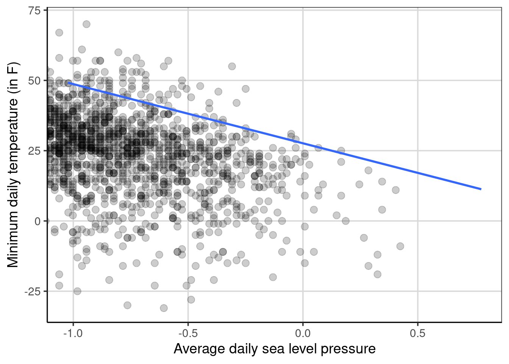

# Linear Regression 

## Simple Regression continuous predictor
### Description of the Data
These data contain information on mother's and baby's health for 1,174 pregnant women.


```r
library(tidyverse)
```

```
## ── Attaching packages ─────────────────────────────────────── tidyverse 1.3.0 ──
```

```
## ✔ ggplot2 3.3.3     ✔ purrr   0.3.4
## ✔ tibble  3.0.6     ✔ dplyr   1.0.4
## ✔ tidyr   1.1.2     ✔ stringr 1.4.0
## ✔ readr   1.4.0     ✔ forcats 0.5.1
```

```
## ── Conflicts ────────────────────────────────────────── tidyverse_conflicts() ──
## ✖ dplyr::filter() masks stats::filter()
## ✖ dplyr::lag()    masks stats::lag()
```

```r
library(ggformula)
```

```
## Loading required package: ggstance
```

```
## 
## Attaching package: 'ggstance'
```

```
## The following objects are masked from 'package:ggplot2':
## 
##     geom_errorbarh, GeomErrorbarh
```

```
## Loading required package: scales
```

```
## 
## Attaching package: 'scales'
```

```
## The following object is masked from 'package:purrr':
## 
##     discard
```

```
## The following object is masked from 'package:readr':
## 
##     col_factor
```

```
## Loading required package: ggridges
```

```
## 
## New to ggformula?  Try the tutorials: 
## 	learnr::run_tutorial("introduction", package = "ggformula")
## 	learnr::run_tutorial("refining", package = "ggformula")
```

```r
library(mosaic)
```

```
## Registered S3 method overwritten by 'mosaic':
##   method                           from   
##   fortify.SpatialPolygonsDataFrame ggplot2
```

```
## 
## The 'mosaic' package masks several functions from core packages in order to add 
## additional features.  The original behavior of these functions should not be affected by this.
```

```
## 
## Attaching package: 'mosaic'
```

```
## The following object is masked from 'package:Matrix':
## 
##     mean
```

```
## The following object is masked from 'package:scales':
## 
##     rescale
```

```
## The following objects are masked from 'package:dplyr':
## 
##     count, do, tally
```

```
## The following object is masked from 'package:purrr':
## 
##     cross
```

```
## The following object is masked from 'package:ggplot2':
## 
##     stat
```

```
## The following objects are masked from 'package:stats':
## 
##     binom.test, cor, cor.test, cov, fivenum, IQR, median, prop.test,
##     quantile, sd, t.test, var
```

```
## The following objects are masked from 'package:base':
## 
##     max, mean, min, prod, range, sample, sum
```

```r
library(rsample)
library(statthink)

# Set theme for plots
theme_set(theme_statthinking())

baby <- read_csv("https://raw.githubusercontent.com/lebebr01/statthink/master/data-raw/baby.csv")
```

```
## 
## ── Column specification ────────────────────────────────────────────────────────
## cols(
##   birth_weight = col_double(),
##   gestational_days = col_double(),
##   maternal_age = col_double(),
##   maternal_height = col_double(),
##   maternal_pregnancy_weight = col_double(),
##   maternal_smoker = col_logical()
## )
```

```r
head(baby)
```

```
## # A tibble: 6 x 6
##   birth_weight gestational_days maternal_age maternal_height maternal_pregna…
##          <dbl>            <dbl>        <dbl>           <dbl>            <dbl>
## 1          120              284           27              62              100
## 2          113              282           33              64              135
## 3          128              279           28              64              115
## 4          108              282           23              67              125
## 5          136              286           25              62               93
## 6          138              244           33              62              178
## # … with 1 more variable: maternal_smoker <lgl>
```

<!--
### Explore relationships between two quantitative attributes
So far, the course has focused on exploring relationships between a quantitative and various qualitative (i.e. categorical or grouping) attributes. It is also common to want to explore relationships between two quantitative attributes. One way to visualize this type of relationship is with a scatterplot and this can be done with the `gf_point()` function. Similar to other multivariate figures, this function takes a formula as the input where the attribute of interest (log of salary here) is placed on the left hand side of the equation and the second attribute is placed on the right hand side of the equation. Below, the equation `log(Salary) ~ HmRun` means that the log salary is the attribute of interest (placed on the y-axis) is going to be plotted in conjunction with the number of home runs the player hit (placed on the x-axis). Let's look at the figure.


Another measure of association between two attributes is the correlation. This statistic gives a single number summary about the **linear** relationship between two quantitative attributes. The correlation ranges between -1 and +1 where 0 means no relationship. The closer the correlation gets to -1 or +1 indicates a stronger linear relationship between the two attributes. A correlation of -1 means the two attributes are inversely related, more specifically this means that as one goes up the other will tend to decrease. The opposite is true for a correlation of +1 indicating a positive relationship, as one attribute increases the other tends to increase as well.


-->

### Scatterplots
As we've explored before, scatterplots help to explore the relationship between two continuous, quantitative data attributes. These are created with the `gf_point()` function and adding lines to the figure to provide some guidance to the relationship can be done with the `gf_smooth()` function. Below, a scatterplot is created that explores the relationship between birth weight and gestational days.


```r
gf_point(birth_weight ~ gestational_days, data = baby, size = 3, alpha = .2) %>%
  gf_smooth(method = 'lm', linetype = 2, size = 1) %>%
  gf_smooth(size = 1)
```

```
## `geom_smooth()` using method = 'gam'
```


The figure shows two types of lines, the dashed line is assuming a linear relationship (specified with `gf_smooth(method = 'lm')`) and the solid line is allowing the relationship to be more flexible to account for any non-linearity. There does appear to be some evidence of non-linearity, particularly in the tails of gestational days distribution. We can attempt to summarize this relationship in a single numeric value by computing the correlation coefficient. The correlation was initially explored when fitting regression trees. The correlation can be calculated with the `cor()` function with the primary argument being a formula depicting the two variables to compute the correlation on.


```r
cor(birth_weight ~ gestational_days, data = baby)
```

```
## [1] 0.4075428
```

Here the correlation represents the degree of **linear** relationship between the two variables. Values closer to 1 in absolute value (i.e. +1 or -1) show a stronger linear relationship and values closer to 0 indicate no relationship or weaker relationship. The correlation between the two variables above was about 0.41 indicating that there is a moderate positive linear relationship between birth weight and gestational days. The correlation is shown to be positive due to the coefficient being positive and the general trend from the scatterplot shows a direction of relationship moving from the lower left of the figure to the upper right of the figure. A negative correlation would have a negative sign associated with it and would trend from the upper left to the lower right of a scatterplot.


### Fitting a linear regression model
Now that the correlation was computed, we have evidence that there is a relationship between the baby birth weight and the gestational days. To provide some more evidence about the strength of this relationship and how much error is involved, fitting a linear regression model is often done. This can be done with the `lm()` function where the two arguments that need to be specified are a formula and the data to use for the model fitting. The formula takes the following form: `birth_weight ~ gestational_days`, where birth weight is the outcome of interest (in language we've used previously, this is the attribute we want to predict) and gestational days is the attribute we want to use to do the predicting of birth weight. Another way to think about what these variables represent is to explain variation in the birth weight with gestational days. In other words, the assumption is made that gestational days impacts or explains differences in the baby birth weight.


```r
baby_reg <- lm(birth_weight ~ gestational_days, data = baby)
coef(baby_reg)
```

```
##      (Intercept) gestational_days 
##      -10.7541389        0.4665569
```

he following coefficients represent the linear regression equation that more generally can be show as:

\begin{equation}
birth\_weight = -10.8 + 0.47 gestational\_days + \epsilon
\end{equation}

The equation can also be represented without the error, $\epsilon$ as:

begin{equation}
\hat{birth\_weight} = -10.8 + 0.47 gestational\_days
\end{equation}

where now the birth weight outcome has a hat (i.e. $\hat{y}$) that denotes mathematically that the equation predicts a value of birth weight given solely the number of gestational days. The first equation above says that the original observed birth weight is a function of gestational days plus some error. Using the equation above, the predicted birth weight can be obtained by including a value inserted for gestational days. Let's pick a few values for gestational days to try.


```r
-10.8 + 0.47 * 200
```

```
## [1] 83.2
```

```r
-10.8 + 0.47 * 275
```

```
## [1] 118.45
```

```r
-10.8 + 0.47 * 276
```

```
## [1] 118.92
```

You may notice that the predicted value of birth weight increases by 0.47 grams for every one day increase in gestational days, often referred to as the linear slope. The predicted values would fit on the dashed line shown in the scatterplot shown above. This highlights the assumption made here from the linear regression model above in which the relationship between birth weight and gestational days is assumed to be linear. It is possible to relax this assumption with a more complicated model, however this is the assumption being made currently.

### Explore the y-intercept
So far the discussion has focused on the linear slope, often a term that is of most interest. However, the y-intercept can also be made to be more interesting by adjusting the range of gestational days.

#### Mean center gestational days
First, mean centering the x attribute can often be a way to make the y-intercept more interpretable. The code below shows a scatterplot by subtracting the mean from all the values of gestational days.


```r
gf_point(birth_weight ~ I(gestational_days - mean(gestational_days)), data = baby, size = 3, alpha = .2) %>%
  gf_smooth(method = 'lm', linetype = 2, size = 1) %>%
  gf_smooth(size = 1)
```

```
## `geom_smooth()` using method = 'gam'
```



Notice that the relationship is the same as before, but now the scale of gestational days is different. It may be more difficult to interpret now as the number of days a women is pregnant is relatively well known, but now the mean gestational days is represented as 0 in the figure and all the values are in reference to that instead of referencing when a women became pregnant. Using this same approach, a linear regression can be fitted to this newly recentered gestational days variable.


```r
baby_reg_centered <- lm(birth_weight ~ I(gestational_days - mean(gestational_days)), data = baby)
coef(baby_reg_centered)
```

```
##                                  (Intercept) 
##                                  119.4625213 
## I(gestational_days - mean(gestational_days)) 
##                                    0.4665569
```

he new equation would look like:

begin{equation}
\hat{birth\_weight} = 119.5 + 0.47 (gestational\_days - mean(gestational\_days))
\end{equation}


```r
119.5 + 0.47 * -3
```

```
## [1] 118.09
```

```r
119.5 + 0.47 * 0
```

```
## [1] 119.5
```

#### Minimum or Maximum centered gestational days
A few other options that are common are to subtract the minimum or maximum values from the x attribute.


```r
baby_reg_min <- lm(birth_weight ~ I(gestational_days - min(gestational_days)), data = baby)
coef(baby_reg_min)
```

```
##                                 (Intercept) 
##                                  58.2962789 
## I(gestational_days - min(gestational_days)) 
##                                   0.4665569
```


```r
baby_reg_max <- lm(birth_weight ~ I(gestational_days - max(gestational_days)), data = baby)
coef(baby_reg_max)
```

```
##                                 (Intercept) 
##                                 153.9404386 
## I(gestational_days - max(gestational_days)) 
##                                   0.4665569
```


## Conditional Means

