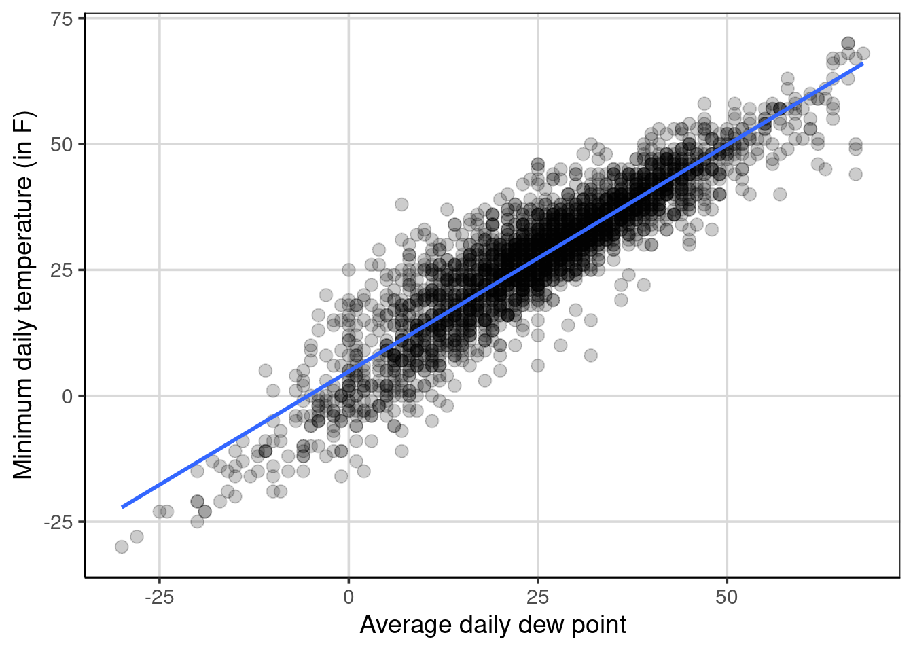

# Linear Regression 

Linear regression is another statistical model that can be used when the outcome is an integer or continuous, similar to that of the regression tree. There are similarities between linear regression and regression trees, however there are also very notable differences. 

Linear regression and regression trees are both used when the outcome is continuous or continuous. These methods are both able to make predictions for the outcome and identify which attributes are most important in aiding in making those predictions. There are differences though in the two methods that are important to distinguish. Linear regression makes an assumption on the relationship between the outcome and attributes entered into the model. Linear regression, as in the name, assumes that the relationship between the outcome and an attribute is linearly related.^[Although there is an assumption that the outcome and attribute are linearly related in linear regression, it is possible to specify the model to explore non-linear trends.] Regression trees however do not directly make this linear assumption between the outcome and an attribute. This assumption can make linear regression more parsimonious, meaning that the model can be simpler, which is often a goal of science, to explain the phenomenon of interest with the simplest possible explanation. 

## Simple Regression continuous predictor
### Description of the Data
These data contain information on mother's and baby's health for 1,174 pregnant women.


```r
library(tidyverse)
```

```
## ── Attaching packages ─────────────────────────────────────── tidyverse 1.3.0 ──
```

```
## ✔ ggplot2 3.3.3     ✔ purrr   0.3.4
## ✔ tibble  3.0.6     ✔ dplyr   1.0.4
## ✔ tidyr   1.1.2     ✔ stringr 1.4.0
## ✔ readr   1.4.0     ✔ forcats 0.5.1
```

```
## ── Conflicts ────────────────────────────────────────── tidyverse_conflicts() ──
## ✖ dplyr::filter() masks stats::filter()
## ✖ dplyr::lag()    masks stats::lag()
```

```r
library(ggformula)
```

```
## Loading required package: ggstance
```

```
## 
## Attaching package: 'ggstance'
```

```
## The following objects are masked from 'package:ggplot2':
## 
##     geom_errorbarh, GeomErrorbarh
```

```
## Loading required package: scales
```

```
## 
## Attaching package: 'scales'
```

```
## The following object is masked from 'package:purrr':
## 
##     discard
```

```
## The following object is masked from 'package:readr':
## 
##     col_factor
```

```
## Loading required package: ggridges
```

```
## 
## New to ggformula?  Try the tutorials: 
## 	learnr::run_tutorial("introduction", package = "ggformula")
## 	learnr::run_tutorial("refining", package = "ggformula")
```

```r
library(mosaic)
```

```
## Registered S3 method overwritten by 'mosaic':
##   method                           from   
##   fortify.SpatialPolygonsDataFrame ggplot2
```

```
## 
## The 'mosaic' package masks several functions from core packages in order to add 
## additional features.  The original behavior of these functions should not be affected by this.
```

```
## 
## Attaching package: 'mosaic'
```

```
## The following object is masked from 'package:Matrix':
## 
##     mean
```

```
## The following object is masked from 'package:scales':
## 
##     rescale
```

```
## The following objects are masked from 'package:dplyr':
## 
##     count, do, tally
```

```
## The following object is masked from 'package:purrr':
## 
##     cross
```

```
## The following object is masked from 'package:ggplot2':
## 
##     stat
```

```
## The following objects are masked from 'package:stats':
## 
##     binom.test, cor, cor.test, cov, fivenum, IQR, median, prop.test,
##     quantile, sd, t.test, var
```

```
## The following objects are masked from 'package:base':
## 
##     max, mean, min, prod, range, sample, sum
```

```r
library(rsample)
library(statthink)

# Set theme for plots
theme_set(theme_statthinking())

us_weather <- mutate(us_weather, snow_factor = factor(snow), 
                     snow_numeric = ifelse(snow == 'Yes', 1, 0))
```

### Scatterplots
As we've explored before, scatterplots help to explore the relationship between two continuous, quantitative data attributes. These are created with the `gf_point()` function and adding lines to the figure to provide some guidance to the relationship between the two attributes can be done with the `gf_smooth()` function. Below, a scatterplot is created that explores the relationship between the low temperature and the average daily dew point.^[Dew point is the temperature to which air must be cooled to become saturated with water vapor. [Wikipedia](https://en.wikipedia.org/wiki/Dew_point)]


```r
gf_point(drybulbtemp_min ~ dewpoint_avg, data = us_weather, size = 3, alpha = .2) %>%
  gf_smooth(method = 'lm', size = 1) %>%
  gf_labs(x = "Average daily dew point",
          y = "Minimum daily temperature (in F)")
```



Figure \@ref(fig:scatter-temp) shows the relationship between minimum temperature and average daily dew point assuming a linear relationship (specified with `gf_smooth(method = 'lm')`) between the two attributes. In this example, the relationship between the two attributes goes from the lower left to the upper right, indicating a positive relationship. That is, as the average daily dew point tends to increase, the minimum daily temperature also tends to increase. The relationship is not perfect, which is shown by the points not falling perfectly on the blue line, but the data are clustered relatively closely to this blue line. This would suggest that the relationship is stronger rather than being weaker and closer to +1 than 0. 

To estimate as a single quantity the relationship between the two attributes, the correlation can be calculated with the `cor()` function with the primary argument being a formula depicting the two variables to compute the correlation. The optional argument, `use = 'complete.obs'` is used as there are some missing data on these attributes and these data are removed prior to the calculation. 


```r
cor(drybulbtemp_min ~ dewpoint_avg, data = us_weather, 
    use = 'complete.obs')
```

```
## [1] 0.9102476
```

Here the correlation represents the degree of **linear** relationship between the two variables. Values closer to 1 in absolute value (i.e. +1 or -1) show a stronger linear relationship and values closer to 0 indicate no relationship or weaker relationship. The correlation between the two variables above was about 0.91 indicating that there is a strong positive linear relationship between the minimum temperature and the daily dew point. The correlation is shown to be positive due to the coefficient being positive and the general trend from the scatterplot shows a direction of relationship moving from the lower left of the figure to the upper right of the figure. A negative correlation would have a negative sign associated with it and would trend from the upper left to the lower right of a scatterplot.

### Fitting a linear regression model
Now that the correlation was computed, we have evidence that there is a relationship between the minimum temperature and the average daily dewpoint. To provide some more evidence about the strength of this relationship and how much error is involved, fitting a linear regression model is often done. This can be done with the `lm()` function where the two arguments that need to be specified are a formula and the data to use for the model fitting. The formula takes the following form: `drybulbtemp_min ~ dewpoint_avg`, where the minimum temperature is the outcome of interest (in language we've used previously, this is the attribute we want to predict) and the average daily dew point is the attribute we want to use to help to predict the minimum temperature. Another way to think about what these variables represent is to explain variation in the minimum temperature with the average daily dew point. In other words, the assumption is made that the average daily dew point impacts or explains differences in the minimum temperature.


```r
temp_reg <- lm(drybulbtemp_min ~ dewpoint_avg, 
               data = us_weather)
coef(temp_reg)
```

```
##  (Intercept) dewpoint_avg 
##    4.8343103    0.8999469
```

The following coefficients represent the linear regression equation that more generally can be show as:

\begin{equation}
drybulbtemp\_min = 4.83 + 0.90 dewpoint\_avg + \epsilon
\end{equation}

The equation can also be represented without the error, $\epsilon$ as:

begin{equation}
\hat{drybulbtemp\_min} = 4.83 + 0.90 dewpoint\_avg 
\end{equation}

where now the minimum temperature outcome has a hat (i.e. $\hat{y}$) that denotes mathematically that the equation predicts a value of minimum temperature given solely the average daily dew point. The first equation above says that the original observed minimum temperature is a function of the average daily dew point plus some error. Using the equation above, the predicted minimum temperature can be obtained by including a value inserted for the average daily dew point. Let's pick a few values for the average daily dew point to try.


```r
4.83 + 0.90 * -15
```

```
## [1] -8.67
```

```r
4.83 + 0.90 * 0
```

```
## [1] 4.83
```

```r
4.83 + 0.90 * 25
```

```
## [1] 27.33
```

```r
4.83 + 0.90 * 26
```

```
## [1] 28.23
```

You may notice that the predicted value of minimum temperature increases by 0.90 degrees Fahrenheit for every one degree increase in average daily dew point, often referred to as the linear slope. The predicted values would fit on the line shown in Figure \@ref(fig:scatter-temp). This highlights the assumption made from the linear regression model in which the relationship between the minimum temperature and the average daily dew point is assumed to be linear. It is possible to relax this assumption with a more complicated model, however that is not explore here.

### Explore the y-intercept
So far the discussion has focused on the linear slope, often a term that is of most interest. However, the y-intercept can also be made to be more interesting by adjusting the range of average daily dew point.

#### Mean center gestational days
First, mean centering the x attribute can often be a way to make the y-intercept more interpretable. The code below shows a scatterplot by subtracting the mean from all the values of gestational days.


```r
gf_point(birth_weight ~ I(gestational_days - mean(gestational_days)), data = baby, size = 3, alpha = .2) %>%
  gf_smooth(method = 'lm', linetype = 2, size = 1) %>%
  gf_smooth(size = 1)
```

Notice that the relationship is the same as before, but now the scale of gestational days is different. It may be more difficult to interpret now as the number of days a women is pregnant is relatively well known, but now the mean gestational days is represented as 0 in the figure and all the values are in reference to that instead of referencing when a women became pregnant. Using this same approach, a linear regression can be fitted to this newly recentered gestational days variable.


```r
baby_reg_centered <- lm(birth_weight ~ I(gestational_days - mean(gestational_days)), data = baby)
coef(baby_reg_centered)
```

he new equation would look like:

begin{equation}
\hat{birth\_weight} = 119.5 + 0.47 (gestational\_days - mean(gestational\_days))
\end{equation}


```r
119.5 + 0.47 * -3
```

```
## [1] 118.09
```

```r
119.5 + 0.47 * 0
```

```
## [1] 119.5
```

#### Minimum or Maximum centered gestational days
A few other options that are common are to subtract the minimum or maximum values from the x attribute.


```r
baby_reg_min <- lm(birth_weight ~ I(gestational_days - min(gestational_days)), data = baby)
coef(baby_reg_min)
```


```r
baby_reg_max <- lm(birth_weight ~ I(gestational_days - max(gestational_days)), data = baby)
coef(baby_reg_max)
```


## Conditional Means

