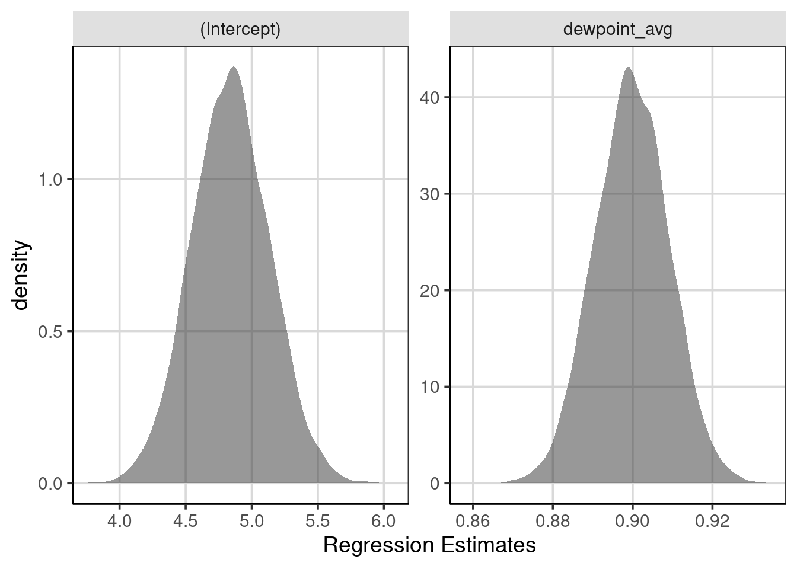

# Estimation, Bootstrap and Uncertainty

This section will explore how the estimates for the linear regression model are obtained. This section will also explore those estimates' characteristics and the assumptions for the linear regression model.

To come ...

## Bootstrap and Uncertainty

Bootstrap and resampling methods help to estimate the variability in the estimated effects. This is needed as it is most common to have a subset of the entire population rather than the entire population. Therefore, the model estimates are approximations of the actual population parameters. With another sample of data, the model estimates would be different from the previous sample. Different data would produce different statistics within the sample. It is often not feasible to collect multiple samples. As such, resampling or bootstrap methods help to approximate collecting multiple samples from the population of interest.

The goal of a good sample is to be able to get good estimates of the population parameters of interest. This happens when the sample obtained is representative of the population. Most notably, collecting the sample using a random process or ensuring that everyone in the population has the same random chance of being selected from the population. This is challenging, where practical issues often tarnish a good sampling plan. For instance, a portion of the population of interest may not be accessible, or a portion of the population may be less likely to participate. These issues could bias the sample to be dissimilar from the population. For this book, we will assume that a representative sample is obtained from the population, but this must always be explored and compared whenever collecting data.

This chapter will use the United States (US) weather data again. The following code chunk loads the packages used in this chapter, sets the figure theme, and creates a few new attributes for the US weather data.


```r
library(tidyverse)
library(ggformula)
library(mosaic)
library(broom)
library(statthink)

# Set theme for plots
theme_set(theme_statthinking(base_size = 14))

us_weather <- mutate(us_weather, snow_factor = factor(snow), 
                     snow_numeric = ifelse(snow == 'Yes', 1, 0))
```


## Estimating Error or uncertainty

To get some sense of the amount of error in the estimate of the linear slope, a bootstrap or resampling can be done to provide evidence for the likely range of slope values. Resampling or bootstrap methods is an empirical approach to estimating uncertainty. The bootstrap/resampling will take the following general steps:

1. Resample the observed data available, with replacement
2. Fit the linear regression model or, more generally, any statistic or statistical model.
3. Save the coefficient of interest.
4. Repeat steps 1 - 3 many times
5. Explore the coefficient distribution from the many resampled data sets.
The following sections discuss these steps in more detail.

### Resample with replacement

Resampling the data with replacement is the step in the bootstrap/resampling procedure that is needed to ensure that the estimates obtained are accurate and that different samples are obtained throughout the process. Before moving on, this idea is worth expanding on to understand the differences and what exactly sampling with replacement means. 

A simple example of fruit names will help show the resampling procedure. An object is created with the code below that has seven fruits. The data also contain a made-up popularity measure that shows how much individuals like each fruit. These elements each appear in the object precisely once. The data are shown below.


```r
fruit <- data.frame(
  names = c('apple', 'banana', 'kiwi', 'orange', 'plum', 'pear', 'kumquat'),
  popularity = c(10, 25, 5, 15, 5, 8, 2)
)
fruit
```

```
##     names popularity
## 1   apple         10
## 2  banana         25
## 3    kiwi          5
## 4  orange         15
## 5    plum          5
## 6    pear          8
## 7 kumquat          2
```

Imagine placing these seven fruits inside a hat, box, or some container for the resampling procedure, and the fruit cannot be seen. Then, to perform the resampling, someone would randomly reach inside and select a single fruit. In this case, this means ignoring the shape and size of the fruit as well to keep the process random. What happens next would be the difference between the two primary sampling procedures. 

For sampling with replacement, the selected fruit is placed back into the hat or box. Once the selected fruit is returned, the individual would again reach in to select another fruit at random. The fruit would then be returned to the hat or box, and the individual would randomly select another fruit. This process would be repeated until the same size as the original data. In this case, seven fruits are randomly selected, which matches the original data size. 

For sampling without replacement, the process is similar, except that when a fruit is selected from the box or hat, it is not put back. Therefore, the fruit could not be selected again. For example, if an individual selects the kiwi on the first selection with the seven original fruits in the hat, then this kiwi would not return to the hat and could not be selected again. 

The `sample_n()` function can be used to generate random samples. The default behavior of this function is to do sampling without replacement. The primary argument for the function is the data to sample from, and the second argument is the number of samples to perform. In this case, the number of samples will want to match the number of elements in the original data. The `replace = FALSE` specifies that the sampling should be done without replacement.


```r
set.seed(50)
sample_n(fruit, 7, replace = FALSE)
```

```
##     names popularity
## 1    kiwi          5
## 2  orange         15
## 3  banana         25
## 4    plum          5
## 5 kumquat          2
## 6   apple         10
## 7    pear          8
```

Notice that each data show up once, just like the original sample. However, the data are in a different order. This order is the order in the sampling algorithm selected for each element. Namely, the kiwi was selected first, then the orange, then the banana, and so on. 

Sampling with replacement is now shown below and is specified by saying, `replace = TRUE`. The process is done twice to show what happens if


```r
sample_n(fruit, 7, replace = TRUE)
```

```
##    names popularity
## 1 orange         15
## 2 banana         25
## 3   kiwi          5
## 4   plum          5
## 5   plum          5
## 6   kiwi          5
## 7 orange         15
```

```r
sample_n(fruit, 7, replace = TRUE)
```

```
##     names popularity
## 1  banana         25
## 2 kumquat          2
## 3    plum          5
## 4  banana         25
## 5 kumquat          2
## 6  orange         15
## 7   apple         10
```

First, notice that a different set of fruits is returned each time the sampling algorithm is run. Also, notice that for each time, more than 1 of some fruit and some of the fruit do not show up. For example, in the first resampling with replacement, the orange, kiwi, and plum each show up twice, the banana shows up once, and the remaining fruit does not. For the second resampling with replacement, the banana and kumquat show up twice, and the plum, orange, and apple each show up once, but the other two fruits do not. This is how sampling with replacement works and differs from sampling without replacement here. Namely, each element could appear more than once, and a different sample occurs for each iteration of the sampling algorithm. 

Sampling without replacement is commonly done for the selection of subjects from a population of interest. However, this procedure would not work well for the bootstrap/resampling procedure to estimate uncertainty because sampling with replacement would always produce the same sample. That is, each element of the original sample would be selected one time. Therefore, the sample would be the same every time, and the estimated statistic of interest would always be the same. This will be explored more in the next section.


### Calculate the statistic of interest

The mean of the original sample is 10. When resampling without replacement, the mean will be the same as the original sample. Notice that the mean computed below with the `df_stats()` function is the same as the original data. This happens because the same data is selected in the resampled data compared to the original. The primary difference is that the order would not be the same as the original sample (i.e., apple was first in the original data, but in the resampled data, it could be banana).


```r
set.seed(50)

sample_n(fruit, 7, replace = FALSE) %>%
  df_stats(~ popularity, mean)
```

```
##     response mean
## 1 popularity   10
```

However, when performing sampling with replacement, these means will differ as the elements within the sample will differ. Notice below that both means are slightly larger than 10, but more importantly, they differ from the original sample mean. Recall that the fruit may appear multiple times or not be selected when sampling with replacement. Therefore, the data will more than likely be different for every new sample that is obtained. As the data are different, the mean will also be different. 


```r
sample_n(fruit, 7, replace = TRUE) %>%
  df_stats(~ popularity, mean)
```

```
##     response     mean
## 1 popularity 10.71429
```

```r
sample_n(fruit, 7, replace = TRUE) %>%
  df_stats(~ popularity, mean)
```

```
##     response mean
## 1 popularity   12
```

These represent 2 of a total 8.23543\times 10^{5} possible resampled data. Even though there are almost a million possible resampled data samples, we can get many of these to estimate the variation in the statistics. Therefore, we estimate the variation in the statistics using a subset of the possible resampled data.

### Replicating the resampling/bootstrap

The process of resampling without replacement and computing the statistic of interest can be combined into a single operation by creating a function that does both steps at once. This function does those steps in the second and third lines of the function. This function is read as follows: first, take the data, then do the resampling of the same length (i.e., number of observations) with replacement, and finally compute the mean of the popularity attribute. 


```r
fruit_boot <- function(...) {
  fruit %>%
    sample_n(nrow(fruit), replace = TRUE) %>%
    df_stats(~ popularity, mean)
}
```

The resampling procedure can then be replicated a single time by calling this function directly. The function does not need an argument. Instead, the function directly calls the fruit data and the popularity attribute. Additional programming is needed to generalize this resampling/bootstrap function. To show that the function is working as intended, that is sampling with replacement, the function is run twice. 


```r
fruit_boot()
```

```
##     response     mean
## 1 popularity 14.71429
```

```r
fruit_boot()
```

```
##     response     mean
## 1 popularity 10.57143
```

Different mean values are generated, suggesting that the sampling with replacement is working correctly. Compiling the different mean values would be tedious by hand, but the computer can replicate the function many times with the `map_dfr()` function. This function takes the number of times to be replicated as `1:replications` where `replications` is replaced with the number of times to replicate the function.


```r
popularity_stats <- map_dfr(1:10000, fruit_boot)
```

Once these are generated, the mean fruit popularity distribution can be shown using a density curve. Figure \@ref(fig:density-fruit-pop) shows this distribution which has a minimum value of 3.29 to a maximum value of 'r round(max(popularity_stats$mean), 2)` with a mean of 9.97. This indicates a range of possible values that the mean fruit popularity falls and helps estimate the uncertainty in the statistic of interest. In general, ranges that are smaller indicate less uncertainty and a more accurate estimate for the statistic of interest. However, the overall range of a distribution can be misleading and, by itself, could be a better measure of variation. As can be seen in Figure \@ref(fig:density-fruit-pop), there is a slight positive skew in the distribution, therefore other statistics of variation are often better to truly represent the variation in the distribution. 


```r
gf_density(~ mean, data = popularity_stats) %>%
  gf_labs(x = "Mean Popularity")
```

<div class="figure">

<p class="caption">(\#fig:density-fruit-pop)Density curve of the mean fruit popularity based on 10,000 resampled data sets.</p>
</div>

These statistics could be the IQR, standard deviation, or differences between other deemed meaningful percentiles (i.e., the difference between the 10th and 90th percentiles). In these metrics, the amount of variation would be IQR = 3.71, SD = 2.72, and difference between 10th and 90th percentiles = 7. These would better represent the amount of uncertainty for this distribution and the range of plausible values for the distribution. For example, the SD shows that on average, most of the mean fruit popularity statistics would fall about 2.72 units away from the mean of 9.97.


### Linear regression bootstrap/resampling example

An example of using the bootstrap/resampling methods with the US weather data will be explored next. In Chapter 7, the minimum temperature was predicted or explained using the average daily dew point. As a reminder, here is the model again. Recall that the intercept here represents the average minimum temperature (in Fahrenheit) for an average daily dew point of 0 and that the slope term is the average increase in minimum temperature for every one-unit increase in the average daily dew point. 


```r
temp_lm <- lm(drybulbtemp_min ~ dewpoint_avg, data = us_weather)
coef(temp_lm)
```

```
##  (Intercept) dewpoint_avg 
##    4.8343103    0.8999469
```

The one element that was not explored in Chapter 7 is the amount of uncertainty, error, or variation in these estimates from the linear regression model. As shown in this chapter, the bootstrap or resampling methods can be an empirical way to try to capture the uncertainty. The steps to conduct the bootstrap or resample in this situation will follow. 

1. Resample, with replacement, from the original US weather data
2. Fit the linear regression model with minimum temperature and average dew point
3. Save the regression coefficients
4. Repeat steps 1 - 3 many times (i.e., 10,000)
5. Visualize the distribution of save regression coefficients across replications

The following function aims to do steps 1 through 3 above:
It resamples the data with replacement of the same size as the original data.
Using the resampled data, fit the linear regression model.
Save the model coefficients.
The code below shows the estimated coefficients from the resampled data. Notice how these differ from the regression model fitted above to the original data. Why do these differ here?


```r
set.seed(2021)

resample_weather <- function(...) {
  weather_resample <- us_weather %>%
    sample_n(nrow(us_weather), replace = TRUE)

  weather_resample %>%
    lm(drybulbtemp_min ~ dewpoint_avg, data = .) %>%
    coef(.) %>%
    broom::tidy()
}

resample_weather()
```

```
## # A tibble: 2 × 2
##   names            x
##   <chr>        <dbl>
## 1 (Intercept)  4.80 
## 2 dewpoint_avg 0.904
```

There is a function that does steps 1 - 3, and these processes can now be repeated many times with the `map_dfr()` function. In this example, the 10,000 resamples and the coefficients from each are saved. The intercept and linear slope distribution are visualized with density curves in Figure \@ref(fig:resample-10k-density). This figure shows that the regression slopes (right-most) are distributed closely together, with most of the slopes ranging from about 0.89 to 0.91. Some are smaller than 0.89 or larger than 0.91, but these occur less frequently than between those two values. A similar interpretation can be made for the intercept, where most intercepts fall between about 4.5 and 5.25 or so. 


```r
weather_coef <- map_dfr(1:10000, resample_weather)

gf_density(~ x, data = weather_coef) %>%
  gf_facet_wrap(~ names, scales = 'free') %>%
  gf_labs(x = "Regression Estimates")
```

<div class="figure">

<p class="caption">(\#fig:resample-10k-density)Distribution of regression coefficients from the bootstrapped samples.</p>
</div>

To get a more accurate sense of where notable percentiles are found, these can be computed directly using the `df_stats()` function. The `quantile()` function helps compute the percentiles of interest with the 5th, 50th (median), and 95th percentiles asked for in the code shown below. The difference between the 95th and 5th percentiles shows where most of the regression coefficients fall. Violin plots help to visualize the distributions with percentiles (see Figure \@ref(fig:resample-violin). 


```r
weather_coef %>%
  df_stats(x ~ names, quantile(c(0.05, 0.5, 0.95)))
```

```
##   response        names        5%       50%       95%
## 1        x  (Intercept) 4.3562898 4.8390742 5.3250096
## 2        x dewpoint_avg 0.8844869 0.8997507 0.9149627
```


```r
gf_violin(x ~ 1, data = weather_coef, fill = 'gray85', draw_quantiles = c(0.05, 0.5, 0.95)) %>%
  gf_facet_wrap(~ names, scales = 'free') %>%
  gf_refine(coord_flip())
```

<div class="figure">

<p class="caption">(\#fig:resample-violin)Violin plots showing the distribution of regression coefficients from the bootstrapped samples, with percentiles.</p>
</div>

### Determining if a statistic is "significant"

To come ...

