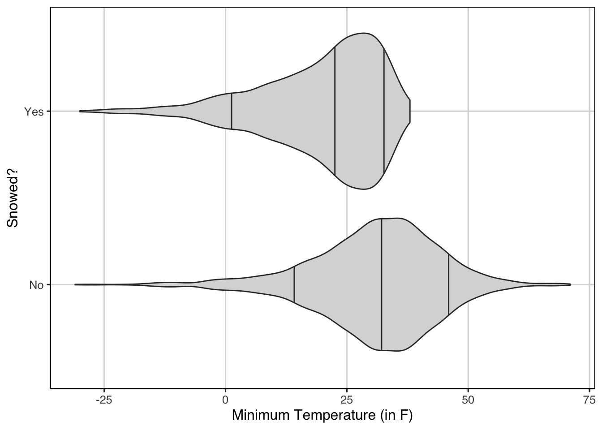
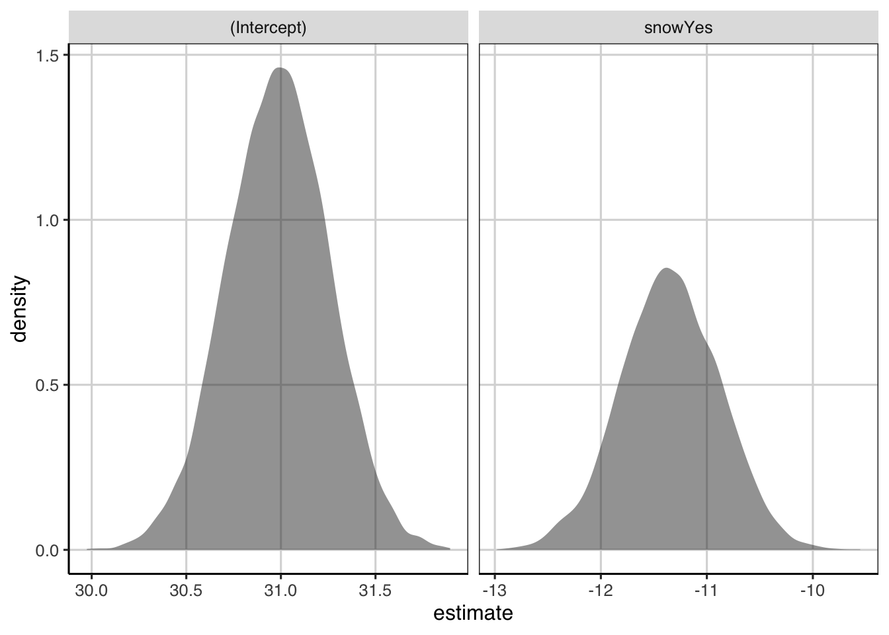
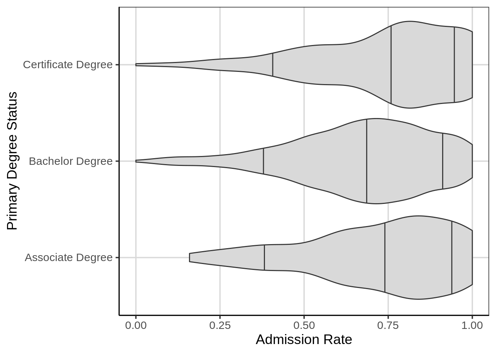

# Linear Regression with Categorical Predictors

In previous chapters, linear regression has only included a continuous attribute to help predict or explain variation in a continuous outcome. In previous models from chapter 7 and 8, linear regression models were considered that tried to explain variation in the minimum temperature with the sea level pressure and the average dew point. With both of these models, linear regression estimated how much the minimum temperature changed with a one unit increase for the predictor attribute (eg., either sea level pressure or the average dew point. What happens when a categorical predictor is used instead of a continuous predictor? For example, in the US weather data that has been used so far, one categorical attribute would be whether it snowed or rained on a particular day. In this case, these represents categories rather than continuous attributes that take on many different data points. 

This chapter will explore using linear regression with a categorical attribute to predict/explain variation in the outcome. To mimic other chapters, the outcome attribute will be kept the same, the minimum temperature. First, a single categorical attribute with two categories will be explored. Then, a linear regression model with two terms will be explored, including one that is continuous and another that is categorical. Finally, the idea of a statistical interaction will be introduced and explored within a linear regression model. 


```r
library(tidyverse)
library(ggformula)
library(mosaic)
library(rsample)
library(statthink)
library(broom)

# Set theme for plots
theme_set(theme_statthinking())

us_weather <- mutate(us_weather, snow_factor = factor(snow), 
                     snow_numeric = ifelse(snow == 'Yes', 1, 0))
```

## Categorical Predictor(s)

Precipitation can impact the temperature on a given day. For example, days that are sunny are often warmer than days that are cloudy or rainy. Similarly, days that snow often are colder for the precipitation to stay frozen as it falls from the clouds. Therefore, to show how categorical predictors can be entered into a linear regression model, differences in the minimum temperature will be explored based on whether it snows or not on a given day. Take a minute or so to hypothesize potential differences in the minimum temperature for days in which it snows.

Prior to fitting the linear regression model, it is first common to descriptively explore the distribution of the outcome by the different groups of the categorical attribute. This descriptive analysis can help to identify similarities or differences in center, variation, extreme cases, or other features across the two groups. For example, are there descriptive differences in the distribution of minimum temperature for days in which it snows vs does not snow? 

There are numerous types of figures that can help explore this, but one way to explore this is through a violin plot. Below is the code to generate a violin plot depicting the distribution of minimum temperature for days in which it does snow vs does not snow. 


```r
gf_violin(drybulbtemp_min ~ snow, data = us_weather, 
          draw_quantiles = c(0.1, 0.5, 0.9), 
           fill = 'gray85') %>%
  gf_refine(coord_flip()) %>%
  gf_labs(y = 'Minimum Temperature (in F)',
          x = 'Snowed?')
```

<div class="figure">

<p class="caption">(\#fig:violin-snow)Violin plots showing the distribution of minimum temperature by whether it has snowed on a day or not.</p>
</div>

Figure \@ref(fig:violin-snow) shows the two violin plots, the one on top is for days in which it does snow and the one on the bottom is for days in which it does not snow. What notable feature differences do you notice in this figure? 

One element that stands out is the center differences in the median of the two groups, depicted by the middle vertical line in each violin plot. For days that it does snow, the median minimum temperature is just under 25 degrees whereas this is around 30 degrees for days in which it does not snow. Another notable difference is the shape of the two distributions. For days in which it snows (top violin plot), the distribution is left/negative skewed, whereas the distribution for days in which it does snow is much more symmetric. This makes some sense theoretically as days in which it does snow likely would have lower temperatures to ensure the precipitation does stay frozen as it falls. 

Furthermore, there may be some slight evidence of differences in variation across the two distributions with the minimum temperatures being more condensed for days in which it does snow compared to days it does not snow. Finally, both seem to have some extreme values on the lower end of the distribution, around or below -25 degrees Fahrenheit. However, for days in which it does not snow, there are also some extreme values on the positive end where minimum temperatures are close to 70 degrees Fahrenheit. Although the range is not the best measure of variation, it can be helpful to descriptively explore differences in extreme values in the distributions. 

In addition to the visualization, computing descriptive statistics can also be helpful. These can provide a more accurate values for the center, variation, and can also highlight sample size in each group. The `df_stats()` function can be used to compute statistics of interest. Below, these statistics were computed into three different groups. First, the mean and median were computed to represent the center of the distribution, then the standard deviation and IQR related to variation were computed, and finally information on the minimum and maximum values as well as the sample size of each group with the `length()` function. 


```r
us_weather %>%
  df_stats(drybulbtemp_min ~ snow, mean, median, sd, quantile(c(0.25, 0.75)), min, max, length)
```

```
##          response snow     mean median       sd 25% 75% min max length
## 1 drybulbtemp_min   No 30.98119     32 13.16565  24  39 -31  71   2392
## 2 drybulbtemp_min  Yes 19.63095     23 12.32797  13  29 -30  38   1008
```

The descriptive statistics show much of the same picture as the visualization, but provide specific values to confirm the initial thoughts based on Figure \@ref(fig:violin-snow). In particular, the center for days in which it snows is lower for the mean and median by about 10 degrees Fahrenheit. Secondly, it was noted that there may be less variation for days in which it did snow, but the descriptive statistics (standard deviation and IQR) show that these values are similar across the two distributions. The upper end of the distribution for days in which it snows does appear to be more condensed from Figure \@ref(fig:violin-snow) however. Finally, the minimum and maximum values mimic the sentiments from the violin plot and it should be noted that there are about half the number of days in which it snows compared to days in which it does not snow. 

### Linear Regression - Categorical Predictor

Performing a linear regression with a categorical attribute works programmatically just like a linear regression with a continuous attribute. More specifically, the same function is used, `lm()`, and the specification of the attributes in the model formula are the same. The code below fits the linear regression with the snow attribute as the sole categorical attribute that helps to explain variation in the minimum temperature. The coefficients associated with the linear regression are extracted and printed with the `coef()` function. 


```r
temp_snow_reg <- lm(drybulbtemp_min ~ snow, data = us_weather)
coef(temp_snow_reg)
```

```
## (Intercept)     snowYes 
##    30.98119   -11.35023
```

The output shows two parameters being estimated just like before. One is the y-intercept and is interpreted the same as with a continuous attribute. This term would represent the average minimum temperature when all of the attributes in the model are 0. What is not clear is what value is 0 from the model above. This will become more clear once the interpretation for the slope term is expanded upon next. 

Before expanding on this, the linear slope term is interpreted the same as well. For example, the slope term shown above is still interpreted as the change in the outcome for a one unit increase in the predictor attribute. For the weather data example, this would mean that the linear slope coefficient of -11.35 indicates that the average minimum temperature decreases by about -11.35 degrees Fahrenheit for a one unit increase in the snow attribute. Similar to the intercept, it is not intuitive or clear as to what a one unit increase would represent here as the snow attribute represents categories rather than a continuous attribute. 

#### Interpreting the Linear Slope for a Categorical Attribute
To explore what these coefficients mean in a bit more detail, let's look at the data a bit more and how the linear regression uses the categorical attribute. In the model internals, the categorical attribute is converted from the category names (ie., Yes vs No) to a numeric representation of those categories. By default, the numbers used to represent the categories used are 0 and 1. Table \@ref(tab:cat-to-tab) shows this default numeric representation that R would use. R uses the category that is closer to the letter "A" for the number 0. The category that uses the value of 0 is referred to as the reference category in statistics. 


```r
knitr::kable(
  data.frame(snow = c('No', 'Yes'),
             snow_numeric = c(0, 1)),
  caption = "Conversion of categories to numeric representation."
)
```


Table: (\#tab:cat-to-tab)Conversion of categories to numeric representation.

|snow | snow_numeric|
|:----|------------:|
|No   |            0|
|Yes  |            1|

Within the data, there is an attribute called `snow_numeric` that follows the logic shown in Table \@ref(tab:cat-to-tab). The `count()` function below shows these two attributes again and also show the number of observations or sample size for each group. As can be seen, the number of days in which it does not snow is over double those days in which it does snow. 


```r
count(us_weather, snow, snow_numeric)
```

```
## # A tibble: 2 x 3
##   snow  snow_numeric     n
##   <chr>        <dbl> <int>
## 1 No               0  2392
## 2 Yes              1  1008
```

To understand the interpretation of the linear regression coefficient for the snow attribute shown above (ie., the estimated slope), a new linear regression model is fitted that uses the numeric representation directly rather than the categorical representation. Reference back to Table \@ref(tab:cat-to-tab) to show what the numeric representation of the categorical element is. For days in which it snows, the numeric attribute would have a value of 1, whereas for days in which it does not snow, the numeric attribute would have a value of 0. 


```r
snow_reg_new <- lm(drybulbtemp_min ~ snow_numeric, data = us_weather)
coef(snow_reg_new)
```

```
##  (Intercept) snow_numeric 
##     30.98119    -11.35023
```

Notice that the coefficients for the linear regression are the same no matter which attribute is entered into the model. When a categorical attribute is entered into the regression in R, the attribute is automatically converted into something called an indicator or dummy variable. This means that one of the two values are represented with a 1, the other with a 0. The value that is represented with a 0 is the one that is closer to the letter "A", meaning that the 0 is the first category in alphabetical order.

As mentioned earlier, the linear slope in this model indicates the change in the outcome for a one unit increase in the predictor attribute. In this example, this means that for a one unit change in the snow attribute (or snow numeric attribute) the average minimum temperature decreased by -11.35 degrees Fahrenheit. More specifically though, since there is only a single unit change for the snow numeric attribute, the one unit change can also be interpreted as a change in the categories. Therefore, the one unit change is the average change in the temperature moving from a 0 to a 1 or from a day in which it did not snow to a day in which it did snow. 

The descriptive statistics and the coefficients from the regression are shown together below. Compare the difference in the mean statistics from the descriptive statistics below. How does this related to the slope from the linear regression with a categorical attribute. 


```r
us_weather %>%
  df_stats(drybulbtemp_min ~ snow, mean, median, sd, quantile(c(0.25, 0.75)), min, max, length)
```

```
##          response snow     mean median       sd 25% 75% min max length
## 1 drybulbtemp_min   No 30.98119     32 13.16565  24  39 -31  71   2392
## 2 drybulbtemp_min  Yes 19.63095     23 12.32797  13  29 -30  38   1008
```

```r
coef(temp_snow_reg)
```

```
## (Intercept)     snowYes 
##    30.98119   -11.35023
```

More specifically, the linear slope here can be computed from the descriptive statistics as the mean minimum temperature for days in which it does snow minus the mean minimum temperature for days in which is does not snow. Mathematically, this can be represented with the following relationship and computation. In the equation below, $\bar{Y}_{Yes}$ represents the mean minimum temperature for days in which it does snow and $\bar{Y}_{No}$ represents the mean minimum temperature for days in which it does not snow.

$$
slope = \bar{Y}_{Yes} - \bar{Y}_{No} \\
slope = 19.63 - 30.98 = -11.35
$$

Finally, circling back to the interpretation of the y-intercept. This term is interpreted as the average value of the outcome when all the terms in the linear regression are equal to zero. In this case, there is a single categorical attribute included in the model, whether it snows or not. From Table \@ref(tab:cat-to-tab), the numeric representation of the categories shows that days in which it does not snow is represented with a value of 0, this category would also be referred to as the reference group. Therefore, the y-intercept (or more generally the intercept), would equal the mean minimum temperature for days in which it does not snow. Notice how the intercept coefficient from the linear regression and the mean minimum temperature for days in which it does not snow are the same value. 

Of final note, although this was fitted with a linear regression, this procedure is equivalent to a two sample independent t-test. We find the unified framework of conducting tests like this using the linear regression model provides an introduction that is easier to extend as the comfort level with statistics increases. Furthermore, the inferential procedures with the resampling/bootstrap techniques discussed next and in the previous chapter will remain the same no matter how complicated the linear regression model becomes. 

### Inference
Similar to the continuous predictor, resampling/bootstrap takes a similar method in the case with a single categorical predictor.

In order to get some sense of the amount of error in the estimate of the linear slope here, a bootstrap can be done to provide some evidence of the likely range of slope values. The bootstrap will take the following general steps:

1. Resample the observed data available, with replacement
2. Fit the same linear regression model as above.
3. Save the slope coefficient representing the relationship between birth weight and gestational days
4. Repeat steps 1 - 3 many times
5. Explore the distribution of slope estimates from the many resampled data sets.


```r
resample_snow <- function(...) {
  snow_resample <- us_weather %>%
    sample_n(nrow(us_weather), replace = TRUE)

  snow_resample %>%
    lm(drybulbtemp_min ~ snow, data = .) %>%
    tidy()
}

resample_snow()
```

```
## # A tibble: 2 x 5
##   term        estimate std.error statistic   p.value
##   <chr>          <dbl>     <dbl>     <dbl>     <dbl>
## 1 (Intercept)     31.3     0.266     118.  0.       
## 2 snowYes        -12.1     0.488     -24.7 4.47e-124
```

Now that there is a function that does steps 1 - 3, these processes can now be repeated many times.


```r
snow_coef <- map_dfr(1:10000, resample_snow)

gf_density(~ estimate, data = snow_coef) %>%
  gf_facet_wrap(~ term, scales = 'free_x')
```

<div class="figure">

<p class="caption">(\#fig:snow-many-resamp)Density figures of the resampled/bootstrapped linear regression estimates.</p>
</div>


```r
snow_coef %>%
  df_stats(estimate ~ term, quantile(c(0.05, 0.5, 0.95)))
```

```
##   response        term        5%       50%       95%
## 1 estimate (Intercept)  30.53826  30.97889  31.41713
## 2 estimate     snowYes -12.12042 -11.34741 -10.58684
```

## More than 2 categorical groups
Before the model contained one attribute that represented two groups. What happens when there are more than two groups for an attribute? To explore this, the college scorecard data will be used again.


```r
library(tidyverse)
library(ggformula)
library(mosaic)

college_score <- read_csv("https://raw.githubusercontent.com/lebebr01/statthink/master/data-raw/College-scorecard-clean.csv", guess_max = 10000)
```

```
## 
## ── Column specification ────────────────────────────────────────────────────────
## cols(
##   instnm = col_character(),
##   city = col_character(),
##   stabbr = col_character(),
##   preddeg = col_character(),
##   region = col_character(),
##   locale = col_character(),
##   adm_rate = col_double(),
##   actcmmid = col_double(),
##   ugds = col_double(),
##   costt4_a = col_double(),
##   costt4_p = col_double(),
##   tuitionfee_in = col_double(),
##   tuitionfee_out = col_double(),
##   debt_mdn = col_double(),
##   grad_debt_mdn = col_double(),
##   female = col_double(),
##   bachelor_degree = col_double()
## )
```

```r
head(college_score)
```

```
## # A tibble: 6 x 17
##   instnm    city   stabbr preddeg region locale adm_rate actcmmid  ugds costt4_a
##   <chr>     <chr>  <chr>  <chr>   <chr>  <chr>     <dbl>    <dbl> <dbl>    <dbl>
## 1 Alabama … Normal AL     Bachel… South… City:…    0.903       18  4824    22886
## 2 Universi… Birmi… AL     Bachel… South… City:…    0.918       25 12866    24129
## 3 Universi… Hunts… AL     Bachel… South… City:…    0.812       28  6917    22108
## 4 Alabama … Montg… AL     Bachel… South… City:…    0.979       18  4189    19413
## 5 The Univ… Tusca… AL     Bachel… South… City:…    0.533       28 32387    28836
## 6 Auburn U… Montg… AL     Bachel… South… City:…    0.825       22  4211    19892
## # … with 7 more variables: costt4_p <dbl>, tuitionfee_in <dbl>,
## #   tuitionfee_out <dbl>, debt_mdn <dbl>, grad_debt_mdn <dbl>, female <dbl>,
## #   bachelor_degree <dbl>
```

### Explore distribution 3 groups
Early in the course, the distribution of admission rates by the primary degree that the institution grants was explored. Below is a violin plot that shows these three distributions.


```r
gf_violin(adm_rate ~ preddeg, data = college_score, fill = 'gray85', 
          size = 1, draw_quantiles = c(0.1, 0.5, 0.9))
```



There may be some small differences between these groups, but more formally we can test this to understand the amount of uncertainty in the average of the distributions. This again will make use of the `lm()` function in R and the formula is very similar to what was done before and mimics the formula from the violin plot above.


```r
adm_model <- lm(adm_rate ~ preddeg, data = college_score)
coef(adm_model)
```

```
##               (Intercept)    preddegBachelor Degree preddegCertificate Degree 
##                0.72296993               -0.05170254                0.02193828
```

Guesses as to what these coefficients represent? How were the categorical groups turned into the different elements in the model?

### Overall model fit
There is a measure of overall model fit that is commonly used in the research literature for linear regression models, called R-squared. R-squared represents the proportion of variation in the outcome that is explained by the attributes in the model. The statistic ranges from 0 to 1 where values closer to 1 indicate larger percentages of variation explained. This can be extracted from the model directly.


```r
summary(adm_model)$r.squared
```

```
## [1] 0.01404376
```

Another one can be computed from the baby data where the birth weight was the outcome and gestational days was the primary attribute used as a predictor.


```r
baby_reg <- lm(birth_weight ~ gestational_days, data = baby)
summary(baby_reg)$r.squared
```

For models with a single predictor variable, R-squared is the correlation coefficient squared. For example:


```r
cor(birth_weight ~ gestational_days, data = baby) ^ 2
```


## Multiple Regression
What happens if we would like to combine the two predictors? Shown above is that the number of gestational days has a moderate relationship to the baby weight, therefore exploring the effects of smoking, it would be nice to remove the effect of gestational days from the baby weight. More specifically, this essentially allows us to make comparisons on the effect of smoking for the **same** gestational days. One way to think about this is through conditional means. Exploration of these visually first can be particularly helpful.


```r
gf_point(birth_weight ~ gestational_days, data = baby, size = 3) %>%
  gf_smooth() %>%
  gf_facet_wrap(~ maternal_smoker)
```


```r
baby_reg_smoker <- lm(birth_weight ~ I(gestational_days - mean(gestational_days)) + maternal_smoker, data = baby)
coef(baby_reg_smoker)
```

We can write out the regression equation similar to before:

\begin{equation}
birth\_weight = 122.67 + 0.49 (gestational\_days - mean(gestational\_days) - 8.17 maternal\_smoker + \epsilon
\end{equation}

Let's explore how these are interpreted.
### Distribution of Effects
Similar to before, the distribution of effects can be obtained with the following steps:

1. Resample the observed data available, with replacement
2. Estimate linear model coefficients.
3. Save terms of interest
4. Repeat steps 1 - 3 many times
5. Explore the distribution of median differences from the many resampled data sets.


```r
resample_baby <- function(...) {
  baby_resample <- baby %>%
    sample_n(nrow(baby), replace = TRUE)

  baby_resample %>%
    lm(birth_weight ~ I(gestational_days - mean(gestational_days)) + maternal_smoker, data = .) %>%
    tidy(.) %>%
    select(term, estimate)
}
resample_baby()
```


```r
coef_baby <- map(1:10000, resample_baby) %>%
  bind_rows()

coef_baby %>%
  gf_density(~ estimate) %>% 
  gf_facet_wrap(~ term, scales = 'free')
```

### Interactions
One additional idea that can be quite powerful is the idea of interactions. This was indirectly shown earlier in the course with classification and regression trees, where the models after each split re-evaluated which attributes were most helpful. In this way, the same attribute could be used in different places with different scores identifying the split. A similar idea can be explored in the regression framework, where the idea is that there are differential effects for different groups. This can be shown visually:


```r
gf_point(birth_weight ~ gestational_days, data = baby, size = 3) %>%
  gf_smooth() %>%
  gf_facet_wrap(~ maternal_smoker)
```


```r
baby_reg_int <- lm(birth_weight ~ I(gestational_days - mean(gestational_days)) * maternal_smoker, data = baby)
coef(baby_reg_int)
```


```r
resample_baby <- function(...) {
  baby_resample <- baby %>%
    sample_n(nrow(baby), replace = TRUE)

  baby_resample %>%
    lm(birth_weight ~ I(gestational_days - mean(gestational_days)) * maternal_smoker, data = .) %>%
    tidy(.) %>%
    select(term, estimate)
}
resample_baby()
```


```r
coef_baby <- map(1:10000, resample_baby) %>%
  bind_rows()

coef_baby %>%
  gf_density(~ estimate) %>% 
  gf_facet_wrap(~ term, scales = 'free')
```

### Evaluating model fit
As discussed earlier, R-square is a measure of overall model fit. These can be compared across the different models to see which one may be doing the best and explaining the most variation in the baby's birth weight.


```r
summary(baby_reg)$r.square
summary(smoker_reg)$r.square
summary(baby_reg_smoker)$r.square
summary(baby_reg_int)$r.square
```
