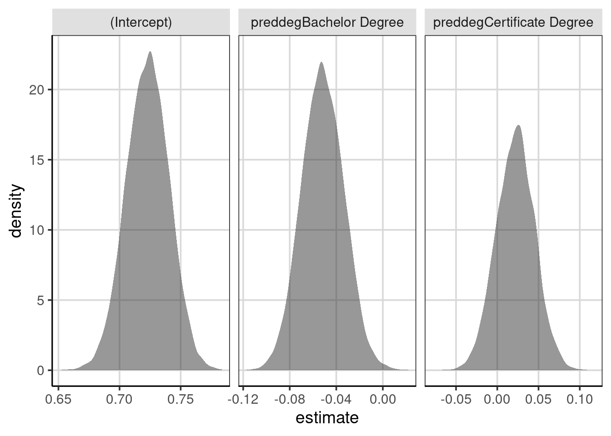

# Prediction for individuals    


## Comparison of classification / linear model  


## Compared linear model with median
### Skewed Data - Inference
In one example, a skewed distribution was transformed prior to conducting the analysis with a regression tree. Another approach could be to use a more robust statistic such as the median. One limitation of the median, is that a linear regression model as we have covered so far, does not allow you to fit the model while using the median.


```r
library(tidyverse)
library(ggformula)
library(mosaic)
library(broom)
library(statthink)

# Set theme for plots
theme_set(theme_statthinking())

college_score <- read_csv("https://raw.githubusercontent.com/lebebr01/statthink/master/data-raw/College-scorecard-clean.csv", guess_max = 10000)
head(college_score)
```

```
## # A tibble: 6 x 17
##   instnm    city   stabbr preddeg region locale adm_rate actcmmid  ugds costt4_a
##   <chr>     <chr>  <chr>  <chr>   <chr>  <chr>     <dbl>    <dbl> <dbl>    <dbl>
## 1 Alabama … Normal AL     Bachel… South… City:…    0.903       18  4824    22886
## 2 Universi… Birmi… AL     Bachel… South… City:…    0.918       25 12866    24129
## 3 Universi… Hunts… AL     Bachel… South… City:…    0.812       28  6917    22108
## 4 Alabama … Montg… AL     Bachel… South… City:…    0.979       18  4189    19413
## 5 The Univ… Tusca… AL     Bachel… South… City:…    0.533       28 32387    28836
## 6 Auburn U… Montg… AL     Bachel… South… City:…    0.825       22  4211    19892
## # … with 7 more variables: costt4_p <dbl>, tuitionfee_in <dbl>,
## #   tuitionfee_out <dbl>, debt_mdn <dbl>, grad_debt_mdn <dbl>, female <dbl>,
## #   bachelor_degree <dbl>
```


```r
adm_model <- lm(adm_rate ~ preddeg, data = college_score)
coef(adm_model)
```

```
##               (Intercept)    preddegBachelor Degree preddegCertificate Degree 
##                0.72296993               -0.05170254                0.02193828
```

Prior to doing the median, we can bootstrap the mean difference from the model above.


```r
resample_admrate <- function(...) {
  college_resample <- college_score %>%
    sample_n(nrow(college_score), replace = TRUE)

  college_resample %>%
    lm(adm_rate ~ preddeg, data = .) %>%
    tidy(.) %>%
    select(term, estimate)
}

resample_admrate()
```

```
## # A tibble: 3 x 2
##   term                      estimate
##   <chr>                        <dbl>
## 1 (Intercept)                 0.722 
## 2 preddegBachelor Degree     -0.0510
## 3 preddegCertificate Degree   0.0141
```


```r
admrate_coef <- map(1:10000, resample_admrate) %>%
  bind_rows()

admrate_coef %>%
  gf_density(~ estimate) %>% 
  gf_facet_wrap(~ term, scales = 'free_x')
```



### Bootstrap Median
he bootstrap for the median will take much of a similar process as before, the major difference being that a model will not be fitted. Instead, we will compute statistics for the median of each group, take differences of the median to represent the median difference between the groups and then replicate.

1. Resample the observed data available, with replacement
2. Estimate median for each group.
3. Calculate median difference between the groups
4. Repeat steps 1 - 3 many times
5. Explore the distribution of median differences from the many resampled data sets.


```r
resample_admrate_median <- function(...) {
  college_resample <- college_score %>%
    sample_n(nrow(college_score), replace = TRUE)

  med_est <- college_resample %>%
    df_stats(adm_rate ~ preddeg, median) %>%
    pivot_wider(names_from = preddeg, values_from = median_adm_rate)

  names(med_est) <- c("Associate", "Bachelor", "Certificate")
  
  med_est %>% 
    mutate(bachelor_associate = Bachelor - Associate,
           certificate_associate = Certificate - Associate,
           bachelor_certificate = Bachelor - Certificate) %>%
    pivot_longer(Associate:bachelor_certificate, 
                 names_to = "Term", 
                 values_to = "Median_Difference")
}

resample_admrate_median()
```


```r
admrate_median <- map(1:10000, resample_admrate_median) %>%
  bind_rows()

admrate_median %>%
    filter(Term %in% c('bachelor_associate', 'certificate_associate', 'bachelor_certificate')) %>%
    gf_density(~ Median_Difference) %>% 
    gf_facet_wrap(~ Term, scales = 'free_x')
```


