# Visualization   


```r
library(ggformula)
library(mosaic)
library(RColorBrewer)

head(CPS85)
```

```
##   wage educ race sex hispanic south married exper union age   sector
## 1  9.0   10    W   M       NH    NS Married    27   Not  43    const
## 2  5.5   12    W   M       NH    NS Married    20   Not  38    sales
## 3  3.8   12    W   F       NH    NS  Single     4   Not  22    sales
## 4 10.5   12    W   F       NH    NS Married    29   Not  47 clerical
## 5 15.0   12    W   M       NH    NS Married    40 Union  58    const
## 6  9.0   16    W   F       NH    NS Married    27   Not  49 clerical
```


## Explore Distributions 


### Histograms    


```r
gf_histogram(~ wage, data = CPS85)
```

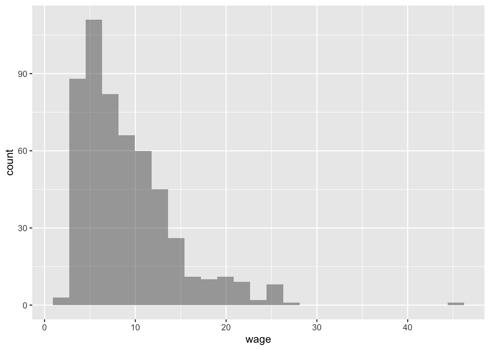

#### Adjust Number of Bins

```r
gf_histogram(~ wage, data = CPS85, bins = 15)
```

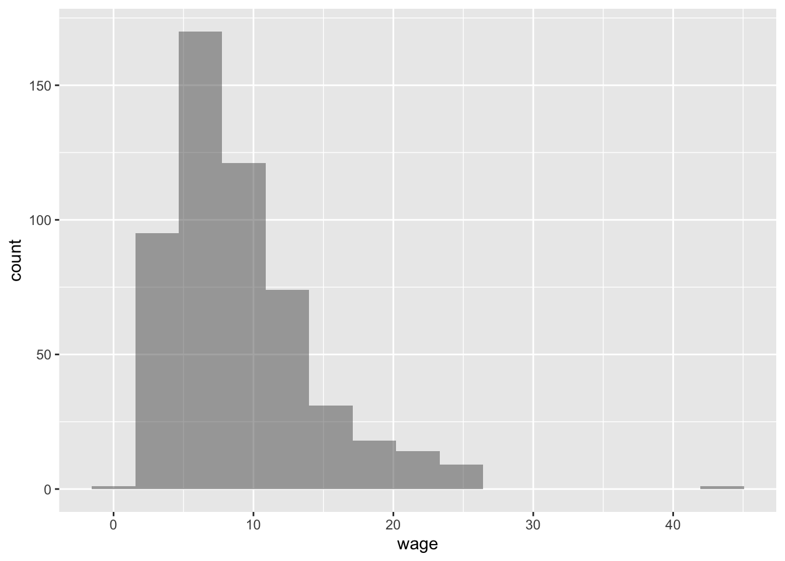


#### Adjust Binwidth


```r
gf_histogram(~ wage, data = CPS85, binwidth = 1)
```


#### See Bin location

```r
gf_histogram(~ wage, data = CPS85, binwidth = 1, color = 'black')
```


#### Plot Customization

```r
gf_histogram(~ wage, data = CPS85, binwidth = 1) %>%
  gf_theme(theme_bw())
```


```r
gf_histogram(~ wage, data = CPS85, binwidth = 1) %>%
  gf_theme(theme_bw()) %>%
  gf_labs(x = "Wage ($ per hour)", 
          y = "Number")
```

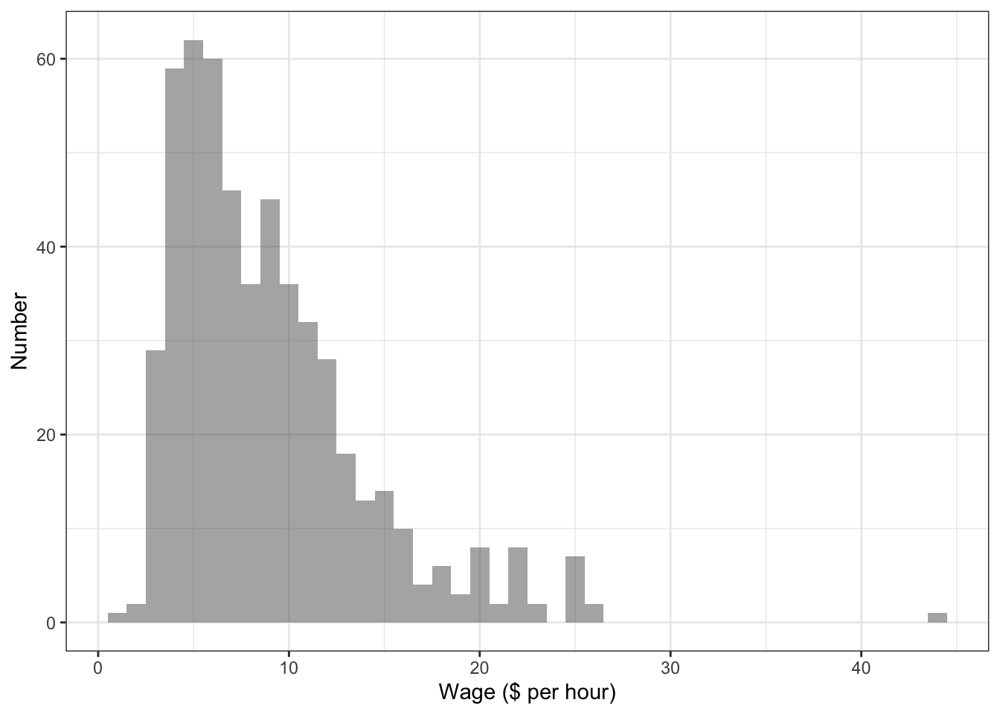


### Density Plots    


```r
gf_density(~ wage, data = CPS85) %>%
  gf_theme(theme_bw()) %>%
  gf_labs(x = "Wage ($ per hour)", 
          y = "Density")
```

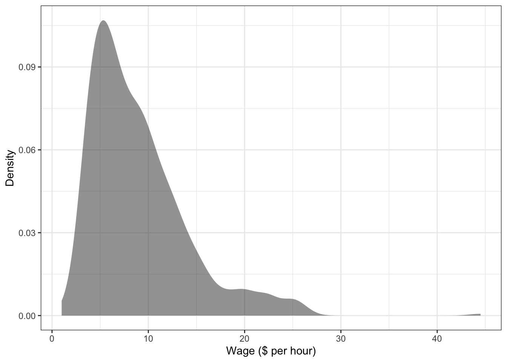


## Conditional (Multivariate) Distributions 

### Distribution Plots by Groups   

```r
gf_histogram(~ wage, data = CPS85, binwidth = 1, fill = ~ sex) %>%
  gf_theme(theme_bw()) %>%
  gf_labs(x = "Wage ($ per hour)", 
          y = "Number")
```

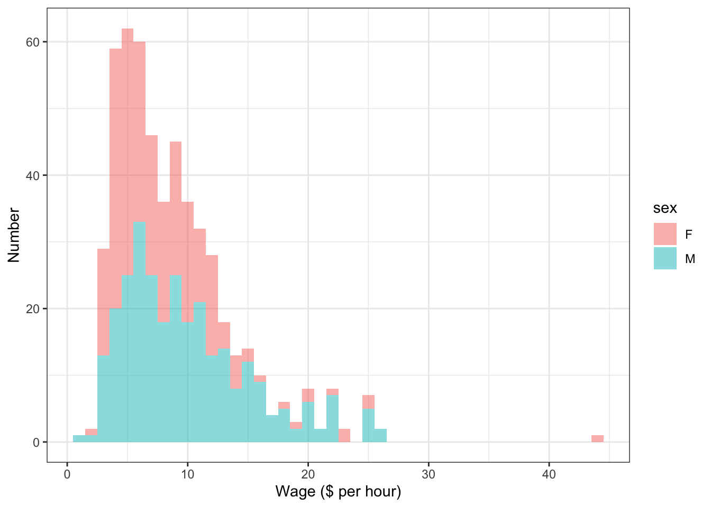


```r
gf_density(~ wage, data = CPS85, fill = ~ sex) %>%
  gf_theme(theme_bw()) %>%
  gf_labs(x = "Wage ($ per hour)", 
          y = "Density")
```

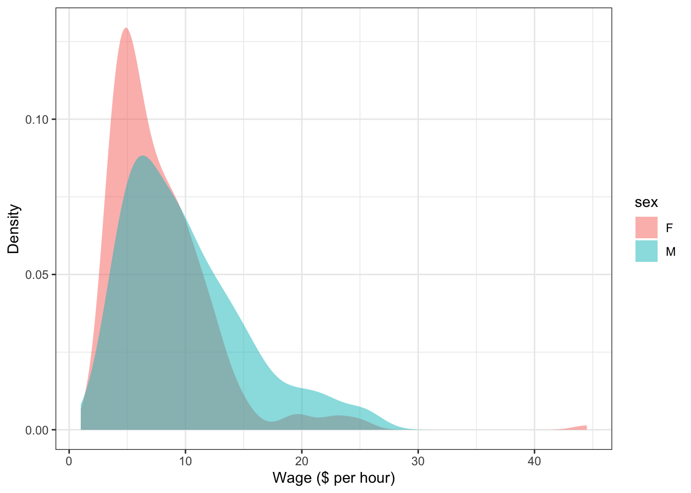


### Violin Plots   

```r
gf_violin(wage ~ sex, data = CPS85) %>%
  gf_theme(theme_bw()) %>%
  gf_labs(x = "Sex", 
          y = "Wage ($ per hour)")
```

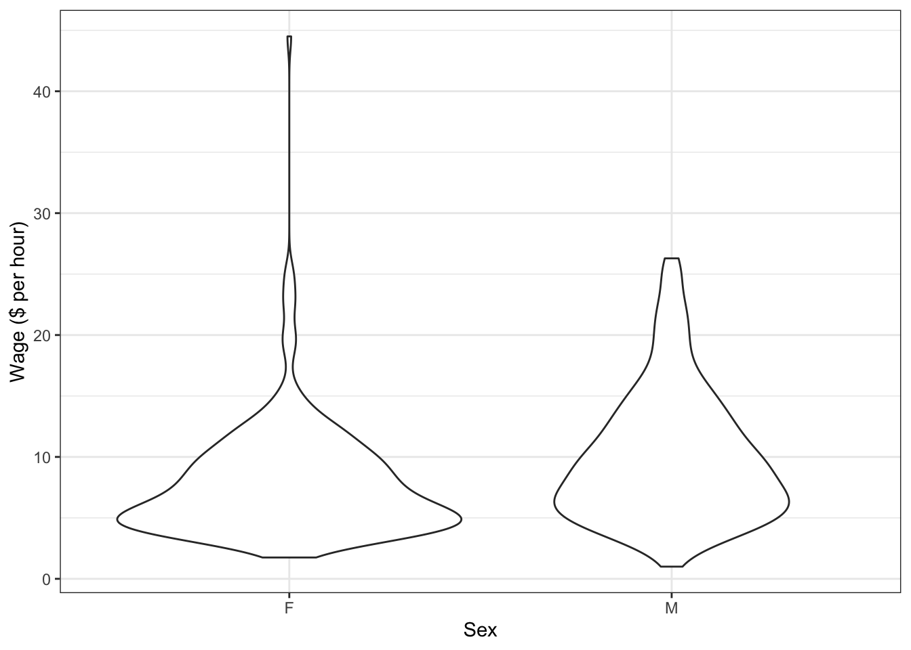


```r
gf_violin(wage ~ sex, data = CPS85, fill = 'gray85') %>%
  gf_theme(theme_bw()) %>%
  gf_labs(x = "Sex", 
          y = "Wage ($ per hour)")
```

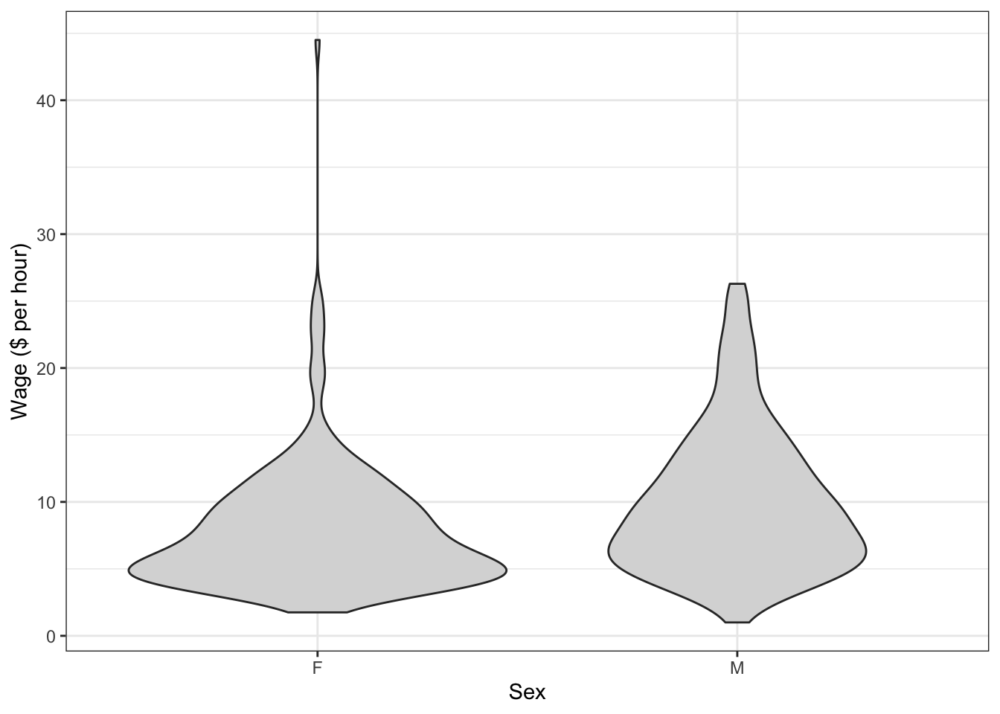


### Ridge Plots?


## Scatterplots    


### 2d Scatterplots    

```r
gf_point(wage ~ age, data = CPS85) %>%
  gf_theme(theme_bw()) %>%
  gf_labs(x = "Age (in years)", 
          y = "Wage ($ per hour)")
```

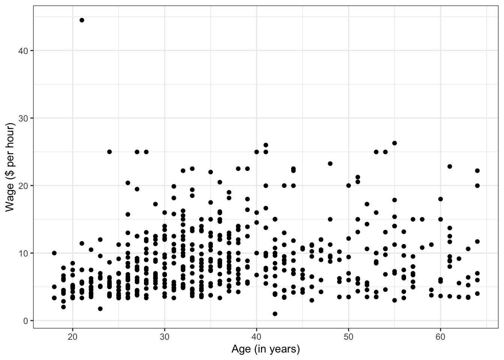

### Add Color and Shapes    


```r
gf_point(wage ~ age, data = CPS85, color = ~ sex) %>%
  gf_theme(theme_bw()) %>%
  gf_labs(x = "Age (in years)", 
          y = "Wage ($ per hour)")
```

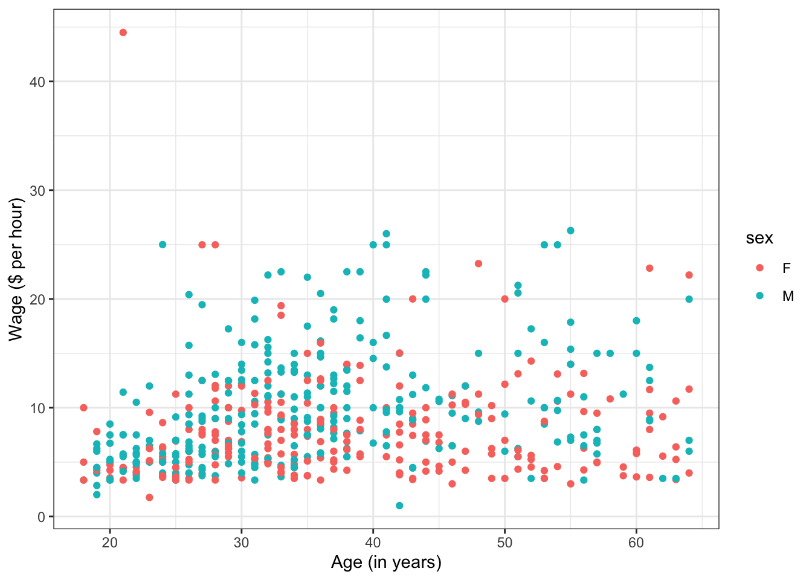


```r
gf_point(wage ~ age, data = CPS85, shape = ~ married) %>%
  gf_theme(theme_bw()) %>%
  gf_labs(x = "Age (in years)", 
          y = "Wage ($ per hour)")
```

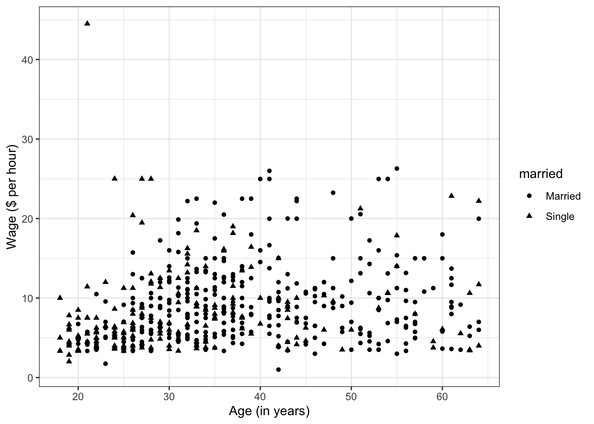


```r
gf_point(wage ~ age, data = CPS85, color = ~ sex, shape = ~ married) %>%
  gf_theme(theme_bw()) %>%
  gf_labs(x = "Age (in years)", 
          y = "Wage ($ per hour)")
```

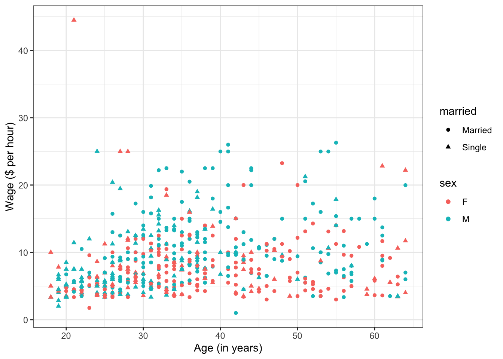


### Faceting   

```r
gf_point(wage ~ age, data = CPS85, color = ~ sex) %>%
  gf_facet_wrap(~ married) %>%
  gf_theme(theme_bw()) %>%
  gf_labs(x = "Age (in years)", 
          y = "Wage ($ per hour)")
```


### Jittered Points

```r
gf_jitter(wage ~ age, data = CPS85) %>%
  gf_theme(theme_bw()) %>%
  gf_labs(x = "Age (in years)", 
          y = "Wage ($ per hour)")
```


## Hex Bins

```r
gf_hex(wage ~ age, data = CPS85) %>% 
  gf_theme(theme_bw()) %>%
  gf_labs(x = "Age (in years)", 
          y = "Wage ($ per hour)")
```

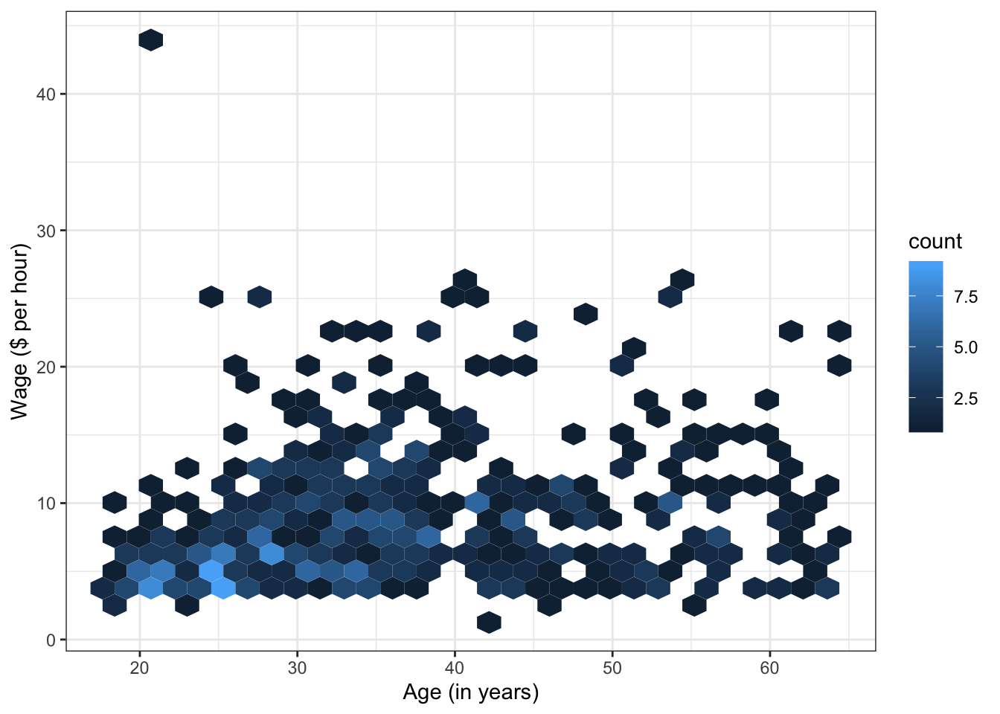

### Adjust color

```r
gf_hex(wage ~ age, data = CPS85) %>% 
  gf_refine(scale_fill_gradientn(colors  = rev(brewer.pal(9, "YlGnBu")),
                                 values = c(0, exp(seq(-5, 0, length.out = 100))))) %>%
  gf_theme(theme_bw()) %>%
  gf_labs(x = "Age (in years)", 
          y = "Wage ($ per hour)")
```

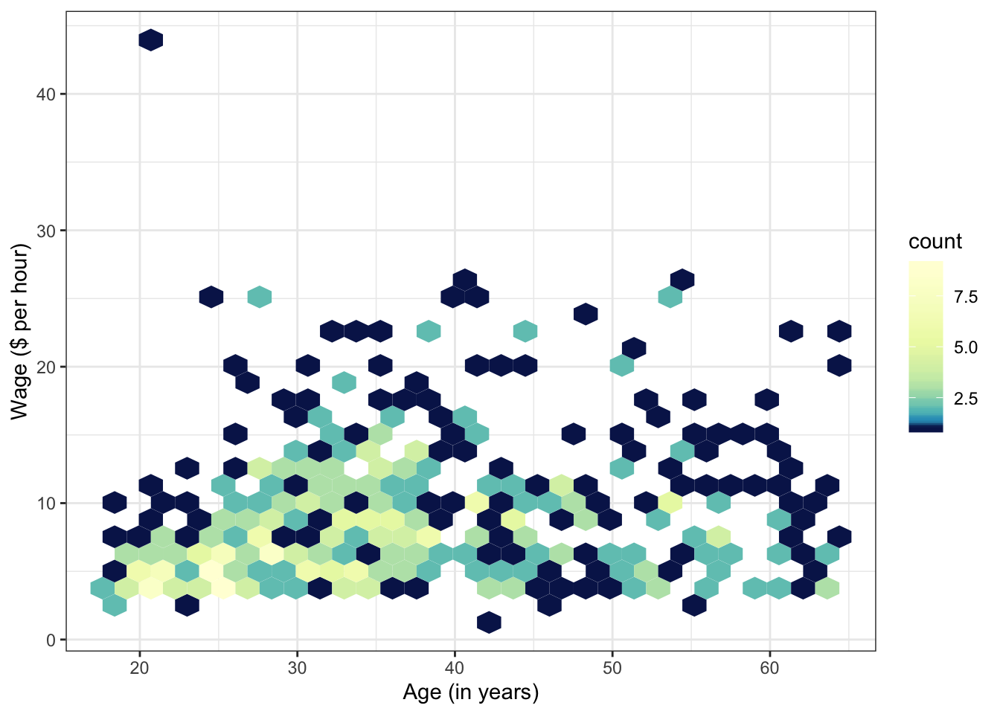


### Label Interesting Points  

May need some new data for this.


## Additional Resources

