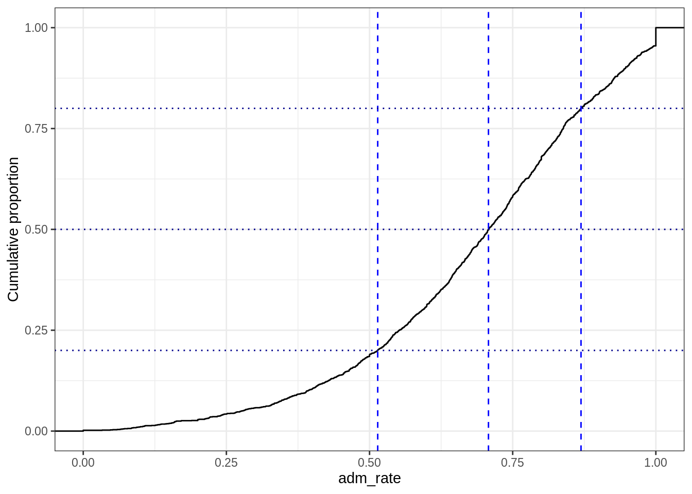
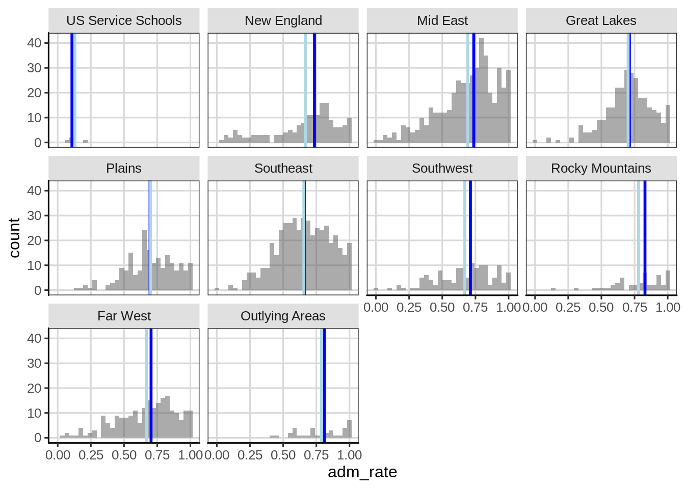
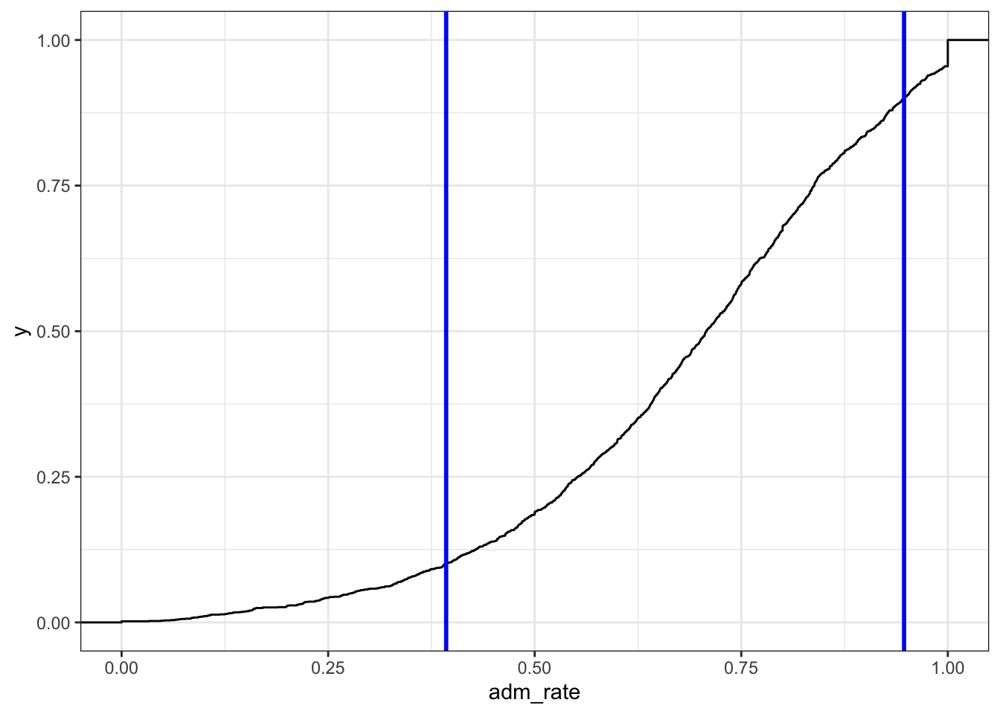
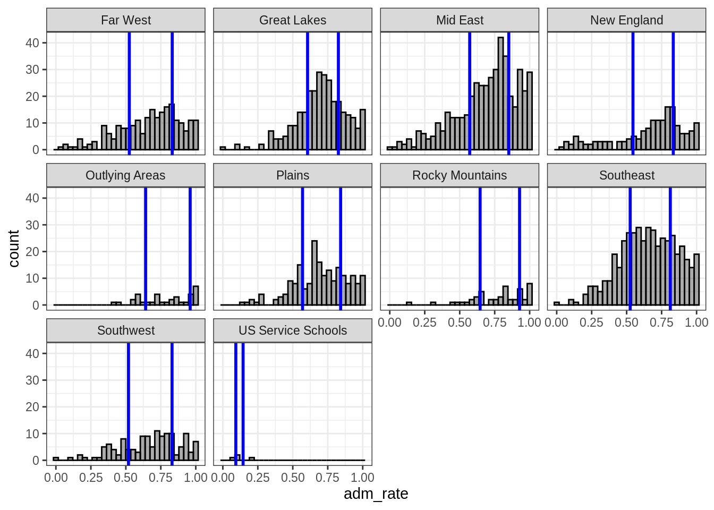

# Descriptive Statistics / Applying functions to columns of data 


## Applying Functions to Data

Data visualization is often the first step on the statistical journey to explore a research question. However, this is usually not where the journey stops, instead additional analyses are often performed to learn more about the average trends seen in the data. These can often be split into two broad categories,

1. Descriptive Statistics
2. Inferential Statistics

**Descriptive Statistics** help to describe the data and are particularly useful to give a single numeric summary for a single variable. We will explore this idea more fully in this section.
**Inferential Statistics** help us to make broader statements from the data we have to the larger group of interest, commonly referred to as the population. More details on these steps later in the course.

## Setup

We are going to use some real data about higher education institutions from the college scorecard (https://collegescorecard.ed.gov/) to explore the types of conclusions we can make from the data. The college scorecard releases data on higher education institutions to help make the institutions more transparent and provide a place for parents, students, educators, etc can get information about specific instituations from a third party (i.e. US Department of Education).

### Loading R packages


```r
library(tidyverse)
```

```
## ── Attaching packages ─────────────────────────────────────────────────────────────────────────── tidyverse 1.2.1 ──
```

```
## ✔ ggplot2 3.2.1     ✔ purrr   0.3.2
## ✔ tibble  2.1.3     ✔ dplyr   0.8.3
## ✔ tidyr   1.0.0     ✔ stringr 1.4.0
## ✔ readr   1.3.1     ✔ forcats 0.4.0
```

```
## ── Conflicts ────────────────────────────────────────────────────────────────────────────── tidyverse_conflicts() ──
## ✖ dplyr::filter() masks stats::filter()
## ✖ dplyr::lag()    masks stats::lag()
```

```r
library(ggformula)
```

```
## Loading required package: ggstance
```

```
## 
## Attaching package: 'ggstance'
```

```
## The following objects are masked from 'package:ggplot2':
## 
##     geom_errorbarh, GeomErrorbarh
```

```
## 
## New to ggformula?  Try the tutorials: 
## 	learnr::run_tutorial("introduction", package = "ggformula")
## 	learnr::run_tutorial("refining", package = "ggformula")
```

```r
library(mosaic)
```

```
## Loading required package: lattice
```

```
## Loading required package: mosaicData
```

```
## Loading required package: Matrix
```

```
## 
## Attaching package: 'Matrix'
```

```
## The following objects are masked from 'package:tidyr':
## 
##     expand, pack, unpack
```

```
## 
## The 'mosaic' package masks several functions from core packages in order to add 
## additional features.  The original behavior of these functions should not be affected by this.
## 
## Note: If you use the Matrix package, be sure to load it BEFORE loading mosaic.
```

```
## 
## Attaching package: 'mosaic'
```

```
## The following object is masked from 'package:Matrix':
## 
##     mean
```

```
## The following objects are masked from 'package:dplyr':
## 
##     count, do, tally
```

```
## The following object is masked from 'package:purrr':
## 
##     cross
```

```
## The following object is masked from 'package:ggplot2':
## 
##     stat
```

```
## The following objects are masked from 'package:stats':
## 
##     binom.test, cor, cor.test, cov, fivenum, IQR, median,
##     prop.test, quantile, sd, t.test, var
```

```
## The following objects are masked from 'package:base':
## 
##     max, mean, min, prod, range, sample, sum
```

```r
theme_set(theme_bw())
```

### Read in Data

The below code will read in the data for us to use in the future. The R function to read in the data is `read_csv()`. Function arguments are passed within the parentheses and for the `read_csv()` function the first argument is the path to the data. The data for this example are posted on GitHub in a comma separated file. This means the data is stored in a text format and each variable (i.e. column in the data) is separated by a comma. This is a common format data is stored.

The data is stored to an object named `college_score`. In R (and other statistical programming languages), it is common to use objects to store results to use later. In this instance, we would like to read in the data and store it to use it later. For example, we will likely want to explore the data visually to see if we can extract some trends from the data. The assignment to an object in R is done with the `<-` assignment operator. Finally, there is one additional argument, `guess_max` which helps to ensure that the data are read in appropriately. More on this later.


```r
college_score <- read_csv("https://raw.githubusercontent.com/lebebr01/statthink/master/data-raw/College-scorecard-clean.csv", guess_max = 10000)
```

```
## Parsed with column specification:
## cols(
##   instnm = col_character(),
##   city = col_character(),
##   stabbr = col_character(),
##   preddeg = col_character(),
##   region = col_character(),
##   locale = col_character(),
##   adm_rate = col_double(),
##   actcmmid = col_double(),
##   ugds = col_double(),
##   costt4_a = col_double(),
##   costt4_p = col_double(),
##   tuitionfee_in = col_double(),
##   tuitionfee_out = col_double(),
##   debt_mdn = col_double(),
##   grad_debt_mdn = col_double(),
##   female = col_double()
## )
```

```r
head(college_score)
```

```
## # A tibble: 6 x 16
##   instnm city  stabbr preddeg region locale adm_rate actcmmid  ugds
##   <chr>  <chr> <chr>  <chr>   <chr>  <chr>     <dbl>    <dbl> <dbl>
## 1 Alaba… Norm… AL     Bachel… South… City:…    0.903       18  4824
## 2 Unive… Birm… AL     Bachel… South… City:…    0.918       25 12866
## 3 Unive… Hunt… AL     Bachel… South… City:…    0.812       28  6917
## 4 Alaba… Mont… AL     Bachel… South… City:…    0.979       18  4189
## 5 The U… Tusc… AL     Bachel… South… City:…    0.533       28 32387
## 6 Aubur… Mont… AL     Bachel… South… City:…    0.825       22  4211
## # … with 7 more variables: costt4_a <dbl>, costt4_p <dbl>,
## #   tuitionfee_in <dbl>, tuitionfee_out <dbl>, debt_mdn <dbl>,
## #   grad_debt_mdn <dbl>, female <dbl>
```

## Functions to columns of data

Data are often stored in a tabular format where the rows of the data are the units and the columns in a data frame are the varaibles. This is shown in the college scorecard data above where the rows of the data are specific institutions of higher education and the columns represent various attributes about those higher education institutions. This is a common structure to store data where each row represents a unique unit or measurement occasion for longitudinal data.

In the data visualization units, we accessed columns of data to view the distribution of the particular variable. For example, we explore histograms of admission rate. Instead of visualizing the data, now we will apply functions to these columns to calculate statistics of interest. In particular, the focus will be on the calculating statistics for variables that are numeric rather than representing categories. We will discuss this in more detail as we move along.

Let's keep talking about the admission rate as we have explored that visually already and start with an example.


```r
df_stats(~ adm_rate, data = college_score, median)
```

```
##   median_adm_rate
## 1          0.7077
```

The `df_stats()` function takes a formula syntax that is similar to the syntax used for viewing a univariate distribution you saw earlier. In particular, the variable that we wish to compute a statistic on is specified after the `~`. The next argument is the data argument. Finally, subsequent arguments after the data argument are functions that we want to compute for the variable specified. Here, I compute the median which happens to be, 0.708. The median is also referred to as the 50% percentile and is the location where half of the data (in this case higher education institutions) are above and below an admission rate of 70.8%.

Let's think where this shows up on the admission rate distribution we plotted earlier.


```r
gf_histogram(~ adm_rate, data = college_score, bins = 30) %>%
  gf_vline(color = 'blue', xintercept = ~df_stats(~ adm_rate, data = college_score, median)[[1]], size = 1)
```


You'll notice that the line is just to the left of the main peak of the data. Does it appear that half of the data are below and half are above the blue line in the figure?

The median is a special percentile, however other percentiles may be of interest. For example, maybe we'd want to know what the 20th percentile is or the 80th percentile to apply to a school that isn't too selective or is not selective at all. We can compute these with the `df_stats()` function again.


```r
q <- college_score %>%
  df_stats(~ adm_rate, quantile(c(0.2, 0.5, 0.8)), nice_names = TRUE)
q
```

```
##      X20.   X50.    X80.
## 1 0.51428 0.7077 0.86932
```

Let's look where these fall on our distribution.


```r
gf_histogram(~ adm_rate, data = college_score, bins = 30) %>%
  gf_vline(color = 'blue', xintercept = ~ value, data = gather(q), size = 1)
```


Does it appear that 20% of the data are below the first line and 20% are above the last line? Difficult to view on the histogram. An empirical distribution figure, sometimes called an ogive, can be helpful to show these.


```r
gf_ecdf(~ adm_rate, data = college_score) %>%
  gf_vline(color = 'blue', xintercept = ~ value, data = gather(q), linetype = 2) %>%
  gf_hline(color = 'darkblue', yintercept = ~c(0.2, 0.5, 0.8), data = NA, linetype = 3) %>%
  gf_labs(y = 'Cumulative proportion')
```



Here you can see that the horizontal lines cross over the vertical lines at the specified values (i.e. 20% for the first vertical line, 50% for the second vertical line, 80% for the final vertical line).

## Considering Groups
We've spent a lot of time trying to reason about other variables that may be important in explaining variation in our variable of interest. So far we have only explored the variable without considering other variables, in practice that is not that useful.

Instead, it is common to compute conditional statistics based on other characteristics in the data. An example may help to show the idea more clearly.


```r
college_score %>%
  df_stats(adm_rate ~ region, median)
```

```
##                region median_adm_rate
## 1            Far West         0.70360
## 2         Great Lakes         0.71110
## 3            Mid East         0.73735
## 4         New England         0.73590
## 5      Outlying Areas         0.81160
## 6              Plains         0.69600
## 7     Rocky Mountains         0.82865
## 8           Southeast         0.65965
## 9           Southwest         0.71220
## 10 US Service Schools         0.10740
```

Presented above are the conditional medians for the higher education institutions in different areas of the country. More specifically, the data are essentially split into subgroups and the median is computed for each of those subgroups instead of pooling all institutions into a single data frame. The formula syntax is now `outcome ~ grouping` where the variable of interest (i.e. commonly a numeric variable) and the variable to the right of the `~` is the grouping variable. This syntax is similar to the violin plots that were created earlier.

Can you see differences in the admission rates across the regions?

One thing that is useful to add in when computing conditional statisics, is how many data points are in each group. This is particularly useful when the groups are different sizes, which is common. To do this, we can add another function to the `df_stats()` function.


```r
college_score %>%
  df_stats(adm_rate ~ region, median, length)
```

```
##                region median_adm_rate length_adm_rate
## 1            Far West         0.70360             221
## 2         Great Lakes         0.71110             297
## 3            Mid East         0.73735             458
## 4         New England         0.73590             167
## 5      Outlying Areas         0.81160              35
## 6              Plains         0.69600             200
## 7     Rocky Mountains         0.82865              50
## 8           Southeast         0.65965             454
## 9           Southwest         0.71220             133
## 10 US Service Schools         0.10740               4
```

This adds another columns which represents the number of observations that went into the median calculation for each group. The syntax above also shows that you can add additional functions separated by a comma in the `df_stats()` function and are not limited to a single function. We will take advantage of this feature later on.

### Adding additional groups
What if we thought more than one variable was important in explaining variation in the outcome variable? These can also be added to the `df_stats()` function for additional conditional statistics. The key is to add another variable to the right-hand side of the formula argument. More than one variable are separated with a `+` symbol.


```r
college_score %>%
  df_stats(adm_rate ~ region + preddeg, median, length)
```

```
##                region            preddeg median_adm_rate length_adm_rate
## 1            Far West   Associate Degree         0.58935              12
## 2         Great Lakes   Associate Degree         0.79515              22
## 3            Mid East   Associate Degree         0.80290              54
## 4         New England   Associate Degree         0.78430               7
## 5      Outlying Areas   Associate Degree         0.87040               6
## 6              Plains   Associate Degree         0.74610               8
## 7     Rocky Mountains   Associate Degree         0.83970               5
## 8           Southeast   Associate Degree         0.72525              34
## 9           Southwest   Associate Degree         0.42260               5
## 10           Far West    Bachelor Degree         0.69260             172
## 11        Great Lakes    Bachelor Degree         0.70560             252
## 12           Mid East    Bachelor Degree         0.70790             340
## 13        New England    Bachelor Degree         0.72980             145
## 14     Outlying Areas    Bachelor Degree         0.70905              24
## 15             Plains    Bachelor Degree         0.68330             173
## 16    Rocky Mountains    Bachelor Degree         0.82865              40
## 17          Southeast    Bachelor Degree         0.64180             393
## 18          Southwest    Bachelor Degree         0.71975             116
## 19 US Service Schools    Bachelor Degree         0.10740               4
## 20           Far West Certificate Degree         0.76470              37
## 21        Great Lakes Certificate Degree         0.83960              23
## 22           Mid East Certificate Degree         0.79505              64
## 23        New England Certificate Degree         0.81820              15
## 24     Outlying Areas Certificate Degree         1.00000               5
## 25             Plains Certificate Degree         0.82140              19
## 26    Rocky Mountains Certificate Degree         0.67200               5
## 27          Southeast Certificate Degree         0.75700              27
## 28          Southwest Certificate Degree         0.72365              12
```

## Other statistics of center
So far we have been discussing the median. The median attempts to provide a single number summary for the center of the distribution. It is a robust statistic, but likely isn't the most popular statistic to provide a location for the center of a distribution. The mean is often more commonly used as a measure of the center of a distribution. Part of this is due to the usage of the mean in common statistical methods and the mean also uses the values of all the data in the calculation. The median only considers the values of the middle score or scores, therefore this statistic is less sensitive to extreme values than the mean. I like to look at both statistics and this can provide some insight into the distribution of interest. We can add the mean using the `df_stats()` function by adding the function `mean`.


```r
stats_compute <- college_score %>%
  df_stats(adm_rate ~ region, median, mean, length)
stats_compute
```

```
##                region median_adm_rate mean_adm_rate length_adm_rate
## 1            Far West         0.70360     0.6682570             221
## 2         Great Lakes         0.71110     0.7015263             297
## 3            Mid East         0.73735     0.6920234             458
## 4         New England         0.73590     0.6672838             167
## 5      Outlying Areas         0.81160     0.7885600              35
## 6              Plains         0.69600     0.7000135             200
## 7     Rocky Mountains         0.82865     0.7800680              50
## 8           Southeast         0.65965     0.6560097             454
## 9           Southwest         0.71220     0.6696759             133
## 10 US Service Schools         0.10740     0.1302000               4
```

Do you notice any trends in the direction the mean and median typically follow? More specifically, is the mean typically larger than the median or vice versa?

Let's visualize them.


```r
gf_histogram(~ adm_rate, data = college_score, bins = 30) %>%
  gf_facet_wrap(~ region) %>%
  gf_vline(color = 'blue', xintercept = ~ median_adm_rate, data = stats_compute, size = 1) %>%
  gf_vline(color = 'lightblue', xintercept = ~ mean_adm_rate, data = stats_compute, size = 1)
```



What is different about the distributions that have larger differences in the mean and median?

## Measures of Variation

So far we have focused primarily on applying functions to columns of data to provide a single numeric summary for where the center of the distribution may lie. The center of the distribution is important, however the primary goal in research and with statistics is to try to understand the variation in the distribution.

One crude measure of variation that is intuitive is the range of a variable. The range is the difference between the smallest and the largest number in the data. We can compute this with the `df_stats()` function.


```r
college_score %>%
  df_stats(~ adm_rate, range)
```

```
##   range_adm_rate_1 range_adm_rate_2
## 1                0                1
```

The details of the `df_stats()` function are in the previous course notes. The output for this computation returns two values, the minimum and maximum value in the data and unsurprisingly, is 0 and 1 respectively. The range is most useful as a data checking process to ensure that the variable contains values that are theoretically possible, which is true in this case. The range is known as a biased statistic in that it will almost always be smaller than the population value. Therefore, we would like a better statistic for measures of variation.

### Robust measure of variation
A robust measure of variation that often is used in tandem with the median is the interquartile range (IQR). This statistic can be calculated in two ways, either using the `IQR()` or `quantile()` function. Both are presented below.


```r
college_score %>%
  df_stats(~ adm_rate, IQR, quantile(c(0.25, 0.75)), nice_names = TRUE)
```

```
##   IQR_adm_rate   X25.    X75.
## 1      0.28575 0.5524 0.83815
```

The IQR is the difference between the 75th and 25th percentiles and in this example equals 0.285 or about 28.5%. As the IQR represents differences in percentiles, we could say that the middle 50% of the distribution is found between 55% and 84% and the middle 50% is spread out by about 28.5%. The idea behind the IQR representing differences in percentiles allows us to extend this to different percentiles that may be more directly interpretable for a given situation. For example, suppose we wanted to know how spread out the middle 80% of the distribution is. We can do this directly by computing the 90th and 10th percentiles and finding the difference between the two.


```r
mid_80 <- college_score %>%
  df_stats(~ adm_rate, quantile(c(0.1, 0.9)), nice_names = TRUE)
mid_80
```

```
##      X10.    X90.
## 1 0.39284 0.94706
```

As you can see, once you extend the amount of the distribution contained, the distance increases, now to 0.555 or 55.5% the the range of the middle 80% of the admission rate distribution. We can also visualize what this looks like.


```r
gf_histogram(~ adm_rate, data = college_score, bins = 30, color = 'black') %>%
  gf_vline(color = 'blue', xintercept = ~ value, data = gather(mid_80), size = 1)
```


We can also view the exact percentages using the empirical cumulative density function.


```r
gf_ecdf(~ adm_rate, data = college_score) %>%
  gf_vline(color = 'blue', xintercept = ~ value, data = gather(mid_80), size = 1)
```



### Variation by Group
These statistics can also be calculated by different grouping variables similar to what was done with statisitcs of center. Now the variable of interest is on the left-hand side of the equation and the grouping variable is on the right hand side.


```r
iqr_groups <- college_score %>%
  df_stats(adm_rate ~ region, IQR, quantile(c(0.25, 0.75)), nice_names = TRUE)
iqr_groups
```

```
##                region IQR_adm_rate    X25.     X75.
## 1            Far West     0.306700 0.52480 0.831500
## 2         Great Lakes     0.220300 0.60580 0.826100
## 3            Mid East     0.279425 0.57140 0.850825
## 4         New England     0.288000 0.54525 0.833250
## 5      Outlying Areas     0.318600 0.64135 0.959950
## 6              Plains     0.272200 0.56990 0.842100
## 7     Rocky Mountains     0.281950 0.64590 0.927850
## 8           Southeast     0.286950 0.52525 0.812200
## 9           Southwest     0.311400 0.51900 0.830400
## 10 US Service Schools     0.052000 0.09280 0.144800
```

This can also be visualized to see how these statistics vary across the groups.


```r
gf_histogram(~ adm_rate, data = college_score, bins = 30, color = 'black') %>%
  gf_vline(color = 'blue', xintercept = ~ value, 
     data = filter(pivot_longer(iqr_groups, IQR_adm_rate:'X75.'), name %in% c('X25.', 'X75.')), size = 1) %>%
  gf_facet_wrap(~ region)
```



## Other measures of variation
There are many other variation measures that are used in statistics. We will apply a functional approach to these and try to visualize what they are trying to represent. The statistics discussed here represent deviations from the mean, either the average absolute deviation or the average squared deviation.


```r
college_score %>%
  df_stats(~ adm_rate, sd, var)
```

```
##   sd_adm_rate var_adm_rate
## 1   0.2113571   0.04467182
```

In order to compute the mean absolute error, we first need to define a new function.


```r
mae <- function(x, na.rm = TRUE, ...) {
  avg <- mean(x, na.rm = na.rm, ...)
  abs_avg <- abs(x - avg)
  
  mean(abs_avg)
} 
```

We can now use this new function just like any other function.


```r
college_score %>%
  df_stats(~ adm_rate, sd, var, mae)
```

```
##   sd_adm_rate var_adm_rate mae_adm_rate
## 1   0.2113571   0.04467182    0.1692953
```

