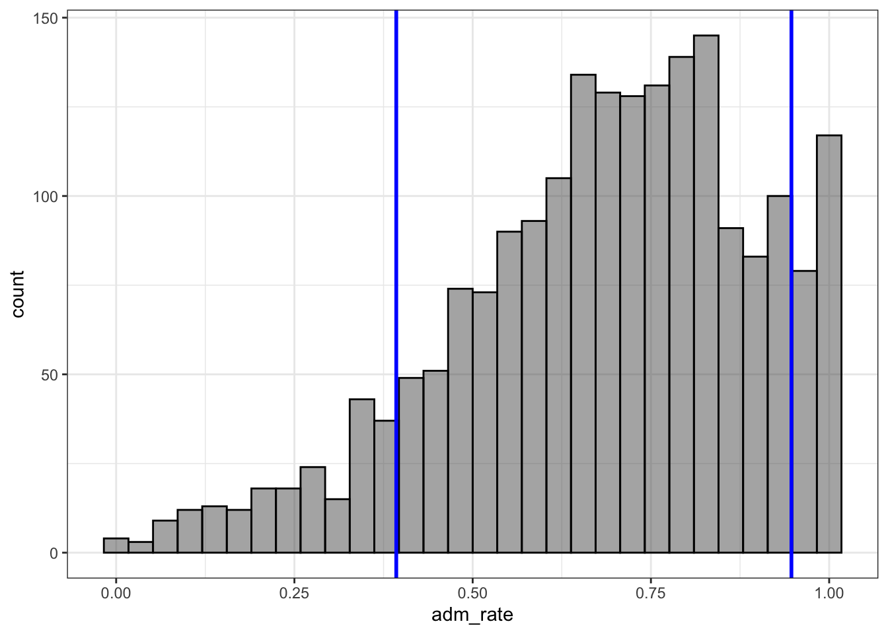

# Descriptive Statistics: Numerically Describing the Sample Data 


Data visualization is often the first step on the statistical journey to explore a research question. However, this is usually not where the journey stops, instead additional analyses are often performed to learn more about the trends and structure in the data. In this chapter we will learn about methods that useful for numerically summarizing a sample of data. These methods are commonly referred to as *descriptive statistics*.

We will again use the data provided in the file *College-scorecard-clean.csv* to examine admissions rates for 2,019 institutions of higher education. As in the previous chapter, before we begin the analysis, we will load several packages that include functions we will use in the chapter. We also import the College Scorecard data using the `read_csv()` function.


```r
# Load packages
library(tidyverse)
library(ggformula)
library(mosaic)
library(statthink)

# Set theme for plots
theme_set(theme_statthinking())

# Import the data
colleges <- read_csv(
  file = "https://raw.githubusercontent.com/lebebr01/statthink/master/data-raw/College-scorecard-clean.csv", 
  guess_max = 10000
  )

# View first six cases
head(colleges)
```

```
## # A tibble: 6 x 17
##   instnm city  stabbr preddeg region locale adm_rate actcmmid  ugds
##   <chr>  <chr> <chr>  <chr>   <chr>  <chr>     <dbl>    <dbl> <dbl>
## 1 Alaba… Norm… AL     Bachel… South… City:…    0.903       18  4824
## 2 Unive… Birm… AL     Bachel… South… City:…    0.918       25 12866
## 3 Unive… Hunt… AL     Bachel… South… City:…    0.812       28  6917
## 4 Alaba… Mont… AL     Bachel… South… City:…    0.979       18  4189
## 5 The U… Tusc… AL     Bachel… South… City:…    0.533       28 32387
## 6 Aubur… Mont… AL     Bachel… South… City:…    0.825       22  4211
## # … with 8 more variables: costt4_a <dbl>, costt4_p <dbl>,
## #   tuitionfee_in <dbl>, tuitionfee_out <dbl>, debt_mdn <dbl>,
## #   grad_debt_mdn <dbl>, female <dbl>, bachelor_degree <dbl>
```

## Summarizing Attributes

Data are often stored in a tabular format where the rows of the data are the *cases* and the columns are *attributes*. For example, in the college scorecard data (displayed above) the rows each represent a specific institution of higher education (cases) and the columns represent various attributes measured on those higher education institutions. This type of tabular representation is a common structure for storing and analyzing data.

In the previous chapter, we visualized different attributes by referencing those attributes in the function we used to create a plot of the distribution. For example, when we wanted to plot a histogram of the distribution of admission rates, we referenced the `adm_rate` attribute in the `gf_histogram()` function. In a similar vein, we will obtain numerical summaries of an attribute by referencing that attribute in the `df_stats()` function. Below, we obtain numerical summaries for the admissions rate attribute:


```r
df_stats(~ adm_rate, data = colleges, median)
```

```
##   median_adm_rate
## 1          0.7077
```

The `df_stats()` function takes a formula syntax that is the same as the formula syntax we introduced in the previous chapter. In particular, the variable that we wish to compute a statistic on is specified after the `~`. We also specify the data object with the `data=` argument. Finally, we include additional arguments indicating the name of the particular numerical summary (or summaries) that we want to compute.^[Note that the names of the summaries we include in the `df_stats()` function need to be the actual names of functions that R recognizes.] In the syntax above, we compute the median admission rate. 

The median is also referred to as the 50th percentile, and is the value at which half of the admission rates in the data are above and half are below. In our data, the medain admission rate is 70.8%. In our data 1,009 institutions have an admission rate below 70.8% and 1,009 have an admission rate above 70.8%. In the histogram below, we add a vertical line at the median admission rate to help you visualize what this means.

Another common numerical summary that is often used to describe a distribution is the mean. To compute the mean admission rate we again use the `df_stats()` function, but include `mean` as our additional argument.


```r
df_stats(~ adm_rate, data = colleges, mean)
```

```
##   mean_adm_rate
## 1     0.6827355
```

The mean (or average) admission rate for the 2,019 institutions of higher education is 68.3%. 


## Understanding the Median and Mean

In your previous educational experiences with the mean and median, you may have learned the formulas or algorithms that produce these values. For example:

- **Mean:** Add up all the values of the attribute and divide by the number of values;
- **Median:** Order all the values of the attribute from smallest to largest and find the one in the middle. If there is an even number of observations, find the mean of the middle two values.

To better understand these summaries, we will visualize them on the distirbution of admission rates. 

<div class="figure">

<p class="caption">(\#fig:unnamed-chunk-4)Distribution of admission rates for thw 2,019 institutions of higher education. The mean admission rate is displayed as a red, dashed line.</p>
</div>

The mean (displayed as a red, dashed line) represents the "balance point" of the distribution. If the distribution were a physical entity, it is the location where you would put you finger underneath the distribution to balance it. In a statistical sense, we balance the distribution by "balancing" the deviations. To explain this, let's examine a toy data set of five observations:

$$
Y = \begin{pmatrix}10\\ 10\\ 20\\ 30\\ 50\end{pmatrix}
$$

The mean of these five values is 24. Each of these values has a deviation which is computed as the difference between the observed value and the mean value. For the toy data,

$$
Y = \begin{pmatrix}10 - 24\\ 10-24\\ 20-24\\ 30-24\\ 50-24\end{pmatrix} = \begin{pmatrix}-14\\ -14\\ -4\\ 6\\ 26\end{pmatrix}
$$

Notice that some of the deviations are negative (the observation was below the mean) and some are positive (the observation was above the mean). The mean "balances" these deviations since the sum of the deviations is 0. What if we had instead looked at the deviations from the median, which is 20?

$$
Y = \begin{pmatrix}10 - 20\\ 10-20\\ 20-20\\ 30-20\\ 50-20\end{pmatrix} = \begin{pmatrix}-10\\ -10\\ 0\\ 10\\ 30\end{pmatrix}
$$

The median does not balance the deviations; the sum is not zero (it is $+20$). The mean is the only value we can use to "balance" the deviations.


What about the median?

<div class="figure">

<p class="caption">(\#fig:unnamed-chunk-5)Distribution of admission rates for thw 2,019 institutions of higher education. The median admission rate is displayed as a blue, solid line.</p>
</div>

In the figure, half of the observations in the histogram have an admission rate below the blue line and half have an admission rate above the blue line. The median splits the distribution into two equal areas. Note that the median is not necessarily in the middle of the values represented on the $x$-axis; that would be 0.50 rather than 0.708. It is the area under the curve (or embodied by the histogram) that is halved.


### Summarize with the Mean or Median?

The goal of summarizing the distribution numerically is to provide a value that typifies or represents the observed values of the attribute. In our example, we need a value that summarizes the 2,019 admission rates. Since the mean balances the deviations, it is the representative because it is the value that is "closest" (at least on average) to all of the observations. (It is the value that produces the smallest *average deviation*---since the sum of deviations is 0, the average deviation is also 0.) The median is representative because half of the distribution is smaller than that value and the other half is larger. But, does one represent the distribution better than the other?


<div class="figure">

<p class="caption">(\#fig:unnamed-chunk-6)Distribution of the admission rates for 2,019 institutions of higher education. The mean admission rate is displayed as a red, dashed line. The median admission rate is displayed as a blue, solid line.</p>
</div>

In this example, both values are quite similar, so either would send a simlar message about the distribution of admission rates, namely that a typical admission rate for these 2,019 institutions of higher education is around 70%. 

Looking at the plot, we see that the mean admission rate is lower than the median admission rate. In a left-skewed distribution this will often be the case. The mean is "pulled toward the tail" of the distribution. This is because the mean is influenced by extreme values (which in a skewed distribution are in the tail). The median is not influenced by extreme values; we say it is *robust* to these values. This is because in calculating the median, only the middle score (or middle two scores) are used, so its value is not informed by the extreme values in the distribution.^[The downside of using the median is that it is only informed by one or two observations in the data. The mean is informed by all of the observations. This property of the mean makes it a more useful than the median in some mathematical and theoretical applications.] 

In practice, it is a good idea to compute both the mean and the median and explore whether one is more representative than the other (perhaps by plotting them on the distribution). The choice of one over the other should also be guided by substantive knowledge. 


## Numerically Summarizing Variation


In the distribution of admission rates, both the mean and median seems to offer a representative admission rate since both are close to the modal clump of the distribution. (There are several colleges that have an admission rate close to 70%.) But, you will also notice that an admission rate of 70% does not do a great job representing all of the institutions' admissions rates. This is true for any single statistic we pick to summarize the distribution. 

To more fully summarize the distribution we need to summarize the variability in the distribution in addition to a "typical" or representative value. There are several summaries that statisticians and data scientists use to describe the variation in a distribution. And, like the representative summary measures, each of the summaries of variation provide slightly different information by highlighting different aspects of the variability. We will explore some of these measures below.


### Range

One measure of variation that you have almost surely encountered before is the range. This numerical measure is the difference between the maximum and minimum values in the data. To compute this we provide the `df_stats()` function with two additional arguments, `min` and `max`. Then we can compute the difference between these values.


```r
# Obtain minimum and maximum admission rate
df_stats(~ adm_rate, data = colleges, min, max)
```

```
##   min_adm_rate max_adm_rate
## 1            0            1
```

```r
# Compute range
1 - 0
```

```
## [1] 1
```

The range of the admission rates is 1. When people colloquially describe the range, they typically provide the limits of the data rather than actually providing the range. For example, they may describe the range of the admission rates as: "the admission rates range from 0 to 1". While this is technially not the range (which is a single number), it is probably more descriptive as it also gives a sense of the lower- and upper-limits for the observations.

One problem with the range is that if there are extreme values, the range will not give an accurate picture of the variation encompassing most observations. For example, consider the following five test scores:

$$
Y = \begin{pmatrix}30\\ 35\\ 36\\ 37\\ 100\end{pmatrix}
$$

The range of these data is 70, indicating that the variation between the lowest and highest score is 70 points, suggesting a lot of variation in the scores. The range, however, is clearly influenced by the score of 100. Were it not for that score, we would have a much different take on the score variability; the other scores are between 30 and 37 (a range of 7), suggesting that there is not a lot of differenes in the test scores.^[A second issue with range is that it is a *biased statistic*. If we use it as an estimate of the population range, it will almose inevitably be too small. The population range will almost always be larger since the sampling process will often not select extreme population values.] 

While the range is perhaps not the best measure of variation, it is quite useful as a validity check on the data to ensure that the attribute's values are theoretically possible. In this case the values are all between 0 and 1, which are values that are theoretically plausible for admission rate.

### Percentile Range

One way to deal with extreme values in the sample is simply to not include them when we calculate the range. For example, instead of computing the difference between the maximum and minimum value in the data (which includes extreme values), truncate the bottom 10% and upper 10% of the data and calculate the range between the remaining maximum and minimum values. This is essentially the range of the middle 80% of the data. 

To compute the endpoint after truncatng the lower- and upper 10% we will use the `quantile()` function. This function finds the data value for an associated percentile provided to the function. If we wnat to truncate the lower- and upper 10% of a distribution we are interested in finding the values associated with the 10th and 90th percentiles. The syntax below shows two manners for obtaining these values for the admissions rate attribute.


```r
# Provide both percentiles separately
colleges %>%
  df_stats(~ adm_rate, quantile(0.10), quantile(.90))
```

```
##       10%     90%
## 1 0.39284 0.94706
```

```r
# Provide both percentiles in a single quantile() call
colleges %>%
  df_stats(~ adm_rate, quantile(c(0.1, 0.9)))
```

```
##       10%     90%
## 1 0.39284 0.94706
```

```r
# Compute the range ofthe middle 80% of the data
0.94706 - 0.39284
```

```
## [1] 0.55422
```

The range of admissions rates for 80% of the 2,019 institutions of higher education is 0.554. We can visualize this by adding the percentiles on the plot of the distribution of admission rates. These values seem to visually correspond to where most of the data are concentrated.

<div class="figure">

<p class="caption">(\#fig:unnamed-chunk-9)Distribution of the admission rates for 2,019 institutions of higher education. The solid, red lines are placed at the 10th and 90th percentiles, respectively.</p>
</div>

### Interquartile Range (IQR)

One percentile range that statisticians and data scientists use a great deal is the interquartile range (IQR). This range demarcates the middle 50% of the distribution; it truncates the lower and upper 25% of the values. In other words it is based on finding the range between the 25th- and the 75th-percentiles. 


```r
# Obtain values for the 25th- and 75th percentiles
colleges %>%
  df_stats(~ adm_rate, quantile(c(0.25, 0.75)))
```

```
##      25%     75%
## 1 0.5524 0.83815
```

```r
# Compute the IQR
0.83815 - 0.5524
```

```
## [1] 0.28575
```

The range of admission rates for the middle 50% of the distribution is 28.5%. Since it is based on only 50% of the observations, the IQR no longer gives the range for "most" of the data, but, as shown in the plot below, this range encompasses the modal clump of institutions' admission rates and can be useful for describing the variation.

<div class="figure">

<p class="caption">(\#fig:unnamed-chunk-11)Distribution of the admission rates for 2,019 institutions of higher education. The solid, red lines are placed at the 25th and 75th percentiles, respectively.</p>
</div>

Since the IQR describes the range for half of the observations, it can also be useful to compare this range with the entire range of the data. Below we compute these values and visualize them on a histogram of the distribution.


```r
# Obtain values for the 25th- and 75th percentiles
colleges %>%
  df_stats(~ adm_rate, min, quantile(c(0.25, 0.75)), max)
```

```
##   min_adm_rate    25%     75% max_adm_rate
## 1            0 0.5524 0.83815            1
```

```r
# Compute the IQR
0.83815 - 0.5524
```

```
## [1] 0.28575
```

```r
# Compute the range
1 - 0
```

```
## [1] 1
```

<div class="figure">

<p class="caption">(\#fig:unnamed-chunk-13)Distribution of the admission rates for 2,019 institutions of higher education. The solid, red lines are placed at the 25th and 75th percentiles, respectively. The dashed, blue lines are placed at the minimum and maximum values, respectively.</p>
</div>

Although our sample of 2,019 institutions of higher education have wildy varying admissions rates (from 0% to 100%), the middle half of those institutions have admissions rates between 55% and 84%. We also note that the 25% of institutions with the lowest admissions rate range from 0% to 55%, while the 25% of institutions with the highest admissions rate range from only 84% to 100%. This means that there is more variation in the admissions rates in the institutions with the lowest admissions rate than in the institutions with the highest admissions rates.

Understanding how similar the range of variation is in these areas of the distribution can give us information about the shape f the distribution. For example, the bigger range in the lowest 25% of the data suggests that the distribution has a tail on the left side. Seventy-five percent of the institutions have admissions rates higher than 50%. These two features suggest that the distribtion is left-skewed (which we also see in the histogram). When we describe the shape of a distribution, we are actually describing the variability in the data!

Examining the lowest 25%, highest 25%, and middle 50% of the data is so common that a statistician named John Tukey invented a visualization technique called the box-and-whiskers plot to show these ranges. To create a box-and-whiskers plot we use the `gf_boxploth()` function.^[The `gf_boxplot()` function creates vertical a box-and-whiskers plot, and the `gf_boxploth()` function creates a horizontal box-and-whiskers plot.] This function takes a formula that is slightly different than we have been using, namely `0 ~ attribute name`.  (Note that the `0` in the formula is where the box-and-whiskers plot is centered on the *y*-axis.)


```r
gf_boxploth(0 ~ adm_rate, data = colleges, fill = "skyblue")  %>%
  gf_labs(x = "Admission rate")
```


The "box", etxending from 0.55 to 0.84, depicts the interuartile range; the middle 50% of the distribution. The line near the middle of the box is the median value. The "whiskers" extend to either the end of the range, or the next closest observation that is not an extreme value. (There are several extreme values on the left-hand side of the distribution representing institutions with extremely low admission rates.) The length of the whisker denotes the range of the lowest 25% of the distribution and the highest 25% of the distribution.

The syntax below displays both the histogram and box-and-whiskers plot. Here the box-and-whiskers plot is centered at a *y*-value of 170. We also made it a little wider using the `width=10` argument. 


```r
gf_histogram(~ adm_rate, data = colleges, bins = 30) %>%
gf_boxploth(170 ~ adm_rate, data = colleges, fill = "skyblue", width = 10)  %>%
  gf_labs(x = "Admission rate", y = "Frequency")
```


### Empirical Cumulative Density

The percentile range plots and the boxplot indicated the values of the distribution that demarcated a particular proportion of the distribution. For example, the boxplot visually showed the admission rates that were at the 25th, 50th, and 75th percentiles. Another plot that can be useful for understanding how much of a distribution is at or below a particular value is a plot of the *empirical cumulative density*. To create this plot we use the `gf_ecdf()` function from the **ggformula** package.


```r
gf_ecdf(~ adm_rate, data = colleges) %>%
  gf_labs(x = "Admission rate", y = 'Cumulative proportion')
```



To read this plot, we can map admission rates to their associated cumulative proportion. For example, one-quarter of the admission rates in the distribution are at or below 0.55; that is the admission rate of 0.55 has an associated cumulative proportion of 0.25. Similarly, an admission rate of 0.71 is associated with a cumulative proportion of 0.50; one-half of the admission rates in the distribution are at or below the value of 0.71.

### Variance and Standard Deviation

Two measures of variation that are commonly used by statisticians and datd scientists are the variance and the standard deviation. These can be obtained by including `var` and `sd`, respectively, in the `df_stats()` function.


```r
# Compute variance and standard deviation
colleges %>%
  df_stats(~ adm_rate, var, sd)
```

```
##   var_adm_rate sd_adm_rate
## 1   0.04467182   0.2113571
```

The variance and standard deviation are related to each other in that if we square the value of the standard deviation we obtain the variance.


```r
# Square the standard deviation
0.2113571 ^ 2
```

```
## [1] 0.04467182
```

In general, the standard deviation is more useful for describing the variation in a sample because it is in the same metric as the data. In our example, the metric of the data is proportion of students admitted, and the standard deviation is also in this metric. The variance, as the square of the standard deviation, is in the squared metric&mdash;in our example, proportion of students admitted squared. While this is not a useful metric in description, it does have some nice mathematical properties, so it is also a useful measure of the variation.

#### Understanding the Standard Deviation

To understand how we interpret the standard deviation, it is useful to see how it is calculated. To do so, we will return to our toy data set:

$$
Y = \begin{pmatrix}10 \\ 10\\ 20\\ 30\\ 50\end{pmatrix}
$$

Recall that earlier we computed the deviation from the mean for each of these observations, and that these deviations was a measure of how far above or below the mean each observation was.


$$
Y = \begin{pmatrix}10 - 24\\ 10-24\\ 20-24\\ 30-24\\ 50-24\end{pmatrix} = \begin{pmatrix}-14\\ -14\\ -4\\ 6\\ 26\end{pmatrix}
$$

A useful measure of the variation in the data would be the average of these deviations. This would tell us, on average, how far from the mean the data are. Unfortunately, if we were to compute the mean we would get zero because the sum of the deviations is zero. (That was a property of the mean discussed earlier in the chapter!) To alleviate this, we square the deviations before summing them.

$$
\begin{pmatrix}-14^2\\ -14^2\\ -4^2\\ 6^2\\ 26^2\end{pmatrix} = \begin{pmatrix}196\\ 196\\ 16\\ 36\\ 676\end{pmatrix}
$$

The sum of these squared deviations is 1,120. And the average squared deviation is then $1120/5 = 224$. If we take the square root of 224, which is 14.97, we now have the average deviation for the five observations. On average, the observations in the distribution are 14.97 units from the mean value of 24. The standard deviation is interpreted as the average deviation from the mean.^[Technically, after summing the squared deviations, we divide this sum by $n-1$ rather than $n$. But, when the sample size is even somewhat large, this difference is trivial.] 

#### Using the Standard Deviation

In our example, the mean admission rate for the 2,019 institutions of higher education was 68.2%, and the standard deviation was 21.1%. We can combine these two pieces of information to make a statement about the admission rates for most of the institutions in our sample. In general, most observations in a distribution fall within one standard deviation of the mean. So, for our example, most institutions have an admission rate that is between 47.1% and 89.3%.^[If we know the exact shape of the distribution we can be more specific about the proportion of the distribution that fall within one standard deviation of the mean.]


```r
# 1 SD below the mean
0.682 - 0.211
```

```
## [1] 0.471
```

```r
# 1 SD above the mean
0.682 + 0.211
```

```
## [1] 0.893
```

## Summarizing Categorical Attributes

Categorical attributes are attributes that have values that represent categories. For example, the attribute `region` indicates the region in the United States where the institution is located (e.g., Midwest). The attribute `bachelor_degree` is a categorical value indicating whether ir not the institution offers a Bachelor's degree. Sometimes statisticians anddata scientists use the terms dichotmous (two categories) and polychotomous (more than two categories) to further define categorical variables. Using this nomenclature, `region` is a polychotomous categorical variable and `bachelor_degree` is a dichotomous categorical variable.

Sometimes analysts use numeric values to encode the categories of a categorical attribute. For example, the attribute `bachelor_degree` is encoded using the values of 0 and 1. It is important to note that these values just indicate whether the institution offers a Bachelor's degree (1) or not (0). The values are not necessarily ordinal in the sense that a 1 means more of the attribute than a 0. Since the values just refer to categories, an analyst might have reversed the coding and used 0 to encode institutions that offer a Bachelor's degree and 1 to encode those institutions that do not. Similarly, the values of 0 and 1 are not sancrosanct; any two numers could have been used to represent the categories.^[Using 0's and 1's for the encoding does have some advantages over other coding schemes which we will explore later when fitting statistical models.]

Most of the time, the numerical summaries we computed earlier in the chapter do not work so well for categorical attributes. For example, it would not make sense to compute the mean region for the institutions. In general, it suffices to compute counts and proportions for the categories included in these attributes. To compute the category counts we use the `tally()` function. This function takes a formula indicating the name of the categorical attribute and the name of the data object. To find the category counts for the `region` attribute:


```r
# Compute category counts
tally(~region, data = colleges)
```

```
## region
##           Far West        Great Lakes           Mid East 
##                221                297                458 
##        New England     Outlying Areas             Plains 
##                167                 35                200 
##    Rocky Mountains          Southeast          Southwest 
##                 50                454                133 
## US Service Schools 
##                  4
```


To find the proportion of institutions in each region, we can divide each of the counts by 2,019.


```r
# Compute category proportions
tally(~region, data = colleges) / 2019
```

```
## region
##           Far West        Great Lakes           Mid East 
##        0.109460129        0.147102526        0.226844973 
##        New England     Outlying Areas             Plains 
##        0.082714215        0.017335315        0.099058940 
##    Rocky Mountains          Southeast          Southwest 
##        0.024764735        0.224863794        0.065874195 
## US Service Schools 
##        0.001981179
```


You could also compute the proportions directly with the `tally()` function by specifying the argument `format = "proportion"`.


```r
# Compute category proportions
tally(~region, data = colleges, format = "proportion")
```

```
## region
##           Far West        Great Lakes           Mid East 
##        0.109460129        0.147102526        0.226844973 
##        New England     Outlying Areas             Plains 
##        0.082714215        0.017335315        0.099058940 
##    Rocky Mountains          Southeast          Southwest 
##        0.024764735        0.224863794        0.065874195 
## US Service Schools 
##        0.001981179
```


## Advanced Extension: Computing Your Own Measure of Variation

If you have another non-standard measure of variation that you want to compute, you can always write your own function to compute it. For example, say you wanted to compute the mean absolute error (the mean of the absolute values of the deviations). To compute the mean absolute error, we first need to define a new function.


```r
mae <- function(x, na.rm = TRUE, ...) {
  avg <- mean(x, na.rm = na.rm, ...)
  abs_avg <- abs(x - avg)
  
  mean(abs_avg)
} 
```

We can now use this new function by employing it as an argument in the `df_stats()` function.


```r
colleges %>%
  df_stats(~ adm_rate, mae)
```

```
##   mae_adm_rate
## 1    0.1692953
```


