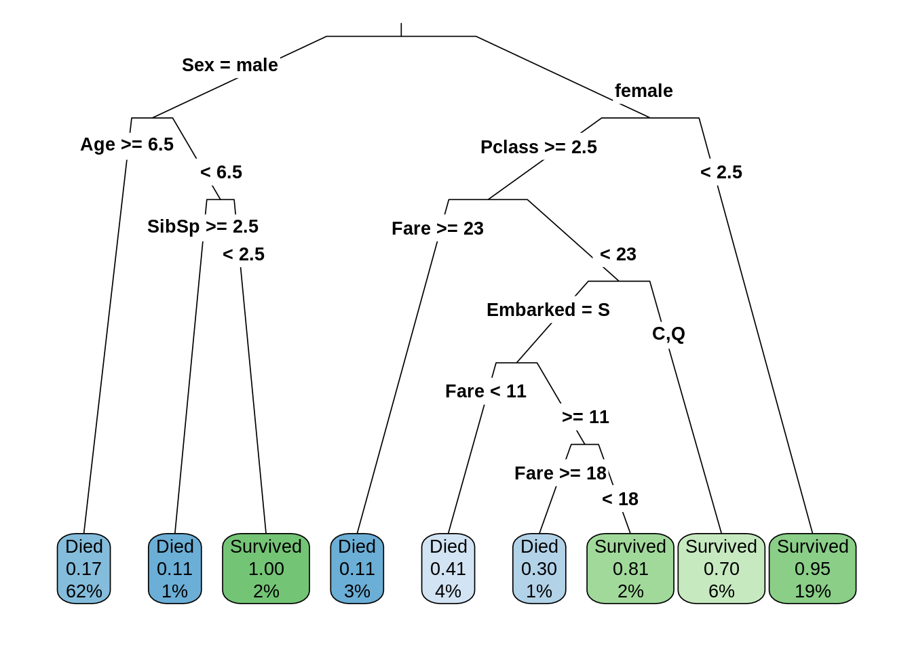
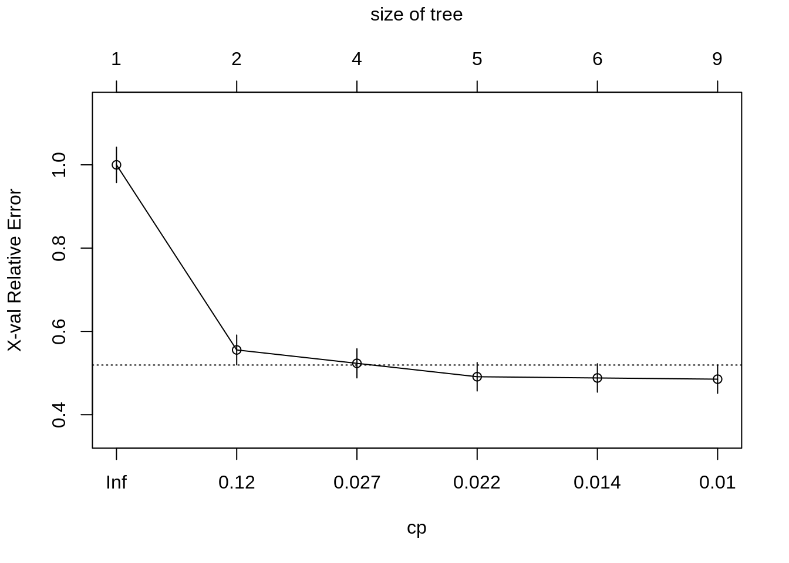
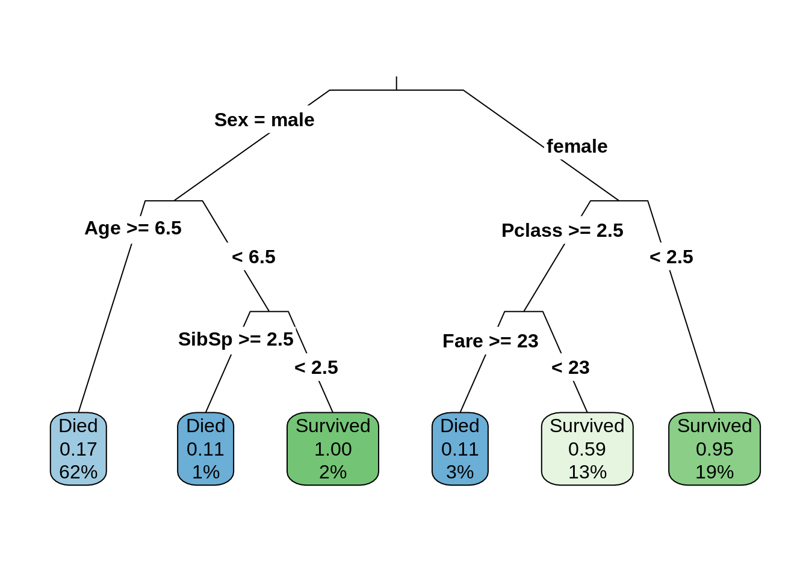
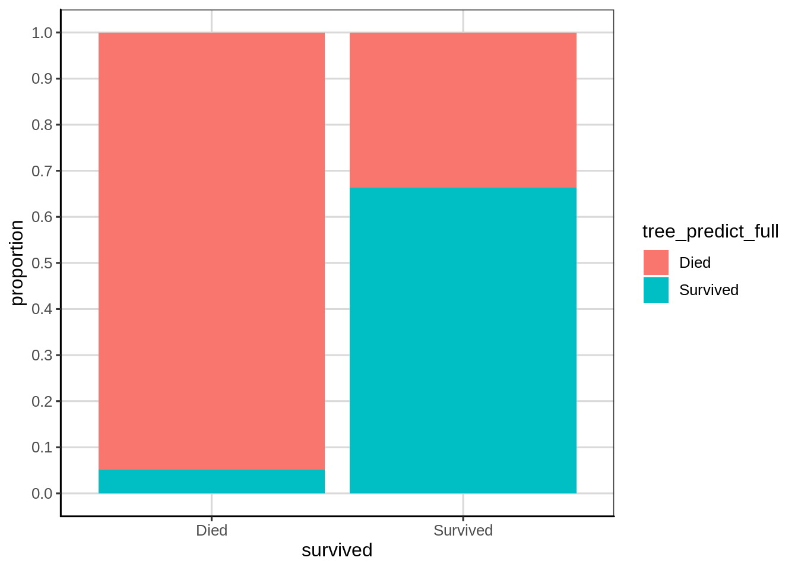
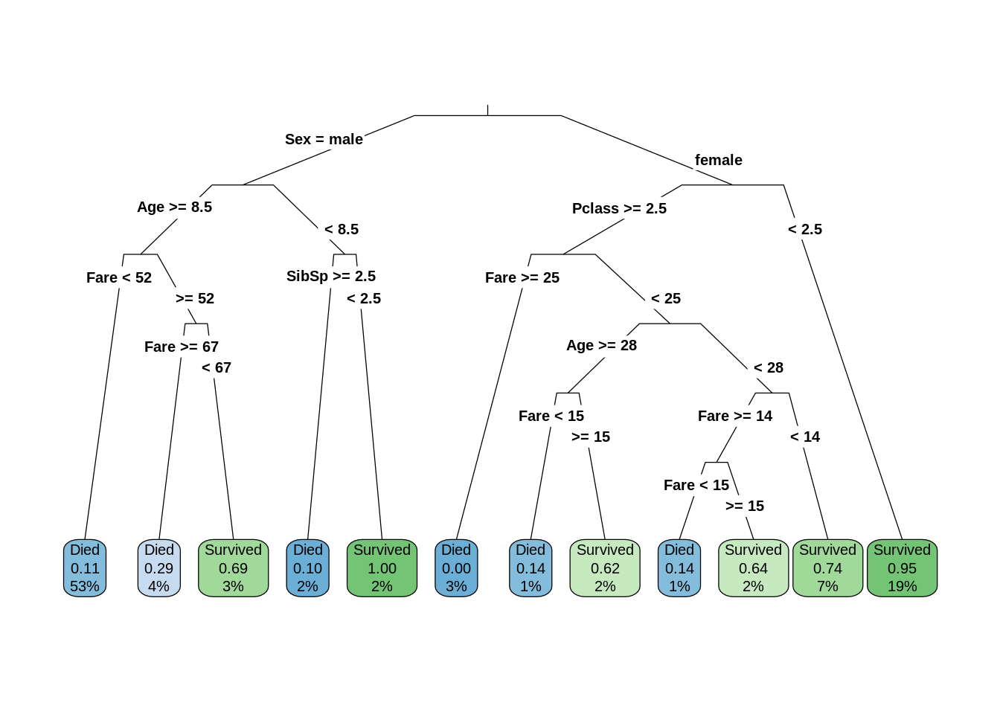
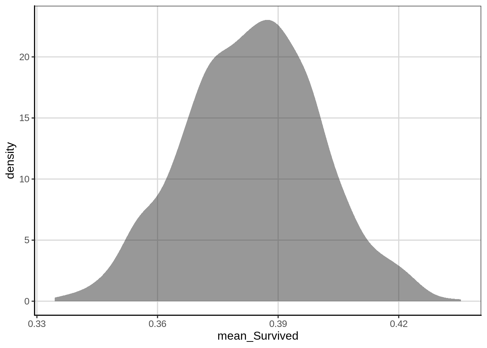
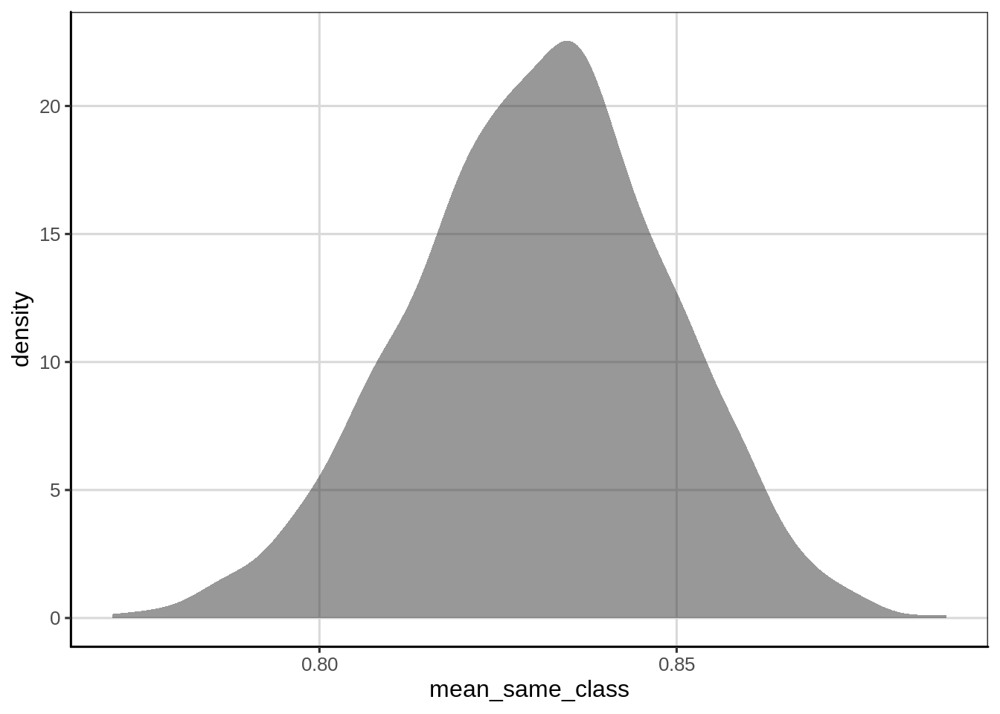

# Classification   

In this example, we will explore data from the titanic that comes from Kaggle (https://www.kaggle.com/c/titanic/data). You can view the attributes in the data from the link previous. The following set of code will install a couple a new packages that we will utilize for this section of the course, the titanic package has the data we will use and the rpart package includes functions to perform the tree based models we will employ.

## Topic: Decision Trees 


```r
library(tidyverse)
```

```
## ── Attaching packages ────────────────────────────────── tidyverse 1.2.1 ──
```

```
## ✔ ggplot2 3.2.1     ✔ purrr   0.3.2
## ✔ tibble  2.1.3     ✔ dplyr   0.8.3
## ✔ tidyr   1.0.0     ✔ stringr 1.4.0
## ✔ readr   1.3.1     ✔ forcats 0.4.0
```

```
## ── Conflicts ───────────────────────────────────── tidyverse_conflicts() ──
## ✖ dplyr::filter() masks stats::filter()
## ✖ dplyr::lag()    masks stats::lag()
```

```r
library(ggformula)
```

```
## Loading required package: ggstance
```

```
## 
## Attaching package: 'ggstance'
```

```
## The following objects are masked from 'package:ggplot2':
## 
##     geom_errorbarh, GeomErrorbarh
```

```
## 
## New to ggformula?  Try the tutorials: 
## 	learnr::run_tutorial("introduction", package = "ggformula")
## 	learnr::run_tutorial("refining", package = "ggformula")
```

```r
library(mosaic)
```

```
## Loading required package: lattice
```

```
## Loading required package: mosaicData
```

```
## Loading required package: Matrix
```

```
## 
## Attaching package: 'Matrix'
```

```
## The following objects are masked from 'package:tidyr':
## 
##     expand, pack, unpack
```

```
## Registered S3 method overwritten by 'mosaic':
##   method                           from   
##   fortify.SpatialPolygonsDataFrame ggplot2
```

```
## 
## The 'mosaic' package masks several functions from core packages in order to add 
## additional features.  The original behavior of these functions should not be affected by this.
## 
## Note: If you use the Matrix package, be sure to load it BEFORE loading mosaic.
```

```
## 
## Attaching package: 'mosaic'
```

```
## The following object is masked from 'package:Matrix':
## 
##     mean
```

```
## The following objects are masked from 'package:dplyr':
## 
##     count, do, tally
```

```
## The following object is masked from 'package:purrr':
## 
##     cross
```

```
## The following object is masked from 'package:ggplot2':
## 
##     stat
```

```
## The following objects are masked from 'package:stats':
## 
##     binom.test, cor, cor.test, cov, fivenum, IQR, median,
##     prop.test, quantile, sd, t.test, var
```

```
## The following objects are masked from 'package:base':
## 
##     max, mean, min, prod, range, sample, sum
```

```r
library(titanic)
library(rpart)
library(rsample)
library(rpart.plot)
library(statthink)

theme_set(theme_statthinking())

titanic <- bind_rows(titanic_train, titanic_test) %>% 
  mutate(survived = ifelse(Survived == 1, 'Survived', 'Died')) %>% 
  select(-Survived) %>%
  drop_na(survived)

head(titanic)
```

```
##   PassengerId Pclass                                                Name
## 1           1      3                             Braund, Mr. Owen Harris
## 2           2      1 Cumings, Mrs. John Bradley (Florence Briggs Thayer)
## 3           3      3                              Heikkinen, Miss. Laina
## 4           4      1        Futrelle, Mrs. Jacques Heath (Lily May Peel)
## 5           5      3                            Allen, Mr. William Henry
## 6           6      3                                    Moran, Mr. James
##      Sex Age SibSp Parch           Ticket    Fare Cabin Embarked survived
## 1   male  22     1     0        A/5 21171  7.2500              S     Died
## 2 female  38     1     0         PC 17599 71.2833   C85        C Survived
## 3 female  26     0     0 STON/O2. 3101282  7.9250              S Survived
## 4 female  35     1     0           113803 53.1000  C123        S Survived
## 5   male  35     0     0           373450  8.0500              S     Died
## 6   male  NA     0     0           330877  8.4583              Q     Died
```


```r
count(titanic, survived)
```

```
## # A tibble: 2 x 2
##   survived     n
##   <chr>    <int>
## 1 Died       549
## 2 Survived   342
```


```r
gf_bar(~ survived,  data = titanic)
```


### Fitting a Classification Tree

Let's class_tree our first classification tree to predict the dichotomous attribute, survival. For this, we will use the rpart() function from the rpart package. The first argument to the rpart() function is a formula where the outcome of interest is specified to the left of the ~ and the attributes that are predictive of the outcome are specified to the right of the ~ separated with + signs. The second argument specifies the method for which we want to run the analysis, in this case we want to classify individuals based on the values in the data, therefore we specify method = 'class'. The final argument is the data element, in this case titanic.

In this example, I picked a handful of attributes that would seem important. These can either be numeric or represent categories, the method does not care the type of attributes that are included in the analysis. Notice that I save the computation to the object, class_tree.


```r
class_tree <- rpart(survived ~ Pclass + Sex + Age + Fare + Embarked + SibSp + Parch, 
   method = 'class', data = titanic)

rpart.plot(class_tree, roundint = FALSE, type = 3, branch = .3)
```




```r
rpart.rules(class_tree, cover = TRUE)
```

```
##  survived                                                                                                      cover
##      0.11 when Sex is   male                                                       & Age <  6.5 & SibSp >= 3      1%
##      0.11 when Sex is female & Pclass >= 3 & Fare >=       23                                                     3%
##      0.17 when Sex is   male                                                       & Age >= 6.5                  62%
##      0.30 when Sex is female & Pclass >= 3 & Fare is 18 to 23 & Embarked is      S                                1%
##      0.41 when Sex is female & Pclass >= 3 & Fare <  11       & Embarked is      S                                4%
##      0.70 when Sex is female & Pclass >= 3 & Fare <  23       & Embarked is C or Q                                6%
##      0.81 when Sex is female & Pclass >= 3 & Fare is 11 to 18 & Embarked is      S                                2%
##      0.95 when Sex is female & Pclass <  3                                                                       19%
##      1.00 when Sex is   male                                                       & Age <  6.5 & SibSp <  3      2%
```

### Pruning Trees

One downside of decision trees, is that they can tend to overfit the data and capitalize on chance variation in our sample that we can not generalize to another sample. This means that there are features in the current sample that would not be present in another sample of data. There are a few ways to overcome this, one is to prune the tree to only include the attributes that are most important and improve the classification accuracy. One measure of this can be used is called the complexity parameter (CP) and this statistic attempts to balance the tree complexity related to how strongly the levels of the tree improve the classification accuracy. We can view these statistics with the printcp() and plotcp() functions where the only argument to be specified is the classification tree computation that was saved in the previous step.


```r
printcp(class_tree)
```

```
## 
## Classification tree:
## rpart(formula = survived ~ Pclass + Sex + Age + Fare + Embarked + 
##     SibSp + Parch, data = titanic, method = "class")
## 
## Variables actually used in tree construction:
## [1] Age      Embarked Fare     Pclass   Sex      SibSp   
## 
## Root node error: 342/891 = 0.38384
## 
## n= 891 
## 
##         CP nsplit rel error  xerror     xstd
## 1 0.444444      0   1.00000 1.00000 0.042446
## 2 0.030702      1   0.55556 0.55556 0.035750
## 3 0.023392      3   0.49415 0.50000 0.034372
## 4 0.020468      4   0.47076 0.48830 0.034061
## 5 0.010234      5   0.45029 0.48538 0.033983
## 6 0.010000      8   0.41813 0.50585 0.034524
```

```r
plotcp(class_tree)
```




```r
prune_class_tree <- prune(class_tree, cp = .02)
rpart.plot(prune_class_tree, roundint = FALSE, type = 3, branch = .3)
```



### Accuracy


```r
titanic_predict <- titanic %>%
  mutate(tree_predict = predict(prune_class_tree, type = 'class')) %>%
  cbind(predict(prune_class_tree, type = 'prob'))
head(titanic_predict, n = 20)
```

```
##    PassengerId Pclass
## 1            1      3
## 2            2      1
## 3            3      3
## 4            4      1
## 5            5      3
## 6            6      3
## 7            7      1
## 8            8      3
## 9            9      3
## 10          10      2
## 11          11      3
## 12          12      1
## 13          13      3
## 14          14      3
## 15          15      3
## 16          16      2
## 17          17      3
## 18          18      2
## 19          19      3
## 20          20      3
##                                                       Name    Sex Age
## 1                                  Braund, Mr. Owen Harris   male  22
## 2      Cumings, Mrs. John Bradley (Florence Briggs Thayer) female  38
## 3                                   Heikkinen, Miss. Laina female  26
## 4             Futrelle, Mrs. Jacques Heath (Lily May Peel) female  35
## 5                                 Allen, Mr. William Henry   male  35
## 6                                         Moran, Mr. James   male  NA
## 7                                  McCarthy, Mr. Timothy J   male  54
## 8                           Palsson, Master. Gosta Leonard   male   2
## 9        Johnson, Mrs. Oscar W (Elisabeth Vilhelmina Berg) female  27
## 10                     Nasser, Mrs. Nicholas (Adele Achem) female  14
## 11                         Sandstrom, Miss. Marguerite Rut female   4
## 12                                Bonnell, Miss. Elizabeth female  58
## 13                          Saundercock, Mr. William Henry   male  20
## 14                             Andersson, Mr. Anders Johan   male  39
## 15                    Vestrom, Miss. Hulda Amanda Adolfina female  14
## 16                        Hewlett, Mrs. (Mary D Kingcome)  female  55
## 17                                    Rice, Master. Eugene   male   2
## 18                            Williams, Mr. Charles Eugene   male  NA
## 19 Vander Planke, Mrs. Julius (Emelia Maria Vandemoortele) female  31
## 20                                 Masselmani, Mrs. Fatima female  NA
##    SibSp Parch           Ticket    Fare Cabin Embarked survived
## 1      1     0        A/5 21171  7.2500              S     Died
## 2      1     0         PC 17599 71.2833   C85        C Survived
## 3      0     0 STON/O2. 3101282  7.9250              S Survived
## 4      1     0           113803 53.1000  C123        S Survived
## 5      0     0           373450  8.0500              S     Died
## 6      0     0           330877  8.4583              Q     Died
## 7      0     0            17463 51.8625   E46        S     Died
## 8      3     1           349909 21.0750              S     Died
## 9      0     2           347742 11.1333              S Survived
## 10     1     0           237736 30.0708              C Survived
## 11     1     1          PP 9549 16.7000    G6        S Survived
## 12     0     0           113783 26.5500  C103        S Survived
## 13     0     0        A/5. 2151  8.0500              S     Died
## 14     1     5           347082 31.2750              S     Died
## 15     0     0           350406  7.8542              S     Died
## 16     0     0           248706 16.0000              S Survived
## 17     4     1           382652 29.1250              Q     Died
## 18     0     0           244373 13.0000              S Survived
## 19     1     0           345763 18.0000              S     Died
## 20     0     0             2649  7.2250              C Survived
##    tree_predict       Died  Survived
## 1          Died 0.83182640 0.1681736
## 2      Survived 0.05294118 0.9470588
## 3      Survived 0.41025641 0.5897436
## 4      Survived 0.05294118 0.9470588
## 5          Died 0.83182640 0.1681736
## 6          Died 0.83182640 0.1681736
## 7          Died 0.83182640 0.1681736
## 8          Died 0.88888889 0.1111111
## 9      Survived 0.41025641 0.5897436
## 10     Survived 0.05294118 0.9470588
## 11     Survived 0.41025641 0.5897436
## 12     Survived 0.05294118 0.9470588
## 13         Died 0.83182640 0.1681736
## 14         Died 0.83182640 0.1681736
## 15     Survived 0.41025641 0.5897436
## 16     Survived 0.05294118 0.9470588
## 17         Died 0.88888889 0.1111111
## 18         Died 0.83182640 0.1681736
## 19     Survived 0.41025641 0.5897436
## 20     Survived 0.41025641 0.5897436
```


```r
titanic_predict %>%
  count(survived, tree_predict)
```

```
## # A tibble: 4 x 3
##   survived tree_predict     n
##   <chr>    <fct>        <int>
## 1 Died     Died           492
## 2 Died     Survived        57
## 3 Survived Died            97
## 4 Survived Survived       245
```


```r
gf_bar(~ survived, fill = ~tree_predict, data = titanic_predict)
```


```r
gf_bar(~ survived, fill = ~tree_predict, data = titanic_predict, position = "fill") %>%
  gf_labs(y = 'Proportion') %>%
  gf_refine(scale_y_continuous(breaks = seq(0, 1, .1)))
```


```r
titanic_predict %>%
  mutate(same_class = ifelse(survived == tree_predict, 1, 0)) %>%
  df_stats(~ same_class, mean, sum)
```

```
##   mean_same_class sum_same_class
## 1       0.8271605            737
```


### Comparison to Baseline


```r
titanic_predict <- titanic_predict %>%
  mutate(tree_predict_full = predict(class_tree, type = 'class'))

titanic_predict %>%
  count(survived, tree_predict_full)
```

```
## # A tibble: 4 x 3
##   survived tree_predict_full     n
##   <chr>    <fct>             <int>
## 1 Died     Died                521
## 2 Died     Survived             28
## 3 Survived Died                115
## 4 Survived Survived            227
```


```r
gf_bar(~ survived, fill = ~tree_predict_full, data = titanic_predict, position = "fill") %>%
  gf_labs(y = "proportion") %>%
  gf_refine(scale_y_continuous(breaks = seq(0, 1, .1)))
```




```r
titanic_predict %>%
  mutate(same_class = ifelse(survived == tree_predict_full, 1, 0)) %>%
  df_stats(~ same_class, mean, sum)
```

```
##   mean_same_class sum_same_class
## 1       0.8395062            748
```

#### Absolute vs Relative Comparison


### Training/Test Data

So far we have used the entire data to make our classification. This is not best practice and we will explore this is a bit more detail. First, take a minute to hypothesize why using the entire data to make our classification prediction may not be the best?

It is common to split the data prior to fitting a classification/prediction model into a training data set in which the model makes a series of predictions on the data, learns which data attributes are the most important, etc. Then, upon successfully identifying a useful model with the training data, test these model predictions on data that the model has not seen before. This is particularly important as the algorithms to make the predictions are very good at understanding and exploiting small differences in the data used to fit the model. Therefore, exploring the extent to which the model does a good job on data the model has not seen is a better test to the utility of the model. We will explore in more detail the impact of not using the training/test data split later, but first, let's refit the classification tree to the titanic data by splitting the data into 70% training and 30% test data. Why 70% training and 30% test? This is a number that is sometimes used as the splitting, an 80/20 split is also common. The main idea behind the making the test data smaller is so that the model has more data to train on initially to understand the attributes from the data. Secondly, the test data does not need to be quite as large, but we would like it to be representative. Here, the data are not too large, about 1000 passengers with available survival data, therefore, withholding more data helps to ensure the test data is representative of the 1000 total passengers.
Splitting the data into training/test

This is done with the rsample package utilizing three functions, initial_split(), training(), and test(). The initial_split() function helps to take the initial random sample and the proportion of data to use for the training data is initially identified. The random sample is done without replacement meaning that the data are randomly selected, but can not show up in the data more than once. Then, after using the initial_split() function, the training() and test() functions are used on the resulting output from initial_split() to obtain the training and test data respectively. It is good practice to use the set.seed() function to save the seed that was used as this is a random process. Without using the set.seed() function, the same split of data would likely not be able to be recreated in the code was ran again.

Let's do the data splitting.
 

```r
titanic <- bind_rows(titanic_train, titanic_test) %>% 
  mutate(survived = ifelse(Survived == 1, 'Survived', 'Died')) %>% 
  drop_na(survived)

set.seed(2019)
titanic_split <- initial_split(titanic, prop = .7)
titanic_train <- training(titanic_split)
titanic_test <- testing(titanic_split)
```
 

```r
class_tree <- rpart(survived ~ Pclass + Sex + Age + Fare + Embarked + SibSp + Parch, 
   method = 'class', data = titanic_train)

rpart.plot(class_tree, roundint = FALSE, type = 3, branch = .3)
```




```r
prune_class_tree <- prune(class_tree, cp = .02)

rpart.plot(prune_class_tree, roundint = FALSE, type = 3, branch = .3)
```


This seems like a reasonable model. Let's check the model accuracy.


```r
titanic_predict <- titanic_train %>%
  mutate(tree_predict = predict(prune_class_tree, type = 'class'))
titanic_predict %>%
  mutate(same_class = ifelse(survived == tree_predict, 1, 0)) %>%
  df_stats(~ same_class, mean, sum)
```

```
##   mean_same_class sum_same_class
## 1       0.8445513            527
```

 This is actually slightly better accuracy compared to the model last time, about xxx compared to about xxx prediction accuracy. But, let's test the model out on the test data to see the prediction accuracy for the test data, the real test.


```r
titanic_predict_test <- titanic_test %>%
  mutate(tree_predict = predict(prune_class_tree, newdata = titanic_test, type = 'class'))
titanic_predict_test %>%
  mutate(same_class = ifelse(survived == tree_predict, 1, 0)) %>%
  df_stats(~ same_class, mean, sum)
```

```
##   mean_same_class sum_same_class
## 1       0.7827715            209
```

For the test data, prediction accuracy was quite a bit lower, about xxx.

### Introduction to resampling/bootstrap

To explore these ideas in more detail, it will be helpful to use a statistical technique called resampling or the bootstrap. We will use these ideas a lot going forward in this course. In very simple terminology, resampling or the bootstrap can help us understand uncertainty in our estimates and also allow us to be more flexible in the statistics that we run. The main drawback of resampling and bootstrap methods is that they can be computationally heavy, therefore depending on the situation, more time is needed to come to the conclusion desired.

Resampling and bootstrap methods use the sample data we have and perform the sampling procedure again treating the sample we have data for as the population. Generating the new samples is done with replacement (more on this later). This resampling is done many times (100, 500, 1000, etc.) with more in general being better. As an example with the titanic data, let's take the titanic data, assume this is the population of interest, and resample from this population 1000 times (with replacement) and each time we will calculate the proportion that survived the disaster in each sample. Before we write the code for this, a few questions to consider.

1. Would you expect the proportion that survived to be the same in each new sample? Why or why not?
2. Sampling with replacement keeps coming up, what do you think this means?
3. Hypothesize why sampling with replacement would be a good idea?

Let's now try the resampling with the calculation of the proportion that survived. We will then save these 1000 survival proportions and create a visualization.


```r
resample_titanic <- function(...) {
    titanic %>%
        sample_n(nrow(titanic), replace = TRUE) %>%
        df_stats(~ Survived, mean)
}

survival_prop <- map(1:1000, resample_titanic) %>% 
  bind_rows()

gf_density(~ mean_Survived, data = survival_prop)
```



#### Bootstrap variation in prediction accuracy

We can apply these same methods to evaluate the prediction accuracy based on the classification model above. When using the bootstrap, we can get an estimate for how much variation there is in the classification accuracy based on the sample that we have. In addition, we can explore how different the prediction accuracy would be for many samples when using all the data and by splitting the data into training and test sets.
Bootstrap full data.

Let's first explore the full data to see how much variation there is in the prediction accuracy using all of the data. Here we will again use the sample_n() function to sample with replacement, then fit the classification model to each of these samples, then calculate the prediction accuracy. First, I'm going to write a function to do all of these steps one time.


```r
calc_predict_acc <- function(data) {
  rsamp_titanic <- titanic %>%
    sample_n(nrow(titanic), replace = TRUE)

  class_model <- rpart(survived ~ Pclass + Sex + Age + Fare + SibSp + Parch, 
        method = 'class', data = rsamp_titanic, cp = .02)

  titanic_predict <- rsamp_titanic %>%
    mutate(tree_predict = predict(class_model, type = 'class'))
  titanic_predict %>%
    mutate(same_class = ifelse(survived == tree_predict, 1, 0)) %>%
    df_stats(~ same_class, mean, sum)
}

calc_predict_acc()
```

```
##   mean_same_class sum_same_class
## 1       0.8451178            753
```


 To do the bootstrap, this process can be replicated many times. In this case, I'm going to do 500. In practice, we would likely want to do a few more.


```r
predict_accuracy_fulldata <- map(1:2000, calc_predict_acc) %>%
  bind_rows()

gf_density(~ mean_same_class, data = predict_accuracy_fulldata)
```




```r
calc_predict_acc_split <- function(data) {
  titanic_split <- initial_split(titanic, prop = .7)
  titanic_train <- training(titanic_split)
  titanic_test <- testing(titanic_split)

  class_model <- rpart(survived ~ Pclass + Sex + Age + Fare + SibSp + Parch, 
        method = 'class', data = titanic_train, cp = .02)

  titanic_predict <- titanic_test %>%
    mutate(tree_predict = predict(class_model, newdata = titanic_test, type = 'class'))
  titanic_predict %>%
    mutate(same_class = ifelse(survived == tree_predict, 1, 0)) %>%
    df_stats(~ same_class, mean, sum)
}

calc_predict_acc_split()
```

```
##   mean_same_class sum_same_class
## 1       0.8277154            221
```


```r
predict_accuracy_traintest <- map(1:2000, calc_predict_acc_split) %>%
  bind_rows()

gf_density(~ mean_same_class, data = predict_accuracy_traintest)
```


```r
bind_rows(
  mutate(predict_accuracy_fulldata, type = "Full Data"),
  mutate(predict_accuracy_traintest, type = "Train/Test")
) %>%
  gf_density(~ mean_same_class, color = ~ type, fill = NA, size = 1.25)
```


### Cross-validation

